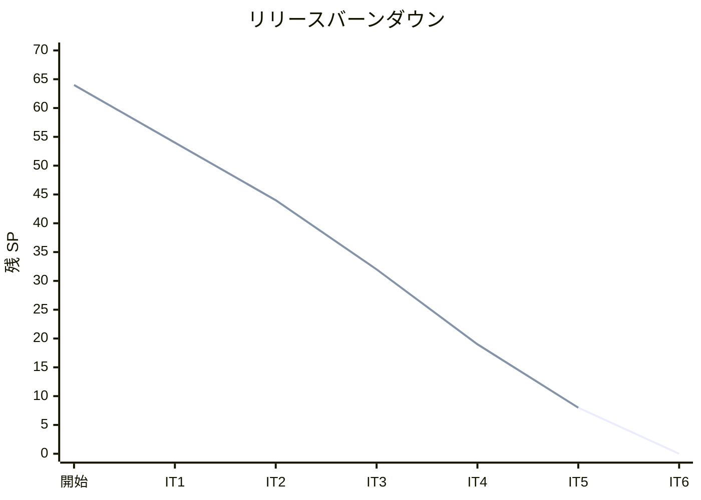
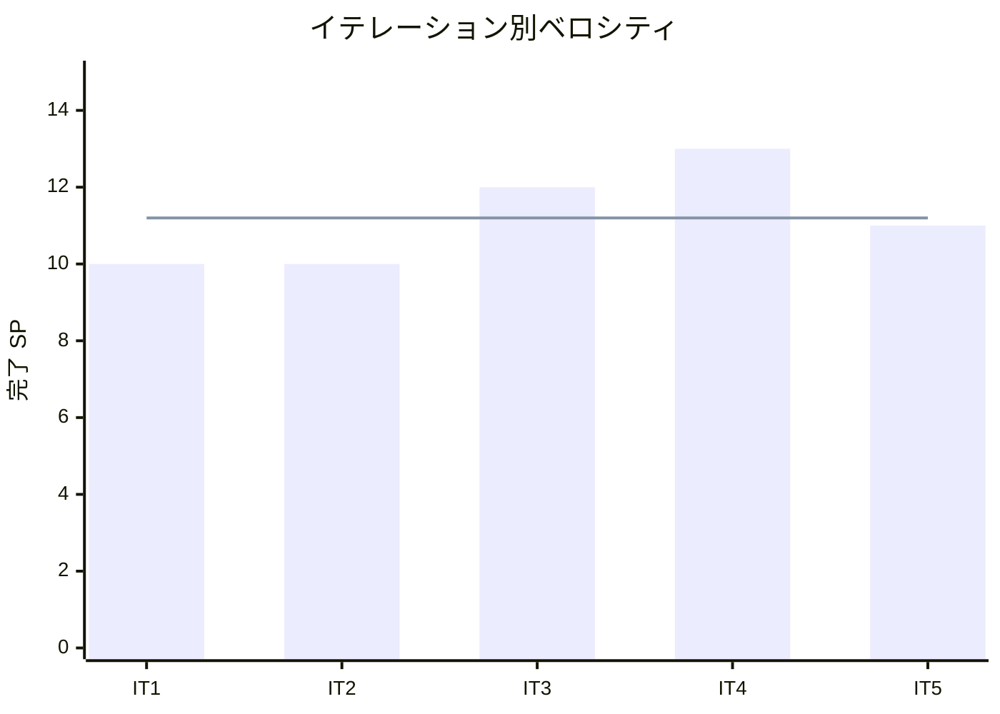

# イテレーション 5 完了報告書

## 1. プロジェクト概要

| 項目 | 内容 |
|------|------|
| イテレーション番号 | 5 |
| 計画期間 | 2026-05-26 〜 2026-06-08 |
| 実績期間 | 2026-04-03 |
| ゴール | 例外処理（遅延・破損・紛失）で Phase 1 を完結させ、輸送料金算出（Phase 2 開始）を実装する |

## 2. 要員

| 名前 | 予定作業日数 | 実績作業日数 |
|------|--------------|--------------|
| Copilot | 5 | 1 |

## 3. 指標

### ベロシティ

| 項目 | 値 |
|------|-----|
| 計画 SP | 11 |
| 実績 SP | 11 |
| 達成率 | 100% |

### リリースバーンダウン

### ベロシティ推移

## 4. テスト結果

| メトリクス | Backend | Frontend |
|-----------|---------|----------|
| テスト数 | 449 / 449 通過 | 該当なし |
| カバレッジ（instruction） | 90.7% | 該当なし |
| E2E テスト | 17 シナリオ全通過 | — |

### テスト増分（前イテレーション比）

| メトリクス | IT4 実績 | IT5 実績 | 増分 |
|-----------|----------|----------|------|
| Backend テスト数 | 361 | 449 | +88 |
| カバレッジ（instruction） | 90% | 90.7% | +0.7% |

### テスト累計推移

| イテレーション | Backend テスト数 | E2E シナリオ（目安） |
|---------------|------------------|---------------------|
| IT1 | 113 | 9 |
| IT2 | 239 | 17 |
| IT3 | 278 | 26 |
| IT4 | 361 | 26+ |
| IT5 | 449 | 17（E17 追加） |

## 5. SonarQube Quality Gate

| プロジェクト | カバレッジ（instruction） | Violations（new） | 結果 |
|------------|--------------------------|-------------------|------|
| cargo-tracker | 90.7% | 0 | PASS ✅ |

## 6. 実施内容と評価

### ストーリー別完了状況

| ストーリー | 結果 | 予定ポイント | ベロシティ加算ポイント |
|-----------|------|-------------|------------------------|
| US14 遅延例外を処理する | 完了 | 3 | 3 |
| US15 破損・紛失例外を処理する | 完了 | 3 | 3 |
| US16 輸送料金を算出する | 完了 | 5 | 5 |
| 合計 |  | 11 | 11 |

### 受入条件達成状況

#### US14: 遅延例外を処理する

- [x] 追跡番号と例外種別「遅延」・発生状況（場所・日時・理由）を記録できる
- [x] 記録後、貨物状態が「例外発生」に更新される
- [x] 荷主に遅延発生の通知が送信される（Phase 1 では通知ログとして記録）
- [x] 対応内容（新しい到着予定日・対応方針）は記録時に同時入力する（記録のみ）
- [x] 例外対応履歴が記録される

#### US15: 破損・紛失例外を処理する

- [x] 追跡番号と例外種別「破損」または「紛失」・発生状況を記録できる
- [x] 記録後、貨物状態が「例外発生」に更新される
- [x] 例外種別「紛失」の場合、緊急フラグが設定されて管理職への escalation 通知が送信される（Phase 1 ではログ記録）
- [x] 荷主に破損・紛失発生の通知が送信される（Phase 1 ではログ記録）
- [x] 対応内容（補償方針等）は記録時に同時入力する（記録のみ）
- [x] 例外対応履歴が記録される

#### US16: 輸送料金を算出する

- [x] 「引取済」状態の予約に対して料金算出を開始できる
- [x] 輸送実績（経路・重量・貨物種別・荷役作業実績）が表示される
- [x] 基本料金が自動計算される（重量 × 単価 × 距離係数）
- [x] 算出結果を確認して確定操作ができる
- [x] 確定後、輸送料金が「確定」状態で登録される
- [x] 例外（遅延・破損等）が発生している場合、料金調整（減額・補償費用）の入力ができる

### レイヤー別実装要約

- **ドメイン（exception BC）**: `CargoException`（集約ルート）・`ExceptionType`（DELAY / DAMAGE / LOSS）・`ExceptionId`（値オブジェクト）・`CargoExceptionRepository` を実装。`isUrgent()` メソッドで LOSS 種別の緊急フラグを自動設定する業務ロジックを実装しました。
- **ドメイン（billing BC）**: `FreightCharge`（集約ルート）・`FreightCalculationService`（重量 × 単価 × 距離係数のドメインサービス）・`ChargeStatus`（DRAFT / CONFIRMED）・`FreightChargeId` を実装しました。
- **アプリケーション（exception BC）**: `RecordCargoExceptionCommandService`（追跡番号存在確認・貨物状態「例外発生」更新）を実装しました。
- **アプリケーション（billing BC）**: `CalculateFreightCommandService`（`FreightBookingQueryPort` 経由の引取済み予約確認・料金算出・DRAFT 保存）と `ConfirmFreightChargeCommandService`（CONFIRMED への状態遷移）を実装しました。
- **インフラ**: Flyway migration V010（`cargo_exceptions`）・V011（`freight_charges`）・V012（`handling_events` 引取確認コード追加）、MyBatis マッパー（`CargoExceptionMapper`・`FreightChargeMapper`）、`FreightBookingQueryPortAdapter`（booking BC との ACL アダプター：CONFIRMED + RECEIVE 存在チェック）を実装しました。
- **プレゼンテーション（Web）**: 遅延例外登録（`/exceptions/delay`）・破損例外（`/exceptions/damage`）・紛失例外（`/exceptions/loss`）・輸送料金一覧（`/billing`）・輸送料金算出（`/billing/calculate`）の各画面を実装しました。
- **プレゼンテーション（REST API）**: `POST /api/v1/cargo-exceptions`・`GET /api/v1/cargo-exceptions`・`POST /api/v1/freight-charges`・`PUT /api/v1/freight-charges/{id}/confirm`・`GET /api/v1/freight-charges/{id}` を実装しました。
- **グローバルナビ**: `fragments/header.html` に「輸送料金」リンクを追加し、全画面からアクセス可能にしました。

## 7. 追加タスク（SP 外）

| タスク | 内容 |
|--------|------|
| SonarQube Code Smell 修正 | Java 21 unnamed pattern `_`・`HttpStatus.UNPROCESSABLE_CONTENT`・assertThat チェーン化・inner import 除去など 16 ファイルを修正し Quality Gate PASS を達成 |
| UI/UX レビュー指摘対応 | グローバルナビ「輸送料金」リンク追加・`<h4>` → `<h1 class="h4">` 変更・`table-responsive` ラッパー追加・確定ボタン動的 `aria-label` 追加 |
| レビュー指摘対応（H1〜H9） | アーキテクチャ・テスト・コード品質レビュー指摘 9 件への対応 |
| E2E テスト修正 | `US16E2ETest` に RECEIVE 荷役イベント登録ステップを追加し、`FreightBookingQueryPortAdapter` の前提条件と整合 |
| FreightBookingQueryPortAdapter ユニットテスト | RECEIVE あり／なしのケースをカバーするユニットテストを新規追加 |

## 8. E2E テスト結果

### 新規追加シナリオ

| シナリオ | 結果 |
|---------|------|
| E15: 追跡番号で遅延例外を記録し、貨物状態が「例外発生」になる | ✅ 通過 |
| E16: 紛失例外を記録し、緊急フラグが設定される | ✅ 通過 |
| E17: 引取済み予約の輸送料金を算出して確定する | ✅ 通過 |

### リグレッション結果

既存 E1〜E14 シナリオ（認証・荷主登録・予約・ルート検索・確定・追跡番号発行・荷役記録・追跡照会）はすべて通過。

## 9. フェーズ・累計進捗

### Phase 1 進捗（IT5 完了）

| ストーリー | 計画 SP | 完了 SP | 状態 |
|-----------|---------|---------|------|
| US02 荷主を登録する | 3 | 3 | 完了 ✅ |
| US03 法人荷主を登録する | 2 | 2 | 完了 ✅ |
| US04 貨物予約を登録する | 5 | 5 | 完了 ✅ |
| US01 輸送見積を作成する | 5 | 5 | 完了 ✅ |
| US06 最適ルートを検索する | 5 | 5 | 完了 ✅ |
| US05 危険物・冷凍貨物の予約登録 | 3 | 3 | 完了 ✅ |
| US07 ルートを選択して予約に紐付ける | 3 | 3 | 完了 ✅ |
| US08 予約を確定する | 3 | 3 | 完了 ✅ |
| US09 追跡番号を発行する | 3 | 3 | 完了 ✅ |
| US10 荷役作業を記録する | 3 | 3 | 完了 ✅ |
| US11 引取作業を記録する | 3 | 3 | 完了 ✅ |
| US12 貨物状態を手動更新する | 2 | 2 | 完了 ✅ |
| US13 追跡情報を照会する | 5 | 5 | 完了 ✅ |
| US14 遅延例外を処理する | 3 | 3 | 完了 ✅ |
| US15 破損・紛失例外を処理する | 3 | 3 | 完了 ✅ |
| **Phase 1 合計** | **51** | **51** | **100%** ✅ |

### Phase 2 進捗（IT5 開始）

| ストーリー | 計画 SP | 完了 SP | 状態 |
|-----------|---------|---------|------|
| US16 輸送料金を算出する | 5 | 5 | 完了 ✅ |
| US17 法人割引を適用する | 3 | - | 未着手 |
| US18 精算を処理する | 5 | - | 未着手 |
| **Phase 2 合計** | **13** | **5** | **38.5%** |

### 全体累計進捗

| 項目 | 値 |
|------|----|
| 全体計画 SP | 64 |
| 累計完了 SP | 56 |
| 全体達成率 | 87.5% |
| 完了イテレーション | IT1・IT2・IT3・IT4・IT5 |
| 実績ベロシティ平均 | 11.2 SP（IT1: 10 / IT2: 10 / IT3: 12 / IT4: 13 / IT5: 11） |

## 10. IT6 への引き継ぎ事項

- **残ストーリー**: US17（法人割引・3 SP）・US18（精算処理・5 SP）で Phase 2 完結 → v1.0.0 リリース
- **billing BC パターン**: `FreightBookingQueryPortAdapter` の ACL アダプターパターン（CONFIRMED + RECEIVE 条件）を IT6 実装でも踏襲すること
- **E2E テスト前の DTO 確認**: リクエスト必須フィールドを DTO から確認してからテストデータを作成するルールを適用すること
- **コミット前テスト確認**: staged 変更をコミットする前に `./gradlew test` で全件 GREEN を確認すること
- **分岐カバレッジ**: IT5 で未計測 → IT6 では DoD（完了定義）に「分岐カバレッジ 75% 以上」を含める
- **UI/UX 積み残し**: UUID 入力の荷主選択 UI 改善・確定ボタン確認ダイアログ・通貨記号表示は IT6 backlog として管理

## 11. ふりかえりへのリンク

詳細は [イテレーション 5 ふりかえり](./retrospective-5.md) を参照。

## 12. 更新履歴

| 日付 | 更新内容 | 更新者 |
|------|---------|--------|
| 2026-04-03 | IT5 完了報告書を作成 | Copilot |
