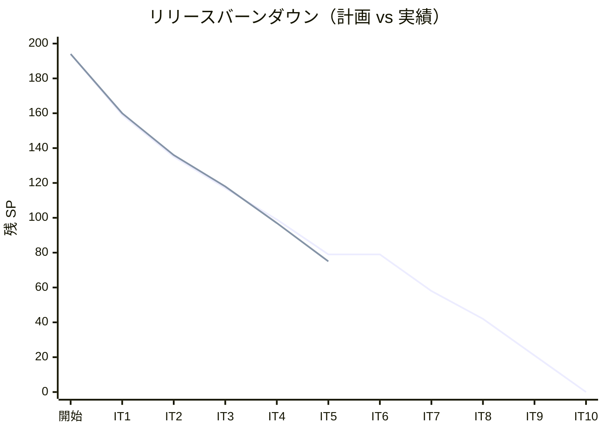
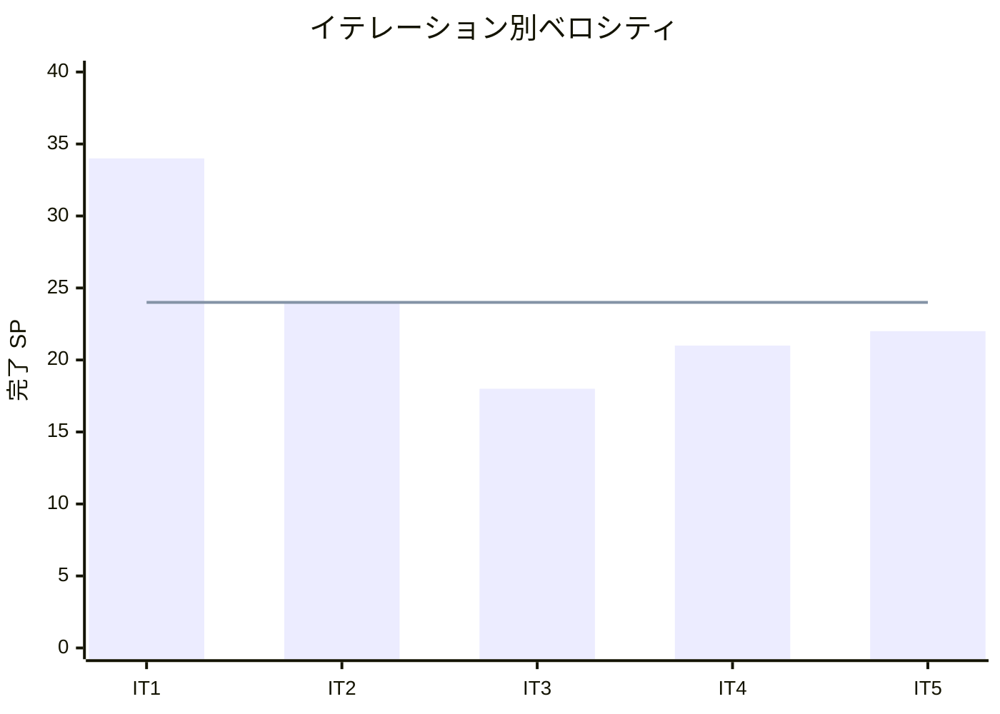

# イテレーション 5 完了報告書

## プロジェクト概要

| 項目 | 内容 |
|------|------|
| **イテレーション** | 5 |
| **ゴール** | 追跡照会・予約引渡・経路通知の API + 画面を実装し、IT4 コードレビュー高優先度指摘（追跡番号生成・例外クラス導入）を解消する |
| **計画期間** | 2026-06-23〜2026-07-04（2 週間） |
| **実績期間** | 2026-05-09（IT4 完了後、同日着手・完了） |

### 要員

| 名前 | 予定作業日数 | 実績作業日数 |
|------|------------|------------|
| 開発者（+ AI ペアプログラミング / Codex 分業） | 10 | 10 |

---

## 指標

### ベロシティ

| 項目 | 値 |
|------|-----|
| 計画 SP | 22 |
| 実績 SP | 22 |
| 達成率 | 100% |
| 1 SP あたり理想時間 | 約 1.4h |

### リリースバーンダウンチャート

### ベロシティチャート

---

## テスト結果

### テスト概要

| メトリクス | Backend | Frontend |
|-----------|---------|----------|
| テスト数 | bookingms: 41, trackingms: 30 | 35 全通過 |
| 結果 | 全通過 | 全通過 |

### テスト増分

| 項目 | IT4 実績 | IT5 実績 | 増分 |
|------|---------|---------|------|
| Backend テスト数（bookingms） | 41 | 41 | 0 |
| Backend テスト数（trackingms） | 30 | 30 | 0 |
| Frontend テスト数 | 26 | 35 | +9 |

### テスト累計推移

| イテレーション | Backend bookingms | Backend trackingms | Frontend | 合計 |
|--------------|---------|---------|-----|-----|
| IT1（完了） | 20 | — | 20 | 40 |
| IT2（完了） | 26 | — | 20 | 46 |
| IT3（完了） | 26 | — | 20 | 46 |
| IT4（完了） | 41 | 30 | 26 | 97 |
| IT5（完了） | 41 | 30 | 35 | 106 |

---

## SonarQube Quality Gate

| プロジェクト | Bug | Vulnerability | Code Smell | new_violations | 重複率 | 状態 |
|------------|-----|---------------|------------|----------------|--------|------|
| cargo-tracker-backend | 0 | 0 | 0 | 0 | 1.06% | PASS |
| cargo-tracker-frontend | 0 | 0 | — | 0 | — | PASS |

---

## 実施内容と評価

### ストーリー完了状況

| ID | ユーザーストーリー | 計画 SP | 実績 SP | 結果 |
|----|-----------------|--------|--------|------|
| TI02 | IT4 コードレビュー高優先度指摘解消 | 2 | 2 | 完了 |
| US18 | 追跡情報を照会する | 10 | 10 | 完了 |
| US06 | 予約情報を経路設計者に引き渡す | 5 | 5 | 完了 |
| US12 | 確定経路を荷主に通知する | 5 | 5 | 完了 |
| **合計** | | **22** | **22** | |

### 受入条件達成状況

#### TI02: IT4 コードレビュー高優先度指摘解消

- [x] [H1] `TrackingNumber` 生成を DB SEQUENCE ベースに変更し一意性を保証
- [x] [H2] `TrackingNumber` バリデーションに `TRK-\d{6}` 正規表現チェックを追加
- [x] [H3] `TrackingActivityNotFoundException` を導入し文字列比較による分岐を排除
- [x] [H4] `TrackingNumberController` のエラー時に `ErrorResponse` を返却

#### US18: 追跡情報を照会する

- [x] 追跡番号を入力して貨物情報を照会できる
- [x] 現在の状態・位置（港湾名）・推定到着日が表示される
- [x] 追跡イベント履歴（日時・場所・作業種別）が時系列で表示される
- [x] 追跡番号が存在しない場合、「追跡番号が見つかりません」と表示される
- [x] 照会は読み取り専用であり、状態を変更しない
- [x] 30 秒ごとに自動更新される（`refetchInterval: 30000`）
- [x] 例外（ExceptionType）が存在する場合は赤色バッジで表示される

#### US06: 予約情報を経路設計者に引き渡す

- [x] 予約番号を指定して予約情報（出発地・目的地・期限・貨物仕様）を確認できる
- [x] 経路設計依頼を実行すると、予約状態が「経路設計中」に更新される
- [x] 経路設計者に経路設計依頼の通知が送信される（`CargoAssignedForRoutingEvent`）

#### US12: 確定経路を荷主に通知する

- [x] 予約番号を指定して紐付けられた経路情報を確認できる
- [x] 荷主への経路通知を送信できる（stub 実装: ログ出力のみ）
- [x] `ShipperNotificationPort` インターフェースで実装を差し替え可能

### 実装内容サマリー

#### TI02: 技術的改善

- DB SEQUENCE（`V2__add_sequence.sql`）による追跡番号の一意生成
- `TrackingActivityNotFoundException` 専用例外クラスの新設（`domain.exceptions` パッケージ）
- CQRS パターン導入: `TrackingQueryService`（読み取り専用クエリサービス）

#### US18: 追跡照会

- BE: `TrackingQueryService` + GET エンドポイントのクエリ専用ハンドラ
- FE: `TrackingPage.tsx`（追跡番号入力 → 状態・履歴・例外バッジ表示）
- FE: `useTrackingQuery` フック（TanStack Query、`refetchInterval: 30000`）

#### US06: 予約引渡

- BE: `CargoCommandService.confirmBooking` でのイベント発行ロジック
- BE: `CargoAssignedForRoutingEvent` ドメインイベントクラス
- FE: `RoutingAssignmentPage.tsx`（経路設計担当一覧画面）

#### US12: 経路通知

- BE: `ShipperNotificationPort` インターフェース
- BE: `RouteAssignedNotificationService`（stub: ログ出力のみ）
- FE: `BookingDetailPage` に「通知送信済み」バッジ表示

#### 品質改善

- `CargoCommandServiceTest` の SonarQube Code Smell 解消

---

## フェーズ・累計進捗

### Phase 1 進捗

| ID | ストーリー | SP | 状態 |
|----|-----------|----|----|
| US26/US27/US24/US25/US07（IT1） | 認証・航海スケジュール | 34 | 完了 |
| US04/US08（IT2） | 貨物予約・経路算出 | 24 | 完了 |
| US09/US11/US13（IT3） | 経路確定・予約確定 | 18 | 完了 |
| US14/US15/US17/TI01（IT4） | 追跡管理・品質改善 | 21 | 完了 |
| US18/US06/US12/TI02（IT5） | 追跡照会・通知・品質改善 | 22 | 完了 |
| **Phase 1 合計** | | **119** | |

### 累計進捗

| イテレーション | 計画 SP | 実績 SP | 達成率 | 累計完了 SP | 状態 |
|--------------|--------|--------|--------|------------|------|
| IT1 | 24 | 34 | 142% | 34 | 完了 |
| IT2 | 24 | 24 | 100% | 58 | 完了 |
| IT3 | 18 | 18 | 100% | 76 | 完了 |
| IT4 | 21 | 21 | 100% | 97 | 完了 |
| IT5 | 22 | 22 | 100% | 119 | 完了 |
| IT6（予定） | — | — | — | — | 未着手 |

---

## ふりかえり

詳細は [イテレーション 5 ふりかえり](./retrospective-5.md) を参照。

---

## 更新履歴

| 日付 | 更新内容 | 更新者 |
|------|---------|--------|
| 2026-05-09 | 初版作成（IT5 完了時） | - |
