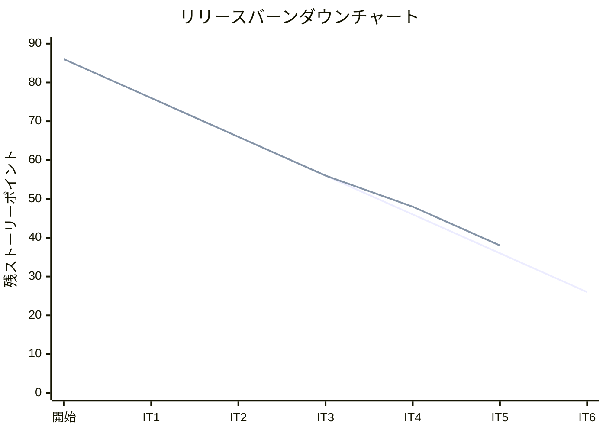
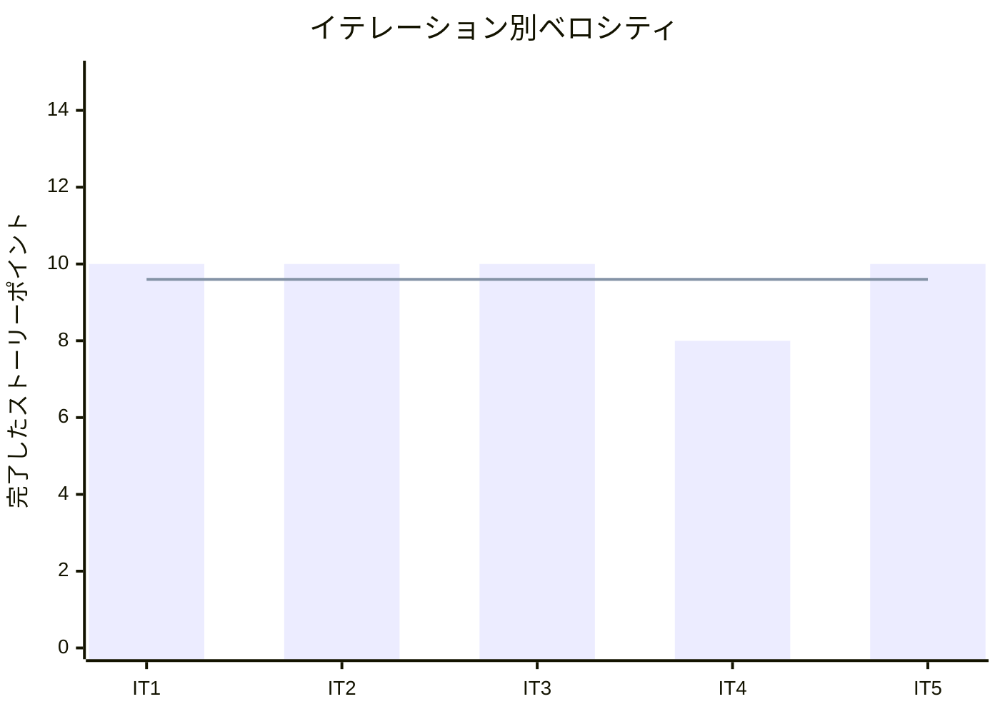

# イテレーション 5 完了報告書

## プロジェクト概要

### 日程

| 項目 | 値 |
|------|-----|
| イテレーション開始日 | 2026-04-09 |
| イテレーション終了日 | 2026-04-09（計画 2026-05-06） |
| 計画期間 | 2026-04-23 〜 2026-05-06（2 週間） |
| 実績作業日数 | 1 日（AI ペアプログラミングにより大幅短縮） |

### 要員

| 名前 | 予定作業日数 | 実績作業日数 |
|------|-------------|-------------|
| 開発者 + AI ペア | 10 | 1 |

---

## 指標

### ビルド結果

| 項目 | 結果 |
|------|------|
| Java テスト | 250 件全パス（IT4: 217 件から +33 件） |
| Playwright E2E テスト | 56 件全パス（IT4: 40 件から +16 件） |
| 命令カバレッジ (JaCoCo) | **88%**（IT4: 91% から -3%。`CargoItinerary`・`Leg` 追加による分母増加） |
| ブランチカバレッジ (JaCoCo) | **75%**（IT4 と同水準。目標 80% に対し部分達成） |
| SonarQube Quality Gate | **PASS**（IT5 冒頭で初回達成。4 イテレーション連続未確認を解消） |

### イテレーションバーンダウン

> **注**: IT5 実績は 10 SP 完了のため残 SP = 48 - 10 = 38。

### ベロシティ

| 項目 | 値 |
|------|-----|
| 計画ベロシティ | 10 SP/イテレーション |
| IT5 実績ベロシティ | 10 SP |
| 累計実績ベロシティ | 48 SP（IT1: 10 + IT2: 10 + IT3: 10 + IT4: 8 + IT5: 10） |
| 平均ベロシティ（IT1-5） | 9.6 SP/イテレーション |
| 1 SP あたり実績 | 約 3.7h（IT4 実績: 3.8h） |

---

## 実施内容と評価

| ストーリー | 結果 | 予定ポイント | ベロシティ加算ポイント |
|-----------|------|-------------|---------------------|
| IT4-改善: SonarQube・状態ガード抽出・ナビ順序変更 | 完了 | 2 | 2 |
| US09: 経路を選択・確定する | 完了 | 3 | 3 |
| US10: 経路条件を調整して再算出する | 完了 | 3 | 3 |
| US11: 経路情報を予約に紐付ける | 完了 | 2 | 2 |
| **合計** | | **10** | **10** |

### 成果物一覧

| カテゴリ | 成果物 | 件数 |
|---------|--------|------|
| ドメインモデル（Booking Context） | `CargoItinerary`（値オブジェクト）、`Leg`（値オブジェクト） | 2 クラス |
| ドメインモデル拡張 | `Cargo.assignItinerary()`・`Cargo.requireStatus()` 追加 | 2 メソッド |
| アプリケーション | `RouteCargoCommand`（record）、`RouteCargoService` | 2 クラス |
| インフラ（Booking） | `MyBatisLegRepository` 実装、`LegMapper.java` + `LegMapper.xml` | 3 ファイル |
| データベース | V9 Flyway マイグレーション（`leg` テーブル新規作成） | 1 ファイル |
| プレゼンテーション | `BookingThymeleafController` 拡張（`routeForm`・`routeDetail`・`assignRoute`）、`route.html` 新規 | 2 ファイル |
| テスト（Java） | `CargoTest`（`assignItinerary` テスト追加）、`BookingThymeleafControllerTest`（経路関連追加）、`RouteCargoServiceTest` | 複数 |
| テスト（E2E） | `BookingRoutePage.ts` Page Object 新規、`booking.spec.ts` +17 件、`navigation.spec.ts` ナビ順序更新 | 3 ファイル |
| ドキュメント | `IT5_review_20260409.md`（5 エージェント並列レビュー結果）、`retrospective-5.md` | 2 ファイル |

---

## IT4 申し送り対応状況

### IT4 高優先度申し送り

| # | 内容 | 状態 |
|---|------|------|
| 1 | SonarQube スキャン実行・Quality Gate 確認（4 イテレーション連続未実施） | ✓ 完了（PASS 達成） |
| 2 | US09: 経路を選択・確定する | ✓ 完了 |
| 3 | US10: 経路条件を調整して再算出する | ✓ 完了 |

### IT4 中優先度申し送り

| # | 内容 | 状態 |
|---|------|------|
| 4 | `Cargo` の状態遷移ガード処理を `requireStatus()` メソッドへ抽出 | ✓ 完了（`requireStatus(BookingStatus)` として実装） |
| 5 | `BookingThymeleafController` の try-catch パターンを共通メソッドへ抽出 | ✓ 完了（`executeBookingCommand` パターン） |
| 6 | ナビゲーション順序を業務フロー順に変更（見積管理→予約管理→荷主管理→航路管理） | ✓ 完了 |
| 7 | E2E テストに Voyage 検索・見積作成フォームの異常系シナリオを追加 | ✗ 持ち越し（IT6 中優先） |
| 8 | US07 受入条件 6（危険物・冷凍貨物フィルタ）の実装 | ✗ 持ち越し |

### IT4 低優先度申し送り（IT5 未対応→IT6 持ち越し）

| # | 内容 | 状態 |
|---|------|------|
| 9 | テスト命名規則の統一 | ✗ 持ち越し |
| 10 | `estimation.spec.ts` ロケータを `data-testid` に変更 | ✗ 持ち越し |
| 11 | `getDurationDays()` 等のプレゼンテーション支援メソッドを DTO レイヤーへ移動 | ✗ 持ち越し |

---

## 受入条件の達成状況

### IT4-改善（SonarQube・状態ガード抽出・ナビ順序変更）

| # | 受入条件 | 状態 |
|---|---------|------|
| 1 | SonarQube ローカルスキャンを実行し Quality Gate PASS を確認できる | ✓ 完了 |
| 2 | `Cargo.requireStatus()` が抽出され、状態遷移ガードが 1 箇所に集約されている | ✓ 完了 |
| 3 | ナビゲーション順序が業務フロー順（見積管理→予約管理→荷主管理→航路管理）に変更されている | ✓ 完了 |

### US09: 経路を選択・確定する

| # | 受入条件 | 状態 |
|---|---------|------|
| 1 | 経路候補一覧（経由港・所要日数・費用・航海番号）を確認できる | △ 部分達成（費用情報が未表示。IT6 で対応） |
| 2 | 最適な経路候補を 1 件選択できる | ✓ 完了（ラジオボタン選択） |
| 3 | 選択後、経路状態が「確定」になる | ✓ 完了（`ROUTE_PROPOSED` に遷移） |
| 4 | 最適な候補がない場合、経路条件調整（US10）に進める | ✓ 完了（「条件変更して再検索」フォーム） |

### US10: 経路条件を調整して再算出する

| # | 受入条件 | 状態 |
|---|---------|------|
| 1 | 経路割り当て画面で検索条件（期限・出発地・目的地）を変更して再検索できる | ✓ 完了 |
| 2 | 変更後の条件で経路候補が再算出されて表示される | ✓ 完了 |
| 3 | 条件変更後も推奨順（直行便優先・所要日数昇順）で候補が表示される | ✓ 完了 |
| 4 | 条件を満たす候補がない場合、その旨が表示される | ✓ 完了（「該当する航路はありません」メッセージ） |

### US11: 経路情報を予約に紐付ける

| # | 受入条件 | 状態 |
|---|---------|------|
| 1 | 確定経路と予約番号を確認できる | △ 部分達成（予約詳細画面への経路情報表示が未実装。IT6 で対応） |
| 2 | 経路情報を予約に紐付ける操作を実行できる | ✓ 完了（`POST /bookings/{bookingId}/route`） |
| 3 | 紐付け後、予約状態が「経路提案中」（`ROUTE_PROPOSED`）に更新される | ✓ 完了 |

---

## テスト結果

### テスト増分

| 種別 | IT4 完了時 | IT5 完了時 | 増分 |
|------|-----------|-----------|------|
| Java テスト（実行件数） | 約 217 件 | 250 件 | +33 件 |
| Playwright E2E テスト | 40 件 | 56 件 | +16 件 |
| 命令カバレッジ | 91% | **88%** | -3%（分母増加） |
| ブランチカバレッジ | 75% | **75%** | ±0% |

### IT5 新規追加テストクラス・メソッド

| テストクラス / ファイル | 追加内容 | 件数 |
|----------------------|--------|------|
| `CargoTest` | `assignItinerary` 正常系・ステータス検証・異常系（未確認ステータス拒否） | +数件 |
| `RouteCargoServiceTest` | 経路割り当てサービスの正常系・異常系ユニットテスト | 新規 |
| `BookingThymeleafControllerTest` | 経路割り当て画面表示・PRG リダイレクト・経路割り当て成功 | +数件 |
| `booking.spec.ts` | US09・US10・US11・経路割り当て画面ナビゲーション | +17 件 |
| `navigation.spec.ts` | ナビバー順序テスト（見積管理→予約管理→荷主管理→航路管理）更新 | 更新 |

### テスト累計推移

| イテレーション | Java テスト（実行件数） | E2E テスト | 命令カバレッジ | ブランチカバレッジ |
|--------------|----------------------|-----------|--------------|-----------------|
| IT1 | 60 件 | 27 件 | 89% | - |
| IT2 | 166 件 | 31 件 | 93% | 81% |
| IT3 | 約 184 件 | 41 件 | 未計測 | 未計測 |
| IT4 | 約 217 件 | 40 件 | 91% | 75% |
| **IT5** | **250 件** | **56 件** | **88%** | **75%** |

---

## E2E テスト結果

### IT5 新規追加シナリオ（booking.spec.ts）

| # | テスト記述 | ファイル | 結果 |
|---|----------|---------|------|
| 1 | 経路を割り当てることができる（US09 正常系） | booking.spec.ts | ✓ 通過 |
| 2 | 経路割り当て画面に経路候補一覧が表示される | booking.spec.ts | ✓ 通過 |
| 3 | 「経路を割り当て」リンクから経路割り当て画面に遷移できる | booking.spec.ts | ✓ 通過 |
| 4 | 経路割り当て後、ステータスが「経路提案済」に変わる | booking.spec.ts | ✓ 通過 |
| 5 | 経路条件を変更して再検索できる（US10 正常系） | booking.spec.ts | ✓ 通過 |
| 6 | 期限を変更すると候補が再算出される | booking.spec.ts | ✓ 通過 |
| 7 | 条件を変更しても検索条件が保持される | booking.spec.ts | ✓ 通過 |
| 8 | 条件を満たす候補がない場合、メッセージが表示される | booking.spec.ts | ✓ 通過 |
| 9 | 経路情報を予約に紐付けることができる（US11 正常系） | booking.spec.ts | ✓ 通過 |
| 10 | 紐付け後に予約詳細画面に戻る | booking.spec.ts | ✓ 通過 |
| 11 | 紐付け後、経路提案済バッジが表示される | booking.spec.ts | ✓ 通過 |
| 12 | 経路割り当て画面でナビバーが表示される | booking.spec.ts | ✓ 通過 |
| 13 | 経路割り当て画面からナビバーで予約管理に遷移できる | booking.spec.ts | ✓ 通過 |
| 14 | 経路割り当て画面からナビバーで荷主管理に遷移できる | booking.spec.ts | ✓ 通過 |
| 15 | 経路割り当て画面から「詳細へ戻る」リンクで予約詳細に戻れる | booking.spec.ts | ✓ 通過 |
| 16 | 経路割り当て画面でログアウトできる | booking.spec.ts | ✓ 通過 |
| 17 | ナビバーのリンク順序が「見積管理→予約管理→荷主管理→航路管理」に更新済み | navigation.spec.ts | ✓ 通過 |

### リグレッションテスト

| ファイル | テスト数 | 結果 |
|---------|---------|------|
| auth.spec.ts | 4 | ✓ 全件通過 |
| booking.spec.ts | 25（IT4: 10 + IT5: +15） | ✓ 全件通過 |
| estimation.spec.ts | 4 | ✓ 全件通過 |
| shipper.spec.ts | 5 | ✓ 全件通過 |
| navigation.spec.ts | 13 | ✓ 全件通過 |
| voyage.spec.ts | 5 | ✓ 全件通過 |
| **合計** | **56** | **✓ 全件通過** |

---

## フェーズ・累計進捗

### Phase 2 進捗

| ユーザーストーリー | SP | 状態 |
|-----------------|-----|------|
| US01: 輸送見積を作成する | 5 | ✓ 完了（IT3） |
| US06: 予約情報を経路設計者に引き渡す | 2 | ✓ 完了（IT3） |
| US07: 航海スケジュールを検索する | 5 | ✓ 完了（IT4） |
| US08: 経路候補を算出する（基本実装） | 3 | ✓ 完了（IT4） |
| US09: 経路を選択・確定する | 3 | ✓ 完了（IT5）※ AC1 費用情報は IT6 で対応 |
| US10: 経路条件を調整して再算出する | 3 | ✓ 完了（IT5） |
| US11: 経路情報を予約に紐付ける | 2 | ✓ 完了（IT5）※ AC1 詳細表示は IT6 で対応 |
| US12: 確定経路を荷主に通知する | 2 | 未着手（IT6 検討） |
| US14: 追跡番号を発行する | 3 | 未着手 |
| US15: 荷役作業を記録する | 5 | 未着手 |
| US16: 引取作業を記録する | 3 | 未着手 |
| US18: 追跡情報を照会する | 3 | 未着手 |

**Phase 2 進捗**: 23 / 44 SP 完了（52%）

### 全体累計進捗

| フェーズ | 計画 SP | 完了 SP | 達成率 |
|---------|---------|---------|--------|
| Phase 1（予約・荷主管理基盤） | 16 | 16 | 100% |
| Phase 2（経路設計・追跡） | 44 | 23 | 52% |
| Phase 3（精算・例外処理） | 26 | 0 | 0% |
| **合計** | **86** | **39** | **45%** |

---

## ふりかえり

詳細は [イテレーション 5 ふりかえり](./retrospective-5.md) を参照。

---

## 更新履歴

| 日付 | 更新内容 | 更新者 |
|------|---------|--------|
| 2026-04-09 | 初版作成 | - |
