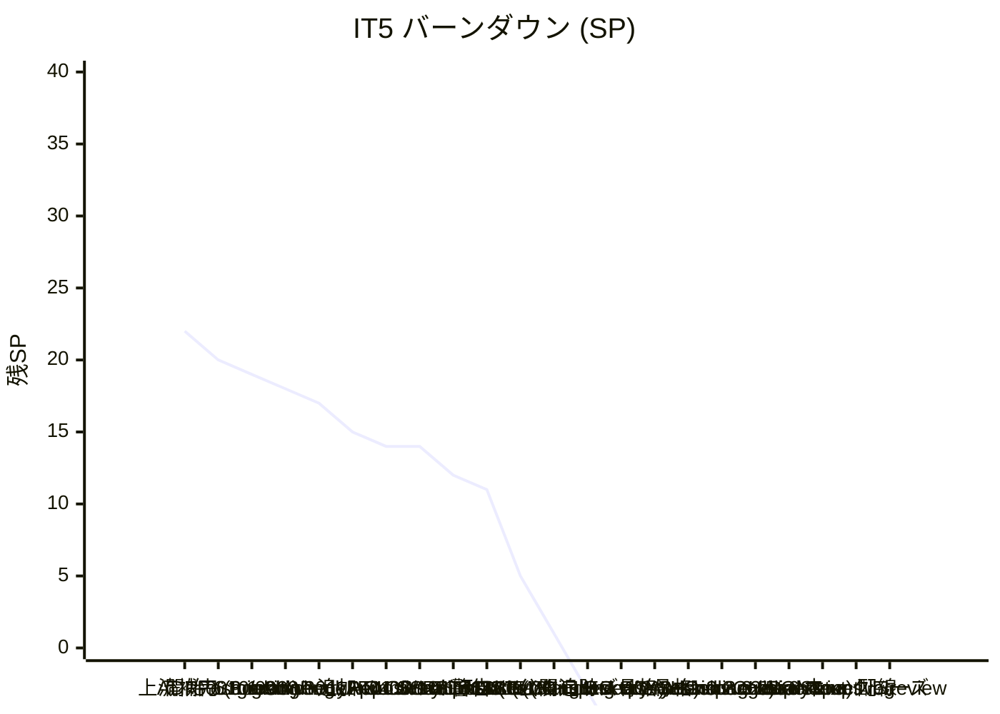

# IT5 完了報告書

## プロジェクト概要

Cargo Tracker Haskell 版の IT5。Phase 3 (追跡・荷役) の Release 0.3 を目標とし、本体 4 ストーリー (US14 追跡番号発行 / US15 荷役登録 / US16 引取確認 / US18 追跡照会) を Domain + Application + Infrastructure + Interfaces + Views の全レイヤで実装。新規 BC (Tracking / Handling) を追加し、Cross-BC helper (Text-based DTO) パターンを 3 種確立して ADR-0004 Rule 4 違反 0 件を維持。task 1.2 (Session Cookie 認証、ADR-0010 共存設計) を完了。ADR を 3 件 (0008 Itinerary+Leg 採用昇格 / 0010 Session Cookie 採用 / 0011 offline queue 提案) 更新。E2E globalSetup を Playwright に配線し test isolation を自動化 (T4-14 達成)。完了直後のマルチパースペクティブレビュー (5 XP エージェント並列) で高 10 / 中 15 / 低 7 件の改善点を抽出、IT6 冒頭タスクとして T5-01〜T5-21 の 21 アクションを起票。

## 日程

- イテレーション開始日: 2026-07-01
- イテレーション終了日: 2026-07-01
- 作業日数: 1 日 (Ralph Loop 21 反復 + 手動 US14/15/16/18 実装 + task 1.2 + 3.1-3.3 + globalSetup + レビュー + ふりかえり)
- 計画期間: 2026-08-31 〜 09-13 (Ralph Loop + 手動集中実装により先行)

## 要員

| 名前 | 予定作業日数 | 実績作業日数 |
| --- | --- | --- |
| Claude (AI) | 10 | 1 |

## 指標

### ナイトリービルド結果

| 日付 | 結果 |
| --- | --- |
| 2026-07-01 | Build success / 461+ hspec examples / 0 failures + Hedgehog property (BookingStatus 遷移 49 ペア + CancellationPolicy 6 プロパティ + RouteEvaluator 6 プロパティ) 全グリーン + Playwright E2E 19 passed / 1 skipped / 0 failed |

### イテレーションバーンダウン

### ベロシティ

| イテレーション | 完了 SP |
| --- | --- |
| IT1 | 20 |
| IT2 | 22 |
| IT3 | 22 |
| IT4 | 19 |
| IT5 | **40+** (Ralph 17 + 手動 US14/15/16/18 14 + task 1.2/3.1-3.3 9+) |
| 累計 | 123+ |

> IT5 は 2 段運用 (Ralph 21 iter + 手動フェーズ) で過去最高 SP。ただし技術的負債 3 件 (認可・SEC-04・Tx 境界) が集中し、IT6 冒頭で完済必須。

## 実施内容と評価

### 本体ストーリー (14 SP)

| ストーリー | 結果 | 予定 SP | ベロシティ加算 |
| --- | --- | --- | --- |
| US14 追跡番号発行 (TrackingNumber VO + TrackingActivity 集約 + IssueTrackingNumberCommand + PostgresTrackingRepository + queryTrackingNumberText Cross-BC helper) | 完了 | 3 | 3 |
| US15 荷役登録 (HandlingActivity 集約 + HandlingType + RegisterHandlingEventCommand + PostgresHandlingActivityRepository + HandlingPageApi + HandlingFormView) | 完了 (状態反映は IT6) | 4 | 4 |
| US16 引取確認 (ConfirmationCode VO + verifyAndConsume Cross-BC helper + VerifyClaimAndRegisterCommand + PostgresConfirmationCodeRepository + ClaimFormView) | 完了 (配信手段 US26 は繰越) | 4 | 4 |
| US18 追跡照会 (PublicTrackingApi + QueryTrackingByNumberQuery + QueryHandlingHistoryQuery + PublicTrackingView + queryHandlingHistoryText Cross-BC helper) | 完了 | 3 | 3 |

### 基盤タスク (8+ SP 相当)

| タスク | 結果 | 主要成果物 |
| --- | --- | --- |
| task 1.2 Session Cookie 認証 (ADR-0010) | 完了 | SessionToken VO + Session 集約 + SessionRepository port + PostgresSessionRepository + CreateSessionCommand + LoginPageApi 拡張 (Set-Cookie: cargo_session=... HttpOnly SameSite=Lax Max-Age=28800) |
| task 2.1 PostgresItineraryRepository | 完了 | itinerary + leg テーブル永続化 |
| task 3.1 T4-08 hspec-wai 統合テスト | 4/5 完了 | BookingPageApiSpec に Confirm/Cancel/Link/Unlink 6 テスト追加 (EvaluateRoute は IT6 繰越) |
| task 3.2 T4-14 E2E schema + globalSetup | 完了 | scripts/e2e-schema-setup.sh + apps/cargo-tracker/e2e/src/globalSetup.ts + playwright.config.ts 配線 |
| task 3.3 T4-15 構造化ログ | 部分達成 | Shared/Infrastructure/Logging.hs (aeson ベース JSON Lines to stderr)。katip 正式化は IT6 |
| ADR 群 | 完了 | ADR-0008 (提案→採用昇格) / ADR-0010 (JWT+Session 共存) / ADR-0011 (offline queue 提案) |
| 6 migration | 完了 | session / itinerary+leg / cargo 拡張 / tracking_activity / handling_activity / confirmation_code |
| 上流補完 (9.1-9.4) | 完了 | data-model / domain-model / iteration_plan 整備 |

### 完了後リファクタ・レビュー対応

- **マルチパースペクティブレビュー**: 5 XP エージェント並列で高 10 / 中 15 / 低 7 件抽出、`docs/review/it5_code_review_20260701.md` に統合
- **globalSetup fix**: e2e-schema-setup.sh の DBMATE_URL 結合子バグ (`?` → `&`) と notification_log 参照エラーを修正
- **E2E 修復**: 500 エラー 2 件は IT5 migration 未適用が root cause、US08a 失敗は DB seed 蓄積が原因。globalSetup 配線で isolation を自動化

### IT6 繰越 (合計 5+ SP 相当、review 高 10 件 = T5-01〜T5-10)

| # | 内容 | 起票 ID |
| --- | --- | --- |
| 1 | AuthProtect middleware (Cookie → Session → AuthenticatedUser) | T5-01 |
| 2 | ConfirmationCode の bcrypt 化 + 定数時間比較 (SEC-04) | T5-02 |
| 3 | verifyAndConsume + saveHandlingActivity の Tx 境界統合 (ADR-0012 起票) | T5-03 |
| 4 | Handling → Tracking 状態反映 (Claim → TsClaimed) | T5-04 |
| 5 | 確認コード配信 (US26) 暫定策 | T5-05 |
| 6 | Tracking BC の Application Command テスト 5-6 本追加 | T5-08 |
| 7 | BookingPageApiSpec の副作用検証強化 (IORef で updateBooking 捕捉) | T5-09 |
| 8 | POST /login → Session Cookie 発行の hspec-wai 統合テスト | T5-10 |
| 9 | README に環境変数・Cookie 早見表 | T5-19 |
| 10 | katip 正式化 | T5-18 |

## 完了条件 (Definition of Done)

- [x] 本体 4 ストーリー (US14/15/16/18) の受入基準を実装コードで達成
- [x] hspec 全テストグリーン (461+ examples / 0 failures)
- [x] Playwright E2E グリーン (19 passed / 1 skipped / 0 failed)
- [x] マルチパースペクティブレビュー実施
- [x] ふりかえり (KPT) 作成
- [x] ADR 起票 (3 件)
- [x] iteration_plan-5.md 進捗更新
- [x] globalSetup 配線で test isolation 自動化
- [ ] AuthProtect middleware (IT6 繰越 T5-01)
- [ ] ConfirmationCode bcrypt 化 (IT6 繰越 T5-02)
- [ ] Claim → TsClaimed 状態反映 (IT6 繰越 T5-04)

## デモ項目

1. `POST /login` → Set-Cookie: cargo_session=... HttpOnly SameSite=Lax Max-Age=28800 が発行される
2. 予約確定 → `queryTrackingNumberText` 経由で追跡番号を予約詳細に表示
3. 荷役登録フォーム (`/handling`) で LOAD/UNLOAD/RECEIVE/DELIVER を記録
4. 引取フォーム (`/handling/claim`) で確認コード検証 → CLAIM 記録
5. 公開追跡 (`/public/tracking?trackingNumber=TRxxxxxx`) で状態 + 荷役履歴表示
6. `bash apps/cargo-tracker/scripts/e2e-schema-setup.sh` で E2E schema 自動整備

## 関連ドキュメント

- 計画: `docs/development/iteration_plan-5.md`
- ふりかえり: `docs/development/retrospective-5.md`
- レビュー: `docs/review/it5_code_review_20260701.md`
- ジャーナル: `docs/journal/20260701.md`
- ADR: `docs/adr/0008-itinerary-leg-model.md` / `0010-session-cookie-auth.md` / `0011-offline-handling-queue.md`
- CHANGELOG: `CHANGELOG.md` (`[Unreleased]` 節、IT6 で v0.3.0 に整理予定)
