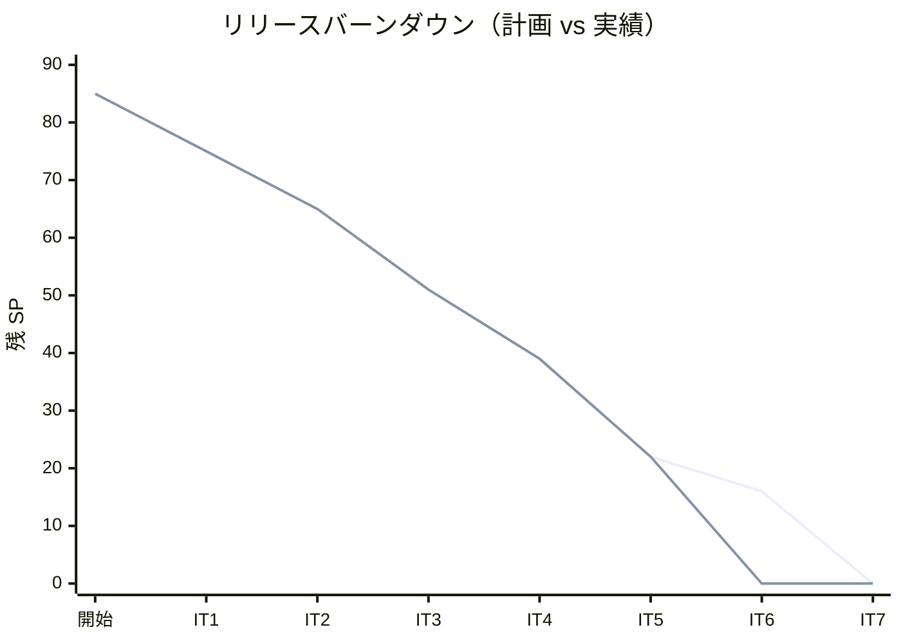
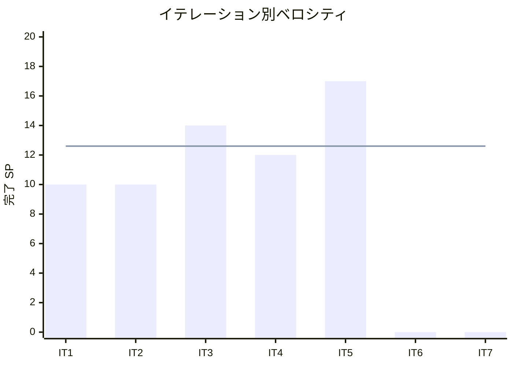

# イテレーション 5 完了報告書

## プロジェクト概要

国際貨物輸送管理システム（Cargo Tracker F# 版）のイテレーション 5 完了報告。
Tracking・Handling コンテキストを中盤インサイドアウトで立ち上げ、予約確定から追跡番号発行・荷役記録・引取・追跡照会までを一気通貫させ、Release 1.0 MVP の業務フローを完成させた。

## 日程

- イテレーション開始日: 2026-09-08（計画）
- イテレーション終了日: 2026-09-19（計画）
- 作業日数: 10 日（2 週間）
- 局面: 中盤（インサイドアウト）・最終

## 要員

| 名前 | 予定作業日数 | 実績作業日数 |
|------|-------------|-------------|
| 開発担当 + AI エージェント | 10 | 10 |

## 指標

### ビルド・テスト結果

| 項目 | 結果 |
|------|------|
| ユニットテスト（CargoTracker.Tests） | 160 件緑 |
| 統合テスト（CargoTracker.IntegrationTests） | 123 件緑 |
| アーキテクチャテスト（CargoTracker.ArchTests） | 24 件緑 |
| **合計** | **307 件緑・失敗 0** |
| ビルド警告 | 0（`-warnaserror`） |
| Fantomas フォーマット | クリーン |
| カバレッジ（全体 / ドメイン層） | 91.3% / 89.1%（閾値 80% / 85% クリア） |

### イテレーションバーンダウン（リリース）

### ベロシティ

## 実施内容と評価

| ストーリー | 結果 | 予定ポイント | ベロシティ加算ポイント |
|-----------|------|-------------|----------------------|
| US14 追跡番号を発行する | 完了 | 2 | 2 |
| US15 荷役作業を記録する | 完了 | 5 | 5 |
| US16 引取作業を記録する | 完了 | 3 | 3 |
| US17 貨物状態を手動更新する | 完了 | 2 | 2 |
| US18 追跡情報を照会する | 完了 | 5 | 5 |
| **合計** | | **17** | **17** |

### 主な成果物

| 種別 | 成果物 |
|------|--------|
| ドメイン | Tracking（`TrackingActivity`・`currentStatus` 導出・`TrackingNumber`・`TrackingStatus`・`TrackingEventType`）・Handling（`HandlingActivity`・`HandlingType`・`validateFor`・`register`）・Shared（`TransportStatus`） |
| アプリケーション | `IssueTracking`/`RecordTracking`・`RegisterHandling` ワークフロー・`TrackingRepository`/`HandlingRepository`/`CargoSnapshotProvider`/`TrackingNotifier` ポート |
| インフラ | tracking_activity/tracking_handling_event（0009）・handling_activity（0010）・Donald リポジトリ・照会クエリ（`TrackingQueries`・`HandlingQueries`） |
| Web | `/tracking`・`/tracking/{tn}`・`/public/tracking/{token}`（US18）・`/handling`・`/handling/new`（US15/16）・`/tracking/{tn}/status/new`（US17）・`HandlingAcl`・`BookingEventConsumer`（BC 連携） |
| ADR | ADR-0002 改訂（BC ローカルイベント DU + アプリ/合成層 post-commit を採用・UnitOfWork 削除） |
| 設計反映 | data-model（0009/0010・access_token）・domain-model（Tracking/Handling 実装状況）・Shared に TransportStatus |
| テスト | ドメイン FsCheck・リポジトリ往復・受入（公開ページ・手動更新・Misrouted）・BC 連携・一気通貫 E2E |

### レビュー（セルフレビュー）

xp-programmer / xp-tester の 2 視点でセルフレビューを実施し、高指摘を即対応した。

| 指摘 | 重要度 | 対応 |
|------|--------|------|
| 荷役の Misrouted/Warning フィードバックが一覧に届いていない（テスト欠如で素通り） | 高 | handlingList が msg を読み banner 表示・受入テスト追加 |
| 荷役後の追跡記録失敗を握り潰し（無言） | 高 | ベストエフォート＋ログ出力に変更 |
| 追跡照会の所有者チェックなし | 高 | US18 の capability ベース設計として受容（次 IT で ADR 化検討） |
| Web ハンドラの通知方針の不統一・recipient=追跡番号 | 中 | retro-5 Try#2/#3 へ |
| syncEvents の全置換 | 中 | retro-5 Try#5 へ |

### デスコープ・保留

| 項目 | 状態 | 理由 |
|------|------|------|
| 通関（customs_declaration・CustomsStatus ゲート） | 保留 | US15/US16 は Receive/Load/Unload/Claim で成立。通関は次 IT |
| Tracking 例外（TrackingException・US19/US20） | 保留 | IT6（終盤・例外対応）で実装 |
| 実送信・recipient 実解決 | 部分 | notification_log 記録の最小実装（IT4 から継続） |

### イテレーションレビュー（次イテレーションへの引き継ぎ）

| アクションアイテム | 担当 |
|-------------------|------|
| 荷役→追跡の単一トランザクション化 / 補償方針 | 開発担当 |
| 通知の実送信化・recipient 実解決（IT4 Try#3 と統合） | 開発担当 |
| 追跡記録＋通知の合成層ヘルパ集約・方針統一 | 開発担当 |
| 追跡照会の所有者制御方針の明文化（ADR 化） | 開発担当 |
| syncEvents の append-only 化 | 開発担当 |

## 総括

計画 17 SP を 100% 達成。IT1-5 の 5 イテレーション連続で計画どおり消化（累計 63/63 SP）。
過積載を警戒した 17 SP も、IT2-4 で確立した BC-local 型・ACL・post-commit・カバレッジゲート・ArchUnit の再利用により死守できた。
中盤インサイドアウトの狙いどおり、Tracking の導出状態（`currentStatus`）と Handling の妥当性検証（`validateFor`）を FsCheck 込みでドメイン層に凝集させ、貧血モデルを回避した。
retro-4 Try#1（BC 間イベント駆動）と IT4 レビュー高 H1（ADR-0002 の三重不整合）を IT5 で完全に消化し、3 イテレーション越しの負債を清算した。
**Release 1.0 MVP の業務フロー（予約確定→追跡番号発行→荷役→追跡照会）が IT5 完了で一気通貫し E2E で実証**された。リリース判定は別途実施する。
IT5 完了で中盤（IT3-5）を終え、終盤（IT6-7・アウトサイドイン）は例外対応（US19/US20）と精算（Billing）へ進む。

---

## 関連ドキュメント

- [イテレーション 5 計画](./iteration_plan-5.md)
- [イテレーション 5 ふりかえり](./retrospective-5.md)
- [リリース計画](./release_plan.md)
- [ADR-0002（改訂）](../adr/0002-ドメインイベントはPayloadレコード方式とpost-commitディスパッチを採用.md)
