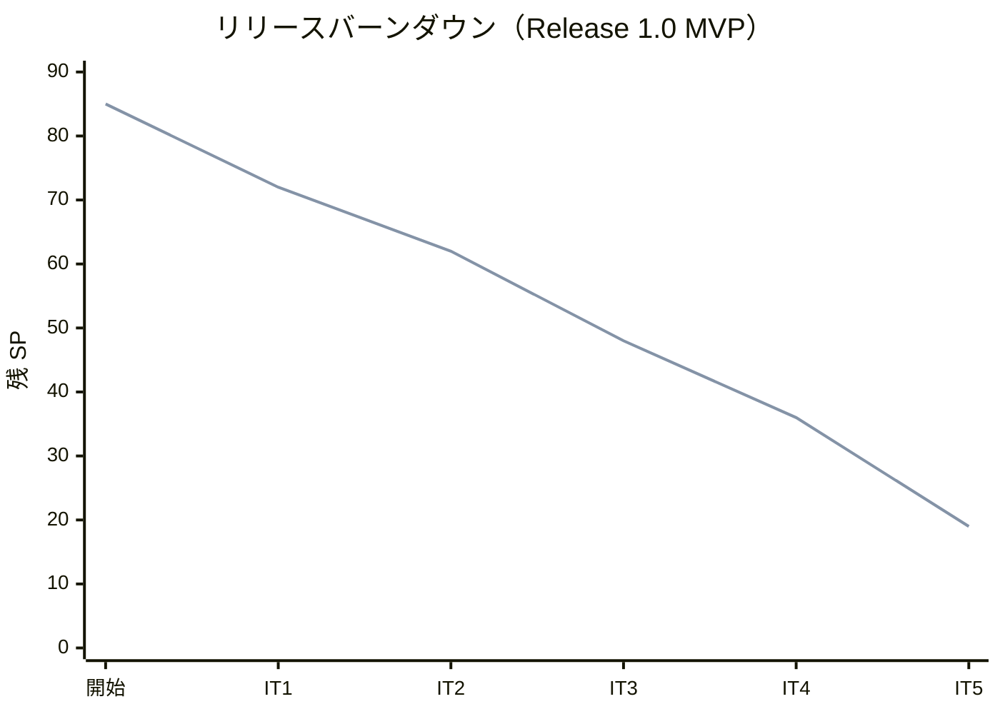
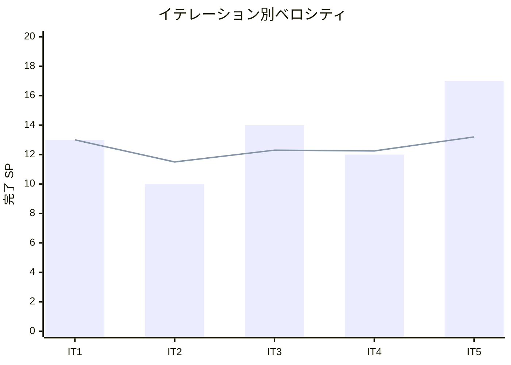

# イテレーション 5 完了報告書

## 1. プロジェクト概要

| 項目 | 内容 |
|------|------|
| イテレーション | IT5 |
| ゴール | 追跡番号発行・荷役/引取記録・貨物状態更新・追跡照会（公開ページ含む）が動作し、Release 1.0（MVP）を出荷する |
| 計画期間 | 2026-08-31 〜 2026-09-11（2 週間） |
| 実績期間 | 2026-07-13（Ralph Loop によるテックリード直接実装・反復消化） |
| 局面（開発戦略） | 中盤 = インサイドアウト（最終イテレーション） |

### 要員

| 名前 | 予定作業日数 | 実績作業日数 |
|------|------------|------------|
| 開発者 1 名 + AI エージェント（テックリード Claude Code・Ralph Loop で層単位に反復実装） | 10 | 1（集中実装） |

## 2. 指標

### ベロシティ

| 項目 | 値 |
|------|-----|
| 計画 SP | 17 |
| 実績 SP | 17 |
| 達成率 | **100%** |

### リリースバーンダウン（計画 vs 実績）

- 計画線: 85 → 72 → 62 → 48 → 36 → 19（IT5 で Release 1.0 MVP・Phase 1 完了）
- 実績線: 85 → 72 → 62 → 48 → 36 → 19（IT5 開発完了時点。計画どおり 17 SP 消化）

### ベロシティ推移

- IT1=13・IT2=10・IT3=14・IT4=12・IT5=17。平均 13.2 SP/IT。5 イテレーション連続で計画=実績が一致。

## 3. テスト結果

| テストプロジェクト | 件数 | 結果 |
|-------------------|------|------|
| Domain.Tests | 108 | 全パス |
| Application.Tests | 3 | 全パス |
| Architecture.Tests | 6 | 全パス |
| Web.Tests | 58 | 全パス |
| E2E.Tests | 4 | 全パス |
| Infrastructure.Tests | 56 | 全パス |
| **合計** | **235** | **全パス** |

### テスト増分・累計推移

| イテレーション | 累計テスト数 | 増分 |
|---------------|------------|------|
| IT1 | 74 | +74 |
| IT2 | 117 | +43 |
| IT3 | 161 | +44 |
| IT4 | 198 | +37 |
| IT5 | 235 | +37 |

- ビルド警告 0・エラー 0、`dotnet format` クリーン、全コミットで pre-commit 品質ゲート通過。フルスイート実行で BookingStatus の表現統一に伴う統合テスト seed のドリフトを検出・是正。

## 4. 実施内容と評価

### ストーリー別完了状況

| US | ストーリー | SP | 状態 |
|----|-----------|----|----|
| US14 | 追跡番号を発行する | 2 | 完了 |
| US15 | 荷役作業を記録する | 5 | 完了 |
| US16 | 引取作業を記録する | 3 | 完了 |
| US17 | 貨物状態を手動更新する | 2 | 完了 |
| US18 | 追跡情報を照会する | 5 | 完了 |
| **合計** | | **17** | **100%** |

### 受入条件の達成状況

- **US14**: 確定予約への一意採番・受領待ち初期化・`Confirmed → TrackingIssued` 遷移を満たす。`BookingConfirmedEvent` の post-commit ハンドラで自動発行（IT4 レビュー H3 解消）。荷主メール通知は通知記録で代替（実送信は後続）。
- **US15**: 追跡番号での貨物特定・作業種別（受領/積込/荷降し）選択・場所妥当性検証（LOAD/UNLOAD 不一致は MISROUTED・受領は警告）・状態自動更新・該当なしエラーを満たす。
- **US16**: 引取（CLAIM）の荷受人確認（署名/確認コード）必須・「引取済」（TransportStatus=Claimed）・予約状態 Delivered 同期を満たす。通関（CUSTOMS）は本リリース対象外。
- **US17**: 追跡管理者による状態・位置・日時の手動追記（`AddTrackingEventCommand`）・追跡イベント記録を満たす。
- **US18**: 追跡番号検証・現在地/状態/イベント履歴タイムライン/推定到着日の表示・公開ページ（`/public/tracking/{trackingId}`・認証不要）を満たす。

### 実装内容の要約（レイヤー別）

| レイヤー | 主な成果物 |
|---------|-----------|
| Domain | TrackingActivity 集約（追跡番号発行・イベント時系列・状態導出）、HandlingActivity 集約（妥当性検証デシジョンテーブル・MISROUTED）、Cargo に IssueTracking/MarkInTransit/MarkDelivered、Tracking/Handling 固有 VO・列挙 |
| Application | AssignTrackingNumber/AddTrackingEvent/RegisterHandlingActivity Command・Service、CargoSnapshotProvider・TrackingNumberResolver・ISelectedRouteLookup（ACL）、TrackingQueryService・HandlingActivityQueryService |
| Infrastructure | TrackingActivityRepository・HandlingActivityRepository、tracking（0011）/handling（0012）マイグレーション、UnitOfWork の post-commit ハンドラ対応修正 |
| Interfaces | HandlingController（登録/一覧）、TrackingController（照会/手動更新）、PublicTrackingController（公開・実画面化）、荷役・追跡ビュー、予約詳細に追跡番号表示 |
| 連携（イベント） | BookingConfirmedEvent→追跡発行、HandlingActivityRegisteredEvent→追跡イベント追記・予約状態同期 |

## 5. 追加タスク（SP 外）: IT4 レビュー是正・繰り越し

| # | 項目 | 内容 | 状態 |
|---|------|------|------|
| H1 | 真実の源泉明文化 | 確定経路の源泉（Routing）とスナップショット（Booking）・差し戻し再同期を domain-model に明記 | 完了 |
| H2 | 経路選択の堅牢化 | インデックス依存を候補キー（航海番号列）照合に是正 | 完了 |
| H4 | selectedIndex テスト | 範囲外・負値の Web テスト追加 | 完了 |
| H5 | 通知多重送信 | 再通知は追記型（append-only）を正式方針化 | 完了 |
| H6/H7 | 予約詳細に確定経路 | 旅程テーブル・推奨アクション順を表示。副次でBookingStatus 永続化バグ是正 | 完了 |
| ADR-0008 | 外部経路サービス契約 | ローカル算出を正式方針・実連携時に WireMock 契約（IT3 T5/IT4 T6） | 完了 |
| US10 | 調整条件記録 | UC08 最低保証を「再算出結果の提示」に修正・記録不要と確定（IT4 T1） | 完了 |
| 6.1/SQ-1 | カバレッジゲート | ドメイン 85% ハードゲートの CI 導入 | 繰り越し（CI 設定前提） |
| SQ-2〜5 | SonarQube 指摘 | ModelState・アクセシビリティ・未使用メンバー・GeneratedRegex | 繰り越し（スキャン実行前提） |
| 6.2 | Playwright E2E | 予約〜追跡フロー | 繰り越し（Web.Tests で機能担保） |

- コミット: 18 件（feat 12 / fix 1 / test 1 / docs 4）。

## 6. E2E テスト結果

- E2E 4 件全パス（認証・ウォーキングスケルトン・ロール制御）。**予約〜追跡の一気通貫フロー（予約確定→追跡番号自動発行→荷役登録→追跡状態同期→追跡照会）は Web.Tests（WebApplicationFactory・実 MediatR イベント経由）で担保**。Playwright E2E への移植は IT6 へ繰り越し（ふりかえり Try T4）。

## 7. フェーズ・累計進捗

### Release 1.0 MVP（Phase 1・IT1-5）

| イテレーション | SP | 状態 |
|---------------|----|----|
| IT1 | 13 | 完了 |
| IT2 | 10 | 完了 |
| IT3 | 14 | 完了 |
| IT4 | 12 | 完了 |
| IT5 | 17 | 開発完了 |
| **累計完了** | **66 / 66** | **100%** |

### プロジェクト全体

- 全 85 SP のうち 66 SP 完了（**78%**）。残 19 SP（Release 1.1・IT6-7）。
- **Release 1.0（MVP・Phase 1）の機能実装が完了し出荷条件を充足**。予約〜追跡の業務ライフサイクル（見積→荷主→予約→経路設計→確定→追跡番号発行→荷役→配送完了→追跡照会）が全層で完結。中盤（IT3-5・インサイドアウト）で Booking/Routing/Tracking/Handling の 4 コンテキストのドメイン中核を確立。次は終盤（IT6-7・アウトサイドイン）で例外対応・請求精算を業務シナリオ起点で結合し Release 1.1 を出荷する。

## 8. ふりかえり

詳細は [イテレーション 5 ふりかえり（KPT）](./retrospective-5.md) を参照。

- **Keep**: イベント駆動の BC 連携（疎結合）、ACL のプリミティブ DTO 一貫、UnitOfWork の post-commit ハンドラ対応、荷役妥当性のドメイン凝集、IT4 レビュー H1-H7 の先行消化。
- **Problem**: BookingStatus 永続化の潜在バグ、プレースホルダ実画面化のルート衝突、seed ドリフト、品質ゲートの 3 IT 連続繰り越し、実イベント E2E の未達。
- **Try**: 列挙型 DB 変換の ADR 化、スタブ撤去チェックリスト、品質ゲートの環境ごと決着、Playwright E2E、フルスイート定期実行、メール通知基盤の検討。

## 9. 更新履歴

| 日付 | 更新内容 | 更新者 |
|------|---------|--------|
| 2026-07-13 | 初版作成（IT5 開発完了報告・17 SP・235 テスト・Tracking/Handling BC 立ち上げ・Release 1.0 MVP 出荷条件充足・IT4 レビュー H1-H7 消化・ADR-0008・品質ゲート繰り越し） | - |
