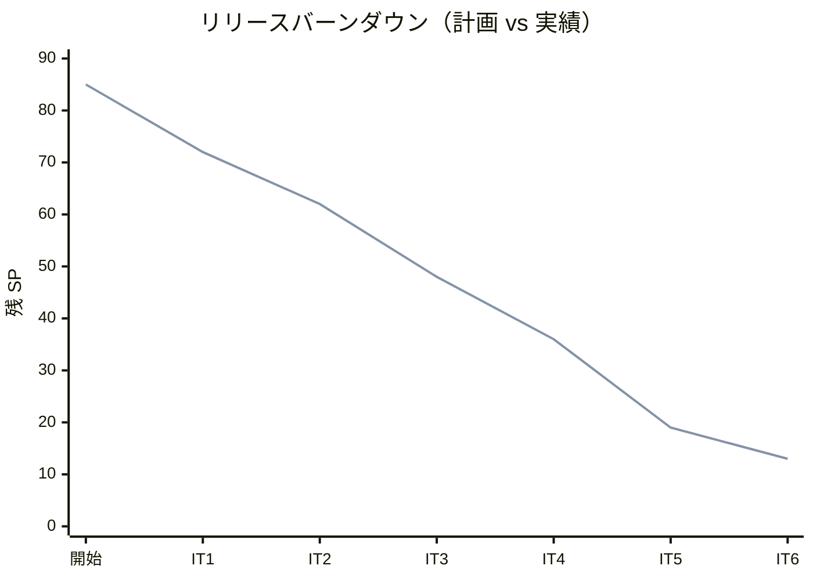
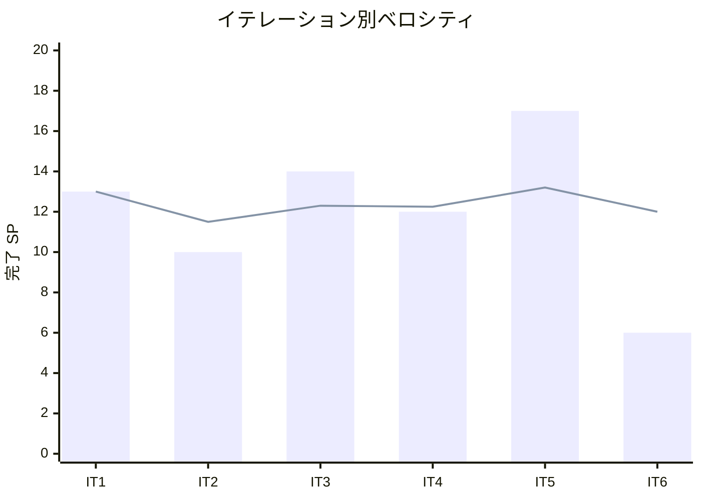

# イテレーション 6 完了報告書

## 1. プロジェクト概要

| 項目 | 内容 |
|------|------|
| イテレーション | IT6 |
| ゴール | 遅延・破損・紛失の例外登録とエスカレーション・荷主通知が動作し、Release 1.0 のフィードバック（IT5 レビュー高優先）を消化する |
| 計画期間 | 2026-09-14 〜 2026-09-25（2 週間） |
| 実績期間 | 2026-07-14（Ralph Loop によるテックリード直接実装・反復消化） |
| 局面（開発戦略） | 終盤 = アウトサイドイン（初回イテレーション） |

### 要員

| 名前 | 予定作業日数 | 実績作業日数 |
|------|------------|------------|
| 開発者 1 名 + AI エージェント（テックリード Claude Code・Ralph Loop で層単位に反復実装） | 10 | 1（集中実装） |

## 2. 指標

### ベロシティ

| 項目 | 値 |
|------|-----|
| 計画 SP | 6 |
| 実績 SP | 6 |
| 達成率 | **100%** |

### リリースバーンダウン（計画 vs 実績）

- 計画線: 85 → 72 → 62 → 48 → 36 → 19 → 13
- 実績線: 85 → 72 → 62 → 48 → 36 → 19 → 13（IT6 開発完了時点。計画どおり 6 SP 消化）

### ベロシティ推移

- IT1=13・IT2=10・IT3=14・IT4=12・IT5=17・IT6=6。平均 12.0 SP/IT。6 イテレーション連続で計画=実績が一致。
- IT6 は US19/US20（6 SP）に加え、IT5 レビュー高優先 H1-H4 と通知記録基盤（SP 外）の消化を伴う。

## 3. テスト結果

| テストプロジェクト | 件数 | 結果 |
|-------------------|------|------|
| Domain.Tests | 116 | 全パス |
| Application.Tests | 3 | 全パス |
| Architecture.Tests | 8 | 全パス |
| Web.Tests | 63 | 全パス |
| E2E.Tests | 4 | 全パス |
| Infrastructure.Tests | 61 | 全パス |
| **合計** | **255** | **全パス** |

### テスト増分・累計推移

| イテレーション | 累計テスト数 | 増分 |
|---------------|------------|------|
| IT1 | 74 | +74 |
| IT2 | 117 | +43 |
| IT3 | 161 | +44 |
| IT4 | 198 | +37 |
| IT5 | 235 | +37 |
| IT6 | 255 | +20 |

- ビルド警告 0・エラー 0、`dotnet format` クリーン、全コミットで pre-commit 品質ゲート通過。ドメイン層被覆はコード追加分で 96-98%（`TrackingActivity` 98.2%・`TrackingExceptionEvent` 96.2%）を実測。

## 4. 実施内容と評価

### ストーリー別完了状況

| US | ストーリー | SP | 状態 |
|----|-----------|----|----|
| US19 | 遅延例外を処理する | 3 | 完了 |
| US20 | 破損・紛失例外を処理する | 3 | 完了 |
| **合計** | | **6** | **100%** |

### 受入条件の達成状況

- **US19**: 追跡番号＋例外種別「遅延」・発生状況（場所/日時/理由）の記録、貨物状態の例外発生（`TransportStatus.Exception`）更新、荷主通知（記録で代替）、例外対応履歴の時系列記録を満たす。※対応報告の荷主通知記録は正式レビュー H1 として IT7 で完全充足予定。
- **US20**: 追跡番号＋例外種別「破損」/「紛失」・発生状況の記録、例外発生更新、紛失（Lost）時の `escalation_flag` 設定と管理職エスカレーション通知記録、荷主通知（記録で代替）を満たす。※補償方針の対応報告通知は H1 と同様 IT7 で充足予定。

### 実装内容の要約（レイヤー別）

| レイヤー | 主な成果物 |
|---------|-----------|
| Domain | TrackingActivity に AddException/HasActiveException/ResolveException（単一未解決不変条件・Exception 導出・前状態復帰）、TrackingExceptionEvent（Lost のみ EscalationFlag 導出）、ExceptionType 列挙、ExceptionNotification 記録（荷主/管理職）、TrackingExceptionDetectedEvent |
| Application | RegisterExceptionCommand/ResolveExceptionCommand・各 CommandService（CustomsHold 手動登録拒否）、NotifyOnTrackingExceptionDetectedHandler（荷主常時＋管理職エスカレーション）、TrackingQueryService に例外/通知読取 |
| Infrastructure | TrackingActivityRepository の例外永続化（delete→再挿入）、ExceptionNotificationRepository、tracking_exception（0013）/exception_notification（0014）マイグレーション（二方言） |
| Interfaces | TrackingController に例外登録/対応報告アクション、NewException 画面（ui_design 準拠・紛失エスカレーション警告）、Detail に [例外を登録] ボタン・EXCEPTION バッジ・例外履歴・対応報告フォーム・通知記録表示 |
| 連携（イベント） | TrackingExceptionDetectedEvent（Tracking→通知記録・post-commit）。ADR-0009 の結果整合性方針に準拠 |

## 5. 追加タスク（SP 外）: IT5 レビュー是正・繰り越し

| # | 項目 | 内容 | 状態 |
|---|------|------|------|
| H1 | post-commit 結果整合性 ADR 化 | ADR-0009 起票（結果整合性・冪等・失敗ログ・手動修復・Outbox 移行）、ADR-0002/0006 に相互参照追記 | 完了 |
| H2 | 荷主通知記録基盤 | exception_notification（0014）・ExceptionNotification・リポジトリ・通知ハンドラ（荷主/管理職 append-only） | 完了 |
| H3 | ArchUnit Tracking/Handling ルール | ルール 5/6 追加（他 BC の .Domain.Model 非依存・イベント/ACL は正規チャネル）。Arch テスト 6→8 | 完了 |
| H4 | CLAIM/UNLOAD 状態同期 E2E | 荷降し→引取の終端（UNLOAD→InTransit・CLAIM→Delivered）を貫通検証 | 完了 |
| self-review | 中間 self-review 反映 | 単一未解決不変条件・escalation_flag 真実源明確化・破損正常系/異常系テスト追加 | 完了 |
| 3.1 | Playwright E2E | 予約〜追跡〜例外フロー | 繰り越し（Web.Tests で機能担保・ブラウザ環境前提） |
| 3.2 | カバレッジ 85% CI ハードゲート化 | operating-cicd | 繰り越し（ドメイン被覆 96-98% は実測・CI パイプライン前提） |
| 3.3 | SonarQube SQ-3/SQ-2 | アクセシビリティ・ModelState | 繰り越し（SonarQube サーバ前提） |

- コミット: 18 件（feat 6 / test 2 / refactor 1 / docs 9）。

## 6. E2E テスト結果

- E2E 4 件全パス（認証・ウォーキングスケルトン・ロール制御）。**例外対応フロー（例外登録→Exception 遷移→荷主/管理職通知記録→対応報告→状態復帰）と荷役同期の終端（CLAIM→Delivered・UNLOAD→InTransit）は Web.Tests（WebApplicationFactory・実 MediatR イベント経由）で担保**。Playwright E2E への移植は IT7 へ繰り越し（ふりかえり Try T5）。

## 7. フェーズ・累計進捗

### Release 1.1（Phase 2・IT6-7）

| イテレーション | SP | 状態 |
|---------------|----|----|
| IT6 例外対応（US19/US20） | 6 | 開発完了 |
| IT7 請求・精算（US21/22/23） | 13 | 未着手 |
| **Phase 2 累計** | **6 / 19** | **32%** |

### プロジェクト全体

- 全 85 SP のうち 72 SP 完了（**85%**）。残 13 SP（Release 1.1・IT7）。
- **例外対応（遅延/破損/紛失）が全層（ドメイン→永続化→アプリ→イベント→通知→UI→受け入れ）で完結**。終盤（アウトサイドイン）初回として、中盤で作り込んだ Tracking BC 中核を再利用し業務シナリオ起点で結合。IT5 レビュー高優先 H1-H4 を先行消化し post-commit 連鎖の結果整合性方針（ADR-0009）を確立。次は IT7（請求・精算）で Delivered 後の精算フローを結合し Release 1.1 を出荷する。

## 8. ふりかえり

詳細は [イテレーション 6 ふりかえり（KPT）](./retrospective-6.md) を参照。

- **Keep**: IT5 レビュー H1-H4 の先行消化、例外の状態遷移/エスカレーション/復帰のドメイン凝集、ADR-0009 の結果整合性方針確立、単一未解決不変条件による曖昧点解消、ArchUnit 基準線の Tracking/Handling 拡張、中間 self-review の即消化。
- **Problem**: 対応報告の荷主通知欠落（H1）、変換ヘルパ重複負債の 3 IT 連続未返済（H2）、ADR-0009 冪等テスト未整備、設計ドキュメントドリフト継続、品質ゲートの 4 IT 連続繰り越し。
- **Try**: 対応報告通知の実装、変換ヘルパ Shared 集約、冪等性テスト/冪等キー、data-model/ui_design 一括整備、品質ゲートの環境ごと決着、単一未解決制約の業務妥当性 PO 確認。

## 9. 更新履歴

| 日付 | 更新内容 | 更新者 |
|------|---------|--------|
| 2026-07-14 | 初版作成（IT6 開発完了報告・6 SP・255 テスト・追跡例外対応 US19/US20・IT5 レビュー H1-H4 消化・ADR-0009・単一未解決不変条件・品質ゲート繰り越し） | - |
