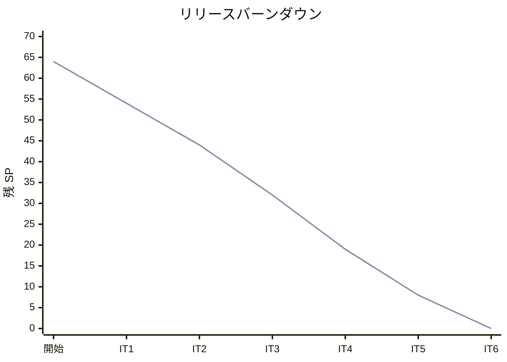
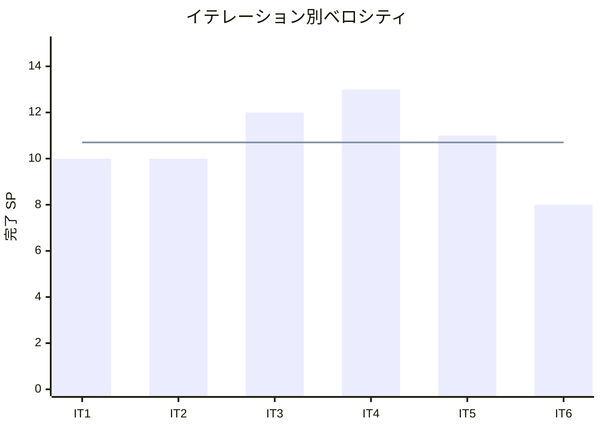

# イテレーション 6 完了報告書

## 1. プロジェクト概要

| 項目 | 内容 |
|------|------|
| イテレーション番号 | 6 |
| 計画期間 | 2026-06-09 〜 2026-06-22 |
| 実績期間 | 2026-04-03 |
| ゴール | 法人割引適用と精算処理で Phase 2 を完結させ、v1.0.0 をリリースする |

## 2. 要員

| 名前 | 予定作業日数 | 実績作業日数 |
|------|--------------|--------------|
| Copilot | 5 | 1 |

## 3. 指標

### ベロシティ

| 項目 | 値 |
|------|-----|
| 計画 SP | 8 |
| 実績 SP | 8 |
| 達成率 | 100% |

### リリースバーンダウン

### ベロシティ推移

## 4. テスト結果

| メトリクス | Backend | Frontend |
|-----------|---------|----------|
| テスト数 | 506 / 506 通過 | 該当なし |
| カバレッジ（instruction） | 89.2% | 該当なし |
| E2E テスト | 23 シナリオ全通過（e2e/ パッケージ） | — |

### テスト増分（前イテレーション比）

| メトリクス | IT5 実績 | IT6 実績 | 増分 |
|-----------|----------|----------|------|
| Backend テスト数 | 449 | 506 | +57 |
| カバレッジ（instruction） | 90.7% | 89.2% | -1.5% |

### テスト累計推移

| イテレーション | Backend テスト数 | E2E シナリオ（e2e/ パッケージ） |
|---------------|------------------|-------------------------------|
| IT1 | 113 | 9 |
| IT2 | 239 | 17 |
| IT3 | 278 | 26 |
| IT4 | 361 | 26 |
| IT5 | 449 | 18 |
| IT6 | 506 | 23 |

## 5. SonarQube Quality Gate

| プロジェクト | カバレッジ（new） | 重複率（new） | Violations（new） | 結果 |
|------------|-----------------|-------------|-------------------|------|
| cargo-tracker | 90.0% | 0.0% | 0 | PASS ✅ |

## 6. 実施内容と評価

### ストーリー別完了状況

| ストーリー | 結果 | 予定ポイント | ベロシティ加算ポイント |
|-----------|------|-------------|------------------------|
| US17 法人割引を適用する | 完了 | 3 | 3 |
| US18 精算を処理する | 完了 | 5 | 5 |
| 合計 |  | 8 | 8 |

### 受入条件達成状況

#### US17: 法人割引を適用する

- [x] 法人荷主の予約に輸送料金（DRAFT 状態）が存在する場合、割引を適用できる
- [x] 割引率は荷主の法人契約情報（`CorporateContractInfo.discountRate`）から自動取得される
- [x] 割引額 = 基本料金 × 割引率（マイナス調整額として `applyAdjustment()` に適用）
- [x] 割引後の合計金額（基本料金 − 割引額）が画面に表示される
- [x] 個人荷主（`CustomerCategory.INDIVIDUAL`）には割引が適用されない

#### US18: 精算を処理する

- [x] 確定済み（CONFIRMED）輸送料金に対して精算書（Invoice）を発行できる
- [x] 精算書には予約 ID・輸送料金・支払い期限が含まれ、支払い状態「PENDING」で登録される
- [x] 支払い確認操作で支払い状態が「CONFIRMED」に更新される
- [x] 精算一覧画面で精算書の支払い状態（PENDING / CONFIRMED）を確認できる
- [x] 支払い状態が「CONFIRMED」の精算書は変更できない

### レイヤー別実装要約

- **ドメイン（billing BC - US17）**: `DiscountPolicy`（ドメインサービス：割引額算出）・`ApplyDiscountCommand`（record）・`ShipperDiscountQueryPort`（ACL インターフェース）を実装しました。`calculateDiscount()` は割引額をマイナス値で返し、`FreightCharge.applyAdjustment()` に渡すことで減額処理を実現しました。
- **ドメイン（billing BC - US18）**: `Invoice`（集約ルート：PENDING → CONFIRMED 遷移）・`InvoiceId`（値オブジェクト）・`PaymentStatus`（PENDING / CONFIRMED / OVERDUE / REFUNDED）・`GenerateInvoiceCommand`・`ConfirmPaymentCommand`・`InvoiceRepository`（インターフェース）を実装しました。
- **アプリケーション（billing BC - US17）**: `ApplyDiscountCommandService`（`ShipperDiscountQueryPort` 経由で割引率取得・`FreightCharge.applyAdjustment()` 呼び出し）を実装しました。
- **アプリケーション（billing BC - US18）**: `InvoiceCommandService`（重複 Invoice 防止・bookingId 整合性検証・DRAFT→CONFIRMED 状態確認）・`InvoiceQueryService`（精算一覧・詳細取得）を実装しました。
- **インフラ**: Flyway migration V013（`invoices` テーブル）・`InvoiceRecord`・`InvoiceMapper`（MyBatis）・`InvoiceRepositoryImpl`・`ShipperDiscountQueryPortAdapter`（Booking→Shipper 2 段階参照で割引率取得）を実装しました。
- **プレゼンテーション（REST API）**: `PUT /api/v1/freight-charges/{id}/apply-discount`（US17）・`POST /api/v1/invoices`・`PUT /api/v1/invoices/{id}/confirm-payment`・`GET /api/v1/invoices`（US18）を実装しました。`FreightRestController` に `IllegalArgumentException` → 404 / `IllegalStateException` → 409 のエラーハンドラーを追加しました（H1 修正）。
- **プレゼンテーション（Web）**: `billing/list.html`（割引適用ボタン・精算発行ボタン・確認ダイアログ）・`billing/invoices.html`（精算一覧・PaymentStatus バッジ）・`billing/invoice-detail.html`（精算詳細）を実装しました。`fragments/header.html` に「精算」ナビリンクを追加しました。

## 7. 追加タスク（SP 外）

| タスク | 内容 |
|--------|------|
| レビュー指摘対応 H1〜H6 | H1: FreightRestController 例外ハンドラー追加・H2: 重複 Invoice 防止・H3: bookingId 整合性検証・H5: PaymentStatus バッジ色修正（OVERDUE→赤・REFUNDED→グレー）・H6: 確定ボタン確認ダイアログ追加 |
| UI/UX レビュー対応 | xp-interaction-designer・xp-user-representative 並列レビューで発見した高優先度 UI 問題を解消 |
| SonarQube 品質確認 | `npx gulp sonar-local:check` で Quality Gate PASS 確認（new_coverage: 90%、violations: 0） |

## 8. E2E テスト結果

### 新規追加シナリオ（IT6）

| シナリオ | 結果 |
|---------|------|
| E18: 法人荷主の輸送料金に割引率 10% を適用し、割引後合計金額が算出される | ✅ 通過 |
| E19: 個人荷主の輸送料金に割引を適用しようとすると 0 円割引が適用される | ✅ 通過 |
| E20: DRAFT 状態の輸送料金から精算書を発行できない（409 Conflict） | ✅ 通過 |
| E21: 確定済み輸送料金から精算書を発行し、支払い状態「PENDING」で登録される | ✅ 通過 |
| E22: 精算書の支払いを確認し、支払い状態が「CONFIRMED」に更新される | ✅ 通過 |

### リグレッション結果

既存 E1〜E17 シナリオ（認証・荷主登録・予約・ルート検索・確定・追跡番号発行・荷役記録・追跡照会・例外処理・輸送料金算出）はすべて通過。

## 9. フェーズ・累計進捗

### Phase 2 進捗（IT6 完了）

| ストーリー | 計画 SP | 完了 SP | 状態 |
|-----------|---------|---------|------|
| US16 輸送料金を算出する | 5 | 5 | 完了 ✅ |
| US17 法人割引を適用する | 3 | 3 | 完了 ✅ |
| US18 精算を処理する | 5 | 5 | 完了 ✅ |
| **Phase 2 合計** | **13** | **13** | **100%** ✅ |

### 全体累計進捗

| 項目 | 値 |
|------|----|
| 全体計画 SP | 64 |
| 累計完了 SP | 64 |
| 全体達成率 | 100% ✅ |
| 完了イテレーション | IT1・IT2・IT3・IT4・IT5・IT6（全 6 イテレーション） |
| 実績ベロシティ平均 | 10.7 SP（IT1: 10 / IT2: 10 / IT3: 12 / IT4: 13 / IT5: 11 / IT6: 8） |

### Phase 1 完了サマリー

Phase 1（US01〜US15, 51 SP）は IT5 完了時点で 100% 達成済み。

### リリースサマリー

| リリース | バージョン | 状態 |
|---------|-----------|------|
| Phase 1 コア輸送管理 | v0.1.0 | ✅ 完了（IT4 完了時） |
| Phase 2 請求・精算 | v1.0.0 | ✅ 完了（IT6 完了時） |

## 10. ふりかえりへのリンク

詳細は [イテレーション 6 ふりかえり](./retrospective-6.md) を参照。

## 11. 更新履歴

| 日付 | 更新内容 | 更新者 |
|------|---------|--------|
| 2026-04-03 | IT6 完了報告書を作成 | Copilot |
