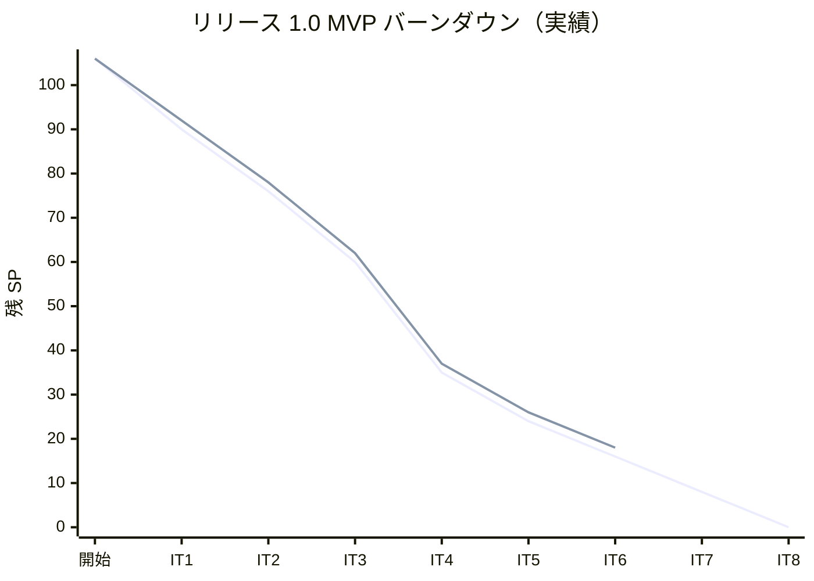
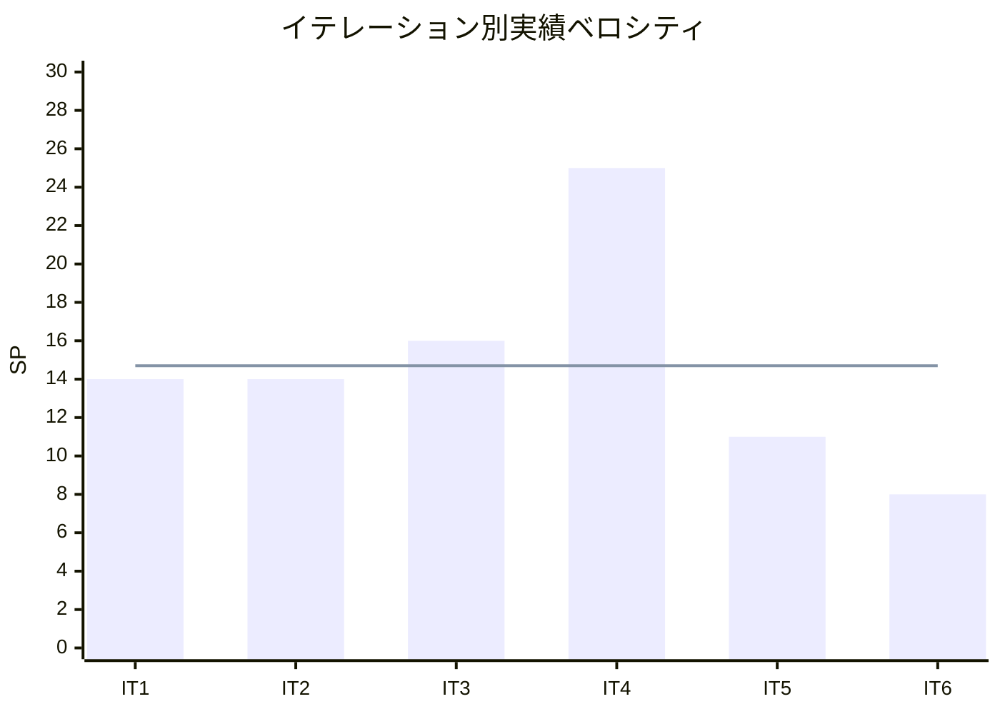

# イテレーション 6 完了報告書

## 1. プロジェクト概要

### 日程

| 項目 | 内容 |
|------|------|
| **計画期間** | Week 11-12（2026-07-23 〜 2026-08-05） |
| **実績期間** | 2026-05-18（1 日集中実装） |
| **ゴール** | `trackingms` を新設し、JWT 時限トークンによる公開追跡照会（US18）と US17 の trackingms 移管（TI06）を実装することで Phase 2 追跡基盤を完成させる |
| **ベロシティ（今回）** | 8 SP（計画 8 SP・達成率 100%） |

### 要員

| 名前 | 予定作業日数 | 実績作業日数 |
|------|------------|------------|
| AI Agent | 10 | 1 |

---

## 2. 指標

### ベロシティ

| 項目 | 値 |
|------|-----|
| 計画 SP | 8 |
| 実績 SP | 8 |
| 達成率 | 100% |

### リリースバーンダウン

### ベロシティ推移

平均ベロシティ: **14.7 SP / イテレーション**（IT1-IT6 通算）

---

## 3. テスト結果

### バックエンドテスト

| サービス | 件数 | 結果 |
|---------|------|------|
| bookingms | 90 | ✅ 全 PASS |
| authms | 81 | ✅ 全 PASS |
| routingms | 45 | ✅ 全 PASS |
| handlingms | 48 | ✅ 全 PASS |
| **trackingms（IT6 新設）** | **49** | ✅ 全 PASS |
| gatewayms | 1 | ✅ 全 PASS |
| **合計** | **314** | **全 PASS** |

### フロントエンドテスト

| 項目 | 件数 | 結果 |
|------|------|------|
| ユニットテスト（Vitest） | 142 | ✅ 全 PASS |
| テストファイル数 | 26 | - |

### E2E テスト

| 項目 | 件数 | 結果 |
|------|------|------|
| Playwright シナリオ | 11 | ✅ 全 PASS |
| シナリオファイル数 | 9 | - |

### ArchUnit テスト

| ルール | 結果 |
|--------|------|
| `CommandArchitectureTest`（`@TargetEntityId` 強制・4 サービス） | ✅ 全 PASS |
| `CommandHandlerArchitectureTest`（`@CommandHandler` 強制・4 サービス・IT6 新規） | ✅ 全 PASS |

### IT6 での新規追加テスト（バックエンド・49 件 / trackingms）

| 区分 | テストファイル | 件数 |
|------|--------------|------|
| 値オブジェクト | TrackingNumberTest / BookingIdTest / UnLocodeTest / TransportStatusTest / EventSourceTest | 19 |
| Aggregate | TrackingActivityTest | 6 |
| ドメインサービス | TrackingTokenServiceTest（境界値含む） | 10 |
| Projection | TrackingProjectionsEventHandlerTest | 4 |
| Controller 統合 | TrackingControllerIntegrationTest | 8 |
| アプリケーション起動 | TrackingApplicationTest | 1 |
| ArchUnit | CommandArchitectureTest / CommandHandlerArchitectureTest | 2 |
| **合計** | | **49** |

加えて、bookingms / handlingms / routingms 既存 `CommandHandlerArchitectureTest` が +1 ずつ追加され、ArchUnit ルール 4 サービス共通化が完了。

### IT6 での新規追加テスト（フロントエンド・21 件）

| 区分 | テストファイル | 件数 |
|------|--------------|------|
| S15 公開照会画面 | TrackingPublicView.test.tsx | 10 |
| S16 管理者一覧 | TrackingList.test.tsx | 7 |
| S10/S17 トークン発行 | TrackingTokenIssuer.test.tsx | 5（最終 -1 重複） |
| **合計** | | **21** |

### テスト増分（IT5 比較）

| 区分 | IT5 完了時 | IT6 完了時 | 増分 |
|------|-----------|-----------|------|
| バックエンド | 258 | 314 | +56 |
| フロントエンド | 121 | 142 | +21 |
| E2E | 10 | 11 | +1 |
| **合計** | **389** | **467** | **+78** |

### テスト累計推移

| イテレーション | Backend | Frontend | E2E | 合計 |
|--------------|---------|---------|-----|------|
| IT1 | 86 | 48 | 2 | 136 |
| IT2 | 149 | 89 | 4 | 242 |
| IT3 | 174 | 99 | 7 | 280 |
| IT4 | 211 | 108 | 9 | 328 |
| IT5 | 258 | 121 | 10 | 389 |
| **IT6** | **314** | **142** | **11** | **467** |

### コード品質メトリクス（SonarQube）

| プロジェクト | Quality Gate | new_coverage | new_violations | new_duplicated | new_security_hotspots |
|------------|-------------|--------------|----------------|----------------|----------------------|
| cargo-tracker-backend | ✅ PASS | 83.5% | 0 | 2.87% | 100% |
| cargo-tracker-frontend | ✅ PASS | - | - | - | - |

**カバレッジ改善経緯**: 初回スキャンで new_coverage 69.6% / new_violations 12（trackingms 新規追加コードのテスト不足）→ `TrackingProjectionsEventHandlerTest` 4 件追加 + violations 12 件修正（unnamed pattern / `@SuppressWarnings("java:S107")` / リテラル定数化 / lambda 単一 throw 化）で 83.5% / 0 件に到達。

---

## 4. 実施内容と評価

### ストーリー別完了状況

| ID | ストーリー / タスク | SP | 状態 |
|----|------------------|----|----|
| TI05 | IT6 第 0 スプリント（ADR-0013 / trackingms 骨格 / ArchUnit 4 サービス共通化 / コーディングガイド / tech_stack.md / gatewayms ルーティング / docker-compose） | 2 | ✅ 完了 |
| US18 | 追跡情報を照会する（公開 URL・JWT 時限トークン） | 5 | ✅ 完了 |
| TI06 | US17 trackingms 移管（コア・PUT + Deprecation） | 1 | ✅ 完了（Event 駆動 ACL は IT7 持ち越し） |
| **合計** | | **8** | **100%** |

### 受入条件の達成状況

#### US18: 追跡情報を照会する

- [x] 受入 1: 追跡番号を入力すると現在状態が表示される
- [x] 受入 2: RECEIVED / LOADED / IN_TRANSIT / DELIVERED など 9 状態が分かる
- [x] 受入 3: 現在の所在地を表示する（**UN/LOCODE 表示のみ・港名併記は IT7 持ち越し**）
- [x] 受入 4: 推定到着日が更新される
- [x] 受入 5: 公開メール URL（`/tracking/{tn}?token=<JWT>`）からログイン不要で照会できる
- [x] 受入 6: トークンは 30 日有効・配送完了後 7 日で自動失効（境界値 ±1 秒テスト済み）
- [x] 受入 7: トークン検証失敗時は「リンクの有効期限が切れています」等を表示

#### TI06: US17 trackingms 移管

- [x] trackingms `PUT /api/v1/tracking/{trackingNumber}/status` REST 実装
- [x] handlingms 旧エンドポイントに Deprecation / Sunset (2026-08-30) / Link ヘッダー追加
- [x] フロント `useUpdateCargoStatus` を trackingms へ切替
- [x] 未初期化追跡番号への PUT で 404 TRACKING_NOT_FOUND を返却
- [ ] **持ち越し**: cargo_status_history → tracking_event Flyway 移行（IT7）
- [ ] **持ち越し**: handlingms `POST /cargo-snapshots` → CargoBookedEvent 駆動 ACL 置換（IT7）

#### S16: 追跡管理一覧（IT5 漏れ補完・SP 外）

- [x] `GET /api/v1/tracking` で全件取得（管理者認証必須）
- [x] フロント `/tracking` ルート + TrackingListPage + サイドナビ「追跡管理」追加
- [x] 行クリックで S17（`/tracking/{tn}/manage`）へ遷移
- [x] 誤配送行を `bg-red-50` でハイライト

### 実装レイヤー別サマリー

| レイヤー | 主要成果物 |
|---------|-----------|
| **ドメイン** | `TrackingActivity` Aggregate / `TrackingNumber` / `BookingId` / `Location` / `UnLocode` / `Leg` / `CargoItinerary` / `TransportStatus` enum / `EventSource` enum / `HandlerId` / `JwtToken` / `TrackingTokenService` interface + `InvalidTrackingTokenException` / `TrackingTokenExpiredException` / `InitializeTrackingCommand` / `UpdateTransportStatusCommand` / `TrackingInitializedEvent` / `TransportStatusUpdatedEvent` |
| **アプリケーション** | `TrackingProjectionsEventHandler`（`TrackingInitializedEvent` / `TransportStatusUpdatedEvent` 購読）/ `TrackingQueryService`（`findByTrackingNumber` / `findDeliveredAt` / `findAll` / `exists`） |
| **インフラ** | `JwtTrackingTokenService`（HMAC-SHA256・jjwt・Clock 注入）/ `AxonJdbcConfig` / `TrackingSummaryRecord` / `TrackingSummaryMapper` + XML / `TrackingEventRecord` / `TrackingEventMapper` + XML / Flyway `V001__create_token_entry.sql` / `V002__create_tracking_tables.sql` |
| **プレゼンテーション** | `TrackingController`（GET 一覧 / GET 公開照会 / PUT 状態更新 / POST issue-token / POST initialize）/ `TrackingInfoResponse` / `TrackingListItemResponse` / `IssueTrackingTokenResponse` / `InitializeTrackingRequest` / `UpdateTrackingStatusRequest` / gatewayms `JwtAuthenticationFilter` 拡張（`/tracking/` 公開・`/tracking` 完全一致は認証・`_internal` は認証） |
| **フロントエンド** | `TrackingPublicPage` (S15) / `TrackingPublicView` + JST 表記 + MISROUTED バナー + 履歴降順 + handlingType 日本語化 / `TrackingListPage` (S16) / `TrackingList` / `TrackingTokenIssuer`（S10/S17 連携）/ `useTrackingInfo` / `useTrackingList` / `useIssueTrackingToken` / `useInitializeTracking`（冪等性付き） / `BookingDetailPage` の TRACKING_ISSUED 連携 / `AppLayout` に「追跡管理」サイドナビ追加 / `HandlingActivityListPage` スタイル統一 |
| **テスト** | trackingms ユニット 47 / ArchUnit 2 / フロントコンポーネント 21 / E2E `login-tracking.spec.ts` + `login-handling.spec.ts` 更新 |
| **インフラ / 運用** | `docker-compose.yml` に trackingms + tracking_read_db / `Dockerfile` + `Dockerfile.heroku` / CI `ci-e2e.yml` に trackingms (8086) 起動追加 / `application-local-h2.yml` に Flyway `clean-on-validation-error: true`（開発時のみ） |
| **ドキュメント** | ADR-0013 起票（221 行）/ iteration_plan-6.md（940 行）/ コーディングガイド更新（Axon static handler + Record 変数名規約）/ tech_stack.md 更新（Java major version チェックリスト）/ Heroku Config Vars 追記（trackingms / TRACKING_TOKEN_*） |

---

## 5. 追加タスク（SP 外）

| 項目 | 概要 |
|------|------|
| S16 追跡管理一覧 | IT5 漏れ補完（管理者用 `/tracking` 一覧 + サイドナビ + 認証ルール調整） |
| HandlingActivityList スタイル統一 | BookingList パターンに合わせて Card デザイン / 色 / パディング統一 |
| TrackingNumber バリデーション緩和 | bookingms 実装フォーマット `TRK-YYYYMMDD-XXXXXXXX` を受け入れ（IT4 由来負債の暫定対処） |
| Flyway 検証エラー時の自動 clean（dev のみ） | DevTools 再起動で H2 メモリに残る失敗履歴の解消 |
| マルチパースペクティブレビュー | XP 5 エージェント並列で 40 件指摘集約（高 12 / 中 16 / 低 12） |
| レビュー高優先度 7 件即時対応 | JST 表記 / 誤配送バナー / 履歴降順 / 境界値テスト / Deprecation JavaDoc / 環境変数ドキュメント / TOKEN_TN_MISMATCH テスト |

---

## 6. E2E テスト結果

### 新規追加シナリオ

| ファイル | シナリオ |
|---------|---------|
| `login-tracking.spec.ts` | US18 + S16: 追跡照会フルフロー（initialize → トークン発行 → S15 公開照会 → 不正トークン → S16 一覧 → S17 遷移） |

### 全 E2E テスト結果（リグレッション含む）

| # | シナリオ | 結果 |
|---|---------|------|
| 1 | US06: 予約引き渡しで PRELIMINARY → ROUTING | ✅ |
| 2 | US04: ログイン → 荷主登録 → 予約登録 → 一覧 | ✅ |
| 3 | US15-US17: 荷役作業フルフロー（受領 → 状態手動更新・TI06 移管対応） | ✅ |
| 4 | US01: ログイン → 荷主登録 → 見積作成 → 詳細 | ✅ |
| 5 | US-UI-r: ログイン → 個人荷主登録 → 一覧 | ✅ |
| 6 | **US18 + S16: 追跡照会フルフロー（IT6 新規）** | ✅ |
| 7 | US25: 航海登録 → 編集 → 一覧反映 | ✅ |
| 8 | US25 受入 5: 編集キャンセル | ✅ |
| 9 | US07: 航海スケジュール一覧フィルタ | ✅ |
| 10 | US24: 航海スケジュール登録 → 一覧 | ✅ |
| 11 | US08-US14: 経路設計ワークベンチフルフロー | ✅ |

---

## 7. フェーズ・累計進捗

### Phase 2 進捗（IT5〜IT8）

| イテレーション | 計画 SP | 実績 SP | 達成率 | 状態 |
|---------------|---------|---------|--------|------|
| IT5 | 11 | 11 | 100% | ✅ 完了 |
| **IT6** | **8** | **8** | **100%** | **✅ 完了** |
| IT7 | 12〜16（予定） | - | - | 未着手 |
| IT8 | 8（予定） | - | - | 未着手 |

### 累計進捗（全フェーズ）

| 累計指標 | 値 |
|---------|---|
| 完了イテレーション | 6 / 8 |
| 完了 SP | **88 / 106 SP（83%）** |
| 残 SP | 18 SP |
| 累計テスト件数 | 467 件（Backend 314 + Frontend 142 + E2E 11） |
| 累計バックエンドサービス | 6（authms / bookingms / routingms / handlingms / trackingms / gatewayms） |
| 採用済み ADR | 13 件（ADR-0001 〜 ADR-0013） |

---

## 8. ADR 更新

| ADR | タイトル | ステータス | IT6 での状態 |
|-----|---------|-----------|-------------|
| ADR-0013 | Tracking Number JWT 時限トークン設計 | 提案 | IT6 で起票・採用済み（**IT7 で「承認済み」に昇格予定**） |

ADR-0013 は採用済みだが、レビュー指摘により正式承認は IT7 第 0 スプリントで実施。

---

## 9. ふりかえり

詳細は [retrospective-6.md](./retrospective-6.md) を参照。

- **Keep**: 6 件（ADR 事前承認 / IT5 Try 完全消化 / ArchUnit 4 サービス共通化 / Clock 注入 / マルチパースペクティブレビュー / Quality Gate PASS）
- **Problem**: 7 件（bookingms VO 乖離 / 公開画面業務適合性 / 暫定設計 3 件 / 運用ドキュメント漏れ / coverage 初回未達 / TDD Red コミット規律）
- **Try**: 6 件（shared モジュール昇格 / レビュー前倒し / verify 戻り値拡張 / ドキュメントチェックリスト / coverage CI 監視 / Red コミット規律）

詳細は [IT6_implementation_review_20260518.md](../review/IT6_implementation_review_20260518.md)（マルチパースペクティブレビュー結果 40 件）も併せて参照。

---

## 10. IT7 への申し送り

### 持越しタスク（IT5 / IT6 暫定実装の解消）

1. **shared モジュール昇格**: `apps/backend/shared` に bookingms Event クラス（CargoBookedEvent / CargoRoutedEvent / CargoTrackedEvent / TrackingNumberIssuedEvent）を移動
2. **handlingms Event 駆動 ACL**: `POST /api/v1/handling/cargo-snapshots` を廃止し `CargoBookedEvent` / `CargoRoutedEvent` 購読 EventHandler に置換
3. **trackingms Event 駆動 ACL**: `CargoTrackedEvent` 購読で `TrackingActivity` を自動初期化、フロント `BookingDetailPage` の useEffect 自動 initialize を削除
4. **handlingms cargo_status_history → trackingms tracking_event データ移行**: Flyway 移行スクリプト
5. **TrackingActivity 未初期化フォールバック削除**: `IllegalStateException` で拒否に統一

### IT4 由来の負債（IT6 で表面化）

6. **bookingms.TrackingNumber 値オブジェクト修正**: 正規表現を `^TRK-\d{8}-[0-9A-F]{8}$` に変更、`Cargo` 内部状態を VO 化
7. **data-model.md / domain-model.md 同期**: `tracking_summary.delivered_at` / `tracking_event.source` / `TrackingTokenService` / `JwtToken` / `EventSource` enum / `tracking_number: VARCHAR(25)` の反映

### IT6 レビュー高優先度残課題（5 件）

8. **H-1**: 公開画面で港名表示（UN/LOCODE → 港名併記）。マスタ整備が必要
9. **H-5**: 期限切れ時の問合せ先連絡導線（要件確認後に対応）
10. **H-6**: bookingms.TrackingNumber 修正（上記 6 と同件）
11. **H-7**: `TrackingTokenService.verify` 戻り値拡張で `dummyValidUntil` 解消
12. **H-8**: JWT secret 本番 Fail-Fast（`@PostConstruct` で profile 判定）

### IT6 レビュー中優先度の代表項目

13. **M-2**: BookingId 値オブジェクトを使用箇所統一 or 削除
14. **M-5**: `STATUS_LABEL` / `formatDateTime` の重複を `features/tracking/lib/` に集約
15. **M-6**: `sendAndWaitWithTimeout` を共通化（3 サービス重複）
16. **M-10**: ADR-0013 ステータスを「提案」→「承認済み」に更新
17. **M-15**: `TrackingController` を Public / Internal に物理分離

### IT3 繰越し（任意）

18. US04-r1 荷主 ID マスタ検索（任意・低優先度）
19. US05-r1 IMO クラス・UN 番号ドロップダウン化（任意）
20. US24-r1 出発日 < 到着日チェック強化（任意）

### IT6 ふりかえり Try（プロセス改善）

21. **T2**: xp-user-representative レビューを実装中盤に前倒し
22. **T4**: 新規環境変数のドキュメント反映チェックリストを開発プロセスに組込み
23. **T5**: SonarQube new_coverage を CI のソフトゲートとして毎日確認
24. **T6**: TDD Red コミットを最低 1 つ残す規律

---

## 更新履歴

| 日付 | 内容 | 担当 |
|------|------|------|
| 2026-05-18 | IT6 完了報告書作成（8 SP 100%・テスト 467 件・SonarQube PASS new_coverage 83.5%・累計 88/106 SP 83%・IT7 申し送り 24 件整理） | AI Agent（XP PM） |
