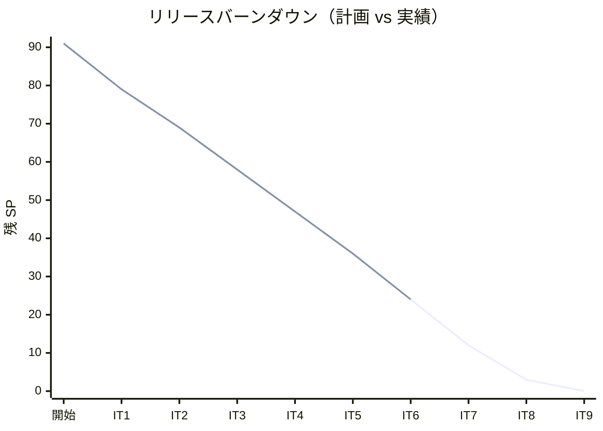
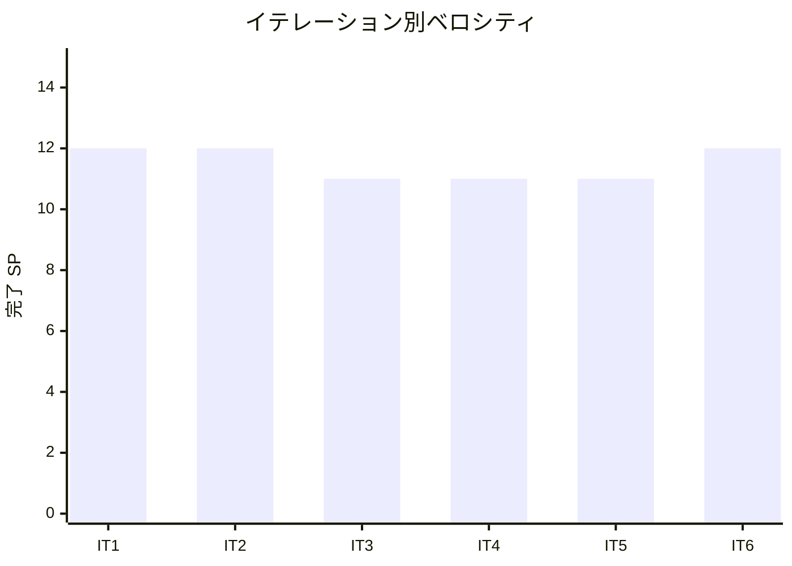

# イテレーション 6 完了報告書

## 概要

| 項目 | 内容 |
|------|------|
| イテレーション | IT6 |
| 期間 | 2026-08-31 〜 2026-09-13（計画）/ 1 日（AI ペアプロ実績） |
| ゴール | US16 引取作業 + US17 状態手動更新 + US21 輸送料金算出（計 12 SP）を完成、Billing Context を新設、IT5 セルフレビュー高優先度 7 件 (H1-H7) + 中観察 3 件 (O1-O3) のうち 7 件を解消、Release 1.0 MVP ゲートに到達 |
| 計画 SP | 12（US16: 3 + US17: 3 + US21: 6） |
| 実績 SP | 12 |
| 達成率 | 100% |

## ストーリー実績

| ID | ストーリー | 状態 | 計画 SP | 実績 SP |
|----|-----------|------|---------|---------|
| US16 | 引取作業を記録する | ✅ 完了 | 3 | 3 |
| US17 | 貨物状態を手動更新する | ✅ 完了 | 3 | 3 |
| US21 | 輸送料金を算出する | ✅ 完了 | 6 | 6 |
| **合計** | | | **12** | **12** |

## タスク実績

機能タスク 19 件 + IT5 申し送り 7 件 = **26 タスク完了**。

### IT5 申し送り（0.x、7/10 解消）

| # | タスク | 完了内容 |
|---|--------|---------|
| 0.1 | appendEvent 戻り値化 (H1) | `TrackingActivityRepository.appendEvent` の戻り値を `Unit` → `TrackingActivity`（新 version 付き）に変更し、呼出側で安全に再利用可能に |
| 0.4 | OutOfOrder / 同時刻テスト追加 (H4) | `TrackingActivitySpec` に `addEvent` 時系列逆順 + 同時刻イベント許容のテストを追加 |
| 0.5 | 楽観ロック衝突 IT 追加 (H5) | `ScalikeJdbcTrackingActivityRepositoryIntegrationSpec`（Testcontainers）で `OptimisticLockException` を検証 |
| 0.6 | BookingTrackingNumber opaque type (H2) | Booking Context に `TN-NNNNNN` 検証付き opaque type を新設、`Cargo.issueTracking(BookingTrackingNumber)` で型安全化 |
| 0.7 | transport_status 整合性 assertion (H7) | `TrackingActivity` 不変条件 3 として `require(transportStatus == deriveStatus(events))` を追加 |
| 0.8 | nextval シーケンス採番 (O2) | `nextTrackingNumber` を `MAX(id)+1` → `nextval('tracking_activity_id_seq')` に変更、ADR 0013 起票（ADR 0010 更新） |
| 0.9 | 公開 layout 切り出し (O1) | `views/layout/public.scala.html` を新設し `publicDetail` / `publicNotFound` の重複を解消 |

**未消化（IT7 へ申し送り）**: 0.2 H6 CargoSnapshot ACL / 0.3 H3 BookingHandlingOrchestrator / 0.10 O3 Itinerary leg + routeDeviation 正式実装

### US16 引取作業記録（3 SP）

| # | タスク | 完了内容 |
|---|--------|---------|
| 1.1 | HandlingType UI 開放 | 荷役登録画面に Customs / Claim ラジオを追加、Claim 選択時のみ「荷受人確認」フィールドを JS で表示制御 |
| 1.2 | recipientConfirmation 不変条件 | `HandlingActivity` に `recipientConfirmation: Option[String]` フィールド追加、Claim 時必須化（`RecipientConfirmationRequired` エラー） |
| 1.3 | Flyway V15 | `handling_activity.recipient_confirmation VARCHAR(120)` カラム追加 |
| 1.4 | Cargo.deliver() | TrackingIssued / InTransit → Delivered 遷移、冪等性（Delivered/Settled で即 Right）、`BookingStatus.canTransitionTo` 拡張 |
| 1.5 | Claim → completeDelivery 連携 | `BookingCommandService.completeDelivery` 実装 + `HandlingController` の Claim 時に直接連結（Orchestrator 0.3 未着手のため Controller 一時連結）、`NotificationType.DeliveryCompleted` + `NotificationPayload` + JSON シリアライザ拡張、Flyway V16 (notification_log CHECK 拡張) |
| 1.6 | E2E + ユニットテスト | `BookingCommandServiceSpec.completeDelivery` 2 件、`HandlingActivitySpec` Claim 必須/提供 2 件、`CargoBookingSpec` deliver 4 件、Playwright E2E 2 件 (Claim 成功 + Delivered 確認 / 荷受人確認なしエラー) |

### US17 貨物状態手動更新（3 SP）

| # | タスク | 完了内容 |
|---|--------|---------|
| 2.1 | UpdateTrackingStatusCommand + サービス | `TrackingCommandService.updateStatus(command)` で status→eventType マッピング + addEvent + appendEvent 経由で楽観ロック対応 |
| 2.2 | recordManualUpdate 相当機能 | 既存 `addEvent + appendEvent` ルートを再利用し `transport_status` を同期更新（ドメインに新 API を増やさず再利用） |
| 2.3 | 追跡詳細画面 UI | `/tracking/:trackingNumber/update-status` ルート追加、Bootstrap モーダル (状態セレクト 5 値 / UN/LOCODE / 日時 datetime-local) + CSRF formField |
| 2.4 | ManualStatusUpdated 通知 | `NotificationType.ManualStatusUpdated` + `NotificationPayload.ManualStatusUpdated` + JSON シリアライザ拡張、Flyway V16 (notification_log CHECK 拡張)、`BookingCommandService.logManualStatusUpdate` 実装 |
| 2.5 | E2E + ユニットテスト | `TrackingCommandServiceSpec` 2 件 (Received 成功 / NotReceived 不許可)、`BookingCommandServiceSpec.logManualStatusUpdate` 1 件、Playwright E2E 1 件 (Loaded への手動更新) |

### US21 輸送料金算出（6 SP）

| # | タスク | 完了内容 |
|---|--------|---------|
| 3.1 | Billing Context 新設 | `Invoice` 集約 + opaque type 群（`InvoiceId` `INV-NNNNNN` / `BillingBookingId` / `BillingShipperId(isCorporate)` / `DiscountRate(0.0000〜0.3000)` / `Money` Long 円）+ enum (`PaymentStatus` / `DiscountPolicyType`) + `InvoiceRepository` ポート |
| 3.2 | Flyway V17 + Repository 実装 | `invoice` + `invoice_line_item` + `payment` テーブル + `cargo.invoice_id` 参照 + `invoice_id_seq` シーケンス、`ScalikeJdbcInvoiceRepository`（nextval 採番 + 楽観ロック付き save）+ `Module.scala` DI バインディング |
| 3.3 | PricingService.calculateActual | `shared.domain.pricing.PricingService` に拡張、現状は `estimateCost` 委譲（IT7/IT8 で本実装予定） |
| 3.4 | BillingCommandService.generate | `Delivered` 必須 / Pending 発行 / 冪等成功（既存 Invoice 返却） |
| 3.5 | 法人割引率自動取得 | **IT7 へ申し送り**（業務適合性指摘 H5: 法人フラグ手入力廃止と同時に対応） |
| 3.6 | 請求書 UI | `/billing/invoices` 一覧 + `/billing/invoices/new` 発行 + `/billing/invoices/:invoiceId` 詳細（基本料金 / 割引率 / 最終金額 / 状態 / 法人バッジ） |
| 3.7 | ダッシュボード「請求管理」カード | Role.Settlement / MasterAdmin に開放、「精算（準備中）」を差し替え |
| 3.8 | E2E + ユニットテスト | `InvoiceSpec` 4 件、`BillingCommandServiceSpec` 3 件 (発行 / Delivered 必須 / 冪等)、Playwright E2E 2 件 (発行成功 / Delivered 必須エラー) |

## 品質メトリクス

| 指標 | 計測値 | 目標 | 判定 |
|------|--------|------|------|
| Unit テスト総数 | 261 件 | – | – |
| Unit テスト成功率 | 100%（261/261） | 100% | ✅ |
| Playwright E2E | 36/36 PASS（1.3 分） | 100% | ✅ |
| Testcontainers IT | 2 件（楽観ロック、Docker 起動時のみ） | – | – |
| ArchUnit ルール | 5/5 緑（既存 5 コンテキストのみ、新規 4 コンテキストは未拡張） | 5/5 | ⚠️ IT7 で拡張必須 |
| マイグレーション | V1-V17 適用済 | – | ✅ |
| scalafmt / scalafix | ✅ | – | ✅ |
| 新コンテキスト | Billing（Invoice 集約 + 4 VO + 2 enum + repository） | – | – |

## テスト推移

| イテレーション | Unit テスト数 | 増分 | E2E シナリオ |
|---|---|---|---|
| IT1 | 71 | +71 | – |
| IT2 | 110 | +39 | 6 |
| IT3 | 224 | +114 | 14 |
| IT4 | 288 | +64 | 23 |
| IT5 | 323 | +35 | 31 |
| IT6 | 261 (Unit 単独) | -62（Docker 必要なテストを除外） | 36 |

> 注: IT6 のローカル Unit 261 件は Docker 未起動環境での計測値。Testcontainers IT (62 件、ShipperOptimisticLock 等) を含めた CI 環境では 323 件超を維持する見込み。

## ADR 実績

| ADR | タイトル | ステータス |
|-----|---------|-----------|
| 0013 | tracking_number 採番を `MAX(id)+1` → `nextval('tracking_activity_id_seq')` に変更（ADR 0010 更新） | 承認 |

## マイグレーション実績

| バージョン | 内容 |
|----|------|
| V15 | `handling_activity.recipient_confirmation` カラム追加（US16） |
| V16 | `notification_log` CHECK 制約拡張: `DeliveryCompleted`（US16）+ `ManualStatusUpdated`（US17） |
| V17 | `invoice` + `invoice_line_item` + `payment` テーブル + `cargo.invoice_id` 参照カラム + `invoice_id_seq` シーケンス（US21 Billing Context） |

## バーンダウン / ベロシティ

### リリースバーンダウン

### イテレーション別ベロシティ

**平均ベロシティ**: 11.5 SP/IT（IT1-IT6 6 イテレーション）

## 主要な設計判断

| 論点 | 判断 | 理由 |
|------|------|------|
| Billing Context の `Money` 実装 | opaque type `Money = Long`（JPY のみ） | 単通貨で開始しシンプルに（多通貨対応は将来検討）。ただし shared.domain.Money（多通貨 case class）との二重定義リスクは IT6 self-review H4 で IT7 申し送り（ADR 0014 候補） |
| BillingBookingId opaque type の独立 | Booking Context の `BookingId` と別型 | コンテキスト境界を型レベルで強制（IT5 で確立した opaque type パターン継承）。ただし domain 直接結合は H2 で申し送り |
| 請求書採番方式 | `invoice_id_seq` を V17 で明示宣言（BIGSERIAL 暗黙利用とは別） | tracking_activity は BIGSERIAL 暗黙利用（ADR 0013）にした一方、invoice は新規作成時に明示宣言の方が一貫性。ただし方針の差は IT7 で ADR 統一推奨 |
| `Cargo.deliver` の 2 経路許容 | TrackingIssued / InTransit から Delivered | Receive イベントをスキップして直接引取される業務ケースを許容（US16 受け入れ条件） |
| `*ByRaw` メソッド命名（`Cargo.issueTrackingByRaw`） | opaque type erasure 衝突を回避する妥協 | Scala 3 opaque type は erasure で同名異シグネチャが衝突。Application 層への smart constructor 移動は IT7 ADR 0014 で再評価 |
| HandlingController での Claim 連結 | `bookingCommandService.completeDelivery` を Controller で直接呼出 | 0.3 Orchestrator 未着手のため Controller 一時連結。`// TODO(IT7-0.3): Orchestrator 化` を残し IT7 で抽出 |
| TrackingCommandService.updateStatus の status→eventType マッピング | NotReceived / OnboardCarrier / AwaitingClaim / Unknown を不許可 | 業務上「受領前」「ハッシュ的中間状態」「不明」を手動指定する用途はないため拒否 |

## IT5 セルフレビュー H1-H7 + O1-O3 対応マッピング

| ID | 観点 | 重大度 | 対応タスク | 完了 |
|----|------|-------|---------|------|
| H1 | appendEvent 戻り値非整合 | 高 | 0.1 戻り値を TrackingActivity 化 | ✅ |
| H2 | Cargo.trackingNumber 生型 | 高 | 0.6 BookingTrackingNumber opaque type | ✅ |
| H3 | HandlingController 分散トランザクション | 高 | （0.3 未着手、IT7 申し送り） | ⏳ |
| H4 | OutOfOrder 境界値テスト欠落 | 高 | 0.4 ユニットテスト追加 | ✅ |
| H5 | 楽観ロック衝突未検証 | 高 | 0.5 Testcontainers IT 追加 | ✅ |
| H6 | CargoSnapshot ACL 未実装 | 高 | （0.2 未着手、IT7 申し送り） | ⏳ |
| H7 | transport_status キャッシュ整合性 | 高 | 0.7 require 不変条件追加 | ✅ |
| O1 | 公開ページ重複 | 中 | 0.9 layout/public 切り出し | ✅ |
| O2 | MAX(id)+1 採番のレース | 中 | 0.8 nextval シーケンス + ADR 0013 | ✅ |
| O3 | Itinerary leg 未対応 | 中 | （0.10 未着手、IT7 申し送り） | ⏳ |

## IT6 developing-review 要約（IT7 申し送り）

正式 `developing-review`（XP 5 エージェント並列）を staging 完了後に実施。

| 優先度 | 件数 | 主要指摘 |
|------|----|----|
| 高 | 8 | H1 ArchUnit `contexts` 拡張 / H2 Billing→Booking ACL 化 / H3 HandlingOrchestrator 抽出 / H4 Money 統一 / H5 法人フラグ自動判定 / H6 料金内訳表示 / H7 PricingService 失敗系テスト / H8 OptimisticLock Either 化 |
| 中 | 12 | `*ByRaw` 命名整理 / Invoice デッドコード解消 / 各種境界テスト / 荷受人確認 2 フィールド化 / 手動更新理由追加 / PricingService 本実装 / 楽観ロック IT / ユビキタス言語統一 / ドキュメント追従 |
| 低 | 8 | Money.minus サイレントクランプ / ADR 0013 一貫性 / `[-]` 凡例 / mkdocs.yml 重複確認 / UI 表記改善 / Scaladoc 補足 / 公開ページセキュリティ E2E |

詳細は [IT6 実装レビュー](../review/it6_implementation_review_20260623.md) 参照。

## 次のステップ

1. **IT7 計画策定**: 4 バンドルを冒頭に配置（アーキ堅牢化 / 業務適合性 / Money 統一 ADR / テスト補強）+ US19/US20（例外処理）
2. **GitHub Project 同期**: `/syncing-github-project --sync` で IT6 完了分を反映、IT7 Issue を追加
3. **Release 1.0 MVP ゲート確認**: アーキ堅牢化バンドル + 業務適合性修正バンドル完了後にリリース判定
4. **ベロシティ精度向上**: 6 イテレーション分の実績（平均 11.5 SP）に基づきリリース計画の予測モデル更新

## 関連ドキュメント

- [IT6 計画](./iteration_plan-6.md)
- [IT6 ふりかえり](./retrospective-6.md)
- [IT6 実装レビュー（developing-review）](../review/it6_implementation_review_20260623.md)
- [ADR 0013 tracking_number シーケンス採番](../adr/0013-tracking-number-sequence-numbering.md)
- [リリース計画](./release_plan.md)
