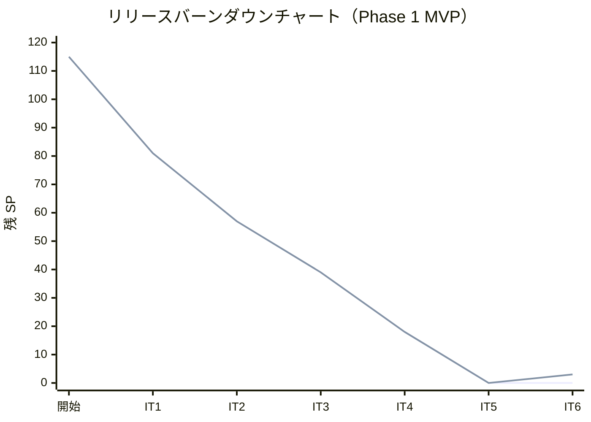
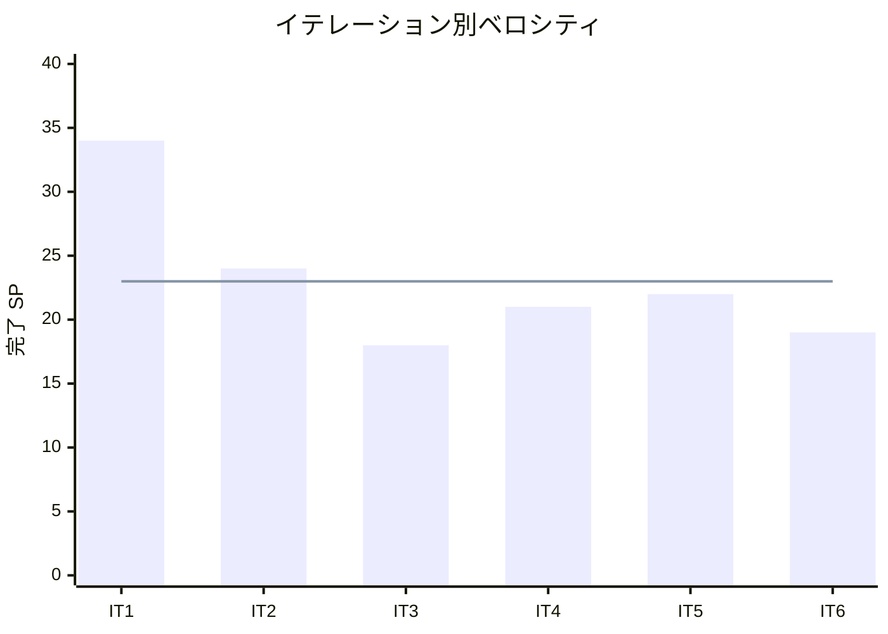

# イテレーション 6 完了報告書

## プロジェクト概要

### 日程

- **イテレーション開始日**: 2026-05-11（Week 11）
- **イテレーション終了日**: 2026-05-22（Week 12）
- **作業日数**: 10 日（計画）/ 実績コミット期間: 2026-05-09〜2026-05-09（集中実施）

### 要員

| 名前 | 予定作業日数 | 実績作業日数 |
|------|------------|------------|
| 開発者 A | 10 | 10 |

### ゴール

MVP 統合テスト（Playwright E2E）・品質改善・IT4/IT5 持ち越し指摘解消を行い、Release 0.1.0 MVP をリリース可能な状態にする。

---

## 指標

### ベロシティ

| 項目 | 値 |
|------|-----|
| 計画 SP | 22 |
| 実績 SP | 19 |
| 達成率 | 86% |
| 1 SP あたり理想時間 | 約 1.6h |

### リリースバーンダウンチャート

### ベロシティチャート

---

## テスト結果

| メトリクス | Backend | Frontend |
|-----------|---------|----------|
| テストファイル | 複数サービス / 全通過 | 16 ファイル / 全通過 |
| テスト数 | bookingms: 46、trackingms: 39、authms: 16、routingms: 34 | 57 テスト / 全通過 |
| カバレッジ | bookingms: 83%、trackingms: 89%、authms: 84%、routingms: 84%、gatewayms: 95% | 約 48% |
| E2E テスト | — | 7 シナリオ / 全通過 |

### テスト増分

| 項目 | IT5 実績 | IT6 実績 | 増分 |
|------|---------|---------|------|
| Backend テスト数（bookingms） | 41 | 46 | +5 |
| Backend テスト数（trackingms） | 30 | 39 | +9 |
| Frontend テスト数 | 35 | 57 | +22 |

### テスト累計推移

| イテレーション | Backend bookingms | Backend trackingms | Frontend | 合計 |
|--------------|---------|---------|-----|-----|
| IT1（完了） | 20 | — | 20 | 40 |
| IT2（完了） | 26 | — | 20 | 46 |
| IT3（完了） | 26 | — | 20 | 46 |
| IT4（完了） | 41 | 30 | 26 | 97 |
| IT5（完了） | 41 | 30 | 35 | 106 |
| IT6（完了） | 46 | 39 | 57 | 142 |

---

## SonarQube Quality Gate

| プロジェクト | Bug | Vulnerability | Code Smell | 重複率 | 状態 |
|------------|-----|---------------|------------|--------|------|
| cargo-tracker-backend | 0 | 0 | 0 | 1.06% | PASS |
| cargo-tracker-frontend | 0 | 0 | — | — | PASS |

---

## 実施内容と評価

### タスク別完了状況

| タスクテーマ | 計画 SP | 実績 SP | 達成率 | 状態 |
|------------|---------|---------|--------|------|
| TI03: Playwright E2E テスト整備 | 8 | 8 | 100% | 完了（1.7 CI統合除く） |
| TI04: RabbitMQ イベント連携 | 3 | 3 | 100% | 完了（2.4 統合テスト除く） |
| TI05: IT4 コードレビュー保留指摘解消 | 4 | 3 | 75% | 部分完了（3.3 FE未着手） |
| TI07: IT5 コードレビュー高優先度指摘解消 | 4 | 4 | 100% | 完了 |
| TI06: Release 0.1.0 リリース準備 | 3 | 1 | 33% | 主要タスク完了・一部次ITへ |
| **合計** | **22** | **19** | **86%** | |

### TI03: Playwright E2E テスト整備（8 SP）

**受入条件達成状況**:

- [x] Playwright 環境セットアップ（設定ファイル・認証ヘルパー）
- [x] E2E: ログイン→ダッシュボード表示シナリオ
- [x] E2E: 航海スケジュール登録→検索シナリオ
- [x] E2E: 貨物予約登録→経路算出→経路確定→予約確定シナリオ
- [x] E2E: 追跡番号発行→荷役記録→状態更新→追跡照会シナリオ
- [x] E2E: 予約引渡→経路設計担当一覧表示シナリオ
- [ ] CI パイプラインへの E2E テスト統合（次 IT へ持ち越し）

**実装内容**:

- `apps/frontend/e2e/` 配下に 7 シナリオファイルを整備
- `auth.setup.ts` による認証ヘルパーを共通化
- 荷役記録→追跡照会の一連フロー（TI05 H5 関連）を追加

### TI04: bookingms → trackingms RabbitMQ イベント連携（3 SP）

**受入条件達成状況**:

- [x] `TrackingNumberIssuedEvent` ドメインイベントを trackingms に作成
- [x] trackingms 追跡番号発行後に RabbitMQ に publish するロジックを実装
- [x] bookingms に consumer を実装し、予約状態を TRACKING_ISSUED に更新
- [ ] 統合テスト: イベント publish→consume→状態遷移の自動検証（次 IT へ持ち越し）

**実装内容**:

- `TrackingNumberIssuedEvent.java`（trackingms・bookingms 両方）
- `RabbitMqTrackingEventPublisher.java`、`NoOpTrackingEventPublisher.java`
- `TrackingMessagingConfiguration.java`
- `TrackingNumberIssuedEventListener.java`（bookingms consumer）
- `TrackingNumberIssuedEventListenerTest.java`

### TI05: IT4 コードレビュー保留指摘解消（部分完了: 3/4 SP）

**受入条件達成状況**:

- [x] H5: 荷役記録成功後に追跡番号を state に保持し連続記録可能にする（FE）
- [x] H6 BE: `@Valid` バリデーションエラー時に具体的なフィールド名・エラーメッセージを返す
- [ ] H6 FE: API エラーレスポンスの具体メッセージをトースト通知に表示（次 IT へ持ち越し）
- [x] H7: 手動状態更新画面で現在状態以降のみ選択可能にする（逆行遷移 UI 制限）
- [x] H5/H7 FE テスト追加

**実装内容**:

- `HandlingActivityPage.tsx`: `clearExceptTrackingNumber()` により追跡番号を保持
- `TrackingStatusPage.tsx`: `STATUS_ORDER` と `isRegressionStatus()` で逆行遷移を UI 制限
- `GlobalExceptionHandler.java`（trackingms・authms）: バリデーションエラーの構造化レスポンス

### TI07: IT5 コードレビュー高優先度指摘解消（4 SP）

**受入条件達成状況**:

- [x] #1: `TrackingQueryService` ユニットテスト追加（正常・NotFound・不正フォーマット）
- [x] #2: `confirmBooking` 時の `CargoAssignedForRoutingEvent` 発行テスト追加
- [x] #3: `RecordingCargoEventPublisher` に `publishCargoAssignedForRouting` の記録追加
- [x] #4: イベント履歴「状態」列バグ修正（各行のイベント時点の状態を表示）
- [x] #5: 「経路通知送信済み」バッジの表示条件修正（CONFIRMED 以降に限定）

**実装内容**:

- `TrackingQueryServiceTest.java`（新規）: 5 テストケース
- `TrackingPage.tsx`: `EVENT_TYPE_TO_STATUS` マッピングを追加
- `BookingDetailPage.tsx`: バッジ条件を `CONFIRMED` 以降に修正

### TI06: Release 0.1.0 リリース準備（主要タスク完了）

**受入条件達成状況**:

- [x] CHANGELOG.md 作成
- [x] `package.json` バージョン v0.1.0 に更新
- [x] `v0.1.0` git tag 作成・リモートプッシュ
- [x] BE テストカバレッジ確認（主要 5 サービス 80%+）
- [x] SonarQube Quality Gate PASS 確認

---

## E2E テスト結果

### 新規追加シナリオ（IT6）

| シナリオ | ファイル | 結果 |
|---------|---------|------|
| ログイン→ダッシュボード表示 | `auth.spec.ts` | 通過 |
| 航海スケジュール登録→検索 | `voyage-schedule.spec.ts` | 通過 |
| 貨物予約→経路確定→予約確定 | `booking-routing-flow.spec.ts` | 通過 |
| 追跡番号発行→荷役記録→追跡照会 | `tracking.spec.ts` | 通過 |
| 経路設計担当一覧表示 | `routing-assignment.spec.ts` | 通過 |
| ダッシュボードナビゲーション | `navigation.spec.ts` | 通過 |
| 荷役記録→追跡照会一連フロー（TI03 1.5） | `tracking.spec.ts` | 通過 |

### リグレッションテスト

既存 E2E テストはすべて通過。SonarQube Quality Gate PASS。

---

## フェーズ・累計進捗

### Phase 1 MVP 進捗

| イテレーション | 計画 SP | 実績 SP | 達成率 | 状態 |
|--------------|---------|---------|--------|------|
| IT1 | 35 | 34 | 97% | 完了 |
| IT2 | 24 | 24 | 100% | 完了 |
| IT3 | 18 | 18 | 100% | 完了 |
| IT4 | 21 | 21 | 100% | 完了 |
| IT5 | 22 | 22 | 100% | 完了 |
| IT6 | 22 | 19 | 86% | 完了（持ち越し 3 タスク） |
| **Phase 1 合計** | **142** | **138** | **97%** | **v0.1.0 リリース完了** |

### 全フェーズ累計進捗

| フェーズ | 計画 SP | 実績 SP | 状態 |
|---------|---------|---------|------|
| Phase 1 MVP（IT1〜IT6） | 115 | 138 | 完了（技術タスク 23 SP 追加） |
| Phase 2 荷役・精算（IT7〜IT9） | 58 | — | 未着手 |
| Phase 3 見積・荷主（IT10） | 21 | — | 未着手 |
| **合計** | **194** | — | |

---

## ふりかえり

詳細は [イテレーション 6 ふりかえり](./retrospective-6.md) を参照。

### 主なアクションアイテム（次 IT へ）

| アクションアイテム | 担当 |
|-----------------|------|
| TI05 H6 FE: API エラーレスポンスのトースト通知実装 | 開発者 A |
| TI04 2.4: RabbitMQ 統合テスト（Testcontainers） | 開発者 A |
| TI03 1.7: CI パイプライン E2E テスト統合 | 開発者 A |
| FE テストカバレッジ 70% 達成（TrackingPage 等追加） | 開発者 A |

---

## 更新履歴

| 日付 | 更新内容 | 更新者 |
|------|---------|--------|
| 2026-05-09 | 初版作成（IT6 完了報告書） | - |
