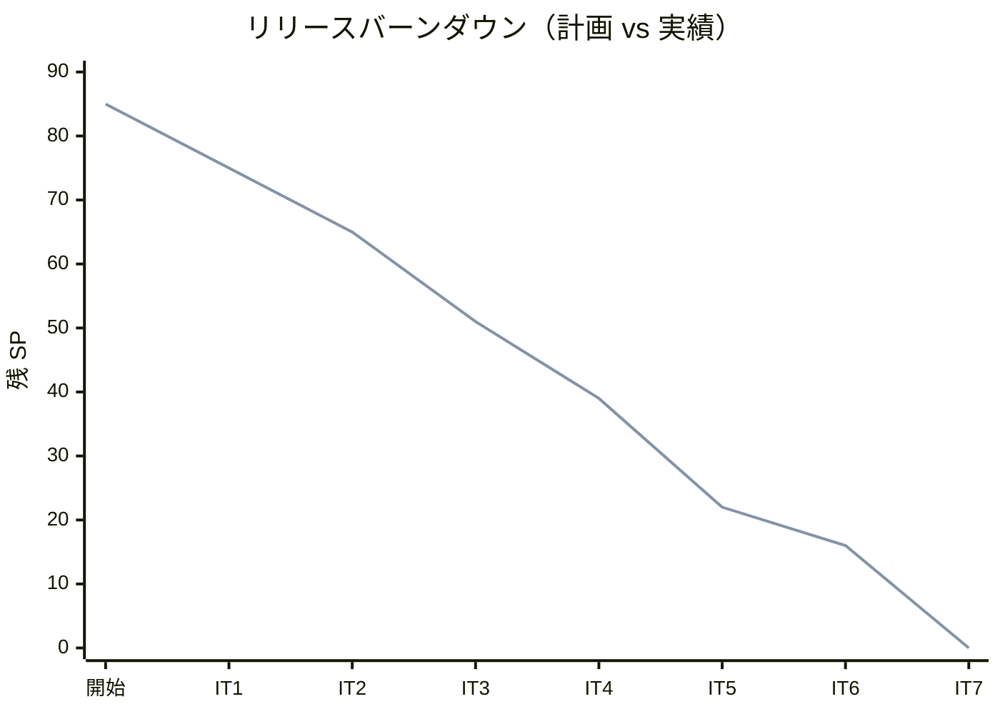
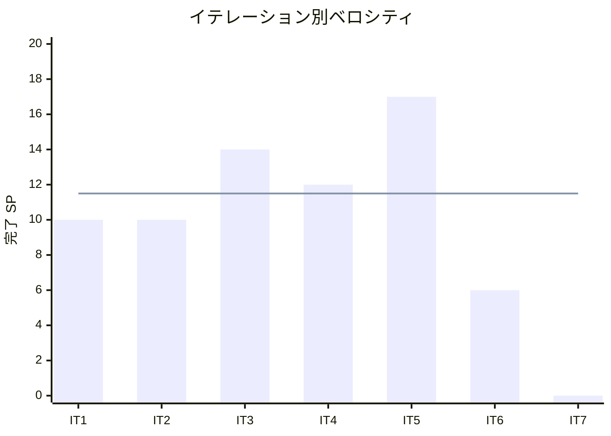

# イテレーション 6 完了報告書

## プロジェクト概要

国際貨物輸送管理システム（Cargo Tracker F# 版）のイテレーション 6 完了報告。
終盤アウトサイドインで例外対応（遅延・破損・紛失）を実装し、例外登録から InException 導出遷移・荷主通知・エスカレーション・対応報告・解決復帰までを全層縦貫通させ、Release 1.1 の例外対応フローを完成させた。あわせて IT5 レビュー IT6 送り（高2・中6）と retro-5 Try#1/#4 を全消化した。

## 日程

- イテレーション開始日: 2026-09-22（計画）
- イテレーション終了日: 2026-10-03（計画）
- 作業日数: 10 日（2 週間）
- 局面: 終盤（アウトサイドイン）

## 要員

| 名前 | 予定作業日数 | 実績作業日数 |
|------|-------------|-------------|
| 開発担当 + AI エージェント | 10 | 10 |

## 指標

### ビルド・テスト結果

| 項目 | 結果 |
|------|------|
| ユニットテスト（CargoTracker.Tests） | 188 件緑 |
| 統合テスト（CargoTracker.IntegrationTests） | 128 件緑 |
| アーキテクチャテスト（CargoTracker.ArchTests） | 24 件緑 |
| **合計** | **340 件緑・失敗 0** |
| ビルド警告 | 0 |
| Fantomas フォーマット | クリーン |
| カバレッジ（全体 / ドメイン層） | 91.6% / 89.7%（閾値 80% / 85% クリア） |

### イテレーションバーンダウン（リリース）

### ベロシティ

## 実施内容と評価

| ストーリー | 結果 | 予定ポイント | ベロシティ加算ポイント |
|-----------|------|-------------|----------------------|
| US19 遅延例外を処理する | 完了 | 3 | 3 |
| US20 破損・紛失例外を処理する | 完了 | 3 | 3 |
| **合計** | | **6** | **6** |

> ストーリー 6 SP に加え、IT5 レビュー IT6 送り（高2・中6）と retro-5 Try#1/#4 の技術的負債タスク（約 18h 分）を併走消化した。

### 主な成果物

| 種別 | 成果物 |
|------|--------|
| ドメイン | Tracking 例外（`ExceptionType`・`ExceptionResolution` DU・`TrackingException.register`・`RegisterException`/`ResolveException` コマンド・`currentStatus` の InException 導出） |
| アプリケーション | `ManageException.register`/`resolve` ワークフロー・`EscalationNotifier` ポート・`IssueTracking` 通知に公開 URL 同梱 |
| インフラ | tracking_exception_event（マイグレーション 0011・postgresql/sqlite）・`syncExceptions`・reconstruct の例外復元・`syncEvents` の append-only 化・`CargoQueries.findArrivalDeadline` |
| Web | 例外登録画面（`/tracking/{tn}/exceptions/new`・ROLE_TRACKER）・追跡詳細の例外一覧/解決導線/現在地/推定到着日表示・`notificationLogNotifier`/`escalationLogNotifier` |
| ADR | ADR-0011（追跡照会の所有者制御＝capability トークン＋RBAC）・ADR-0012（荷役→追跡はベストエフォート＋冪等の結果整合） |
| 設計反映 | iteration_plan-6 にデータモデル節・状態遷移図追加・BC 越境実態の注記 |
| テスト | ドメイン例外 8 件（FsCheck 往復・InException 導出・二重解決拒否）・アプリ層 4 件・永続化往復 2 件・Parse 例外 1 件・受け入れ 3 件・E2E に US19 拡張 |

### レビュー（セルフレビュー・IT5 レビュー IT6 送りの消化）

IT5 レビューで IT6 送りとされた高 2・中 6 と retro-5 Try#1/#4 を本 IT で全消化した。

| 出典 | 指摘 | 対応 |
|------|------|------|
| レビュー高#5 | US18 追跡照会に現在地・推定到着日を表示 | 追跡詳細に現在地（最新イベント場所）・ETA（合成層で cargo.arrival_deadline 解決）を表示 |
| レビュー高#6 | 公開追跡 URL を荷主へ提示する導線 | 追跡番号発行通知に `/public/tracking/{token}` を同梱 |
| レビュー中#1 | dispatch 例外にログを残す | `applyCommand` の Async.Catch でログ出力 |
| レビュー中#2 | syncEvents を append-only 化 | 未永続分のみ追記へ変更 |
| レビュー中#3 | 通知 recipient を荷主識別子へ | 発行通知の booking_id/recipient を予約 ID へ是正 |
| レビュー中#4 | US16 荷役登録の確認ステップ | 確認チェックボックス（required）＋引取必須ヒント追加 |
| レビュー中#5 / retro Try#1 | 荷役→追跡の原子性 | ADR-0012 で結果整合方針を確定 |
| レビュー中#6 | Parse 例外経路のテスト | 不正日時の復元が Error を返す統合テスト追加 |
| retro Try#4 | 所有者制御の明文化 | ADR-0011 起票 |

### デスコープ・保留

| 項目 | 状態 | 理由 |
|------|------|------|
| 例外→Booking Delivery 越境同期 | 非該当 | Booking の transport_status が未実体化（将来追加予定）。InException は Tracking 自身のキャッシュで往復保証し `TrackingExceptionDetected` は将来消費用に発行 |
| 通知の実メール送信・荷主連絡先解決 | 保留 | notification_log 記録に留まる（retro-5 Try#2・通知強化 IT へ継続） |
| 荷役→追跡の自動再試行（アウトボックス） | 保留 | ADR-0012 で方針確定。実装は将来移行項目 |
| ui_design の「例外解決」state 追記・例外種別コード統一 | 保留 | retro-6 Try#3（IT7 着手前反映） |

### イテレーションレビュー（次イテレーションへの引き継ぎ）

| アクションアイテム | 担当 |
|-------------------|------|
| 通知を合成層ヘルパへ集約し方針統一（retro-5 Try#3 継続） | 開発担当 |
| 通知の実メール送信化・荷主連絡先解決（retro-5 Try#2 継続） | 開発担当 |
| ui_design に例外解決 state 追記・例外種別コードを data-model と統一 | 開発担当 |
| 終盤パターン（集約拡張＋DU 写像永続化＋合成層 ACL＋受け入れ縦貫通）を Billing へ適用 | 開発担当 |

## 総括

計画 6 SP を 100% 達成。IT1-6 の 6 イテレーション連続で計画どおり消化（累計 69/69 SP）。
終盤アウトサイドインの狙いどおり、実装済みの Tracking 集約を例外という業務シナリオ起点で拡張し、受け入れテスト → Web → アプリ層 → ドメインの順で駆動した。
例外の解決状態を `ExceptionResolution` DU で表現して不正状態を型排除し、`InException` を導出値として扱うことで「解決後の状態復帰」を実装レスに達成した。
ストーリーは 6 SP と小さいが、IT5 レビュー IT6 送り（高2・中6）と retro-5 Try#1/#4 の技術的負債を約 18h 分併走消化し、暗黙の未対応をゼロにした。ADR-0011/0012 で所有者制御・荷役→追跡整合の方針を明文化し、「未達」でなく「意図的判断」として清算した。
実装中に「例外→Booking Delivery 越境同期」の同期先が未実体化と判明し、憶測でなく事実を確認して設計を調整した点も、変更を安全にする規律の実践である。
**Release 1.1 の例外対応フロー（登録→InException→通知→エスカレーション→対応報告→解決復帰）が IT6 完了で一気通貫し、E2E（US13→US14→US15→US18→US19）で実証**された。
残る IT7（US-ADM-01/US21/US22/US23・16 SP）で Billing（料金算出・法人割引・精算・割引ポリシー）を実装し、Release 1.1 出荷判定を行う。

---

## 関連ドキュメント

- [イテレーション 6 計画](./iteration_plan-6.md)
- [イテレーション 6 ふりかえり](./retrospective-6.md)
- [リリース計画](./release_plan.md)
- [ADR-0011（追跡照会の所有者制御）](../adr/0011-追跡照会の所有者制御はcapabilityトークンとロールで行う.md)
- [ADR-0012（荷役→追跡の結果整合）](../adr/0012-荷役から追跡への状態連携はベストエフォートと冪等で行う.md)
