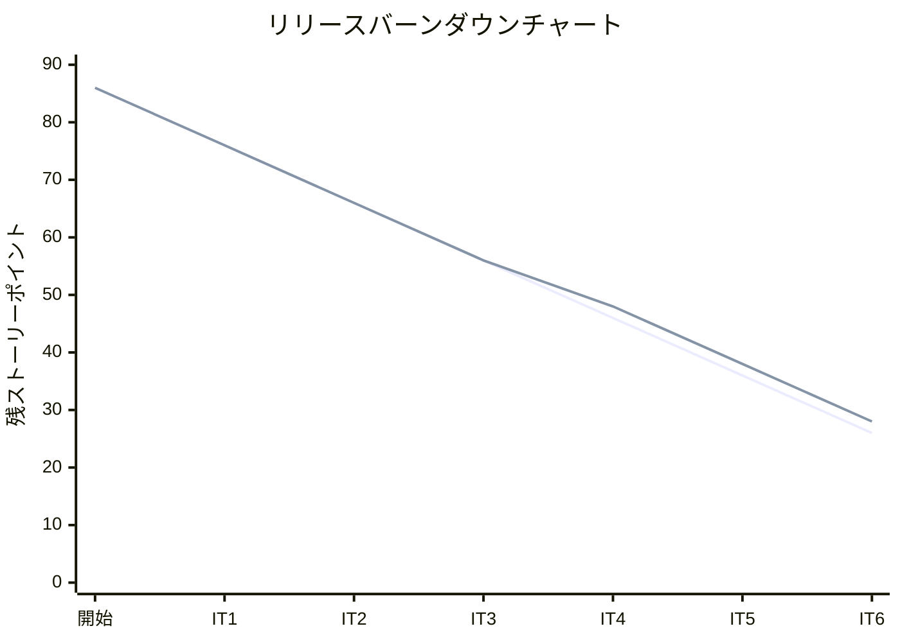
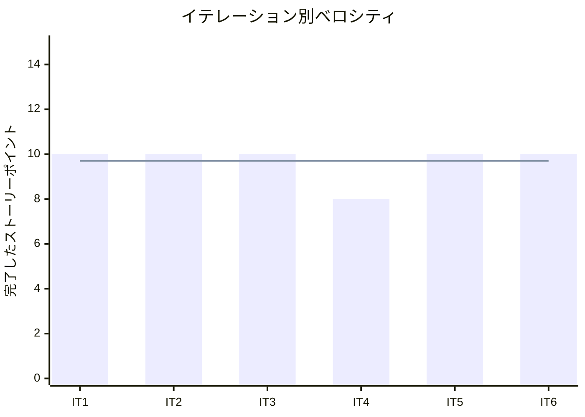

# イテレーション 6 完了報告書

## プロジェクト概要

### 日程

| 項目 | 値 |
|------|-----|
| イテレーション開始日 | 2026-04-10 |
| イテレーション終了日 | 2026-04-10（計画 2026-05-20） |
| 計画期間 | 2026-05-07 〜 2026-05-20（2 週間） |
| 実績作業日数 | 1 日（AI ペアプログラミングにより大幅短縮） |

### 要員

| 名前 | 予定作業日数 | 実績作業日数 |
|------|-------------|-------------|
| 開発者 + AI ペア | 10 | 1 |

---

## 指標

### ビルド結果

| 項目 | 結果 |
|------|------|
| Java テスト | 272 件全パス（IT5: 250 件から +22 件） |
| Playwright E2E テスト | 67 件全パス（IT5: 56 件から +11 件） |
| 命令カバレッジ (JaCoCo) | **81%**（IT5: 88% から -7%。Billing コンテキスト追加による分母増加） |
| SonarQube Quality Gate | IT5 で PASS 達成済み |

### イテレーションバーンダウン

> **注**: IT6 実績は 10 SP 完了のため残 SP = 38 - 10 = 28（IT5-改善 3 SP + US22 3 SP + US23 4 SP）。

### ベロシティ

| 項目 | 値 |
|------|-----|
| 計画ベロシティ | 10 SP/イテレーション |
| IT6 実績ベロシティ | 10 SP |
| 累計実績ベロシティ | 58 SP（IT1: 10 + IT2: 10 + IT3: 10 + IT4: 8 + IT5: 10 + IT6: 10） |
| 平均ベロシティ（IT1-6） | 9.7 SP/イテレーション |

---

## 実施内容と評価

| ストーリー | 結果 | 予定ポイント | ベロシティ加算ポイント |
|-----------|------|-------------|---------------------|
| IT5-改善: IT5 申し送り高優先度対応（受入条件充足・ドメインイベント・パターン統一・テスト品質） | 完了 | 3 | 3 |
| US22: 法人割引を適用する | 完了 | 3 | 3 |
| US23: 精算を処理する | 完了 | 4 | 4 |
| **合計** | | **10** | **10** |

### 成果物一覧

| カテゴリ | 成果物 | 件数 |
|---------|--------|------|
| ドメインモデル（Billing Context） | `Invoice`（集約）、`InvoiceId`（値オブジェクト）、`DiscountPolicy`（値オブジェクト）、`PaymentStatus`（列挙型） | 4 クラス |
| ACL（Billing Context） | `BookingSettlementPort`（予約情報取得）、`ShipperDiscountPort`（割引情報取得） | 2 インターフェース |
| ドメインモデル拡張（Booking Context） | `CargoRoutedEvent` ドメインイベント発行、`BookingStatus.SETTLED` 追加、`requireStatus(EnumSet)` パターン適用 | 3 件 |
| アプリケーション（Billing） | `InvoiceApplicationService`、`InvoiceEventHandler`（CargoRoutedEvent 受信）、`InvoiceResponse` | 3 クラス |
| アプリケーション拡張（Booking） | `executeBookingCommand` パターン統合、`assignRoute` エンドポイント整理 | 2 件 |
| インフラ（Billing） | `MyBatisInvoiceRepository`、`InvoiceMapper.java + InvoiceMapper.xml` | 3 ファイル |
| データベース | V10 Flyway マイグレーション（`invoice` テーブル新規作成） | 1 ファイル |
| プレゼンテーション（Billing） | `BillingThymeleafController`、`index.html`・`show.html`・`confirm.html` | 4 ファイル |
| プレゼンテーション拡張（Booking） | `route.html` にフィードバックメッセージ領域追加、`show.html` に経路情報セクション追加 | 2 ファイル |
| バグ修正 | Thymeleaf SpEL 曖昧メソッド呼び出しエラー修正（`BigDecimal.valueOf` → `doubleValue()` 利用） | 1 件 |
| テスト（Java） | `InvoiceTest`、`InvoiceApplicationServiceTest`、`BillingThymeleafControllerTest`、`BookingThymeleafControllerTest` 拡張 | 複数 |
| テスト（E2E） | `BillingPage.ts` Page Object 新規（BillingIndexPage・BillingShowPage・BillingConfirmPage）、`billing.spec.ts` 新規（11 件）、`NavbarPage.ts` 拡張 | 3 ファイル |
| ドキュメント | `retrospective-6.md`、`iteration_report-6.md` | 2 ファイル |

---

## IT5 申し送り対応状況

### IT5 高優先度申し送り（IT6 で対応完了）

| # | 内容 | 状態 |
|---|------|------|
| 1 | US09-AC1: 費用情報を経路一覧に表示する | ✓ 完了（`route.html` に基本運賃情報表示） |
| 2 | US11-AC1: 予約詳細画面に割り当て済み経路情報を表示する | ✓ 完了（`show.html` に経路情報セクション追加） |
| 3 | `assignItinerary` に `requireStatus(EnumSet)` パターン適用 | ✓ 完了 |
| 4 | `assignItinerary` でドメインイベント（`CargoRoutedEvent`）発行 | ✓ 完了 |
| 5 | `assignRoute` を `executeBookingCommand` パターンに統合 | ✓ 完了 |
| 6 | `routeDetail` の未使用 `bookingId` パスパラメータを削除 | ✓ 完了 |
| 7 | 統合テスト（`BookingThymeleafControllerTest`）のセットアップ重複解消 | ✓ 完了（`createGeneralBooking()` ヘルパーに集約） |
| 8 | `route.html` にフィードバックメッセージ表示領域を追加 | ✓ 完了（`alert-success`・`alert-danger`） |

### IT5 中優先度申し送り（IT6 未対応 → 持ち越し）

| # | 内容 | 状態 |
|---|------|------|
| 9 | 統合テストと E2E テストの責務分離 | ✗ 持ち越し |
| 10 | htmx フラグメントを `th:fragment` で実装 | ✗ 持ち越し |
| 11 | `Leg` compact constructor に時刻整合性バリデーション追加 | ✗ 持ち越し |
| 12 | `assign-to-routing` ステップに `status().is3xxRedirection()` 検証追加 | ✗ 持ち越し |
| 13 | E2E テストの異常系シナリオ追加 | ✗ 持ち越し |

---

## 受入条件の達成状況

### IT5-改善（高優先度 8 件）

| # | 受入条件 | 状態 |
|---|---------|------|
| 1 | US09-AC1: 費用情報が経路一覧に表示される | ✓ 完了 |
| 2 | US11-AC1: 予約詳細画面に割り当て済み経路情報が表示される | ✓ 完了 |
| 3 | `assignItinerary` に `requireStatus(EnumSet)` パターンが適用され、状態ガードが統一されている | ✓ 完了 |
| 4 | `assignItinerary` で `CargoRoutedEvent` が発行されている | ✓ 完了 |
| 5 | `assignRoute` が `executeBookingCommand` パターンに統合されている | ✓ 完了 |
| 6 | `routeDetail` の未使用 `bookingId` パスパラメータが削除されている | ✓ 完了 |
| 7 | `BookingThymeleafControllerTest` のセットアップが `createGeneralBooking()` ヘルパーに集約されている | ✓ 完了 |
| 8 | `route.html` に `alert-success`・`alert-danger` フィードバックメッセージ表示領域が追加されている | ✓ 完了 |

### US22: 法人割引を適用する

| # | 受入条件 | 状態 |
|---|---------|------|
| 1 | 荷主種別が「法人」の場合、料金算出時に契約割引率が自動的に取得・表示される | ✓ 完了（`ShipperDiscountPort` で自動取得） |
| 2 | 割引率（0〜30%）が基本料金に適用され、割引後の金額が表示される | ✓ 完了（精算書詳細画面に表示） |
| 3 | 個人荷主の場合は割引が適用されない | ✓ 完了（`DiscountPolicy.none()` 適用） |
| 4 | 割引計算の根拠（割引率・基本料金・割引後料金）が精算書に記載される | ✓ 完了（請求詳細画面に全情報表示） |

### US23: 精算を処理する

| # | 受入条件 | 状態 |
|---|---------|------|
| 1 | 経路確定後に精算書が自動生成されて一覧に表示される | ✓ 完了（`CargoRoutedEvent` → `InvoiceEventHandler` による自動生成） |
| 2 | 精算書には請求番号・合計金額・支払期限が記載される | ✓ 完了（発行日から 30 日後を支払期限に設定） |
| 3 | 入金確認画面から入金確認操作ができる | ✓ 完了（PRG パターン実装） |
| 4 | 入金確認後に精算書の支払状態が「精算済」になる | ✓ 完了（`PaymentStatus.CONFIRMED`） |
| 5 | 入金確認後に予約状態が「精算完了」になる | ✓ 完了（`BookingStatus.SETTLED`） |

---

## テスト結果

### テスト増分

| 種別 | IT5 完了時 | IT6 完了時 | 増分 |
|------|-----------|-----------|------|
| Java テスト（実行件数） | 250 件 | 272 件 | +22 件 |
| Playwright E2E テスト | 56 件 | 67 件 | +11 件 |
| 命令カバレッジ | 88% | **81%** | -7%（Billing コンテキスト追加による分母増加） |

### IT6 新規追加テストクラス・メソッド

| テストクラス / ファイル | 追加内容 | 件数 |
|----------------------|--------|------|
| `InvoiceTest` | `Invoice` 集約の正常系・異常系ユニットテスト | 新規 |
| `InvoiceApplicationServiceTest` | 精算書発行・入金確認・ACL 統合テスト | 新規 |
| `BillingThymeleafControllerTest` | 精算書一覧・詳細・入金確認コントローラテスト | 新規 |
| `BookingThymeleafControllerTest` | IT5-改善：ヘルパーメソッド抽出、経路情報表示テスト追加 | 拡張 |
| `billing.spec.ts` | US22 AC1-4・US23 AC1-4・ナビゲーション 3 件 | 11 件 新規 |
| `NavbarPage.ts` | `billingLink`・`clickBilling()` 追加 | 拡張 |
| `BillingPage.ts` | `BillingIndexPage`・`BillingShowPage`・`BillingConfirmPage` Page Object | 新規 |

### テスト累計推移

| イテレーション | Java テスト（実行件数） | E2E テスト | 命令カバレッジ | ブランチカバレッジ |
|--------------|----------------------|-----------|--------------|-----------------|
| IT1 | 60 件 | 27 件 | 89% | - |
| IT2 | 166 件 | 31 件 | 93% | 81% |
| IT3 | 約 184 件 | 41 件 | 未計測 | 未計測 |
| IT4 | 約 217 件 | 40 件 | 91% | 75% |
| IT5 | 250 件 | 56 件 | 88% | 75% |
| **IT6** | **272 件** | **67 件** | **81%** | - |

---

## E2E テスト結果

### IT6 新規追加シナリオ（billing.spec.ts）

| # | テスト記述 | ファイル | 結果 |
|---|----------|---------|------|
| 1 | US22 AC1: 精算書一覧に割引後金額が表示される | billing.spec.ts | ✓ 通過 |
| 2 | US22 AC2: 精算書詳細に割引種別・割引率が表示される（法人割引） | billing.spec.ts | ✓ 通過 |
| 3 | US22 AC3: 精算書詳細に割引後金額が表示される | billing.spec.ts | ✓ 通過 |
| 4 | US22 AC4: 精算書に支払期限（発行日から 30 日後）が表示される | billing.spec.ts | ✓ 通過 |
| 5 | US23 AC1: 経路確定後に精算書が自動生成されて一覧に表示される | billing.spec.ts | ✓ 通過 |
| 6 | US23 AC2: 入金確認画面から入金確認操作ができる | billing.spec.ts | ✓ 通過 |
| 7 | US23 AC3: 入金確認後に精算書の支払状態が「精算済」になる | billing.spec.ts | ✓ 通過 |
| 8 | US23 AC4: 入金確認後に予約状態が「精算完了」になる | billing.spec.ts | ✓ 通過 |
| 9 | ナビバーに請求管理リンクが表示される | billing.spec.ts | ✓ 通過 |
| 10 | 請求管理ページでは請求管理リンクがアクティブになる | billing.spec.ts | ✓ 通過 |
| 11 | ナビバーの請求管理リンクで請求一覧へ遷移できる | billing.spec.ts | ✓ 通過 |

### リグレッションテスト

| ファイル | テスト数 | 結果 |
|---------|---------|------|
| auth.spec.ts | 4 | ✓ 全件通過 |
| booking.spec.ts | 25 | ✓ 全件通過 |
| billing.spec.ts | 11 | ✓ 全件通過（新規） |
| estimation.spec.ts | 4 | ✓ 全件通過 |
| shipper.spec.ts | 5 | ✓ 全件通過 |
| navigation.spec.ts | 13 | ✓ 全件通過 |
| voyage.spec.ts | 5 | ✓ 全件通過 |
| **合計** | **67** | **✓ 全件通過** |

---

## フェーズ・累計進捗

### Phase 3 進捗

| ユーザーストーリー | SP | 状態 |
|-----------------|-----|------|
| US17: 貨物状態を手動更新する | 3 | 未着手 |
| US19: 遅延例外を処理する | 5 | 未着手 |
| US20: 破損・紛失例外を処理する | 5 | 未着手 |
| US21: 輸送料金を算出する | 5 | 未着手 |
| US22: 法人割引を適用する | 3 | ✓ 完了（IT6） |
| US23: 精算を処理する | 5 | ✓ 完了（IT6） |

**Phase 3 進捗**: 8 / 26 SP 完了（31%）

### 全体累計進捗

| フェーズ | 計画 SP | 完了 SP | 達成率 |
|---------|---------|---------|--------|
| Phase 1（予約・荷主管理基盤） | 16 | 16 | 100% |
| Phase 2（経路設計・追跡） | 44 | 23 | 52% |
| Phase 3（精算・例外処理） | 26 | 8 | 31% |
| **合計** | **86** | **47** | **55%** |

> **注**: Phase 2 の US12・US14・US15・US16・US18 は未実装。Phase 3 の US17・US19・US20・US21 は未実装。精算機能（US22・US23）のみ完成。

---

## ふりかえり

詳細は [イテレーション 6 ふりかえり](./retrospective-6.md) を参照。

---

## 更新履歴

| 日付 | 更新内容 | 更新者 |
|------|---------|--------|
| 2026-04-10 | 初版作成 | - |
