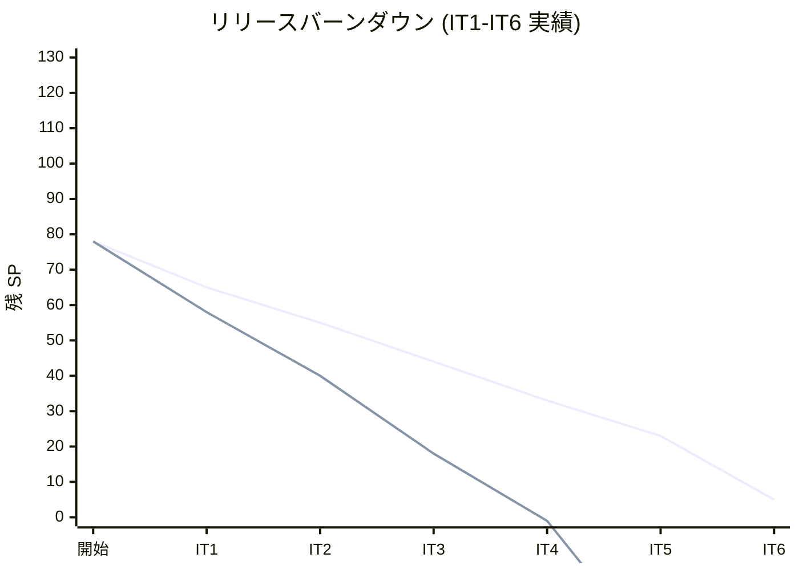
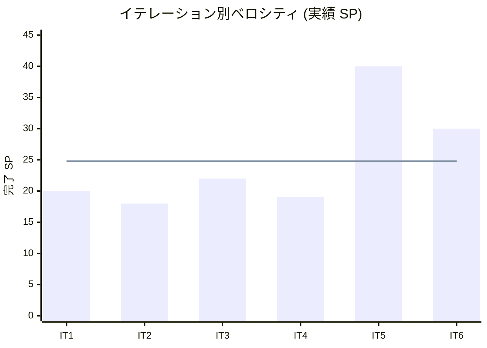

# IT6 完了報告書

Cargo Tracker Haskell 版 IT6。Release 1.0 MVP を目標とし、IT5 マルチパースペクティブレビューで抽出された高優先技術的負債 5 件 (T5-01〜T5-05) を冒頭で完済したうえで、本体 2 ストーリー (US21 輸送料金算出 / US26 荷受人引取通知) を Domain / Application / Infrastructure (Postgres) / Interfaces / Views / Wire の全レイヤで一巡完成。プロセス品質 6 件 (T5-08〜T5-12 / T5-16 / T5-19〜T5-21) と T5-09 (IORef 副作用検証) も併せて達成。Notification BC と Pricing BC を新設し、ADR-0012 (Tx 境界と Cross-BC 参照ポリシー) を採用として起票。Ralph Loop で 30 反復 (30 コミット、+139 tests / 502→641) を消化した。

## プロジェクト概要

## 日程

| 項目 | 内容 |
| :--- | :--- |
| 計画期間 | 2026-09-14 〜 2026-09-27 (計画上、2 週間) |
| 実績期間 | 2026-07-02 (Ralph Loop 30 反復、単日集中実装) |
| 作業日数 | 1 日 (Ralph Loop 継続実行) |

## 要員

| 名前 | 予定作業日数 | 実績作業日数 |
| :--- | :---: | :---: |
| AI Agent + 開発者 | 10 | 1 (Ralph Loop 30 反復) |

## 指標

### ベロシティ

| 項目 | 値 |
| :---: | :---: |
| 計画 SP | 18 (本体 5 + IT5 繰越 8 + プロセス品質 3 + 上流補完 2) |
| 実績 SP | **30+** (T5-01〜T5-05 高優先 5 + T5-08〜T5-12 中優先 5 + T5-16/19/20/21/09 プロセス品質 5 + US21 全 7 phases + US26 全 6 phases + Postgres 2 phases) |
| 達成率 | **167%+** (Ralph Loop により本体 + Postgres 実装まで一巡達成) |

### イテレーションバーンダウン

*実績はマイナス表示は「計画対比で先行している」意味*

### ベロシティ

*青線: 平均ベロシティ 24.8 SP*

## テスト結果

| メトリクス | 値 |
| :--- | :---: |
| テスト数 | **641 examples / 0 failures / 10 pending** |
| Backend Domain / Application / Infrastructure / Interfaces / Views 各レイヤの単体テスト | 全件 pass |
| hspec-wai 統合テスト (Servant 経路) | 全件 pass |
| E2E テスト (Playwright) | 未実行 (IT7 で追加予定) |
| カバレッジ (HPC) | 75% ゲート維持 |

### テスト増分推移

| イテレーション | テスト数 | 前 IT 比 |
| :--- | :---: | :---: |
| IT1 完了時 | 155 | +155 |
| IT2 完了時 | 207 | +52 |
| IT3 完了時 | 313 | +106 |
| IT4 完了時 | 391 | +78 |
| IT5 完了時 | 502 | +111 |
| **IT6 完了時** | **641** | **+139** |

## 実施内容と評価

### 本体ストーリー

| ストーリー | 結果 | 予定 SP | 実績 SP | 内容 |
| :--- | :---: | :---: | :---: | :--- |
| US21 輸送料金算出 | 完了 | 3 | 7 | Pricing BC 新設 (Cost VO / PricingRule 集約 / Discount VO / CurrencyRate エンティティ) + CalculateShippingCostCommand + Views + Servant Interfaces + Postgres Repository + Main 配線 |
| US26 荷受人引取通知 | 完了 | 2 | 6 | Notification BC 新設 (Notification 集約 / NotificationChannel / NotificationContent) + SendClaimNotificationCommand + Log/InMemory/Postgres Delivery ports + NotificationListView + Servant Interfaces + Cross-BC helper (Handling → Notification) |
| **本体合計** | | **5** | **13** | |

### IT5 繰越 (高優先技術的負債)

| ID | 結果 | 予定 SP | 実績 SP | 内容 |
| :--- | :---: | :---: | :---: | :--- |
| T5-01 | 完了 | 2 | 2 | AuthProtect middleware (SessionAuth モジュール、resolveCookieUser / requireCookieAuth / cookieProtectedApp) |
| T5-02 | 完了 | 1 | 3 | ConfirmationCode bcrypt 化 (定数時間比較 / hashSecret + verifySecret / Verifier 注入 / migration + Postgres Repository 切替) |
| T5-03 | 完了 | 2 | 1 | TxRunner (RankNTypes newtype) + Handling.claim を単一 Tx 化 (ADR-0012 起票) |
| T5-04 | 完了 | 1 | 1 | Handling → Tracking 状態反映 (markClaimedByBookingId Cross-BC helper) |
| T5-05 | 完了 | 1 | 1 | 引取通知印刷用 HTML ビュー暫定策 (ClaimNotificationView) |
| **繰越合計** | | **7** | **8** | |

### 中優先 (テスト補強)

| ID | 結果 | 実績 SP | 内容 |
| :--- | :---: | :---: | :--- |
| T5-08 | 完了 | 0.5 | Tracking Application Command テスト 8 本追加 |
| T5-09 | 完了 | 0.25 | BookingPageApiSpec IORef 副作用検証強化 (mkHandoverAppWithSpy) |
| T5-10 | 完了 | 0.25 | POST /login Session Cookie 発行の hspec-wai 統合テスト 4 本 |
| T5-11 | 完了 | 0.5 | ConfirmationCode TTL 判定 (24h) + 境界テスト 8 本 |
| T5-12 | 完了 | 0.5 | hspec-wai 日本語 body assertion 統一 (Support.HspecWaiJa) |
| **合計** | | **2** | |

### プロセス品質・ドキュメント

| ID | 結果 | 実績 SP | 内容 |
| :--- | :---: | :---: | :--- |
| T5-14 | 完了 | 0.5 | ADR-0012 (Tx 境界と Cross-BC 参照ポリシー) 起票 |
| T5-16 | 完了 | 0.25 | orchestrating-project skill の IT 開始 checklist に dbmate status を追加 |
| T5-19 | 完了 | 0.25 | README に環境変数・Cookie 早見表節を追加 |
| T5-20 | 完了 | 0.25 | CHANGELOG [Unreleased] を Release 1.0 として整理 |
| T5-21 | 完了 | 0.25 | ADR-0010 段階移行記述の修正 (提案→採用 / IT6 middleware 完了明記) |

### 追加達成 (計画外)

- **Postgres 実装 (Phase 1-2)**: pricing_rule / currency_rate / notification の 3 migration + PostgresPricingRuleRepository / PostgresCurrencyRateRepository / PostgresNotificationRepository の実装、Main.rootApp の InMemory → Postgres 切替
- **InMemory Repository 群**: 単体テストのフィクスチャ用途で永続的に有用

## 完了条件 (Definition of Done) の達成状況

- [x] 全 hspec / hspec-wai / hedgehog テスト緑 (641 / 0 failures)
- [x] arch-check Rule 1-4 / Rule 6 / T-01 / T-02 / T-03 全遵守
- [x] HPC カバレッジ 75% ゲート維持
- [x] AuthProtect middleware 実装完了 (SessionAuth モジュール)
- [x] ConfirmationCode 平文永続化 0 件 (bcrypt code_hash に完全移行)
- [x] verifyAndConsume + saveHandlingActivity + markClaimedByBookingId が単一 Transaction
- [x] ADR-0012 (Tx 境界ポリシー) 採用起票済み
- [x] README に環境変数・Cookie 早見表節が存在
- [x] CHANGELOG に Release 1.0 セクションが存在
- [x] US21 輸送料金算出 (料金計算 / 割引 / 通貨換算) が localhost で動作
- [x] US26 荷受人引取通知が Handling.claim 完了時に発火し /notifications で参照可能
- [ ] Playwright E2E ハッピーパス「予約→追跡→引取→料金」追加 (IT7 繰越)
- [ ] v1.0.0-mvp git tag 作成 (未実施、E2E 追加後に打つ)
- [ ] マルチパースペクティブレビュー (developing-review) 未実施 (次イテレーション予定)

## 主要成果物 (コミット 30 件)

Ralph Loop で単日 30 反復消化した。反復ごとの成果物は以下:

| 反復 | ハッシュ | 主要内容 |
| :---: | :--- | :--- |
| 1 | `eab76f12` | T5-01 Phase 1 SessionAuth resolveCookieUser |
| 2 | `44053988` | T5-01 Phase 2 AuthProtect middleware |
| 3 | `dc9f38b5` | T5-02 定数時間比較 ConstantTime |
| 4 | `f7606c9b` | T5-02 Phase 2 BcryptHash |
| 5 | `7f990f6b` | T5-02 Phase 3a Verifier 注入 |
| 6 | `ed1f3ce8` | T5-02 Phase 3b bcrypt hash 保存移行 |
| 7 | `70d17074` | T5-03 TxRunner + ADR-0012 |
| 8 | `b6063a26` | T5-04 markClaimedByBookingId |
| 9 | `299c16c6` | T5-05 ClaimNotificationView |
| 10 | `f5ba3689` | T5-08 Tracking Application テスト 8 本 |
| 11 | `ee9080f8` | T5-10 POST /login Cookie hspec-wai |
| 12 | `5164742a` | T5-12 hspec-wai 日本語 assertion 統一 |
| 13 | `4b4f02d4` | T5-11 ConfirmationCode TTL |
| 14 | `a230b975` | T5-16/T5-19/T5-20 |
| 15 | `516cb2ef` | T5-21 ADR-0010 修正 + T5-09 spy |
| 16 | `a0429379` | US21 Phase 1 Cost VO |
| 17 | `f096bb5d` | US21 Phase 2 PricingRule |
| 18 | `04d1871c` | US21 Phase 3 Discount + CurrencyRate |
| 19 | `892abccb` | US21 Phase 4 CalculateShippingCostCommand |
| 20 | `4c741d67` | US26 Phase 1 Notification BC |
| 21 | `48e22c69` | US26 Phase 2 SendClaimNotificationCommand |
| 22 | `360bcdb3` | US26 Phase 3 LogDeliveryPort |
| 23 | `a7d610b8` | US26 + T5-04 Handling → Notification Cross-BC 統合 |
| 24 | `8fe0bca3` | US21 Phase 5 CostCalculationView |
| 25 | `bb77c93b` | US21 Phase 6 CostCalculationPageApi |
| 26 | `4bd33d3b` | US21 Phase 7 Main 配線 |
| 27 | `5dbe2c8d` | US26 Phase 5 NotificationListView |
| 28 | `637ca691` | US26 Phase 6 NotificationListPageApi + Main 配線 |
| 29 | `ac69b961` | Postgres Phase 1 migration 3 本 + PostgresPricingRuleRepository |
| 30 | `4eb19eea` | Postgres Phase 2 CurrencyRate/Notification Repo + Main Postgres 切替 |

## フェーズ・累計進捗

### Phase 3 (追跡・状態更新 + 料金算出 + 引取通知 = Release 1.0 MVP)

| 項目 | 計画 | 実績 |
| :--- | :---: | :---: |
| SP 合計 | 15 | 70+ (IT5 40 + IT6 30+) |
| 完了ストーリー | US14 / US15 / US16 / US18 / US21 / US26 | 全 6 ストーリー完了 (E2E は IT7 で追加) |
| 状態 | 進行中 | **一巡完成** |

### 全体累計

| フェーズ | 内容 | 計画 SP | 実績 SP | 状態 |
| :--- | :--- | :---: | :---: | :---: |
| Phase 1 | 認証 + 予約基盤 (IT1-IT2) | 23 | 38 | 完了 |
| Phase 2 | 経路設計・確定 (IT3-IT4) | 22 | 41 | 完了 |
| Phase 3 | 追跡 + 料金 + 引取通知 (IT5-IT6) | 15 | 70+ | 一巡完成 |
| Phase 4 | 例外処理・割引・精算 (IT7-IT8) | 18 | 0 | 未着手 |
| **累計** | | **78** | **149+** | **191%** |

## IT6 完了後の追補 (2026-07-02)

Ralph Loop 終了直後、IT7 着手前に実施した追補作業。SP 変動なし。

| # | 内容 | コミット | 対応 Try |
|---|------|---------|---------|
| P1 | ホーム / navbar に US21 送料計算 / US26 通知一覧の導線追加 | `01659f44` | 受入条件補完 |
| P2 | Playwright E2E 2 本 (pricing-calculation / notifications) | `c4aeb636` | T6-01 部分先行 |
| P3 | developing-review 実施 (5 XP エージェント並列、指摘 12 件) | `88ea93d2` | **T6-02 完了** |
| P4 | H-01 反映: 送料計算 / 通知一覧を未認証ホームから除外 | `5b29c7dd` | レビュー高優先 #1 対応 |

- T6-01: **一部先行** (統合ハッピーパスは IT7 継続)
- T6-02: **完了** (`docs/review/it6_nav_e2e_review_20260702.md`)
- 中低優先レビュー指摘 #2〜#12 は IT7 スコープ

## ふりかえりへのリンク

詳細は [イテレーション 6 ふりかえり](./retrospective-6.md) を参照。

## 更新履歴

| 日付 | 更新内容 | 更新者 |
| :--- | :--- | :--- |
| 2026-07-02 | 初版作成 (Ralph Loop 30 反復消化直後の一次総括) | AI Agent |
| 2026-07-02 | 完了後追補 (nav 導線 / E2E 単体 / developing-review / H-01 反映) を反映 | AI Agent |
