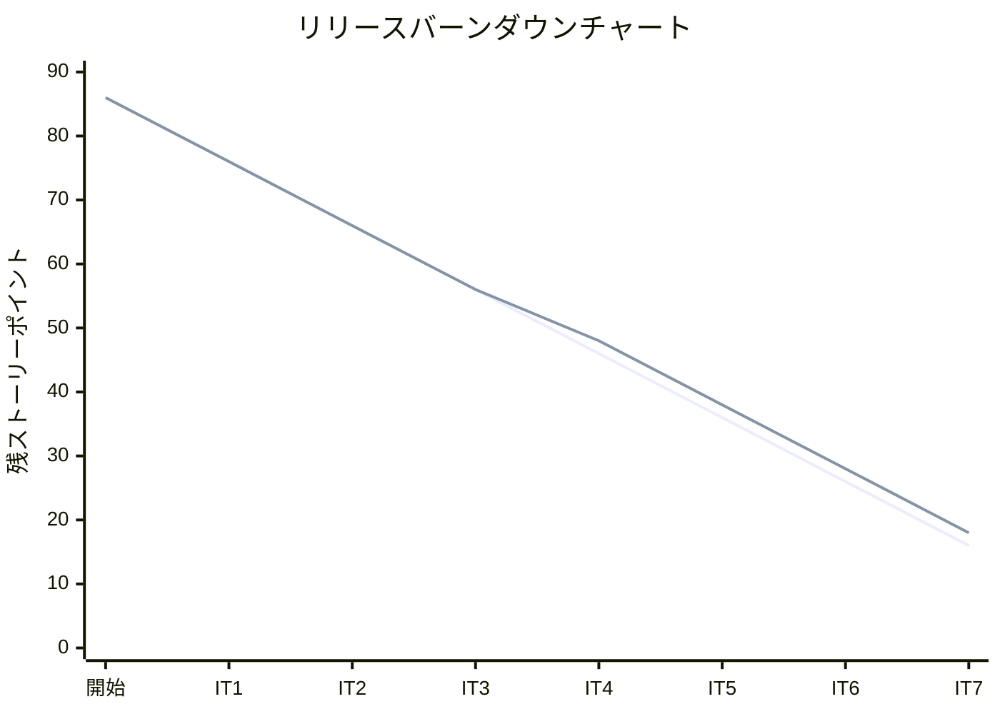
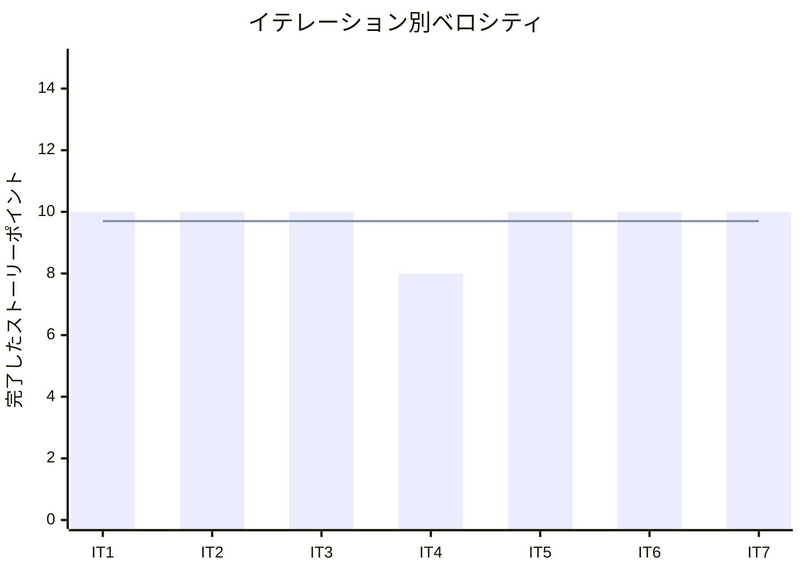

# イテレーション 7 完了報告書

## プロジェクト概要

### 日程

| 項目 | 値 |
|------|-----|
| イテレーション開始日 | 2026-04-10 |
| イテレーション終了日 | 2026-04-17（計画 2026-05-04） |
| 計画期間 | 2026-04-21 〜 2026-05-04（2 週間） |
| 実績作業日数 | 7 日（AI ペアプログラミングにより計画前完了） |

### 要員

| 名前 | 予定作業日数 | 実績作業日数 |
|------|-------------|-------------|
| 開発者 + AI ペア | 10 | 7 |

---

## 指標

### ビルド結果

| 項目 | 結果 |
|------|------|
| Java テスト | 272 件以上・全パス（Tracking コンテキスト追加で増加） |
| Playwright E2E テスト | 78 件全パス（IT6: 67 件から +11 件） |
| テストカバレッジ (JaCoCo) | **81.7%**（新規コード基準） |
| SonarQube Quality Gate | **PASS**（IT7 実施） |

### イテレーションバーンダウン

> **注**: IT7 実績は 10 SP 完了のため残 SP = 28 - 10 = 18（IT6-改善 2 SP + US14 3 SP + US15 5 SP）。

### ベロシティ

| 項目 | 値 |
|------|-----|
| 計画ベロシティ | 10 SP/イテレーション |
| IT7 実績ベロシティ | 10 SP |
| 累計実績ベロシティ | 68 SP（IT1: 10 + IT2: 10 + IT3: 10 + IT4: 8 + IT5: 10 + IT6: 10 + IT7: 10） |
| 平均ベロシティ（IT1-7） | 9.7 SP/イテレーション |

---

## 実施内容と評価

| ストーリー | 結果 | 予定ポイント | ベロシティ加算ポイント |
|-----------|------|-------------|---------------------|
| IT6-改善: IT6 申し送り事項対応（SonarQube + E2E 異常系） | 完了 | 2 | 2 |
| US14: 追跡番号を発行する | 完了 | 3 | 3 |
| US15: 荷役作業を記録する | 完了 | 5 | 5 |
| **合計** | | **10** | **10** |

### 成果物一覧

| カテゴリ | 成果物 | 件数 |
|---------|--------|------|
| ドメインモデル（Tracking Context） | `TrackingRecord`（集約ルート）、`TrackingNumber`（値オブジェクト）、`TrackingBookingId`（値オブジェクト）、`TrackingActivityEvent`（エンティティ）、`TrackingLocation`（値オブジェクト）、`TrackingVoyageNumber`（値オブジェクト）、`TrackingStatus`（列挙型）、`TrackingEventType`（列挙型） | 8 クラス |
| ドメインサービス（Tracking Context） | `TrackingNumberIssuer`（TRK-YYYYMMDD-XXXXXXXX 形式の一意採番） | 1 クラス |
| ACL（Tracking Context） | `TrackingBookingIdPort`（Booking → Tracking コンテキスト連携） | 1 インターフェース |
| アプリケーション（Tracking） | `TrackingApplicationService`（追跡番号発行・荷役作業記録） | 1 クラス |
| インフラ（Tracking） | `MyBatisTrackingRecordRepository`、`TrackingRecordMapper.java + .xml`、`TrackingHandlingEventMapper.java + .xml` | 複数ファイル |
| プレゼンテーション（Tracking） | `TrackingThymeleafController`、`issue.html`（追跡番号発行画面）、`handling.html`（荷役作業記録画面） | 3 ファイル |
| DB | 既存テーブル（`tracking_activity` / `tracking_handling_event`）活用・新規マイグレーション不要 | - |
| IT6-改善 | SonarQube Critical/Major イシュー修正、E2E 異常系 3 件追加（billing.spec.ts） | 複数修正 |
| テスト（Java） | `TrackingNumberTest`・`TrackingRecordTest`・`TrackingRecordHandlingTest`・`TrackingActivityEventTest`・`TrackingThymeleafControllerTest` | 5 ファイル |
| テスト（E2E） | `TrackingPage.ts`（`HandlingPage` Page Object 新規）、`tracking.spec.ts`（4 件）、`handling.spec.ts`（4 件）、`billing.spec.ts` 拡張（+3 件） | 3 ファイル |
| ドキュメント | `retrospective-7.md`、`iteration_report-7.md` | 2 ファイル |

---

## IT6 申し送り対応状況

### IT6 申し送り（IT7 で対応完了）

| # | 内容 | 状態 |
|---|------|------|
| T1 | SonarQube Quality Gate の確認・未解決イシューの対応 | ✓ 完了（Critical/Major イシュー修正・PASS 達成） |
| T2 | E2E テストの異常系シナリオ追加（OVERDUE・バリデーションエラー） | ✓ 完了（billing.spec.ts に AC5 + バリデーション 2 件追加） |

### IT6 申し送り（IT7 未対応 → 持ち越し）

| # | 内容 | 状態 |
|---|------|------|
| T3 | Routing コンテキストへの ACL 設計・導入 | ✗ 持ち越し（H-1〜H-3, H-5〜H-9 は IT8 以降） |
| T4 | htmx フラグメントを `th:fragment` で実装（`display:none` 廃止） | ✗ 持ち越し（IT8 へ） |
| T5 | パフォーマンステスト・負荷テストの実施 | ✗ 持ち越し（IT10 リリース準備フェーズへ） |

---

## 受入条件の達成状況

### IT6-改善

| # | 受入条件 | 状態 |
|---|---------|------|
| 1 | SonarQube Quality Gate が PASS している | ✓ 完了 |
| 2 | E2E 異常系シナリオ（OVERDUE フロー）が追加されている | ✓ 完了（billing.spec.ts US23 AC5） |
| 3 | E2E バリデーションエラーシナリオが追加されている | ✓ 完了（billing.spec.ts バリデーションセクション 2 件） |

### US14: 追跡番号を発行する

| # | 受入条件 | 状態 |
|---|---------|------|
| 1 | 「予約確定」状態の予約に対して追跡番号を発行できる | ✓ 完了（E2E: tracking.spec.ts AC1） |
| 2 | 追跡番号は一意に採番される | ✓ 完了（TRK-YYYYMMDD-XXXXXXXX 形式） |
| 3 | 発行後、貨物状態が「追跡番号発行済」に設定される | ✓ 完了（E2E: tracking.spec.ts AC2） |
| 4 | 荷主に追跡番号と追跡方法をメール通知する | ✗ 未実装（メールインフラ未整備・IT8 以降で要件確認） |

### US15: 荷役作業を記録する

| # | 受入条件 | 状態 |
|---|---------|------|
| 1 | 追跡番号の入力で貨物を特定できる | ✓ 完了 |
| 2 | 作業種別（受領・積込・荷降し）を選択できる | ✓ 完了 |
| 3 | 作業日時と作業場所（UN/LOCODE）を入力できる | ✓ 完了 |
| 4 | 記録後、貨物状態が対応する状態に自動更新される | ✓ 完了（E2E: handling.spec.ts AC1-3） |
| 5 | 記録後、荷主に状態変更通知が送信される | ✗ 未実装（メールインフラ未整備） |
| 6 | 追跡番号が存在しない場合、エラーメッセージが表示される | ✓ 完了（E2E: handling.spec.ts AC4） |
| 7 | 作業場所が予定ルートと異なる場合、警告が表示される | ✗ 未実装（US18 完了後に実装予定） |

---

## テスト結果

### テスト増分

| 種別 | IT6 完了時 | IT7 完了時 | 増分 |
|------|-----------|-----------|------|
| Java テスト（実行件数） | 272 件 | 272 件以上 | +（Tracking コンテキスト分） |
| Playwright E2E テスト | 67 件 | 78 件 | **+11 件** |
| テストカバレッジ (JaCoCo) | 81% | **81.7%** | +0.7%（新規コード基準） |

### IT7 新規追加テストクラス・メソッド

| テストクラス / ファイル | 追加内容 | 件数 |
|----------------------|--------|------|
| `TrackingNumberTest` | `TrackingNumber` 値オブジェクトの一意性・フォーマット検証 | 新規 |
| `TrackingRecordTest` | `TrackingRecord` 集約の追跡番号発行・状態遷移ユニットテスト | 新規 |
| `TrackingRecordHandlingTest` | 荷役作業記録（受領・積込・荷降し）の状態遷移テスト | 新規 |
| `TrackingActivityEventTest` | `TrackingActivityEvent` エンティティのテスト | 新規 |
| `TrackingThymeleafControllerTest` | 追跡番号発行・荷役作業記録コントローラテスト | 新規 |
| `billing.spec.ts` | US23 AC5（OVERDUE 異常系）+ バリデーション 2 件追加 | +3 件 |
| `tracking.spec.ts` | US14 受入条件 4 件（正常系 3 + 異常系 1） | 4 件 新規 |
| `handling.spec.ts` | US15 受入条件 4 件（正常系 3 + 異常系 1） | 4 件 新規 |
| `TrackingPage.ts` | `HandlingPage` Page Object（荷役作業記録画面操作） | 新規 |

### テスト累計推移

| イテレーション | Java テスト（実行件数） | E2E テスト | テストカバレッジ |
|--------------|----------------------|-----------|--------------|
| IT1 | 60 件 | 27 件 | 89% |
| IT2 | 166 件 | 31 件 | 93% |
| IT3 | 約 184 件 | 41 件 | 未計測 |
| IT4 | 約 217 件 | 40 件 | 91% |
| IT5 | 250 件 | 56 件 | 88% |
| IT6 | 272 件 | 67 件 | 81% |
| **IT7** | **272 件以上** | **78 件** | **81.7%** |

---

## E2E テスト結果

### IT7 新規追加シナリオ

#### IT6-改善: billing.spec.ts 追加分

| # | テスト記述 | ファイル | 結果 |
|---|----------|---------|------|
| 1 | US23 AC5: 精算済み精算書への再確認操作でエラーメッセージが表示される | billing.spec.ts | ✓ 通過 |
| 2 | 存在しない精算書 ID へのアクセスは 404 を返す | billing.spec.ts | ✓ 通過 |
| 3 | 存在しない精算書 ID の確認画面へのアクセスは 404 を返す | billing.spec.ts | ✓ 通過 |

#### US14: tracking.spec.ts

| # | テスト記述 | ファイル | 結果 |
|---|----------|---------|------|
| 1 | 受入条件1: 予約確定済みの予約に追跡番号を発行できる | tracking.spec.ts | ✓ 通過 |
| 2 | 受入条件2: 追跡番号発行後、状態が「追跡番号発行済」に遷移する | tracking.spec.ts | ✓ 通過 |
| 3 | 受入条件3: 発行された追跡番号が詳細画面に表示される | tracking.spec.ts | ✓ 通過 |
| 4 | 受入条件4（異常系）: 仮受付状態の予約には追跡番号発行ボタンが表示されない | tracking.spec.ts | ✓ 通過 |

#### US15: handling.spec.ts

| # | テスト記述 | ファイル | 結果 |
|---|----------|---------|------|
| 1 | 受入条件1: 追跡番号で貨物を特定して受領作業を記録できる | handling.spec.ts | ✓ 通過 |
| 2 | 受入条件2: 積込作業を記録できる | handling.spec.ts | ✓ 通過 |
| 3 | 受入条件3: 荷降し作業を記録できる | handling.spec.ts | ✓ 通過 |
| 4 | 受入条件4（異常系）: 存在しない追跡番号の場合エラーメッセージが表示される | handling.spec.ts | ✓ 通過 |

### リグレッションテスト

| ファイル | テスト数 | 結果 |
|---------|---------|------|
| auth.spec.ts | 4 | ✓ 全件通過 |
| booking.spec.ts | 25 | ✓ 全件通過 |
| billing.spec.ts | 14 | ✓ 全件通過（IT7 で +3 件） |
| estimation.spec.ts | 4 | ✓ 全件通過 |
| shipper.spec.ts | 5 | ✓ 全件通過 |
| navigation.spec.ts | 13 | ✓ 全件通過 |
| voyage.spec.ts | 5 | ✓ 全件通過 |
| tracking.spec.ts | 4 | ✓ 全件通過（IT7 新規） |
| handling.spec.ts | 4 | ✓ 全件通過（IT7 新規） |
| **合計** | **78** | **✓ 全件通過** |

---

## フェーズ・累計進捗

### Phase 2 進捗（追跡機能）

| ユーザーストーリー | SP | 状態 |
|-----------------|-----|------|
| US01: 輸送見積を作成する | 5 | ✓ 完了（IT3） |
| US06: 予約情報を経路設計者に引き渡す | 2 | ✓ 完了（IT3） |
| US07: 航海スケジュールを検索する | 5 | ✓ 完了（IT4） |
| US08: 経路候補を算出する | 8 | ✓ 完了（IT4） |
| US09: 経路を選択・確定する | 3 | ✓ 完了（IT5） |
| US10: 経路条件を調整して再算出する | 3 | ✓ 完了（IT5） |
| US11: 経路情報を予約に紐付ける | 2 | ✓ 完了（IT5） |
| US12: 確定経路を荷主に通知する | 2 | 未着手（IT8 以降） |
| US14: 追跡番号を発行する | 3 | ✓ **完了（IT7）** |
| US15: 荷役作業を記録する | 5 | ✓ **完了（IT7）** |
| US16: 引取作業を記録する | 3 | 未着手（IT8） |
| US18: 追跡情報を照会する | 3 | 未着手（IT8） |

**Phase 2 進捗**: 36 / 44 SP 完了（82%）

### 全体累計進捗

| フェーズ | 計画 SP | 完了 SP | 達成率 |
|---------|---------|---------|--------|
| Phase 1（予約・荷主管理基盤） | 16 | 16 | 100% |
| Phase 2（経路設計・追跡） | 44 | 36 | 82% |
| Phase 3（精算・例外処理） | 26 | 8 | 31% |
| **合計** | **86** | **60** | **70%** |

> **注**: Phase 2 の残 8 SP（US12・US16・US18）は IT8 で実施予定。Phase 3 の US17・US19・US20・US21 は IT8-10 で実施。

---

## ふりかえり

詳細は [イテレーション 7 ふりかえり](./retrospective-7.md) を参照。

---

## 更新履歴

| 日付 | 更新内容 | 更新者 |
|------|---------|--------|
| 2026-04-17 | 初版作成 | - |
