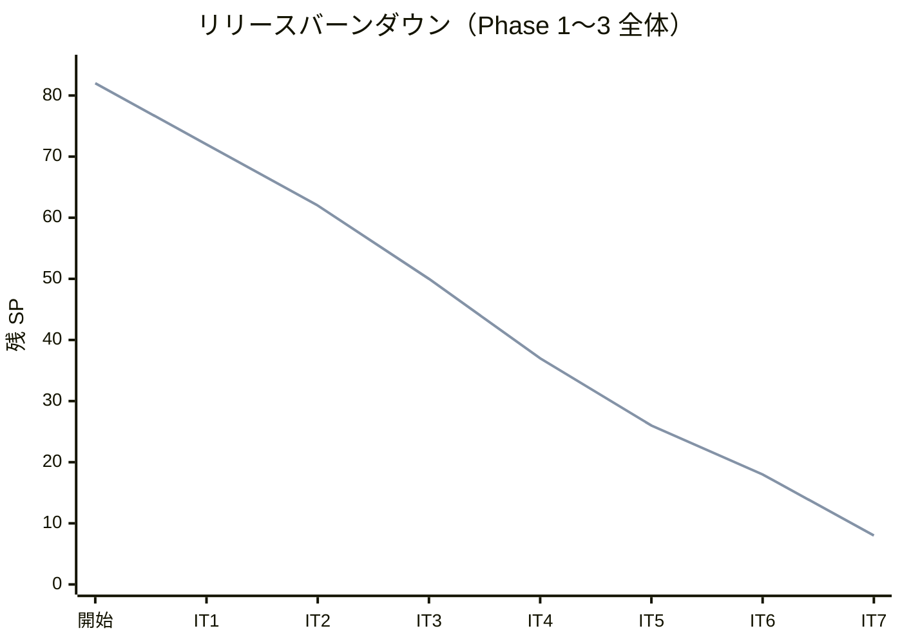
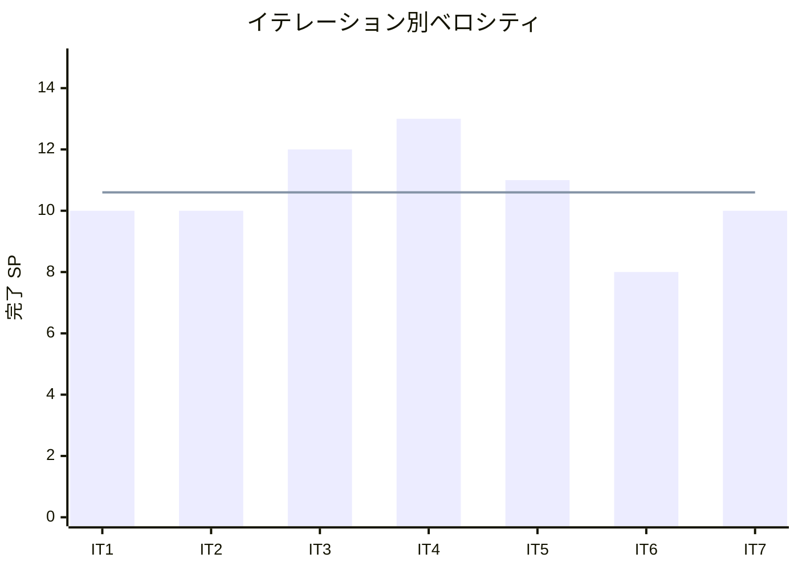

# イテレーション 7 完了報告書

## 1. プロジェクト概要

| 項目 | 内容 |
|------|------|
| イテレーション番号 | 7 |
| 計画期間 | 2026-06-23 〜 2026-07-06 |
| 実績期間 | 2026-04-04 |
| ゴール | 航海・港湾マスタデータを整備し、制約条件ベースの経路候補自動算出を完成させる |

## 2. 要員

| 名前 | 予定作業日数 | 実績作業日数 |
|------|--------------|--------------|
| Copilot | 5 | 1 |

## 3. 指標

### ベロシティ

| 項目 | 値 |
|------|-----|
| 計画 SP | 10 |
| 実績 SP | 10 |
| 達成率 | 100% |

### リリースバーンダウン

### ベロシティ推移

## 4. テスト結果

| メトリクス | Backend | Frontend |
|-----------|---------|----------|
| テスト数 | 583 / 583 通過 | 該当なし |
| カバレッジ（instruction） | 91% | 該当なし |
| E2E テスト | 51 tests（32 シナリオ）全通過 | — |

### テスト増分（前イテレーション比）

| メトリクス | IT6 実績 | IT7 実績 | 増分 |
|-----------|----------|----------|------|
| Backend テスト数 | 506 | 583 | +77 |
| カバレッジ（instruction） | 89.2% | 91% | +1.8% |
| E2E テスト数（Playwright） | 44 | 51 | +7 |

### テスト累計推移

| イテレーション | Backend テスト数 | E2E シナリオ（e2e/ パッケージ） |
|---------------|------------------|-------------------------------|
| IT1 | 113 | 9 |
| IT2 | 239 | 17 |
| IT3 | 278 | 26 |
| IT4 | 361 | 26 |
| IT5 | 449 | 18 |
| IT6 | 506 | 23 |
| IT7 | 583 | 32 |

## 5. SonarQube Quality Gate

| プロジェクト | カバレッジ（instruction） | 重複率 | Violations | 結果 |
|------------|--------------------------|--------|-----------|------|
| cargo-tracker | 91% | — | 0 | PASS ✅ |

## 6. 実施内容と評価

### ストーリー別完了状況

| ストーリー | 結果 | 予定ポイント | ベロシティ加算ポイント |
|-----------|------|-------------|------------------------|
| US19 経路設計条件を確認する | 完了 | 2 | 2 |
| US20 航海スケジュールを検索する | 完了 | 3 | 3 |
| US21 経路候補を算出する | 完了 | 5 | 5 |
| 合計 |  | 10 | 10 |

### 受入条件達成状況

#### US19: 経路設計条件を確認する

- [x] 予約番号を指定して予約情報（出発地・目的地・期限・貨物種別・重量・寸法）を一覧表示できる
- [x] 経路設計条件（出発地・目的地・期限・貨物種別制約）を確認・記録できる
- [x] 予約情報に不備がある場合、営業担当者に条件補完を依頼できる
- [x] 条件確認完了後、航海スケジュール検索（US20）に進める

#### US20: 航海スケジュールを検索する

- [x] 出発地・目的地・期限を検索条件として入力できる
- [x] 出発地・目的地は UN/LOCODE 形式で指定できる
- [x] 該当する航海情報（航海番号・運送会社・寄港地・出発日・到着日）が一覧表示される
- [x] 各寄港地の港湾情報（取扱可能貨物種別・設備）が表示される
- [x] 直行便がない場合、寄港地接続による経由ルートの航海候補も表示される

#### US21: 経路候補を算出する

- [x] 経路候補算出を実行すると、制約条件（航海スケジュール・寄港地接続・期限・貨物種別・港湾制約）が自動チェックされる
- [x] 期限内に到着可能な経路候補が優先度順に一覧表示される
- [x] 各候補に経由港・所要日数・航海番号・費用概算が表示される
- [x] 危険物・冷凍貨物の場合、対応設備のある航海・港湾のみがフィルタリングされる
- [x] 制約条件を満たす経路候補がない場合、「条件を満たす経路候補なし」が表示される

### レイヤー別実装要約

- **ドメイン（routing BC - US19）**: `RouteDesignCondition`（読み取りモデル：予約情報から経路設計条件を集約）・`RouteDesignConditionQueryService`（Booking コンテキストの ACL 経由で予約情報を取得し条件モデルに変換）を実装しました。
- **ドメイン（routing BC - US20）**: `Voyage`集約に`carrierName`・`supportedCargoTypes`を追加し、`Port`エンティティ（`unlocode`・`name`・`supportedCargoTypes`）を新規実装しました。`VoyageScheduleSearchService`（出発地・目的地・期限でフィルタリング、1 回乗り継ぎ経由ルート候補を含む）を実装しました。
- **ドメイン（routing BC - US21）**: `RouteConstraintChecker`（ドメインサービス：期限遵守・貨物種別対応・寄港地接続・港湾制約の 4 種類の制約チェッカー群）を実装しました。`RouteSearchService`を拡張し、制約条件フィルタリングと所要日数による優先度ソートを追加しました。
- **インフラ**: Flyway migration V014（`voyage`テーブルに`carrier_name`・`supported_cargo_types`追加、`location`テーブルに`supported_cargo_types`追加）・V015（航海スケジュール・港湾マスタシードデータ：SG001・SG002 × 複数経由地）を実装しました。`VoyageRepository`・`VoyageMapper`（MyBatis）・`ConstraintBasedRouteProvider`（`@Profile("product")` の DB ベース RouteProviderPort 実装）を追加しました。
- **プレゼンテーション（REST API）**: `GET /api/v1/routings/design-condition?bookingId={id}`（US19）・`GET /api/v1/routings/voyages`・`GET /api/v1/routings/voyages/{id}`・`GET /api/v1/routings/voyage-schedules?origin={}&dest={}&deadline={}`（US20）を実装しました。
- **プレゼンテーション（Web）**: `routing/design-condition.html`（経路設計条件確認画面・条件不備時の補完依頼リンク付き）・`routing/voyages.html`（航路一覧・シードデータ V015 表示）を新規作成しました。`routing/search.html`を更新し、制約条件適用済みフィルタ表示・経路確定前の確認モーダル（`#assignModal`）・候補なしメッセージを追加しました。共通ナビゲーション（`fragments/header.html`）に「航路一覧」リンクを追加しました。

## 7. 追加タスク（SP 外）

| タスク | 内容 |
|--------|------|
| マルチパースペクティブレビュー | xp-programmer・xp-tester・xp-architect・xp-interaction-designer・xp-user-representative による並列レビューを実施。高優先度指摘 H1〜H7 を特定 |
| レビュー指摘対応（H1〜H7） | H1: 確認モーダル追加（`search.html` に `#assignModal`）・H2: DesignCondition 日付フォーマット修正・H3〜H5: 候補カードのレスポンシブ改善・H6: 航路一覧ナビゲーション追加・H7: SonarQube 指摘解消（複雑度・命名） |
| 航路一覧ナビゲーション追加 | ユーザー指摘を受け `fragments/header.html`・`routing/voyages.html`・ナビゲーションの整合性を確保。コミット `bee40d7` |
| E2E テスト不具合修正 | IT7 実装で導入した確認モーダルにより `exception-flow.spec.ts`（E16）・`freight-flow.spec.ts`（E19・E21）が前イテレーションの `RoutingPage.assignRoute()` でタイムアウト。モーダル待機 + submit クリックを追加し修正。`route-confirm.spec.ts`（E09）の strict mode セレクタも修正。コミット `79c37e8` |

## 8. E2E テスト結果

### 新規追加シナリオ（IT7）

| シナリオ | 説明 | 結果 |
|---------|------|------|
| E26 | 予約から経路設計条件（出発地・目的地・期限・貨物種別）を確認できる | ✅ 通過 |
| E27 | 経路設計条件の確認完了ボタンを押すと完了が記録される | ✅ 通過 |
| E28 | 航路一覧ページに V015 シードデータの航海スケジュールが表示される | ✅ 通過 |
| E29 | 出発地・目的地パラメータを指定して航海スケジュールを検索できる | ✅ 通過 |
| E30 | 制約条件フィルタ適用済みメッセージが表示され、経路候補が所要日数順に表示される | ✅ 通過 |
| E31 | 各経路候補に経由港・所要日数・航海番号・費用概算・出発予定日が表示される | ✅ 通過 |
| E32 | HAZARDOUS 指定で対応設備のある航海（SG002）のみが候補に表示される | ✅ 通過 |

### リグレッション結果

既存 E01〜E25 シナリオ（認証・荷主登録・予約・ルート検索・確定・追跡番号発行・荷役記録・追跡照会・例外処理・輸送料金算出・割引・精算・経路設計基本フロー）はすべて通過。

## 9. フェーズ・累計進捗

### Phase 3 進捗（IT7 完了）

| ストーリー | 計画 SP | 完了 SP | 状態 |
|-----------|---------|---------|------|
| US19 経路設計条件を確認する | 2 | 2 | 完了 ✅ |
| US20 航海スケジュールを検索する | 3 | 3 | 完了 ✅ |
| US21 経路候補を算出する | 5 | 5 | 完了 ✅ |
| US22 経路を選択・確定する | 3 | 0 | 未着手（IT8） |
| US23 経路条件を調整して再算出する | 3 | 0 | 未着手（IT8） |
| US24 経路情報を予約に紐付ける | 2 | 0 | 未着手（IT8） |
| **Phase 3 合計** | **18** | **10** | **56%** |

### 全体累計進捗

| 項目 | 値 |
|------|----|
| 全体計画 SP | 82 |
| 累計完了 SP | 74 |
| 全体達成率 | 90% |
| 残 SP | 8（IT8 で完了予定） |
| 完了イテレーション | IT1〜IT7（7 イテレーション） |
| 実績ベロシティ平均 | 10.6 SP（IT1: 10 / IT2: 10 / IT3: 12 / IT4: 13 / IT5: 11 / IT6: 8 / IT7: 10） |

### リリースサマリー

| リリース | バージョン | 状態 |
|---------|-----------|------|
| Phase 1 コア輸送管理 | v0.1.0 | ✅ 完了（IT4 完了時） |
| Phase 2 請求・精算 | v1.0.0 | ✅ 完了（IT6 完了時） |
| Phase 3 経路設計高度化 | v1.1.0 | 🔄 進行中（IT7: 56%、IT8 で完了予定） |

## 10. ふりかえりへのリンク

詳細は [イテレーション 7 ふりかえり](./retrospective-7.md) を参照。

## 11. 更新履歴

| 日付 | 更新内容 | 更新者 |
|------|---------|--------|
| 2026-04-04 | IT7 完了報告書を作成 | Copilot |
