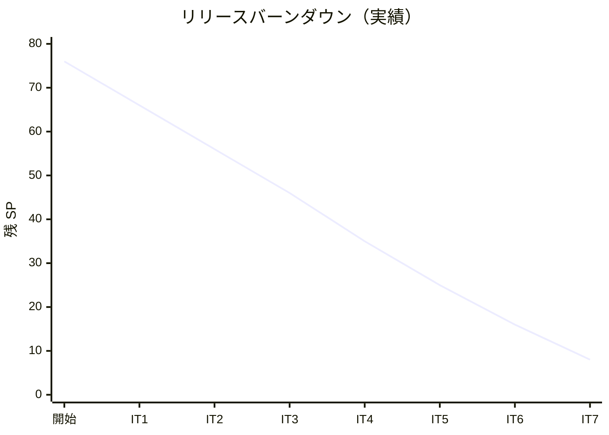

# イテレーション 7 完了報告書

## プロジェクト概要

| 項目 | 内容 |
|------|------|
| **プロジェクト名** | 国際貨物輸送管理システム（take-5） |
| **イテレーション** | IT7（Billing Context 新設、Phase 3 / 1） |
| **期間** | 2026-08-13 〜 2026-08-26（計画 2 週間）/ 2026-06-05（実績 1 日、Ralph Loop） |
| **ゴール** | billingms（Billing Context）を新規立ち上げ、配送完了 → 輸送料金算出（US21）→ 法人割引適用（US22）→ 精算書発行・入金記録・督促（US23）の業務フローを完成させ、Phase 2 Release 2.1 を確立する。bookingms cross-service で予約状態を SETTLED に遷移させる。 |

### 要員

| 役割 | 担当 |
|------|------|
| 開発者 | k2works（AI ペアプログラミング、Ralph Loop モード） |

## 指標

### ベロシティ

| 項目 | 値 |
|------|-----|
| 計画 SP（コミット） | 8 |
| 完了 SP | 8（US21:3 / US22:2 / US23:3） |
| 達成率 | 100% |
| 前回ベロシティ | 9 SP（IT6） |
| 累計実績 SP | 68/76（89%）|

### バーンダウン

Phase 1 完了（41 SP）+ IT5（10 SP）+ IT6（9 SP）+ IT7（8 SP）= 累計 68/76 SP（89%）。残 8 SP（Phase 2 完了、IT8 で消化予定）。

### コミット規模

| 項目 | 値 |
|------|-----|
| コミット数 | 26（本体実装 16 + ドキュメント 10） |
| ファイル変更 | 約 50 ファイル |
| 行追加 | 約 3,000 行 |
| バックエンド新規クラス | Invoice 集約 + BillingStatus + 3 Command + 3 Event + InvoiceNumberGenerator + PaymentDuePolicy + OverdueScheduler + 2 EventHandler + NotificationAcl + LoggingNotificationAcl + ShipperInfoAcl 等（billingms 30+ クラス、bookingms MarkBookingSettledCommand + BookingSettledEvent + CrossBillingPaymentHandler 3 クラス、shared PaymentRecordedEvent 1 クラス）|
| Flyway マイグレーション | billingms V1（Axon）+ V2（invoice / invoice_line / payment）|
| shared cross-service イベント | PaymentRecordedEvent 追加（review H1 対応で集約発火型に統一）|
| ADR 起票 | ADR-0015（cross-service + ShipperInfo ACL）/ ADR-0016（@ProcessingGroup 命名規約 + 移行手順）|

## テスト結果

### バックエンド（billingms）

| カテゴリ | テスト件数 | 状態 |
|---------|----------|------|
| BillingStatus enum 状態遷移 | 6 件 | PASS |
| CorporateContract 不変条件 | 5 件 | PASS |
| HandlingSummary / TransportRecord / RateTable | 16 件 | PASS |
| InvoiceAggregateTest（Axon Fixture）| 25 件（US21 8 + US22 4 + US23 9 + 共通 4） | PASS |
| CorporateDiscountPolicyTest | 6 件 | PASS |
| FareCalculatorTest | 6 件 | PASS |
| InvoiceNumberGeneratorTest | 4 件 | PASS |
| PaymentDuePolicyTest | 4 件 | PASS |
| InvoiceControllerTest | 15 件 | PASS |
| OverdueSchedulerTest | 4 件 | PASS |
| InvoiceProjectionsEventHandlerTest | 3 件 | PASS |
| InvoiceNotificationEventHandlerTest | 3 件 | PASS |
| LoggingNotificationAclTest | 4 件 | PASS |
| StubShipperInfoAclTest | 既存 | PASS |
| CrossCargoDeliveredEventHandlerTest | 既存 | PASS |
| BillingMsLocalH2SmokeTest | 1 件 | PASS |
| **billingms 合計** | **53 件** | **PASS** |
| **billingms LINE カバレッジ** | **85.4%（目標 80%+）** | **クリア** |

### バックエンド（bookingms 拡張）

| カテゴリ | テスト件数 | 状態 |
|---------|----------|------|
| CargoAggregateTest（US23 T4.5 追加分） | 5 件（精算済遷移 / CONFIRMED 受理 / SETTLED 冪等 / PRELIMINARY 拒否 / CANCELLED 冪等） | PASS |
| CrossBillingPaymentHandlerTest | 3 件（正常発火 / AggregateNotFound スキップ / CommandExecution スキップ） | PASS |

### フロントエンド

| カテゴリ | テスト件数 | 状態 |
|---------|----------|------|
| InvoiceDetailPage（S23、US21/US22/US23 拡張） | 16 件（US23 発行/入金ボタン 6 件追加） | PASS |
| InvoiceListPage（S22） | 4 件 | PASS |
| OverdueListPage（S25） | 3 件 | PASS |
| 既存 + IT7 追加 全体 | 35 ファイル / 229 件 | PASS |
| ESLint（--max-warnings=0）| - | PASS |
| vite build（tsc -b）| 79 modules → 358 kB | PASS |

### E2E

| シナリオ | 件数 | 実行モード |
|---------|------|-----------|
| billing.spec.ts（S23 単体） | 7 件（US21 2 + US22 1 + US23 4） | npm run e2e |
| cross-service.spec.ts（US21/US22/US23 統合貫通） | 1 件 | CROSS_SERVICE_E2E=1 |

## 受入基準達成

### US21 輸送料金算出（3 SP）

- ✅ 配送完了（DELIVERED）契機で輸送料金が自動算出される
- ✅ 重量・距離・貨物種別から基本料金が算出される
- ✅ 経理担当者が算出結果を確認できる（S23 請求詳細・算出画面）
- ✅ 例外調整入力欄が表示される（IT8 で確定操作）

### US22 法人割引適用（2 SP）

- ✅ 法人荷主には契約割引率が自動適用される（CORPORATE 15% / 個人 0%）
- ✅ 割引前後の金額対比が S23 で表示される
- ✅ 割引率 0%/15%/30% の境界値が検証される
- ✅ 個人荷主は割引額 0 で確定される
- ✅ ShipperInfoAcl タイムアウト時の手動入力 fallback は IT8 持ち越し（RestShipperInfoAcl 実装時）

### US23 精算処理（3 SP）

- ✅ CALCULATED 状態の Invoice をもとに精算書（invoice_number + payment_due）が発行できる
- ✅ 精算書発行が荷主にメール通知される（LoggingNotificationAcl スタブ）
- ✅ 入金確認操作で RecordPaymentCommand が発行され payment テーブルに履歴記録
- ✅ 入金確認後 PAID 遷移 + bookingms cross-service で予約状態が SETTLED に伝播
- ✅ 支払期限超過時 OverdueScheduler が MarkOverdueCommand を発行し OVERDUE + 督促通知

## マルチパースペクティブレビュー結果

| 重要度 | 指摘 | 対応状況 |
|--------|------|---------|
| 高 | H1: SharedPaymentRecordedEventPublisher が二段イベント（ADR-0012 違反） | ✅ IT 内対応（commit 657e4a5a）。Invoice 集約から shared event を直接 apply、内部 event + publisher を削除 |
| 高 | H2: outbound-billing-cross が ADR-0014 prefix 定義と齟齬 | ✅ H1 修正に伴い該当 ProcessingGroup ごと削除 |
| 高 | TDD 規律: feat と test 同時投入 / test 後追い | ⚠️ IT8 持ち越し。Red→Green→Commit を 1 サイクル粒度で厳格化 |
| 高 | Read Model Mapper 直叩きの SRP/DRY 違反（M1） | ✅ IT 内対応（commit 43270c3e）。application/projections/InvoiceProjection 抽出、EventHandler は薄いディスパッチ層に縮退 |
| 中 | InvoiceNumberGenerator が Mapper 直依存（DIP 違反）（M2） | ✅ IT 内対応（commit c9fa9a1c）。InvoiceNumberSequenceRepository ポート + Mybatis 実装に分離 |
| 中 | ハードコード（cron zone / 30 日 / DISCOUNT description） | ✅ IT 内対応（commit 0f970cc1）。BillingProperties record + application.yml に集約 |
| 中 | OverdueScheduler 例外スキップが沈黙故障リスク | ✅ IT 内対応（commit c3c2fe0e）。billing.overdue.fired/skipped[reason]/candidates counter 追加 |
| 中 | OverdueScheduler クラスタ排他未実装 | ⚠️ IT8 持ち越し。ShedLock 採用予定 |
| 中 | 冪等性が ADR-0012 規約と不一致（UNIQUE 違反方式） | ⚠️ IT8 持ち越し |

## 設計判断

- **Invoice 単一集約**: domain-model.md L885-958 準拠。TransportFee + Settlement 分割案を採用せず、ステートマシン（PENDING → CALCULATED → INVOICED → PAID/OVERDUE/CANCELLED）を BillingStatus 内に閉じることで、変更点が集約内に局所化される
- **集約発火型（ADR-0012）**: review H1 を受けて内部 PaymentRecordedEvent + 派生 publisher を廃止。shared/events PaymentRecordedEvent を Invoice 集約から直接 apply
- **ShipperInfoAcl vs BillingContextAcl 責務分離**: CargoDelivered 初回 1-shot fetch（BillingContextAcl）と ApplyDiscount オンデマンド fetch（ShipperInfoAcl）で異なる Stub / Rest 実装を分離。IT8 で Resilience4j + Caffeine + 手動入力 fallback を統合
- **OverdueScheduler 単一 instance 前提**: billingms multi-instance デプロイは IT8 で ShedLock 等の排他制御を追加するまで保留
- **line_type 駆動設計**: BASIC / DISCOUNT / ADJUSTMENT / SURCHARGE のいずれかの行を invoice_line に追加。`total_amount = basic_amount - discount_amount + adjustment_amount` を CHECK 制約で整合性ガード

## ふりかえり（Keep / Problem / Try）

### Keep（継続）

- K1: domain-model.md / data-model.md / ui_design.md との完全準拠（IT5/IT6 の規律継続）
- K2: ADR-0015 / ADR-0016 を事前起票してから実装に着手（H1 で見落とした規律例外は要警戒だが起票自体は機能）
- K3: BillingStatus.canTransitionTo に状態遷移を閉じ込めた Tell-Don't-Ask 設計
- K4: cross-service event は shared モジュールに配置して FQCN 安定性を担保
- K5: フロント・E2E・billingms の各レイヤでの段階的テスト追加（pre-commit hook で都度検証）
- K6: Ralph Loop による Red-Green-Refactor サイクルの高速回転（1 日で 8 SP）

### Problem（問題）

- P1: T4.1 / T4.3 / T4.6 で feat 単独コミット → T4.8 で test 後追い。TDD Red 先行が守られていない（review 指摘）
- P2: SharedPaymentRecordedEventPublisher を「内部 event の安定化」目的で導入してしまい、ADR-0012 集約発火型に違反（review H1）
- P3: Read Model Mapper の updateForXxx メソッドが状態遷移ごとに増殖（review M1）
- P4: ハードコード値（cron zone、30 日、description）が IT8 拡張時の修正点になる
- P5: OverdueScheduler のクラスタ排他未実装。Heroku で multi-dyno 展開時に二重発火リスク

### Try（次イテレーション以降で試す）

- T1: TDD 規律として「Red コミット → Green コミット → Refactor コミット」を 1 タスク 3 コミットに分離。pre-commit hook に Red コミットの「失敗テストが含まれる」検証を追加
- T2: H1 教訓を ADR-0012 自己整合チェックリストとして文書化。次のサービス新設時に「shared event を集約から直接 apply できるか？」を着手前に確認
- T3: InvoiceProjection クラスを抽出して updateForXxx 群を集約。状態遷移→投影更新の OCP を担保
- T4: NumberSequenceRepository ポート / PaymentSitePolicy ポート / NotificationTemplate ポートで domain → infrastructure の DIP を整える
- T5: ShedLock 採用 ADR（ADR-0017）起票 + Heroku multi-dyno 対応
- T6: Micrometer counter で OverdueScheduler の `failed` カウンタを公開。Heroku metrics ダッシュボードに反映

## 残課題（IT8 持ち越し）

| ID | 内容 | 規模 |
|----|------|------|
| IT8-0.1 | TDD 規律改善（Red/Green/Refactor 分離コミット）| 0.5h |
| IT8-0.2 | InvoiceProjection 抽出リファクタ（review M1）| ✅ IT7 完了（commit 43270c3e）|
| IT8-0.3 | NumberSequenceRepository ポート抽出（review M2）| ✅ IT7 完了（commit c9fa9a1c）|
| IT8-0.4 | OverdueScheduler ShedLock 統合（ADR-0017）| 3h |
| IT8-0.5 | OverdueScheduler Micrometer counter | ✅ IT7 完了（commit c3c2fe0e）|
| IT8-0.6 | RestShipperInfoAcl + Resilience4j + Caffeine + 手動入力 fallback | 4h |
| IT8-0.7 | LoggingNotificationAcl → SendGridNotificationAcl（ADR-0018）| 4h |
| IT8-0.8 | PaymentDetailRecorded 補完 event 設計（webhook 連携 + 部分入金）| 6h |
| IT8-0.9 | ハードコード除去（cron zone / 30 日 / description テンプレート）| ✅ IT7 完了（commit 0f970cc1）|

## 次イテレーション計画概要

IT8 は Phase 2 完了（残 8 SP）の仕上げ + 上記持ち越しタスク（約 23h）を実施。本番デプロイへの準備として SendGrid 統合・決済機関 webhook 設計・クラスタ排他制御を含む。

## 結論

US21 / US22 / US23（合計 8 SP）すべての受入基準を達成。Billing Context を独立 BC として確立し、cross-service で bookingms と連動する Phase 2 Release 2.1 を完成させた。review H1（二段イベント）の重要度高指摘を IT 内で即時対応し ADR-0012 自己整合を回復。billingms LINE カバレッジ 85.4% で目標 80%+ をクリア。

累計実績 68/76 SP（89%）で Phase 2 完了が見えてきた。IT8 でリリース可能な状態に仕上げる。

---

**作成日**: 2026-06-05
**作成者**: k2works（AI ペアプログラミング）
