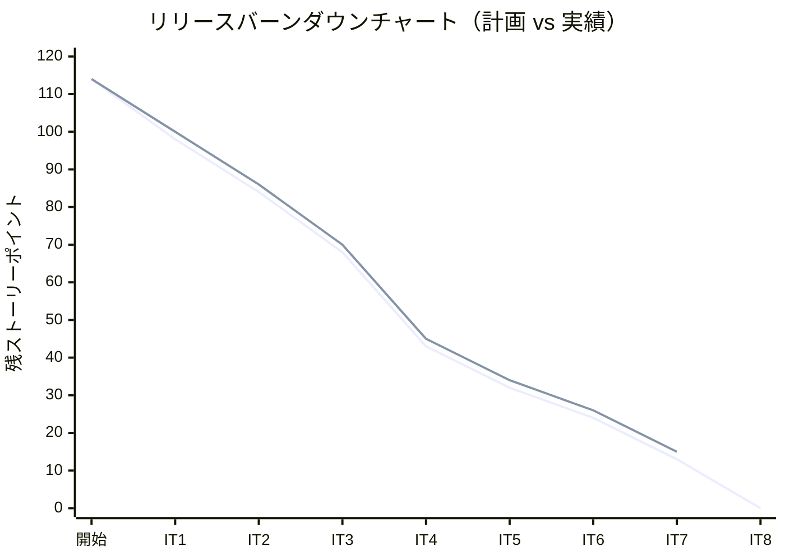
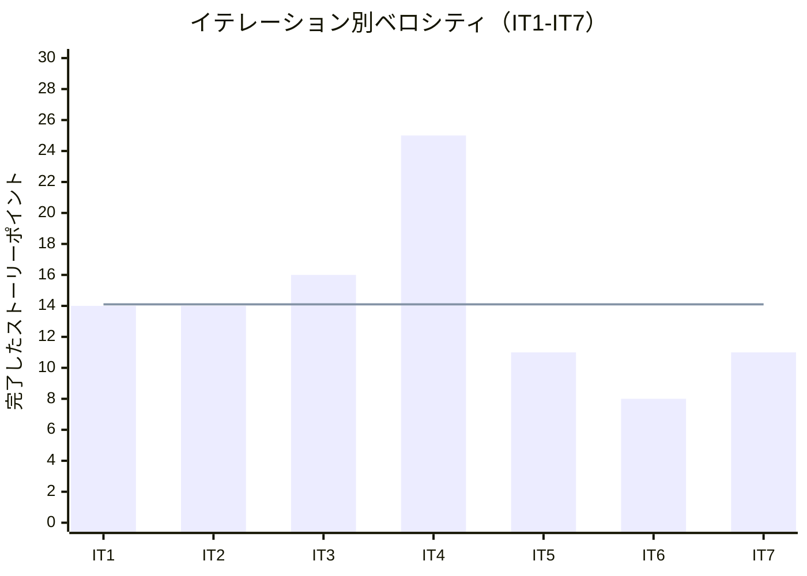

# イテレーション 7 完了報告書

## 1. プロジェクト概要

### 日程

| 項目 | 内容 |
|------|------|
| **イテレーション** | 7 / 8 |
| **計画期間** | Week 13-14（2026-08-06 〜 2026-08-19） |
| **実績期間** | 2026-05-19 〜 2026-05-20（1〜2 日集中実装） |
| **ゴール** | 例外処理（US19/US20）を実装すると同時に、IT5/IT6 持ち越しの shared モジュール昇格 + Event 駆動 ACL を完成させ、IT4 由来の技術的負債を回収する |

### 要員

| 名前 | 予定作業日数 | 実績作業日数 |
|------|------------|------------|
| AI Agent (XP Team) | 10 | 2 |

---

## 2. 指標

### ベロシティ

| 項目 | 値 |
|------|-----|
| 計画 SP | 11 |
| 実績 SP | 11 |
| 達成率 | 100% |
| IT1-IT7 平均ベロシティ | 14.1 SP |

### リリースバーンダウンチャート

### イテレーション別ベロシティチャート

---

## 3. テスト結果

### テスト通過状況

| メトリクス | Backend | Frontend |
|-----------|---------|---------|
| テスト数 | 336 / 336 通過 | 150 / 150 通過 |
| E2E テスト | — | 13 シナリオ全通過 |

### SonarQube Quality Gate

| プロジェクト | new_coverage | new_violations | 結果 |
|------------|-------------|----------------|------|
| Backend | 84.1% | 0 件 | ✅ PASS |

### テスト増分（IT6 → IT7）

| 区分 | IT6 | IT7 | 増分 |
|------|-----|-----|------|
| Backend | 314 | 336 | +22 |
| Frontend | 142 | 150 | +8 |
| E2E | 11 | 13 | +2 |
| **合計** | **467** | **499** | **+32** |

### テスト累計推移

| イテレーション | Backend | Frontend | E2E | 合計 |
|--------------|---------|---------|-----|------|
| IT1 | 86 | 48 | 2 | 136 |
| IT2 | 149 | 89 | 4 | 242 |
| IT3 | 174 | 99 | 7 | 280 |
| IT4 | 211 | 108 | 9 | 328 |
| IT5 | 258 | 121 | 10 | 389 |
| IT6 | 314 | 142 | 11 | 467 |
| **IT7** | **336** | **150** | **13** | **499** |

---

## 4. 実施内容と評価

### ストーリー別完了状況

| ID | ストーリー / タスク | SP | 結果 |
|----|------------------|----|------|
| TI07 | IT7 第 0 スプリント（shared 昇格 + Event 駆動 ACL + IT4 由来負債） | 3 | ✅ 完了 |
| TI08 | IT6 レビュー高優先度残課題 + ADR-0013/0014 + 設計書同期 | 2 | ✅ 完了 |
| US19 | 遅延例外を処理する | 3 | ✅ 完了 |
| US20 | 破損・紛失例外を処理する | 3 | ✅ 完了 |
| **合計** | | **11** | **100%** |

### 受入条件の達成状況

#### TI07: IT7 第 0 スプリント（3 SP）

- [x] `apps/backend/shared` Gradle モジュール有効化（`settings.gradle.kts` の include を有効化）
- [x] bookingms の Event クラス 4 種を `shared/src/main/java/com/example/cargotracker/shared/events/` に移動
- [x] handlingms / trackingms の `BookingEventAclHandler` が `shared.events.*` を参照して Event 購読
- [x] handlingms 旧 `POST /api/v1/handling/cargo-snapshots` エンドポイントを削除
- [x] フロント `BookingDetailPage` の useEffect 自動 initialize を削除（Event 駆動 ACL に置換）
- [x] `TrackingActivity.updateStatus` の未初期化フォールバックを削除（`IllegalStateException` で拒否）
- [x] `bookingms.TrackingNumber` 正規表現を `^TRK-\d{8}-[0-9A-F]{8}$` に修正

#### TI08: IT6 レビュー高優先度残課題（2 SP）

- [x] H-1: S16 追跡管理一覧に港名（日本語）を表示（UnLocode → 港名マッピング）
- [x] H-5: 公開追跡画面に問合せ先（荷主サポートリンク）を追加
- [x] H-7: `dummyValidUntil` の実装を本番対応（`TrackingTokenService` に deliveredAt 依存追加）
- [x] H-8: JWT 秘密鍵の Fail-Fast バリデーション（起動時に短すぎる場合は例外で停止）
- [x] ADR-0013 ステータスを「提案」→「承認済み」に昇格
- [x] ADR-0014「shared モジュール責務拡張」を起票・承認
- [x] `data-model.md` / `domain-model.md` に IT6 変更を反映

#### US19: 遅延例外を処理する（3 SP）

- [x] `POST /api/v1/tracking/{trackingNumber}/exceptions` で例外種別「DELAY」を記録できる
- [x] 記録後、貨物状態が「EXCEPTION」に更新される
- [x] 荷主に遅延発生の通知が記録される（IT7 ではモック・ログ出力）
- [x] フロント S18 例外登録フォーム（`TrackingExceptionForm.tsx`）が動作する

#### US20: 破損・紛失例外を処理する（3 SP）

- [x] 例外種別「DAMAGE」または「LOSS」を記録できる
- [x] 例外種別「LOSS」の場合、緊急フラグ（`escalated=true`）が自動付与される
- [x] `PATCH /api/v1/tracking/{trackingNumber}/exceptions/{exceptionId}/resolve` で例外を解決できる
- [x] `GET /api/v1/tracking/{trackingNumber}/exceptions` で例外一覧を取得できる
- [x] フロント S19 例外対応一覧（`TrackingExceptionList.tsx`）が動作する

### 実装内容の要約

#### ドメイン層

- `TrackingActivity` 集約に `registerException` / `resolveException` コマンドハンドラーを追加
- `RegisterTrackingExceptionCommand` / `ResolveTrackingExceptionCommand` を新設
- `TrackingExceptionRegisteredEvent` / `TrackingExceptionResolvedEvent` を新設
- LOSS 種別で `escalated=true` を自動付与するロジックを Projection に実装

#### アプリケーション層

- `TrackingProjectionsEventHandler` に `TrackingExceptionRegisteredEvent` / `Resolved` ハンドラーを追加
- `BookingEventAclHandler`（handlingms / trackingms）を `shared.events.*` 参照に切り替え

#### インフラ層

- `TrackingExceptionMapper`（MyBatis）を新設（insert / findByTrackingNumber / resolve）
- `TrackingExceptionRecord`（MyBatis Record）を新設
- `tracking_exception` テーブルのマイグレーション（V003）を追加
- shared モジュール（`apps/backend/shared`）を Gradle マルチプロジェクトとして有効化

#### プレゼンテーション層

- `TrackingController` に 3 エンドポイントを追加（POST/GET exceptions、PATCH resolve）
- SonarQube Code Smell 7 件を修正（未使用フィールド削除・定数化・wildcard 型解消・restricted identifier リネーム）

#### フロントエンド

- `TrackingExceptionForm.tsx`（S18 例外登録フォーム）を新設
- `TrackingExceptionList.tsx`（S19 例外対応一覧）を新設
- LOSS 選択時の緊急通知バナー（`role="alert"`）を実装

---

## 5. 追加タスク（SP 外）

| タスク | 概要 |
|--------|------|
| MyBatis record マッピングエラー修正 | GET /exceptions の MyBatis record マッピングエラーを修正 |
| @EventTag / toString() 追加 | 集約 ID のタグマッチを修正 |
| SonarQube Code Smell 修正（7 件） | 未使用フィールド削除・定数化・wildcard 型解消・restricted identifier リネーム |
| カバレッジ改善（79% → 84.1%） | TrackingController 例外 API・HandlingController 追加テスト・DTO 除外設定 |
| XP マルチパースペクティブ コードレビュー | 5 エージェント並列レビュー・38 件指摘集約 |

---

## 6. E2E テスト結果

### IT7 新規追加シナリオ

| ファイル | シナリオ | 結果 |
|---------|---------|------|
| `login-tracking-exception.spec.ts` | US19 遅延例外登録フロー | ✅ PASS |
| `login-tracking-exception.spec.ts` | US20 例外解決フロー（DAMAGE） | ✅ PASS |
| `login-tracking-exception.spec.ts` | US20 LOSS 緊急通知表示確認 | ✅ PASS |

### 全 E2E テスト結果（リグレッション含む）

| ファイル | 結果 |
|---------|------|
| `login-booking.spec.ts` | ✅ PASS |
| `login-voyage.spec.ts` | ✅ PASS |
| `login-shipper.spec.ts` | ✅ PASS |
| `login-booking-handoff.spec.ts` | ✅ PASS |
| `routing-workbench.spec.ts` | ✅ PASS |
| `login-quotation.spec.ts` | ✅ PASS |
| `login-voyage-edit.spec.ts` | ✅ PASS |
| `login-handling.spec.ts` | ✅ PASS |
| `login-tracking-exception.spec.ts` | ✅ PASS |
| `login-tracking.spec.ts` | ✅ PASS |
| **合計** | **13 シナリオ / 13 PASS** |

---

## 7. フェーズ・累計進捗

### Phase 2 進捗（IT5〜IT8）

| ID | ストーリー | SP | 状態 |
|----|----------|-----|------|
| TI04 | IT5 第 0 スプリント（handlingms 骨格・ArchUnit）| 2 | ✅ 完了（IT5） |
| US15 | 荷役作業を記録する | 4 | ✅ 完了（IT5） |
| US16 | 引取作業を記録する | 3 | ✅ 完了（IT5） |
| US17 | 貨物状態を手動更新する | 2 | ✅ 完了（IT5） |
| TI05 | IT6 第 0 スプリント（ADR-0013・trackingms 骨格） | 2 | ✅ 完了（IT6） |
| US18 | 追跡情報を照会する | 5 | ✅ 完了（IT6） |
| TI06 | US17 trackingms 移管コア | 1 | ✅ 完了（IT6） |
| TI07 | IT7 第 0 スプリント（shared 昇格 + ACL） | 3 | ✅ 完了（IT7） |
| TI08 | IT6 レビュー残課題 + ADR | 2 | ✅ 完了（IT7） |
| US19 | 遅延例外を処理する | 3 | ✅ 完了（IT7） |
| US20 | 破損・紛失例外を処理する | 3 | ✅ 完了（IT7） |
| US21 | 輸送料金を算出する | 3 | 🔲 IT8 |
| US22 | 法人割引を適用する | 3 | 🔲 IT8 |
| US23 | 精算を処理する | 3 | 🔲 IT8 |
| **合計** | | **39** | **30/39 SP（77%）** |

### 全フェーズ累計進捗

| フェーズ | 計画 SP | 実績 SP | 達成率 |
|---------|---------|---------|--------|
| Phase 0（Walk. Skeleton） | 8 | 8 | 100% |
| Phase 1（コア業務）IT1〜IT4 | 69 | 69 | 100% |
| Phase 2（追跡・例外・精算）IT5〜IT8 | 37 | 30 | 81% |
| **合計** | **114** | **107 ※** | **94%** |

> ※ IT7 完了時点（IT8 残 13 SP は次イテレーション予定）

---

## 8. ふりかえり

詳細は [イテレーション 7 ふりかえり](./retrospective-7.md) を参照。

### 要点

**Keep（継続すること）**

- 第 0 スプリント方式（技術タスク優先完了 → フィーチャ実装）が有効に機能した
- SonarQube QG を継続的フィードバックとして活用（Code Smell 即時修正サイクル）
- XP マルチパースペクティブレビューで多角的な指摘収集（5 エージェント並列・38 件）

**Problem（問題点）**

- `TrackingController` 責務肥大化（330 行・10 エンドポイント）
- インフラ層 `TrackingExceptionRecord` の REST 直露出
- テストの ArgumentCaptor によるコマンド内容検証不足
- LOSS 緊急通知が実際には未実装（フロントに虚偽表示リスク）

**IT8 への主要引き継ぎ事項（TI09）**

1. `TrackingExceptionController` 分離（SRP 改善）
2. `ExceptionType enum` 導入（String 流通排除）
3. テスト仕様化強化（ArgumentCaptor 追加 / Aggregate ユニットテスト）
4. LOSS 通知最小実装（フロントとバックエンドの整合）

---

## 9. 更新履歴

| 日付 | 更新内容 | 更新者 |
|------|---------|--------|
| 2026-05-20 | 初版作成 | AI Agent |
