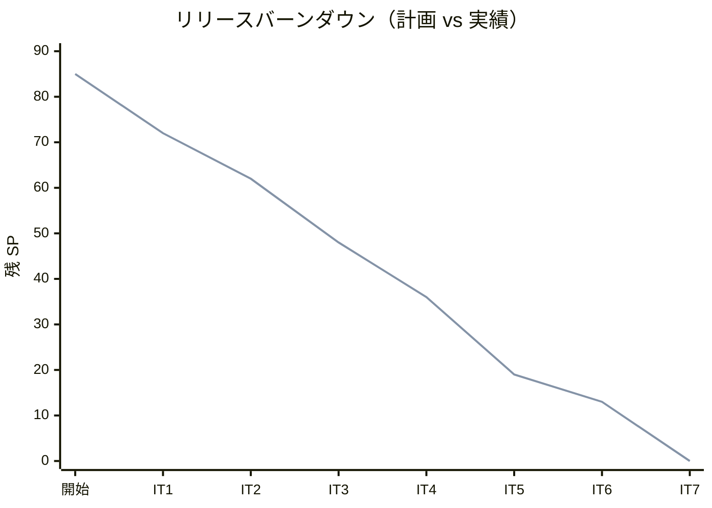
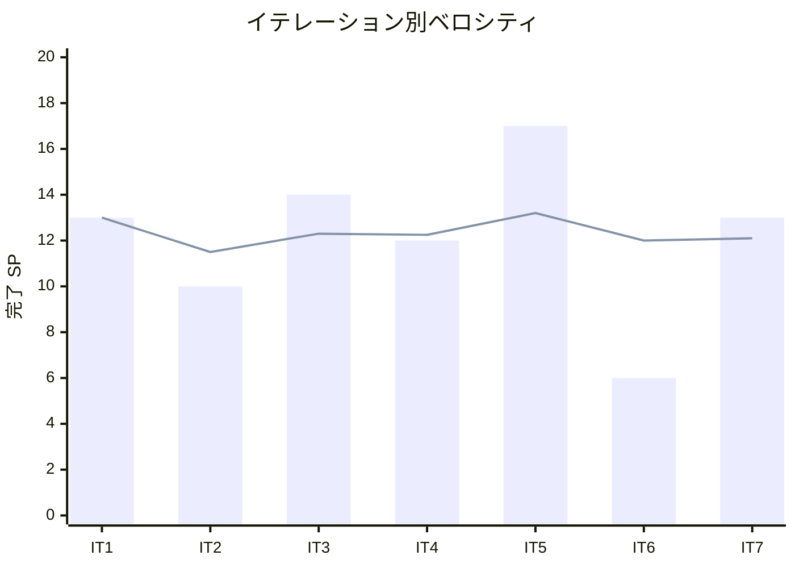

# イテレーション 7 完了報告書

## 1. プロジェクト概要

| 項目 | 内容 |
|------|------|
| イテレーション | IT7 |
| ゴール | 配送完了した予約の輸送料金算出・法人割引適用・精算書発行と入金確認が動作し、Release 1.1 を出荷する |
| 計画期間 | 2026-09-28 〜 2026-10-09（2 週間） |
| 実績期間 | 2026-07-14（Ralph Loop によるテックリード直接実装・反復消化） |
| 局面（開発戦略） | 終盤 = アウトサイドイン（最終イテレーション） |

### 要員

| 名前 | 予定作業日数 | 実績作業日数 |
|------|------------|------------|
| 開発者 1 名 + AI エージェント（テックリード Claude Code・Ralph Loop で層単位に反復実装） | 10 | 1（集中実装） |

## 2. 指標

### ベロシティ

| 項目 | 値 |
|------|-----|
| 計画 SP | 13 |
| 実績 SP | 13 |
| 達成率 | **100%** |

### リリースバーンダウン（計画 vs 実績）

- 計画線: 85 → 72 → 62 → 48 → 36 → 19 → 13 → 0
- 実績線: 85 → 72 → 62 → 48 → 36 → 19 → 13 → 0（IT7 開発完了時点。計画どおり 13 SP 消化・全 85 SP 完了）

### ベロシティ推移

- IT1=13・IT2=10・IT3=14・IT4=12・IT5=17・IT6=6・IT7=13。平均 12.1 SP/IT。7 イテレーション連続で計画=実績が一致。

## 3. テスト結果

| テストプロジェクト | 件数 | 結果 |
|-------------------|------|------|
| Domain.Tests | 140 | 全パス |
| Application.Tests | 3 | 全パス |
| Architecture.Tests | 9 | 全パス |
| Web.Tests | 66 | 全パス |
| E2E.Tests | 4 | 全パス |
| Infrastructure.Tests | 80 | 全パス |
| **合計** | **302** | **全パス** |

### テスト増分・累計推移

| イテレーション | 累計テスト数 | 増分 |
|---------------|------------|------|
| IT1 | 74 | +74 |
| IT2 | 117 | +43 |
| IT3 | 161 | +44 |
| IT4 | 198 | +37 |
| IT5 | 235 | +37 |
| IT6 | 255 | +20 |
| IT7 | 302 | +47 |

- ビルド警告 0・エラー 0、`dotnet format` クリーン、全コミットで pre-commit 品質ゲート通過。ドメイン層被覆は Invoice 95.2%・Money 86.7%・DiscountRate/FreightCalculator 100% を実測。

## 4. 実施内容と評価

### ストーリー別完了状況

| US | ストーリー | SP | 状態 |
|----|-----------|----|----|
| US21 | 輸送料金を算出する | 5 | 完了 |
| US22 | 法人割引を適用する | 3 | 完了 |
| US23 | 精算を処理する | 5 | 完了 |
| **合計** | | **13** | **100%** |

### 受入条件の達成状況

- **US21**: 配送完了（Delivered）予約に限定（改善 #16）した料金算出開始、FreightCalculator（重量×単価×貨物種別割増）による基本料金自動計算、精算書発行を満たす。
- **US22**: 法人荷主の契約割引率を Shipper ACL で取得・自動適用、割引後金額算出、個人荷主は割引なし、割引根拠を invoice_line_item に記載を満たす。
- **US23**: 精算書発行（invoice_number 採番・due_date）、入金確認（IPaymentGatewayPort スタブ）、PaymentStatus Confirmed・予約状態 Settled 同期、支払期限超過の延滞（Overdue）発火を満たす。※荷主通知（AC2）は詳細画面確認での代替運用・実メール送信は後続 IT。

### 実装内容の要約（レイヤー別）

| レイヤー | 主な成果物 |
|---------|-----------|
| Domain | Invoice 集約（発行・法人割引・入金確認・延滞・状態遷移）、Money（銀行家丸め）、DiscountRate、PaymentStatus、FreightCalculator、Cargo に MarkSettled、PaymentConfirmedEvent |
| Application | GenerateInvoiceCommand/ConfirmPaymentCommand/MarkOverdueInvoicesCommand・各 Service、InvoiceQueryService、BillingSnapshotProvider/IPaymentGatewayPort（ACL/ポート） |
| Infrastructure | InvoiceRepository（楽観ロック・明細生成）、BillingSnapshotProvider・StubPaymentGateway、invoice（0016）・exception_notification 冪等キー（0015）マイグレーション、DatabaseTimestamp/EnumDbCodec（Shared 集約） |
| Interfaces | BillingController（一覧/詳細/発行/入金確認）、精算書一覧/詳細ビュー、PaymentStatusLabel、BillingPlaceholder 撤去 |
| 連携（イベント） | PaymentConfirmedEvent→SyncBookingStatusOnPaymentConfirmedHandler（予約 Settled 同期・ADR-0009 準拠・冪等） |

## 5. 追加タスク（SP 外）: IT6 レビュー是正・正式レビュー是正・繰り越し

| # | 項目 | 内容 | 状態 |
|---|------|------|------|
| H1 | 対応報告の荷主通知（IT6） | TrackingExceptionResolvedEvent＋通知ハンドラ＋ForResolution | 完了 |
| H2 | 変換ヘルパ Shared 集約（IT6/IT5 T1） | DatabaseTimestamp・EnumDbCodec 新設・8 箇所巻き取り | 完了 |
| M1 | 例外通知の冪等化（IT6） | 自然キー一意インデックス 0015＋存在チェック | 完了 |
| 正式レビュー H1 | 延滞が発火しない | MarkOverdueInvoicesCommandService・照会時起動・延滞強調 | 完了 |
| 正式レビュー M2 | 精算異常系テスト | MarkOverdue 境界・Overdue→Confirmed・存在しない精算書・二重発行 | 完了 |
| 正式レビュー M4 | invoice 楽観ロック | UPDATE を WHERE version=@ExpectedVersion＋影響行数チェックへ | 完了 |
| 正式レビュー M3 | 用語統一 #17 | ui_design/計画/ビューを精算書へ統一 | 完了 |
| 正式レビュー M1 | payment 未使用 | data-model に未実装注記（可視化） | 完了 |
| 4.1 | Playwright E2E | 予約〜追跡〜例外〜精算フロー | 繰り越し（Web.Tests で機能担保・ブラウザ環境前提） |
| 4.2 | カバレッジ 85% CI ハードゲート化 | operating-cicd | 繰り越し（ドメイン被覆 86-100% は実測・CI パイプライン前提） |
| 4.3 | SonarQube SQ-3/SQ-2 | アクセシビリティ・ModelState | 繰り越し（SonarQube サーバ前提） |
| M5 | 決済外部呼び出しの冪等 | gateway 成功後 DB コミット失敗窓・冪等キー | 繰り越し（実決済機関連携前提） |

- コミット: 23 件（feat 6 / fix 1 / refactor 1 / test 1 / docs 14）。正式 developing-review（XP 5 視点）実施。

## 6. E2E テスト結果

- E2E 4 件全パス（認証・ウォーキングスケルトン・ロール制御）。**請求精算フロー（配送完了→料金算出→法人割引→精算書発行→入金確認→精算済→予約 Settled 同期・延滞発火）は Web.Tests（WebApplicationFactory・実 MediatR イベント経由）で担保**。Playwright E2E への移植は後続へ繰り越し（ふりかえり Try T3）。

## 7. フェーズ・累計進捗

### Release 1.1（Phase 2・IT6-7）

| イテレーション | SP | 状態 |
|---------------|----|----|
| IT6 例外対応（US19/US20） | 6 | 開発完了 |
| IT7 請求・精算（US21/22/23） | 13 | 開発完了 |
| **Phase 2 累計** | **19 / 19** | **100%** |

### プロジェクト全体

- 全 85 SP を完了（**100%**）。残 0 SP。
- **Release 1.1（Phase 2・例外対応＋請求精算）の機能実装が完了し出荷条件を充足**。見積→荷主→予約→経路設計→確定→追跡→荷役→配送完了→例外対応→料金算出→割引→精算書発行→入金確認→精算完了の業務ライフサイクルが全層で完結。中盤（IT3-5・インサイドアウト）で Booking/Routing/Tracking/Handling のドメイン中核を、終盤（IT6-7・アウトサイドイン）で Tracking 例外・Billing 請求精算を業務シナリオ起点で結合。計画の全ユーザーストーリー（US01-26）の機能実装が完了した。

## 8. ふりかえり

詳細は [イテレーション 7 ふりかえり（KPT）](./retrospective-7.md) を参照。

- **Keep**: Billing BC の既存パターン踏襲、金額ドメインの値オブジェクト凝集、IT6 レビュー H1/H2/M1 の先行消化、正式レビュー高中優先の IT7 内即是正、設計案と実装乖離の文書化。
- **Problem**: MarkOverdue 呼び出し元不在（壊れた機能）、payment テーブル未使用ドリフト、invoice 楽観ロック未使用、用語統一 #17 未徹底、品質ゲートの 5 IT 連続繰り越し。
- **Try**: 状態遷移メソッドと起動経路/発火テストのセット実装、決済永続化・冪等（実決済連携時）、品質ゲートの環境ごと決着、AC2 通知記録枠、ArchUnit 汎用ルール化、用語集定義。

## 9. 更新履歴

| 日付 | 更新内容 | 更新者 |
|------|---------|--------|
| 2026-07-14 | 初版作成（IT7 開発完了報告・13 SP・302 テスト・Billing BC 立ち上げ・US21-23 請求精算・IT6 レビュー H1/H2/M1 消化・正式レビュー是正・Release 1.1 Phase 2 出荷条件充足・全 85 SP 完了・品質ゲート繰り越し） | - |
