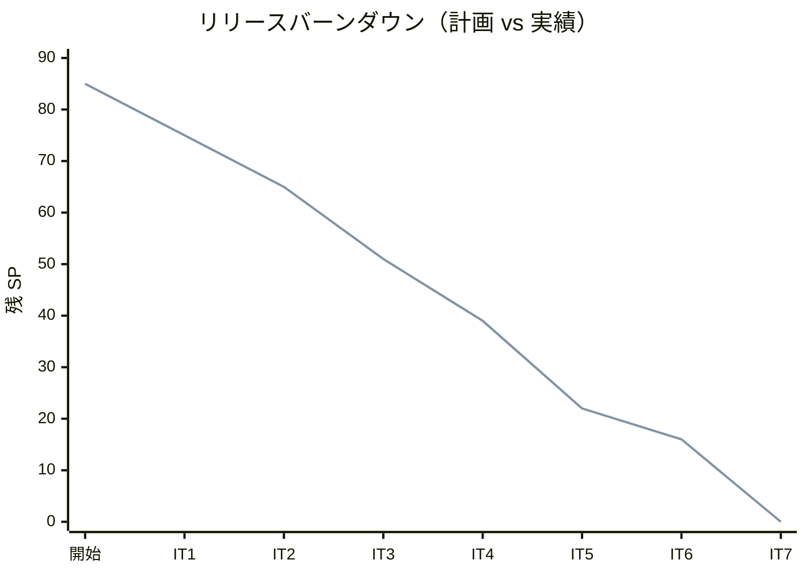
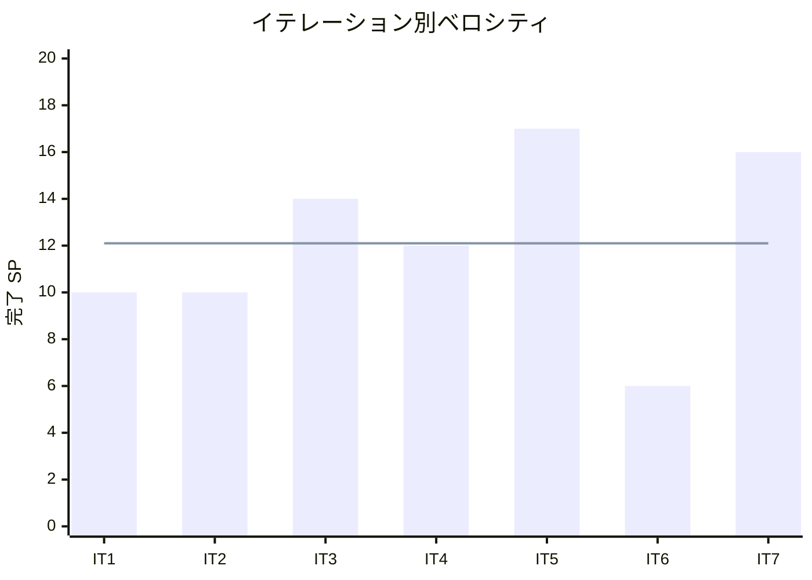

# イテレーション 7 完了報告書

## プロジェクト概要

国際貨物輸送管理システム（Cargo Tracker F# 版）のイテレーション 7 完了報告。
終盤アウトサイドインで Billing コンテキストを新規立ち上げ、割引ポリシー管理・輸送料金算出・法人割引適用・精算処理を実装し、配送完了から料金算出→精算書発行→入金確認→予約 Settled 同期までを全層縦貫通させ、Release 1.1 の全機能を完成させた。

## 日程

- イテレーション開始日: 2026-10-06（計画）
- イテレーション終了日: 2026-10-17（計画）
- 作業日数: 10 日（2 週間）
- 局面: 終盤（アウトサイドイン）・最終

## 要員

| 名前 | 予定作業日数 | 実績作業日数 |
|------|-------------|-------------|
| 開発担当 + AI エージェント | 10 | 10 |

## 指標

### ビルド・テスト結果

| 項目 | 結果 |
|------|------|
| ユニットテスト（CargoTracker.Tests） | 211 件緑 |
| 統合テスト（CargoTracker.IntegrationTests） | 140 件緑 |
| アーキテクチャテスト（CargoTracker.ArchTests） | 24 件緑 |
| **合計** | **375 件緑・失敗 0** |
| ビルド警告 | 0 |
| Fantomas フォーマット | クリーン |
| カバレッジ（全体 / ドメイン層） | 90.6% / 89.7%（閾値 80% / 85% クリア） |

### イテレーションバーンダウン（リリース）

### ベロシティ

## 実施内容と評価

| ストーリー | 結果 | 予定ポイント | ベロシティ加算ポイント |
|-----------|------|-------------|----------------------|
| US-ADM-01 割引ポリシーを管理する | 完了 | 3 | 3 |
| US21 輸送料金を算出する | 完了 | 5 | 5 |
| US22 法人割引を適用する | 完了 | 3 | 3 |
| US23 精算を処理する | 完了 | 5 | 5 |
| **合計** | | **16** | **16** |

### 主な成果物

| 種別 | 成果物 |
|------|--------|
| ドメイン | Billing（`Money` 銀行家丸め・`DiscountRate` 0〜30%・`DiscountPolicy`＋`calculateRate`・`CargoCategory`＋`Charge.calculateBase`・`Invoice` 集約・`PaymentState` DU・`DiscountPolicyMaster`）・Booking（`BookingState` に `Delivered`/`Settled` 段階追加・`MarkDelivered`/`Settle`） |
| アプリケーション | `ManageDiscountPolicy`（register/update/deactivate）・`Billing`（generateInvoice/confirmPayment/markOverdueIfDue）・`DiscountPolicyRepository`/`InvoiceRepository`/`BillingNotifier`/`PaymentGatewayPort` ポート |
| インフラ | discount_policy（0012）・invoice/invoice_line_item/payment（0013）・Donald リポジトリ・`InvoiceQueries`・`CargoQueries.findChargeBasis`/`syncBookingStatus`・`ShipperQueries.isCorporateByUuid` |
| Web | 割引ポリシー管理（`/admin/discount-policies` 系・ROLE_ADMIN）・精算（`/billing/invoices` 系・ROLE_BILLING）・navbar「請求管理」追加・決済スタブ・通知ヘルパ集約 |
| ADR | ADR-0013（料金算出と Billing↔Booking 連携は合成層 ACL と状態射影で行う） |
| テスト | Billing ドメイン（Money/割引/PaymentState・FsCheck）・割引ポリシー/Invoice 永続化往復・料金算出→精算 受け入れ・Release 1.1 全体 E2E |

### レビュー（セルフレビュー・retro-6 Try の消化）

Ralph Loop の各ターンでセルフレビューを実施し、retro-6 Try を消化した。

| 出典 | 指摘 | 対応 |
|------|------|------|
| retro-6 Try#4 | 終盤パターン（集約拡張＋DU 写像永続化＋合成層 ACL＋受け入れ縦貫通）を Billing へ適用 | 全タスクで踏襲 |
| retro-6 Try#1 / IT6 レビュー中#3 | 通知を合成層ヘルパへ集約 | `writeNotificationLog` で追跡/例外/エスカレーション/精算通知を集約 |
| retro-6 Try#3 | ui_design の例外解決 state・例外種別コード統一 | IT6 で反映済み（着手前確認） |

### デスコープ・保留

| 項目 | 状態 | 理由 |
|------|------|------|
| 決済 ACL の WireMock.Net 契約固定 | 保留 | 合成層スタブで代替。外部連携実装 IT へ送り |
| 精算完了 Settled 同期のイベント駆動化 | 保留 | 状態射影で実装（ADR-0013 案 C を将来採用余地） |
| 消費税・付加料金 | 保留 | domain-model 準拠で基本料金＋割引のみ。明細＋tax_amount は精算強化 IT |
| ドキュメント反映（data-model discount_policy・domain-model 消費税・ADR-0014） | 保留 | IT7 完了時反映事項（retro-7 Try#1） |
| 実メール送信・荷主連絡先解決 | 保留 | notification_log 記録に留まる（通知強化 IT へ継続） |

### イテレーションレビュー（次イテレーションへの引き継ぎ）

| アクションアイテム | 担当 |
|-------------------|------|
| data-model/domain-model/ADR-0014 の反映（retro-7 Try#1） | 開発担当 |
| 決済 ACL の WireMock 契約固定（retro-7 Try#2） | 開発担当 |
| Settled 同期のイベント駆動化（retro-7 Try#3） | 開発担当 |
| 通知の実メール送信化（retro-7 Try#4） | 開発担当 |
| 消費税・付加料金の実装（retro-7 Try#5） | 開発担当 |

## 総括

計画 16 SP を 100% 達成。**IT1-7 の 7 イテレーション連続で計画どおり消化（累計 85/85 SP）**。全 27 US（US01-US25＋US-ADM-01＋認証基盤）を計画どおり完遂した。
終盤アウトサイドインの狙いどおり、Billing という新規コンテキストを、中盤〜IT6 で確立したパターン（BC-local 型・合成層 ACL・DU 写像永続化・段階導入・カバレッジゲート・ArchUnit）の再利用で立ち上げ、過積載なく 16 SP を消化した。
金額計算は `Money`（int64＋銀行家丸め）・`DiscountRate`（0〜30%）・`PaymentState` DU で不正状態を型排除し、丸め誤差・不正割引・不正遷移を構造的に防いだ。`BookingState` の Delivered/Settled 段階追加と精算完了の Settled 同期（ADR-0013）で予約ライフサイクルを完結させた。
retro-6 Try#1/#4 を消化し、通知ヘルパ集約と終盤パターンの Billing 適用を実現した。決済 ACL のスタブ・Settled 同期の射影実装・消費税未実装は意図的な割り切りとして明文化し、将来の強化余地を retro-7 Try に記録した。
**Release 1.1 の全機能（例外対応＋割引・請求・精算）が IT7 完了で一気通貫し、E2E（US13→US14→US15→US18→US19→US21→US23）で実証**された。Release 1.1 の出荷判定・リリース完了報告を別途実施する。

---

## 関連ドキュメント

- [イテレーション 7 計画](./iteration_plan-7.md)
- [イテレーション 7 ふりかえり](./retrospective-7.md)
- [リリース計画](./release_plan.md)
- [ADR-0013（料金算出と Billing↔Booking 連携）](../adr/0013-料金算出とBilling_Booking連携は合成層と状態射影で行う.md)
