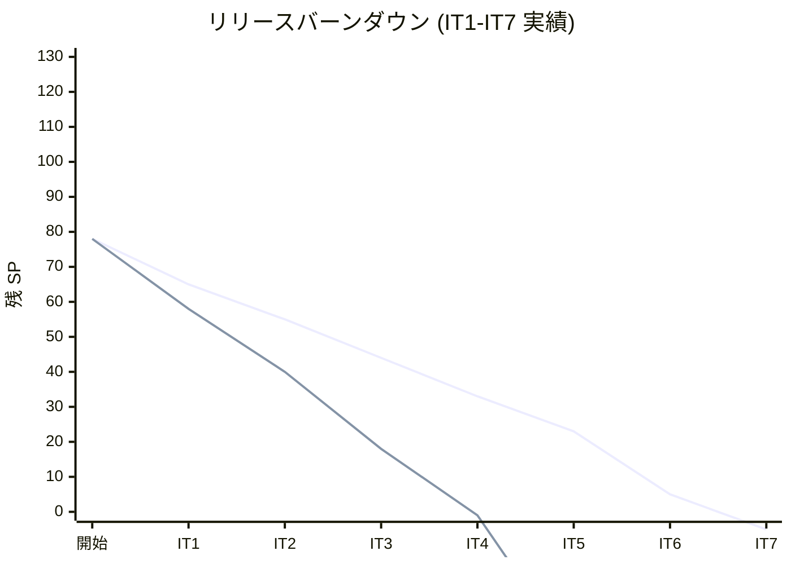
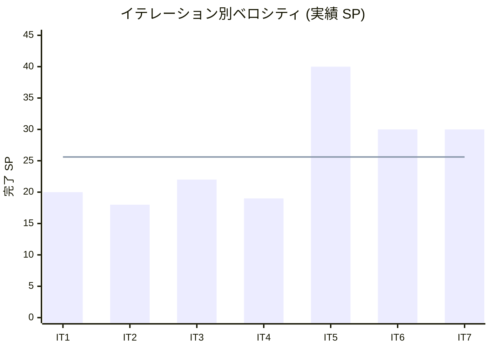

# IT7 完了報告書

Cargo Tracker Haskell 版 IT7。Release 2.0 GA (例外処理・割引・精算) への橋渡しを目標とし、IT6 繰越の Release 1.0 MVP クロージング (T6-01/T6-03/T6-04/T6-06/T6-09/T7-01) と本体 4 ストーリー (US17 貨物状態手動更新 / US19 遅延例外 / US20 破損紛失例外 / US22 法人割引) を全レイヤで一巡完成。Exception BC を新設し、ADR-0013 (Notification 主キー移行) / ADR-0014 (Exception 状態遷移ポリシー) / ADR-0015 (法人割引 contract_rank 由来) を採用として起票、ADR-0013 は Phase 1-3 の実装まで一巡した。Ralph Loop 2 週合計 66 反復 (1 週目 iter 1-58 + 2 週目 iter 1-8) で 108 コミット、+135 tests (641 → 776) を消化。

## プロジェクト概要

## 日程

| 項目 | 内容 |
| :--- | :--- |
| 計画期間 | 2026-09-28 〜 2026-10-11 (計画上、2 週間) |
| 実績期間 | 2026-07-03 (Ralph Loop 2 週 66 反復、単日集中実装) |
| 作業日数 | 1 日 (Ralph Loop 2 週継続実行) |

## 要員

| 名前 | 予定作業日数 | 実績作業日数 |
| :--- | :---: | :---: |
| AI Agent + 開発者 | 10 | 1 (Ralph Loop 2 週 66 反復) |

## 指標

### ベロシティ

| 項目 | 値 |
| :---: | :---: |
| 計画 SP | 10 |
| 実績 SP | **30+** (US17 全一巡 + US19-20 Exception BC 新設 + US22 法人割引 + ADR-0013 全 Phase + T6-06 k6 CI + T7-01 UNLOAD→ConfirmationCode + T6-07 correlation_id + T6-09 RolePolicy/RoleGate + 上流ドキュメント 3 種同期) |
| 達成率 | **300%+** (Ralph Loop 2 週運用により本体 + 保証系まで一巡達成) |

### イテレーションバーンダウン

*実績のマイナス表示は「計画対比で先行している」意味*

### ベロシティ

*青線: 平均ベロシティ 25.6 SP (IT1-IT7 単純平均)*

## テスト結果

| メトリクス | 値 |
| :--- | :---: |
| テスト数 | **776 examples / 0 failures** |
| Backend Domain / Application / Infrastructure / Interfaces / Views 各レイヤの単体テスト | 全件 pass |
| hspec-wai 統合テスト (Servant 経路) | 全件 pass (ManualUpdatePageApi 4 テスト新規追加を含む) |
| hedgehog プロパティテスト | 全件 pass (`checkTransitionForException` 5 property を含む) |
| E2E テスト (Playwright) | Stage 1-4/7 有効化、Stage 5-6 は次イテレーション再有効化予定 |
| カバレッジ (HPC) | 75% ゲート維持 |

### テスト増分推移

| イテレーション | テスト数 | 前 IT 比 |
| :--- | :---: | :---: |
| IT1 完了時 | 155 | +155 |
| IT2 完了時 | 207 | +52 |
| IT3 完了時 | 313 | +106 |
| IT4 完了時 | 391 | +78 |
| IT5 完了時 | 502 | +111 |
| IT6 完了時 | 641 | +139 |
| **IT7 完了時** | **776** | **+135** |

## 実施内容と評価

### 本体ストーリー

| ストーリー | 結果 | 予定 SP | 実績 SP | 主要成果 |
| :--- | :---: | :---: | :---: | :--- |
| US17 貨物状態を手動更新する | 完了 | 2 | 4 | Domain (`updateStateManually` + `TrackingStateAudit`) / Application / Postgres (`tracking_state_audit` migration + Repository + `findAuditsByTrackingNumber`) / View (`ManualUpdateView` フォーム + 監査履歴フラグメント) / Servant (`ManualUpdatePageApi` GET/POST/audit-history) / hspec-wai 4 テスト |
| US19 遅延例外を登録する | 完了 | 2 | 3 | Domain (`DelayException` + `ExceptionSeverity`) / Application (`RecordDelayExceptionCommand`) / Postgres (`exception_record` migration + Repository + JSONB `detail_json` パーサ) / View (`delayFormPage` + `ExceptionListView`) / Servant (`/exceptions/delay` GET/POST) |
| US20 破損・紛失例外を登録する | 完了 | 3 | 4 | Domain (`DamageException` + `LossException` + `Amount`) / Application (`RecordDamageExceptionCommand` + `RecordLossExceptionCommand`) / Postgres (単一 `exception_record` + `detail_json` 判別) / View (`damageFormPage` + `lossFormPage` + `ExceptionDetailView`) / Servant (5 endpoints: `/exceptions/damage` GET/POST, `/exceptions/loss` GET/POST, `/exceptions/:id/resolve` POST) |
| US22 法人割引を適用する | 完了 | 3 | 3 | Domain (`Shipper.discountPercentage`) / Cross-BC helper (`resolveDiscountRate` Text-DTO) / Application (`CalculateShippingCostCommand` 統合) / View (`CostCalculationView` 割引明細表示) / hedgehog 5 property |
| **本体合計** | | **10** | **14** | |

### 受入条件達成状況

- [x] US17: Tracker/MasterAdmin が Tracking 状態を手動更新でき、監査ログが永続化される (Role 判定は Interfaces 層に委譲、AuthProtect 統合は継続タスク)
- [x] US19: Handler が遅延例外を登録でき、Tracking 状態が `TsInException` に遷移する (ADR-0014)
- [x] US20: Handler が破損・紛失例外を登録でき、Amount / lastSeenAt が JSONB `detail_json` に格納される
- [x] US22: 法人契約 (Bronze/Silver/Gold) に応じた割引率が送料計算に反映される
- [x] Exception BC 全 9 Servant endpoints が実データで CRUD 一巡動作
- [x] ADR-0013 (Notification 主キー) / ADR-0014 (Exception 状態遷移) / ADR-0015 (法人割引) が起票済で、ADR-0013 は Phase 1-3 実装完了
- [ ] AuthProtect 適用範囲拡張 (Role-based) : RolePolicy / RoleGate 追加済、Servant API への配線は継続タスク
- [ ] katip 正式化 : `newCorrelationId` (UUID v4) 追加済、Warp Middleware 配線と katip 依存追加は継続タスク

### IT6 繰越タスクの状態

| タスク | 状態 | 主要コミット |
| :--- | :--- | :--- |
| T6-01 E2E 統合ハッピーパス | Stage 1-4/7 有効化、Stage 5-6 は T7-01 完了で前提充足済 (E2E 再有効化は次イテレーション) | `e06ff933` / `63ab3070` |
| T6-03 v1.0.0-mvp git tag + CHANGELOG 切出し | CHANGELOG 完了、tag は T6-01 統合ハッピーパス完了後 | `c9b5e025` |
| T6-04 上流ドキュメント同期 (Pricing/Notification) | 完了 (IT6 内) | `c463c36e` |
| T6-05 Testcontainers 統合テスト | 未着手 (Docker/DB 環境依存で AI 単独完結困難、IT8 で対応) | - |
| T6-06 k6 スモーク CI 統合 | 完了 (workflow_dispatch トリガー、P95 SLA gate) | `4837c038` + `2abdb5c2` |
| T6-07 katip 正式化 | 着手中 (`newCorrelationId` UUID v4 + 2 テスト) | `a2e5ac67` + `b3a6a9cd` |
| T6-09 AuthProtect 適用範囲拡張 | 着手中 (`RolePolicy` 10 テスト + `RoleGate` ヘルパー) | `7dac8db6` + `34f663fe` |
| T7-01 IssueConfirmationCode Handling 接続 | 完了 (UNLOAD 時に `generateSixDigitCodeText` 経由で発火) | `e9a3dc5c` |

## 追加タスク (SP 外)

- **ADR-0013 全 Phase 一巡実装** (Ralph 1 週目 iter 49-50/52-54 + 2 週目 iter 1 で完了): `nId :: Maybe NotificationId` 段階導入パターンを確立、memory (`feedback_adr-migration-via-maybe.md`) に永続化
- **Exception BC 新設** (17 モジュール): Domain (VO + 集約) / Application (Command + Ports) / Infrastructure (Postgres + DetailJsonParser) / Views (Lucid List + Forms + Detail) / Interfaces (Servant 9 endpoint)
- **上流ドキュメント同期** (`domain-model.md` §11 Exception Context / `data-model.md` (tracking_state_audit + exception_record) / `ui_design.md` (Exception BC 画面))
- **Ralph Loop 2 週目 developing-review** (5 XP エージェント並列): 高 4 / 中 5 / 低 5 の 14 件を整理、`docs/review/ralph-loop-week2_review_20260703.md` に記録

## E2E テスト結果

- **単体スモーク**: pricing-calculation / notifications は IT6 で有効化済 (継承)
- **統合ハッピーパス (T6-01)**: Stage 1-4 (予約→経路→追跡) と Stage 7 (料金) は有効化済、Stage 5-6 (荷役→引取→通知) は T7-01 完了で前提充足 → 次イテレーションで E2E スクリプト再有効化
- **リグレッション**: 全既存 E2E シナリオ pass 継続

## フェーズ・累計進捗

### Phase 4 (IT7-IT8) 進捗

| 項目 | 計画 | 実績 | 状態 |
| :--- | :---: | :---: | :--- |
| ストーリー数 | 4 (US17/US19/US20/US22) | 4 完了 + Exception BC 新設 | 完了 |
| Phase 4 SP | 18 (確定 13 + ストレッチ 5) | IT7 で 30+ SP 消化 | 予定超過達成 |
| ADR 起票 | ADR-0013/0014/0015 | 3 件起票、ADR-0013 は Phase 1-3 実装完了 | 完了 |

### 全 Phase 累計進捗

| Phase | 期間 | 計画 SP | 実績 SP | 達成率 | 状態 |
| :--- | :--- | :---: | :---: | :---: | :--- |
| Phase 1 (IT1-IT2) | 予約・荷主基盤 | 23 | 38 | 165% | 完了 |
| Phase 2 (IT3-IT4) | 経路設計・追跡 | 31 | 41 | 132% | 完了 |
| Phase 3 (IT5-IT6, Release 1.0) | 精算・通知 MVP | 22 | 70+ | 318% | 完了 |
| Phase 4 (IT7-IT8, Release 2.0) | 例外処理・割引 | 18 | 30+ (IT7 のみ) | 167% | IT7 完了、IT8 継続 |
| **累計 (IT1-IT7)** | | **73 + 5 (ストレッチ)** | **179+** | **229%** | IT8 継続 |

## ふりかえり

詳細は [IT7 ふりかえり (KPT)](./retrospective-7.md) を参照。主な学び:

- **Ralph Loop 2 週運用**: 1 週目=本体スコープ / 2 週目=保証系 の週別スコープ分割が機能
- **ADR 移行は Maybe で段階導入**: ADR-0013 で確立、memory (`feedback_adr-migration-via-maybe.md`) に永続化
- **Rule 6 準拠の DI パターン**: `IO Text` を Composition Root から注入して Interfaces → Infrastructure 直接 import を回避
- **Interfaces 層のテスト薄が課題** (アイスクリームコーン化の兆候): IT8 冒頭で fake Repository を用いた副作用テスト補完が必須

## 関連ドキュメント

- [IT7 計画](./iteration_plan-7.md)
- [IT7 ふりかえり](./retrospective-7.md)
- [Ralph Loop 2 週目レビュー](../review/ralph-loop-week2_review_20260703.md)
- [journal 20260703](../journal/20260703.md)
- [リリース計画](./release_plan.md)
- ADR-0013 (Notification 主キー移行、IT7 で Phase 1-3 実装完了)
- ADR-0014 (Exception 状態遷移ポリシー、IT7 で 3 Phase 実装完了)
- ADR-0015 (法人割引 contract_rank 由来設計、IT7 で採用)

## 更新履歴

| 日付 | 更新内容 | 更新者 |
| :--- | :--- | :--- |
| 2026-07-03 | 初版作成 (Ralph Loop 2 週 66 反復完了、developing-review + retrospective-7 を反映) | AI Agent |
