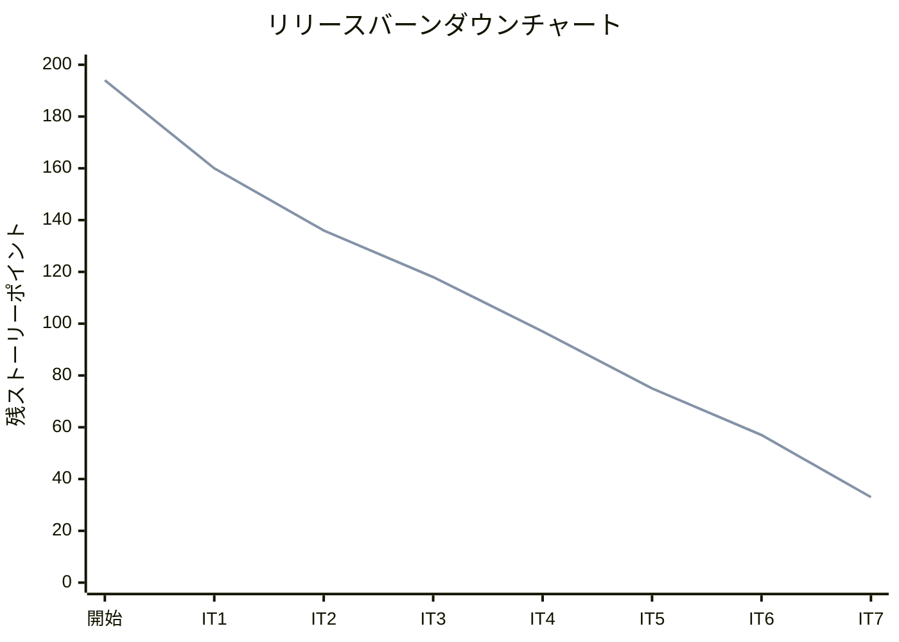
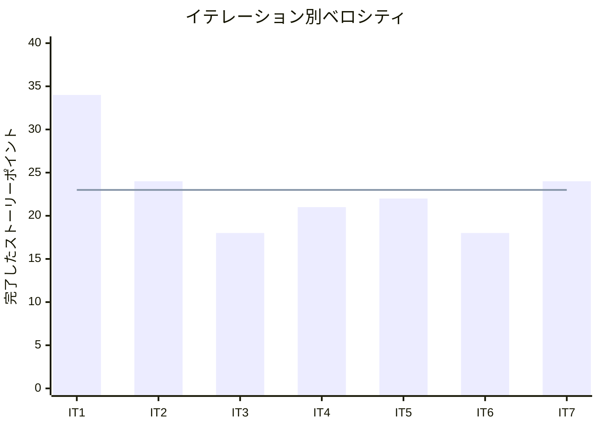

# イテレーション 7 完了報告書

## プロジェクト概要

### 日程

| 項目 | 日付 |
|------|------|
| イテレーション開始日 | 2026-05-09 |
| イテレーション終了日 | 2026-05-11 |
| 作業日数（実績） | 3 日 |

### 要員

| 名前 | 予定作業日数 | 実績作業日数 |
|------|------------|------------|
| 開発者 + AI | 10 | 3 |

### ゴール

IT6 未完了タスクの解消（H6 FE・RabbitMQ 統合テスト・CI E2E）と Phase 2 最初の US（US16/US05/US19）の BE + FE を実装し、荷役拡張と例外処理の基盤を確立する

---

## 指標

### ベロシティ

| 項目 | 値 |
|------|-----|
| 計画 SP | 24 |
| 実績 SP | 24 |
| 達成率 | 100% |

### バーンダウンチャート

### ベロシティチャート

**平均ベロシティ**: 23 SP（IT1〜IT7 合計 161 SP ÷ 7）

---

## テスト結果

| メトリクス | Backend（trackingms） | Backend（bookingms） | Frontend |
|-----------|---------------------|---------------------|---------|
| テストファイル | 13 ファイル / 全通過 | 8 ファイル / 全通過 | 17 ファイル / 全通過 |
| テスト数 | 51 / 全通過 | 51 / 全通過 | 65 / 全通過 |
| カバレッジ | 86% | 79% | 約 49% |
| E2E テスト | — | — | 7 シナリオ / 全通過 |

### テスト増分（IT6 比較）

| メトリクス | IT6 実績 | IT7 実績 | 増分 |
|-----------|---------|---------|------|
| Backend テスト数（trackingms） | 39 | 51 | +12 |
| Backend テスト数（bookingms） | 46 | 51 | +5 |
| Frontend テスト数 | 57 | 65 | +8 |
| **合計** | **142** | **167** | **+25** |

### テスト累計推移

| イテレーション | Backend bookingms | Backend trackingms | Frontend | 合計 |
|--------------|---------|---------|-----|-----|
| IT1（完了） | 20 | — | 20 | 40 |
| IT2（完了） | 26 | — | 20 | 46 |
| IT3（完了） | 26 | — | 20 | 46 |
| IT4（完了） | 41 | 30 | 26 | 97 |
| IT5（完了） | 41 | 30 | 35 | 106 |
| IT6（完了） | 46 | 39 | 57 | 142 |
| IT7（完了） | 51 | 51 | 65 | 167 |

---

## 実施内容と評価

### ストーリー完了状況

| ストーリー | 内容 | 結果 | 計画 SP | 実績 SP |
|-----------|------|------|---------|---------|
| TI-持越 | IT6 未完了タスク（H6 FE・統合テスト・CI E2E・ADR） | 完了 | 3 | 3 |
| US16 | 引取作業を記録する | 完了 | 5 | 5 |
| US05 | 危険物・冷凍貨物の予約を登録する | 完了 | 8 | 8 |
| US19 | 遅延例外を処理する | 完了 | 8 | 8 |
| **合計** | | | **24** | **24** |

### 受入条件の達成状況

#### IT6 持ち越しタスク

- [x] H6 FE API エラーメッセージのトースト通知が表示される
- [x] RabbitMQ イベント統合テスト（Testcontainers）がパスする
- [x] CI パイプラインで Playwright E2E テストが自動実行される
- [x] ADR-005 TrackingNumberIssuedEvent 契約管理方針を記録

#### US16: 引取作業を記録する

- [x] 「引取」荷役種別で荷受人確認フィールドが表示される
- [x] 引取記録後に貨物状態が「引取済 (CLAIMED)」に更新される

#### US05: 危険物・冷凍貨物の予約を登録する

- [x] 貨物種別「危険物」選択時に危険物申告情報フィールドが表示・必須入力となる
- [x] 貨物種別「冷凍・冷蔵」選択時に温度管理条件フィールドが表示・必須入力となる

#### US19: 遅延例外を処理する

- [x] 遅延例外（追跡番号・例外種別・発生日時・場所・理由）を記録できる
- [x] 例外記録後に貨物状態が「例外発生 (EXCEPTION)」に更新される
- [x] 対応内容（新到着予定日・対応方針）を入力して更新できる

### 実装内容の要約

#### ドメイン層

- `TrackingExceptionEvent`（新規）: 遅延例外のドメインモデル。例外種別・発生日時・場所・理由・エスカレーションフラグ・対応内容・新到着予定日・ステータスを管理
- `TrackingActivity.addException()`: 例外追加メソッド。状態を EXCEPTION に更新
- `HazmatInfo`（新規）: 危険物申告情報値オブジェクト（UN コード・危険物クラス・梱包等級）
- `TemperatureInfo`（新規）: 温度管理条件値オブジェクト（最低・最高温度・単位）
- `Cargo`: `hazmatInfo`・`temperatureInfo` フィールドを追加

#### アプリケーション層

- `TrackingExceptionService.recordException()`: 遅延例外記録サービス
- `TrackingExceptionService.respondToException()`: 対応内容更新サービス
- `RecordTrackingExceptionCommand`・`RespondToExceptionCommand`: 新規コマンド
- `CargoCommandService`: HAZARDOUS/REFRIGERATED 時の必須バリデーション追加
- `TrackingActivityEvent`: `consigneeConfirmation`（荷受人確認）フィールド追加

#### インフラ層

- `TrackingExceptionEventMapper`（新規）: 例外イベント MyBatis マッパー
- `TrackingExceptionEventMapper.xml`（新規）: 例外イベント SQL マッピング
- `TrackingActivityRepositoryImpl`: 例外イベントの保存・取得・更新対応
- `V4__create_tracking_exception_event.sql`（新規）: 例外イベントテーブル作成
- `V5__add_cargo_special_info.sql`（新規）: 危険物・温度管理カラム追加
- `TrackingExceptionEventRecord`（新規）: 例外イベント永続化レコード

#### プレゼンテーション層（BE）

- `TrackingExceptionController`（新規）:
  - `POST /api/tracking/v1/{trackingNumber}/exceptions`: 遅延例外記録
  - `PUT /api/tracking/v1/{trackingNumber}/exceptions/{id}/response`: 対応内容更新
- `GlobalExceptionHandler`: `IllegalArgumentException` → 400 ハンドラー追加

#### フロントエンド層

- `TrackingExceptionPage.tsx`（新規）: 遅延例外記録画面（例外種別・場所・理由・エスカレーション）
- `useRecordTrackingException` hook（新規）: 遅延例外記録 mutation
- `BookingForm.tsx`: 危険物・温度管理条件の動的フィールド表示
- `HandlingActivityPage.tsx`: CLAIM 選択時の荷受人確認フィールド動的表示

---

## 追加タスク（SP 外）

| タスク | 内容 |
|-------|------|
| テストカバレッジ向上 | `TrackingExceptionController` 統合テスト追加（trackingms: 74% → 86%） |
| `GlobalExceptionHandler` 拡張 | `IllegalArgumentException` → 400 レスポンスの統一処理追加 |

---

## フェーズ・累計進捗

### Phase 2 進捗

| イテレーション | 計画 SP | 実績 SP | 達成率 | 状態 |
|--------------|---------|---------|--------|------|
| IT7 | 24 | 24 | 100% | 完了 |
| IT8 | 16 | — | — | 計画済 |
| IT9 | 21 | — | — | 計画済 |
| **Phase 2 合計** | **61** | **24** | — | 進行中 |

### 全フェーズ累計進捗

| フェーズ | 計画 SP | 実績 SP | 状態 |
|---------|---------|---------|------|
| Phase 1（IT1〜IT6） | 116 | 137 | 完了 |
| Phase 2（IT7〜IT9） | 61 | 24 | 進行中 |
| Phase 3（IT10） | 21 | — | 未着手 |
| **累計** | **198** | **161** | |

---

## ふりかえりへのリンク

詳細は [イテレーション 7 ふりかえり](./retrospective-7.md) を参照。

---

## 更新履歴

| 日付 | 内容 |
|------|------|
| 2026-05-11 | 初版作成 |
