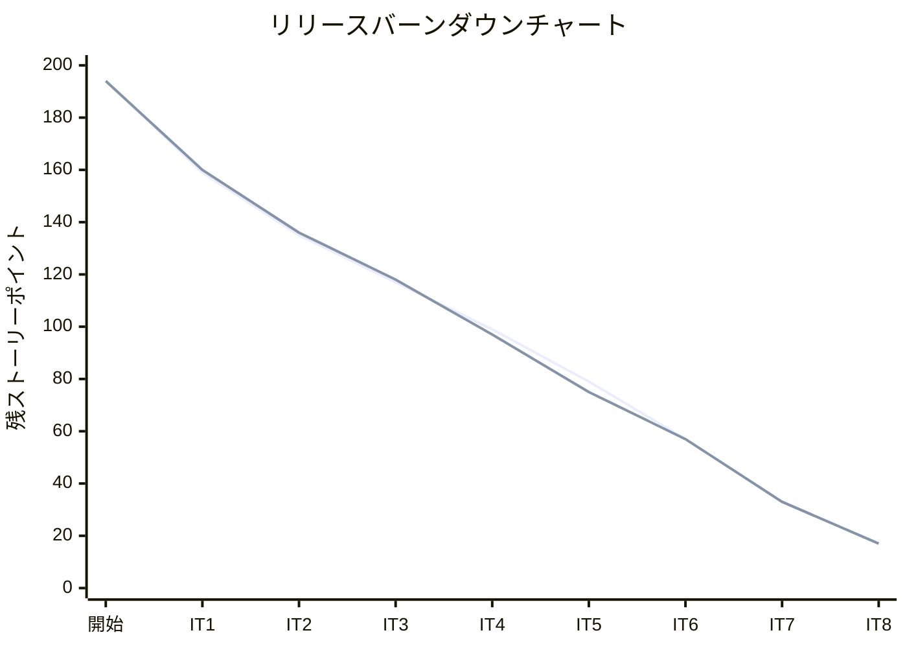
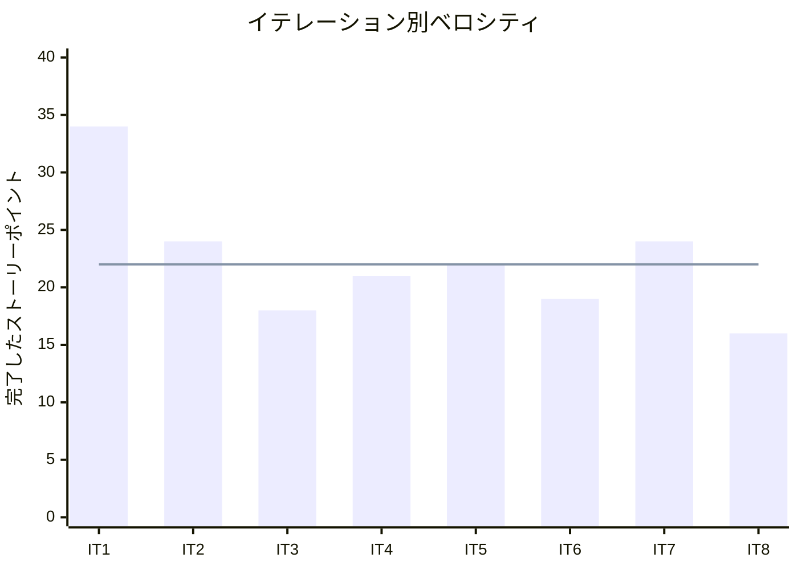

# イテレーション 8 完了報告書

## プロジェクト概要

### 日程

| 項目 | 日付 |
|------|------|
| イテレーション開始日 | 2026-05-11 |
| イテレーション終了日 | 2026-05-11 |
| 作業日数（実績） | 1 日 |

### 要員

| 名前 | 予定作業日数 | 実績作業日数 |
|------|------------|------------|
| 開発者 + AI | 10 | 1 |

### ゴール

破損・紛失例外処理（US20）と輸送料金算出（US21）の API + 画面を実装し、IT7 レビュー高・中優先度指摘（M1/M2/M3）を解消する

---

## 指標

### ベロシティ

| 項目 | 値 |
|------|-----|
| 計画 SP | 16 |
| 実績 SP | 16 |
| 達成率 | 100% |

### バーンダウンチャート

### ベロシティチャート

**平均ベロシティ**: 22 SP（IT1〜IT8 合計 178 SP ÷ 8）

---

## テスト結果

| メトリクス | Backend（trackingms） | Backend（billingms）| Backend（bookingms） | Frontend |
|-----------|---------------------|---------------------|---------------------|---------|
| テストファイル | 13 ファイル / 全通過 | 3 ファイル / 全通過 | 9 ファイル / 全通過 | 18 ファイル / 全通過 |
| テスト数 | 53 / 全通過 | 7 / 全通過 | 51 / 全通過 | 72 / 全通過 |
| カバレッジ | 91% | 91% | 79% | 約 49% |
| E2E テスト | — | — | — | 7 シナリオ / 全通過 |

### テスト増分（IT7 比較）

| メトリクス | IT7 実績 | IT8 実績 | 増分 |
|-----------|---------|---------|------|
| Backend テスト数（trackingms） | 51 | 53 | +2 |
| Backend テスト数（billingms） | — | 7 | +7（新規） |
| Backend テスト数（bookingms） | 51 | 51 | 0 |
| Frontend テスト数 | 65 | 72 | +7 |
| **合計** | **167** | **183** | **+16** |

### テスト累計推移

| イテレーション | Backend bookingms | Backend trackingms | Backend billingms | Frontend | 合計 |
|--------------|---------|---------|---------|-----|-----|
| IT1（完了） | 20 | — | — | 20 | 40 |
| IT2（完了） | 26 | — | — | 20 | 46 |
| IT3（完了） | 26 | — | — | 20 | 46 |
| IT4（完了） | 41 | 30 | — | 26 | 97 |
| IT5（完了） | 41 | 30 | — | 35 | 106 |
| IT6（完了） | 46 | 39 | — | 57 | 142 |
| IT7（完了） | 51 | 51 | — | 65 | 167 |
| IT8（完了） | 51 | 53 | 7 | 72 | 183 |

---

## 実施内容と評価

### ストーリー完了状況

| ストーリー | 内容 | 結果 | 計画 SP | 実績 SP |
|-----------|------|------|---------|---------|
| IT7 レビュー対応 | M1（DTO 化）/ M2（状態ガード）/ M3（バリデーション）| 完了 | 0（SP 外） | 0 |
| US20 | 破損・紛失例外を処理する | 完了 | 8 | 8 |
| US21 | 輸送料金を算出する | 完了 | 8 | 8 |
| **合計** | | | **16** | **16** |

### 受入条件の達成状況

#### IT7 レビュー対応

- [x] BE: `TrackingExceptionController` のレスポンスを `Map<String, Object>` から DTO（record）に変更（M1）
- [x] BE: `addException()` に CLAIMED 状態ガードを追加（M2）
- [x] BE: `respond()` に null/空白バリデーションを追加（M3）

#### US20: 破損・紛失例外を処理する

- [x] 追跡番号と例外種別「破損」または「紛失」・発生状況を記録できる
- [x] 例外記録後に貨物状態が「例外発生（EXCEPTION）」に更新される
- [x] 例外種別「紛失」の場合、緊急フラグが設定される
- [x] 対応内容（補償方針等）を入力して更新できる
- [x] FE: DAMAGE 選択時に損傷詳細・証拠写真 URL フィールドを動的表示する
- [x] FE: LOST 選択時に最終確認場所・最終確認日時フィールドを動的表示する

#### US21: 輸送料金を算出する

- [x] 予約 ID を入力して料金算出 API を呼び出せる
- [x] 基本料金・消費税（10%）の内訳が表示される
- [x] 算出結果を確認して確定操作ができる
- [x] 確定後、invoice テーブルに CONFIRMED 状態で保存される

### 実装内容の要約

#### ドメイン層（trackingms）

- `TrackingExceptionEvent`: DAMAGE 固有フィールド（`damageDescription`, `photoUrl`）・LOST 固有フィールド（`lastKnownLocation`, `lastSeenAt`）を追加
- `TrackingExceptionEvent.recordDamageDetails()`: 破損詳細記録メソッド追加
- `TrackingExceptionEvent.recordLostDetails()`: 紛失詳細記録メソッド追加
- `TrackingActivity.addException()`: CLAIMED 状態ガード追加（IT7 レビュー M2 対応）

#### ドメイン層（billingms — 新規）

- `Invoice`（集約ルート）: `addLineItem()`, `calculateFinalAmount()`, `confirm()` メソッド
- `InvoiceLineItem`（エンティティ）: 明細項目。description・amount・seqNumber
- `Money`（値オブジェクト）: 不変の金額値。`add()`, `multiply()`, `ofJpy()` メソッド
- `PaymentStatus`（enum）: `PENDING`, `CONFIRMED`, `OVERDUE`, `REFUNDED`

#### アプリケーション層

- `RecordTrackingExceptionCommand`: DAMAGE/LOST 固有フィールド追加（trackingms）
- `TrackingExceptionService.recordException()`: DAMAGE・LOST 固有情報設定ロジック追加（trackingms）
- `CalculateInvoiceCommand`（新規）: 料金算出コマンド（billingms）
- `InvoiceCommandService`（新規）: `calculate()`, `confirm()` メソッド（billingms）

#### インフラ層

- `TrackingExceptionEventRecord`: 新フィールド追加（trackingms）
- `TrackingActivityRepositoryImpl`: 新フィールドの INSERT / SELECT 対応（trackingms）
- `TrackingExceptionEventMapper.xml`: 新カラムの INSERT・SELECT SQL 追加（trackingms）
- `V5__add_exception_damage_lost_fields.sql`（新規）: 4 カラム追加（trackingms）
- `InvoiceRepositoryImpl`（新規）: MyBatis 実装（billingms）
- `InvoiceMapper.xml`（新規）: INSERT/SELECT/UPDATE SQL（billingms）
- `V2__create_invoice_tables.sql`（新規）: invoice・invoice_line_item テーブル作成（billingms）

#### プレゼンテーション層（BE）

- `TrackingExceptionController`: レスポンスを `ExceptionItemResponse`/`ExceptionResponse` record にDTO 化（IT7 レビュー M1 対応）。DAMAGE/LOST 固有フィールド受付追加
- `InvoiceController`（新規）: `POST /api/billing/v1/invoices/calculate`, `POST /api/billing/v1/invoices/{invoiceId}/confirm`
- `GlobalExceptionHandler`（新規 billingms）: `IllegalArgumentException`/`IllegalStateException` → 400 対応

#### フロントエンド層

- `TrackingExceptionPage.tsx`: DAMAGE 選択時の損傷詳細・LOST 選択時の最終確認情報フィールドを動的表示
- `RecordTrackingExceptionRequest` 型: `damageDescription?`, `photoUrl?`, `lastKnownLocation?`, `lastSeenAt?` 追加
- `InvoiceCalculatePage.tsx`（新規）: 予約 ID 入力 → 料金算出 → 内訳表示 → 確定ボタン
- `useBilling.ts`（新規）: `useCalculateInvoice`, `useConfirmInvoice` hooks
- `billing/types/billing.ts`（新規）: `CalculateInvoiceRequest`, `InvoiceResponse`, `LineItemResponse` 型定義
- `App.tsx`: `/billing/calculate` ルート追加

---

## 追加タスク（SP 外）

| タスク | 内容 |
|-------|------|
| IT7 レビュー M1 対応 | `TrackingExceptionController` DTO 化リファクタリング |
| IT7 レビュー M2 対応 | `addException()` CLAIMED 状態ガード追加 |
| IT7 レビュー M3 対応 | `respond()` null/空白バリデーション追加 |
| H2 互換対応 | V5 マイグレーションで複数 ALTER TABLE を個別文に分割（H2 互換） |

---

## フェーズ・累計進捗

### Phase 2 進捗

| イテレーション | 計画 SP | 実績 SP | 達成率 | 状態 |
|--------------|---------|---------|--------|------|
| IT7 | 24 | 24 | 100% | 完了 |
| IT8 | 16 | 16 | 100% | 完了 |
| IT9 | 21 | — | — | 計画済 |
| **Phase 2 合計** | **61** | **40** | — | 進行中 |

### 全フェーズ累計進捗

| フェーズ | 計画 SP | 実績 SP | 状態 |
|---------|---------|---------|------|
| Phase 1（IT1〜IT6） | 116 | 137 | 完了 |
| Phase 2（IT7〜IT9） | 61 | 40 | 進行中 |
| Phase 3（IT10） | 21 | — | 未着手 |
| **累計** | **198** | **177** | |

---

## ふりかえりへのリンク

詳細は [イテレーション 8 ふりかえり](./retrospective-8.md) を参照。

---

## 更新履歴

| 日付 | 内容 |
|------|------|
| 2026-05-11 | 初版作成 |
