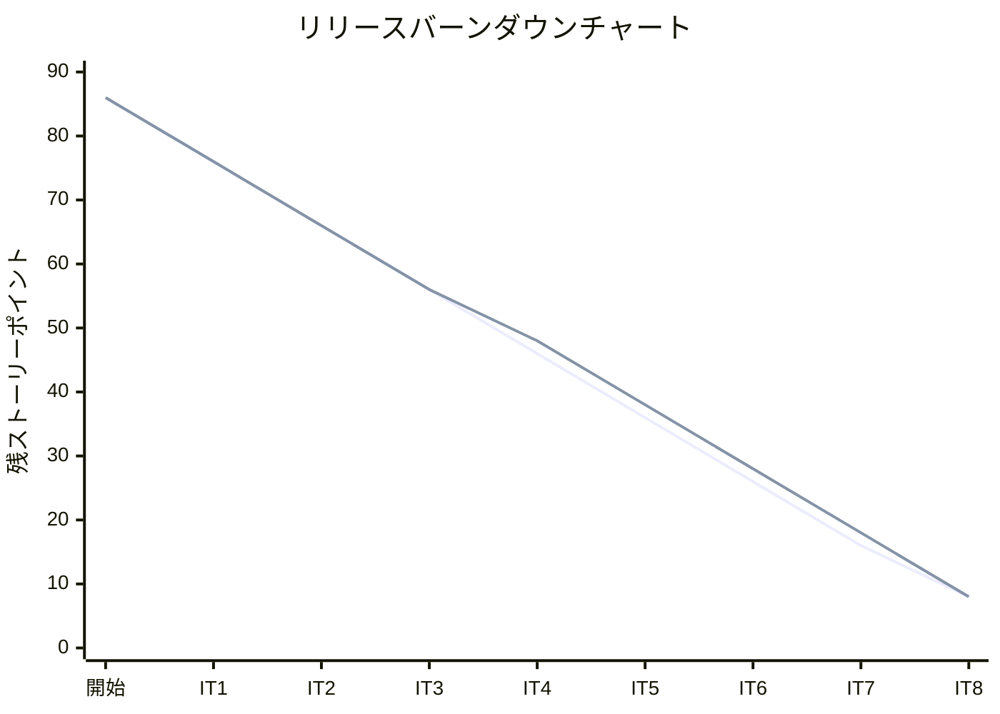
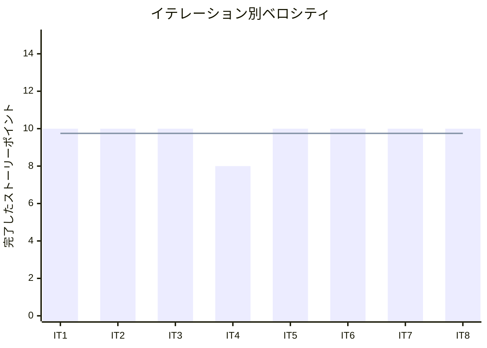

# イテレーション 8 完了報告書

## プロジェクト概要

### 日程

| 項目 | 値 |
|------|-----|
| イテレーション開始日 | 2026-04-18 |
| イテレーション終了日 | 2026-04-20（計画 2026-05-01） |
| 計画期間 | 2026-04-18 〜 2026-05-01（2 週間） |
| 実績作業日数 | 3 日（AI ペアプログラミングにより計画前完了） |

### 要員

| 名前 | 予定作業日数 | 実績作業日数 |
|------|-------------|-------------|
| 開発者 + AI ペア | 10 | 3 |

---

## 指標

### ビルド結果

| 項目 | 結果 |
|------|------|
| Java テスト | **301 件全パス**（IT7 比 +29 件） |
| Playwright E2E テスト | **87 件全パス**（IT7: 78 件から +9 件） |
| テストカバレッジ (JaCoCo) | 80% 以上維持 |
| SonarQube Quality Gate | 未実施（IT9 にて確認予定） |

### イテレーションバーンダウン

> **注**: IT8 実績は 10 SP 完了のため残 SP = 18 - 10 = 8（IT9: US19 5SP + US20 5SP 予定のうち、Phase 3 残は US19・US20・US21）。

### ベロシティ

| 項目 | 値 |
|------|-----|
| 計画ベロシティ | 10 SP/イテレーション |
| IT8 実績ベロシティ | 10 SP |
| 累計実績ベロシティ | 78 SP（IT1: 10 + IT2: 10 + IT3: 10 + IT4: 8 + IT5: 10 + IT6: 10 + IT7: 10 + IT8: 10） |
| 平均ベロシティ（IT1-8） | 9.75 SP/イテレーション |

---

## 実施内容と評価

| ストーリー | 結果 | 予定ポイント | ベロシティ加算ポイント |
|-----------|------|-------------|---------------------|
| IT7-改善: htmx フラグメント化（`display:none` 廃止） | 完了 | 1 | 1 |
| US16: 引取作業を記録する | 完了 | 3 | 3 |
| US18: 追跡情報を照会する | 完了 | 3 | 3 |
| US17: 貨物状態を手動更新する | 完了 | 3 | 3 |
| **合計** | | **10** | **10** |

### 成果物一覧

| カテゴリ | 成果物 | 件数 |
|---------|--------|------|
| ドメインモデル（Tracking Context 拡張） | `TrackingEventType.CLAIM`（引取種別追加）、`CargoTrackingStatus`（手動更新用状態列挙型）、状態遷移ロジック更新（UNLOADED → CLAIMED） | 2 拡張 |
| クエリサービス（Read Model） | `TrackingQueryService`、`TrackingDetailDto`（追跡番号・状態・荷役履歴 DTO） | 2 クラス |
| アプリケーション（Tracking 拡張） | `TrackingCommandService`（引取作業記録・手動状態更新コマンド追加）、`RecordHandlingEventCommand`、`ManualStatusUpdateCommand` | 3 クラス |
| プレゼンテーション（Tracking 拡張） | `TrackingThymeleafController`（`GET /tracking`・`GET /tracking/{tn}`・`GET /tracking/status`・`POST /tracking/status` 追加）、`PublicTrackingController`（`GET /public/tracking`・`GET /public/tracking/{tn}` 追加） | 2 コントローラ |
| テンプレート（新規） | `tracking/detail.html`（追跡情報照会）、`tracking/status.html`（手動状態更新）、`tracking/search.html`（追跡番号検索）、`tracking/public-search.html`（公開追跡検索）、`tracking/handling.html`（CLAIM フィールド追加） | 5 ファイル |
| UI 改善 | ナビバーに「追跡照会」リンク（`/tracking`）追加、予約詳細画面に「荷役作業を登録」・「追跡照会」リンク追加 | 2 ファイル修正 |
| IT7-改善 | `display:none` 使用箇所を `th:fragment` + `d-none` パターンへ全廃止（billing/booking/routing 画面） | 複数ファイル修正 |
| テスト（Java） | `TrackingActivityTest`（CLAIM 状態遷移）、`TrackingQueryServiceTest`、`TrackingThymeleafControllerTest`（拡張）、`PublicTrackingControllerTest` | 4 ファイル |
| テスト（E2E） | `handling.spec.ts`（US16 CLAIM シナリオ +3 件）、`tracking.spec.ts`（US18 追跡照会シナリオ +3 件）、`status.spec.ts`（US17 手動状態更新 3 件 新規）、`TrackingPage.ts`（`TrackingDetailPage`・`StatusUpdatePage` Page Object 追加） | 4 ファイル |
| ドキュメント | `retrospective-8.md`、`iteration_report-8.md` | 2 ファイル |

---

## IT7 申し送り対応状況

### IT7 申し送り（IT8 で対応完了）

| # | 内容 | 状態 |
|---|------|------|
| T1 | US16 引取作業記録を実装する | ✓ 完了（CLAIM 種別・CLAIMED 状態遷移・E2E 3 件） |
| T2 | US18 追跡情報照会を実装する | ✓ 完了（認証あり・公開追跡・荷役履歴表示・E2E 3 件） |
| T3 | US17 貨物状態手動更新を実装する | ✓ 完了（手動状態更新フォーム・E2E 3 件） |
| T4 | htmx フラグメントを `th:fragment` で実装（`display:none` 廃止） | ✓ 完了（全画面で `d-none` パターンに統一） |

### IT7 申し送り（IT8 未対応 → 持ち越し）

| # | 内容 | 状態 |
|---|------|------|
| T5 | US14/US15 のメール通知要件確認 | ✗ 持ち越し（IT10 リリース準備フェーズへ） |
| T6 | パフォーマンステスト・負荷テストの計画 | ✗ 持ち越し（IT10 へ） |

---

## 受入条件の達成状況

### IT7-改善: htmx フラグメント化

| # | 受入条件 | 状態 |
|---|---------|------|
| 1 | `display:none` が全廃止されている | ✓ 完了 |
| 2 | `th:fragment` + `d-none` パターンで代替されている | ✓ 完了 |

### US16: 引取作業を記録する

| # | 受入条件 | 状態 |
|---|---------|------|
| 1 | 作業種別「引取」を選択すると荷受人確認フィールドが表示される | ✓ 完了（htmx による動的表示） |
| 2 | 荷受人確認が取得されると引取作業が記録される | ✓ 完了 |
| 3 | 記録後、貨物状態が「引取済み（CLAIMED）」に更新される | ✓ 完了（E2E: handling.spec.ts AC2,3） |
| 4 | 貨物状態「引取済み」は配送完了を意味する | ✓ 完了（状態遷移ロジック） |
| 5 | 追跡番号が存在しない場合、エラーメッセージが表示される | ✓ 完了（E2E: handling.spec.ts AC5） |

### US18: 追跡情報を照会する

| # | 受入条件 | 状態 |
|---|---------|------|
| 1 | 追跡番号を入力して貨物情報を照会できる | ✓ 完了（GET /tracking/{trackingNumber}） |
| 2 | 現在の状態・位置（港湾名）・推定到着日が表示される | △ 部分完了（状態・荷役履歴は表示。推定到着日フィールドは未実装） |
| 3 | 追跡イベント履歴（日時・場所・作業種別）が時系列で表示される | ✓ 完了（E2E: tracking.spec.ts AC1,2,3） |
| 4 | 追跡番号が存在しない場合、404 が返る | ✓ 完了（E2E: tracking.spec.ts AC4） |
| 5 | ログインなしでも追跡番号があれば照会できる（公開追跡） | ✓ 完了（GET /public/tracking/{trackingNumber}・E2E: tracking.spec.ts AC5） |

### US17: 貨物状態を手動更新する

| # | 受入条件 | 状態 |
|---|---------|------|
| 1 | 追跡番号を指定して現在の貨物情報を確認できる | ✓ 完了 |
| 2 | 新しい状態・位置・日時を入力して追跡情報を更新できる | ✓ 完了（E2E: status.spec.ts AC2,3） |
| 3 | 更新後、追跡イベントが履歴に記録される | ✓ 完了 |
| 4 | 追跡番号が存在しない場合、エラーメッセージが表示される | ✓ 完了（E2E: status.spec.ts AC4） |
| 5 | 状態変更の種類に応じて荷主への通知が送信される | ✗ 未実装（メールインフラ未整備・IT10 以降で対応） |

---

## テスト結果

### テスト増分

| 種別 | IT7 完了時 | IT8 完了時 | 増分 |
|------|-----------|-----------|------|
| Java テスト（実行件数） | 272 件以上 | **301 件** | **+29 件** |
| Playwright E2E テスト | 78 件 | **87 件** | **+9 件** |
| テストカバレッジ (JaCoCo) | 81.7% | 80% 以上維持 | - |

### IT8 新規追加テストクラス・メソッド

| テストクラス / ファイル | 追加内容 | 件数 |
|----------------------|--------|------|
| Tracking ドメインテスト | CLAIM 状態遷移・TrackingQueryService・TrackingCommandService | 複数 |
| `TrackingThymeleafControllerTest` | 追跡照会・手動状態更新エンドポイントテスト（拡張） | 新規 |
| `PublicTrackingControllerTest` | 公開追跡照会エンドポイントテスト | 新規 |
| `handling.spec.ts` | US16 引取シナリオ 3 件（CLAIM フィールド表示・一連フロー・異常系） | **+3 件** |
| `tracking.spec.ts` | US18 追跡照会シナリオ 3 件（照会・404・公開追跡） | **+3 件** |
| `status.spec.ts` | US17 手動状態更新シナリオ 3 件（フォーム表示・更新・異常系） | **+3 件（新規）** |
| `TrackingPage.ts` | `TrackingDetailPage`・`StatusUpdatePage` Page Object 追加 | 新規 |

### テスト累計推移

| イテレーション | Java テスト（実行件数） | E2E テスト | テストカバレッジ |
|--------------|----------------------|-----------|--------------|
| IT1 | 60 件 | 27 件 | 89% |
| IT2 | 166 件 | 31 件 | 93% |
| IT3 | 約 184 件 | 41 件 | 未計測 |
| IT4 | 約 217 件 | 40 件 | 91% |
| IT5 | 250 件 | 56 件 | 88% |
| IT6 | 272 件 | 67 件 | 81% |
| IT7 | 272 件以上 | 78 件 | 81.7% |
| **IT8** | **301 件** | **87 件** | **80% 以上** |

---

## E2E テスト結果

### IT8 新規追加シナリオ

#### US16: handling.spec.ts 追加分

| # | テスト記述 | ファイル | 結果 |
|---|----------|---------|------|
| 1 | 受入条件1: 作業種別「引取」を選択すると荷受人確認フィールドが表示される | handling.spec.ts | ✓ 通過 |
| 2 | 受入条件2,3: 引取作業を記録すると貨物状態が「引取済み」に更新される | handling.spec.ts | ✓ 通過 |
| 3 | 受入条件5（異常系）: 存在しない追跡番号の場合エラーメッセージが表示される | handling.spec.ts | ✓ 通過 |

#### US18: tracking.spec.ts 追加分

| # | テスト記述 | ファイル | 結果 |
|---|----------|---------|------|
| 1 | 受入条件1,2,3: 追跡番号で貨物情報と荷役履歴を照会できる | tracking.spec.ts | ✓ 通過 |
| 2 | 受入条件4（異常系）: 存在しない追跡番号の場合 404 が返る | tracking.spec.ts | ✓ 通過 |
| 3 | 受入条件5: ログインなしでも追跡番号があれば照会できる（公開追跡） | tracking.spec.ts | ✓ 通過 |

#### US17: status.spec.ts（新規）

| # | テスト記述 | ファイル | 結果 |
|---|----------|---------|------|
| 1 | 受入条件1: 手動状態更新フォームが表示される | status.spec.ts | ✓ 通過 |
| 2 | 受入条件2,3: 追跡番号を指定して貨物状態を手動更新できる | status.spec.ts | ✓ 通過 |
| 3 | 受入条件4（異常系）: 存在しない追跡番号の場合エラーメッセージが表示される | status.spec.ts | ✓ 通過 |

### リグレッションテスト

| ファイル | テスト数 | 結果 |
|---------|---------|------|
| auth.spec.ts | 4 | ✓ 全件通過 |
| booking.spec.ts | 25 | ✓ 全件通過 |
| billing.spec.ts | 14 | ✓ 全件通過 |
| estimation.spec.ts | 4 | ✓ 全件通過 |
| shipper.spec.ts | 5 | ✓ 全件通過 |
| navigation.spec.ts | 13 | ✓ 全件通過 |
| voyage.spec.ts | 4 | ✓ 全件通過 |
| tracking.spec.ts | 7 | ✓ 全件通過（IT8 で +3 件） |
| handling.spec.ts | 7 | ✓ 全件通過（IT8 で +3 件） |
| status.spec.ts | 3 | ✓ 全件通過（IT8 新規） |
| **合計** | **87** | **✓ 全件通過** |

---

## フェーズ・累計進捗

### Phase 2 進捗（経路設計・追跡）

| ユーザーストーリー | SP | 状態 |
|-----------------|-----|------|
| US01: 輸送見積を作成する | 5 | ✓ 完了（IT3） |
| US06: 予約情報を経路設計者に引き渡す | 2 | ✓ 完了（IT3） |
| US07: 航海スケジュールを検索する | 5 | ✓ 完了（IT4） |
| US08: 経路候補を算出する | 8 | ✓ 完了（IT4） |
| US09: 経路を選択・確定する | 3 | ✓ 完了（IT5） |
| US10: 経路条件を調整して再算出する | 3 | ✓ 完了（IT5） |
| US11: 経路情報を予約に紐付ける | 2 | ✓ 完了（IT5） |
| US12: 確定経路を荷主に通知する | 2 | 未着手（IT9 以降） |
| US14: 追跡番号を発行する | 3 | ✓ 完了（IT7） |
| US15: 荷役作業を記録する | 5 | ✓ 完了（IT7） |
| US16: 引取作業を記録する | 3 | ✓ **完了（IT8）** |
| US18: 追跡情報を照会する | 3 | ✓ **完了（IT8）** |

**Phase 2 進捗**: 42 / 44 SP 完了（95%、残 US12: 2SP）

### Phase 3 進捗（精算・例外処理）

| ユーザーストーリー | SP | 状態 |
|-----------------|-----|------|
| US17: 貨物状態を手動更新する | 3 | ✓ **完了（IT8）** |
| US19: 遅延例外を処理する | 5 | 未着手（IT9） |
| US20: 破損・紛失例外を処理する | 5 | 未着手（IT9） |
| US21: 輸送料金を算出する | 5 | 未着手（IT10） |
| US22: 法人割引を適用する | 3 | ✓ 完了（IT6） |
| US23: 精算を処理する | 5 | ✓ 完了（IT6） |

**Phase 3 進捗**: 11 / 26 SP 完了（42%）

### 全体累計進捗

| フェーズ | 計画 SP | 完了 SP | 達成率 |
|---------|---------|---------|--------|
| Phase 1（予約・荷主管理基盤） | 16 | 16 | 100% |
| Phase 2（経路設計・追跡） | 44 | 42 | 95% |
| Phase 3（精算・例外処理） | 26 | 11 | 42% |
| **合計** | **86** | **69** | **80%** |

> **注**: Phase 2 残は US12（確定経路荷主通知・2SP）。Phase 3 残は US19・US20・US21（15SP）。IT9・IT10 で完了予定。

---

## ふりかえり

詳細は [イテレーション 8 ふりかえり](./retrospective-8.md) を参照。

---

## 更新履歴

| 日付 | 更新内容 | 更新者 |
|------|---------|--------|
| 2026-04-20 | 初版作成 | - |
