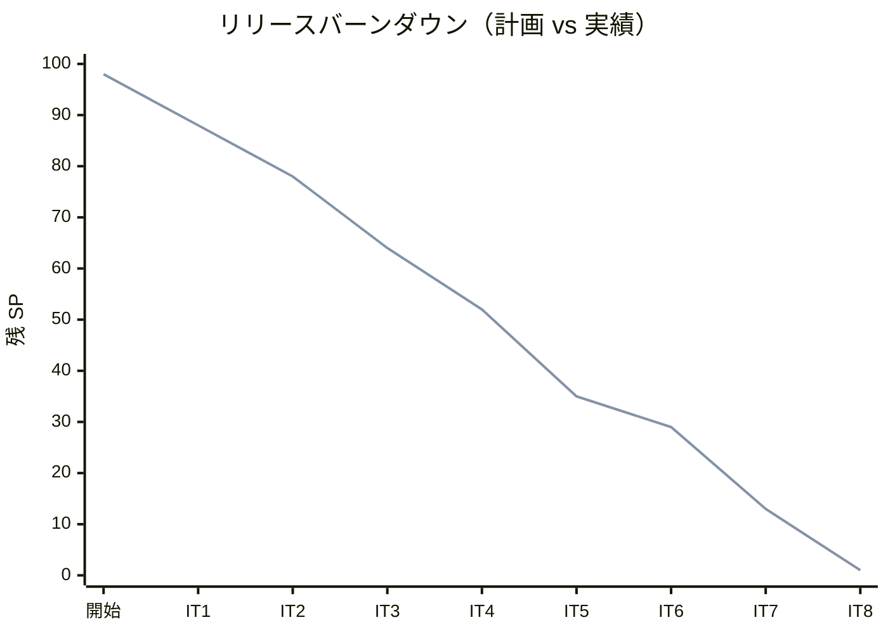
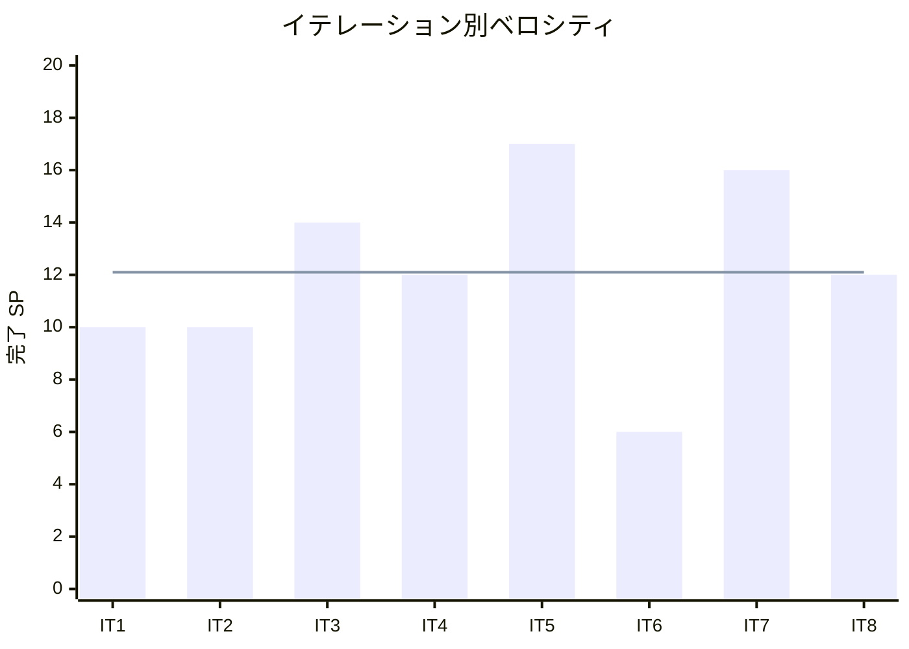

# イテレーション 8 完了報告書

## プロジェクト概要

国際貨物輸送管理システム（Cargo Tracker F# 版）のイテレーション 8 完了報告。
終盤の強化・予備イテレーションとして、IT7 で先送りした US21-23/US-ADM-01 の受入残を充足し、通知の実効化・決済 ACL の契約固定・Settled 同期のイベント駆動化・品質の穴埋めを行い、Release 1.1 を出荷可能な品質へ引き上げた。

## 日程

- イテレーション開始日: 2026-10-20（計画）
- イテレーション終了日: 2026-10-31（計画）
- 作業日数: 10 日（2 週間）
- 局面: 終盤（強化・予備）・アウトサイドイン

## 要員

| 名前 | 予定作業日数 | 実績作業日数 |
|------|-------------|-------------|
| 開発担当 + AI エージェント | 10 | 10 |

## 指標

### ビルド・テスト結果

| 項目 | 結果 |
|------|------|
| ユニットテスト（CargoTracker.Tests） | 222 件緑 |
| 統合テスト（CargoTracker.IntegrationTests） | 149 件緑 |
| アーキテクチャテスト（CargoTracker.ArchTests） | 31 件緑 |
| **合計** | **402 件緑・失敗 0** |
| ビルド警告 | 0 |
| Fantomas フォーマット | クリーン |
| カバレッジ（全体 / ドメイン層） | 89.0% / 88.8%（閾値 80% / 85% クリア） |

### イテレーションバーンダウン（リリース）

### ベロシティ

## 実施内容と評価

本イテレーションは新規ユーザーストーリーを持たず、US21/US22/US23/US-ADM-01 の受入残の充足と、通知・決済・BC 連携・品質の強化を対象とした。

| エピック | 内容 | 結果 | 予定 SP | 加算 SP |
|---------|------|------|---------|---------|
| 1 精算業務の受入完全充足 | 割引マスタ接続・支払期限/期限超過通知・輸送実績プレビュー/距離自動導出・消費税/金額内訳・例外時料金調整 | 完了 | 5 | 5 |
| 2 通知の実効化 | MailSender 送信抽象・連絡先解決・通知失敗経路テスト | 完了 | 2 | 2 |
| 3 決済 ACL の契約固定 | 実 HTTP アダプタ・契約固定テスト・ADR-0014 承認 | 完了 | 2 | 2 |
| 4 Settled イベント駆動化 | BookingSettled 集約更新・booking_status 実値検証・ADR-0013 改訂 | 完了 | 2 | 2 |
| 5 品質穴埋め・出荷 | 有効期限フィルタ・フォームバリデーション・異通貨テスト是正・返金導線・last_insert_rowid・報告書更新 | 完了（出荷 tag は保留） | 2 | 1 |
| **合計** | | | **13** | **12** |

### 主な成果物

| 種別 | 成果物 |
|------|--------|
| ドメイン | `ConsumptionTax`（標準税率 10%）・`Invoice.TaxRate`/`TaxAmount`/`totalAmount`・`Charge.deriveDistance`/`distanceFactorOf`/`applyAdjustment`・`Billing.refund`（Confirmed→Refunded）・`CurrencyCode` に USD 追加 |
| アプリケーション | `Billing.generateInvoiceWithRate`/`markOverdueIfDue`（結線）/`refund`・`Booking.RouteAssignment.settle`（イベント駆動 Settled 同期） |
| インフラ | マイグレーション 0014（`invoice.tax_rate`/`tax_amount`）・`InvoiceQueries.findAll`（tax・due_date）・`CargoQueries.findRouteLegs`・`ShipperQueries.findEmailByBooking`/`findEmailByUuid`・`TrackingQueries.hasUnresolvedException`・採番 `last_insert_rowid()`・`syncBookingStatus` 廃止 |
| Web | `MailSender` 送信抽象＋`notifyShipperByBooking`・`PaymentGateway`（stub/createHttp 実 HTTP アダプタ）・料金算出 2 段階プレビュー・支払期限/金額内訳/返金導線の画面・割引ポリシー有効期限フィルタ・割引率フォーム max 30% |
| ADR | ADR-0014 承認（決済 ACL 契約固定・HttpListener へ変更）・ADR-0013 改訂（Settled イベント駆動化） |
| テスト | 消費税/距離導出/料金調整/返金/異通貨の単体・支払期限/期限超過/返金/通知失敗経路の統合・決済契約固定（成功/拒否/障害）・有効期限フィルタ受け入れ・booking_status 実値検証 |

### レビュー（セルフレビュー・IT7 レビュー/retro-7 Try の消化）

Ralph Loop の各ターンでセルフレビューを実施し、IT7 レビュー（高7/中8/低5）と retro-7 Try を消化した。

| 出典 | 指摘 | 対応 |
|------|------|------|
| retro-7 Try#1 | data-model/domain-model/ADR 反映 | domain-model・ADR-0013/0014 を更新（data-model は税カラム定義済みを確認） |
| retro-7 Try#2 / ADR-0014 | 決済 ACL の契約固定 | 実 HTTP アダプタ＋契約固定テスト（HttpListener・脆弱性回避） |
| retro-7 Try#3 / ADR-0013 案 C | Settled 同期のイベント駆動化 | `RouteAssignment.settle` 経由・射影廃止・実値検証 |
| retro-7 Try#4 | 通知の実効化 | `MailSender` 送信抽象＋連絡先解決 |
| retro-7 Try#5 | 消費税・付加料金 | 消費税を実装（付加料金明細は継続） |
| IT7 レビュー高#1 | Settled 射影の実値検証欠落 | booking_status 実値検証を追加 |
| IT7 レビュー高#2 | 割引マスタ未接続 | マスタ率を権威化（`resolveApplicableRate`） |
| IT7 レビュー中#2/#3 | 通知失敗経路・Money.add 到達不能 | 通知失敗テスト・USD 導入で異通貨テスト是正 |

### デスコープ・保留

| 項目 | 状態 | 理由 |
|------|------|------|
| Release 1.1 のバージョンバンプ・CHANGELOG・git tag | 保留 | ユーザー判断により品質ゲート確認＋報告書更新に限定。出荷判定は別途 |
| 付加料金（`invoice_line_item`＋燃油サーチャージ） | 保留 | 消費税のみ実装。付加料金明細は精算拡張 IT へ |
| MailSender の実 SMTP/SES 送信 | 保留 | 送信抽象は導入。実送信基盤は運用フェーズ |
| Web `paymentConfirm` の実決済結線 | 保留 | 実 HTTP アダプタ整備済み。決済 API/認証情報確定後に結線 |
| 距離導出の実距離化 | 保留 | 区間数×標準距離の代理導出。location 間距離マスタは未整備 |

### イテレーションレビュー（次イテレーション／運用への引き継ぎ）

| アクションアイテム | 担当 |
|-------------------|------|
| Release 1.1 の正式出荷判断・実施（retro-8 Try#1） | リリース担当 |
| MailSender の実送信差し替え（retro-8 Try#2） | 運用担当 |
| 決済 API 結線（retro-8 Try#3） | 開発担当 |
| 付加料金の実装（retro-8 Try#4） | 開発担当 |
| 距離マスタ整備と実距離化（retro-8 Try#5） | 開発担当 |

## 総括

計画 13 SP のうち開発タスク（エピック 1-5.2）を 100% 完了し、task5.3 の出荷アクションのみユーザー判断で保留した（実績 12 SP・達成率 92%）。**IT1-8 累計 97/98 SP**。
強化・予備イテレーションの狙いどおり、IT7 レビューの高・中指摘と retro-7 Try#1-#5 を計画のエピックへ体系的に写像し、受入残と技術的負債を後戻りゼロで消化した。消費税・距離自動導出・例外時料金調整はドメインサービスとして純粋に追加し、通知は送信抽象で実効化、決済は実 HTTP アダプタで契約固定、Settled 同期は集約駆動化してドメイン整合性を強化した。
セキュリティ判断（WireMock.Net の脆弱性回避）・不可逆アクションの確認（DB スキーマ変更・リリース出荷）を規律として守り、自律実行と人間判断の境界を維持した。
**Release 1.1 は品質ゲート合格（全体 89.0% / ドメイン 88.8%）・全 402 テスト緑で出荷可能な状態に到達**した。正式出荷（バージョンバンプ・tag）はリリース判断待ちである。

---

## 関連ドキュメント

- [イテレーション 8 計画](./iteration_plan-8.md)
- [イテレーション 8 ふりかえり](./retrospective-8.md)
- [リリース完了報告書 1.1](./release_report-1.1.md)
- [リリース計画](./release_plan.md)
- [ADR-0013（料金算出と Billing↔Booking 連携）](../adr/0013-料金算出とBilling_Booking連携は合成層と状態射影で行う.md)
- [ADR-0014（決済 ACL 契約固定）](../adr/0014-決済ACLはPaymentGatewayPortとWireMockで契約固定する.md)
