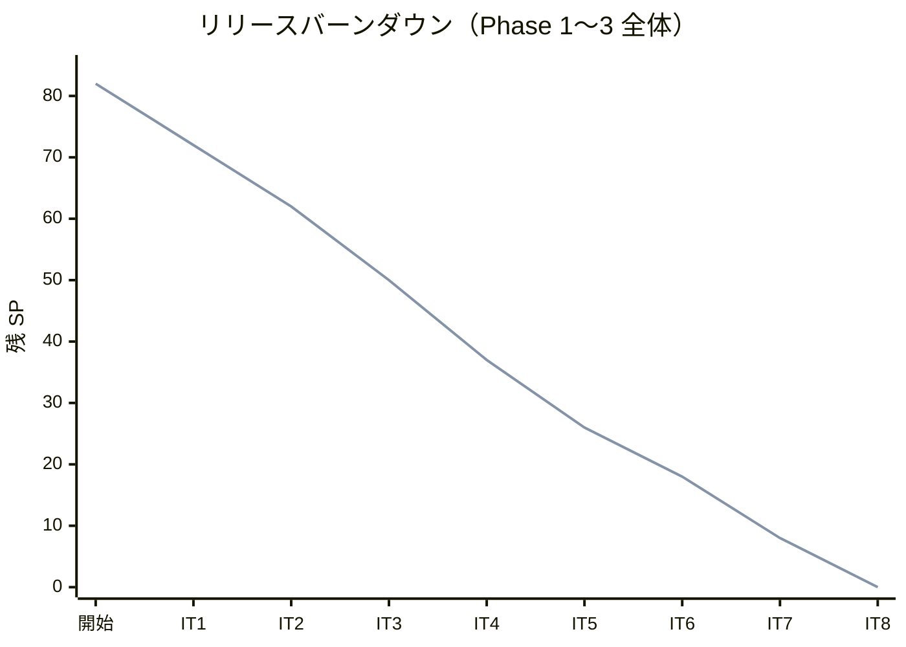
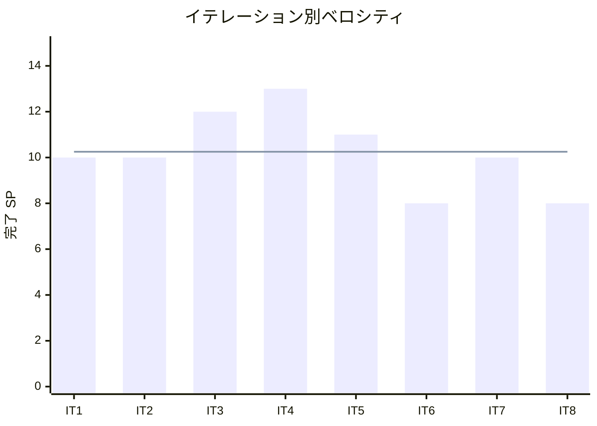

# イテレーション 8 完了報告書

## 1. プロジェクト概要

| 項目 | 内容 |
|------|------|
| イテレーション番号 | 8 |
| 計画期間 | 2026-07-07 〜 2026-07-20 |
| 実績期間 | 2026-04-05 |
| ゴール | 経路選択・確定・条件調整・再算出・予約紐付け・通知を完成させ、Phase 3（経路設計高度化）をリリースする |

## 2. 要員

| 名前 | 予定作業日数 | 実績作業日数 |
|------|--------------|--------------|
| Copilot | 5 | 1 |

## 3. 指標

### ベロシティ

| 項目 | 値 |
|------|-----|
| 計画 SP | 8 |
| 実績 SP | 8 |
| 達成率 | 100% |

### リリースバーンダウン

### ベロシティ推移

## 4. テスト結果

| メトリクス | Backend | Frontend |
|-----------|---------|----------|
| テスト数 | 608 / 608 通過 | 該当なし |
| カバレッジ（instruction） | 89.8% | 該当なし |
| E2E テスト | 60 tests（40 シナリオ）全通過 | — |

### テスト増分（前イテレーション比）

| メトリクス | IT7 実績 | IT8 実績 | 増分 |
|-----------|----------|----------|------|
| Backend テスト数 | 583 | 608 | +25 |
| カバレッジ（instruction） | 91% | 89.8% | -1.2% |
| E2E テスト数（Playwright） | 51 | 60 | +9 |

> **カバレッジ補足**: SonarQube new_coverage は 89.8%（目標 80% 超）。IT8 追加の統合テストはコントローラー〜DB 経路のため instruction カバレッジ計算の分母が増加し、若干低下したが Quality Gate 基準（80%）は維持。

### テスト累計推移

| イテレーション | Backend テスト数 | E2E シナリオ（e2e/ パッケージ） |
|---------------|------------------|-------------------------------|
| IT1 | 113 | 9 |
| IT2 | 239 | 17 |
| IT3 | 278 | 26 |
| IT4 | 361 | 26 |
| IT5 | 449 | 18 |
| IT6 | 506 | 23 |
| IT7 | 583 | 32 |
| IT8 | 608 | 40 |

## 5. SonarQube Quality Gate

| プロジェクト | カバレッジ（new） | 重複率（new） | New Violations | 結果 |
|------------|------------------|---------------|----------------|------|
| cargo-tracker | 89.8% | 0.087% | 0 | **PASS ✅** |

### Quality Gate 達成までの経緯

初回スキャンで `new_violations: 11` が検出され FAIL となったが、以下を修正して 2 回目スキャンで PASS:
- `BookingLegTest.java`: `LocalDate.of()` をラムダ外の static 定数に抽出、`isZero()` 適用（`java:S5960`）
- `BookingTest.java`: `List.of()` をラムダ外変数 `emptyLegs` に移動（`java:S5960`）
- `US24E2ETest.java`: 3 件の個別 `assertThat` を 1 チェーンに統合（`java:S5960`）

## 6. 実施内容と評価

### ストーリー別完了状況

| ストーリー | 結果 | 予定ポイント | ベロシティ加算ポイント |
|-----------|------|-------------|------------------------|
| US22 経路を選択・確定する | 完了 | 3 | 3 |
| US23 経路条件を調整して再算出する | 完了 | 3 | 3 |
| US24 経路情報を予約に紐付ける | 完了 | 2 | 2 |
| 合計 |  | 8 | 8 |

### 受入条件達成状況

#### US22: 経路を選択・確定する

- [x] 経路候補一覧から 1 件を選択できる
- [x] 選択した経路の詳細（経由港・航海番号・出発日・到着日）を確認できる
- [x] 確定操作を行うと経路情報が確定状態で保存される

#### US23: 経路条件を調整して再算出する

- [x] 現在の制約条件を確認・表示できる
- [x] 期限延長・経由地変更等の条件を調整できる
- [x] 調整後、経路候補の再算出（US21）が自動実行される
- [x] 調整可能な条件がない場合、営業担当者に荷主との条件交渉を依頼できる

#### US24: 経路情報を予約に紐付ける

- [x] 予約番号と確定経路を確認できる
- [x] 経路情報を予約に紐付ける操作ができる
- [x] 紐付け後、経路情報と予約の紐付けが保存される
- [x] 営業担当者に経路確定の通知が送信される
- [x] 荷主に確定経路の詳細（経由港・日程）が通知される

### レイヤー別実装要約

- **ドメイン（booking BC - US22/US24）**: `BookingLeg` 値オブジェクト（voyageNumber・origin・destination・departure・arrival）を新規実装しました。`Booking.assignRouteWithLegs()` を追加し、`AssignedRoute`（概要）と `BookingLeg` リスト（区間詳細）を同時に保存します。`BookingRouteAssignedEvent` を定義し、イベント発行を `Booking` 集約に責務化しました。
- **ドメイン（booking BC - US24）**: `BookingEventHandler.onBookingRouteAssigned()` を実装しました。`@TransactionalEventListener(phase = AFTER_COMMIT)` で受信し、営業担当者・荷主への通知ログ（AppEventLogService 経由）を記録します。
- **インフラ（booking）**: Flyway migration V016（`booking_legs` テーブル: `booking_id UUID FK → bookings.id`, voyageNumber, origin, destination, departure, arrival）を追加しました。`BookingRepositoryImpl.save()` を拡張し、`booking_legs` へのバルク INSERT を追加しました。
- **インフラ（routing）**: `VoyageLegsQueryService` + `VoyageLegMapper`（MyBatis）を追加し、`GET /api/v1/routings/voyages/{voyageNumber}/legs` で区間詳細を返す REST API を実装しました。
- **プレゼンテーション（Web - US22/US23）**: `routing/search.html` を拡張しました。`#assignModal`（Bootstrap Modal）を追加し、JavaScript fetch で `/api/v1/routings/voyages/{voyageNumber}/legs` を取得して区間詳細テーブルを動的描画します。「経路候補なし」セクションに条件調整フォーム（希望着日・貨物種別変更）と「営業担当者に交渉を依頼」ボタン（`/bookings/{id}?action=negotiate` リンク）を追加しました。
- **プレゼンテーション（Web - US24）**: `booking/detail.html` に「割り当て済みルート」カードを追加しました。`assignedRoute` が存在する場合に航海番号・ルートパス・推定着日・区間詳細テーブルを表示し、「予約を確定する」ボタンを活性化します。

## 7. 追加タスク（SP 外）

| タスク | 内容 |
|--------|------|
| SonarQube Code Smell 修正 | 初回スキャン new_violations: 11 → 修正後 0。`java:S5960` ルール対応（ラムダ内複数スロー点、アサーションチェーン統合）コミット `2046e05` |
| E06 E2E リグレッション修正 | IT8 追加の `#assignModal` により `page.locator('h5')` が複数要素にマッチし strict mode エラー。`h5.mb-3` に修正（`routing.spec.ts:60`） |

## 8. E2E テスト結果

### 新規追加シナリオ（IT8）

| シナリオ | 説明 | 結果 |
|---------|------|------|
| E33 | 経路候補モーダルを開くと航海番号・区間詳細テーブルが表示される（AC1+AC2） | ✅ 通過 |
| E34 | SG001 の区間詳細モーダルに出発港・経由港・到着港が表示される | ✅ 通過 |
| E34b | SG002（複数区間）のモーダルに複数行の区間詳細が表示される | ✅ 通過 |
| E35 | 「この経路で確定する」ボタンを押すと保存成功メッセージが表示される（AC3） | ✅ 通過 |
| E36 | 検索結果ページに現在の検索条件カードが表示される（AC1） | ✅ 通過 |
| E37 | 貨物種別を HAZARDOUS に変更して再検索すると対応ルートのみ表示される（AC2+AC3） | ✅ 通過 |
| E38 | 候補あり時は「営業担当者に交渉を依頼」カードが表示されない（AC4 前提確認） | ✅ 通過 |
| E39 | 経路紐付け前の予約詳細に「未割り当て」と表示される（AC1 前提確認） | ✅ 通過 |
| E40 | 経路を紐付けると「割り当て済みルート」カードに航海番号・ルートパス・推定着日が表示され「予約を確定する」ボタンが活性化する（AC1+AC2+AC3） | ✅ 通過 |

### リグレッション結果

既存 E01〜E32 シナリオ（認証・荷主登録・予約・ルート検索・確定・追跡番号発行・荷役記録・追跡照会・例外処理・輸送料金算出・割引・精算・経路設計基本フロー）はすべて通過（E06 は IT8 リグレッション修正済み）。

**合計**: 60 tests / 60 passed ✅

## 9. フェーズ・累計進捗

### Phase 3 進捗（IT8 完了）

| ストーリー | 計画 SP | 完了 SP | 状態 |
|-----------|---------|---------|------|
| US19 経路設計条件を確認する | 2 | 2 | 完了 ✅ |
| US20 航海スケジュールを検索する | 3 | 3 | 完了 ✅ |
| US21 経路候補を算出する | 5 | 5 | 完了 ✅ |
| US22 経路を選択・確定する | 3 | 3 | 完了 ✅ |
| US23 経路条件を調整して再算出する | 3 | 3 | 完了 ✅ |
| US24 経路情報を予約に紐付ける | 2 | 2 | 完了 ✅ |
| **Phase 3 合計** | **18** | **18** | **100%** ✅ |

### 全体累計進捗

| 項目 | 値 |
|------|----|
| 全体計画 SP | 82 |
| 累計完了 SP | 82 |
| 全体達成率 | 100% 🎉 |
| 残 SP | 0 |
| 完了イテレーション | IT1〜IT8（8 イテレーション） |
| 実績ベロシティ平均 | 10.25 SP（IT1: 10 / IT2: 10 / IT3: 12 / IT4: 13 / IT5: 11 / IT6: 8 / IT7: 10 / IT8: 8） |

### リリースサマリー

| リリース | バージョン | 状態 |
|---------|-----------|------|
| Phase 1 コア輸送管理 | v0.1.0 | ✅ 完了（IT4 完了時） |
| Phase 2 請求・精算 | v1.0.0 | ✅ 完了（IT6 完了時） |
| Phase 3 経路設計高度化 | v1.1.0 | ✅ 完了（IT8 完了時） 🎉 |

## 10. ふりかえりへのリンク

詳細は [イテレーション 8 ふりかえり](./retrospective-8.md) を参照。

## 11. 更新履歴

| 日付 | 更新内容 | 更新者 |
|------|---------|--------|
| 2026-07-20 | IT8 完了報告書を作成 | Copilot |
