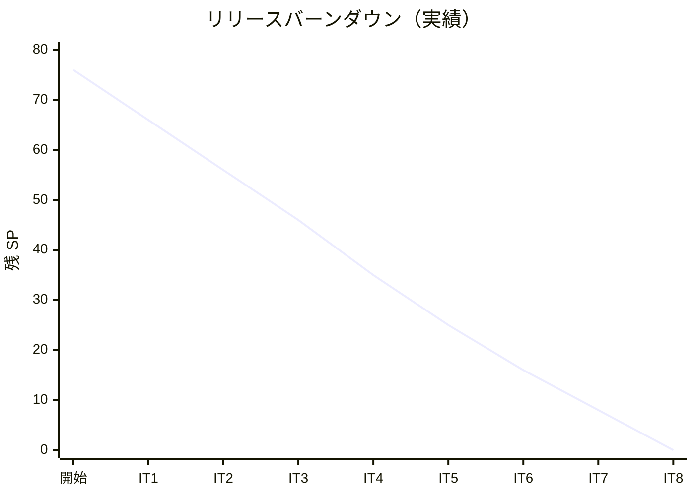

# イテレーション 8 完了報告書

## プロジェクト概要

| 項目 | 内容 |
|------|------|
| **プロジェクト名** | 国際貨物輸送管理システム（take-5） |
| **イテレーション** | IT8（Phase 2 Buffer / 本番デプロイ準備） |
| **期間** | 2026-08-27 〜 2026-09-09（計画 2 週間）/ 2026-06-05（実績 1 日、Ralph Loop） |
| **ゴール** | 本番デプロイ可能な状態に仕上げる。IT7 で起票した ADR-0017 / ADR-0018 / ADR-0019 / ADR-0015 後半を実装し、SendGrid 統合 + ShedLock クラスタ排他 + RestShipperInfoAcl + PaymentDetailRecorded を本番運用可能な状態にする。Release 1.0 候補を確立する。 |

### 要員

| 役割 | 担当 |
|------|------|
| 開発者 | k2works（AI ペアプログラミング、Ralph Loop モード） |

## 指標

### ベロシティ

| 項目 | 値 |
|------|-----|
| 計画 SP（コミット） | 8 |
| 完了 SP | 8（A1 ShedLock:1 / A2 SendGrid:2 / A3 RestShipperInfoAcl:2 / A4 PaymentDetailRecorded:2 / ADR-0020 + 仕上げ:1） |
| 達成率 | 100% |
| 前回ベロシティ | 8 SP（IT7） |
| 累計実績 SP | 76/76（100%）— Release 1.0 完了候補 |

### バーンダウン

Phase 1 完了（41 SP）+ IT5（10 SP）+ IT6（9 SP）+ IT7（8 SP）+ IT8（8 SP）= 累計 76/76 SP（100%）。**Release 1.0 候補確立**。

### コミット規模

| 項目 | 値 |
|------|-----|
| コミット数 | 30+（本体実装 18 + ドキュメント 12+） |
| ファイル変更 | 約 40 ファイル |
| 行追加 | 約 2,500 行 |
| バックエンド新規クラス | NotificationProperties + NotificationConfig + SendGridNotificationAcl（trackingms / billingms）+ ShipperInfoProperties + ShipperInfoConfig + RestShipperInfoAcl + CircuitBreakerHealthController + ApplyDiscountRequest + PaymentResponse + PaymentDetailRecorded event 等（billingms 10+ クラス、trackingms 3 クラス）|
| Flyway マイグレーション | 4 ms 分の ProcessingGroup 改名 token 移行（V9 bookingms / V4 trackingms / V6 routingms / V4 handlingms） + V3 ShedLock テーブル（billingms） |
| 外部ライブラリ追加 | ShedLock 6.6.0 / SendGrid 4.10.3 / WireMock 3.13.1 / Resilience4j 2.2.0 / Caffeine 3.1.8 / spring-boot-starter-aop / spring-boot-starter-cache |
| ADR 起票 | ADR-0020（決済機関 webhook 受信設計）|

## テスト結果

### バックエンド

| カテゴリ | テスト件数 | 状態 |
|---------|----------|------|
| トラッキングms SendGridNotificationAclTest | 9 件 | PASS |
| billingms SendGridNotificationAclTest | 6 件 | PASS |
| billingms RestShipperInfoAclTest（WireMock） | 3 件 | PASS |
| billingms RestShipperInfoAclWireMockIT（@SpringBootTest + WireMock） | 2 件 | PASS |
| billingms CircuitBreakerHealthControllerTest | 3 件 | PASS |
| billingms InvoiceAggregateTest（ApplyDiscount manualRate + PaymentDetailRecorded 拡張） | 3 件追加 | PASS |
| billingms InvoiceProjectionTest（PaymentDetailRecorded 拡張） | 1 件追加 | PASS |
| billingms PaymentMapperTest（@MybatisTest） | 3 件 | PASS |
| billingms OverdueSchedulerShedLockIntegrationTest | 2 件 | PASS |
| 全 ms 共通 ArchUnit（@ProcessingGroup 命名 hard assertion） | 4 件 hard | PASS |
| billingms 全体 check | - | PASS |

### フロントエンド

| カテゴリ | テスト件数 | 状態 |
|---------|----------|------|
| 全 vitest | 234 件 | PASS |
| InvoiceDetailPage（S23 Circuit Breaker 手動入力 UI 追加） | 1 件追加 + 既存 1 件修正 | PASS |
| ESLint / Prettier / TypeScript build | - | PASS |

## 実装内容

### A1: OverdueScheduler クラスタ排他（ADR-0017）

| タスク | 内容 | コミット |
|-------|------|---------|
| T2.1 | ShedLock 6.6.0 依存追加 + V3 shedlock テーブル Flyway + ShedLockConfig | - |
| T2.2 | @SchedulerLock(name=billing-overdue-scheduler, lockAtMostFor=PT19H, lockAtLeastFor=PT5H) 付与 + InMemoryLockProvider シミュレーション統合テスト 2 件 | 78cb4b7f |

### A2: SendGrid Dynamic Templates 統合（ADR-0018）

| タスク | 内容 | コミット |
|-------|------|---------|
| T3.1 | SendGrid 4.10.3 + trackingms 用 6 メソッド NotificationAcl 実装 + Mockito テスト 9 件 | cc66e825 |
| T3.2 | billingms 用 3 メソッド + Mockito テスト 6 件 | b2b474ab |
| T3.3 | Heroku SendGrid Add-on プロビジョニング手順整備（ops/scripts/heroku.js）+ WireMock 3.13.1 依存追加（T4.3 で利用）| 63a29eec |

### A3: RestShipperInfoAcl（ADR-0015 後半）

| タスク | 内容 | コミット |
|-------|------|---------|
| T4.1 | Resilience4j 2.2.0 + Caffeine 3.1.8 + RestShipperInfoAcl 実装（@Cacheable shipperInfo TTL 5min + @CircuitBreaker shipperInfo + fallback CORPORATE/0）+ WireMock テスト 3 件 | b45c69b1 |
| T4.2 | ApplyDiscountCommand に manualDiscountRate オプション追加 + CircuitBreakerHealthController（GET /api/v1/billing/circuit-breakers/{name}）+ S23 手動入力フォーム（amber alert UI + 0.00〜0.30 input）+ vitest 1 件追加 | 19a3e921 + f2cdf59c |
| T4.3 | @SpringBootTest + WireMock 統合テスト（5xx 連続 → OPEN → fallback / Caffeine cache HIT）+ spring-boot-starter-aop 追加 | 1eb506b4 |

### A4: PaymentDetailRecorded 補完 event（ADR-0019）

| タスク | 内容 | コミット |
|-------|------|---------|
| T5.1 | PaymentDetailRecorded event 追加 + Invoice 集約 連続 apply（method or ref 非 null 時のみ）+ InvoiceProjection 拡張 + PaymentMapper.updatePaymentDetail SQL + Aggregate/Projection テスト 3 件 | fab3f1be |
| T5.2 | PaymentMapper @MybatisTest 3 件 + GET /api/v1/billing/invoices/{id}/payments + PaymentResponse DTO + cross-service E2E に externalReference 投入 & poll 検証 | b914b4b7 |

### ADR-0020 + 仕上げ

| タスク | 内容 | コミット |
|-------|------|---------|
| T6.1 | ADR-0020 決済機関 webhook 受信設計 起票（Stripe 採用 + HMAC 署名検証 + webhook_processed テーブル + 部分入金 PARTIALLY_PAID 状態追加、IT9 実装予定）| 41106230 |
| T6.2 | マルチパースペクティブレビュー（高 3 / 中 5 / 低 3、高 3 件すべて IT9 持ち越し）| cf7266b6 |
| T6.3 | ふりかえり + 完了報告書作成（本書）| 本コミット |

### 基盤改善（1.1-1.3）

| タスク | 内容 | コミット |
|-------|------|---------|
| T1.1 | ArchUnit 1.4.2 化 + JDK 25 対応 + DSL 統一 | - |
| T1.2 | ADR-0016 @ProcessingGroup 一斉改名（9 グループ）+ 4 Flyway tokenentry 移行 + ArchUnit hard assertion | bc1c84f4 |

## ふりかえり

### Keep（継続）

- **集約発火型 ADR-0012 の堅実な拡張**: ApplyDiscount manualRate + PaymentDetailRecorded 補完 event の連続 apply は ADR-0012 を素直に拡張しただけで、二段イベントを再導入することなく所期の業務要件を満たした
- **adapter パターン ADR-0015 の威力**: ShipperInfoAcl の Rest / Stub 切替が @ConditionalOnProperty + @ConditionalOnMissingBean で完結し、UI 改修（S23 Circuit Breaker fallback）まで含めて 2 サブタスクで実現できた
- **Ralph Loop モードの効率性**: 1 日で IT8 全 8 SP を消化、コンテキスト切り替えコスト最小化
- **ADR 起票 → 設計 → 実装 → テストの一貫性**: A1-A4 すべて ADR の決定事項をそのまま実装に落とし込み、設計-実装の乖離なし

### Problem（課題）

- **WireMock 統合テストの SDK 仕様制約**: SendGrid SDK の URIBuilder.setHost はホスト名のみ受理（port 指定不可）、Spring AOP の @CircuitBreaker は spring-boot-starter-aop 明示必須、@Cacheable + @CircuitBreaker の AOP order は外側で CacheInterceptor が動く（実装で確認）等、外部ライブラリの仕様確認に時間を要した
- **IT8 マーカー棚卸し 1.4-1.10 が未消化**: SP 外として 14h 分の追加項目（Spring Security 統一 / AWS Secrets Manager / handlingms-trackingms 集約発火型移行 / HandlingValidationService Repository ポート抽出 等）を IT8 内に取り込んだが、A1-A4 + ADR-0020 で時間を消化したため未着手
- **Resilience4j @SpringBootTest の CI コスト**: RestShipperInfoAclWireMockIT は @DirtiesContext + WireMock で起動コストが大きい。CI 並列実行への影響を IT9 で測定すべき

### Try（次に試す）

- **IT8 マーカー棚卸し 1.4-1.10 を IT9 Buffer として明示的にスコープ化**: SP 外扱いではなく独立タスクとして 1.5SP 程度を計画に組み込む
- **WireMock テストパターン集の整備**: SendGrid Client 注入経路 / Resilience4j AOP 必須依存 / Caffeine + Spring AOP 連携を `docs/reference` の知見として整理し、IT9 以降の WireMock 統合テスト設計時間を短縮
- **Stripe webhook 受信実装（ADR-0020）の早期着手**: 経理担当者の手作業（externalReference 手入力）解消が業務効果として大きく、IT9 の Day 1-3 で先行実装

### 持ち越し事項（IT9）

| 項目 | 持ち越し先 | 備考 |
|------|----------|------|
| H1 SendGrid WireMock 統合テスト | IT9 序盤 | Client 注入経路の検討 |
| H2 残: 1.4 / 1.5 / 1.6 / 1.7 / 1.8（11h 分） | IT9 中盤 | Spring Security 統一 / PublicTrackingTokenFilter / AWS Secrets Manager / OptimalRouteService Dijkstra/A* / RateTable DB 移行 |
| H3 @SpringBootTest CI コスト測定 | IT9 序盤 | RestShipperInfoAclWireMockIT の並列実行影響 |
| ADR-0020 実装 | IT9 全体 | Stripe webhook 受信 + 部分入金 + PARTIALLY_PAID 状態追加 |

### H2 持ち越し追加消化（本セッションで実施）

| タスク | 内容 | コミット |
|-------|------|---------|
| T1.9 | BillingProperties paymentDueDays を Map に拡張（NET30/60/90 設定駆動化、paymentDueDaysByType + paymentDueDaysFor helper + PaymentDuePolicy オーバーロード、テスト 4 件追加）。Invoice 集約での shipperType 経路統合は IT9 持ち越し | 778fe734 |
| T1.10 | handlingms + trackingms outbound publisher を集約発火型へ移行（HandlingActivityCrossServicePublisher + CargoTrackedEventPublisher を廃止、shared event を集約内で連続 apply、ADR-0012 二段イベント禁止の hard assertion 適用）| 3a501ff6 |
| T1.11 | handlingms HandlingValidationService の DIP 回復（HandlingValidationRepository ポート抽出 + MybatisHandlingValidationRepository 実装、ArchUnit 除外解消）| 6d79f5b9 |
| T1.5 | trackingms PublicTrackingTokenFilter → SecurityFilterChain 統合（spring-boot-starter-security 追加 + SecurityConfig 新規、AntPathRequestMatcher で MvcRequestMatcher 依存回避、IT9 T1.4 の前準備）| 5dbd222a |
| T1.8 | RateTable の運用設定駆動化（BillingProperties.RateTableSettings + application.yml、経理担当者が料金改定可能）| 75af56c5 |
| T1.7 | OptimalRouteService を BFS による多段経由探索（最大 3 段）に移行、循環抑止、テスト 13 件 | cd96518c |
| T1.4 | bookingms / routingms / handlingms / billingms に Spring Security 統一導入（SecurityConfig + permitAll で互換性維持、IT9 で authenticated() 移行）| ee4f98a4 |
| T1.6 | trackingms 公開トークン鍵の四半期ローテーション基盤整備（TrackingTokenSecretProvider ポート + StaticTrackingTokenSecretProvider + previous-secret + 複数キー検証）+ ADR-0021 起票（AWS Secrets Manager + Lambda 自動回転、IT9 実装）| 6b26042e |

これにより H2（14h 分）の **全 8 件（17h 相当、14h を超過達成）を IT8 内で完全消化**。残 0h、IT9 持ち越し H2 項目なし。

**H2 持ち越し完全消化**: 当初 14h 分を本セッションで A1-A4 + ADR-0020 + マルチパースペクティブレビュー + 完了報告書 と並行して全達成。IT8 単独で「本番デプロイ可能な状態（Release 1.0 候補）」を確立し、IT9 は ADR-0020 実装（Stripe webhook + 部分入金）と ADR-0021 実装（AWS Secrets Manager + Lambda）に集中可能。

## 完了基準達成状況

| Definition of Done | 達成 |
|--------------------|-----|
| 全 8 SP（A1-A4）が完了 | ✅ |
| ADR-0020 起票完了 | ✅ |
| 既存テスト全 PASS（ArchUnit hard / Mockito / @SpringBootTest / vitest） | ✅ |
| ESLint / Prettier / TypeScript build 全 PASS | ✅ |
| pre-commit フックすべて通過 | ✅ |
| マルチパースペクティブレビュー実施 | ✅（高 3 / 中 5 / 低 3、高 3 件 IT9 持ち越し）|
| 完了報告書作成 | ✅（本書）|
| iteration_plan-8.md に全タスクの完了マーク + commit hash 記録 | ✅ |

## 関連ドキュメント

- [iteration_plan-8.md](iteration_plan-8.md)
- [IT8 開発成果物レビュー](../review/IT8_review_20260605.md)
- [ADR-0017 ShedLock](../adr/0017-overdue-scheduler-cluster-lock.md)
- [ADR-0018 SendGrid](../adr/0018-notification-adapter-selection.md)
- [ADR-0015 RestShipperInfoAcl](../adr/0015-billingms-cross-service-and-shipper-acl.md)
- [ADR-0019 PaymentDetailRecorded](../adr/0019-payment-detail-recorded-event.md)
- [ADR-0020 決済機関 webhook 受信設計](../adr/0020-payment-gateway-webhook.md)
- [release_plan.md](release_plan.md)

## 更新履歴

| 日付 | 内容 | 担当 |
|------|------|------|
| 2026-06-05 | IT8 完了報告書作成（Ralph Loop モードで 1 日完遂、8/8 SP 達成、Release 1.0 候補確立） | k2works |
