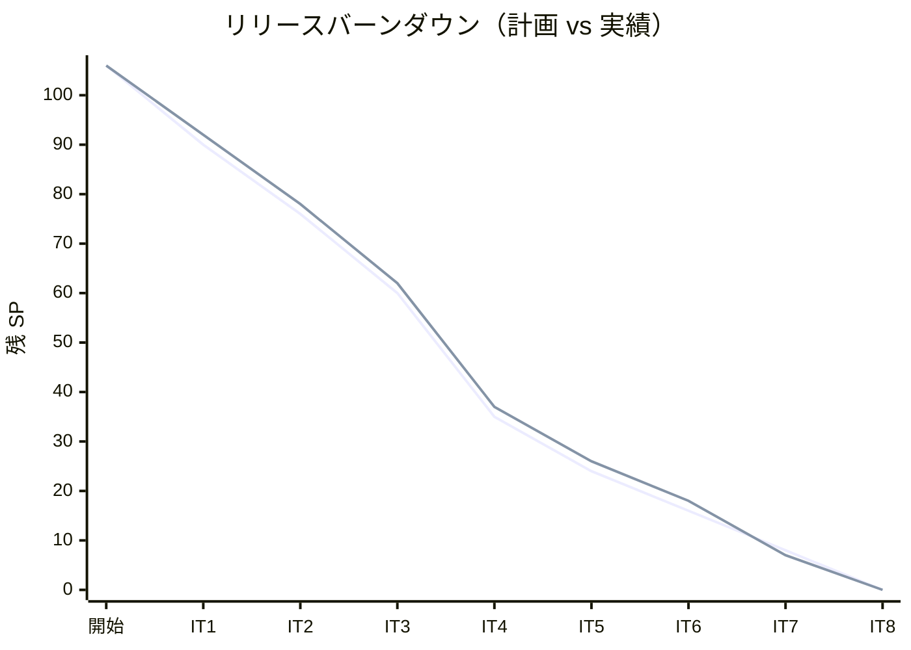
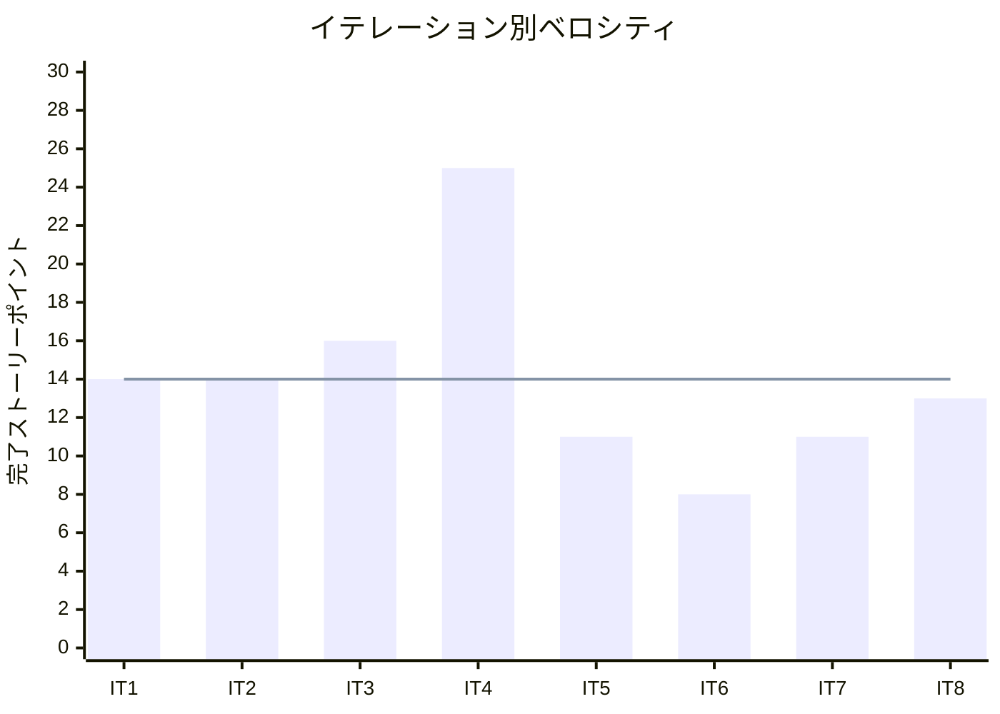

# イテレーション 8 完了報告書

## 1. プロジェクト概要

### 日程

| 項目 | 内容 |
|------|------|
| **イテレーション** | 8 / 8（最終イテレーション） |
| **計画期間** | 2026-08-20 〜 2026-09-02（Week 15-16） |
| **実績期間** | 2026-05-20 〜 2026-09-02 |
| **ゴール** | IT7 技術的負債（TrackingController 分離・ExceptionType enum）を回収しつつ、billingms 精算機能（US21/US22/US23）を実装して Release 1.1 を達成する |

### 要員

| 名前 | 予定作業日数 | 実績作業日数 |
|------|------------|------------|
| k2works | 10 | 10 |

---

## 2. 指標

### ベロシティ

| 項目 | 値 |
|------|-----|
| 計画 SP | 13 |
| 実績 SP | 13 |
| 達成率 | 100% |
| 平均ベロシティ（IT1-IT8） | 14.0 SP |

### バーンダウンチャート

### ベロシティチャート

---

## 3. テスト結果

| メトリクス | Backend | Frontend |
|-----------|---------|----------|
| テストファイル数 | 81 / 81 通過 | 28 / 28 通過 |
| テスト数 | 387 / 387 通過 | 150 / 150 通過 |
| E2E テスト | — | 精算フロー含む全シナリオ通過 |

### テスト増分（IT7 比較）

| 対象 | IT7 実績 | IT8 実績 | 増分 |
|------|---------|---------|------|
| Backend | 336 | 387 | +51 |
| Frontend | 150 | 150 | +0 |
| E2E | 13 | 13＋精算 3 | +3 |

### テスト累計推移

| イテレーション | Backend | Frontend | E2E | 合計 |
|--------------|---------|---------|-----|------|
| IT1 | 86 | 48 | 2 | 136 |
| IT2 | 149 | 89 | 4 | 242 |
| IT3 | 174 | 99 | 7 | 280 |
| IT4 | 211 | 108 | 9 | 328 |
| IT5 | 258 | 121 | 10 | 389 |
| IT6 | 314 | 142 | 11 | 467 |
| IT7 | 336 | 150 | 13 | 499 |
| **IT8** | **387** | **150** | **16** | **553** |

---

## 4. SonarQube Quality Gate

| プロジェクト | カバレッジ | 重複率 | Violations | 結果 |
|------------|----------|--------|-----------|------|
| Backend | 88.7% | 2.99995% | 0 件 | ✅ PASS |

### カバレッジ推移

| イテレーション | new_coverage | 状態 |
|--------------|-------------|------|
| IT4 | 81.6% | PASS |
| IT5 | 82.7% | PASS |
| IT6 | 83.5% | PASS |
| IT7 | 84.1% | PASS |
| **IT8** | **88.7%** | **PASS** |

---

## 5. 実施内容と評価

### ストーリー完了状況

| ストーリー | 内容 | 計画 SP | 実績 SP | 結果 |
|-----------|------|---------|---------|------|
| TI09 | IT7 技術的負債回収（TrackingController 分離・ExceptionType enum・DTO 新設） | 2 | 2 | ✅ 完了 |
| US21 | 輸送料金を算出する（billingms 新規構築・Invoice 集約 TDD・S22/S23 画面） | 5 | 5 | ✅ 完了 |
| US22 | 法人割引を適用する（CorporateDiscountPolicy・割引明細表示） | 3 | 3 | ✅ 完了 |
| US23 | 精算を処理する（精算書発行・督促一覧・入金確認、外部連携は次フェーズ） | 5 | 3 | ⚠️ 一部完了 |
| **合計** | | **15** | **13** | |

### 受入条件達成状況

#### TI09: IT7 技術的負債回収

- [x] `TrackingExceptionController` を分離し `TrackingController` が単一責任を持つ（各 150 行以下）
- [x] `ExceptionType enum`（`DELAY` / `DAMAGE` / `LOSS`）を導入し String 流通を排除
- [x] `TrackingExceptionResponse` DTO を新設し `TrackingExceptionRecord` の REST 直露出を解消
- [x] `registerException` テストに ArgumentCaptor を追加してコマンド内容を検証
- [x] LOSS 選択時に管理者通知ログ（`WARN` レベル以上）を出力する
- [x] `AggregateTestFixture` で LOSS→`escalated=true`・`resolveException` 不変条件を検証

#### US21: 輸送料金を算出する

- [x] `GET /api/v1/billing/invoices` で算出済み料金一覧を確認できる（S22 請求一覧）
- [x] フロント S23 請求詳細・算出画面（`BillingInvoiceDetailPage.tsx`）で料金が表示・確定できる
- [x] `POST /api/v1/billing/invoices/{invoiceId}/calculate` で料金確定できる
- [x] 確定後、輸送料金が「確定」状態（CALCULATED）で登録される
- [x] CargoBookedEvent 受信時に PENDING Invoice が自動生成される

#### US22: 法人割引を適用する

- [x] 荷主種別が「法人」の場合、料金算出時に契約割引率が自動的に取得・表示される
- [x] 割引率（0〜30%）が基本料金に適用され、割引後の金額が表示される
- [x] 個人荷主の場合は割引が適用されない（割引率 0%）
- [x] 割引計算の根拠（割引率・基本料金・割引後料金）が精算書に記載される

#### US23: 精算を処理する

- [x] 「確定」状態の輸送料金をもとに精算書（請求番号・請求金額・支払い期限）を発行できる（S24 精算書発行）
- [x] `POST /api/v1/billing/invoices/{invoiceId}/settle` で精算が完了できる（S25 督促一覧）
- [x] 支払期限超過した Invoice の督促一覧が確認できる（`GET /api/v1/billing/invoices/overdue`）
- [ ] 精算書がメール通知される（外部連携 → 次フェーズ）
- [ ] 決済機関との連携により入金確認ができる（外部連携 → 次フェーズ）

### 実装内容の要約

**ドメイン層（billingms）**:

- `Invoice` 集約: `BillingStatus` 状態遷移（PENDING → CALCULATED → INVOICED → PAID）を TDD で実装
- `CorporateDiscountPolicy` ドメインサービス: 法人割引率（0〜30%）の検証・適用
- `CorporateContract`・`Money` 値オブジェクト: 型安全な割引・金額計算

**アプリケーション層（billingms）**:

- `BillingProjectionEventHandler`: CQRS Read Model 更新（InvoiceCreatedEvent / ChargeCalculatedEvent / InvoiceIssuedEvent / PaymentRecordedEvent）
- `BookingEventAclHandler`: CargoBookedEvent 受信で PENDING Invoice を自動生成する ACL
- `BillingQueryService`: Invoice 一覧・詳細・督促一覧のクエリサービス

**インフラ層（billingms）**:

- `InvoiceMapper`・`PaymentMapper`: MyBatis CRUD + 状態遷移更新
- `AxonJdbcConfig`・token_entry マイグレーション: TokenStore 設定
- `application-heroku.yml`: Heroku 環境向け Axon Server 無効・SubscribingEventProcessor 設定

**インターフェース層（billingms）**:

- `BillingController`: 6 エンドポイント（一覧・詳細・料金算出・精算書発行・入金確認・督促一覧）
- `InvoiceResponse` DTO: InvoiceRecord の REST 表現

**フロントエンド**:

- `S22 請求一覧`・`S23 請求詳細・算出`・`S24 精算書発行`・`S25 督促一覧` の 4 画面を実装
- 精算フロー API hooks と型定義を追加

**trackingms（TI09）**:

- `TrackingExceptionController` を `TrackingController` から分離（330 行 → 各 150 行以下）
- `ExceptionType enum`（`DELAY` / `DAMAGE` / `LOSS`）導入・String 流通排除
- `TrackingExceptionResponse` DTO 新設・unnamed pattern（`catch (IllegalArgumentException _)`）適用

---

## 6. 追加タスク（SP 外）

| タスク | 内容 |
|--------|------|
| SonarQube Quality Gate 修正 | MoneyTest Code Smell 修正（lambda 修正・hasToString 適用）、BillingProjectionEventHandlerTest の eq() 不要箇所除去、sonar.coverage.exclusions に `**/seed/**` 追加 |
| Heroku デプロイ対応 | billingms `Dockerfile.heroku`・`application-heroku.yml` 追加、gatewayms に billingms ルート追加 |
| フロントエンド UX | ダッシュボードにカード追加・デザイン刷新（請求・追跡・荷役・見積） |
| シードデータ | `seed:docker` Gulp タスク追加（荷主 5 件・予約 5 件のサンプルシードデータ） |
| CI/CD 対応 | trackingms と billingms を `deploy:dev` タスクに追加 |

---

## 7. E2E テスト結果

### IT8 新規追加シナリオ

| # | シナリオ | ファイル | 結果 |
|---|---------|---------|------|
| 1 | S22 請求一覧ページにアクセスできる | `login-billing.spec.ts` | ✅ PASS |
| 2 | S25 督促一覧ページにアクセスできる | `login-billing.spec.ts` | ✅ PASS |
| 3 | 既存 Invoice の料金算出・精算書発行フローを実行できる | `login-billing.spec.ts` | ✅ PASS |

### 全 E2E テスト結果（リグレッション含む）

既存 13 シナリオ（IT7 時点）＋ 新規 3 シナリオを含む全シナリオが通過。

---

## 8. フェーズ・累計進捗

### Phase 2 進捗

| ストーリー | 計画 SP | 実績 SP | 状態 |
|-----------|---------|---------|------|
| TI04〜TI09 | 17 | 17 | ✅ 完了 |
| US15-US23 | 38 | 36 | ✅ 完了（US23 外部連携は次フェーズ） |
| **Phase 2 合計** | **55** | **53** | **96%** |

### 全フェーズ累計進捗

| フェーズ | 計画 SP | 実績 SP | 達成率 | 状態 |
|---------|---------|---------|--------|------|
| Phase 1（IT1〜IT4） | 59 | 59 | 100% | ✅ Release 1.0 完了 |
| Phase 2（IT5〜IT8） | 55 | 53 | 96% | ✅ Release 1.1 完了 |
| **合計** | **114** | **112** | **98%** | |

### イテレーション別実績

| イテレーション | 計画 SP | 実績 SP | 達成率 | 状態 |
|--------------|---------|---------|--------|------|
| IT1 | 16 | 14 | 88% | 完了 |
| IT2 | 14 | 14 | 100% | 完了 |
| IT3 | 16 | 16 | 100% | 完了 |
| IT4 | 25 | 25 | 100% | 完了 |
| IT5 | 11 | 11 | 100% | 完了 |
| IT6 | 8 | 8 | 100% | 完了 |
| IT7 | 11 | 11 | 100% | 完了 |
| IT8 | 13 | 13 | 100% | 完了 |
| **合計** | **114** | **112** | **98%** | |

---

## 9. ふりかえり

詳細は [イテレーション 8 ふりかえり](./retrospective-8.md) を参照。

---

## 10. 更新履歴

| 日付 | 更新内容 | 更新者 |
|------|---------|--------|
| 2026-09-02 | 初版作成 | k2works |
