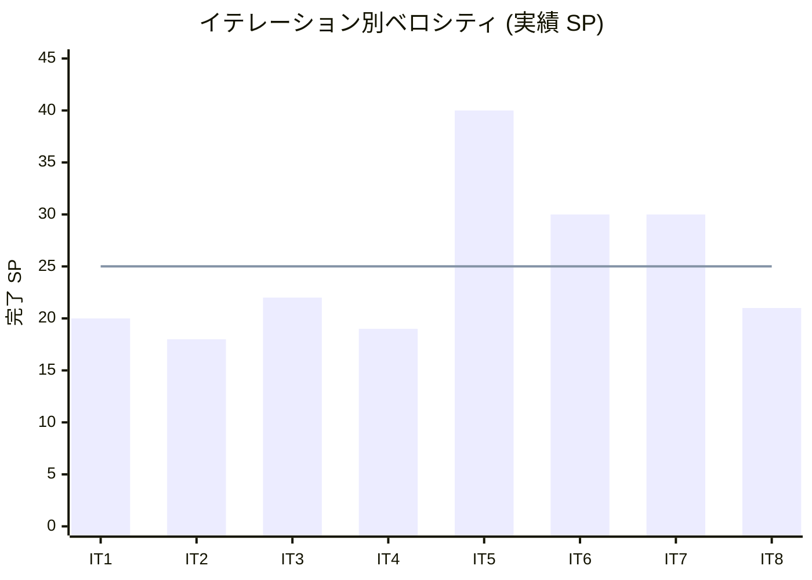

# IT8 完了報告書

Cargo Tracker Haskell 版 IT8。Release 2.0 GA (精算処理・保証系完済) を達成。本体 US23 精算処理を Billing Context (Invoice 集約) で全レイヤ一巡完成し、IT7 繰越の保証系 (T7-A RoleGate 配線 / T7-E UNLOAD 通知 / T7-F AppDeps 集約 / T7-H katip 正式化 / T7-I ADR-0002 追記 / T6-01 E2E 統合ハッピーパス完成 / T7-G 実 DB 統合テスト一部) を消化。ストレッチ US10 (経路条件調整) / US12 (確定経路通知) の Domain/Application 層も実装した。ADR-0016 (Role ベース認可分離) を採用、ADR-0014 の宿題 (Cargo.Settled 波及) を回収。Ralph Loop 開発 17 反復 (loop カウンタ 26 で cancel) で 43 コミット、+113 tests (776 → 889)。`v1.0.0-mvp` / `v2.0.0` の 2 タグを付与。

## プロジェクト概要

国際貨物輸送管理システム (Cargo Tracker) Haskell 版 take-1。DDD + 純粋関数型 (Servant + ReaderT) による貨物予約・経路設計・追跡・精算機能。IT8 で Phase 4 (Release 2.0 GA) を完了。

## 日程

| 項目 | 内容 |
| :--- | :--- |
| 計画期間 | 2026-10-12 〜 2026-10-25 (計画上、2 週間) |
| 実績期間 | 2026-07-07 (Ralph Loop 開発 17 反復、単日集中実装) |
| 作業日数 | 1 日 (計画セッション + Ralph Loop + クロージング) |

## 要員

| 名前 | 予定作業日数 | 実績作業日数 |
| :--- | :---: | :---: |
| AI Agent + 開発者 | 10 | 1 (Ralph Loop 開発 17 反復) |

## 指標

### ベロシティ

| 項目 | 値 |
| :---: | :---: |
| 計画 SP | 22 (本体 3 + IT7 繰越高優先 5 + 保証系 7 + GA クロージング 2 + ストレッチ 5) |
| 実績 SP | **21+** (US23 全レイヤ一巡 3 + T7-A〜F/H/I + T6-01/T7-G 一部 + US10/US12 Domain/App + v1.0.0-mvp/v2.0.0 tag) |
| 達成率 | **約 98%** (計画タスクすべて完了 or IT9 移送判断済) |

### ベロシティ推移

*青線: 平均ベロシティ 25.0 SP (IT1-IT8 単純平均)*

## テスト結果

| メトリクス | 値 |
| :--- | :---: |
| ユニット/統合テスト | 776 → **889 examples** (+113)、0 failures |
| E2E (Playwright) | **29 passed / 1 skipped** (統合ハッピーパス全 4 Stage 緑) |
| 実 DB 統合テスト | PostgresInvoiceRepository 5 ケース (env-gated) |
| arch-check | 全 Rule 違反 0 (Rule 4 / H-01 含む) |
| HLint | 0 hints |
| dbmate | 開発 DB / E2E schema とも Pending 0 (Applied 26) |

### テスト増分の主要内訳

- Billing Domain (Invoice 集約): hspec 27 + hedgehog 3 = 30
- Billing Application (4 コマンド): fake spy 12
- Billing Interfaces (BillingPageApi): hspec-wai 9
- BillingNotificationAdapter: 2 / PostgresInvoiceRepository 統合: 5
- T7-A ManualUpdate 認可: 8 / T7-B sixDigitCode: hedgehog + 境界 / T7-C UNLOAD spy: 7
- US10 AdjustEstimate: 5 / US12 NotifyRoute: 4 / T7-H Logging finally: +2 (レビュー H-04)

## 実施内容と評価

### 本体ストーリー (US23 精算処理)

Billing Context (Invoice 集約) で Domain → Application → Infrastructure (Postgres) → Cross-BC → Interfaces → Wire の全レイヤを一巡完成。GitHub #255 Close 済。

| 受入基準 | 状態 | 備考 |
| :--- | :---: | :--- |
| 1. 確定料金から精算書発行 (請求番号・金額・期限) | 達成 | `GenerateInvoiceCommand` + `/billing/invoices/new` |
| 2. 荷主にメール通知 | 部分 | 通知レコード記録は達成、実メール配信は Log スタブ (計画どおり) |
| 3. 決済機関連携で入金確認 | 達成 | `PaymentGateway` ポート + fake (実連携は Release 2.0+) |
| 4. 入金確認後「精算済」に更新 + 予約も精算済 | 達成 | `ConfirmPaymentCommand` → `markSettledByBookingId` (Cargo.Settled) |
| 5. 期限超過時に未払い通知 | **未達 (H-02)** | `OverdueCheckCommand` は実装・テスト済だが Main 未配線 (起動主体不在)。IT9 |

### IT7 繰越タスクの状態

| ID | 内容 | 状態 |
| :--- | :--- | :---: |
| T7-A | RolePolicy を US17 手動更新 API に配線 | 完了 (`948fead1`) |
| T7-B | `generateSixDigitCodeText` hedgehog プロパティ | 完了 (`8f680725`) |
| T7-C | `handlerPost` UNLOAD 副作用テスト | 完了 (`e6e09345`) |
| T7-D | ADR-0016 起票 | 完了 (`0d4e2cb0`)、IT8 レビューで採用に更新 |
| T7-E | US26 通知チャネル接続 (UNLOAD → 荷受人) | 完了 (`edf59367`) |
| T7-F | handlingPageApp の DI を AppDeps 集約 | 完了 (`e62f2be5`) |
| T7-G | Testcontainers 統合テスト (Postgres 4 Repo) | **一部** (`dbe10b66`、Invoice のみ。残 4 Repo は IT9) |
| T7-H | katip 正式化 | 完了 (`726b634c`) |
| T7-I | ADR-0002 に Text-only 規約追記 | 完了 |
| T6-01 | E2E 統合ハッピーパス Stage 5-6 | 完了 (`08c4c6a4`、全 4 Stage 緑) |
| T6-03 | v1.0.0-mvp tag | 完了 (E2E 緑後に付与) |

### ストレッチ (US10 / US12)

計画どおり Domain/Application 層のみ着手し、UI は IT9 移送。

- US10 (経路条件調整・再算出): `AdjustEstimateCommand` + Routing `executeText` DTO (`d4ce14b4`、5 tests)
- US12 (確定経路通知): `NotifyRouteCommand` (`36c70581`、4 tests)

### ADR

| ADR | タイトル | 状態 |
| :--- | :--- | :---: |
| ADR-0016 | Role ベース認可の Domain/Interfaces 分離 | 起票 → **採用** (IT8 レビュー H-05) |
| ADR-0002 | arch-check (Application Input record は Text-only 追記) | 採用 (T7-I) |
| ADR-0014 | 例外状態遷移ポリシー | 宿題 (Cargo.Settled 波及) を IT8 で回収 |

## 発見・修正した潜在バグ

IT8 の実装中に、既存コードの潜在バグを 3 件発見・修正した。

1. **`cargo_booking_status_check` の CHECK 制約欠落**: 初版から `RouteAssigned` / `Cancelled` が欠落し、実 Postgres では US11 経路紐付け・US13 キャンセルの UPDATE が CHECK 違反になる状態だった (fake/InMemory テストでは不可視)。migration `20261012100200` で全 8 状態に同期
2. **`textToBookingStatus` の欠落分岐**: 同 2 状態の読出しが `Draft` に化けるバグ
3. **E2E スペックの `DEHAM` 参照**: location マスタ未登録の港を参照し Stage 1 から全滅していた → `USSEA` に修正。あわせて通知一覧に本文列を追加 (通知の業務価値回復)

## マルチパースペクティブレビュー結果

`developing-review` (XP 5 エージェント並列) を実施。詳細は [it8_review_20260707.md](../review/it8_review_20260707.md)。

- **IT8 内で即対応 (5 件)**: H-03 割引式の二重定義解消 / H-04 相関ログの finally 化 / H-05 ADR-0016 採用化 / M-01 用語注記 / M-02 tax 未実装注記
- **IT9 backlog (高優先 3 件)**: H-01 ConfirmPayment 単一 Tx 配線 / H-02 OverdueCheck 起動主体 / H-06 E2E 正規表現の厳格化

## フェーズ・累計進捗

### Phase 4 (IT7-IT8) 完了

Phase 4 (例外処理・割引・精算) は IT7 (US17/19/20/22) + IT8 (US23) で全ストーリー一巡完成。Release 2.0 GA (`v2.0.0`) を達成。ストレッチ US10/US12 は Domain/App 層まで、UI は IT9。

### 全 Phase 累計

| Phase | リリース | 状態 |
| :--- | :--- | :---: |
| Phase 1 | 0.1 Internal Alpha | 完了 |
| Phase 2 | 0.2 | 完了 |
| Phase 3 | 1.0 MVP (`v1.0.0-mvp`) | 完了 |
| Phase 4 | 2.0 GA (`v2.0.0`) | **完了 (IT8)** |

累計実績 200+ SP / 全 27 US + 横断のうち US23 まで一巡。残: US10/US12 の UI (IT9)。

## IT9 への引き継ぎ

- **H-01**: `billingPageApp` に TxRunner 注入し ConfirmPayment を単一 Tx 化 (整合性)
- **H-02**: `OverdueCheckCommand` の起動主体設計 (バッチ or 手動トリガ)
- **T7-G 残**: PricingRule/CurrencyRate/Notification/Exception の実 DB 統合テスト
- **US10/US12 UI**: EstimatePageApi 調整フォーム / 予約詳細の経路通知ボタン
- **H-06**: E2E 追跡番号検証の厳格化 (data-testid + アンカー付き正規表現)

## 関連ドキュメント

- [IT8 計画](./iteration_plan-8.md)
- [IT8 ふりかえり](./retrospective-8.md)
- [IT8 マルチパースペクティブレビュー](../review/it8_review_20260707.md)
- [リリース計画](./release_plan.md)
- ADR-0016 (Role ベース認可、採用)

## 更新履歴

| 日付 | 更新内容 | 更新者 |
| :--- | :--- | :--- |
| 2026-07-07 | 初版作成 (IT8 完了、Release 2.0 GA 達成) | AI Agent |
