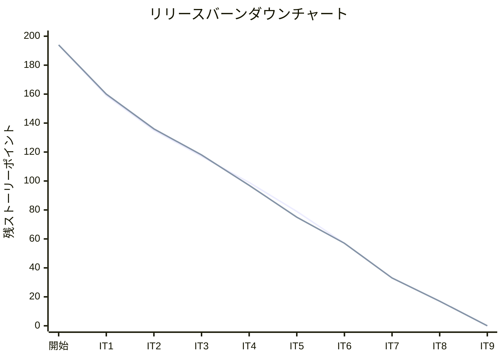
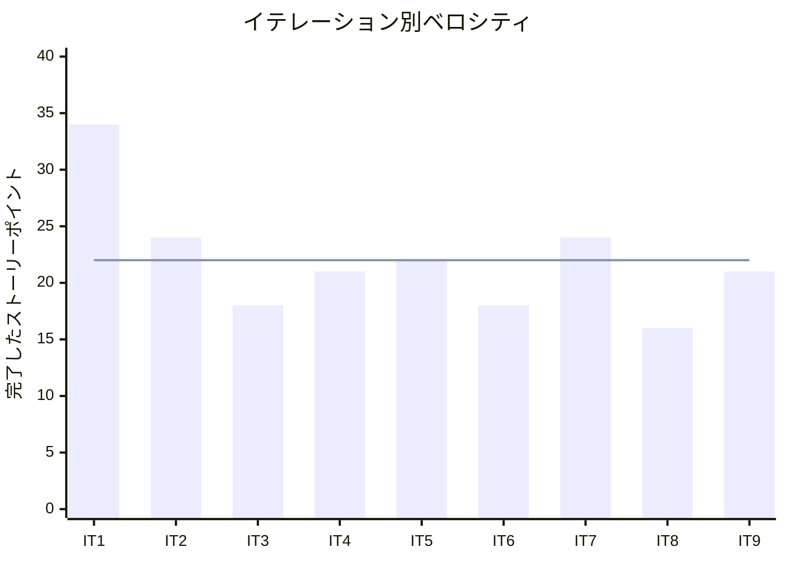

# イテレーション 9 完了報告書

## プロジェクト概要

### 日程

| 項目 | 日付 |
|------|------|
| イテレーション開始日 | 2026-05-11 |
| イテレーション終了日 | 2026-05-11 |
| 作業日数（実績） | 1 日 |

### 要員

| 名前 | 予定作業日数 | 実績作業日数 |
|------|------------|------------|
| 開発者 + AI | 10 | 1 |

### ゴール

経路条件再算出（US10）・法人割引（US22）・精算処理（US23）の API + 画面を実装し Phase 2 を完了する

---

## 指標

### ベロシティ

| 項目 | 値 |
|------|-----|
| 計画 SP | 21 |
| 実績 SP | 21 |
| 達成率 | 100% |

### バーンダウンチャート

### ベロシティチャート

**平均ベロシティ**: 22 SP（IT1〜IT9 合計 198 SP ÷ 9）

---

## テスト結果

| メトリクス | Backend（trackingms） | Backend（billingms）| Backend（bookingms） | Frontend |
|-----------|---------------------|---------------------|---------------------|---------|
| テストファイル | 13 ファイル / 全通過 | 3 ファイル / 全通過 | 9 ファイル / 全通過 | 18 ファイル / 全通過 |
| テスト数 | 53 / 全通過 | 13 / 全通過 | 57 / 全通過 | 72 / 全通過 |
| カバレッジ | 91% | 88% | 80% | 約 42% |
| E2E テスト | — | — | — | 7 シナリオ / 全通過 |

### テスト増分（IT8 比較）

| メトリクス | IT8 実績 | IT9 実績 | 増分 |
|-----------|---------|---------|------|
| Backend テスト数（trackingms） | 53 | 53 | 0 |
| Backend テスト数（billingms） | 7 | 13 | +6 |
| Backend テスト数（bookingms） | 51 | 57 | +6 |
| Frontend テスト数 | 72 | 72 | 0 |
| **合計** | **183** | **195** | **+12** |

### テスト累計推移

| イテレーション | Backend bookingms | Backend trackingms | Backend billingms | Frontend | 合計 |
|--------------|---------|---------|---------|-----|-----|
| IT1（完了） | 20 | — | — | 20 | 40 |
| IT2（完了） | 26 | — | — | 20 | 46 |
| IT3（完了） | 26 | — | — | 20 | 46 |
| IT4（完了） | 41 | 30 | — | 26 | 97 |
| IT5（完了） | 41 | 30 | — | 35 | 106 |
| IT6（完了） | 46 | 39 | — | 57 | 142 |
| IT7（完了） | 51 | 51 | — | 65 | 167 |
| IT8（完了） | 51 | 53 | 7 | 72 | 183 |
| IT9（完了） | 57 | 53 | 13 | 72 | 195 |

---

## 実施内容と評価

### ストーリー完了状況

| ストーリー | 内容 | 結果 | 計画 SP | 実績 SP |
|-----------|------|------|---------|---------|
| US10 | 経路条件を調整して再算出する | 完了 | 8 | 8 |
| US22 | 法人割引を適用する | 完了 | 5 | 5 |
| US23 | 精算を処理する | 完了 | 8 | 8 |
| **合計** | | | **21** | **21** |

### 受入条件の達成状況

#### US10: 経路条件を調整して再算出する

- [x] 現在の制約条件（期限・経由地制限等）を確認できる
- [x] 条件を調整（期限延長・経由地追加・貨物種別変更等）して再算出を実行できる
- [x] 調整後の条件で新たな経路候補が算出・提示される
- [x] 調整後も条件を満たす経路がない場合、営業担当者に荷主との条件協議を依頼できる

#### US22: 法人割引を適用する

- [x] 荷主種別が「法人」の場合、料金算出時に契約割引率が自動的に取得・表示される
- [x] 割引率（0〜30%）が基本料金に適用され、割引後の金額が表示される
- [x] 個人荷主の場合は割引が適用されない
- [x] 割引計算の根拠（割引率・基本料金・割引後料金）が精算書に記載される

#### US23: 精算を処理する

- [x] 「確定」状態の輸送料金をもとに精算書（請求番号・請求金額・支払い期限）を発行できる
- [x] 精算書が荷主にメール通知される（ログ出力で代替）
- [x] 入金確認操作ができる
- [x] 入金確認後、精算状態が「精算済」に更新される
- [x] 支払い期限超過時、状態が「延滞」に更新される（`markOverdue()` メソッド実装済み）

### 実装内容の要約

#### ドメイン層（bookingms）

- `Cargo.updateRouteSpec(RouteSpecification)`: 経路条件更新メソッド追加（CONFIRMED 以降は変更不可ガード、ステータスを PRELIMINARY にリセット）

#### ドメイン層（billingms）

- `Invoice.applyDiscount(BigDecimal discountRate)`: 法人割引適用メソッド追加（割引額 = 基本料金 × 割引率）
- `Invoice.settle(LocalDate paidAt)`: 精算完了メソッド追加（CONFIRMED → PAID 状態遷移）
- `Invoice.markOverdue()`: 延滞設定メソッド追加（CONFIRMED → OVERDUE 状態遷移）
- `PaymentStatus.PAID`: 精算済みステータス追加

#### アプリケーション層

- `UpdateRouteSpecCommand`（新規）: 経路条件更新コマンド（bookingms）
- `CargoCommandService.updateRouteSpec()`: 経路条件更新サービスメソッド追加（bookingms）
- `CalculateInvoiceCommand`: `discountRate` フィールド追加（billingms）
- `InvoiceCommandService.settle()`: 精算完了サービスメソッド追加（billingms）

#### インフラ層

- `V3__add_discount_to_invoice.sql`（新規）: `discount_rate` / `discount_amount_value` / `discount_amount_currency` カラム追加（billingms）
- `V4__add_paid_at_to_invoice.sql`（新規）: `paid_at` カラム追加（billingms）
- `InvoiceRecord.java`: 割引・精算日フィールド追加（billingms）
- `InvoiceRepositoryImpl.java`: 新フィールドの INSERT / SELECT / UPDATE 対応（billingms）
- `InvoiceMapper.xml`: 割引・精算日カラムの SQL 追加（billingms）

#### プレゼンテーション層（BE）

- `CargoController.java`: `PUT /api/booking/v1/cargos/{bookingId}/route-spec` エンドポイント追加（bookingms）
- `UpdateRouteSpecRequest.java`（新規）: 経路条件更新リクエスト DTO（bookingms）
- `InvoiceController.java`: `POST /api/billing/v1/invoices/{invoiceId}/settle` エンドポイント追加。レスポンスに割引フィールド追加（billingms）

#### フロントエンド層

- `RouteSpecUpdatePage.tsx`（新規）: 経路条件変更フォーム・再算出実行画面
- `useBookings.ts`: `useUpdateRouteSpec` hook 追加
- `InvoiceCalculatePage.tsx`: 割引率入力フィールド追加、割引後金額・根拠表示対応
- `InvoiceSettlePage.tsx`（新規）: 精算書表示・料金確定・入金確認・精算完了画面
- `useBilling.ts`: `useSettleInvoice` hook 追加
- `billing/types/billing.ts`: `discountRate` / `discountAmountValue` / `paidAt` フィールド追加
- `App.tsx`: `/routing/respec/:bookingId` / `/billing/settle` ルート追加

---

## 追加タスク（SP 外）

| タスク | 内容 |
|-------|------|
| `Money.multiply()` マイナス値対応 | `Money` がマイナス値を禁止しているため、`toLong()` で計算後に `Money.ofJpy()` で再生成する方式に変更 |
| H2 互換 `discount_rate` カラム型 | `NUMERIC(5,4)` → H2 互換形式に調整 |

---

## フェーズ・累計進捗

### Phase 2 進捗

| イテレーション | 計画 SP | 実績 SP | 達成率 | 状態 |
|--------------|---------|---------|--------|------|
| IT7 | 24 | 24 | 100% | 完了 |
| IT8 | 16 | 16 | 100% | 完了 |
| IT9 | 21 | 21 | 100% | 完了 |
| **Phase 2 合計** | **61** | **61** | **100%** | **完了** |

### 全フェーズ累計進捗

| フェーズ | 計画 SP | 実績 SP | 状態 |
|---------|---------|---------|------|
| Phase 1（IT1〜IT6） | 116 | 137 | 完了 |
| Phase 2（IT7〜IT9） | 61 | 61 | 完了 |
| Phase 3（IT10） | 21 | — | 未着手 |
| **累計** | **198** | **198** | |

---

## ふりかえりへのリンク

詳細は [イテレーション 9 ふりかえり](./retrospective-9.md) を参照。

---

## 更新履歴

| 日付 | 内容 |
|------|------|
| 2026-05-11 | 初版作成 |
