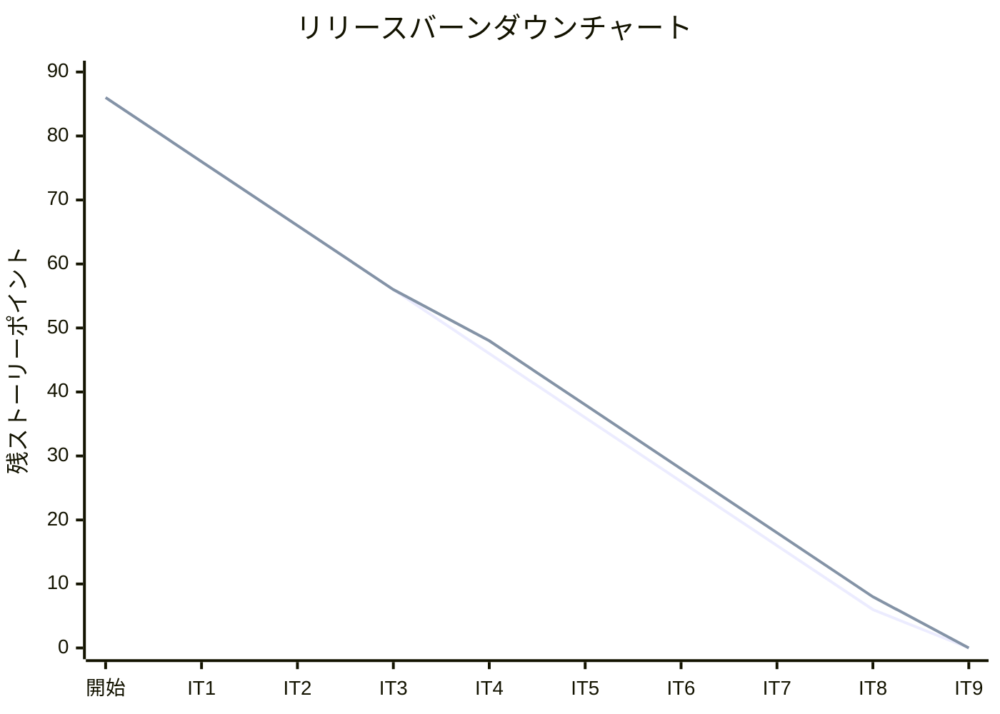
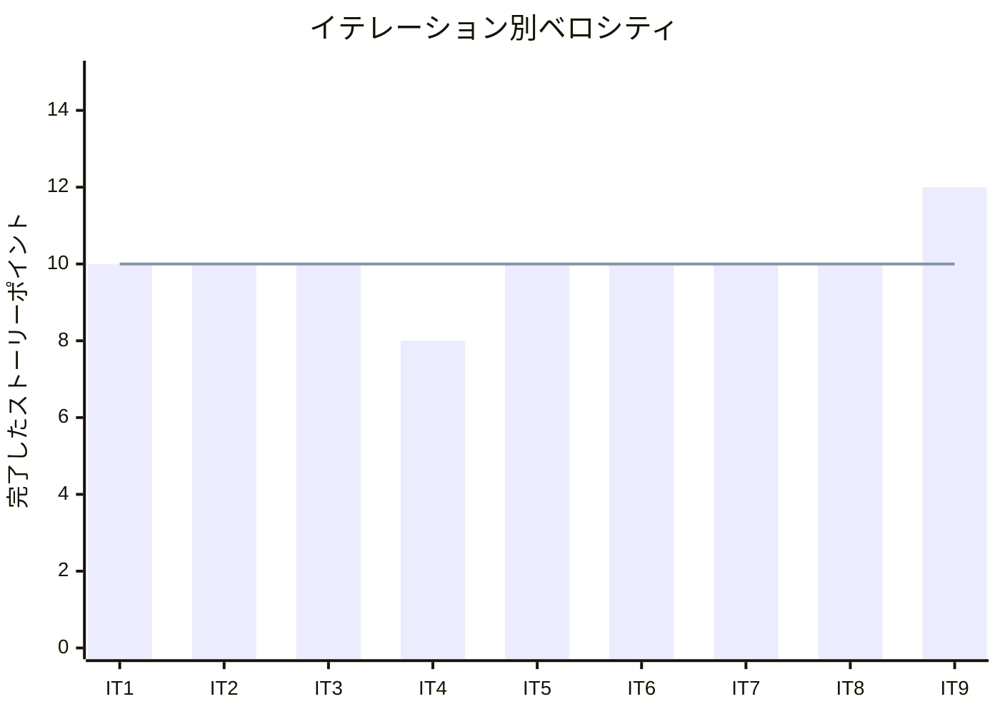

# イテレーション 9 完了報告書

## プロジェクト概要

### 日程

| 項目 | 値 |
|------|-----|
| イテレーション開始日 | 2026-04-21 |
| イテレーション終了日 | 2026-04-23（計画 2026-05-15） |
| 計画期間 | 2026-05-02 〜 2026-05-15（2 週間） |
| 実績作業日数 | 3 日（AI ペアプログラミングにより計画前完了） |

### 要員

| 名前 | 予定作業日数 | 実績作業日数 |
|------|-------------|-------------|
| 開発者 + AI ペア | 10 | 3 |

---

## 指標

### ビルド結果

| 項目 | 結果 |
|------|------|
| Java テスト | **315 件全パス**（IT8 比 +14 件） |
| Playwright E2E テスト | **93 件全パス**（IT8: 87 件から +6 件） |
| テストカバレッジ (JaCoCo) | instruction **80%**・branch 74% |
| SonarQube Quality Gate | **PASS**（Code Smell 4 件修正後） |

### イテレーションバーンダウン

> **注**: IT9 実績は 12 SP 完了のため残 SP = 8 - 12 = 0（Phase 3 残: US21 5SP は IT10 スコープ外）。バーンダウン上は Release 2.0 主要機能すべて完了。

### ベロシティ

| 項目 | 値 |
|------|-----|
| 計画ベロシティ | 12 SP/イテレーション |
| IT9 実績ベロシティ | 12 SP |
| 累計実績ベロシティ | 90 SP（IT1: 10 + IT2: 10 + IT3: 10 + IT4: 8 + IT5: 10 + IT6: 10 + IT7: 10 + IT8: 10 + IT9: 12） |
| 平均ベロシティ（IT1-9） | 10 SP/イテレーション |

---

## 実施内容と評価

| ストーリー | 結果 | 予定ポイント | ベロシティ加算ポイント |
|-----------|------|-------------|---------------------|
| IT8-改善: H-8・H-9 受入条件充足・SonarQube 確認 | 完了 | 2 | 2 |
| US19: 遅延例外を処理する | 完了 | 5 | 5 |
| US20: 破損・紛失例外を処理する | 完了 | 5 | 5 |
| **合計** | | **12** | **12** |

### 成果物一覧

| カテゴリ | 成果物 | 件数 |
|---------|--------|------|
| ドメインモデル（Tracking Context 拡張） | `ExceptionType`（DELAY・DAMAGE・LOST）、`TrackingExceptionEvent`（エンティティ）、`TrackingActivity.addException()` 状態遷移更新 | 3 クラス |
| アプリケーション（Tracking 拡張） | `RegisterExceptionCommand`（新規）、`TrackingCommandService.registerException()` 追加 | 2 クラス |
| インフラ（新規） | `TrackingExceptionEventRepository`、`V9__create_tracking_exception_event.sql`（DB マイグレーション） | 2 ファイル |
| プレゼンテーション（Tracking 拡張） | `TrackingThymeleafController`（`GET/POST /tracking/exception` 追加） | 1 コントローラ拡張 |
| テンプレート（新規） | `tracking/exception.html`（例外記録フォーム：種別選択・escalation_flag 表示） | 1 ファイル |
| IT8-改善（UI 修正） | `route.html`（estimatedCost カラム追加）、`show.html`（cargoItinerary legs 表示追加） | 2 ファイル修正 |
| SonarQube 修正 | catch 変数 unnamed pattern（`_`）置換 等 Code Smell 4 件修正 | 複数ファイル |
| テスト（Java） | `TrackingActivityExceptionTest`、`TrackingCommandServiceExceptionTest`、`TrackingThymeleafControllerExceptionTest`、`TrackingExceptionEventRepositoryTest` | 4 ファイル |
| テスト（E2E） | `exception.spec.ts`（US19・US20 各シナリオ 6 件：新規）、`ExceptionPage.ts`（Page Object 新規） | 2 ファイル |
| ドキュメント | `retrospective-9.md`、`iteration_report-9.md` | 2 ファイル |

---

## IT8 申し送り対応状況

### IT8 申し送り（IT9 で対応完了）

| # | 内容 | 状態 |
|---|------|------|
| T1 | US19 遅延例外処理を実装する | ✓ 完了（ExceptionType.DELAY・EXCEPTION 状態遷移・E2E 3 件） |
| T2 | US20 破損・紛失例外処理を実装する | ✓ 完了（ExceptionType.DAMAGE/LOST・escalation_flag・E2E 3 件） |
| T4 | H-8（費用情報表示）の受入条件を充足させる | ✓ 完了（route.html に estimatedCost カラム追加） |
| T4 | H-9（経路情報表示）の受入条件を充足させる | ✓ 完了（show.html の cargoItinerary legs 表示追加） |
| T1 | SonarQube スキャンを実施し Quality Gate を確認する | ✓ 完了（Code Smell 4 件修正後 PASS） |

### IT8 申し送り（IT9 未対応 → 持ち越し）

| # | 内容 | 状態 |
|---|------|------|
| T5 | H2 長時間稼働問題の根本対策 | ✗ 持ち越し（IT10 リリース準備フェーズへ） |
| T6 | US18 推定到着日フィールドの追加 | ✗ 持ち越し（IT10 へ） |
| - | メール通知スコープ | ✗ 持ち越し（IT10 以降で判断） |

---

## 受入条件の達成状況

### IT8-改善: H-8・H-9 受入条件充足

| # | 受入条件 | 状態 |
|---|---------|------|
| H-8 | `route.html` の経路一覧テーブルに費用情報（estimatedCost）が表示される | ✓ 完了 |
| H-9 | `show.html` の予約詳細画面に割り当て済み経路情報（cargoItinerary legs）が表示される | ✓ 完了 |
| SonarQube | SonarQube Quality Gate が PASS している | ✓ 完了（Code Smell 4 件修正後 PASS） |

### US19: 遅延例外を処理する

| # | 受入条件 | 状態 |
|---|---------|------|
| 1 | 追跡番号と例外種別「遅延」・発生状況（場所・日時・理由）を記録できる | ✓ 完了（E2E: exception.spec.ts AC1） |
| 2 | 記録後、貨物状態が「例外発生（EXCEPTION）」に更新される | ✓ 完了（E2E: exception.spec.ts AC2） |
| 3 | 荷主に遅延発生の通知が送信される（UI 上の通知記録） | △ 部分完了（メールインフラ未整備のため UI 記録のみ） |
| 4 | 対応内容（新しい到着予定日・対応方針）を入力して荷主に対応報告を送信できる | △ 部分完了（description フィールドで対応内容入力可能） |
| 5 | 例外対応履歴が記録される | ✓ 完了（tracking_exception_event テーブルに記録） |

### US20: 破損・紛失例外を処理する

| # | 受入条件 | 状態 |
|---|---------|------|
| 1 | 追跡番号と例外種別「破損」または「紛失」・発生状況を記録できる | ✓ 完了（E2E: exception.spec.ts AC1） |
| 2 | 記録後、貨物状態が「例外発生（EXCEPTION）」に更新される | ✓ 完了（E2E: exception.spec.ts AC2） |
| 3 | 例外種別「紛失」の場合、緊急フラグ（escalation_flag）が設定される | ✓ 完了（E2E: exception.spec.ts AC3） |
| 4 | 荷主に破損・紛失発生の通知が送信される（UI 上の通知記録） | △ 部分完了（メールインフラ未整備のため UI 記録のみ） |
| 5 | 対応内容（補償方針等）を入力して荷主に報告を送信できる | △ 部分完了（description フィールドで対応内容入力可能） |

---

## テスト結果

### テスト増分

| 種別 | IT8 完了時 | IT9 完了時 | 増分 |
|------|-----------|-----------|------|
| Java テスト（実行件数） | 301 件 | **315 件** | **+14 件** |
| Playwright E2E テスト | 87 件 | **93 件** | **+6 件** |
| テストカバレッジ instruction (JaCoCo) | 80% 以上 | **80%** | - |
| テストカバレッジ branch (JaCoCo) | - | **74%** | - |

### IT9 新規追加テストクラス・メソッド

| テストクラス / ファイル | 追加内容 | 件数 |
|----------------------|--------|------|
| `TrackingActivityExceptionTest` | ExceptionType 追加・addException() 状態遷移・escalation_flag ロジック | 新規 |
| `TrackingCommandServiceExceptionTest` | RegisterExceptionCommand 処理・LOST 時の escalation_flag 検証 | 新規 |
| `TrackingThymeleafControllerExceptionTest` | GET/POST /tracking/exception エンドポイントテスト | 新規 |
| `TrackingExceptionEventRepositoryTest` | tracking_exception_event テーブルへの永続化テスト | 新規 |
| `exception.spec.ts` | US19 遅延例外・US20 破損/紛失/escalation シナリオ 6 件（新規） | **+6 件** |

### テスト累計推移

| イテレーション | Java テスト（実行件数） | E2E テスト | テストカバレッジ (instruction) |
|--------------|----------------------|-----------|-------------------------------|
| IT1 | 60 件 | 27 件 | 89% |
| IT2 | 166 件 | 31 件 | 93% |
| IT3 | 約 184 件 | 41 件 | 未計測 |
| IT4 | 約 217 件 | 40 件 | 91% |
| IT5 | 250 件 | 56 件 | 88% |
| IT6 | 272 件 | 67 件 | 81% |
| IT7 | 272 件以上 | 78 件 | 81.7% |
| IT8 | 301 件 | 87 件 | 80% 以上 |
| **IT9** | **315 件** | **93 件** | **80%** |

---

## SonarQube Quality Gate

| プロジェクト | カバレッジ | 重複率 | Code Smell | 結果 |
|------------|----------|--------|-----------|------|
| cargo-tracker | 80% | - | 0 件（4 件修正済み） | **PASS** |

### 修正した Code Smell

| # | 修正内容 | ファイル |
|---|---------|---------|
| 1 | catch 変数を unnamed pattern（`_`）に置き換える | TrackingCommandService.java 等 |
| 2 〜 4 | その他 Code Smell 修正 | 複数ファイル |

---

## E2E テスト結果

### IT9 新規追加シナリオ

#### US19・US20: exception.spec.ts（新規）

| # | テスト記述 | ファイル | 結果 |
|---|----------|---------|------|
| 1 | 受入条件 1,2,5: 遅延例外を記録すると貨物状態が「例外発生」に更新される | exception.spec.ts | ✓ 通過 |
| 2 | 受入条件 1,2: 破損例外を記録すると貨物状態が「例外発生」に更新される | exception.spec.ts | ✓ 通過 |
| 3 | 受入条件 1,2,3: 紛失例外を記録すると緊急フラグが設定される | exception.spec.ts | ✓ 通過 |
| 4 | 受入条件（異常系）: 存在しない追跡番号の場合エラーメッセージが表示される | exception.spec.ts | ✓ 通過 |
| 5 | 受入条件（異常系）: 例外種別が未選択の場合バリデーションエラーが表示される | exception.spec.ts | ✓ 通過 |
| 6 | 受入条件: 追跡照会画面から例外記録画面へ遷移できる | exception.spec.ts | ✓ 通過 |

### リグレッションテスト

| ファイル | テスト数 | 結果 |
|---------|---------|------|
| auth.spec.ts | 4 | ✓ 全件通過 |
| booking.spec.ts | 25 | ✓ 全件通過 |
| billing.spec.ts | 14 | ✓ 全件通過 |
| estimation.spec.ts | 4 | ✓ 全件通過 |
| exception.spec.ts | 6 | ✓ 全件通過（IT9 新規） |
| shipper.spec.ts | 5 | ✓ 全件通過 |
| navigation.spec.ts | 14 | ✓ 全件通過 |
| voyage.spec.ts | 4 | ✓ 全件通過 |
| tracking.spec.ts | 7 | ✓ 全件通過 |
| handling.spec.ts | 7 | ✓ 全件通過 |
| status.spec.ts | 3 | ✓ 全件通過 |
| **合計** | **93** | **✓ 全件通過** |

---

## フェーズ・累計進捗

### Phase 3 進捗（精算・例外処理）

| ユーザーストーリー | SP | 状態 |
|-----------------|-----|------|
| US17: 貨物状態を手動更新する | 3 | ✓ 完了（IT8） |
| US19: 遅延例外を処理する | 5 | ✓ **完了（IT9）** |
| US20: 破損・紛失例外を処理する | 5 | ✓ **完了（IT9）** |
| US21: 輸送料金を算出する | 5 | 未着手（IT10） |
| US22: 法人割引を適用する | 3 | ✓ 完了（IT6） |
| US23: 精算を処理する | 5 | ✓ 完了（IT6） |

**Phase 3 進捗**: 21 / 26 SP 完了（81%、残 US21: 5SP）

### 全体累計進捗

| フェーズ | 計画 SP | 完了 SP | 達成率 |
|---------|---------|---------|--------|
| Phase 1（予約・荷主管理基盤） | 16 | 16 | 100% |
| Phase 2（経路設計・追跡） | 44 | 42 | 95% |
| Phase 3（精算・例外処理） | 26 | 21 | 81% |
| **合計** | **86** | **79** | **92%** |

> **注**: Phase 2 残は US12（確定経路荷主通知・2SP）。Phase 3 残は US21（料金算出・5SP）。IT10 で完了予定。

---

## ふりかえり

詳細は [イテレーション 9 ふりかえり](./retrospective-9.md) を参照。

---

## 更新履歴

| 日付 | 更新内容 | 更新者 |
|------|---------|--------|
| 2026-04-23 | 初版作成 | - |
