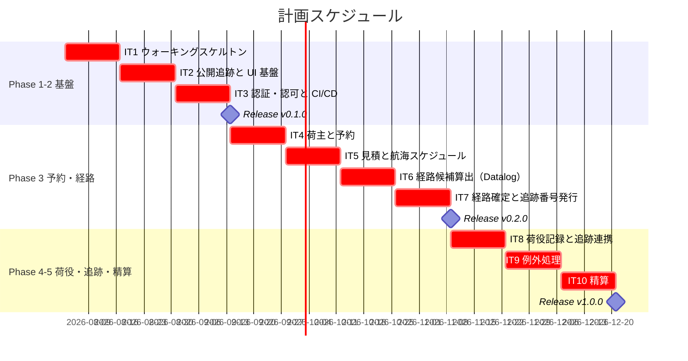
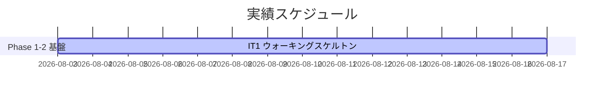
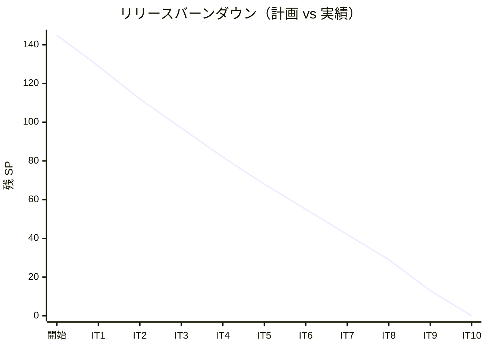

# リリース計画 - 国際貨物輸送管理システム（Flix 実装）

## 概要

本ドキュメントは、国際貨物輸送管理システム（Flix 実装）のリリース計画を定義します。

計画の価値は「正確に予測すること」ではなく「実績と計画のズレを早期に検知し調整すること」にあります。
ベロシティが安定するまでに 3 イテレーションを要するため、初期の数値は推測値として扱い、実績に基づいて更新します。

### プロジェクト情報

| 項目 | 内容 |
|------|------|
| **プロジェクト名** | 国際貨物輸送管理システム（Cargo Tracker）Flix 実装 |
| **目的** | DDD の戦略的・戦術的設計、XP に基づくアジャイル開発、TDD を実践的に学ぶ。あわせて Flix の代数的効果によるヘキサゴナルアーキテクチャの実現可能性を検証する |
| **対象ユーザー** | 荷主・荷受人・営業担当者・経路設計者・追跡管理者・荷役作業員・経理担当者 |
| **開発チーム** | 1 名（AI エージェントとのペアプログラミング） |

---

## 満足条件

### スコープ

段階的リリース戦略を採ります。設計の [段階的実装方針](../design/index.md) に従い、
**自作リスクの最も高い認証機構を先に踏まない**よう、認証不要の公開追跡でウォーキングスケルトンを縦断してから認証に進みます。

| フェーズ | 内容 | ユーザーストーリー数 | 技術ストーリー数 |
|---------|------|:---:|:---:|
| Phase 1 | 基盤とウォーキングスケルトン | 1 | 4 |
| Phase 2 | 認証と CI/CD | 2 | 2 |
| Phase 3 | 予約と経路設計 | 16 | 1 |
| Phase 4 | 荷役と追跡 | 5 | 0 |
| Phase 5 | 精算 | 3 | 0 |
| **合計** | | **27** | **7** |

### 技術ストーリーを立てる理由

Flix には Web フレームワーク・ORM・認証基盤・アーキテクチャ検査ツールが存在せず、これらを JDK 標準 API の
薄いラッパとして自作します（[技術スタック選定](../design/tech_stack.md)）。この自作分は
ユーザーストーリーの裏に隠すには規模が大きすぎ、隠すと見積もりが常に外れます。
よって **TS01-TS07 として独立した技術ストーリーに切り出し、SP を明示的に計上します**。

### スケジュール

- **開発期間**: 約 5 ヶ月（2026-08-03 〜 2026-12-18）
- **イテレーション**: 2 週間 × 10 イテレーション（予備なし。バッファはスコープで確保）
- **リリース**: フェーズ完了ごとに 3 回（v0.1.0 / v0.2.0 / v1.0.0）

### リソース

- **開発者**: 1 名
- **想定稼働時間**: 20 時間/週（40 時間/イテレーション）

---

## ユーザーストーリー一覧とストーリーポイント

### 見積もりの基準

基準ストーリーを **US02「荷主を登録する」= 3 SP** とします。
値オブジェクトを持つ集約 1 つ、リポジトリ 1 つ、画面 2 つ（一覧・登録）、テスト一式で構成される最小の縦断機能です。

| SP | 目安 |
|:--:|------|
| 1 | 既存機能への小さな追加。新しい型を作らない |
| 2 | 集約は既存。画面 1 つまたは API 1 つの追加 |
| 3 | **基準**。小さな集約 1 つ + 永続化 + 画面 2 つ |
| 5 | 状態遷移を伴う集約、または複数コンテキストにまたがる |
| 8 | 新しい機構の導入を伴う（Datalog・イベント連携・複雑な業務ルール） |
| 13 | 複数の基盤要素を同時に立ち上げる（ウォーキングスケルトンのみ） |

### 優先順位マトリックス

4 軸評価で優先順位を決定します。

1. **金銭価値（BV）**: ビジネス価値
2. **コスト（C）**: 開発コスト
3. **知識習得（KA）**: 技術的学習価値
4. **リスク軽減（RR）**: リスク軽減効果

### Phase 1: 基盤とウォーキングスケルトン（イテレーション 1-2）

| ID | ストーリー | SP | BV | C | KA | RR | 優先度 |
|----|-----------|:--:|----|---|----|----|--------|
| TS01 | ウォーキングスケルトン（HTTP ルータ・Html DSL 最小・`Tx` 効果・JDBC ハンドラの縦断） | 13 | 低 | 高 | 高 | 高 | 必須 |
| TS02 | `arch-lint`（8 規約 + 違反フィクスチャによるメタテスト） | 5 | 低 | 中 | 高 | 高 | 必須 |
| TS06 | Flyway マイグレーション基盤 | 3 | 低 | 低 | 中 | 中 | 必須 |
| US18 | 追跡情報を照会する（公開追跡・認証不要） | 5 | 高 | 中 | 中 | 高 | 必須 |
| TS04 | Html コンポーネント群（レイアウト・ナビ・フォーム・バッジ） | 5 | 中 | 中 | 中 | 中 | 必須 |
| **合計** | | **31** | | | | | |

### Phase 2: 認証と CI/CD（イテレーション 3）

| ID | ストーリー | SP | BV | C | KA | RR | 優先度 |
|----|-----------|:--:|----|---|----|----|--------|
| TS03 | 認証・認可基盤（DB セッション・CSRF・ロール・ミドルウェア） | 8 | 中 | 高 | 高 | 高 | 必須 |
| US26 | システムにログインする | 3 | 高 | 中 | 低 | 高 | 必須 |
| US27 | システムからログアウトする | 1 | 中 | 低 | 低 | 中 | 必須 |
| TS05a | CI 最小構成（PR で build / test / arch-lint）**IT2 へ前倒し** | 2 | 低 | 低 | 低 | 高 | 必須 |
| TS05b | CI/CD の残り（E2E・日次の実 PostgreSQL・Trivy・SonarQube） | 3 | 低 | 中 | 中 | 高 | 必須 |
| **合計** | | **17**（うち TS05a 2 SP は IT2 で実施） | | | | | |

### Phase 3: 予約と経路設計（イテレーション 4-7）

| ID | ストーリー | SP | BV | C | KA | RR | 優先度 |
|----|-----------|:--:|----|---|----|----|--------|
| US02 | 荷主を登録する | 3 | 高 | 低 | 低 | 低 | 必須 |
| US03 | 法人荷主を登録する | 2 | 中 | 低 | 低 | 低 | 必須 |
| US04 | 貨物予約を登録する | 5 | 高 | 中 | 中 | 中 | 必須 |
| US05 | 危険物・冷凍貨物の予約を登録する | 3 | 高 | 中 | 中 | 中 | 必須 |
| US06 | 予約情報を経路設計者に引き渡す | 2 | 中 | 低 | 低 | 低 | 必須 |
| US01 | 輸送見積を作成する | 5 | 高 | 中 | 中 | 低 | 必須 |
| US07 | 航海スケジュールを検索する | 3 | 中 | 低 | 低 | 低 | 必須 |
| US24 | 航海スケジュールを新規登録する | 3 | 中 | 低 | 低 | 中 | 必須 |
| US25 | 既存航海スケジュールを更新する | 3 | 中 | 中 | 低 | 中 | 必須 |
| TS07 | 外部 ACL 基盤（HttpClient・JSON デコーダ・スタブサーバ） | 5 | 低 | 中 | 高 | 高 | 必須 |
| US08 | 経路候補を算出する（Datalog 到達可能性判定） | 8 | 高 | 高 | 高 | 中 | 必須 |
| US09 | 経路を選択・確定する | 5 | 高 | 中 | 中 | 中 | 必須 |
| US10 | 経路条件を調整して再算出する | 3 | 中 | 中 | 低 | 低 | 中 |
| US11 | 経路情報を予約に紐付ける | 3 | 高 | 中 | 中 | 中 | 必須 |
| US12 | 確定経路を荷主に通知する | 2 | 中 | 低 | 低 | 低 | 中 |
| US13 | 予約を確定する | 3 | 高 | 中 | 中 | 中 | 必須 |
| US14 | 追跡番号を発行する | 2 | 高 | 低 | 低 | 低 | 必須 |
| **合計** | | **60** | | | | | |

### Phase 4: 荷役と追跡（イテレーション 8-9）

| ID | ストーリー | SP | BV | C | KA | RR | 優先度 |
|----|-----------|:--:|----|---|----|----|--------|
| US15 | 荷役作業を記録する（MISROUTED 判定・イベント連携） | 8 | 高 | 高 | 高 | 中 | 必須 |
| US16 | 引取作業を記録する（通関未完了時の拒否） | 5 | 高 | 中 | 中 | 中 | 必須 |
| US17 | 貨物状態を手動更新する | 3 | 中 | 中 | 低 | 低 | 必須 |
| US19 | 遅延例外を処理する | 5 | 高 | 中 | 中 | 中 | 必須 |
| US20 | 破損・紛失例外を処理する | 3 | 高 | 中 | 低 | 中 | 必須 |
| **合計** | | **24** | | | | | |

### Phase 5: 精算（イテレーション 10）

| ID | ストーリー | SP | BV | C | KA | RR | 優先度 |
|----|-----------|:--:|----|---|----|----|--------|
| US21 | 輸送料金を算出する | 5 | 中 | 中 | 中 | 中 | 中 |
| US22 | 法人割引を適用する | 3 | 中 | 中 | 低 | 中 | 中 |
| US23 | 精算を処理する | 5 | 中 | 中 | 中 | 中 | 中 |
| **合計** | | **13** | | | | | |

### 全体サマリー

| フェーズ | ストーリーポイント | イテレーション |
|---------|:---:|---------------|
| Phase 1 基盤とウォーキングスケルトン | 31 SP | 1-2 |
| Phase 2 認証と CI/CD | 17 SP | 3 |
| Phase 3 予約と経路設計 | 60 SP | 4-7 |
| Phase 4 荷役と追跡 | 24 SP | 8-9 |
| Phase 5 精算 | 13 SP | 10 |
| **合計** | **145 SP** | **10 イテレーション（予備なし）** |

内訳: ユーザーストーリー 101 SP / 技術ストーリー 44 SP（全体の 30%）。

---

## ベロシティ見積もり

### 初期ベロシティ推定

| 項目 | 値 |
|------|-----|
| **イテレーション期間** | 2 週間 |
| **チーム規模** | 1 名 |
| **想定稼働時間** | 40 時間/イテレーション |
| **1 SP あたりの理想時間** | 約 2.5 時間 |
| **想定ベロシティ** | 16-20 SP/イテレーション |
| **バッファ係数** | 0.8（20% バッファ） |
| **実効ベロシティ** | **13-16 SP/イテレーション** |

### この数値の根拠と限界

- 1 SP ≒ 2.5 理想時間は**実績のない推測値**です。Flix の習熟度・コンパイル時間の影響が未知であり、
  Phase 1 は基盤の自作が中心のため、初回 2 イテレーションは想定を下回る可能性が高いと見ています
- **IT3 終了時点で 3 イテレーションの実績が出るため、そこで全体計画を再計算します**
- 実効ベロシティ 14 SP と仮定すると 145 SP ÷ 14 ≒ 10.4 イテレーション。**10 イテレーションの計画に予備はありません**。
  各イテレーションの計画 SP は 11-17 SP に収めていますが、全体としては余裕がない計画です。
  この点は「スケジュールリスク」に記載し、スコープによるバッファ確保で補います

### ベロシティ検証計画

1. IT1 終了時: 実績 SP を記録。基盤系（TS）とユーザーストーリー（US）で 1 SP あたりの所要時間が
   大きく異なるかを確認する
2. IT2 終了時: 2 点の実績から傾きを確認。乖離が 30% を超える場合は全ストーリーを再見積もりする
3. IT3 終了時: 3 イテレーションの移動平均を実効ベロシティとして採用し、Phase 3 以降の計画を更新する

---

## 段階的リリース戦略

### リリーススケジュール

#### 計画スケジュール

#### 実績スケジュール

実績は各イテレーション完了時に追記します。

### リリース内容

#### Release v0.1.0（Phase 1-2 完了）: 基盤と公開追跡

**目標**: アーキテクチャの実現可能性を実装で証明し、認証基盤を確立する

**含まれる機能**:

- 公開貨物追跡（認証不要。追跡番号から現在状態を照会）
- ログイン・ログアウト（全ロール）
- ロール別のアクセス制御

**このリリースで検証すること**（機能価値より検証価値が主）:

- 代数的効果によるポート注入が 8 コンテキスト規模へ耐えるか（効果の伝播とシグネチャ肥大化の実測）
- `Tx` 効果によるトランザクション境界と after-commit イベント配信が成立するか
- 自作 HTTP ルータ + `Html` DSL の記述量が許容範囲か
- `arch-lint` が実際に規約違反を検出できるか

**リリース条件**:

- [ ] `flix test` が全件パス
- [ ] `arch-lint` の違反 0 件（メタテストを含む）
- [ ] E2E シナリオ④（公開追跡照会）がパス
- [ ] 全ルート × 全ロールの認可テストがパス
- [ ] セキュリティ回帰テスト（[テスト戦略](../design/test_strategy.md) 8.4）がパス
- [ ] ステージング環境へデプロイ可能

#### Release v0.2.0（Phase 3 完了）: 予約と経路設計

**目標**: 見積から予約確定・追跡番号発行までの業務フローを通す

**含まれる機能**:

- 荷主登録（個人・法人）
- 輸送見積の作成
- 貨物予約の登録（危険物・冷凍貨物を含む）
- 航海スケジュールの登録・更新・検索
- 経路候補の算出（Datalog による到達可能性判定）・選択・確定
- 予約確定と追跡番号発行

**リリース条件**:

- [ ] 全テストがパス
- [ ] E2E シナリオ①②がパス
- [ ] 外部経路システムの契約テスト（正常・タイムアウト）がパス
- [ ] トレーサビリティ表（[テスト戦略](../design/test_strategy.md) 5 章）が完了ストーリー分だけ更新済み

#### Release v1.0.0（Phase 4-5 完了）: 全業務フロー

**目標**: 見積から精算までの全業務フローを完成させる

**含まれる機能**:

- 荷役作業・引取作業の記録（MISROUTED 判定・通関チェック）
- 追跡ステータスの自動反映（ドメインイベント経由）
- 遅延・破損・紛失の例外処理
- 輸送料金の算出・法人割引・精算処理

**リリース条件**:

- [ ] 全テストがパス
- [ ] E2E シナリオ①〜⑤がパス
- [ ] 負荷試験を実施し、追跡 API のスループット目標の成否を判定済み
- [ ] 運用手順書（監視・バックアップ・障害対応）が整備済み

---

## バッファ戦略

### フィーチャバッファ

優先度「中」のストーリーを削減可能なスコープとして扱います。

| フェーズ | 計画 SP | 削減可能 SP（優先度 中） | 必須 SP |
|---------|:---:|:---:|:---:|
| Phase 1 | 31 | 0 | 31 |
| Phase 2 | 17 | 0 | 17 |
| Phase 3 | 60 | 5（US10, US12） | 55 |
| Phase 4 | 24 | 0 | 24 |
| Phase 5 | 13 | 13（Phase 5 全体） | 0 |
| **合計** | **145** | **18（12%）** | **127** |

> **フィーチャバッファが 30% に満たない点は認識しています**。本プロジェクトは業務フロー全体の
> 実装を目的とするため、削れる機能が構造的に少ないためです。

### スケジュールバッファ

**予備イテレーションは確保できていません**。145 SP を実効ベロシティ 14 SP で割ると 10.4 イテレーションとなり、
10 イテレーションの枠をすでに使い切っているためです。

したがってバッファは**スケジュールではなくスコープで確保します**。

| バッファ源 | SP | イテレーション換算 |
|-----------|:--:|:---:|
| 優先度「中」の削減（US10・US12） | 5 | 0.4 |
| Phase 5（精算）のスコープ外化 | 13 | 0.9 |
| **合計** | **18** | **1.3** |

この 1.3 イテレーション分が実質的なバッファです。これを超える遅延が生じた場合は、
期日を延ばすかスコープをさらに削るかを**明示的に判断します**（黙って遅延させない）。

### バッファ消費ルール

1. フィーチャバッファを先に消費する（US10・US12 の延期 → Phase 5 の延期）
2. Phase 5（精算）はスコープ外にできる。v1.0.0 の定義を「荷役・追跡まで」に変更する
3. スケジュールバッファ（IT10）は最後の手段とする
4. **技術ストーリー（TS01-TS07）は削減しない**。削るとアーキテクチャが成立しなくなる

---

## イテレーション計画概要

### イテレーション 1（Week 1-2）

**ゴール**: 公開追跡の 1 ユースケースを HTTP からデータベースまで縦に貫き、アーキテクチャの実現可能性を実装で確認する

**主なタスク**:

- [ ] TS01: HTTP ルータ・`Html` DSL 最小・`Tx` 効果・JDBC ハンドラの縦断（13 SP）
- [ ] TS06: Flyway マイグレーション基盤（3 SP）

**目標 SP**: 16

詳細は [iteration_plan-1.md](./iteration_plan-1.md) を参照。

### イテレーション 2（Week 3-4）

**ゴール**: 公開貨物追跡の画面を完成させ、UI コンポーネント基盤とアーキテクチャ検査を確立する

**主なタスク**:

- [ ] TS02: `arch-lint` の 8 規約とメタテスト（5 SP）
- [ ] US18: 追跡情報を照会する（受入基準の完全充足）（5 SP）
- [ ] TS04: Html コンポーネント群（5 SP）
- [ ] TS05a: CI 最小構成（2 SP。IT3 から前倒し）
- [ ] IT1 の実測に基づくベロシティ見直し

**目標 SP**: 17

> IT1 のふりかえり（Try T5）に基づき、CI 最小構成（TS05a・2 SP）を IT3 から前倒しした。
> 詳細は [iteration_plan-2.md](./iteration_plan-2.md) を参照。

### イテレーション 3（Week 5-6）

**ゴール**: 自作の認証・認可基盤を確立し、CI/CD で品質ゲートを自動化する

**主なタスク**:

- [ ] TS03: 認証・認可基盤（DB セッション・CSRF・ロール・ミドルウェア）（8 SP）
- [ ] US26 / US27: ログイン・ログアウト（4 SP）
- [ ] TS05b: CI/CD の残り（3 SP。E2E・日次・Trivy・SonarQube）
- [ ] 3 イテレーションの実績でベロシティを確定し、Phase 3 以降を再計画

**目標 SP**: 15

### イテレーション 4 以降（暫定配分）

IT3 終了時のベロシティ確定後に再計画します。現時点の暫定配分は以下です。

| IT | ゴール | 対象 | 計画 SP |
|:--:|-------|------|:---:|
| IT4 | 荷主登録と貨物予約 | US02, US03, US04, US05, US06 | 15 |
| IT5 | 見積と航海スケジュール | US01, US07, US24, US25 | 14 |
| IT6 | 経路候補算出（Datalog）と外部 ACL | TS07, US08 | 13 |
| IT7 | 経路確定と追跡番号発行 + **HTTP ランタイムの防御**（セマフォ・タイムアウト）と追跡 API の負荷試験 | US09, US11, US13, US14 | 13 |
| IT8 | 荷役記録と追跡連携 | US15, US16 | 13 |
| IT9 | 例外処理と積み残し | US17, US19, US20, US10, US12 | 16 |
| IT10 | 精算 | US21, US22, US23 | 13 |

---

## リスク管理

### 技術リスク

| リスク | 影響度 | 発生確率 | 対策 |
|--------|--------|----------|------|
| 効果の組み合わせがシグネチャを肥大化させ、可読性が破綻する | 高 | 中 | IT1・IT2 で実測し、効果の粒度と型別名による集約を評価する。破綻の兆候が出た時点で設計を見直す |
| Flix 0.x 系の破壊的変更でビルドが通らなくなる | 高 | 中 | `flix.toml` でバージョン固定。アップグレードは独立コミット + フルテスト。四半期ごとに評価 |
| 自作セキュリティ機構に実装欠陥が生じる | 高 | 中 | 自作範囲を JDK 標準の薄いラッパに限定。OWASP ASVS L1 レビュー + セキュリティ回帰テストを必須化 |
| `arch-lint` 自体のバグで規約違反を見逃す | 中 | 中 | 違反フィクスチャによるメタテストを TS02 に含める |
| 追跡 API のスループット目標（1,000 RPS）が未達 | 中 | 高 | 未検証であることを設計に明記済み。**IT7 で HTTP ランタイムの防御（セマフォ・タイムアウト）を実装し、あわせて負荷試験を実施**してキャッシュ導入か目標見直しを判断する |
| H2 と PostgreSQL の方言差で「H2 で緑・本番で赤」が起きる | 中 | 中 | 日次ジョブとリリース前ステージで実 PostgreSQL に対して同じ統合テストを実行する |
| Flix のコンパイル時間が開発サイクルを圧迫する | 中 | 中 | `dev:check`（型検査のみ）を編集中の確認に使う。CI ではビルドキャッシュを必ず有効化する |

### スケジュールリスク

| リスク | 影響度 | 発生確率 | 対策 |
|--------|--------|----------|------|
| **予備イテレーションがない**（145 SP ÷ 実効 14 SP ≒ 10.4 IT に対し枠は 10 IT） | 高 | 高 | バッファをスコープで確保（US10・US12 の削減と Phase 5 のスコープ外化で計 18 SP ≒ 1.3 IT）。IT3 時点で実績ベロシティを確定し、達成不能なら Phase 5 の扱いを明示的に判断する |
| Phase 1 の基盤自作が想定より膨らむ | 高 | 中 | TS01 は「1 ユースケースが通ること」を完了条件とし、汎用化しない。必要になった時点で拡張する |
| 初期ベロシティの推測が大きく外れる | 中 | 高 | IT1 終了時点で乖離を確認。30% を超える場合は全ストーリーを再見積もりする |
| 学習コスト（代数的効果・Datalog）が見積もりに含まれていない | 中 | 中 | IT1 を学習期間と位置づけ、実績が低くても計画の失敗とみなさない |

---

## 進捗管理

### メトリクス

| メトリクス | 目標 |
|-----------|------|
| ベロシティ | 13-16 SP/イテレーション（IT3 で確定） |
| テストカバレッジ | **計測しない**（Flix にツールが存在しないため）。代わりにビジネスルール ⇄ テストの対応表で網羅を担保 |
| ビジネスルール未テスト | 0 件 |
| `arch-lint` 違反 | 0 件 |
| 予定達成率 | 90% 以上 |

> カバレッジを品質ゲートに使わない理由と代替統制は [テスト戦略](../design/test_strategy.md) 6 章を参照してください。

### 進捗状況

| イテレーション | 計画 SP | 実績 SP | 達成率 | 状態 |
|---------------|:---:|:---:|:---:|------|
| IT1 | 16 | 16 | 100% | **完了** |
| IT2 | 17 | - | - | 計画済み |
| IT3 | 15 | - | - | 暫定 |
| IT4 | 15 | - | - | 暫定 |
| IT5 | 14 | - | - | 暫定 |
| IT6 | 13 | - | - | 暫定 |
| IT7 | 13 | - | - | 暫定 |
| IT8 | 13 | - | - | 暫定 |
| IT9 | 16 | - | - | 暫定 |
| IT10 | 13 | - | - | 暫定 |
| **累計** | **145** | **16** | **11%** | |

### バーンダウンチャート

実績線はイテレーション完了ごとに追記します。

---

## 次のステップ

1. ~~`opening-iteration` でイテレーション 1 の計画を作成する~~（完了: [iteration_plan-1.md](iteration_plan-1.md)）
2. ~~開発戦略を策定する~~（完了: [development_strategy.md](development_strategy.md)）
3. ~~計画と設計ドキュメントの整合性を検証する~~（完了。不整合 2 件を設計側で是正）
4. `syncing-github-project` で GitHub Project に同期する
5. `orchestrating-development` で IT1 の開発に着手する

---

## 更新履歴

| 日付 | 更新内容 | 更新者 |
|------|---------|--------|
| 2026-07-31 | 初版作成 | - |
