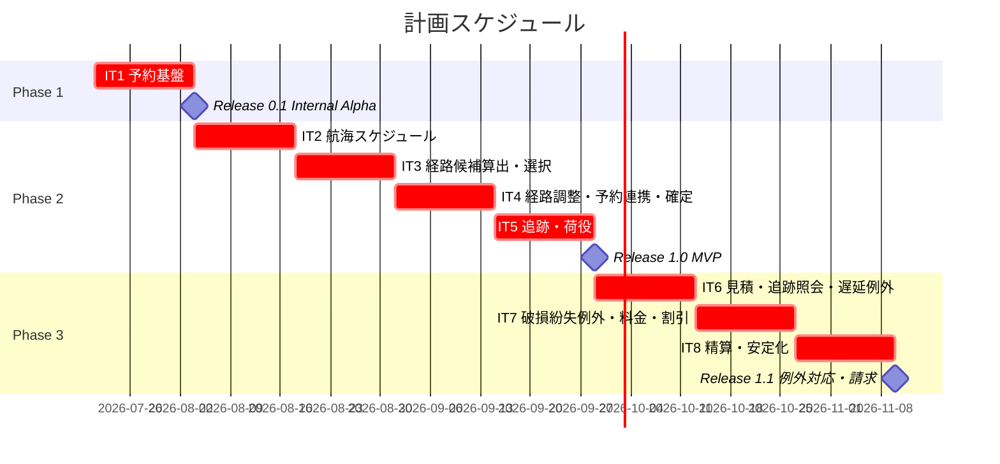
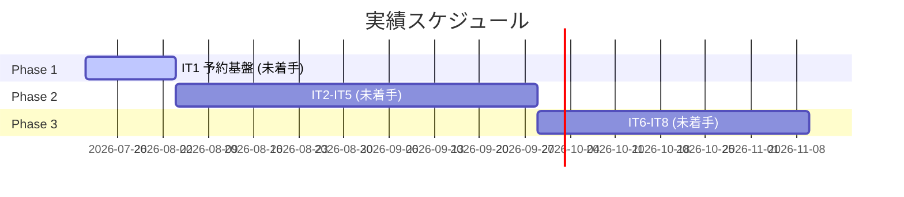
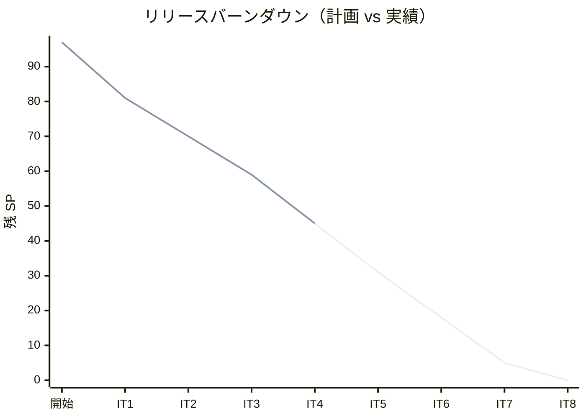

# リリース計画 - 国際貨物輸送管理システム（Cargo Tracker / Rust 版）

## 概要

本ドキュメントは、国際貨物輸送管理システム（Cargo Tracker）Rust 実装版のリリース計画（マクロ計画）を定義します。
計画は「正確に予測すること」ではなく「実績と計画のズレを早期に検知し調整すること」を目的とし、ベロシティが安定する 3 イテレーション後に再調整します。

イテレーション × ユーザーストーリーの割り当ては本ドキュメントを Single Source of Truth とし、局面別の TDD アプローチは [開発戦略](./development_strategy.md)、個々の TDD サイクルは [コーディングとテストガイド](../reference/コーディングとテストガイド.md) に従います。

### プロジェクト情報

| 項目 | 内容 |
|------|------|
| **プロジェクト名** | 国際貨物輸送管理システム（Cargo Tracker / Rust 版） |
| **目的** | 予約・経路設計・追跡・荷役・精算を一貫管理し、最適ルート提案とリアルタイム貨物追跡を実現する |
| **対象ユーザー** | 営業担当者・経路設計者・荷役作業員・追跡管理者・経理担当者・荷主／荷受人 |
| **開発チーム** | 開発者 1 名 + AI ペア（Claude Code） |
| **アーキテクチャ** | ヘキサゴナル + DDD（7 境界づけられたコンテキスト）、cargo workspace によるクレート分割 |

---

## 満足条件

### スコープ

要件定義から導出した 25 ユーザーストーリー（19 システムユースケース）に、全業務の前提となる横断的な認証基盤ストーリー（US-AUTH-01）を加えた 26 ストーリーを、DDD の境界づけられたコンテキストの依存順に 3 フェーズへ分割し、段階的にリリースする。予約フロー（Estimation → Shipper → Booking）を基盤に、経路設計（Routing）・追跡（Tracking）・荷役（Handling）のコアフローを固め、最後に例外対応と精算（Billing）で仕上げる。

| フェーズ | 内容 | ストーリー数 |
|---------|------|---------------|
| Phase 1 | 予約基盤（認証基盤・荷主・貨物予約の縦切り、ウォーキングスケルトン基盤化） | 5 US |
| Phase 2 | コア輸送フロー（航海スケジュール・経路設計・追跡・荷役） | 14 US |
| Phase 3 | 見積・例外対応・精算（仕上げ） | 7 US |
| **合計** | | **26 US** |

### スケジュール

- **開発期間**: 約 16 週間（2026-07-21 〜 2026-11-09）
- **イテレーション**: 2 週間 × 8 イテレーション
- **リリース**: 段階的リリース（Release 0.1 Internal Alpha → Release 1.0 MVP → Release 1.1 例外対応・請求）

### リソース

- **開発者**: 1 名 + AI ペア（Claude Code）
- **想定稼働時間**: 実効ベロシティ換算で 12 SP/イテレーション相当

---

## ユーザーストーリー一覧とストーリーポイント

### 優先順位マトリックス

4 軸評価で優先順位を決定する。

1. **金銭価値（BV）**: ビジネス価値
2. **コスト（C）**: 開発コスト
3. **知識習得（KA）**: 技術的学習価値
4. **リスク軽減（RR）**: リスク軽減効果

### Phase 1: 予約基盤（イテレーション 1）

| ID | ユーザーストーリー | SP | BV | C | KA | RR | 優先度 |
|----|-------------------|----|----|---|----|----|--------|
| US-AUTH-01 | ログイン認証とロール別アクセス制御 | 3 | 高 | 中 | 高 | 高 | 必須 |
| US02 | 荷主を登録する | 3 | 高 | 低 | 中 | 高 | 必須 |
| US03 | 法人荷主を登録する | 2 | 中 | 低 | 低 | 中 | 必須 |
| US04 | 貨物予約を登録する | 5 | 高 | 中 | 高 | 高 | 必須 |
| US05 | 危険物・冷凍貨物の予約を登録する | 3 | 中 | 中 | 中 | 中 | 必須 |
| **合計** | | **16** | | | | | |

> US-AUTH-01 は全業務ユースケースの前提となる横断的基盤であり、IT1 で最初に実装する（ウォーキングスケルトンの認証・認可・ナビゲーション骨格）。

### Phase 2: コア輸送フロー（イテレーション 2-5）

| ID | ユーザーストーリー | SP | BV | C | KA | RR | 優先度 |
|----|-------------------|----|----|---|----|----|--------|
| US24 | 航海スケジュールを新規登録する | 3 | 高 | 低 | 中 | 高 | 必須 |
| US25 | 既存航海スケジュールを更新する | 3 | 中 | 低 | 低 | 中 | 必須 |
| US07 | 航海スケジュールを検索する | 5 | 高 | 中 | 中 | 中 | 必須 |
| US08 | 経路候補を算出する | 8 | 高 | 高 | 高 | 高 | 必須 |
| US09 | 経路を選択・確定する | 3 | 高 | 低 | 中 | 中 | 必須 |
| US06 | 予約情報を経路設計者に引き渡す | 2 | 中 | 低 | 低 | 中 | 必須 |
| US10 | 経路条件を調整して再算出する | 5 | 中 | 中 | 中 | 中 | 必須 |
| US11 | 経路情報を予約に紐付ける | 2 | 中 | 低 | 低 | 中 | 必須 |
| US12 | 確定経路を荷主に通知する | 2 | 中 | 低 | 低 | 低 | 必須 |
| US13 | 予約を確定する | 3 | 高 | 中 | 中 | 高 | 必須 |
| US14 | 追跡番号を発行する | 3 | 高 | 低 | 中 | 高 | 必須 |
| US15 | 荷役作業を記録する | 5 | 高 | 中 | 高 | 高 | 必須 |
| US16 | 引取作業を記録する | 3 | 高 | 中 | 中 | 高 | 必須 |
| US17 | 貨物状態を手動更新する | 3 | 中 | 中 | 中 | 中 | 必須 |
| **合計** | | **50** | | | | | |

### Phase 3: 見積・例外対応・精算（イテレーション 6-8）

| ID | ユーザーストーリー | SP | BV | C | KA | RR | 優先度 |
|----|-------------------|----|----|---|----|----|--------|
| US01 | 輸送見積を作成する | 5 | 高 | 中 | 中 | 中 | 必須 |
| US18 | 追跡情報を照会する | 3 | 高 | 中 | 中 | 中 | 必須 |
| US19 | 遅延例外を処理する | 5 | 中 | 中 | 中 | 高 | 必須 |
| US20 | 破損・紛失例外を処理する | 5 | 中 | 中 | 中 | 高 | 必須 |
| US21 | 輸送料金を算出する | 5 | 高 | 中 | 高 | 中 | 中 |
| US22 | 法人割引を適用する | 3 | 中 | 低 | 中 | 中 | 中 |
| US23 | 精算を処理する | 5 | 高 | 中 | 高 | 中 | 中 |
| **合計** | | **31** | | | | | |

### 全体サマリー

| フェーズ | ストーリーポイント | イテレーション |
|---------|-------------------|---------------|
| Phase 1 | 16 SP | 1 |
| Phase 2 | 50 SP | 2-5 |
| Phase 3 | 31 SP | 6-8 |
| **合計** | **97 SP** | 8 イテレーション |

---

## ベロシティ見積もり

### 初期ベロシティ推定

| 項目 | 値 |
|------|-----|
| **イテレーション期間** | 2 週間 |
| **チーム規模** | 1 名 + AI ペア |
| **想定ベロシティ** | 12-14 SP/イテレーション |
| **バッファ係数** | 0.8（20%バッファ） |
| **実効ベロシティ** | 10-12 SP/イテレーション |

> 基準ストーリー分析: US02（荷主登録・単純な集約 CRUD + リポジトリ）を 3 SP の基準とし、
> ドメインの複雑さ（不変条件・状態遷移・外部連携・アルゴリズム）と統合範囲で相対見積もりを行った。
> US08（経路候補算出）は制約充足アルゴリズムを含む最難関ストーリーとして 8 SP に置いた。

### ベロシティ検証計画

- IT1-IT3 の実績 SP を計測し、IT3 終了時に想定ベロシティを実績値へ再調整する。
- 実績が想定を下回る場合、優先度「中」の Billing 系ストーリー（US21-US23）を後続イテレーションへ繰り延べる。

---

## 段階的リリース戦略

### リリーススケジュール

#### 計画スケジュール

#### 実績スケジュール

### リリース内容

#### Release 0.1（Phase 1 完了）: Internal Alpha

**目標**: 荷主登録から貨物予約登録までの縦切りを歩けるスケルトンとして通し、ヘキサゴナル + cargo workspace 基盤の妥当性を早期検証する。

**含まれる機能**:

- 荷主（個人・法人）の登録（Shipper Context）
- 貨物予約の登録（Booking Context）
- 危険物・冷凍貨物の特別情報入力
- 認証・ナビゲーション骨格 + 全ルートのプレースホルダ画面

**リリース条件**:

- [x] 全ユニットテストがパス（`cargo test`）— 全 70 テスト green（testcontainers 統合含む）
- [x] clippy 警告ゼロ（`cargo clippy --workspace -- -D warnings`）
- [x] 予約登録の縦切りが手動確認済み（ログイン→荷主登録→予約登録→予約詳細を実 PostgreSQL で確認）
- [x] cargo workspace のクレート依存境界が維持されている（`cargo build`）

#### Release 1.0（Phase 2 完了）: MVP

**目標**: 予約→経路設計→予約確定→追跡番号発行→荷役記録までの中核輸送フローを完成させ、業務の主要ハッピーパスを提供する。

**含まれる機能**:

- 航海スケジュール管理・検索（Routing Context）
- 経路候補算出・選択・条件調整（Routing Context）
- 予約への経路紐付け・荷主通知・予約確定（Booking Context）
- 追跡番号発行・荷役／引取記録・貨物状態更新（Tracking / Handling Context）

**リリース条件**:

- [ ] 全ユニット・統合テストがパス（testcontainers による PostgreSQL 統合）
- [ ] E2E テスト（主要フロー）がパス（Playwright）
- [ ] セキュリティレビュー完了（`cargo audit` / `cargo deny`）
- [ ] テストカバレッジ 80% 以上（`cargo-llvm-cov`）

#### Release 1.1（Phase 3 完了）: 例外対応・請求

**目標**: 見積・追跡照会・例外対応（遅延／破損／紛失）・料金算出・精算を追加し、リリース全体の業務一貫性を担保する。

**含まれる機能**:

- 輸送見積作成（Estimation Context）
- 追跡情報照会（Tracking Context 読取・ログイン不要）
- 遅延・破損・紛失の例外処理と通知
- 輸送料金算出・法人割引適用・精算処理（Billing Context）

**リリース条件**:

- [ ] 全テストがパス
- [ ] パフォーマンステスト完了
- [ ] 非機能要件（可用性・セキュリティ）の受け入れ確認完了

---

## バッファ戦略

### フィーチャバッファ

| フェーズ | 計画 SP | バッファ（30%） | 実効 SP |
|---------|---------|-----------------|---------|
| Phase 1 | 16 | 5 | 21 |
| Phase 2 | 50 | 15 | 65 |
| Phase 3 | 31 | 9 | 40 |

### スケジュールバッファ

- **予備イテレーション**: IT8 を精算 + 安定化（統合・E2E ハードニング・リリース準備）に充て、新規 SP を軽めに置くことで実質的なバッファとする。
- **全体バッファ**: 約 20%（ベロシティ係数 0.8 に織り込み）

### バッファ消費ルール

1. フィーチャバッファを先に消費する。
2. 優先度「中」のストーリー（US21・US22・US23）を後回しにする。
3. スケジュールバッファ（IT8 の安定化枠）は最後の手段とする。

---

## イテレーション計画概要

### イテレーション 1（Week 1-2）— 序盤

**ゴール**: 認証・ロール別アクセス制御を最初に確立し、荷主登録から貨物予約登録までの縦切りを通す。

**主なタスク**:

- [x] US-AUTH-01 ログイン認証とロール別アクセス制御（最初に実装）
- [x] US02 荷主を登録する
- [x] US03 法人荷主を登録する
- [x] US04 貨物予約を登録する
- [x] US05 危険物・冷凍貨物の予約を登録する

**目標 SP**: 16（実績 16・完了）

詳細は [iteration_plan-1.md](./iteration_plan-1.md) を参照。

### イテレーション 2（Week 3-4）— 中盤

**ゴール**: 航海スケジュールの管理と制約条件付き検索を実装し、経路設計の入力基盤を固める。

**主なタスク**:

- [ ] US24 航海スケジュールを新規登録する
- [ ] US25 既存航海スケジュールを更新する
- [ ] US07 航海スケジュールを検索する

**目標 SP**: 11

詳細は [iteration_plan-2.md](./iteration_plan-2.md) を参照。

### イテレーション 3（Week 5-6）— 中盤

**ゴール**: 制約条件を考慮した経路候補算出アルゴリズムと経路確定を実装する。

**主なタスク**:

- [x] US08 経路候補を算出する
- [x] US09 経路を選択・確定する

**目標 SP**: 11（実績 11・完了）

詳細は [iteration_plan-3.md](./iteration_plan-3.md) を参照。

### イテレーション 4（Week 7-8）— 中盤

**ゴール**: 経路条件調整・予約への経路紐付け・荷主通知・予約確定までの連携を完成させる。

**主なタスク**:

- [x] US06 予約情報を経路設計者に引き渡す
- [x] US10 経路条件を調整して再算出する
- [x] US11 経路情報を予約に紐付ける
- [x] US12 確定経路を荷主に通知する
- [x] US13 予約を確定する

**目標 SP**: 14（実績 14・完了）

詳細は [iteration_plan-4.md](./iteration_plan-4.md) を参照。

### イテレーション 5（Week 9-10）— 中盤

**ゴール**: 追跡番号発行・荷役／引取記録・貨物状態更新を実装し、Release 1.0 MVP を完成させる。

**主なタスク**:

- [ ] US14 追跡番号を発行する
- [ ] US15 荷役作業を記録する
- [ ] US16 引取作業を記録する
- [ ] US17 貨物状態を手動更新する

**目標 SP**: 14

詳細は [iteration_plan-5.md](./iteration_plan-5.md) を参照。

### イテレーション 6（Week 11-12）— 終盤

**ゴール**: 輸送見積・追跡情報照会・遅延例外処理を、既存ドメインを組み合わせた業務シナリオとして実装する。

**主なタスク**:

- [ ] US01 輸送見積を作成する
- [ ] US18 追跡情報を照会する
- [ ] US19 遅延例外を処理する

**目標 SP**: 13

詳細は iteration_plan-6.md を参照（作成予定）。

### イテレーション 7（Week 13-14）— 終盤

**ゴール**: 破損・紛失例外処理と輸送料金算出・法人割引適用を実装する。

**主なタスク**:

- [ ] US20 破損・紛失例外を処理する
- [ ] US21 輸送料金を算出する
- [ ] US22 法人割引を適用する

**目標 SP**: 13

詳細は iteration_plan-7.md を参照（作成予定）。

### イテレーション 8（Week 15-16）— 終盤

**ゴール**: 精算処理を完成させ、統合・E2E ハードニングとリリース準備を行い Release 1.1 を完成させる。

**主なタスク**:

- [ ] US23 精算を処理する
- [ ] 統合テスト・E2E テストのハードニング
- [ ] 非機能要件の受け入れ確認・リリース準備

**目標 SP**: 5（+ 安定化）

詳細は iteration_plan-8.md を参照（作成予定）。

---

## リスク管理

### 技術リスク

| リスク | 影響度 | 発生確率 | 対策 |
|--------|--------|----------|------|
| 経路候補算出（US08）の制約充足アルゴリズムが想定より複雑 | 高 | 中 | IT3 を単独イテレーション化。まず直行便・単純接続から段階的に実装し、複雑な多段接続は後続で拡張 |
| sqlx のコンパイル時 SQL 検証に伴う開発時 DB 依存 | 中 | 中 | testcontainers で開発時も実 PostgreSQL を使用。`SQLX_OFFLINE` + `.sqlx` キャッシュを CI で活用 |
| コンテキスト間連携（イベント・ACL）の設計負債 | 中 | 中 | in-process イベントバス（tokio broadcast）を IT4-IT5 で早期に骨格化し、ADR で連携方針を記録 |
| edition 2024 / 各クレート（axum 0.8 等）の破壊的変更 | 中 | 低 | workspace dependencies でバージョン一元管理。メジャーアップは ADR に記録して随時追従 |

### スケジュールリスク

| リスク | 影響度 | 発生確率 | 対策 |
|--------|--------|----------|------|
| 初回ベロシティ推測値と実績の乖離 | 高 | 高 | IT3 終了時に実績で再調整。優先度「中」の Billing 系を調整弁とする |
| Phase 2 のコアフローが 4 イテレーションに収まらない | 高 | 中 | フィーチャバッファ（30%）を消費し、US10 等の柔軟性系ストーリーを繰り延べ |
| 終盤の Billing クラスタ（US21-23）の集中 | 中 | 中 | IT8 を安定化枠として確保し、精算を最終イテレーションに単独配置 |

---

## 進捗管理

### メトリクス

| メトリクス | 目標 |
|-----------|------|
| ベロシティ | 10-12 SP/イテレーション |
| テストカバレッジ | 80% 以上 |
| バグ密度 | 0.5 件/SP 以下 |
| 予定達成率 | 90% 以上 |

### 進捗状況

| イテレーション | 計画 SP | 実績 SP | 達成率 | 状態 |
|---------------|---------|---------|--------|------|
| 1 | 16 | 16 | 100% | 完了（機能スコープ・全テスト green） |
| 2 | 11 | 11 | 100% | 完了（US24/US25/US07・レビュー済・DIP 回復 ADR-0003） |
| 3 | 11 | 11 | 100% | 完了（US08 経路算出・US09 経路選択・レビュー済・受入基準実証テスト補強） |
| 4 | 14 | 14 | 100% | 完了（US06・US10・US11・US12・US13・レビュー済・ADR-0004/0005 起票） |
| 5 | 14 | - | - | 未着手 |
| 6 | 13 | - | - | 未着手 |
| 7 | 13 | - | - | 未着手 |
| 8 | 5 | - | - | 未着手 |

### バーンダウンチャート

> 実績: IT1 完了時点で残 81 SP（16 SP 消化）。IT2 完了時点で残 70 SP（11 SP 消化）。IT3 完了時点で残 59 SP（11 SP 消化）。IT4 完了時点で残 45 SP（14 SP 消化）。計画ラインと一致し、ベロシティは安定推移。

---

## 次のステップ

1. [開発戦略](./development_strategy.md)を作成し、序盤（アウトサイドイン）・中盤（インサイドアウト）・終盤（アウトサイドイン）の局面割り当てを本計画に対応づける。
2. `validating-iteration-plan` / `validating-design` で本計画と上流設計ドキュメントの整合性を検証する。
3. `syncing-github-project` で Milestone（Release 0.1 / 1.0 / 1.1）・Issue（US01-US25）を GitHub に同期する。
4. `planning-releases --iteration 1` で IT1 の詳細計画を作成し、開発に着手する。

---

## 更新履歴

| 日付 | 更新内容 | 更新者 |
|------|---------|--------|
| 2026-07-18 | 初版作成（25 US・94 SP・8 イテレーション・3 リリース） | - |
| 2026-07-18 | 認証基盤ストーリー US-AUTH-01 を Phase 1 に追加（26 US・97 SP、IT1 16SP） | - |
