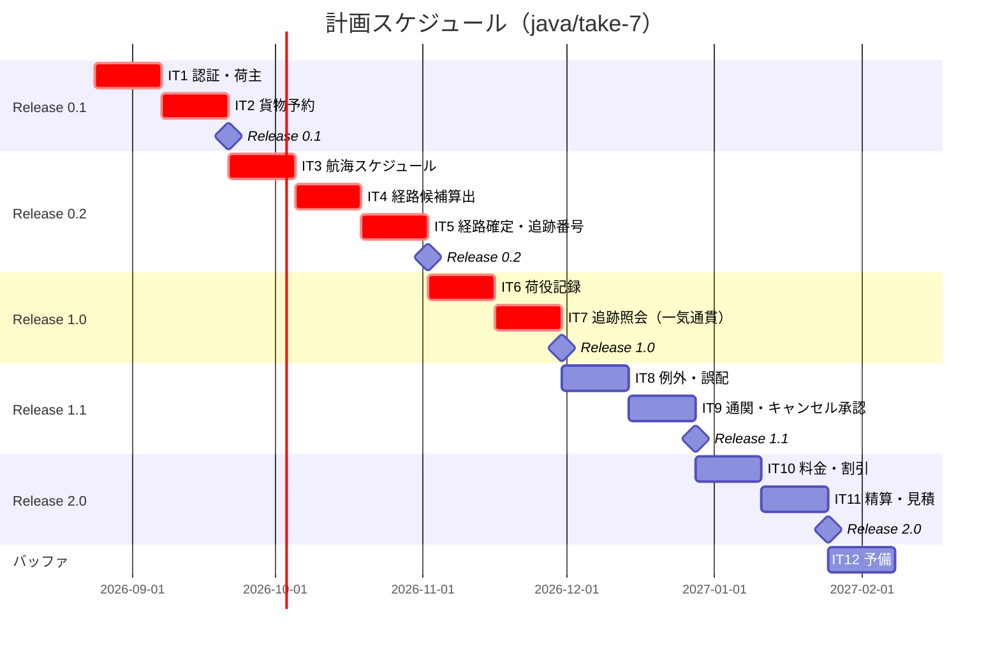

# リリース計画 - 国際貨物輸送管理システム（java/take-7）

## 概要

本ドキュメントは、国際貨物輸送管理システム（マイクロサービス構成）のリリース計画を定義します。

### プロジェクト情報

| 項目 | 内容 |
|------|------|
| **プロジェクト名** | 国際貨物輸送管理システム（Cargo Tracker） |
| **目的** | 国際貨物輸送の予約から追跡・精算までを一貫して管理し、予約業務の効率化・最適ルート設計・リアルタイム追跡・例外対応の迅速化を実現する |
| **対象ユーザー** | 荷主・荷受人・営業担当者・経路設計者・追跡管理者・荷役作業員・経理担当者 |
| **開発チーム** | 1 名（AI ペアプログラミング） |
| **ブランチ** | `java/take-7` |
| **構成** | マイクロサービス 7 サービス（gateway/auth/booking/routing/tracking/handling/billing）+ React SPA |

---

## 満足条件

### スコープ

Release 0.1〜1.0 で「**予約から追跡までが一本つながる**」ことを最優先とします。幅を広げるより、細くても端から端までつながっていることを優先します（ウォーキングスケルトン）。take-7 の要件差分（通関 US29・キャンセル承認 US30・誤配 US28・アカウント保護 US31）は Release 1.1 に置き、一気通貫の成立後に取り組みます。

| リリース | 内容 | US 数 | SP |
|---------|------|------|-----|
| Release 0.1 | 予約基盤（認証・荷主・予約） | 7 | 17 |
| Release 0.2 | 経路設計・予約確定 | 11 | 33 |
| Release 1.0 | 荷役・追跡（予約から追跡までの一気通貫） | 4 | 13 |
| Release 1.1 | 例外・通関・キャンセル承認 | 5 | 19 |
| Release 2.0 | 精算・見積 | 4 | 15 |
| **合計** | | **31** | **97** |

> **合計は明細から導きます。手で持つと必ずずれます**（take-6 の教訓。合計を更新し忘れて 3 件のずれが出た）。
> 突き合わせる相手は明細ではなく **US の全件（US01〜US31）** です。全 31 件がいずれかのリリースに属することを、リリース変更のたびに確認してください。

> **US02（荷主登録）と US24（航海スケジュール登録）は他ストーリーの入力データを作るため、先行して着手しなければ後続が動作確認できません。**

### スケジュール

- **開発期間**: 11 イテレーション + 予備 1（約 24 週間）
- **イテレーション**: 1 イテレーション = 2 週間
- **リリース**: イテレーション末に動作するソフトウェアを開発環境（Heroku）へデプロイする（小さなリリース）

### リソース

- **開発者**: 1 名
- **ベロシティ（初期値）**: **10SP / イテレーション**

> **初期ベロシティの根拠**: 同一題材の他 take の実績から推定しています。`java/take-6` 12SP 初期値（モノリス）、`flix/take-1` 12.3SP、`haskell/take-1` 10.6SP、`scala/take-1` 10.1SP。
> take-7 は**マイクロサービス構成のため、サービス間の配線（イベント・契約テスト・ACL）が 1 ストーリーあたりのコストを押し上げます**。一方で環境（Gradle マルチプロジェクト・kind・Heroku・CI 相当のタスク・JIG）は構築済みです。両者を相殺し、take-6 より低い 10SP を初期値とします。**これは推測であり、3 イテレーション経過後に実績で再調整します。**

---

## ユーザーストーリー一覧とストーリーポイント

### 優先順位マトリックス

4 軸で評価します。

1. **金銭価値（BV）**: ビジネス価値
2. **コスト（C）**: 開発コスト
3. **知識習得（KA）**: 技術的学習価値
4. **リスク軽減（RR）**: リスク軽減効果

> SP は take-6（同一題材・モノリス）の実績値を基準に、サービス間結合を伴うストーリー（イベント駆動・ACL 越境・複数サービス変更）へ +1〜2SP の補正を加えています。

### Release 0.1: 予約基盤（IT1〜IT2）

認証（authms）と予約（bookingms）を立ち上げ、Gateway 経由で一連の操作ができる状態にします。

| ID | ユーザーストーリー | SP | BV | C | KA | RR | 優先度 | 主なサービス |
|----|-------------------|----|----|---|----|----|--------|-------------|
| US26 | システムにログインする | 3 | 中 | 中 | 高 | 高 | 必須 | authms, gatewayms |
| US27 | システムからログアウトする | 1 | 低 | 低 | 低 | 中 | 必須 | authms |
| US31 | 認証失敗が続いたアカウントを保護する | 2 | 中 | 低 | 中 | 高 | 必須 | authms |
| US02 | 荷主を登録する | 3 | 高 | 中 | 中 | 高 | 必須 | bookingms |
| US03 | 法人荷主を登録する | 1 | 中 | 低 | 低 | 中 | 必須 | bookingms |
| US04 | 貨物予約を登録する | 5 | 高 | 高 | 高 | 高 | 必須 | bookingms |
| US05 | 危険物・冷凍貨物の予約を登録する | 2 | 中 | 低 | 中 | 中 | 中 | bookingms |
| **合計** | | **17** | | | | | | |

> **US31 を Release 0.1 に置く理由**: 認証の作り直しは後になるほど高くつきます。ロック（失敗回数・ロック期限のカラム永続化、同一エラーメッセージ）は US26 と同じテーブル・同じエンドポイントを触るため、同時に作るのが最も安い。

### Release 0.2: 経路設計・予約確定（IT3〜IT5）

routingms を立ち上げ、bookingms との同期連携（ACL 経由）とイベント駆動（booking → tracking）の最初の 1 本を通します。

| ID | ユーザーストーリー | SP | BV | C | KA | RR | 優先度 | 主なサービス |
|----|-------------------|----|----|---|----|----|--------|-------------|
| US24 | 航海スケジュールを新規登録する | 3 | 高 | 中 | 中 | 高 | 必須 | routingms |
| US25 | 既存航海スケジュールを更新する | 2 | 中 | 低 | 低 | 中 | 必須 | routingms |
| US06 | 予約情報を経路設計者に引き渡す | 2 | 中 | 低 | 中 | 中 | 必須 | bookingms |
| US07 | 航海スケジュールを検索する | 3 | 中 | 中 | 中 | 中 | 必須 | routingms |
| US08 | 経路候補を算出する | 8 | 高 | 高 | 高 | 高 | 必須 | routingms |
| US09 | 経路を選択・確定する | 3 | 高 | 中 | 中 | 中 | 必須 | bookingms ⇄ routingms |
| US10 | 経路条件を調整して再算出する | 3 | 中 | 中 | 中 | 中 | 中 | routingms |
| US11 | 経路情報を予約に紐付ける | 2 | 中 | 低 | 中 | 中 | 必須 | bookingms（ACL） |
| US12 | 確定経路を荷主に通知する | 2 | 中 | 低 | 低 | 低 | 中 | bookingms |
| US13 | 予約を確定する | 2 | 高 | 低 | 中 | 中 | 必須 | bookingms |
| US14 | 追跡番号を発行する | 3 | 高 | 中 | 高 | 高 | 必須 | bookingms → trackingms（イベント） |
| **合計** | | **33** | | | | | | |

> **US14 が最初のサービス間イベント**（CargoBookedEvent）です。ここで Spring Cloud Stream + RabbitMQ + 契約テストの型を確立し、以降のイベント（荷役・通関・精算）はこの型を踏襲します。KA・RR を高くしているのはこのためです。

### Release 1.0: 荷役・追跡（IT6〜IT7）

handlingms・trackingms を業務として立ち上げ、「予約 → 経路 → 荷役 → 追跡照会」の一気通貫を成立させます。

| ID | ユーザーストーリー | SP | BV | C | KA | RR | 優先度 | 主なサービス |
|----|-------------------|----|----|---|----|----|--------|-------------|
| US15 | 荷役作業を記録する | 5 | 高 | 高 | 高 | 高 | 必須 | handlingms → trackingms（イベント） |
| US16 | 引取作業を記録する | 3 | 高 | 中 | 中 | 中 | 必須 | handlingms |
| US17 | 貨物状態を手動更新する | 2 | 中 | 低 | 低 | 中 | 必須 | trackingms |
| US18 | 追跡情報を照会する | 3 | 高 | 中 | 中 | 高 | 必須 | trackingms（認証不要・公開） |
| **合計** | | **13** | | | | | | |

> **US18 は認証の外に置く唯一の画面**です。Gateway の公開経路設定（実装済みの public-paths）を実際の画面で検証します。入口（ログイン画面・ポータル）にも導線を置きます。

### Release 1.1: 例外・通関・キャンセル承認（IT8〜IT9）

take-7 の要件差分を実装します。一気通貫が成立した後でなければ、これらの「例外系」は検証できません。

| ID | ユーザーストーリー | SP | BV | C | KA | RR | 優先度 | 主なサービス |
|----|-------------------|----|----|---|----|----|--------|-------------|
| US19 | 遅延例外を処理する | 2 | 中 | 低 | 中 | 中 | 必須 | trackingms |
| US20 | 破損・紛失例外を処理する | 2 | 中 | 低 | 低 | 中 | 必須 | trackingms |
| US28 | 誤配を検知して経路を再設計する | 5 | 高 | 高 | 高 | 高 | 必須 | handlingms → trackingms → routingms |
| US29 | 通関申告を登録・管理する | 5 | 高 | 高 | 中 | 高 | 必須 | handlingms（CLAIM ガード・監査履歴） |
| US30 | 輸送中の予約キャンセルを承認する | 5 | 中 | 高 | 中 | 高 | 中 | bookingms（承認フロー・陸揚げ地） |
| **合計** | | **19** | | | | | | |

> US29 の通関ガード（CLEARED でなければ CLAIM 拒否）は US16 の引取記録に対する制約です。US16 実装時に拡張点を残し、US29 でガードを差し込みます。**ドメインの守りは画面から踏むテストと対にします**（過去 take の教訓）。

### Release 2.0: 精算・見積（IT10〜IT11）

billingms を業務として立ち上げ、配送完了イベントからの精算とキャンセル料、見積を実装します。

| ID | ユーザーストーリー | SP | BV | C | KA | RR | 優先度 | 主なサービス |
|----|-------------------|----|----|---|----|----|--------|-------------|
| US21 | 輸送料金を算出する | 5 | 高 | 高 | 中 | 中 | 必須 | billingms（CargoDeliveredEvent 起点） |
| US22 | 法人割引を適用する | 2 | 中 | 低 | 低 | 低 | 必須 | billingms |
| US23 | 精算を処理する | 3 | 高 | 中 | 低 | 中 | 必須 | billingms |
| US01 | 輸送見積を作成する | 5 | 中 | 高 | 低 | 低 | 中 | bookingms + billingms |
| **合計** | | **15** | | | | | | |

> **US01（見積）を最後に置く理由**: 見積は料金算出ロジック（US21・US22）に依存します。先に作ると精算実装時に作り直しになります（take-6 でも US01 は最終リリースに配分された）。

---

## ベロシティ見積もり

### 初期ベロシティ推定

| 項目 | 値 |
|------|-----|
| **イテレーション期間** | 2 週間 |
| **チーム規模** | 1 名（AI ペアプログラミング） |
| **想定ベロシティ** | 10SP / イテレーション |
| **バッファ係数** | 0.8（20% バッファ） |
| **実効ベロシティ** | 8SP / イテレーション（コミットメント判断時） |

### ベロシティ検証計画

- IT1〜IT3 の実績平均で初期値を検証し、IT4 の計画から反映する
- サービス間結合を伴うストーリー（イベント・ACL）と単一サービスのストーリーで実績を分けて記録し、SP 補正の妥当性を確認する

---

## 段階的リリース戦略

### リリーススケジュール

#### 計画スケジュール

#### 実績スケジュール

（イテレーション完了ごとに追記します）

### リリース内容

#### Release 0.1: 予約基盤

**目標**: 営業担当者がログインし、荷主と貨物予約を登録できる。

**含まれる機能**: 認証（JWT・アカウントロック）、荷主登録（個人・法人）、貨物予約登録（一般・危険物・冷凍）

**リリース条件**:

- [ ] 全ユニットテスト・統合テスト（Testcontainers）がパス
- [ ] ArchUnit（レイヤー依存・BC 独立性）違反 0 件
- [ ] 開発環境（Heroku）で Gateway 経由の操作が確認できる

#### Release 0.2: 経路設計・予約確定

**目標**: 経路設計者が航海スケジュールから経路候補を算出し、予約に紐付けて確定・追跡番号発行までできる。

**含まれる機能**: 航海スケジュール管理、経路候補算出、経路確定、予約確定、追跡番号発行（初のサービス間イベント）

**リリース条件**:

- [ ] Release 0.1 の条件に加え、bookingms ⇄ routingms の契約テストがパス
- [ ] CargoBookedEvent の発行・購読が kind 統合環境で確認できる

#### Release 1.0: 荷役・追跡

**目標**: 予約 → 経路 → 荷役 → 追跡照会が一本つながる（ウォーキングスケルトン完成）。

**含まれる機能**: 荷役作業記録、引取記録、貨物状態管理、公開追跡照会

**リリース条件**:

- [ ] E2E テスト（kind + Kustomize 上の Playwright）で一気通貫シナリオがパス
- [ ] 公開追跡が認証なしで到達できる（Gateway の public-paths 検証）

#### Release 1.1: 例外・通関・キャンセル承認

**目標**: 現場の例外（遅延・破損・紛失・誤配）と通関・輸送中キャンセルに対応できる。

**含まれる機能**: 例外処理、誤配検知と再設計、通関申告（CLAIM ガード・監査履歴）、キャンセル承認フロー

**リリース条件**:

- [ ] 通関ガード・キャンセル承認の「壊すと赤」テストがパス（安全装置は破るテストで固定する）
- [ ] 監査履歴（customs_status_history）の追記専用がテストで固定されている

#### Release 2.0: 精算・見積

**目標**: 配送完了から精算まで、および事前見積ができる。

**含まれる機能**: 料金算出、法人割引、精算処理、輸送見積

**リリース条件**:

- [ ] CargoDeliveredEvent → 請求書生成のイベント連鎖が確認できる
- [ ] 金額計算のプロパティテスト（丸め・通貨）がパス

---

## バッファ戦略

### フィーチャバッファ

優先度「中」のストーリー 5 件（17SP）がフィーチャバッファです。ベロシティが計画を下回った場合、以下の順で後回しにします。

| 後回し順 | US | SP | 理由 |
|---------|----|----|------|
| 1 | US01 輸送見積 | 5 | 依存が最後発。落としても一気通貫に影響しない |
| 2 | US10 経路条件調整 | 3 | US08 の変種。手動で条件を変えて再実行すれば代替可 |
| 3 | US12 経路通知 | 2 | 画面表示で代替可 |
| 4 | US05 危険物・冷凍予約 | 2 | US04 の変種 |
| 5 | US30 キャンセル承認 | 5 | 輸送前キャンセルのみでも業務は回る |

### スケジュールバッファ

- **予備イテレーション**: IT12（1 イテレーション）
- **全体バッファ**: 97SP に対し実効 8SP × 11IT = 88SP。不足 9SP はフィーチャバッファ（17SP）で吸収する

### バッファ消費ルール

1. フィーチャバッファ（優先度「中」の後回し）を先に消費
2. スケジュールバッファ（IT12）は最後の手段
3. **「余力次第の返済枠」は固定化する**（過去 take の教訓）。技術的負債の返済はイテレーション序盤の独立コミット枠で先に着手するか、スコープ外を明示する

---

## イテレーション計画概要

### イテレーション 1（Week 1-2）

**ゴール**: 認証基盤の完成。営業担当者がログイン・ログアウトでき、総当たり攻撃からアカウントが守られている。

**対象**: US26（3SP）、US27（1SP）、US31（2SP）、US02（3SP）= 9SP

詳細は [iteration_plan-1.md](./iteration_plan-1.md) を参照。

### イテレーション 2（Week 3-4）

**ゴール**: 予約基盤の完成。荷主が登録され、貨物予約（一般・危険物・冷凍）を受け付けられる。

**対象**: US03（1SP）、US04（5SP）、US05（2SP）= 8SP

---

## リスク管理

### 技術リスク

| リスク | 影響度 | 発生確率 | 対策 |
|--------|--------|----------|------|
| サービス間イベントの結合不良（スキーマ不整合・取りこぼし） | 高 | 中 | US14 で型を確立し契約テスト（Spring Cloud Contract）を必須化。コンシューマ先行デプロイの規律 |
| マイクロサービスの配線コストが見積もりを超過 | 高 | 中 | IT1〜3 の実績でベロシティを再調整。フィーチャバッファ 15SP |
| H2/PostgreSQL の方言差でローカルと実環境の挙動が乖離 | 中 | 中 | 全クエリを両方の DB でスモーク検証（テスト戦略の規律） |
| Heroku 無料枠の制約（dyno スリープ・メモリ 512MB） | 中 | 高 | JAVA_OPTS 調整済み。結合確認用途に限定し、性能検証はしない |
| 業務タイムゾーンの日付判定ずれ | 中 | 中 | Clock DI と TZ=UTC での CI 実行を DoD に含める |

### スケジュールリスク

| リスク | 影響度 | 発生確率 | 対策 |
|--------|--------|----------|------|
| US08（経路候補算出 8SP）が 1 イテレーションに収まらない | 高 | 中 | IT4 を US08 専用に近い構成にする。超過時は US10 を後回し |
| 例外系（Release 1.1）の検証環境不足 | 中 | 低 | kind 統合環境で異常系を再現するフィクスチャを IT6 から準備 |

---

## 進捗管理

### メトリクス

| メトリクス | 目標 |
|-----------|------|
| ベロシティ | 8〜10SP / イテレーション |
| テストカバレッジ | 80% 以上（ドメイン層 90% 以上） |
| ArchUnit 違反 | 0 件 |
| 予定達成率 | 90% 以上 |

### 進捗状況

| イテレーション | 計画 SP | 実績 SP | 達成率 | 状態 |
|---------------|---------|---------|--------|------|
| IT1 | 9 | - | - | 未着手 |
| IT2 | 8 | - | - | 未着手 |
| IT3 | 10 | - | - | 未着手 |
| IT4 | 11 | - | - | 未着手 |
| IT5 | 12 | - | - | 未着手 |
| IT6 | 8 | - | - | 未着手 |
| IT7 | 5 | - | - | 未着手 |
| IT8 | 9 | - | - | 未着手 |
| IT9 | 10 | - | - | 未着手 |
| IT10 | 7 | - | - | 未着手 |
| IT11 | 8 | - | - | 未着手 |

### バーンダウンチャート

---

## 次のステップ

1. GitHub Project（`CargoTracker java/take-7`）を作成し、Milestone・ラベル・Issue 31 件を同期する
2. イテレーション 1 計画（`iteration_plan-1.md`）を作成する
3. IT1 開始。US26（ログイン）から着手する

---

## 更新履歴

| 日付 | 更新内容 | 更新者 |
|------|---------|--------|
| 2026-08-19 | 初版作成（US01〜US31 の見積もり・5 リリース・11+1 イテレーション） | - |
