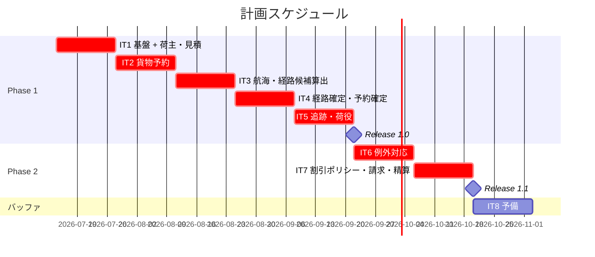
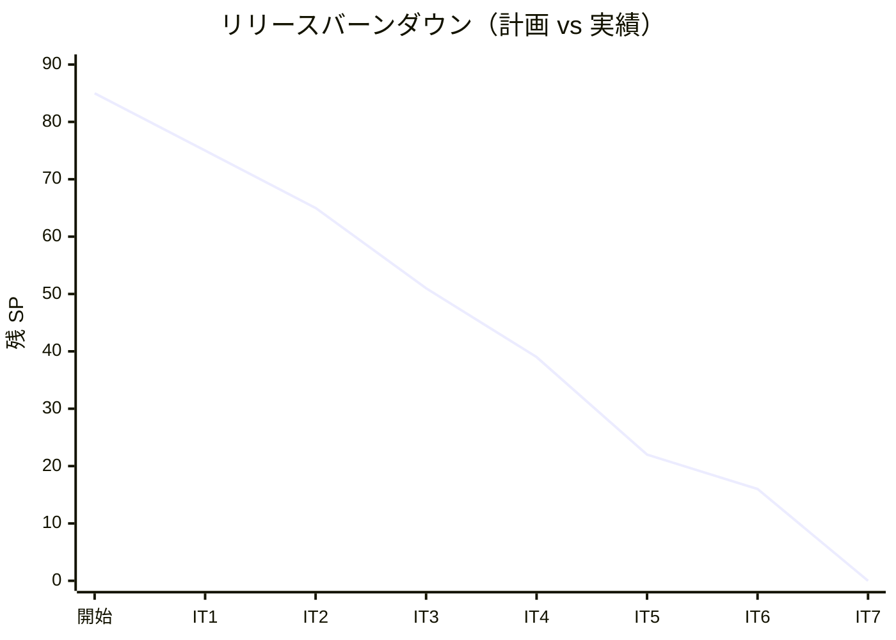

# リリース計画 - 国際貨物輸送管理システム（Cargo Tracker F# 版）

## 概要

本ドキュメントは、国際貨物輸送管理システム（Cargo Tracker F# 版）のリリース計画を定義します。
ユーザーストーリー × イテレーションの対応は本ドキュメントを Single Source of Truth とします。

### プロジェクト情報

| 項目 | 内容 |
|------|------|
| **プロジェクト名** | Cargo Tracker（国際貨物輸送管理システム F# 版） |
| **目的** | 予約から配送完了・精算までの一元管理（最適ルート自動提案・リアルタイム追跡・例外対応の迅速化） |
| **対象ユーザー** | 荷主・荷受人・営業担当者・経路設計者・追跡管理者・荷役作業員・経理担当者・運用管理者（8 アクター） |
| **開発チーム** | 開発者 1 名 + AI エージェント（XP プラクティス準拠） |

---

## 満足条件

### スコープ

DDD の複数コンテキストのうち中核（Booking・Routing・Tracking・Handling）を Release 1.0（MVP）で提供し、
例外対応の強化と Billing を Release 1.1 で追加する段階的リリース戦略を採用します。

| フェーズ | 内容 | ストーリー数 |
|---------|------|---------------|
| Phase 1（Release 1.0 / MVP） | 荷主・見積・予約・航海/経路設計・予約確定・追跡・荷役 | 21 US |
| Phase 2（Release 1.1） | 例外対応の強化・料金算出・法人割引・精算・割引ポリシー管理 | 6 US |
| **合計** | | **27 US** |

> **認証について**: F# 版のユーザーストーリー（`docs/requirements/user_story.md`）には認証を独立ストーリーとしていないため、
> 認証・RBAC（ASP.NET Core Cookie 認証・`requiresRole`）は IT1 の基盤タスクとして扱います（ストーリー外）。
> Phase 1 の 21 US は US01-US18・US24・US25 の 20 US に、認証基盤を加えて構成します（下表の SP 集計は US ベースで 20 US・63 SP）。

**スコープ外（本リリース計画に含めない）**:

- 税関・通関申告の業務ストーリー（対応 US が存在しない。必要になった時点で US を起こす。ACL ポート `CustomsClearancePort` は雛形のみ用意）
- 荷受人（Consignee）の集約化（US16/US18 は引取記録の属性と追跡番号照会で成立させる割り切り）
- イベントソーシング・Transactional Outbox（ADR の将来移行項目）

### スケジュール

- **開発期間**: 2026-07-14 〜 2026-10-31（約 3.5 ヶ月 + バッファ）
- **イテレーション**: 2 週間 × 7 + 予備 1
- **リリース**: Release 1.0（IT5 完了時）、Release 1.1（IT7 完了時）

### リソース

- **開発者**: 1 名（AI エージェント協働）
- **想定稼働時間**: 20 時間/週

---

## ユーザーストーリー一覧とストーリーポイント

### 優先順位マトリックス

4 軸評価で優先順位を決定:

1. **金銭価値（BV）**: ビジネス価値
2. **コスト（C）**: 開発コスト
3. **知識習得（KA）**: 技術的学習価値
4. **リスク軽減（RR）**: リスク軽減効果

### Phase 1: MVP — 予約から追跡まで（イテレーション 1-5）

| ID | ユーザーストーリー | SP | BV | C | KA | RR | 優先度 | IT |
|----|-------------------|----|----|---|----|----|--------|-----|
| US02 | 荷主を登録する | 3 | 中 | 低 | 高 | 高 | 必須 | IT1 |
| US03 | 法人荷主を登録する | 2 | 中 | 低 | 中 | 中 | 必須 | IT1 |
| US01 | 輸送見積を作成する | 5 | 高 | 中 | 高 | 中 | 必須 | IT1 |
| US04 | 貨物予約を登録する | 5 | 高 | 中 | 高 | 高 | 必須 | IT2 |
| US05 | 危険物・冷凍貨物の予約を登録する | 3 | 高 | 中 | 中 | 高 | 必須 | IT2 |
| US06 | 予約情報を経路設計者に引き渡す | 2 | 中 | 低 | 中 | 中 | 必須 | IT2 |
| US24 | 航海スケジュールを新規登録する | 3 | 高 | 低 | 中 | 高 | 必須 | IT3 |
| US25 | 既存航海スケジュールを更新する | 3 | 高 | 中 | 中 | 高 | 必須 | IT3 |
| US07 | 航海スケジュールを検索する | 3 | 高 | 低 | 中 | 中 | 必須 | IT3 |
| US08 | 経路候補を算出する | 5 | 高 | 高 | 高 | 高 | 必須 | IT3 |
| US09 | 経路を選択・確定する | 3 | 高 | 中 | 中 | 中 | 必須 | IT4 |
| US10 | 経路条件を調整して再算出する | 3 | 中 | 中 | 中 | 中 | 必須 | IT4 |
| US11 | 経路情報を予約に紐付ける | 2 | 高 | 低 | 中 | 中 | 必須 | IT4 |
| US12 | 確定経路を荷主に通知する | 2 | 中 | 低 | 中 | 低 | 必須 | IT4 |
| US13 | 予約を確定する | 2 | 高 | 低 | 中 | 中 | 必須 | IT4 |
| US14 | 追跡番号を発行する | 2 | 高 | 低 | 中 | 中 | 必須 | IT5 |
| US15 | 荷役作業を記録する | 5 | 高 | 中 | 高 | 高 | 必須 | IT5 |
| US16 | 引取作業を記録する | 3 | 高 | 低 | 中 | 中 | 必須 | IT5 |
| US17 | 貨物状態を手動更新する | 2 | 中 | 低 | 低 | 中 | 必須 | IT5 |
| US18 | 追跡情報を照会する | 5 | 高 | 中 | 高 | 中 | 必須 | IT5 |
| **合計** | | **63** | | | | | | |

### Phase 2: 例外対応・請求（イテレーション 6-7）

| ID | ユーザーストーリー | SP | BV | C | KA | RR | 優先度 | IT |
|----|-------------------|----|----|---|----|----|--------|-----|
| US19 | 遅延例外を処理する | 3 | 高 | 中 | 中 | 高 | 必須 | IT6 |
| US20 | 破損・紛失例外を処理する | 3 | 高 | 中 | 中 | 高 | 必須 | IT6 |
| US-ADM-01 | 割引ポリシーを管理する | 3 | 中 | 低 | 中 | 中 | 中 | IT7 |
| US21 | 輸送料金を算出する | 5 | 高 | 中 | 高 | 中 | 中 | IT7 |
| US22 | 法人割引を適用する | 3 | 中 | 低 | 中 | 低 | 中 | IT7 |
| US23 | 精算を処理する | 5 | 高 | 中 | 中 | 中 | 中 | IT7 |
| **合計** | | **22** | | | | | | |

### 全体サマリー

| フェーズ | ストーリーポイント | イテレーション |
|---------|-------------------|---------------|
| Phase 1 | 63 SP | 1-5 |
| Phase 2 | 22 SP | 6-7 |
| **合計** | **85 SP** | 7 イテレーション + 予備 1 |

> **Note**: IT1 にはストーリー外の基盤タスク（DbUp 起動時配線・UnitOfWork + post-commit イベント基盤・認証/RBAC・
> FsToolkit ROP ワークフロー雛形・ArchUnitNET ルール。ADR 参照実装）を含めるため、IT1 のストーリー SP は少なめに設定しています。
> US-ADM-01（割引ポリシー管理）は US22（法人割引）の前提マスタのため IT7 で US22 より先行して実装します。

---

## ベロシティ見積もり

### 初期ベロシティ推定

| 項目 | 値 |
|------|-----|
| **イテレーション期間** | 2 週間 |
| **チーム規模** | 1 名 + AI エージェント |
| **想定ベロシティ** | 12-15 SP/イテレーション |
| **バッファ係数** | 0.8（20% バッファ） |
| **実効ベロシティ** | 10-12 SP/イテレーション |

### ベロシティ検証計画

- IT1〜IT3 の実績でベロシティを較正し、IT3 終了時に本計画（IT 割り当て・リリース日）を再調整する
- 実績は各イテレーション完了報告書（`creating-iteration-report`）に記録し、本ドキュメントの進捗状況表へ転記する

---

## 段階的リリース戦略

### リリーススケジュール

#### 計画スケジュール

#### 実績スケジュール

| イテレーション | 計画 SP | 実績 SP | 状態 | 備考 |
|---------------|---------|---------|------|------|
| IT1 基盤 + 荷主・見積 | 10 | - | 未着手 | US02/US03/US01 + 技術基盤（DbUp・UoW + post-commit・認証/RBAC・ROP 雛形・ArchUnitNET） |
| IT2 貨物予約 | 10 | - | 未着手 | US04/US05/US06 |
| IT3 航海・経路算出 | 14 | - | 未着手 | US24/US25/US07/US08 |
| IT4 経路確定・予約確定 | 12 | - | 未着手 | US09/US10/US11/US12/US13 |
| IT5 追跡・荷役 | 17 | - | 未着手 | US14/US15/US16/US17/US18（Release 1.0 出荷） |
| IT6 例外対応 | 6 | - | 未着手 | US19/US20 |
| IT7 割引ポリシー・請求・精算 | 16 | - | 未着手 | US-ADM-01/US21/US22/US23（Release 1.1 出荷） |

（以降イテレーション完了ごとに更新）

### リリース内容

#### Release 1.0（Phase 1 完了）: MVP — 予約から追跡まで

**目標**: 荷主登録 → 見積 → 予約 → 経路設計 → 予約確定 → 荷役記録 → 追跡照会の業務フローが一気通貫で動作する。

**含まれる機能**:

- 認証・ロール別アクセス制御（基盤タスク）
- 荷主・法人荷主の登録（US02/03）、輸送見積（US01）
- 貨物予約（危険物・冷凍対応）と経路設計者への引き渡し（US04-06）
- 航海スケジュール管理・検索・経路候補算出・条件調整（US07-11、US24/25）
- 経路通知・予約確定・追跡番号発行（US12-14）
- 荷役・引取の記録と貨物状態管理・追跡照会（US15-18、公開追跡ページ含む）

**リリース条件**:

- [ ] 全ユニット・統合・アーキテクチャテストがパス（カバレッジ: ドメイン層 85% 以上）
- [ ] E2E 優先シナリオ（US13・US15・US18）がパス
- [ ] CI（Backend CI）グリーン、開発環境で業務フローのデモ完了
- [ ] セキュリティレビュー（認証・認可）完了

#### Release 1.1（Phase 2 完了）: 例外対応・請求

**目標**: 遅延・破損・紛失の例外対応と、料金算出から精算までの経理業務を提供する。

**含まれる機能**:

- 例外登録・エスカレーション・荷主通知（US19/20）
- 割引ポリシー管理（US-ADM-01）、輸送料金算出・法人割引・精算処理（US21-23）

**リリース条件**:

- [ ] 全テストがパス（カバレッジ維持）
- [ ] 金額計算の境界値テスト完了（Money 値オブジェクト・割引上限 30%）
- [ ] 性能スモーク（主要画面 p95 目標の確認）

---

## バッファ戦略

### フィーチャバッファ

| フェーズ | 計画 SP | バッファ（30%） | 実効 SP |
|---------|---------|-----------------|---------|
| Phase 1 | 63 | 19 | 44 |
| Phase 2 | 22 | 7 | 15 |

バッファ超過時に後回しする候補（優先度の低い順）: US17（手動更新）→ US10（条件調整の再算出）→ US22（法人割引）。

### スケジュールバッファ

- **予備イテレーション**: IT8（2026-10-20 〜 10-31）
- **全体バッファ**: 約 12%（1/8 イテレーション）

### バッファ消費ルール

1. フィーチャバッファを先に消費
2. 低優先度ストーリーを後回し
3. スケジュールバッファ（IT8）は最後の手段

---

## イテレーション計画概要

### イテレーション 1（2026-07-14 〜 07-25）

**ゴール**: 技術基盤（DbUp・UoW + post-commit イベント・認証/RBAC・FsToolkit ROP ワークフロー）を確立し、荷主登録と見積で最初の業務価値を届ける。

**主なタスク**:

- [ ] DbUp 起動時配線（SQLite / PostgreSQL、初期スキーマ 0001）＋ Testcontainers 統合テスト基盤
- [ ] AggregateRoot / UnitOfWork / post-commit ディスパッチの参照実装（ADR 参照）
- [ ] 認証（Cookie 認証・ロール別アクセス制御・ログイン/ログアウト画面）
- [ ] US02/US03 荷主登録（Shipper コンテキスト縦切り: Domain → Repository → 画面）
- [ ] US01 輸送見積（Estimation コンテキスト）

**目標 SP**: 10（+ 基盤タスク）

詳細は [iteration_plan-1.md](./iteration_plan-1.md) を参照。

### イテレーション 2（2026-07-28 〜 08-08）

**ゴール**: 貨物予約（危険物・冷凍対応）を登録し、経路設計者へ引き渡せる。

**目標 SP**: 10（US04/05/06）

### イテレーション 3（2026-08-11 〜 08-22）

**ゴール**: 航海スケジュールを管理し、外部経路サービス ACL 経由で経路候補を算出できる。

**目標 SP**: 14（US24/25/07/08）

### イテレーション 4（2026-08-25 〜 09-05）

**ゴール**: 経路の選択・調整・紐付けから予約確定・荷主通知までの予約フローが完結する。

**目標 SP**: 12（US09/10/11/12/13）

### イテレーション 5（2026-09-08 〜 09-19）

**ゴール**: 追跡番号発行・荷役/引取記録・追跡照会（公開ページ含む）が動作し、Release 1.0 を出荷する。

**目標 SP**: 17（US14/15/16/17/18）※ 超過分はフィーチャバッファで US17 を調整候補とする

### イテレーション 6（2026-09-22 〜 10-03）

**ゴール**: 遅延・破損・紛失の例外登録とエスカレーション・荷主通知が動作する。

**目標 SP**: 6（US19/20）+ Release 1.0 フィードバック対応

### イテレーション 7（2026-10-06 〜 10-17）

**ゴール**: 割引ポリシー管理・料金算出・法人割引・精算が動作し、Release 1.1 を出荷する。

**目標 SP**: 16（US-ADM-01/US21/22/23）

各イテレーションの詳細は着手時に `iteration_plan-N.md` として作成する。

---

## リスク管理

### 技術リスク

| リスク | 影響度 | 発生確率 | 対策 |
|--------|--------|----------|------|
| Donald + DDD 集約永続化の実装パターンが未確立 | 高 | 中 | IT1 で Shipper の参照実装を先行し、手書き SQL → レコードマッピングのパターンを確立してから横展開 |
| 二方言（SQLite/PostgreSQL）の実行時 SQL 方言漏れ | 中 | 中 | ANSI 標準に寄せ、方言差異は接続ファクトリと DbUp のプロバイダ別ディレクトリで吸収。方言検出テストを IT1 で CI に組み込む |
| 外部経路サービス ACL の契約不確定（US08） | 高 | 中 | WireMock.Net でスタブ契約を先に固定し、経路算出はスタブ駆動で実装（`ExternalRoutingPort` は関数レコード） |
| post-commit イベント基盤（MediatR 不使用の関数合成）の不具合が広範囲に波及 | 高 | 低 | IT1 でロールバック時非発行の統合テストを必須化 |
| F# ファイル順コンパイル制約による設計初期の手戻り | 中 | 中 | レイヤー順（Domain → Application → Infrastructure → Interfaces）の配置を IT1 で確立し、ArchUnitNET で補完検証 |

### スケジュールリスク

| リスク | 影響度 | 発生確率 | 対策 |
|--------|--------|----------|------|
| 初期ベロシティの見積り外れ | 中 | 高 | IT3 終了時に較正・計画改訂を必須イベントにする |
| IT5 の過積載（17 SP） | 中 | 中 | US17 を最初の切り出し候補として明示。IT4 で前倒し可能なら US14 を先行 |
| 1 名体制の稼働変動 | 中 | 中 | 予備 IT8 と 30% フィーチャバッファで吸収 |

---

## 進捗管理

### メトリクス

| メトリクス | 目標 |
|-----------|------|
| ベロシティ | 10-12 SP/イテレーション |
| テストカバレッジ | 80% 以上（ドメイン層 85% 以上） |
| バグ密度 | 0.5 件/SP 以下 |
| 予定達成率 | 90% 以上 |

### 進捗状況

| イテレーション | 計画 SP | 実績 SP | 達成率 | 状態 |
|---------------|---------|---------|--------|------|
| IT1 | 10 | - | - | 未着手 |
| IT2 | 10 | - | - | 未着手 |
| IT3 | 14 | - | - | 未着手 |
| IT4 | 12 | - | - | 未着手 |
| IT5 | 17 | - | - | 未着手 |
| IT6 | 6 | - | - | 未着手 |
| IT7 | 16 | - | - | 未着手 |

### バーンダウンチャート

---

## 次のステップ

1. `validating-iteration-plan` で本計画と設計ドキュメント群の整合性を検証する
2. `--iteration 1` で IT1 の詳細計画（タスク分解）を作成する
3. `syncing-github-project` で GitHub Project / Issue / Milestone に同期する

---

## 更新履歴

| 日付 | 更新内容 | 更新者 |
|------|---------|--------|
| 2026-07-14 | 初版作成（27 US・85 SP・7+1 イテレーション）。C# 版計画を F# 技術スタック（Giraffe/Donald/FsToolkit ROP・MediatR 不使用）に適応。認証を IT1 基盤タスク化、US-ADM-01 を IT7 に配置 | - |
