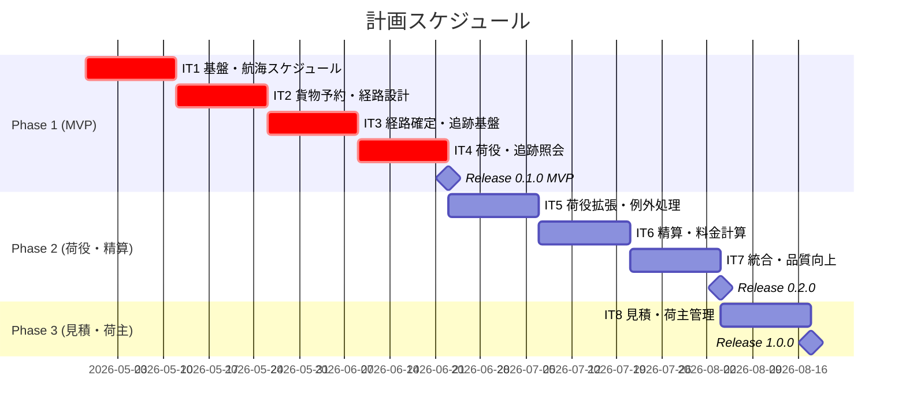
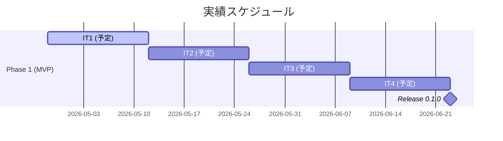
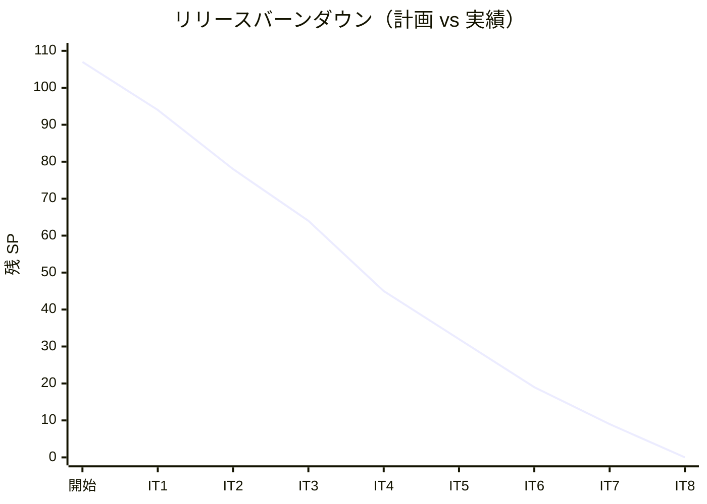

# リリース計画 - 国際貨物輸送管理システム

## 概要

本ドキュメントは、国際貨物輸送管理システム（Cargo Tracker）のリリース計画を定義します。

### プロジェクト情報

| 項目 | 内容 |
|------|------|
| **プロジェクト名** | 国際貨物輸送管理システム（Cargo Tracker） |
| **目的** | 貨物予約・経路設計・追跡・荷役・精算の一貫管理を実現する |
| **対象ユーザー** | 営業担当者・経路設計者・追跡管理者・荷役作業員・経理担当者 |
| **開発チーム** | 1 名 + AI ペアプログラミング |

---

## 満足条件

### スコープ

段階的リリース戦略を採用し、3 フェーズに分けて開発する。

| フェーズ | 内容 | ストーリー数 |
|---------|------|-------------|
| Phase 1 | MVP: 予約・経路設計・追跡の基幹フロー | 14 US |
| Phase 2 | 荷役・例外処理・精算 | 8 US |
| Phase 3 | 見積・荷主管理・高度な機能 | 3 US |
| **合計** | | **25 US** |

### スケジュール

- **開発期間**: 約 16 週間（4 ヶ月）
- **イテレーション**: 2 週間 × 8 イテレーション
- **リリース**: Phase 1 完了（IT4 後）→ Phase 2 完了（IT7 後）→ Phase 3 完了（IT8 後）

### リソース

- **開発者**: 1 名 + AI ペアプログラミング
- **想定稼働時間**: 20 時間/週

---

## ユーザーストーリー一覧とストーリーポイント

### 優先順位マトリックス

4 軸評価で優先順位を決定:

1. **金銭価値（BV）**: ビジネス価値
2. **コスト（C）**: 開発コスト
3. **知識習得（KA）**: 技術的学習価値
4. **リスク軽減（RR）**: リスク軽減効果

### Phase 1: MVP — 予約・経路設計・追跡（IT1〜IT4）

| ID | ユーザーストーリー | SP | BV | C | KA | RR | 優先度 |
|----|-------------------|----|----|---|----|----|--------|
| US24 | 航海スケジュールを新規登録する | 5 | 高 | 中 | 高 | 高 | 必須 |
| US25 | 既存航海スケジュールを更新する | 3 | 高 | 低 | 中 | 中 | 必須 |
| US04 | 貨物予約を登録する | 8 | 高 | 高 | 高 | 高 | 必須 |
| US07 | 航海スケジュールを検索する | 3 | 高 | 低 | 中 | 中 | 必須 |
| US08 | 経路候補を算出する | 8 | 高 | 高 | 高 | 高 | 必須 |
| US09 | 経路を選択・確定する | 5 | 高 | 中 | 中 | 高 | 必須 |
| US11 | 経路情報を予約に紐付ける | 3 | 高 | 低 | 低 | 中 | 必須 |
| US13 | 予約を確定する | 3 | 高 | 低 | 低 | 中 | 必須 |
| US14 | 追跡番号を発行する | 3 | 高 | 低 | 中 | 高 | 必須 |
| US15 | 荷役作業を記録する | 5 | 高 | 中 | 高 | 高 | 必須 |
| US17 | 貨物状態を手動更新する | 3 | 高 | 低 | 中 | 中 | 必須 |
| US18 | 追跡情報を照会する | 5 | 高 | 中 | 高 | 高 | 必須 |
| US06 | 予約情報を経路設計者に引き渡す | 3 | 中 | 低 | 中 | 中 | 必須 |
| US12 | 確定経路を荷主に通知する | 3 | 中 | 低 | 中 | 低 | 必須 |
| **合計** | | **60** | | | | | |

### Phase 2: 荷役・例外処理・精算（IT5〜IT7）

| ID | ユーザーストーリー | SP | BV | C | KA | RR | 優先度 |
|----|-------------------|----|----|---|----|----|--------|
| US16 | 引取作業を記録する | 3 | 高 | 低 | 低 | 中 | 必須 |
| US05 | 危険物・冷凍貨物の予約を登録する | 5 | 高 | 中 | 中 | 高 | 必須 |
| US10 | 経路条件を調整して再算出する | 5 | 中 | 中 | 中 | 中 | 中 |
| US19 | 遅延例外を処理する | 5 | 高 | 中 | 中 | 高 | 必須 |
| US20 | 破損・紛失例外を処理する | 5 | 高 | 中 | 中 | 高 | 必須 |
| US21 | 輸送料金を算出する | 5 | 高 | 中 | 高 | 中 | 中 |
| US22 | 法人割引を適用する | 3 | 中 | 低 | 低 | 低 | 中 |
| US23 | 精算を処理する | 5 | 高 | 中 | 中 | 中 | 中 |
| **合計** | | **36** | | | | | |

### Phase 3: 見積・荷主管理（IT8）

| ID | ユーザーストーリー | SP | BV | C | KA | RR | 優先度 |
|----|-------------------|----|----|---|----|----|--------|
| US01 | 輸送見積を作成する | 5 | 中 | 中 | 中 | 低 | 中 |
| US02 | 荷主を登録する | 3 | 中 | 低 | 低 | 低 | 中 |
| US03 | 法人荷主を登録する | 3 | 中 | 低 | 低 | 低 | 低 |
| **合計** | | **11** | | | | | |

### 全体サマリー

| フェーズ | ストーリーポイント | イテレーション |
|---------|-------------------|---------------|
| Phase 1（MVP） | 60 SP | IT1〜IT4 |
| Phase 2（荷役・精算） | 36 SP | IT5〜IT7 |
| Phase 3（見積・荷主） | 11 SP | IT8 |
| **合計** | **107 SP** | 8 イテレーション |

---

## ベロシティ見積もり

### 初期ベロシティ推定

| 項目 | 値 |
|------|-----|
| **イテレーション期間** | 2 週間 |
| **チーム規模** | 1 名 + AI |
| **想定ベロシティ** | 13〜18 SP/イテレーション |
| **バッファ係数** | 0.85（15% バッファ） |
| **実効ベロシティ** | 11〜15 SP/イテレーション |
| **採用ベロシティ** | 13 SP/イテレーション |

### ベロシティ検証計画

- IT1〜IT3 の実績ベロシティで計画を再調整する
- 実績が 10 SP 未満の場合、Phase 3 をスコープ外とする
- 実績が 18 SP 超の場合、前倒しでリリースする

---

## 段階的リリース戦略

### リリーススケジュール

#### 計画スケジュール

#### 実績スケジュール

### リリース内容

#### Release 0.1.0（Phase 1 完了）: MVP

**目標**: 貨物予約→経路設計→追跡の基幹フローが動作する最小限の製品

**含まれる機能**:

- 航海スケジュール登録・検索
- 貨物予約の登録・確定
- 経路候補算出・選択・紐付け
- 追跡番号発行・荷役記録・状態更新・追跡照会

**リリース条件**:

- [ ] 全ユニットテストがパス
- [ ] アーキテクチャテストがパス
- [ ] 基幹フロー E2E テストがパス
- [ ] テストカバレッジ 80% 以上

#### Release 0.2.0（Phase 2 完了）: 荷役・精算

**目標**: 荷役拡張、例外処理、精算機能を追加

**含まれる機能**:

- 引取作業記録・危険物予約
- 遅延・破損例外処理
- 輸送料金算出・法人割引・精算

**リリース条件**:

- [ ] 全テストがパス
- [ ] 例外処理のシナリオテスト完了

#### Release 1.0.0（Phase 3 完了）: 完成版

**目標**: 見積・荷主管理を追加し、全機能を完成

---

## バッファ戦略

### フィーチャバッファ

| フェーズ | 計画 SP | バッファ（30%） | 実効 SP |
|---------|---------|-----------------|---------|
| Phase 1 | 60 | 18 | 42 |
| Phase 2 | 36 | 11 | 25 |
| Phase 3 | 11 | 3 | 8 |

### スケジュールバッファ

- **予備イテレーション**: IT8 を Phase 3 + バッファとして運用
- **全体バッファ**: 約 15%（ベロシティ係数 0.85）

### バッファ消費ルール

1. フィーチャバッファを先に消費
2. 低優先度ストーリーを後回し（US03, US22 が候補）
3. スケジュールバッファは最後の手段

---

## イテレーション計画概要

### イテレーション 1（Week 1-2: 2026-04-28〜2026-05-09）

**ゴール**: 航海スケジュール CRUD と Routing Service の基盤を構築する

**主なタスク**:

- [ ] US24: 航海スケジュールを新規登録する（5 SP）
- [ ] US25: 既存航海スケジュールを更新する（3 SP）
- [ ] US07: 航海スケジュールを検索する（3 SP）
- [ ] 環境セットアップ: routingms の TDD 開発基盤構築（2 SP）

**目標 SP**: 13

詳細は [iteration_plan-1.md](./iteration_plan-1.md) を参照。

### イテレーション 2（Week 3-4: 2026-05-12〜2026-05-23）

**ゴール**: 貨物予約の登録と経路候補算出を実装する

**主なタスク**:

- [ ] US04: 貨物予約を登録する（8 SP）
- [ ] US08: 経路候補を算出する（8 SP）

**目標 SP**: 16

### イテレーション 3（Week 5-6: 2026-05-26〜2026-06-06）

**ゴール**: 経路確定・追跡番号発行の一連のフローを完成する

**主なタスク**:

- [ ] US09: 経路を選択・確定する（5 SP）
- [ ] US11: 経路情報を予約に紐付ける（3 SP）
- [ ] US13: 予約を確定する（3 SP）
- [ ] US14: 追跡番号を発行する（3 SP）

**目標 SP**: 14

### イテレーション 4（Week 7-8: 2026-06-09〜2026-06-20）

**ゴール**: 荷役記録・追跡照会で MVP を完成する

**主なタスク**:

- [ ] US15: 荷役作業を記録する（5 SP）
- [ ] US17: 貨物状態を手動更新する（3 SP）
- [ ] US18: 追跡情報を照会する（5 SP）
- [ ] US06: 予約情報を経路設計者に引き渡す（3 SP）
- [ ] US12: 確定経路を荷主に通知する（3 SP）

**目標 SP**: 19（バッファ消費を含む）

### イテレーション 5（Week 9-10: 2026-06-23〜2026-07-04）

**ゴール**: 荷役拡張と例外処理を実装する

**目標 SP**: 13

### イテレーション 6（Week 11-12: 2026-07-07〜2026-07-18）

**ゴール**: 精算機能と料金計算を実装する

**目標 SP**: 13

### イテレーション 7（Week 13-14: 2026-07-21〜2026-08-01）

**ゴール**: Phase 2 の統合テストと品質向上

**目標 SP**: 10

### イテレーション 8（Week 15-16: 2026-08-04〜2026-08-15）

**ゴール**: 見積・荷主管理を追加し全機能を完成する

**目標 SP**: 11

---

## リスク管理

### 技術リスク

| リスク | 影響度 | 発生確率 | 対策 |
|--------|--------|----------|------|
| Spring Cloud Gateway と Spring Boot 4.x の互換性 | 中 | 低 | Gateway 5.0.1 で解決済み。WebFlux フォールバックを用意 |
| マイクロサービス間通信の複雑さ | 高 | 中 | IT1 で RabbitMQ 疎通を検証。Spring Cloud Stream で抽象化 |
| MyBatis + CQRS の実装パターン確立 | 中 | 中 | IT1 で基準ストーリー（US24）でパターンを確立 |

### スケジュールリスク

| リスク | 影響度 | 発生確率 | 対策 |
|--------|--------|----------|------|
| ベロシティが想定を下回る | 高 | 中 | IT3 後にベロシティ再評価。Phase 3 をスコープ調整 |
| 外部要因による中断 | 中 | 低 | フィーチャバッファ 30% を確保 |

---

## 進捗管理

### メトリクス

| メトリクス | 目標 |
|-----------|------|
| ベロシティ | 13 SP/イテレーション |
| テストカバレッジ | 80% 以上 |
| バグ密度 | 1.0 件/SP 以下 |
| 予定達成率 | 90% 以上 |

### 進捗状況

| イテレーション | 計画 SP | 実績 SP | 達成率 | 状態 |
|---------------|---------|---------|--------|------|
| IT1 | 13 | - | - | 未着手 |
| IT2 | 16 | - | - | 未着手 |
| IT3 | 14 | - | - | 未着手 |
| IT4 | 19 | - | - | 未着手 |
| IT5 | 13 | - | - | 未着手 |
| IT6 | 13 | - | - | 未着手 |
| IT7 | 10 | - | - | 未着手 |
| IT8 | 11 | - | - | 未着手 |

### バーンダウンチャート

---

## 次のステップ

1. GitHub Project に Issue / Milestone を同期する
2. イテレーション 1 の詳細計画を作成する
3. IT1 の開発を開始する

---

## 更新履歴

| 日付 | 更新内容 | 更新者 |
|------|---------|--------|
| 2026-04-25 | 初版作成 | - |
