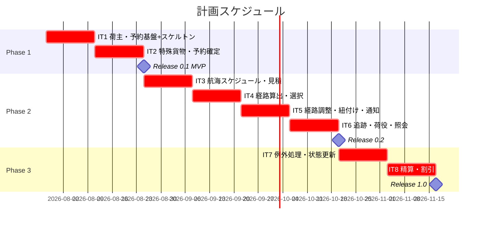
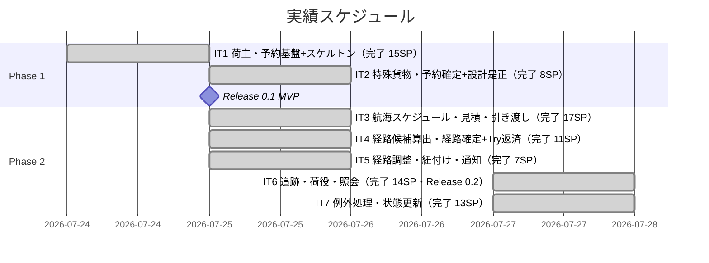
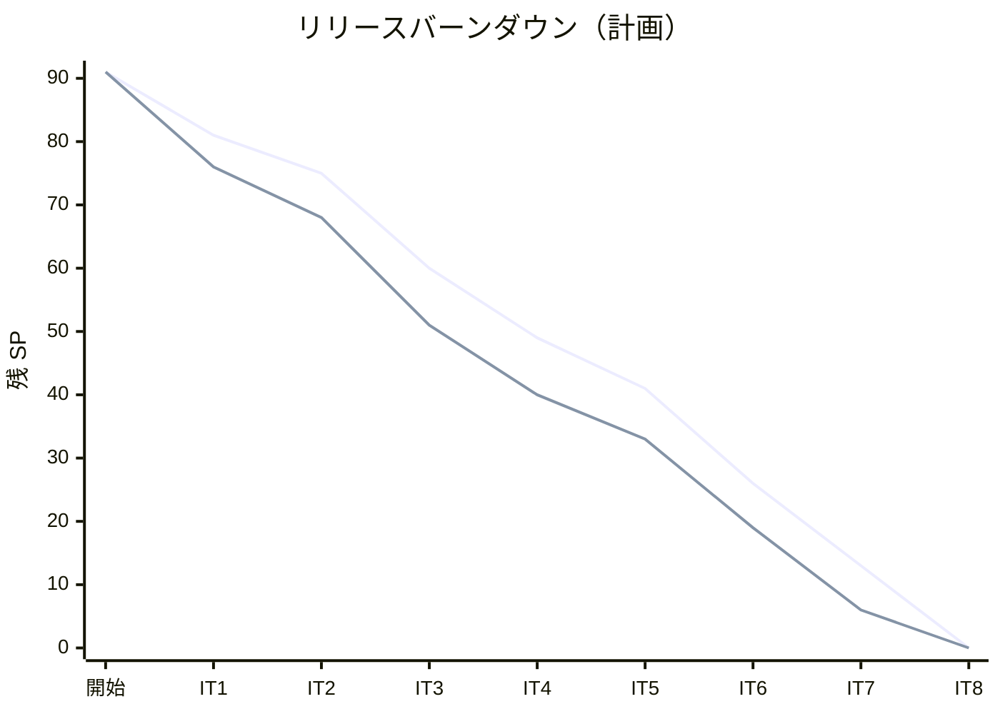

# リリース計画 - 国際貨物輸送管理システム（Go 版）

## 概要

本ドキュメントは、国際貨物輸送管理システム（Go 版）のリリース計画を定義する。Jakarta EE 参考実装の業務ドメインを Go（DDD・ヘキサゴナル・CQRS）で再実装する。イテレーション × ユーザーストーリーの割り当てに関する **Single Source of Truth** であり、[開発戦略](development_strategy.md) の局面割り当ては本計画に追従する。

### プロジェクト情報

| 項目 | 内容 |
|------|------|
| **プロジェクト名** | 国際貨物輸送管理システム（Cargo Tracker / Go 版） |
| **目的** | 予約・経路設計・貨物追跡・精算をカバーする国際輸送業務の効率化 |
| **対象ユーザー** | 予約担当者・経路設計者・オペレーション担当・精算担当 |
| **開発チーム** | 1 名（AI ペアプログラミングによる開発） |

---

## 満足条件

### スコープ

要件定義の 25 ユーザーストーリー（US01〜US25）を、業務の依存関係に沿って 3 フェーズに分けて段階的にリリースする。予約・荷主の基盤を最初に通し（MVP）、次に経路設計・追跡という中核ドメインを作り込み、最後に精算・例外処理で全体を仕上げる。

| フェーズ | 内容 | US 数 | ユースケース |
|---------|------|-------|-------------|
| Phase 1 | 予約・荷主管理基盤 | 5 US | UC02, UC03, UC11 |
| Phase 2 | 経路設計・貨物追跡 | 14 US | UC01, UC04〜UC10, UC12, UC13, UC15, UC19 |
| Phase 3 | 精算・例外処理 | 6 US | UC14, UC16, UC17, UC18 |
| **合計** | | **25 US** | |

### スケジュール

- **開発期間**: 16 週間（8 イテレーション）
- **イテレーション**: 2 週間 × 8 イテレーション
- **開始日**: 2026-07-28
- **リリース**: Phase 1 完了で Release 0.1 MVP、Phase 2 完了で Release 0.2、Phase 3 完了で Release 1.0（全機能）

### リソース

- **開発者**: 1 名（AI ペアプログラミング）
- **想定稼働時間**: 2 週間あたり実効 10-13 SP

---

## ユーザーストーリー一覧とストーリーポイント

### 優先順位マトリックス

4 軸評価で優先順位を決定する。

1. **金銭価値（BV）**: ビジネス価値
2. **コスト（C）**: 開発コスト
3. **知識習得（KA）**: 技術的学習価値
4. **リスク軽減（RR）**: リスク軽減効果

### Phase 1: 予約・荷主管理基盤（イテレーション 1-2）

| ID | ユーザーストーリー | SP | BV | C | KA | RR | 優先度 |
|----|-------------------|----|----|---|----|----|--------|
| US26 | システムにログインする | 5 | 高 | 中 | 高 | 高 | 必須 |
| US02 | 荷主を登録する | 3 | 高 | 低 | 高 | 高 | 必須 |
| US03 | 法人荷主を登録する | 2 | 高 | 低 | 中 | 中 | 必須 |
| US04 | 貨物予約を登録する | 5 | 高 | 中 | 高 | 高 | 必須 |
| US05 | 危険物・冷凍貨物の予約を登録する | 3 | 高 | 中 | 中 | 中 | 必須 |
| US13 | 予約を確定する | 3 | 高 | 中 | 中 | 高 | 必須 |
| **合計** | | **16** | | | | | |

### Phase 2: 経路設計・貨物追跡（イテレーション 3-6）

| ID | ユーザーストーリー | SP | BV | C | KA | RR | 優先度 |
|----|-------------------|----|----|---|----|----|--------|
| US24 | 航海スケジュールを新規登録する | 3 | 高 | 中 | 中 | 高 | 必須 |
| US25 | 既存航海スケジュールを更新する | 2 | 中 | 低 | 低 | 中 | 必須 |
| US07 | 航海スケジュールを検索する | 5 | 高 | 高 | 高 | 高 | 必須 |
| US01 | 輸送見積を作成する | 5 | 高 | 中 | 中 | 中 | 必須 |
| US06 | 予約情報を経路設計者に引き渡す | 2 | 高 | 低 | 低 | 中 | 必須 |
| US08 | 経路候補を算出する | 8 | 高 | 高 | 高 | 高 | 必須 |
| US09 | 経路を選択・確定する | 3 | 高 | 中 | 低 | 中 | 必須 |
| US10 | 経路条件を調整して再算出する | 3 | 中 | 中 | 中 | 中 | 中 |
| US11 | 経路情報を予約に紐付ける | 2 | 高 | 低 | 低 | 中 | 必須 |
| US12 | 確定経路を荷主に通知する | 2 | 中 | 低 | 低 | 低 | 中 |
| US14 | 追跡番号を発行する | 3 | 高 | 低 | 中 | 高 | 必須 |
| US15 | 荷役作業を記録する | 5 | 高 | 中 | 中 | 高 | 必須 |
| US16 | 引取作業を記録する | 3 | 高 | 中 | 中 | 中 | 必須 |
| US18 | 追跡情報を照会する | 3 | 高 | 中 | 中 | 高 | 必須 |
| **合計** | | **49** | | | | | |

### Phase 3: 精算・例外処理（イテレーション 7-8）

| ID | ユーザーストーリー | SP | BV | C | KA | RR | 優先度 |
|----|-------------------|----|----|---|----|----|--------|
| US17 | 貨物状態を手動更新する | 3 | 中 | 低 | 低 | 中 | 中 |
| US19 | 遅延例外を処理する | 5 | 高 | 中 | 中 | 高 | 必須 |
| US20 | 破損・紛失例外を処理する | 5 | 高 | 中 | 中 | 高 | 必須 |
| US21 | 輸送料金を算出する | 5 | 中 | 中 | 中 | 中 | 中 |
| US22 | 法人割引を適用する | 3 | 中 | 低 | 低 | 低 | 中 |
| US23 | 精算を処理する | 5 | 中 | 中 | 中 | 中 | 中 |
| **合計** | | **26** | | | | | |

### 全体サマリー

| フェーズ | ストーリーポイント | イテレーション |
|---------|-------------------|---------------|
| Phase 1 | 21 SP | 1-2 |
| Phase 2 | 49 SP | 3-6 |
| Phase 3 | 26 SP | 7-8 |
| **合計** | **96 SP** | 8 イテレーション |

---

## ベロシティ見積もり

### 初期ベロシティ推定

| 項目 | 値 |
|------|-----|
| **イテレーション期間** | 2 週間 |
| **チーム規模** | 1 名（AI ペアプログラミング） |
| **想定ベロシティ** | 12-16 SP/イテレーション |
| **バッファ係数** | 0.8（20%バッファ） |
| **実効ベロシティ** | 10-13 SP/イテレーション |

序盤の IT1-2 はウォーキングスケルトン構築・E2E 基盤（Playwright）セットアップ・アーキテクチャ立ち上げのオーバーヘッドを含むため、フィーチャ実現の実効ベロシティは他局面より低め（8-11 SP/IT）を見込む。

### ベロシティ検証計画

- イテレーション 1-2 の実績ベロシティを計測し、Phase 2 以降のイテレーション配分を調整する。
- 3 イテレーション完了時点でベロシティが安定するため、その時点で全体計画を再見積もりする。
- 実績は `iteration_plan-N.md` と本計画の「進捗状況」に反映する。

---

## 段階的リリース戦略

### リリーススケジュール

#### 計画スケジュール

#### 実績スケジュール

### リリース内容

#### Release 0.1（Phase 1 完了）: 予約・荷主管理 MVP

**目標**: 荷主登録から貨物予約・予約確定までの基幹フローを、画面から DB まで通しで成立させる。ウォーキングスケルトンで全ルートのナビゲーションと E2E 基盤を確立する。

**含まれる機能**:

- 荷主・法人荷主の登録（US02, US03）
- 貨物予約・特殊貨物予約の登録（US04, US05）
- 予約の確定（US13）

**リリース条件**:

- [ ] 全ユニットテストがパス（`make test`）
- [ ] 全ルートのナビゲーション E2E がパス（Playwright）
- [ ] `make check`（build + test + lint + arch）が green
- [ ] セキュリティレビュー（`security-review`）完了

#### Release 0.2（Phase 2 完了）: 経路設計・貨物追跡

**目標**: 航海スケジュール・経路算出・経路確定・貨物追跡という中核ドメインを実装し、輸送の設計〜追跡までを提供する。

**含まれる機能**:

- 航海スケジュール登録・更新・検索（US24, US25, US07）
- 輸送見積・経路設計への引き渡し（US01, US06）
- 経路候補算出・選択・調整・紐付け・通知（US08〜US12）
- 追跡番号発行・荷役/引取記録・追跡照会（US14, US15, US16, US18）

**リリース条件**:

- [ ] 全テストがパス（`make test-all`）
- [ ] 各 IT のデモ項目 E2E がパス
- [ ] パフォーマンステスト（経路算出）完了

#### Release 1.0（Phase 3 完了）: 精算・例外処理（全機能）

**目標**: 遅延・破損・紛失の例外処理と、料金算出・法人割引・精算を実装し、全 25 ストーリーを完成させる。

**含まれる機能**:

- 貨物状態の手動更新（US17）
- 遅延・破損・紛失の例外処理（US19, US20）
- 輸送料金算出・法人割引・精算（US21, US22, US23）

**リリース条件**:

- [ ] 全 US の受け入れ基準を満たす
- [ ] クリティカルパスの E2E がパス
- [ ] 全 IT のデモ項目 E2E が回帰実行で green

---

## バッファ戦略

### フィーチャバッファ

| フェーズ | 計画 SP | バッファ（30%） | 実効 SP |
|---------|---------|-----------------|---------|
| Phase 1 | 16 | 5 | 21 |
| Phase 2 | 49 | 15 | 64 |
| Phase 3 | 26 | 8 | 34 |

### スケジュールバッファ

- **予備イテレーション**: 明示的な予備イテレーションは設けず、各フェーズのフィーチャバッファ（30%）で吸収する。
- **全体バッファ**: 中優先度ストーリー（US10, US12, US21, US22, US23）を調整弁とする。

### バッファ消費ルール

1. フィーチャバッファを先に消費する。
2. 低・中優先度ストーリー（US10, US12, US21, US22, US23）を後回しにする。
3. スケジュールバッファ（イテレーション追加）は最後の手段とする。

---

## イテレーション計画概要

### イテレーション 1（Week 1-2）

**ゴール**: 荷主・貨物予約の登録を縦切りで通し、ウォーキングスケルトン（全ルートのナビゲーション + Playwright E2E 基盤）を確立する。

**主なタスク**:

- [ ] Playwright E2E 基盤セットアップと全ナビゲーション E2E
- [ ] US02 荷主を登録する
- [ ] US03 法人荷主を登録する
- [ ] US04 貨物予約を登録する

**目標 SP**: 10

詳細は [iteration_plan-1.md](./iteration_plan-1.md) を参照。

### イテレーション 2（Week 3-4）

**ゴール**: 特殊貨物予約と予約確定を実装し、Phase 1（予約・荷主基盤 MVP）を完了する。

**主なタスク**:

- [ ] US05 危険物・冷凍貨物の予約を登録する
- [ ] US13 予約を確定する
- [ ] Release 0.1 MVP のリリース条件充足

**目標 SP**: 6

詳細は [iteration_plan-2.md](./iteration_plan-2.md) を参照。

### イテレーション 3 以降

Phase 2・Phase 3 のイテレーション（IT3-8）は、IT1-2 のベロシティ実績を反映してから `--iteration <N>` で詳細化する。現時点の暫定配分は以下。

- **IT3**: 航海スケジュール登録・更新・検索、輸送見積、経路設計引き渡し（US24, US25, US07, US01, US06）
- **IT4**: 経路候補算出・選択（US08, US09）
- **IT5**: 経路調整・紐付け・通知（US10, US11, US12）
- **IT6**: 追跡番号発行・荷役/引取記録・追跡照会（US14, US15, US16, US18）→ Release 0.2
- **IT7**: 貨物状態更新・遅延/破損/紛失例外（US17, US19, US20）
- **IT8**: 料金算出・法人割引・精算（US21, US22, US23）→ Release 1.0

---

## リスク管理

### 技術リスク

| リスク | 影響度 | 発生確率 | 対策 |
|--------|--------|----------|------|
| 経路候補算出（US08, 8SP）の探索ロジックが複雑で見積超過 | 高 | 中 | 中盤インサイドアウトで domain 層から先に固め、探索アルゴリズムをユニットテストで隔離検証する |
| BC 間の直接依存混入によるアーキテクチャ劣化 | 高 | 中 | `make arch`（go-arch-lint）を常時グリーンで維持し、BC 間はイベント/ACL ポート経由に限定する |
| Playwright E2E のフレイキー化（htmx ポーリング等） | 中 | 中 | E2E はクリティカルパス+デモ項目に限定し、待機条件を明示。統合テストで補完する |
| sqlc + pgx の学習コストによる序盤の低速化 | 中 | 中 | 序盤の実効ベロシティを低め（8-11 SP/IT）に見積もり、IT1-2 実績で再調整する |

### スケジュールリスク

| リスク | 影響度 | 発生確率 | 対策 |
|--------|--------|----------|------|
| Phase 2（49SP）が 4 イテレーションに収まらない | 高 | 中 | 中優先度の US10・US12 を Phase 2 内バッファとし、超過時は後続へ繰り延べる |
| 初期ベロシティ推測値が実績と乖離 | 中 | 高 | 3 IT 完了時点で全体を再見積もりし、フェーズ境界を調整する |

---

## 進捗管理

### メトリクス

| メトリクス | 目標 |
|-----------|------|
| ベロシティ | 10-13 SP/イテレーション |
| テストカバレッジ | ドメイン層 90%・全体 80% 以上 |
| バグ密度 | 0.5 件/SP 以下 |
| 予定達成率 | 90% 以上 |

### 進捗状況

| イテレーション | 計画 SP | 実績 SP | 達成率 | 状態 |
|---------------|---------|---------|--------|------|
| 1 | 15 | 15 | 100% | 完了 |
| 2 | 6 | 8 | 100% | 完了 |
| 3 | 17 | 17 | 100% | 完了 |
| 4 | 11 | 11 | 100% | 完了 |
| 5 | 7 | 7 | 100% | 完了 |
| 6 | 14 | 14 | 100% | 完了 |
| 7 | 13 | 13 | 100% | 完了 |
| 8 | 13 | 13 | 100% | 完了（Release 1.0 到達・US01/US-ADM-01 追加実装） |

### バーンダウンチャート

> 実績（IT1-8 完了時）: 開始 91 → IT1 -15=76 → IT2 -8=68 → IT3 -17=51 → IT4 -11=40 → IT5 -7=33 → IT6 -14=19 → IT7 -13=6 → IT8 -6=0。**Phase 3 完了・Release 1.0（全機能・全 25 US）到達**。IT8 は精算 3 ストーリー（US21/US22/US23・13SP）に加え、ウォーキングスケルトンのプレースホルダ 2 画面（US01 ダッシュボード・US-ADM-01 割引ポリシー管理）をクローズ時に実装し Discount Policy Context を新設（ADR-0010）。

---

## 次のステップ

1. `planning-releases --iteration 1` で IT1 の詳細計画（タスク分解・スケジュール・デモ項目）を作成する。
2. `validating-design` で開発戦略・リリース計画・設計ドキュメントの局面整合を検証する。
3. `syncing-github-project` で go/take-1 用の Milestone・Issue を GitHub に同期する。

---

## 更新履歴

| 日付 | 更新内容 | 更新者 |
|------|---------|--------|
| 2026-07-24 | 初版作成。US01〜US25 を Phase 1（IT1-2）・Phase 2（IT3-6）・Phase 3（IT7-8）の 8 イテレーション・91 SP に配分。 | - |
