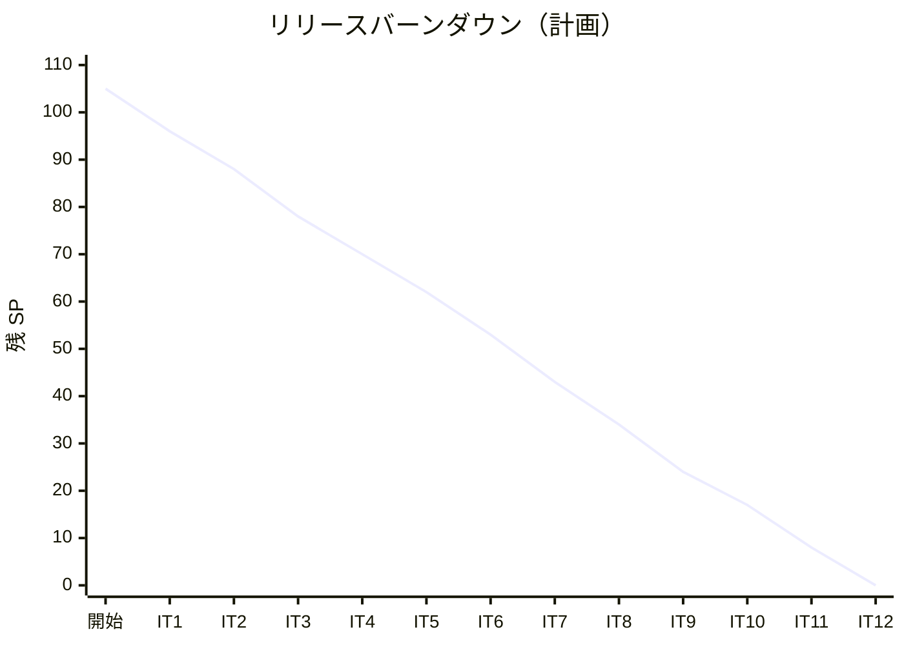

# リリース計画 - 国際貨物輸送管理システム（java/take-7）

## 概要

本ドキュメントは、国際貨物輸送管理システム（マイクロサービス構成）のリリース計画を定義します。

### プロジェクト情報

| 項目 | 内容 |
|------|------|
| **プロジェクト名** | 国際貨物輸送管理システム（Cargo Tracker） |
| **目的** | 国際貨物輸送の予約から追跡・精算までを一貫して管理し、予約業務の効率化・最適ルート設計・リアルタイム追跡・例外対応の迅速化を実現する |
| **対象ユーザー** | 荷主・荷受人・営業担当者・経路設計者・追跡管理者・荷役作業員・経理担当者 |
| **開発チーム** | 1 名（AI ペアプログラミング） |
| **ブランチ** | `java/take-7` |
| **構成** | マイクロサービス 7 サービス（gateway/auth/booking/routing/tracking/handling/billing）+ React SPA |

---

## 満足条件

### スコープ

Release 0.1〜1.0 で「**予約から追跡までが一本つながる**」ことを最優先とします。幅を広げるより、細くても端から端までつながっていることを優先します（ウォーキングスケルトン）。遅延・破損の例外処理（US19・US20）は輸送が動き出す Release 1.0 に含めます（輸送開始後に遅延を記録できない期間を作らないため — レビュー H9）。take-7 の要件差分のうち誤配（US28）・通関（US29）・キャンセル承認（US30）は Release 1.1 に置き、一気通貫の成立後に取り組みます。

| リリース | 内容 | US 数 | SP |
|---------|------|------|-----|
| Release 0.1 | 予約基盤（認証・荷主・予約） | 7 | 17 |
| Release 0.2 | 経路設計・予約確定 | 12 | 35 |
| Release 1.0 | 荷役・追跡・例外（予約から追跡までの一気通貫） | 6 | 19 |
| Release 1.1 | 誤配・通関・キャンセル承認 | 3 | 17 |
| Release 2.0 | 精算・見積 | 4 | 17 |
| **合計** | | **32** | **105** |

> **合計は明細から導きます。手で持つと必ずずれます**（take-6 の教訓）。
> 突き合わせる相手は明細ではなく **US の全件（US01〜US32）** です。全 32 件がいずれかのリリースに属することを、リリース変更のたびに確認してください。

> **US02（荷主登録）と US24（航海スケジュール登録）は他ストーリーの入力データを作るため、先行して着手しなければ後続が動作確認できません。**

### 各リリースで業務を回せるロール

**Release 0.1・0.2 は社内検証用であり、業務投入しません**（レビュー H12）。実データを入れると経路設計者が気づかない仮受付が溜まる等の問題が起きます。実運用を開始できるのは Release 1.0 からです。

| リリース | 業務を回せるロール | 従来手順を続けるロール |
|---------|------------------|----------------------|
| Release 0.1 | なし（社内検証のみ） | 全ロール |
| Release 0.2 | なし（社内検証のみ） | 全ロール |
| Release 1.0 | 営業担当者・経路設計者・荷役作業員・追跡管理者・荷主/荷受人（追跡照会） | 経理担当者（請求は手作業）。**引取は通関書類の目視確認を運用条件とする**（通関ガードは 1.1。レビュー H12） |
| Release 1.1 | 上記 + 通関・キャンセル承認のワークフロー | 経理担当者 |
| Release 2.0 | 全ロール | - |

### スケジュール

- **開発期間**: 12 イテレーション + 予備 1（約 26 週間）
- **イテレーション**: 1 イテレーション = 2 週間
- **リリース**: イテレーション末に動作するソフトウェアを開発環境（Heroku）へデプロイする（小さなリリース）

### リソース

- **開発者**: 1 名
- **ベロシティ（初期値）**: **10SP / イテレーション**

> **初期ベロシティの根拠**: 同一題材の他 take の実績から推定しています。`java/take-6` 12SP 初期値（モノリス）、`flix/take-1` 12.3SP、`haskell/take-1` 10.6SP、`scala/take-1` 10.1SP。
> take-7 は**マイクロサービス構成のため、サービス間の配線（イベント・契約テスト・ACL）が 1 ストーリーあたりのコストを押し上げます**。一方で環境（Gradle マルチプロジェクト・kind・Heroku・CI 相当のタスク・JIG）は構築済みです。両者を相殺し、take-6 より低い 10SP を初期値とします。**これは推測であり、3 イテレーション経過後に実績で再調整します。**
> **全イテレーションを 7〜10SP に収めています**（レビュー H2。計画時点で守れない数字を置くとベロシティ検証が初回から機能しないため）。

---

## ユーザーストーリー一覧とストーリーポイント

### 優先順位マトリックス

4 軸で評価します。

1. **金銭価値（BV）**: ビジネス価値
2. **コスト（C）**: 開発コスト
3. **知識習得（KA）**: 技術的学習価値
4. **リスク軽減（RR）**: リスク軽減効果

> **優先度列は正典 `docs/requirements/user_story.md` の値をそのまま使います**（レビュー H1。計画側で独自の優先度を持つと、バッファ判断の根拠が正典と食い違うため）。「どの US を先に落とすか」は優先度ではなく**バッファ戦略の表**（落としたときの業務影響の小ささ）で管理します。優先度とスケジュール順序は別の概念です。

> **SP 補正の内訳**: take-6（同一題材・モノリス）の実績値を基準に、サービス間結合を伴うストーリーに補正を加えています。US09 +1（bookingms ⇄ routingms 同期）、US11 +0（ACL は US09 と同経路）、US14 +1（初のイベント）、**US15 +2（handlingms→trackingms イベントに加え bookingms の snapshot API + ACL + 契約テストを含む — レビュー H3）**、**US21 +2（billingms に加え trackingms の DELIVERED 判定・CargoDeliveredEvent 発行を含む — レビュー H4）**、**US28 +2（検知 = handlingms の ACL 照合、起票 = trackingms・bookingms、再設計 = bookingms→routingms の 4 サービス — レビュー H5）**。

### Release 0.1: 予約基盤（IT1〜IT2）

認証（authms）と予約（bookingms）を立ち上げ、Gateway 経由で一連の操作ができる状態にします。

| ID | ユーザーストーリー | SP | BV | C | KA | RR | 優先度（正典） | 主なサービス |
|----|-------------------|----|----|---|----|----|--------|-------------|
| US26 | システムにログインする | 3 | 中 | 中 | 高 | 高 | 高 | authms, gatewayms |
| US27 | システムからログアウトする | 1 | 低 | 低 | 低 | 中 | 中 | authms |
| US31 | 認証失敗が続いたアカウントを保護する | 2 | 中 | 低 | 中 | 高 | 高 | authms |
| US02 | 荷主を登録する | 3 | 高 | 中 | 中 | 高 | 高 | bookingms |
| US03 | 法人荷主を登録する | 1 | 中 | 低 | 低 | 中 | 高 | bookingms |
| US04 | 貨物予約を登録する | 5 | 高 | 高 | 高 | 高 | 高 | bookingms |
| US05 | 危険物・冷凍貨物の予約を登録する | 2 | 中 | 低 | 中 | 中 | 高 | bookingms |
| **合計** | | **17** | | | | | | |

> **US31 を Release 0.1 に置く理由**: 認証の作り直しは後になるほど高くつきます。ロック（失敗回数・ロック期限のカラム永続化、同一エラーメッセージ）は US26 と同じテーブル・同じエンドポイントを触るため、同時に作るのが最も安い。なお US26 と US31 は実質分離できないため（INVEST の Independent を意図的に諦めている）、**US31 を単独で先送りすることはできません**。

### Release 0.2: 経路設計・予約確定（IT3〜IT6）

routingms を立ち上げ、bookingms との同期連携（ACL 経由）とイベント駆動（booking → tracking）の最初の 1 本を通します。

| ID | ユーザーストーリー | SP | BV | C | KA | RR | 優先度（正典） | 主なサービス |
|----|-------------------|----|----|---|----|----|--------|-------------|
| US24 | 航海スケジュールを新規登録する | 3 | 高 | 中 | 中 | 高 | 高 | routingms |
| US25 | 既存航海スケジュールを更新する | 2 | 中 | 低 | 低 | 中 | 高 | routingms |
| US06 | 予約情報を経路設計者に引き渡す | 2 | 中 | 低 | 中 | 中 | 高 | bookingms |
| US07 | 航海スケジュールを検索する | 3 | 中 | 中 | 中 | 中 | 高 | routingms |
| US08 | 経路候補を算出する | 8 | 高 | 高 | 高 | 高 | 高 | routingms |
| US09 | 経路を選択・確定する | 3 | 高 | 中 | 中 | 中 | 高 | bookingms ⇄ routingms（REST 契約テストの型を確立） |
| US10 | 経路条件を調整して再算出する | 3 | 中 | 中 | 中 | 中 | 高 | routingms |
| US11 | 経路情報を予約に紐付ける | 2 | 中 | 低 | 中 | 中 | 高 | bookingms（ACL） |
| US12 | 確定経路を荷主に通知する | 2 | 中 | 低 | 低 | 低 | 高 | bookingms |
| US13 | 予約を確定する | 2 | 高 | 低 | 中 | 中 | 高 | bookingms |
| US14 | 追跡番号を発行する | 3 | 高 | 中 | 高 | 高 | 高 | bookingms → trackingms（イベント契約テストの型を確立） |
| US32 | ロックされたアカウントを管理者が解除する | 2 | 中 | 低 | 低 | 中 | 高 | authms |
| **合計** | | **35** | | | | | | |

> **契約テストは 2 段階で型を確立します**: US09 で同期 REST の契約（bookingms ⇄ routingms）、US14 で非同期イベントの契約（CargoBookedEvent）。書き方が異なるため分けて確立します。US14 ではイベント基盤の初期構築（Spring Cloud Stream バインダー・Contract 導入・kind への RabbitMQ 配線）も行うため、独立タスクとして明示します。
> **US32 は US31 から分割した新ストーリー**です（レビュー H8。管理者解除の UI/API は US31 の 2SP に収まらない）。「朝一でロックされた担当者を今すぐ解除したい」という業務要求に応えるもので、荷役（Release 1.0）が入る前に届けます。
> **Release 0.2 のリリース条件**: 荷主向けの追跡番号メール通知は **US18（照会画面・Release 1.0）が出るまで無効化**します（レビュー H10。照会画面が無い状態で番号だけ届くと問い合わせが営業に集中する）。

### Release 1.0: 荷役・追跡・例外（IT7〜IT8）

handlingms・trackingms を業務として立ち上げ、「予約 → 経路 → 荷役 → 追跡照会」の一気通貫を成立させます。遅延・破損の例外処理を含めます（輸送が動き出すリリースで「遅れを記録できない」期間を作らない — レビュー H9）。

| ID | ユーザーストーリー | SP | BV | C | KA | RR | 優先度（正典） | 主なサービス |
|----|-------------------|----|----|---|----|----|--------|-------------|
| US15 | 荷役作業を記録する | 7 | 高 | 高 | 高 | 高 | 高 | handlingms → trackingms（イベント）+ **bookingms（snapshot API + ACL + 契約テスト）** |
| US16 | 引取作業を記録する | 3 | 高 | 中 | 中 | 中 | 高 | handlingms |
| US17 | 貨物状態を手動更新する | 2 | 中 | 低 | 低 | 中 | 高 | trackingms（**DELIVERED 判定と CargoDeliveredEvent 発行の置き場**。発行自体の実装は US21） |
| US18 | 追跡情報を照会する | 3 | 高 | 中 | 中 | 高 | 高 | trackingms（認証不要・公開） |
| US19 | 遅延例外を処理する | 2 | 中 | 低 | 中 | 中 | 高 | trackingms |
| US20 | 破損・紛失例外を処理する | 2 | 中 | 低 | 低 | 中 | 高 | trackingms |
| **合計** | | **19** | | | | | | |

> **US18 は認証の外に置く唯一の画面**です。Gateway の公開経路設定（IT1 でフィルタを実装）を実際の画面で検証します。入口（ログイン画面・ポータル）にも導線を置きます。
> **運用条件**: 通関ガード（US29）は Release 1.1 まで入らないため、Release 1.0 の期間、**引取作業は通関書類の目視確認を条件とする**運用ルールを添えます（レビュー H12）。

### Release 1.1: 誤配・通関・キャンセル承認（IT9〜IT10）

take-7 の要件差分を実装します。一気通貫が成立した後でなければ、これらの「例外系」は検証できません。

| ID | ユーザーストーリー | SP | BV | C | KA | RR | 優先度（正典） | 主なサービス |
|----|-------------------|----|----|---|----|----|--------|-------------|
| US29 | 通関申告を登録・管理する | 5 | 高 | 高 | 中 | 高 | 高 | handlingms（CLAIM ガード・監査履歴） |
| US30 | 輸送中の予約キャンセルを承認する | 5 | 中 | 高 | 中 | 高 | 中 | bookingms（承認フロー・陸揚げ地）。**キャンセル料の算定（billingms 側）は Release 2.0 の US21 に含める**（IT9 時点で billingms の受け口が無いため） |
| US28 | 誤配を検知して経路を再設計する | 7 | 高 | 高 | 高 | 高 | 高 | **4 サービス**: 検知 = handlingms（CargoSnapshot 照合・同期）、起票 = trackingms・bookingms（イベント購読）、再設計 = bookingms → routingms（現在地起点の既存 API） |
| **合計** | | **17** | | | | | | |

> US29 の通関ガード（CLEARED でなければ CLAIM 拒否）は US16 の引取記録に対する制約です。US16 実装時に拡張点を残し、US29 でガードを差し込みます。**ドメインの守りは画面から踏むテストと対にします**（過去 take の教訓）。

### Release 2.0: 精算・見積（IT11〜IT12）

billingms を業務として立ち上げ、配送完了イベントからの精算とキャンセル料、見積を実装します。

| ID | ユーザーストーリー | SP | BV | C | KA | RR | 優先度（正典） | 主なサービス |
|----|-------------------|----|----|---|----|----|--------|-------------|
| US21 | 輸送料金を算出する | 7 | 高 | 高 | 中 | 中 | 中 | billingms + **trackingms（CargoDeliveredEvent の発行実装 — レビュー H4）**。US30 のキャンセル料算定を含む |
| US22 | 法人割引を適用する | 2 | 中 | 低 | 低 | 低 | 中 | billingms |
| US23 | 精算を処理する | 3 | 高 | 中 | 低 | 中 | 中 | billingms |
| US01 | 輸送見積を作成する | 5 | 中 | 高 | 低 | 低 | 高 | bookingms + billingms |
| **合計** | | **17** | | | | | | |

> **US01（見積）は正典どおり優先度「高」ですが、スケジュール上は最後です**。見積は料金算出ロジック（US21・US22）に依存し、先に作ると精算実装時に作り直しになるためです（優先度とスケジュール順序は別の概念 — レビュー H1）。

---

## ベロシティ見積もり

### 初期ベロシティ推定

| 項目 | 値 |
|------|-----|
| **イテレーション期間** | 2 週間 |
| **チーム規模** | 1 名（AI ペアプログラミング） |
| **想定ベロシティ** | 10SP / イテレーション |
| **バッファ係数** | 0.8（20% バッファ） |
| **実効ベロシティ** | 8SP / イテレーション（コミットメント判断時） |

### ベロシティ検証計画

- IT1〜IT3 の実績平均で初期値を検証し、IT4 の計画から反映する
- サービス間結合を伴うストーリー（イベント・ACL）と単一サービスのストーリーで実績を分けて記録し、SP 補正の妥当性を確認する

---

## 段階的リリース戦略

### リリーススケジュール

#### 計画スケジュール

#### 実績スケジュール

（イテレーション完了ごとに追記します）

### リリース内容

#### Release 0.1: 予約基盤

**目標**: 営業担当者がログインし、荷主と貨物予約を登録できる（**社内検証用。業務投入しない**）。

**含まれる機能**: 認証（JWT・アカウントロック）、荷主登録（個人・法人）、貨物予約登録（一般・危険物・冷凍）

**リリース条件**（すべて実行コマンドとテストで判定する — レビュー H7）:

- [ ] `./gradlew build` と `TZ=UTC ./gradlew test` の両方が緑（ユニット・統合・ArchUnit・カバレッジ検証を含む）
- [ ] アカウントロックの破壊検証（ロック判定を外すと赤になるテスト）がパス
- [ ] CI ワークフロー（PR 時のテスト実行）が構成され、直近の実行が緑
- [ ] E2E スモーク（ログイン → ダッシュボード → ログアウト）が Playwright で緑
- [ ] 開発環境（Heroku）へのデプロイ後、`deploy:dev:health` の全 URL が HTTP 200

#### Release 0.2: 経路設計・予約確定

**目標**: 経路設計者が航海スケジュールから経路候補を算出し、予約に紐付けて確定・追跡番号発行までできる（**社内検証用。業務投入しない**）。

**含まれる機能**: 航海スケジュール管理、経路候補算出、経路確定、予約確定、追跡番号発行（初のサービス間イベント）、アカウントロック解除（US32）

**制約**: 荷主向けの追跡番号メール通知は US18（Release 1.0）が出るまで無効化する

**リリース条件**:

- [ ] Release 0.1 の条件に加え、bookingms ⇄ routingms の REST 契約テスト（Spring Cloud Contract）がパス
- [ ] CargoBookedEvent のイベント契約テストがパスし、kind 統合環境のスモークテストが緑

#### Release 1.0: 荷役・追跡・例外

**目標**: 予約 → 経路 → 荷役 → 追跡照会が一本つながる（ウォーキングスケルトン完成）。ここから業務投入可能。

**含まれる機能**: 荷役作業記録、引取記録、貨物状態管理、公開追跡照会、遅延・破損・紛失の例外処理

**運用条件**: 引取作業は通関書類の目視確認を条件とする（通関ガードは Release 1.1）

**リリース条件**:

- [ ] E2E テスト（kind + Kustomize 上の Playwright）で一気通貫シナリオがパス
- [ ] 公開追跡が認証なしで到達できることを検証する E2E がパス（public-paths の過剰許可を検出するテストを含む）

#### Release 1.1: 誤配・通関・キャンセル承認

**目標**: 誤配・通関・輸送中キャンセルに対応できる。

**含まれる機能**: 通関申告（CLAIM ガード・監査履歴）、キャンセル承認フロー、誤配検知と再設計

**リリース条件**:

- [ ] 通関ガード・キャンセル承認の「壊すと赤」テストがパス（安全装置は破るテストで固定する）
- [ ] 監査履歴（customs_status_history）の追記専用がテストで固定されている

#### Release 2.0: 精算・見積

**目標**: 配送完了から精算まで、および事前見積ができる。

**含まれる機能**: 料金算出（キャンセル料含む）、法人割引、精算処理、輸送見積

**リリース条件**:

- [ ] CargoDeliveredEvent → 請求書生成のイベント契約テストと kind 統合スモークが緑
- [ ] 金額計算のプロパティテスト（丸め・通貨）がパス

---

## バッファ戦略

### フィーチャバッファ

以下の 5 件（17SP）がフィーチャバッファです。**順序は優先度ではなく「落としたときの業務影響の小ささ」で決めています**（レビュー H1。US12・US10・US05・US01 は正典で優先度「高」ですが、代替運用が成立するため後回し候補になり得ます）。ベロシティが計画を下回った場合、以下の順で後回しにします。

| 後回し順 | US | SP | 落とす場合の条件・代替運用 |
|---------|----|----|--------------------------|
| 1 | US12 経路通知 | 2 | **営業が電話・メールで個別に連絡して承認を取る**（荷主は画面を見に来ない前提で運用を決める） |
| 2 | US10 経路条件調整 | 3 | 手動で条件を変えて再実行する（**代替手段が画面上に実在するかを IT4 で確認する**。無ければ順位を下げる） |
| 3 | US30 キャンセル承認 | 5 | 輸送前キャンセル（US13）のみで運用し、輸送中の依頼は営業 → 追跡管理者の電話連絡とする。**運用側への事前伝達が条件** |
| 4 | US05 危険物・冷凍予約 | 2 | **貨物種別から危険物・冷凍を選択できなくするガードの実装が必須条件**（申告なしで危険物が一般貨物として登録される状態は法的リスク — レビュー H11）。該当の引き合いは従来どおり紙で受ける |
| 5 | US01 輸送見積 | 5 | 依存が最後発。落としても一気通貫に影響しないが、**「予約前の意思決定支援」の価値が落ちることをステークホルダーに明示する** |

> **バッファの成立条件**: 105SP に対し実効 8SP × 12IT = 96SP。不足 9SP はこのバッファ（17SP）で吸収します。つまり計画時点で「バッファ上位 2〜3 件は出ない可能性がある」ことを意味します。これは暗黙にせずステークホルダーに明示します。

### スケジュールバッファ

- **予備イテレーション**: IT13（1 イテレーション）

### バッファ消費ルール

1. フィーチャバッファ（上表の順）を先に消費
2. スケジュールバッファ（IT13)は最後の手段
3. **「余力次第の返済枠」は固定化する**（過去 take の教訓）。技術的負債の返済はイテレーション序盤の独立コミット枠で先に着手するか、スコープ外を明示する

---

## 横断規約

### 状態軸の到達性（レビュー H15）

対応が必要な状態（承認待ちキャンセル・留置 3 日超の通関・未解決例外）を扱うストーリーは、**その状態のダッシュボード件数表示と、件数から対象一覧への遷移を同じイテレーションのタスクに含めます**。件数を出すだけで対象へ到達できない実装は完了としません（「気づく手段は次の行動へ繋ぐ」）。

対象: US19・US20（例外件数）、US29（留置 3 日超件数）、US30（承認待ち件数）。

### ロール別の最初の画面（レビュー H14）

各ロールのダッシュボードは、そのロールの**最初の業務画面と同じイテレーション**で実装します。未実装画面のメニュー項目は表示しません（メニューがあるのに 404 は、ロール別到達性の最悪の裏切り）。

| ロール | 最初に触れる画面が生まれる IT |
|--------|------------------------------|
| ROLE_SALES（営業担当者） | IT1（荷主登録） |
| ROLE_ADMIN（管理者） | IT6（ロック解除 US32） |
| ROLE_ROUTING（経路設計者） | IT3（航海スケジュール） |
| ROLE_HANDLER（荷役作業員） | IT7（荷役記録） |
| ROLE_TRACKER（追跡管理者） | IT8（貨物状態管理・例外） |
| ROLE_ACCOUNTANT（経理担当者） | IT11（請求） |
| 荷主・荷受人（認証不要） | IT1（ポータル骨格）→ IT8（追跡照会） |

---

## イテレーション計画概要

### イテレーション 1（Week 1-2）

**ゴール**: 認証基盤の完成。営業担当者がログイン・ログアウトでき、総当たり攻撃からアカウントが守られている。荷主を登録できる。品質ゲート（ArchUnit 全サービス・カバレッジ検証・CI・E2E スモーク）が実配線される。

**対象**: US26（3SP）、US27（1SP）、US31（2SP）、US02（3SP）= 9SP

詳細は [iteration_plan-1.md](./iteration_plan-1.md) を参照。

### イテレーション 2（Week 3-4）

**ゴール**: 予約基盤の完成。荷主が登録され、貨物予約（一般・危険物・冷凍）を受け付けられる。

**対象**: US03（1SP）、US04（5SP）、US05（2SP）= 8SP

詳細は [iteration_plan-2.md](./iteration_plan-2.md) を参照。

### イテレーション 3〜6（Release 0.2）

| IT | 対象 | SP | デモの区切り |
|----|------|-----|-------------|
| IT3 | US24, US25, US06, US07 | 10 | 航海スケジュールの登録・更新・検索と予約の引き渡し |
| IT4 | US08 | 8 | **経路候補一覧の表示まで**（選択・確定は IT5。往復が閉じないことを明示） |
| IT5 | US09, US10, US11 | 8 | 候補の選択 → 確定 → 予約への紐付けの往復が閉じる |
| IT6 | US12, US13, US14, US32 | 9 | 予約確定 → 追跡番号発行（初イベント）。イベント基盤構築を独立タスクとして含む |

### イテレーション 7〜12

| IT | 対象 | SP |
|----|------|-----|
| IT7 | US15, US16 | 10 |
| IT8 | US17, US18, US19, US20 | 9 |
| IT9 | US29, US30 | 10 |
| IT10 | US28 | 7 |
| IT11 | US21, US22 | 9 |
| IT12 | US23, US01 | 8 |

---

## リスク管理

### 技術リスク

| リスク | 影響度 | 発生確率 | 対策 |
|--------|--------|----------|------|
| サービス間イベントの結合不良（スキーマ不整合・取りこぼし） | 高 | 中 | US09 で REST 契約・US14 でイベント契約の型を確立し必須化。コンシューマ先行デプロイの規律 |
| マイクロサービスの配線コストが見積もりを超過 | 高 | 中 | IT1〜3 の実績でベロシティを再調整。フィーチャバッファ 17SP |
| H2/PostgreSQL の方言差でローカルと実環境の挙動が乖離 | 中 | 中 | 全クエリを両方の DB でスモーク検証（テスト戦略の規律）。最初の Flyway SQL を書く IT1 でスモークの型を作る |
| Heroku 無料枠の制約（dyno スリープ・メモリ 512MB・H2 インメモリ） | 中 | 高 | JAVA_OPTS 調整済み。結合確認用途に限定し、性能・方言の検証はしない |
| 業務タイムゾーンの日付判定ずれ | 中 | 中 | Clock DI と TZ=UTC での CI 実行を DoD に含める |
| 通知手段（メール）が設計に存在しない | 中 | 高 | 画面上の通知一覧で代替し、メール送信はスコープ外と明示する。初回に詰まる US14 で方式を確定 |

### スケジュールリスク

| リスク | 影響度 | 発生確率 | 対策 |
|--------|--------|----------|------|
| US08（経路候補算出 8SP）が 1 イテレーションに収まらない | 高 | 中 | IT4 を US08 専用にした。超過時は IT5 の US10 を後回し |
| 例外系（Release 1.1）の検証環境不足 | 中 | 低 | kind 統合環境で異常系を再現するフィクスチャを IT7 から準備 |

---

## 進捗管理

### メトリクス

| メトリクス | 目標 |
|-----------|------|
| ベロシティ | 8〜10SP / イテレーション |
| テストカバレッジ | 80% 以上（ドメイン層 90% 以上）。`jacocoTestCoverageVerification` で機械判定 |
| ArchUnit 違反 | 0 件（全サービス適用。未適用サービスはメタテストで検出） |
| 予定達成率 | 90% 以上 |

### 進捗状況

| イテレーション | 計画 SP | 実績 SP | 達成率 | 状態 |
|---------------|---------|---------|--------|------|
| IT1 | 9 | 9 | 100% | 完了 |
| IT2 | 8 | - | - | 計画済み |
| IT3 | 10 | - | - | 未着手 |
| IT4 | 8 | - | - | 未着手 |
| IT5 | 8 | - | - | 未着手 |
| IT6 | 9 | - | - | 未着手 |
| IT7 | 10 | - | - | 未着手 |
| IT8 | 9 | - | - | 未着手 |
| IT9 | 10 | - | - | 未着手 |
| IT10 | 7 | - | - | 未着手 |
| IT11 | 9 | - | - | 未着手 |
| IT12 | 8 | - | - | 未着手 |

### バーンダウンチャート

---

## 次のステップ

1. IT1 開始。US26（ログイン）から着手する
2. IT1 で品質ゲート（ArchUnit 全サービス・カバレッジ検証・CI・E2E スモーク）を実配線する
3. IT3 開始時にベロシティ実績で本計画を見直す

---

## 更新履歴

| 日付 | 更新内容 | 更新者 |
|------|---------|--------|
| 2026-08-19 | 初版作成（US01〜US31 の見積もり・5 リリース・11+1 イテレーション） | - |
| 2026-08-19 | レビュー（高 15 件）を反映: 優先度を正典に一本化、US15/21/28 の SP 補正（コンシューマ側計上）、US19/20 を Release 1.0 へ、US32（ロック解除）を新設、IT を 12+1 に再配分（全 IT 7〜10SP）、リリース条件を機械判定可能に、業務投入可否と運用条件を明記、横断規約（状態軸の到達性・ロール別の最初の画面）を追加 | - |
