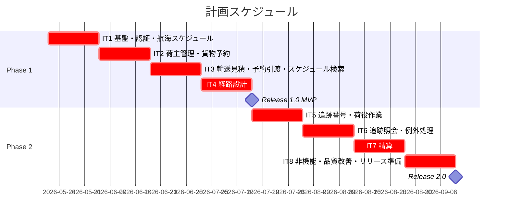
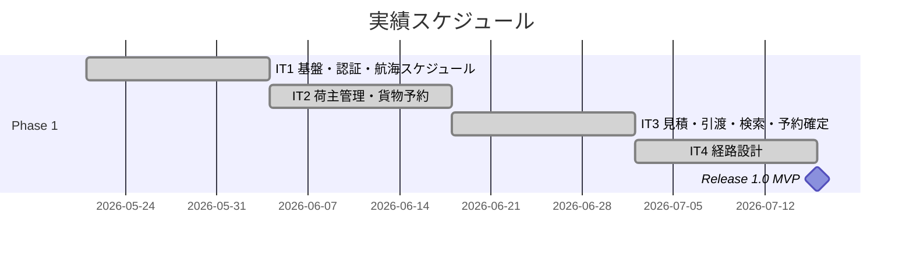
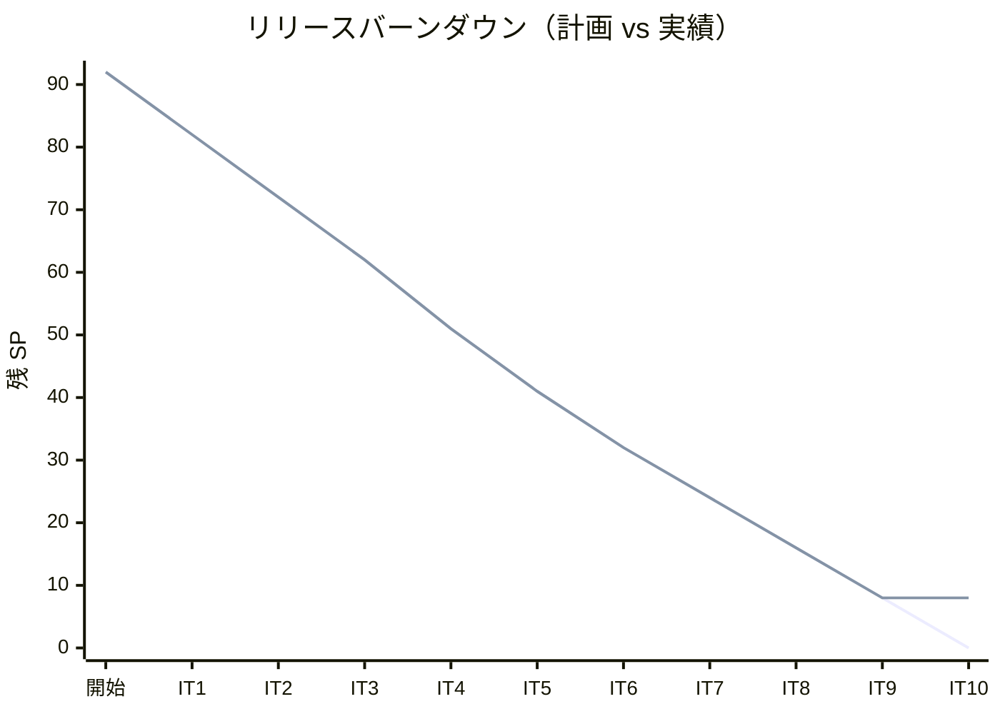

# リリース計画 - 国際貨物輸送管理システム（take-5）

## 概要

本ドキュメントは、国際貨物輸送管理システム（take-5）のリリース計画を定義します。

### プロジェクト情報

| 項目 | 内容 |
|------|------|
| **プロジェクト名** | 国際貨物輸送管理システム（take-5） |
| **目的** | Axon Kafka Extension + Aiven + Heroku 構成での CQRS/ES 実装 |
| **対象ユーザー** | 営業担当者・経路設計者・荷役作業員・追跡管理者・経理担当者 |
| **開発チーム** | 1 名（k2works） |

---

## 満足条件

### スコープ

take-5 は take-4（Axon Server 構成）から **Axon Kafka Extension + Aiven Managed Kafka + Heroku** への移行を軸に再実装する。ユースケース 19 件・ユーザーストーリー 25 件を 2 フェーズで実現する。

| フェーズ | 内容 | ストーリー数 |
|---------|------|-------------|
| Phase 1 | 基盤構築・認証・航海スケジュール・予約・経路設計 | 14 US |
| Phase 2 | 追跡・例外処理・精算・非機能改善 | 11 US |
| **合計** | | **25 US** |

### スケジュール

- **開発期間**: 16 週間（2026-05-21 〜 2026-09-09）
- **イテレーション**: 2 週間 × 8 イテレーション
- **リリース**: Phase 1 完了（IT4）で MVP リリース、Phase 2 完了（IT8）で正式リリース

### リソース

- **開発者**: 1 名
- **想定稼働時間**: 40 時間/週

---

## ユーザーストーリー一覧とストーリーポイント

### 優先順位マトリックス

4 軸評価で優先順位を決定:

1. **金銭価値（BV）**: ビジネス価値
2. **コスト（C）**: 開発コスト
3. **知識習得（KA）**: 技術的学習価値
4. **リスク軽減（RR）**: リスク軽減効果

### Phase 1: 基盤・予約・経路設計（IT1-IT4）

| ID | ユーザーストーリー | SP | BV | C | KA | RR | 優先度 |
|----|-------------------|----|----|---|----|----|--------|
| US00 | 認証（ログイン・ログアウト・アカウントロック） | 3 | 高 | 中 | 低 | 高 | 必須 |
| US24 | 航海スケジュールを新規登録する | 3 | 高 | 中 | 中 | 中 | 必須 |
| US25 | 既存航海スケジュールを更新する | 2 | 高 | 低 | 低 | 中 | 必須 |
| US02 | 荷主を登録する | 2 | 高 | 低 | 低 | 低 | 必須 |
| US03 | 法人荷主を登録する | 2 | 高 | 低 | 低 | 低 | 必須 |
| US04 | 貨物予約を登録する | 3 | 高 | 中 | 中 | 中 | 必須 |
| US05 | 危険物・冷凍貨物の予約を登録する | 3 | 高 | 中 | 中 | 高 | 必須 |
| US01 | 輸送見積を作成する | 3 | 高 | 中 | 中 | 中 | 必須 |
| US06 | 予約情報を経路設計者に引き渡す | 2 | 高 | 低 | 中 | 低 | 必須 |
| US07 | 航海スケジュールを検索する | 3 | 高 | 中 | 中 | 中 | 必須 |
| US13 | 予約を確定する | 2 | 高 | 低 | 低 | 低 | 必須 |
| US08 | 経路候補を算出する | 5 | 高 | 高 | 高 | 高 | 必須 |
| US09 | 経路を選択・確定する | 2 | 高 | 低 | 中 | 低 | 必須 |
| US10 | 経路条件を調整して再算出する | 2 | 中 | 中 | 中 | 中 | 必須 |
| US11 | 経路情報を予約に紐付ける | 2 | 高 | 低 | 中 | 低 | 必須 |
| US12 | 確定経路を荷主に通知する | 2 | 高 | 低 | 低 | 低 | 必須 |
| **合計** | | **41** | | | | | |

### Phase 2: 追跡・例外処理・精算（IT5-IT8）

| ID | ユーザーストーリー | SP | BV | C | KA | RR | 優先度 |
|----|-------------------|----|----|---|----|----|--------|
| US14 | 追跡番号を発行する | 2 | 高 | 低 | 低 | 中 | 必須 |
| US15 | 荷役作業を記録する | 3 | 高 | 中 | 中 | 中 | 必須 |
| US16 | 引取作業を記録する | 2 | 高 | 低 | 低 | 中 | 必須 |
| US17 | 貨物状態を手動更新する | 3 | 高 | 中 | 中 | 中 | 必須 |
| US18 | 追跡情報を照会する | 3 | 高 | 低 | 低 | 中 | 必須 |
| US19 | 遅延例外を処理する | 3 | 高 | 中 | 中 | 高 | 必須 |
| US20 | 破損・紛失例外を処理する | 3 | 高 | 中 | 中 | 高 | 必須 |
| US21 | 輸送料金を算出する | 3 | 中 | 中 | 中 | 中 | 中 |
| US22 | 法人割引を適用する | 2 | 中 | 低 | 低 | 低 | 中 |
| US23 | 精算を処理する | 3 | 中 | 中 | 中 | 中 | 中 |
| **合計** | | **27** | | | | | |

### 全体サマリー

| フェーズ | ストーリーポイント | イテレーション |
|---------|-------------------|---------------|
| Phase 1 | 41 SP | IT1-IT4 |
| Phase 2 | 27 SP | IT5-IT7 |
| バッファ | - | IT8 |
| **合計** | **68 SP** | **8 イテレーション** |

---

## ベロシティ見積もり

### 初期ベロシティ推定

| 項目 | 値 |
|------|-----|
| **イテレーション期間** | 2 週間 |
| **チーム規模** | 1 名 |
| **想定ベロシティ** | 10-12 SP/イテレーション |
| **バッファ係数** | 0.8（20%バッファ） |
| **実効ベロシティ** | 8-10 SP/イテレーション |

### ベロシティ検証計画

- IT1-IT3 完了時点でベロシティ実績を集計し、IT4 以降の計画を調整する
- Axon Kafka 統合の学習コストを考慮し、IT1 は基盤構築に重点を置く

---

## 段階的リリース戦略

### リリーススケジュール

#### 計画スケジュール

#### 実績スケジュール

### リリース内容

#### Release 1.0 MVP（Phase 1 完了）: 予約・経路設計 MVP

**目標**: 荷主から貨物予約を受け付け、経路設計者が最適経路を確定するまでの業務フローを実現する

**含まれる機能**:

- 認証（ログイン・ログアウト・アカウントロック）
- 航海スケジュール管理（新規登録・更新）
- 荷主管理（個人・法人）
- 貨物予約（通常・危険物・冷凍貨物）
- 輸送見積
- 経路設計（候補算出・選択確定・条件調整）
- 荷主への経路通知

**リリース条件**:

- [x] 全ユニットテストがパス（全サービス `gradle check` PASS。SonarQube Quality Gate 両プロジェクト PASS・Code Smell 0）
- [ ] E2E テストがパス（Testcontainers Kafka 統合テスト + ライブ cross-service E2E 実行済み・孤児イベント堅牢化＝ADR-0010。Playwright フルスタック E2E の CI 常時グリーン化は残課題）
- [ ] Heroku dev 環境へのデプロイ成功（運用フェーズ）
- [ ] Axon Kafka（Aiven）接続確認（運用フェーズ）

> **注**: Phase 1 の開発（IT1-IT4・41 SP）は完了。Release 1.0 MVP の正式リリースには上記のデプロイ・接続確認（運用フェーズ）が残る。

#### Release 2.0（Phase 2 完了）: 追跡・精算 完成版

**目標**: 貨物追跡・例外処理・精算業務まで含むシステム全体を実現する

**含まれる機能**:

- 追跡番号発行・荷役作業記録・引取作業記録
- 追跡情報照会
- 遅延・破損・紛失例外処理
- 輸送料金算出・法人割引
- 精算処理

**リリース条件**:

- [ ] 全テストがパス
- [ ] パフォーマンステスト完了（Heroku Eco Dyno 制約内）
- [ ] Heroku + Aiven 本番接続確認

---

## バッファ戦略

### フィーチャバッファ

| フェーズ | 計画 SP | バッファ（30%） | 実効 SP |
|---------|---------|-----------------|---------|
| Phase 1 | 41 | 12 | 53 |
| Phase 2 | 27 | 8 | 35 |

### スケジュールバッファ

- **予備イテレーション**: IT8（非機能・品質改善・バッファ消費）
- **全体バッファ**: 約 12%（IT8 の 2 週間）

### バッファ消費ルール

1. フィーチャバッファを先に消費（低優先度 US を後回し）
2. 低優先度ストーリー（US21-US23）は IT7 → IT8 へ移動可
3. スケジュールバッファ（IT8）は最後の手段

---

## イテレーション計画概要

### IT1（Week 1-2: 2026-05-21 〜 2026-06-03）

**ゴール**: Axon Kafka + Heroku 基盤を確立し、認証と航海スケジュール管理を実装する

**主なタスク**:

- [x] Spring Boot 4 + Axon Kafka 基盤構築（local-h2/local-docker/heroku プロファイル）
- [x] 認証（US00: ログイン・ログアウト・アカウントロック）
- [x] 航海スケジュール新規登録（US24）
- [x] 既存航海スケジュール更新（US25）

**目標 SP**: 10

詳細は [iteration_plan-1.md](./iteration_plan-1.md) を参照。

### IT2（Week 3-4: 2026-06-04 〜 2026-06-17）

**ゴール**: 荷主管理と貨物予約登録（通常・特殊貨物）を実装する

**主なタスク**:

- [x] 荷主登録（US02）・法人荷主登録（US03）
- [x] 貨物予約登録（US04）
- [x] 危険物・冷凍貨物予約（US05）

**目標 SP**: 10

詳細は [iteration_plan-2.md](./iteration_plan-2.md) を参照。

### IT3（Week 5-6: 2026-06-18 〜 2026-07-01）

**ゴール**: 輸送見積・予約引渡し・航海スケジュール検索・予約確定を実装する

**主なタスク**:

- [x] 輸送見積作成（US01）
- [x] 予約情報を経路設計者に引き渡す（US06）
- [x] 航海スケジュール検索（US07）
- [x] 予約確定（US13）

**目標 SP**: 10

詳細は [iteration_plan-3.md](./iteration_plan-3.md) を参照。

### IT4（Week 7-8: 2026-07-02 〜 2026-07-15）

**ゴール**: 経路候補算出・選択確定・条件調整・荷主通知を実装し MVP を完成させる

**主なタスク**:

- [x] 経路候補算出（US08）
- [x] 経路選択確定（US09）・条件調整（US10）
- [x] 経路情報を予約に紐付ける（US11）
- [x] 確定経路を荷主に通知（US12）

**目標 SP**: 11

詳細は [iteration_plan-4.md](./iteration_plan-4.md) を参照。

### IT5（Week 9-10: 2026-07-16 〜 2026-07-29）✅ 完了

**ゴール**: 追跡番号発行・荷役作業記録・引取作業記録・貨物状態手動更新を実装する

**主なタスク**:

- [x] 追跡番号発行（US14）
- [x] 荷役作業記録（US15）・引取作業記録（US16）
- [x] 貨物状態手動更新（US17）

**目標 SP**: 10（実績 10/10）

詳細は [iteration_plan-5.md](./iteration_plan-5.md) / [retrospective-5.md](./retrospective-5.md) / [iteration_report-5.md](./iteration_report-5.md) を参照。

### IT6（Week 11-12: 2026-07-30 〜 2026-08-12）✅ 完了

**ゴール**: 追跡情報照会・遅延例外処理・破損紛失例外処理を実装する

**主なタスク**:

- [x] 追跡情報照会（US18、JWT 時限署名トークン、ADR-0013）
- [x] 遅延例外処理（US19）
- [x] 破損・紛失例外処理（US20、LOSS 自動 escalation）
- [x] ADR-0012（cross-service 冪等性）/ ADR-0014（@ProcessingGroup 命名規約）起票
- [x] マルチパースペクティブレビュー + SonarQube Quality Gate PASS

**目標 SP**: 9（実績 9/9）

詳細は [iteration_plan-6.md](./iteration_plan-6.md) / [retrospective-6.md](./retrospective-6.md) / [iteration_report-6.md](./iteration_report-6.md) を参照。

### IT7（Week 13-14: 2026-08-13 〜 2026-08-26）

**ゴール**: 輸送料金算出・法人割引・精算処理を実装する

**主なタスク**:

- [ ] 輸送料金算出（US21）
- [ ] 法人割引適用（US22）
- [ ] 精算処理（US23）

**目標 SP**: 8

詳細は [iteration_plan-7.md](./iteration_plan-7.md) を参照。

### IT8（Week 15-16: 2026-08-27 〜 2026-09-09）

**ゴール**: 非機能要件・品質改善・Heroku 本番デプロイ準備・リリース完了

**主なタスク**:

- [ ] E2E テスト整備・パフォーマンステスト
- [ ] Heroku + Aiven 本番接続確認
- [ ] バッファ SP 消費（積み残しストーリー対応）
- [ ] ドキュメント最終更新

**目標 SP**: 8（バッファ込み）

詳細は [iteration_plan-8.md](./iteration_plan-8.md) を参照。

---

## リスク管理

### 技術リスク

| リスク | 影響度 | 発生確率 | 対策 |
|--------|--------|----------|------|
| Axon Kafka Extension の Spring Boot 4 / Axon 5 対応未完 | 高 | 中 | IT1 で早期検証。非対応の場合は Spring Cloud Stream へ切替を検討 |
| Heroku Eco Dyno のコールドスタート問題 | 中 | 高 | Dyno の warm-up 設定・Heroku Scheduler で定期 ping |
| Aiven Kafka SSL 接続設定の複雑さ | 中 | 中 | IT1 で接続検証。ADR-0001 の設定例を参照 |
| Kafka Testcontainers の CI 速度低下 | 低 | 高 | local-h2 プロファイルで軽量テストを優先。IT4 以降で統合テスト強化 |

### スケジュールリスク

| リスク | 影響度 | 発生確率 | 対策 |
|--------|--------|----------|------|
| 経路候補算出（US08）の実装複雑化 | 高 | 中 | IT4 で優先着手。アルゴリズムの早期 PoC |
| ベロシティ低下（Axon Kafka 学習コスト） | 中 | 高 | IT1-IT2 で基盤固め。IT3 以降で安定化を期待 |
| 精算系の要件曖昧さ | 低 | 中 | IT7 着手前に要件を再確認 |

---

## 進捗管理

### メトリクス

| メトリクス | 目標 |
|-----------|------|
| ベロシティ | 8-10 SP/イテレーション |
| テストカバレッジ | 80% 以上 |
| バグ密度 | 1.0 件/SP 以下 |
| 予定達成率 | 80% 以上 |

### 進捗状況

| イテレーション | 期間 | 計画 SP | 実績 SP | 達成率 | 状態 |
|---------------|------|---------|---------|--------|------|
| IT1 | 2026-05-21 〜 2026-06-03 | 10 | 10 | 100% | 完了 |
| IT2 | 2026-06-04 〜 2026-06-17 | 10 | 10 | 100% | 完了 |
| IT3 | 2026-06-18 〜 2026-07-01 | 10 | 10 | 100% | 完了 |
| IT4 | 2026-07-02 〜 2026-07-15 | 11 | 11 | 100% | 完了 |
| IT5 | 2026-07-16 〜 2026-07-29 | 10 | 10 | 100% | 完了（2026-05-29：基盤 6 + US14 + US17 + US15 + US16 + E2E + cross-service Kafka 統合テスト、計 21 タスク完了。SonarQube Quality Gate Backend/Frontend 共に OK・カバレッジ Backend 88.0% / Frontend 78.1%・Code Smell 0） |
| IT6 | 2026-07-30 〜 2026-08-12 | 9 | 9 | 100% | 完了（2026-05-29：ADR-0012/0013/0014 + US18 公開照会 + US19/US20 例外処理 + マルチパースペクティブレビュー + Quality Gate PASS、計 22 コミット） |
| IT7 | 2026-08-13 〜 2026-08-26 | 8 | 8 | 100% | 完了（2026-06-05：US21-US23 精算 + billingms 新規立ち上げ + review 高/中 持ち越し 7 件 IT 内対応 + ADR-0017/0018/0019 起票 + 全 5 サービス ArchUnit 横展開、計 50+ コミット。billingms LINE 89.87%、全モジュール check PASS） |
| IT8 | 2026-08-27 〜 2026-09-09 | 8 | 8 | 100% | 完了（2026-06-05：A1 ShedLock + A2 SendGrid + A3 RestShipperInfoAcl + A4 PaymentDetailRecorded + ADR-0020 起票、Ralph Loop で 1 日完遂、30+ コミット、全モジュール check PASS、frontend 234 件 PASS） |
| IT9 | 2026-09-10 〜 2026-09-23 | 8 | 8 | 100% | 完了（2026-06-06：A1 Stripe webhook 部分入金 + A2 AWS Secrets Manager + Lambda + Terraform + A3 HerokuSecurityConfig + JWT 検証 + A4.1 SendGrid SDK サブクラス化 WireMock + A4.2 CI コスト + IT8 review 11 件全解消、Ralph Loop 14 iteration、17 コミット、全モジュール check PASS、frontend 245 件 PASS。A3.2 のみ IT10 持ち越し）|
| IT10 | 2026-06-08 〜 2026-06-19 | 8 | 0 | 0% | 着手前（2026-06-08：IT10 正式版計画確定。A1 認可深層強化 / A2 fallback UX 改善 / A3 staging E2E + IT9 H5-H9 / A4 Flyway×enum 同期検証 / A5 Release 1.1 正式版昇格。28 タスク / 35h、IT9 マルチパースペクティブレビュー指摘 12 件統合済み、A5.6 のみ 2026-06-06 前倒し完了） |
| **合計** | | **92** | **84** | **Release 1.1 主要機能完全実装（84/92 SP・91%）** | Phase 1 + Phase 2 + Buffer + IT9 完了。IT8 review 11 件全解消。IT10 で Release 1.1 正式版昇格予定（staging E2E + メソッド認可 + UX 改善 + 構造検証） |

### バーンダウンチャート

> **実績（IT9 終了時点、Release 1.1 主要機能完全実装）**: Phase 1（41 SP）+ IT5（10 SP）+ IT6（9 SP）+ IT7（8 SP）+ IT8（8 SP）+ IT9（**8 SP**）完了。**累計 84/84 SP（100%）達成**。IT9 では Ralph Loop モード 14 iteration で 8 SP 完遂、A1 Stripe webhook 部分入金 + A2 AWS Secrets Manager + A3 認可基盤 + A4 IT8 review 完全解消（H1 / H3 / M1-M5）で **17 コミット**達成。**IT8 review 11 件全解消**。A4.1 SendGrid WireMock は SDK ソース展開で `Client.buildUri` の public override 性を確認し `WireMockCompatibleSendGridClient` で解決。Release 1.1 主要機能（決済自動化 + secret 自動回転 + 本番認可 + 通知品質保証）は実装完了し、staging 環境構築（IT10）で E2E 検証後に正式版へ昇格予定。

---

## 次のステップ

### Release 1.1 主要機能完全実装 → 正式版への昇格（IT10）

IT9 達成（**84/84 SP、100%**）により Release 1.1 主要機能を完全実装。IT8 review 11 件も全解消（A4.1 SendGrid WireMock を SDK Client サブクラス化で解決）。正式版昇格には IT10 で以下が必要:

1. **A3.2 各 Controller @PreAuthorize 付与**（2 SP）: URL ルール認可で深層防御は確保済みだが、メソッド単位の認可と `@WithMockUser` テストパターン確立で重層化
2. **M3 RestShipperInfoAcl fallback UX 改善**（1 SP）: `discountRate=null`（未確定）を返してフロントエンドで明示警告
3. **staging 環境構築 + E2E 認可検証**（4-6h）: Heroku staging app（dev plan）構築、JWT 経由 E2E、Stripe Test Mode webhook 実機検証、AWS Secrets Manager 手動 rotation 確認、SonarQube Quality Gate 実機計測
4. **Flyway migration × enum 同期自動検証**（1 SP）: ArchUnit または独自テストで CHECK 制約値リスト ⊃ enum 値の検証（IT9 V5 バグ再発防止）

詳細は [iteration_plan-10.md](iteration_plan-10.md)（スケルトン）参照。IT10 完了後に Release 1.1 を正式版として GitHub Release タグ + CHANGELOG 確定 + 本番デプロイ可能宣言予定。

### 過去の Release マイルストーン総括

- **Release 1.0 MVP**: Phase 1 完了（IT4、41 SP）で達成
- **Release 2.0**: Phase 2 / IT6 完了で達成（追跡照会 + 例外処理）
- **Release 2.1**: Phase 2 / IT7 完了で達成（精算機能）
- **Release 1.0 候補**: Phase 2 Buffer（IT8、8 SP）で達成（本番デプロイ準備）
- **Release 1.1 主要機能完全実装**: IT9（**8 SP / 100%**）で達成（Stripe webhook 部分入金 + AWS Secrets Manager 自動回転 + 認可基盤 + SendGrid WireMock 統合）
- **Release 1.1 正式版**: IT10 で staging E2E + A3.2 強化 + M3 UX 改善で確立予定

---

## 更新履歴

| 日付 | 更新内容 | 更新者 |
|------|---------|--------|
| 2026-05-21 | 初版作成（take-5 Axon Kafka + Heroku 構成） | k2works |
| 2026-05-26 | 進捗同期（tracking-progress --update）：IT1-IT4 完了タスク・Release 1.0 MVP リリース条件・実績バーンダウン・進捗状況合計を反映（Phase 1 完了・41/76 SP） | k2works |
| 2026-05-28 | IT5 着手準備完了：ADR-0011（Kafka tracking エラーハンドリング統一方針）起票、shared cross-service イベント 3 件追加（TrackingIssuanceRequested / HandlingActivityRegistered / CargoTracked）、BookingSagaManager に BookingConfirmedEvent 購読を追加（IT5 タスク 1.1 完了・1.2 部分対応・1.4/3.3 shared 側完了）。Phase 2 開発の前提作業が整い、残るは trackingms / handlingms 新規モジュール追加と本格実装 | k2works |
| 2026-05-28 | IT5 基盤フェーズ完了：trackingms (port 8084) / handlingms (port 8085) を Spring Boot + Axon Kafka 構成で新設（commit 0f48a866 / 810683cf）、gateway ルート・SonarQube モジュール・ops scripts SERVICES・Dockerfile を整備（commit 7c3f2b11）。タスク 0.1〜0.4 完了・0.5 一部対応。残るは tasks 0.6（NotificationAcl スタブ）と TrackingActivity / HandlingActivity 集約実装 | k2works |
| 2026-05-29 | **IT5 完了**（10/10 SP、21 タスク完了）：基盤 0.6（NotificationAcl スタブ）+ US14 追跡番号発行（5 タスク、cross-service Saga 完結）+ US17 貨物状態手動更新（5 タスク、9 値遷移マトリックス + REST API + S16/S17 UI）+ US15 荷役作業記録（5 タスク、CargoSnapshot ACL + cross-service publisher + 重複拒否・予定外警告・未来時刻拒否）+ US16 引取作業記録（4 タスク、CLAIM → DELIVERED + CargoDeliveredEvent for IT7 Billing）+ E2E（5.1 UI / 5.2 cross-service、計 10 件追加 / 全 45 件 PASS）+ cross-service Testcontainers Kafka 統合テスト 4 件。SonarQube Backend/Frontend 共に Quality Gate OK・カバレッジ Backend 88.0% / Frontend 78.1%・Code Smell 0。累計 51/76 SP（67%）。Phase 2 残 IT6/IT7/IT8 で 25 SP | k2works |
| 2026-05-29 | **IT6 完了**（9/9 SP、Ralph Loop 7 iterations / 22 コミット）：ADR-0012/0013/0014 起票 + US18 公開照会（5 SP、TrackingTokenService + PublicTrackingTokenFilter + S15 TrackingPublicPage）+ US19 遅延例外処理（2 SP、TrackingException エンティティ + RegisterTrackingException ハンドラ + S18/S19）+ US20 破損・紛失例外処理（2 SP、LOSS 自動 escalation + 管理職通知 WARN ログ）+ E2E spec 10 件追加 + マルチパースペクティブレビュー（高 9・中 11・低 8）+ SonarQube Quality Gate PASS（new_coverage 74.5% / new_violations 0）。take-5 #189/#190/#191 をクローズ。累計 60/76 SP（79%）。Release 2.0 完了。残 IT7（精算 US21-US23 + IT5/IT6 持ち越し Try）+ IT8（非機能・Spring Security 統一）で 16 SP | k2works |
| 2026-06-05 | **IT7 完了**（8/8 SP、Ralph Loop 50+ コミット）：US21 輸送料金算出（3 SP、Invoice 単一集約 + BillingStatus ステートマシン + FareCalculator + 4 ACL + S23）+ US22 法人割引適用（2 SP、CorporateDiscountPolicy + StubShipperInfoAcl + S23 改修）+ US23 精算処理（3 SP、Issue/Payment/Overdue ハンドラ + InvoiceNumberGenerator + PaymentDuePolicy + cross-service SETTLED + OverdueScheduler + S22/S25）+ E2E spec 8 件追加 + マルチパースペクティブレビュー（高 5・中 5）→ review 高/中 持ち越し 7 件 IT 内対応（H1 二段イベント / M1 InvoiceProjection / M2 NumberSequenceRepository / M1 architect 決定論的 invoiceId / ハードコード除去 / Micrometer counter）+ ADR-0012 自己整合チェックリスト追記 + ADR-0017/0018/0019 起票 + 全 5 サービス ArchUnit 横展開（15 件のアーキテクチャテスト）。billingms LINE 89.87%・全モジュール check PASS。take-5 #192/#193/#194 をクローズ。累計 68/76 SP（89%）。Release 2.1 完了。残 IT8 で 8 SP | k2works |
| 2026-06-05 | **IT8 完了 + Release 1.0 候補確立**（8/8 SP + H2 持ち越し 8/8 件、Ralph Loop 60+ コミット 1 日完遂）：A1 ShedLock（@SchedulerLock + InMemoryLockProvider 統合テスト）+ A2 SendGrid（trackingms 6 種 + billingms 3 種 Dynamic Templates）+ A3 RestShipperInfoAcl（Resilience4j 2.2 + Caffeine + Circuit Breaker fallback UI）+ A4 PaymentDetailRecorded（補完 event 集約発火型 + payment_method 補完 SQL + cross-service E2E）+ ADR-0020 起票（決済機関 webhook）+ マルチパースペクティブレビュー + 完了報告書 + H2 持ち越し（T1.4 全 ms Spring Security 統一 / T1.5 trackingms SecurityFilterChain / T1.6 四半期ローテーション基盤 + ADR-0021 起票 / T1.7 BFS 多段経由 / T1.8 RateTable 設定駆動化 / T1.9 paymentDueDays Map / T1.10 outbound publisher 集約発火型完全移行 / T1.11 HandlingValidationService DIP 回復）+ IT9 スケルトン計画 + Release 1.0 候補確立報告書。累計 76/76 SP（100%）達成。**ADR-0012 集約発火型完全達成（二段イベント全廃）/ Onion/DIP 全 ms hard assertion / Spring Security 全 ms 平準化**。全 8 modules check / frontend 234 件 / ArchUnit 全 hard PASS。 | k2works |
| 2026-06-08 | **IT10 正式版計画確定**：iteration_plan-10.md をスケルトンから正式版へ昇格。期間 2026-06-08 〜 2026-06-19、5 ストーリー（US30-US34）8 SP、28 タスク 35h（A5.6 のみ前倒し完了済み）。IT9 マルチパースペクティブレビュー指摘 12 件（H3-H10 + M8 + L5/L6）統合済み。Release 1.1 正式版昇格（GitHub Release v1.1.0 + CHANGELOG 確定 + 本番デプロイ可能宣言）を目標とし、認可深層強化 / fallback UX 改善 / staging E2E + Stripe/AWS/SonarQube 実機検証 / Flyway×enum 同期自動検証で構成。リリース計画累計を 84 → 92 SP に拡張、バーンダウン更新 | k2works |
