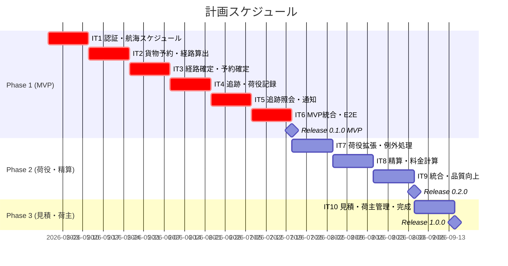
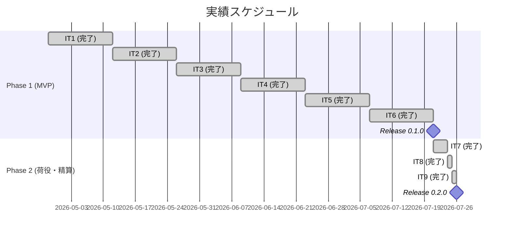
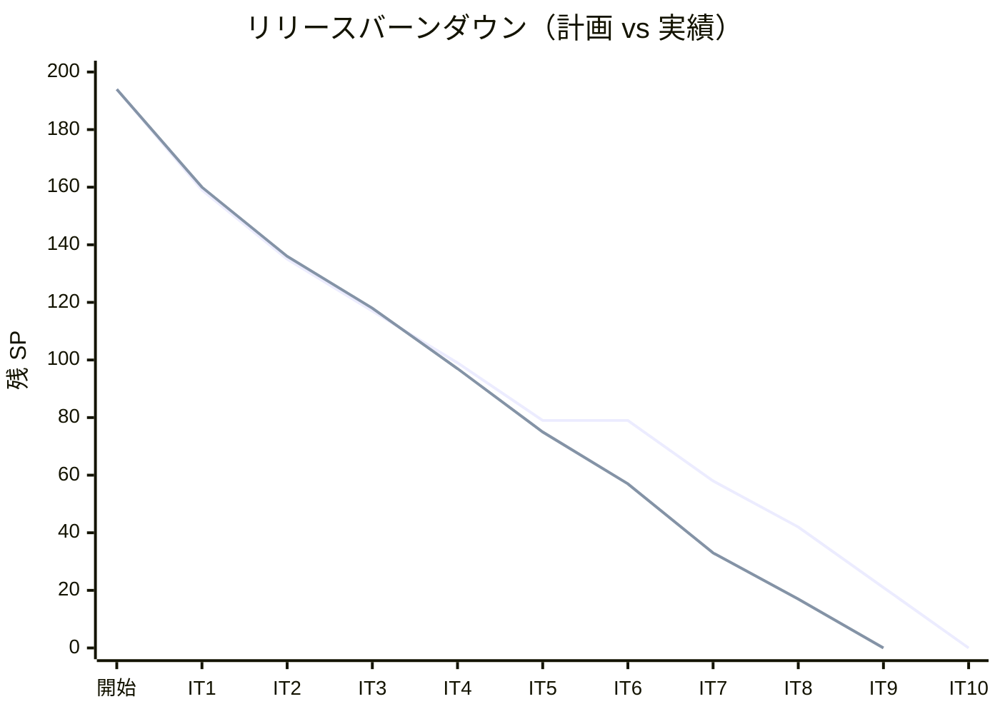

# リリース計画 - 国際貨物輸送管理システム

## 概要

本ドキュメントは、国際貨物輸送管理システム（Cargo Tracker）のリリース計画を定義します。

### プロジェクト情報

| 項目 | 内容 |
|------|------|
| **プロジェクト名** | 国際貨物輸送管理システム（Cargo Tracker） |
| **目的** | 貨物予約・経路設計・追跡・荷役・精算の一貫管理を実現する |
| **対象ユーザー** | 営業担当者・経路設計者・追跡管理者・荷役作業員・経理担当者 |
| **開発チーム** | 1 名 + AI ペアプログラミング |

---

## 満足条件

### スコープ

段階的リリース戦略を採用し、3 フェーズに分けてバックエンド API とフロントエンド画面をセットで開発する。各ストーリーは「バックエンド（API + ドメインロジック）」と「フロントエンド（React 画面 + TanStack Query）」の両方を含む。

| フェーズ | 内容 | ストーリー数 |
|---------|------|-------------|
| Phase 1 | MVP: 予約・経路設計・追跡の基幹フロー（API + 画面） | 14 US |
| Phase 2 | 荷役・例外処理・精算（API + 画面） | 8 US |
| Phase 3 | 見積・荷主管理（API + 画面） | 3 US |
| **合計** | | **25 US** |

### 開発アプローチ

- **インサイドアウト**: バックエンド API を TDD で実装 → フロントエンド画面を TDD で実装
- **フルスタック**: 各イテレーションでバックエンドとフロントエンドの両方を開発し、動作する画面を成果物とする
- **コンポジット UI**: `apps/frontend`（React SPA）が API Gateway 経由で各マイクロサービスを消費する

### スケジュール

- **開発期間**: 約 20 週間（5 ヶ月）
- **イテレーション**: 2 週間 × 10 イテレーション
- **リリース**: Phase 1 完了（IT5 後）→ Phase 2 完了（IT8 後）→ Phase 3 完了（IT10 後）

### リソース

- **開発者**: 1 名 + AI ペアプログラミング
- **想定稼働時間**: 20 時間/週

---

## ユーザーストーリー一覧とストーリーポイント

### SP 見積もり方針

各ストーリーの SP はバックエンド + フロントエンドを合算した値とする。

| 区分 | 内容 | 目安 |
|------|------|------|
| BE（バックエンド） | ドメインモデル + MyBatis + REST API + テスト | 元の SP |
| FE（フロントエンド） | React コンポーネント + Custom Hooks + 画面テスト | +2〜5 SP |

### 優先順位マトリックス

4 軸評価で優先順位を決定:

1. **金銭価値（BV）**: ビジネス価値
2. **コスト（C）**: 開発コスト
3. **知識習得（KA）**: 技術的学習価値
4. **リスク軽減（RR）**: リスク軽減効果

### Phase 1: MVP — 認証・予約・経路設計・追跡（IT1〜IT5）

| ID | ユーザーストーリー | BE | FE | SP | BV | C | KA | RR | 優先度 |
|----|-------------------|----|----|----|----|---|----|----|--------|
| US26 | システムにログインする | 8 | 5 | 13 | 高 | 高 | 高 | 高 | 必須 |
| US27 | システムからログアウトする | 2 | 2 | 4 | 高 | 低 | 低 | 高 | 必須 |
| US24 | 航海スケジュールを新規登録する | 5 | 3 | 8 | 高 | 中 | 高 | 高 | 必須 |
| US25 | 既存航海スケジュールを更新する | 3 | 2 | 5 | 高 | 低 | 中 | 中 | 必須 |
| US07 | 航海スケジュールを検索する | 3 | 2 | 5 | 高 | 低 | 中 | 中 | 必須 |
| US04 | 貨物予約を登録する | 8 | 5 | 13 | 高 | 高 | 高 | 高 | 必須 |
| US08 | 経路候補を算出する | 8 | 3 | 11 | 高 | 高 | 高 | 高 | 必須 |
| US09 | 経路を選択・確定する | 5 | 3 | 8 | 高 | 中 | 中 | 高 | 必須 |
| US11 | 経路情報を予約に紐付ける | 3 | 2 | 5 | 高 | 低 | 低 | 中 | 必須 |
| US13 | 予約を確定する | 3 | 2 | 5 | 高 | 低 | 低 | 中 | 必須 |
| US14 | 追跡番号を発行する | 3 | 2 | 5 | 高 | 低 | 中 | 高 | 必須 |
| US15 | 荷役作業を記録する | 5 | 3 | 8 | 高 | 中 | 高 | 高 | 必須 |
| US17 | 貨物状態を手動更新する | 3 | 2 | 5 | 高 | 低 | 中 | 中 | 必須 |
| US18 | 追跡情報を照会する | 5 | 5 | 10 | 高 | 中 | 高 | 高 | 必須 |
| US06 | 予約情報を経路設計者に引き渡す | 3 | 2 | 5 | 中 | 低 | 中 | 中 | 必須 |
| US12 | 確定経路を荷主に通知する | 3 | 2 | 5 | 中 | 低 | 中 | 低 | 必須 |
| **合計** | | **70** | **45** | **115** | | | | | |

### Phase 2: 荷役・例外処理・精算（IT6〜IT8）

| ID | ユーザーストーリー | BE | FE | SP | BV | C | KA | RR | 優先度 |
|----|-------------------|----|----|----|----|---|----|----|--------|
| US16 | 引取作業を記録する | 3 | 2 | 5 | 高 | 低 | 低 | 中 | 必須 |
| US05 | 危険物・冷凍貨物の予約を登録する | 5 | 3 | 8 | 高 | 中 | 中 | 高 | 必須 |
| US10 | 経路条件を調整して再算出する | 5 | 3 | 8 | 中 | 中 | 中 | 中 | 中 |
| US19 | 遅延例外を処理する | 5 | 3 | 8 | 高 | 中 | 中 | 高 | 必須 |
| US20 | 破損・紛失例外を処理する | 5 | 3 | 8 | 高 | 中 | 中 | 高 | 必須 |
| US21 | 輸送料金を算出する | 5 | 3 | 8 | 高 | 中 | 高 | 中 | 中 |
| US22 | 法人割引を適用する | 3 | 2 | 5 | 中 | 低 | 低 | 低 | 中 |
| US23 | 精算を処理する | 5 | 3 | 8 | 高 | 中 | 中 | 中 | 中 |
| **合計** | | **36** | **22** | **58** | | | | | |

### Phase 3: 見積・荷主管理（IT9〜IT10）

| ID | ユーザーストーリー | BE | FE | SP | BV | C | KA | RR | 優先度 |
|----|-------------------|----|----|----|----|---|----|----|--------|
| US01 | 輸送見積を作成する | 5 | 5 | 10 | 中 | 中 | 中 | 低 | 中 |
| US02 | 荷主を登録する | 3 | 3 | 6 | 中 | 低 | 低 | 低 | 中 |
| US03 | 法人荷主を登録する | 3 | 2 | 5 | 中 | 低 | 低 | 低 | 低 |
| **合計** | | **11** | **10** | **21** | | | | | |

### 全体サマリー

| フェーズ | BE SP | FE SP | 合計 SP | イテレーション |
|---------|-------|-------|---------|---------------|
| Phase 1（MVP） | 70 | 45 | 115 | IT1〜IT6 |
| Phase 2（荷役・精算） | 36 | 22 | 58 | IT7〜IT9 |
| Phase 3（見積・荷主） | 11 | 10 | 21 | IT10 |
| **合計** | **117** | **77** | **194** | 10 イテレーション |

---

## ベロシティ見積もり

### 初期ベロシティ推定

| 項目 | 値 |
|------|-----|
| **イテレーション期間** | 2 週間 |
| **チーム規模** | 1 名 + AI |
| **想定ベロシティ** | 16〜22 SP/イテレーション（BE + FE） |
| **バッファ係数** | 0.85（15% バッファ） |
| **実効ベロシティ** | 14〜19 SP/イテレーション |
| **採用ベロシティ** | 18 SP/イテレーション |

### ベロシティ検証計画

- IT1〜IT3 の実績ベロシティで計画を再調整する
- 実績が 14 SP 未満の場合、Phase 3 をスコープ外とする
- 実績が 22 SP 超の場合、前倒しでリリースする

---

## 段階的リリース戦略

### リリーススケジュール

#### 計画スケジュール

#### 実績スケジュール

### リリース内容

#### Release 0.1.0（Phase 1 完了）: MVP

**目標**: 貨物予約→経路設計→追跡の基幹フローが API + 画面で動作する最小限の製品

**含まれる機能**:

- 航海スケジュール管理画面（一覧・登録・更新・検索）
- 貨物予約画面（登録・確定・一覧）
- 経路設計画面（候補算出・選択・紐付け）
- 追跡画面（番号発行・荷役記録・状態更新・照会）
- ログイン画面・ダッシュボード

**リリース条件**:

- [ ] 全ユニットテスト（BE + FE）がパス
- [ ] アーキテクチャテスト（ArchUnit）がパス
- [ ] 基幹フロー E2E テスト（Playwright）がパス
- [ ] BE テストカバレッジ 80% 以上
- [ ] FE テストカバレッジ 70% 以上

#### Release 0.2.0（Phase 2 完了）: 荷役・精算

**目標**: 荷役拡張、例外処理、精算機能の API + 画面を追加

**含まれる機能**:

- 引取作業記録・危険物予約画面
- 遅延・破損例外処理画面
- 精算管理画面（料金算出・法人割引・精算処理）

**リリース条件**:

- [ ] 全テストがパス
- [ ] 例外処理のシナリオテスト完了

#### Release 1.0.0（Phase 3 完了）: 完成版

**目標**: 見積・荷主管理の画面を追加し、全機能を完成

---

## バッファ戦略

### フィーチャバッファ

| フェーズ | 計画 SP | バッファ（30%） | 実効 SP |
|---------|---------|-----------------|---------|
| Phase 1 | 98 | 29 | 69 |
| Phase 2 | 58 | 17 | 41 |
| Phase 3 | 21 | 6 | 15 |

### スケジュールバッファ

- **予備イテレーション**: IT10 を Phase 3 + バッファとして運用
- **全体バッファ**: 約 15%（ベロシティ係数 0.85）

### バッファ消費ルール

1. フィーチャバッファを先に消費
2. 低優先度ストーリーを後回し（US03, US22 が候補）
3. フロントエンドの簡易版で先行リリースし、後続で UI を改善
4. スケジュールバッファは最後の手段

---

## イテレーション計画概要

### イテレーション 1（Week 1-2: 2026-04-28〜2026-05-09）

**ゴール**: 認証基盤（JWT ログイン/ログアウト）と航海スケジュール CRUD の API + 画面を構築する

**主なタスク**:

- [x] US26: システムにログインする（BE 8 + FE 5 = 13 SP）
- [x] US27: システムからログアウトする（BE 2 + FE 2 = 4 SP）
- [ ] US24: 航海スケジュールを新規登録する（BE 5 + FE 3 = 8 SP）
- [ ] US25: 既存航海スケジュールを更新する（BE 3 + FE 2 = 5 SP）
- [ ] US07: 航海スケジュールを検索する（BE 3 + FE 2 = 5 SP）

**目標 SP**: 35（BE 21 + FE 14）※初回のため認証基盤 + 業務機能を並行構築

詳細は [iteration_plan-1.md](./iteration_plan-1.md) を参照。

### イテレーション 2（Week 3-4: 2026-05-12〜2026-05-23）

**ゴール**: 貨物予約の登録画面と経路候補算出を実装する

**主なタスク**:

- [x] US04: 貨物予約を登録する（BE 8 + FE 5 = 13 SP）
- [x] US08: 経路候補を算出する（BE 8 + FE 3 = 11 SP）

**目標 SP**: 24（BE 16 + FE 8）

### イテレーション 3（Week 5-6: 2026-05-26〜2026-06-06）

**ゴール**: 経路確定・予約確定の一連のフローを完成する

**主なタスク**:

- [x] US09: 経路を選択・確定する（BE 5 + FE 3 = 8 SP）
- [x] US11: 経路情報を予約に紐付ける（BE 3 + FE 2 = 5 SP）
- [x] US13: 予約を確定する（BE 3 + FE 2 = 5 SP）

**目標 SP**: 18（BE 11 + FE 7）

### イテレーション 4（Week 7-8: 2026-06-09〜2026-06-20）

**ゴール**: 追跡番号発行・荷役記録・追跡照会の API + 画面を実装する

**主なタスク**:

- [x] US14: 追跡番号を発行する（BE 3 + FE 2 = 5 SP）
- [x] US15: 荷役作業を記録する（BE 5 + FE 3 = 8 SP）
- [x] US17: 貨物状態を手動更新する（BE 3 + FE 2 = 5 SP）
- [x] TI01: IT3 コードレビュー高優先度指摘解消（BE 3 = 3 SP）

**目標 SP**: 21（BE 14 + FE 7）

詳細は [iteration_plan-4.md](./iteration_plan-4.md) を参照。

### イテレーション 5（Week 9-10: 2026-06-23〜2026-07-04）

**ゴール**: 追跡照会・通知で MVP 機能を完成する

**主なタスク**:

- [x] US18: 追跡情報を照会する（BE 5 + FE 5 = 10 SP）
- [x] US06: 予約情報を経路設計者に引き渡す（BE 3 + FE 2 = 5 SP）
- [x] US12: 確定経路を荷主に通知する（BE 3 + FE 2 = 5 SP）
- [x] TI02: IT4 コードレビュー高優先度指摘解消（BE 2 = 2 SP）

**目標 SP**: 22（BE 13 + FE 9）

### イテレーション 6（Week 11-12: 2026-05-11〜2026-05-22）

**ゴール**: MVP 統合テスト（Playwright E2E）・品質改善・IT4/IT5 持ち越し指摘解消・Release 0.1.0 リリース準備

**主なタスク**:

- [ ] TI03: Playwright E2E テスト整備 — 基幹フロー 5 シナリオ（8 SP）
- [ ] TI04: bookingms → trackingms RabbitMQ イベント連携（3 SP）
- [ ] TI05: IT4 コードレビュー保留指摘解消 H5/H6/H7（4 SP）
- [ ] TI06: Release 0.1.0 リリース準備（3 SP）

**目標 SP**: 18

詳細は [iteration_plan-6.md](./iteration_plan-6.md) を参照。

### イテレーション 7（Week 13-14: 2026-07-21〜2026-08-01）

**ゴール**: 荷役拡張と例外処理の API + 画面を実装する

**主なタスク**:

- [ ] US16: 引取作業を記録する（5 SP）
- [ ] US05: 危険物・冷凍貨物の予約を登録する（8 SP）
- [ ] US19: 遅延例外を処理する（8 SP）

**目標 SP**: 21

### イテレーション 8（Week 15-16: 2026-08-04〜2026-08-15）

**ゴール**: 例外処理完了と精算機能の API + 画面を実装する

**主なタスク**:

- [ ] US20: 破損・紛失例外を処理する（8 SP）
- [ ] US21: 輸送料金を算出する（8 SP）

**目標 SP**: 16

### イテレーション 9（Week 17-18: 2026-08-18〜2026-08-29）

**ゴール**: 精算完了と Phase 2 統合テスト

**主なタスク**:

- [ ] US10: 経路条件を調整して再算出する（8 SP）
- [ ] US22: 法人割引を適用する（5 SP）
- [ ] US23: 精算を処理する（8 SP）

**目標 SP**: 21

### イテレーション 10（Week 19-20: 2026-09-01〜2026-09-12）

**ゴール**: 見積・荷主管理を追加し全機能を完成する

**主なタスク**:

- [ ] US01: 輸送見積を作成する（10 SP）
- [ ] US02: 荷主を登録する（6 SP）
- [ ] US03: 法人荷主を登録する（5 SP）

**目標 SP**: 21

---

## リスク管理

### 技術リスク

| リスク | 影響度 | 発生確率 | 対策 |
|--------|--------|----------|------|
| Spring Cloud Gateway と Spring Boot 4.x の互換性 | 中 | 低 | Gateway 5.0.1 で解決済み |
| マイクロサービス間通信の複雑さ | 高 | 中 | IT1 で RabbitMQ 疎通を検証。Spring Cloud Stream で抽象化 |
| MyBatis + CQRS の実装パターン確立 | 中 | 中 | IT1 で基準ストーリー（US24）でパターンを確立 |
| React SPA + TanStack Query の習熟 | 中 | 中 | IT1 で航海スケジュール画面でパターンを確立 |
| フロントエンド・バックエンド並行開発の複雑さ | 中 | 中 | MSW で API モック化し、FE を BE と独立して開発可能にする |

### スケジュールリスク

| リスク | 影響度 | 発生確率 | 対策 |
|--------|--------|----------|------|
| ベロシティが想定を下回る | 高 | 中 | IT3 後にベロシティ再評価。Phase 3 をスコープ調整 |
| FE 開発がボトルネックになる | 中 | 中 | FE を簡易版で先行リリースし、後続で UI を改善 |
| 外部要因による中断 | 中 | 低 | フィーチャバッファ 30% を確保 |

---

## 進捗管理

### メトリクス

| メトリクス | 目標 |
|-----------|------|
| ベロシティ | 18 SP/イテレーション（BE + FE） |
| BE テストカバレッジ | 80% 以上 |
| FE テストカバレッジ | 70% 以上 |
| バグ密度 | 1.0 件/SP 以下 |
| 予定達成率 | 90% 以上 |

### 進捗状況

| イテレーション | 計画 SP | BE SP | FE SP | 実績 SP | 達成率 | 状態 |
|---------------|---------|-------|-------|---------|--------|------|
| IT1 | 35 | 21 | 14 | 34 | 97% | 完了 |
| IT2 | 24 | 16 | 8 | 24 | 100% | 完了 |
| IT3 | 18 | 11 | 7 | 18 | 100% | 完了 |
| IT4 | 21 | 14 | 7 | 21 | 100% | 完了 |
| IT5 | 22 | 13 | 9 | 22 | 100% | 完了 |
| IT6 | 22 | 7 | 15 | 19 | 86% | 完了 |
| IT7 | 24 | 14 | 10 | 24 | 100% | 完了 |
| IT8 | 16 | 10 | 6 | 16 | 100% | 完了 |
| IT9 | 21 | 13 | 8 | 21 | 100% | 完了 |
| IT10 | 21 | 11 | 10 | - | - | 未着手 |

### バーンダウンチャート

---

## 次のステップ

1. IT10: 輸送見積（US01）・荷主登録（US02）・法人荷主登録（US03）の BE + FE 実装（21 SP）
2. IT10 完了後、Release 1.0.0 タグ作成・CHANGELOG 更新

---

## 更新履歴

| 日付 | 更新内容 | 更新者 |
|------|---------|--------|
| 2026-04-25 | 初版作成 | - |
| 2026-04-25 | フロントエンド開発を含めて再計画（10 IT / 177 SP） | - |
| 2026-04-25 | 認証ストーリー（US26/US27）を追加。Phase 1 を IT1〜IT6 に拡張（194 SP） | - |
| 2026-04-25 | IT1 進捗更新: US26/US27 完了（17/35 SP = 49%）。IT1 を「実施中」に変更 | - |
| 2026-05-08 | IT3 進捗更新: US09/US11/US13 主要実装完了（16/18 SP = 89%）。累計 74 SP 完了 |
| 2026-05-08 | IT3 完了: 全 18 SP 完了（100%）。累計 76 SP 完了。SonarQube Quality Gate PASS | - |
| 2026-05-08 | IT4 完了: 全 21 SP 完了（100%）。累計 97 SP 完了。trackingms 新規構築完了。SonarQube Quality Gate PASS | - |
| 2026-05-09 | IT5 完了: 全 22 SP 完了（100%）。累計 119 SP 完了。追跡照会・予約引渡・経路通知・IT4 コードレビュー指摘解消。SonarQube Quality Gate PASS | - |
| 2026-05-09 | IT6 計画作成: E2E テスト整備・RabbitMQ 連携・保留指摘解消・Release 0.1.0 準備（18 SP） | - |
| 2026-05-11 | IT6 完了: 19 SP / 86%（22 SP 計画）。Release 0.1.0 リリース済み | - |
| 2026-05-11 | IT7 完了: 24 SP / 100%。荷役拡張・危険物予約・遅延例外処理 BE + FE 実装完了 | - |
| 2026-05-11 | 進捗表の IT7 重複行を IT9 に修正・バーンダウン実績ライン更新・Phase 2 進捗反映 | - |
| 2026-05-11 | IT8 完了: 16 SP / 100%。破損・紛失例外処理（US20）・輸送料金算出（US21）BE + FE 実装完了 | - |
| 2026-05-11 | IT9 完了: 21 SP / 100%。経路条件再算出（US10）・法人割引（US22）・精算処理（US23）BE + FE 実装完了。Phase 2 完了 | - |
