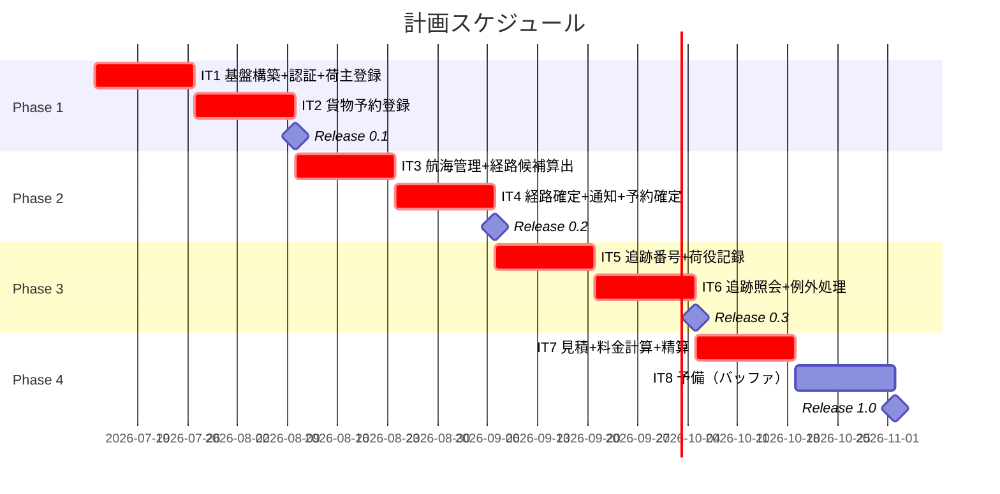
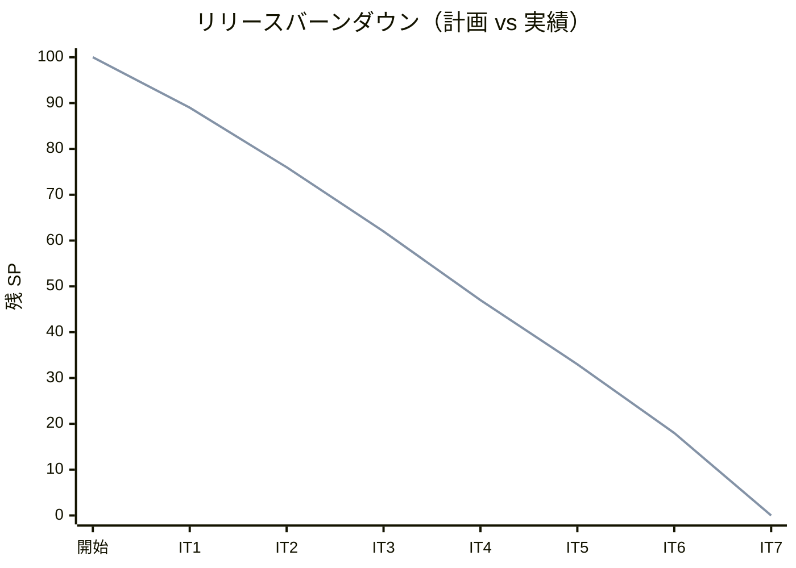

# リリース計画 - 国際貨物輸送管理システム（Rails 版）

## 概要

本ドキュメントは、国際貨物輸送管理システム（Rails 版）のリリース計画を定義します。

### プロジェクト情報

| 項目 | 内容 |
|------|------|
| **プロジェクト名** | 国際貨物輸送管理システム（Cargo Tracker Rails 版） |
| **目的** | 貨物予約・経路設計・追跡・荷役・精算の一元管理による輸送業務の効率化 |
| **対象ユーザー** | 営業担当者、経路設計者、荷役作業員、追跡管理者、経理担当者、荷主・荷受人 |
| **開発チーム** | AI エージェント + 開発者 1 名（ペア体制） |

---

## 満足条件

### スコープ

ユーザーストーリー US01〜US27（27 件）を 4 フェーズに分けて段階的にリリースします。
UI 設計の「MVP スコープと段階リリース」方針に従い、経路設計者向け専用画面は初期リリースでは営業担当者の経路割り当て画面で代替します。

| フェーズ | 内容 | ストーリー数 |
|---------|------|---------------|
| Phase 1 | 基盤構築 + ユーザー認証 + 荷主・貨物予約登録 | 7 US |
| Phase 2 | 経路設計・予約確定・航海管理 | 9 US |
| Phase 3 | 追跡・荷役・例外処理 | 7 US |
| Phase 4 | 見積・料金計算・精算 | 4 US |
| **合計** | | **27 US** |

### スケジュール

- **開発期間**: 2026-07-13 〜 2026-10-31（約 16 週間）
- **イテレーション**: 2 週間 × 7 回 + 予備 1 回
- **リリース**: フェーズ完了ごとに 0.1 → 0.2 → 0.3 → 1.0 を段階リリース

### リソース

- **開発者**: AI エージェント + 開発者 1 名
- **想定稼働時間**: 40 時間/週

---

## ユーザーストーリー一覧とストーリーポイント

### 優先順位マトリックス

4 軸評価で優先順位を決定:

1. **金銭価値（BV）**: ビジネス価値
2. **コスト（C）**: 開発コスト
3. **知識習得（KA）**: 技術的学習価値
4. **リスク軽減（RR）**: リスク軽減効果

### Phase 1: 基盤構築 + 荷主・貨物予約登録（イテレーション 1-2）

Rails アプリケーション基盤（packs 構成・認証・CI）の構築と、システム利用者のログイン・ログアウト、予約業務の入口となる荷主・貨物予約を実装します。

| ID | ユーザーストーリー | SP | BV | C | KA | RR | 優先度 |
|----|-------------------|----|----|---|----|----|--------|
| US26 | システムにログインする | 3 | 高 | 低 | 中 | 高 | 必須 |
| US27 | システムからログアウトする | 2 | 中 | 低 | 低 | 中 | 必須 |
| US02 | 荷主を登録する | 3 | 高 | 低 | 高 | 高 | 必須 |
| US03 | 法人荷主を登録する | 3 | 高 | 低 | 中 | 中 | 必須 |
| US04 | 貨物予約を登録する | 5 | 高 | 中 | 高 | 高 | 必須 |
| US05 | 危険物・冷凍貨物の予約を登録する | 5 | 高 | 中 | 中 | 高 | 必須 |
| US06 | 予約情報を経路設計者に引き渡す | 3 | 高 | 低 | 中 | 中 | 必須 |
| **合計** | | **24** | | | | | |

> US26/US27 は Rails 8 標準認証 + Pundit（ロール: sales/handler/tracker/billing/admin）による認証・認可基盤の上に実装します（UC20 に対応）。追跡情報照会（US18）は認証不要の公開ページとして提供します。
> Phase 1 には SP 外のオーバーヘッドとして基盤構築タスク（Rails 8 新規作成、packs/Packwerk 設定、RSpec/SimpleCov/RuboCop/Brakeman、Docker Compose + PostgreSQL 16、GitHub Actions CI）を含みます。

### Phase 2: 経路設計・予約確定・航海管理（イテレーション 3-4）

| ID | ユーザーストーリー | SP | BV | C | KA | RR | 優先度 |
|----|-------------------|----|----|---|----|----|--------|
| US24 | 航海スケジュールを新規登録する | 3 | 中 | 低 | 中 | 高 | 必須 |
| US25 | 既存航海スケジュールを更新する | 3 | 中 | 低 | 低 | 中 | 必須 |
| US07 | 航海スケジュールを検索する | 3 | 高 | 低 | 中 | 中 | 必須 |
| US08 | 経路候補を算出する | 5 | 高 | 高 | 高 | 高 | 必須 |
| US09 | 経路を選択・確定する | 3 | 高 | 低 | 中 | 中 | 必須 |
| US10 | 経路条件を調整して再算出する | 3 | 中 | 中 | 中 | 低 | 中 |
| US11 | 経路情報を予約に紐付ける | 3 | 高 | 低 | 中 | 高 | 必須 |
| US12 | 確定経路を荷主に通知する | 3 | 高 | 中 | 高 | 中 | 必須 |
| US13 | 予約を確定する | 3 | 高 | 低 | 中 | 高 | 必須 |
| **合計** | | **29** | | | | | |

> US08 は外部経路システム（ExternalRoutingServicePort）の ACL 実装を含みます。US12 は ADR 0002 のドメインイベント駆動通知基盤（notifications テーブル）の初回実装を含みます。

### Phase 3: 追跡・荷役・例外処理（イテレーション 5-6）

| ID | ユーザーストーリー | SP | BV | C | KA | RR | 優先度 |
|----|-------------------|----|----|---|----|----|--------|
| US14 | 追跡番号を発行する | 3 | 高 | 低 | 中 | 中 | 必須 |
| US15 | 荷役作業を記録する | 5 | 高 | 中 | 高 | 高 | 必須 |
| US16 | 引取作業を記録する | 3 | 高 | 低 | 中 | 中 | 必須 |
| US17 | 貨物状態を手動更新する | 3 | 中 | 低 | 低 | 中 | 中 |
| US18 | 追跡情報を照会する | 5 | 高 | 中 | 高 | 高 | 必須 |
| US19 | 遅延例外を処理する | 5 | 高 | 中 | 中 | 高 | 必須 |
| US20 | 破損・紛失例外を処理する | 5 | 高 | 中 | 中 | 高 | 必須 |
| **合計** | | **29** | | | | | |

> US18 は公開貨物追跡（`/public/tracking`、認証不要）と Turbo Frame の 30 秒差分ポーリングを含みます。

### Phase 4: 見積・料金計算・精算（イテレーション 7）

| ID | ユーザーストーリー | SP | BV | C | KA | RR | 優先度 |
|----|-------------------|----|----|---|----|----|--------|
| US01 | 輸送見積を作成する | 5 | 高 | 中 | 中 | 低 | 必須 |
| US21 | 輸送料金を算出する | 5 | 高 | 中 | 高 | 中 | 必須 |
| US22 | 法人割引を適用する | 3 | 中 | 低 | 低 | 低 | 中 |
| US23 | 精算を処理する | 5 | 高 | 中 | 中 | 中 | 必須 |
| **合計** | | **18** | | | | | |

> US01 は FreightCalculationService（US21）と経路候補算出（US08）に依存するため最終フェーズに配置します。US21 は消費税 10%・燃油サーチャージを含む料金計算を実装します。

### 全体サマリー

| フェーズ | ストーリーポイント | イテレーション |
|---------|-------------------|---------------|
| Phase 1 | 24 SP | 1-2 |
| Phase 2 | 29 SP | 3-4 |
| Phase 3 | 29 SP | 5-6 |
| Phase 4 | 18 SP | 7 |
| **合計** | **100 SP** | 7 イテレーション + 予備 1 |

---

## ベロシティ見積もり

### 初期ベロシティ推定

| 項目 | 値 |
|------|-----|
| **イテレーション期間** | 2 週間 |
| **チーム規模** | AI エージェント + 開発者 1 名 |
| **想定ベロシティ** | 15-18 SP/イテレーション |
| **バッファ係数** | 0.8（20% バッファ） |
| **実効ベロシティ** | 12-15 SP/イテレーション |

### ベロシティ検証計画

- イテレーション 1-3 の実績 SP を計測し、3 イテレーション終了時点で計画ベロシティを再調整します
- イテレーション 1 は基盤構築オーバーヘッドがあるため、ストーリー消化は少なめ（10 SP 程度）を想定します

---

## 段階的リリース戦略

### リリーススケジュール

#### 計画スケジュール

#### 実績スケジュール

実績はイテレーション完了ごとに追記します。

### リリース内容

#### Release 0.1（Phase 1 完了）: 予約基盤

**目標**: 営業担当者が荷主と貨物予約を登録し、経路設計者へ引き渡せる状態

**含まれる機能**:

- Rails 8 アプリケーション基盤（packs 構成・認証・RBAC・CI）
- ユーザー認証（ログイン・ログアウト、ロール別ダッシュボード、アカウントロック）
- 荷主登録（個人・法人、割引率 0〜30%）
- 貨物予約登録（一般・危険物・冷凍、条件付き入力）
- 経路設計者への引き渡し（BookingStatus: PRELIMINARY → ROUTE_REQUESTED）

**リリース条件**:

- [ ] 全ユニットテスト・統合テストがパス（ドメイン層カバレッジ 85% 以上）
- [ ] `bin/packwerk check` がパス
- [ ] RuboCop / Brakeman エラーなし

#### Release 0.2（Phase 2 完了）: 経路設計と予約確定

**目標**: 航海スケジュール管理から経路割り当て・荷主通知・予約確定までの予約フローが一気通貫で動く状態

**含まれる機能**:

- 航海スケジュール登録・更新・検索
- 経路候補算出（外部経路システム ACL + フォールバック）
- 経路選択・確定・予約への紐付け・再算出
- ドメインイベント駆動通知基盤（notifications テーブル、ADR 0002）
- 予約確定（CONFIRMED）

**リリース条件**:

- [ ] 全テストがパス、WebMock による ACL 契約テスト完了
- [ ] E2E: US13 シナリオがパス

#### Release 0.3（Phase 3 完了）: 追跡と荷役

**目標**: 荷役の現場記録と荷主・荷受人向け追跡照会、例外処理が運用できる状態

**含まれる機能**:

- 追跡番号発行、荷役作業・引取記録（荷受人確認含む）
- 追跡情報照会（認証あり + 公開追跡ページ、Turbo 差分ポーリング）
- 状態手動更新、遅延・破損・紛失の例外処理とエスカレーション通知

**リリース条件**:

- [ ] 全テストがパス
- [ ] E2E: US15・US18 シナリオがパス
- [ ] 公開追跡ページのレート制限・個人情報非表示を確認

#### Release 1.0（Phase 4 完了）: 見積と精算

**目標**: 見積から精算までの全業務フローが完成した状態

**含まれる機能**:

- 輸送見積作成（ルート概算候補・見積番号発行）
- 料金計算（FreightCalculationService: 距離係数 × 重量 × 貨物種別係数 + 割引 + 燃油サーチャージ + 消費税 10%）
- 法人割引適用、精算処理（SETTLED、決済機関 ACL）

**リリース条件**:

- [ ] 全テストがパス、カバレッジ目標達成
- [ ] セキュリティレビュー（Brakeman + 手動）完了
- [ ] パフォーマンス目標（非機能要件 2.1）のスモーク確認

---

## バッファ戦略

### フィーチャバッファ

| フェーズ | 計画 SP | バッファ（30%） | 実効 SP |
|---------|---------|-----------------|---------|
| Phase 1 | 24 | 7 | 17 |
| Phase 2 | 29 | 9 | 20 |
| Phase 3 | 29 | 9 | 20 |
| Phase 4 | 18 | 5 | 13 |

### スケジュールバッファ

- **予備イテレーション**: IT8（2 週間）
- **全体バッファ**: 約 12%（16 週中 2 週）

### バッファ消費ルール

1. フィーチャバッファを先に消費
2. 低優先度ストーリー（US10・US17・US22）を後回し
3. スケジュールバッファ（IT8）は最後の手段

---

## イテレーション計画概要

### イテレーション 1（Week 1-2）

> 詳細計画: [イテレーション 1 計画](iteration_plan-1.md)

**ゴール**: Rails 8 基盤（packs・認証・CI）を構築し、ユーザー認証（US26/US27）と荷主登録（US02/US03）を TDD で完成させる

**主なタスク**:

- [ ] Rails 8 新規アプリケーション + packs/Packwerk + RSpec/RuboCop/Brakeman/SimpleCov + Docker Compose（PostgreSQL 16）+ GitHub Actions CI
- [ ] Rails 8 標準認証 + Pundit（ロール: sales/handler/tracker/billing/admin）
- [ ] US26 ログイン、US27 ログアウト（ロール別ダッシュボード、認証失敗 5 回でアカウントロック）
- [ ] US02 荷主登録、US03 法人荷主登録（Shipper Context）

**目標 SP**: 11（+ 基盤構築オーバーヘッド）

### イテレーション 2（Week 3-4）

> 詳細計画: [イテレーション 2 計画](iteration_plan-2.md)

**ゴール**: 貨物予約登録から経路設計者への引き渡しまで（US04/US05/US06）を完成させ、Release 0.1 を出す

**主なタスク**:

- [ ] US04 貨物予約登録（Cargo 集約、BookingStatus 9 値の状態機械）
- [ ] US05 危険物・冷凍貨物（条件付き入力・ドメイン制約）
- [ ] US06 経路設計者への引き渡し（ROUTE_REQUESTED）
- [ ] Release 0.1 リリース作業

**目標 SP**: 13

### イテレーション 3（Week 5-6）

> 詳細計画: [イテレーション 3 計画](iteration_plan-3.md)

**ゴール**: 航海スケジュールの登録・更新・検索・経路候補算出（US24/US25/US07/US08）を Routing Context で完成させ、Location 共有カーネルと外部経路 ACL を確立する

**主なタスク**:

- [ ] Location 共有カーネル（`packs/shared`・locations テーブル）導入
- [ ] US24/US25 航海スケジュール登録・更新（Voyage 集約・Schedule）
- [ ] US07 航海スケジュール検索
- [ ] US08 経路候補算出（外部 ACL・WebMock 契約・フォールバック。BC 帰属は ADR-0004）

**目標 SP**: 14

### イテレーション 4（Week 7-8）

> 詳細計画: [イテレーション 4 計画](iteration_plan-4.md)

**ゴール**: 経路選択・確定（US09/US11）・条件調整再算出（US10）・荷主通知（US12）・予約確定（US13）を完成させ、ADR-0002 のドメインイベント駆動通知基盤を確立し、Release 0.2 を出す

**主なタスク**:

- [x] CargoItinerary/Leg・Cargo 状態遷移（assign_itinerary/confirm/cancel/back_to_routing）
- [x] US09/US11 経路紐付け（ROUTE_PROPOSED）・US10 条件調整再算出
- [x] 通知基盤（DomainEvents・NotificationRecorder・notifications）と US12 荷主通知（明示送信）
- [x] US13 予約確定（CONFIRMED）・キャンセル・差戻し
- [x] Release 0.2 リリース作業（`ruby/take-1/v0.2.0` 発行済み）

**目標 SP**: 15（実績 15・達成率 100%・完了）

> **スコープ移動**: 航海登録の入力補助（港名サジェスト・日時ピッカー・多区間・港名検索）は UI 磨き込みのため IT5 に移す（IT4 の中核は経路確定・通知基盤）。

### イテレーション 5（Week 9-10）

> 詳細計画: [イテレーション 5 計画](iteration_plan-5.md)

**ゴール**: 追跡番号発行（US14）・荷役作業記録（US15）・引取作業記録（US16）・貨物状態手動更新（US17）を完成させ、Tracking Context（TrackingActivity）と Handling Context（HandlingActivity）を確立する（Phase 3 前半・Release 0.3 は IT6 完了時）

**主なタスク**:

- [ ] 負債返済枠（T16/T21/T22/T24/T25/T26）を序盤の独立コミット枠で先着手
- [ ] tracking/handling テーブル・cargos 拡張、Tracking/Handling 値オブジェクト・集約
- [ ] US14 追跡番号発行（cargo_confirmed 購読結線・CONFIRMED→TRACKING_ISSUED）
- [ ] US15/US16 荷役記録・引取（valid_for? 妥当性・状態同期・荷主通知）
- [ ] US17 貨物状態手動更新（追跡イベント履歴・通知）

**目標 SP**: 14

以降のイテレーション詳細は、各イテレーション開始時に `iteration_plan-N.md` として作成します。

---

## リスク管理

### 技術リスク

| リスク | 影響度 | 発生確率 | 対策 |
|--------|--------|----------|------|
| PORO ドメイン層 ↔ Active Record 相互変換のボイラープレートが想定より重い | 中 | 中 | IT1 の US02 で変換パターンを確立し、以降のコストを実測してベロシティに反映（ADR 0001） |
| 外部経路システム ACL（US08）の仕様不確実性 | 高 | 中 | WebMock 契約テストを先に定義し、フォールバック経路を必須実装とする |
| ActiveSupport::Notifications ベースの通知基盤の拡張限界 | 中 | 低 | ADR 0002 の方針どおり、イベント増加時に Solid Queue + Outbox へ移行 |
| Turbo 差分ポーリング（ETag/304）の実装複雑性 | 中 | 中 | US18 で最初にスパイクを実施し、複雑なら単純リロードに一時後退 |

### スケジュールリスク

| リスク | 影響度 | 発生確率 | 対策 |
|--------|--------|----------|------|
| IT1 の基盤構築がオーバーヘッドを超過 | 中 | 中 | US03 を IT2 に繰り越し可能とする（フィーチャバッファ） |
| ベロシティ見積もりの誤差（初期 3 IT） | 中 | 高 | IT3 終了時にベロシティを再調整し、Phase 3 以降の計画を見直す |
| 経路設計者向け専用画面の追加要望 | 中 | 中 | MVP スコープ外と設計に明記済み。要望発生時は Release 1.0 後の Phase 5 として計画 |

---

## 進捗管理

### メトリクス

| メトリクス | 目標 |
|-----------|------|
| ベロシティ | 12-15 SP/イテレーション |
| テストカバレッジ | ドメイン層 85% / 全体 80% 以上 |
| バグ密度 | 0.5 件/SP 以下 |
| 予定達成率 | 90% 以上 |

### 進捗状況

| イテレーション | 計画 SP | 実績 SP | 達成率 | 状態 |
|---------------|---------|---------|--------|------|
| 1 | 11 | 11 | 100% | 完了 |
| 2 | 13 | 13 | 100% | 完了 |
| 3 | 14 | 14 | 100% | 完了 |
| 4 | 15 | 15 | 100% | 完了 |
| 5 | 14 | 14 | 100% | 完了 |
| 6 | 15 | 15 | 100% | 完了 |
| 7 | 18 | 18 | 100% | 完了 |
| 8（予備・US23-5/US21-6 充足） | 9 | 9 | 100% | 完了 |
| 9（MVP 後ハードニング・US21-6 実運用化） | 7 | 7 | 100% | 完了 |

### バーンダウンチャート

MVP（IT1-7・100 SP）は IT7 完了で全消化。IT8（予備・受入基準の残充足）・IT9（ハードニング）は MVP 後の追加イテレーション。

---

## 次のステップ

1. `validating-iteration-plan` によるリリース計画と設計ドキュメントの整合性検証
2. イテレーション 1 計画（`iteration_plan-1.md`）の作成
3. `operating-setup` によるアプリケーション開発環境のセットアップ

---

## 更新履歴

| 日付 | 更新内容 | 更新者 |
|------|---------|--------|
| 2026-07-07 | 初版作成 | - |
| 2026-07-27 | ユーザー認証（US26/US27、UC20）を Phase 1 に追加。全体 95→100 SP、IT1 目標 6→11 SP に更新 | - |
