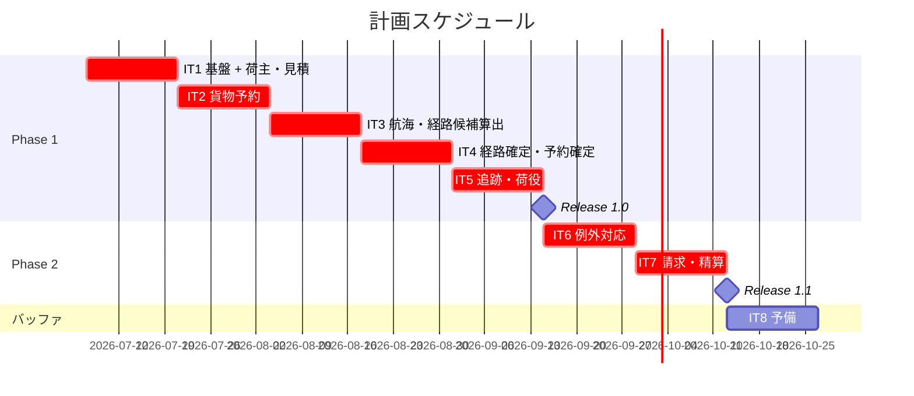
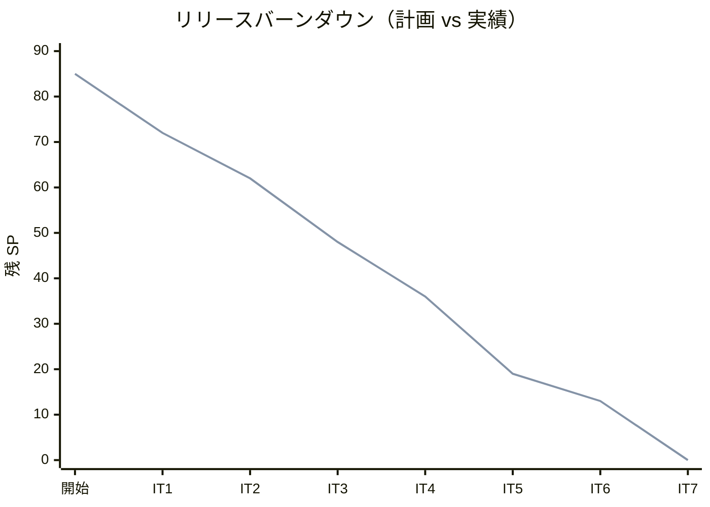

# リリース計画 - 国際貨物輸送管理システム（Cargo Tracker C# 版）

## 概要

本ドキュメントは、国際貨物輸送管理システム（Cargo Tracker C# 版）のリリース計画を定義します。
ユーザーストーリー × イテレーションの対応は本ドキュメントを Single Source of Truth とします（設計レビュー 2026-07-04 指摘 #8 への対応）。

### プロジェクト情報

| 項目 | 内容 |
|------|------|
| **プロジェクト名** | Cargo Tracker（国際貨物輸送管理システム C# 版） |
| **目的** | 予約から配送完了・精算までの一元管理（最適ルート自動提案・リアルタイム追跡・例外対応の迅速化） |
| **対象ユーザー** | 荷主・荷受人・営業担当者・経路設計者・追跡管理者・荷役作業員・経理担当者（7 アクター） |
| **開発チーム** | 開発者 1 名 + AI エージェント（XP プラクティス準拠） |

---

## 満足条件

### スコープ

DDD の 8 コンテキストのうち中核（Booking・Routing・Tracking）を Release 1.0（MVP）で提供し、Billing を Release 1.1 で追加する段階的リリース戦略を採用します。

| フェーズ | 内容 | ストーリー数 |
|---------|------|---------------|
| Phase 1（Release 1.0 / MVP） | 認証・見積・荷主・予約・経路設計・追跡・荷役 | 21 US |
| Phase 2（Release 1.1） | 例外対応の強化・請求・精算 | 5 US |
| **合計** | | **26 US** |

**スコープ外（本リリース計画に含めない）**:

- 税関・通関申告の業務ストーリー（対応 US が存在しない。設計レビュー指摘 #14 により、必要になった時点で US を起こす）
- 荷受人（Consignee）の集約化（US16/US18 は引取記録の属性と追跡番号照会で成立。指摘 #22 の割り切り）
- イベントソーシング・Transactional Outbox（ADR-0002 の将来移行項目）

### スケジュール

- **開発期間**: 2026-07-07 〜 2026-10-23（約 3.5 ヶ月 + バッファ）
- **イテレーション**: 2 週間 × 7 + 予備 1
- **リリース**: Release 1.0（IT5 完了時）、Release 1.1（IT7 完了時）

### リソース

- **開発者**: 1 名（AI エージェント協働）
- **想定稼働時間**: 20 時間/週

---

## ユーザーストーリー一覧とストーリーポイント

### 優先順位マトリックス

4 軸評価で優先順位を決定:

1. **金銭価値（BV）**: ビジネス価値
2. **コスト（C）**: 開発コスト
3. **知識習得（KA）**: 技術的学習価値
4. **リスク軽減（RR）**: リスク軽減効果

### Phase 1: MVP — 予約から追跡まで（イテレーション 1-5）

| ID | ユーザーストーリー | SP | BV | C | KA | RR | 優先度 | IT |
|----|-------------------|----|----|---|----|----|--------|-----|
| US26 | システムにログインする | 3 | 中 | 中 | 高 | 高 | 必須 | IT1 |
| US02 | 荷主を登録する | 3 | 中 | 低 | 高 | 高 | 必須 | IT1 |
| US03 | 法人荷主を登録する | 2 | 中 | 低 | 中 | 中 | 必須 | IT1 |
| US01 | 輸送見積を作成する | 5 | 高 | 中 | 高 | 中 | 必須 | IT1 |
| US04 | 貨物予約を登録する | 5 | 高 | 中 | 高 | 高 | 必須 | IT2 |
| US05 | 危険物・冷凍貨物の予約を登録する | 3 | 高 | 中 | 中 | 高 | 必須 | IT2 |
| US06 | 予約情報を経路設計者に引き渡す | 2 | 中 | 低 | 中 | 中 | 必須 | IT2 |
| US24 | 航海スケジュールを新規登録する | 3 | 高 | 低 | 中 | 高 | 必須 | IT3 |
| US25 | 既存航海スケジュールを更新する | 3 | 高 | 中 | 中 | 高 | 必須 | IT3 |
| US07 | 航海スケジュールを検索する | 3 | 高 | 低 | 中 | 中 | 必須 | IT3 |
| US08 | 経路候補を算出する | 5 | 高 | 高 | 高 | 高 | 必須 | IT3 |
| US09 | 経路を選択・確定する | 3 | 高 | 中 | 中 | 中 | 必須 | IT4 |
| US10 | 経路条件を調整して再算出する | 3 | 中 | 中 | 中 | 中 | 必須 | IT4 |
| US11 | 経路情報を予約に紐付ける | 2 | 高 | 低 | 中 | 中 | 必須 | IT4 |
| US12 | 確定経路を荷主に通知する | 2 | 中 | 低 | 中 | 低 | 必須 | IT4 |
| US13 | 予約を確定する | 2 | 高 | 低 | 中 | 中 | 必須 | IT4 |
| US14 | 追跡番号を発行する | 2 | 高 | 低 | 中 | 中 | 必須 | IT5 |
| US15 | 荷役作業を記録する | 5 | 高 | 中 | 高 | 高 | 必須 | IT5 |
| US16 | 引取作業を記録する | 3 | 高 | 低 | 中 | 中 | 必須 | IT5 |
| US17 | 貨物状態を手動更新する | 2 | 中 | 低 | 低 | 中 | 必須 | IT5 |
| US18 | 追跡情報を照会する | 5 | 高 | 中 | 高 | 中 | 必須 | IT5 |
| **合計** | | **66** | | | | | | |

### Phase 2: 例外対応・請求（イテレーション 6-7）

| ID | ユーザーストーリー | SP | BV | C | KA | RR | 優先度 | IT |
|----|-------------------|----|----|---|----|----|--------|-----|
| US19 | 遅延例外を処理する | 3 | 高 | 中 | 中 | 高 | 必須 | IT6 |
| US20 | 破損・紛失例外を処理する | 3 | 高 | 中 | 中 | 高 | 必須 | IT6 |
| US21 | 輸送料金を算出する | 5 | 高 | 中 | 高 | 中 | 中 | IT7 |
| US22 | 法人割引を適用する | 3 | 中 | 低 | 中 | 低 | 中 | IT7 |
| US23 | 精算を処理する | 5 | 高 | 中 | 中 | 中 | 中 | IT7 |
| **合計** | | **19** | | | | | | |

### 全体サマリー

| フェーズ | ストーリーポイント | イテレーション |
|---------|-------------------|---------------|
| Phase 1 | 66 SP | 1-5 |
| Phase 2 | 19 SP | 6-7 |
| **合計** | **85 SP** | 7 イテレーション + 予備 1 |

> **Note**: IT1 にはストーリー外の基盤タスク（DbUp 起動時配線・Unit of Work + post-commit イベント基盤。ADR-0001〜0003 の実装）を含めるため、IT1 のストーリー SP は少なめに設定しています。認証は US26 として正式にストーリー化しています。

---

## ベロシティ見積もり

### 初期ベロシティ推定

| 項目 | 値 |
|------|-----|
| **イテレーション期間** | 2 週間 |
| **チーム規模** | 1 名 + AI エージェント |
| **想定ベロシティ** | 12-15 SP/イテレーション |
| **バッファ係数** | 0.8（20% バッファ） |
| **実効ベロシティ** | 10-12 SP/イテレーション |

### ベロシティ検証計画

- IT1〜IT3 の実績でベロシティを較正し、IT3 終了時に本計画（IT 割り当て・リリース日）を再調整する
- 実績は各イテレーション完了報告書（`creating-iteration-report`）に記録し、本ドキュメントの進捗状況表へ転記する

---

## 段階的リリース戦略

### リリーススケジュール

#### 計画スケジュール

#### 実績スケジュール

| イテレーション | 計画 SP | 実績 SP | 状態 | 備考 |
|---------------|---------|---------|------|------|
| IT1 基盤 + 荷主・見積 | 13 | 13 | 完了 | US26/US02/US03/US01 完了。技術基盤（ADR-0002/0003）+ 認証 + ウォーキングスケルトン。全 62 テストパス |
| IT2 貨物予約 | 10 | 10 | 完了 | US04/US05/US06 完了。Booking BC 立ち上げ・危険物冷凍・経路設計者引き渡し（version 楽観ロック）。技術的負債 M1/M3/M4/M5・ArchUnit 拡張。全 117 テストパス |
| IT3 航海・経路算出 | 14 | 14 | 開発完了 | US24/US25/US07/US08 完了。Routing BC 立ち上げ・航海スケジュール管理・経路候補算出（BC 独立の CandidateRoute/IRouteCandidateService）。負債 H1/H2/H3/H4/T3・ADR-0006/0007。全 161 テストパス。T4 ハードゲート・H5 Playwright E2E は繰り越し |
| IT4 経路確定・予約確定 | 12 | 12 | 開発完了 | US09/US10/US11/US12/US13 完了。BC 連携 ACL（SQL 直接参照＋プリミティブ DTO）・確定経路の状態遷移・荷主通知（append-only）・ADR-0008。IT3 レビュー高優先消化。BookingStatus 永続化バグ是正（SCREAMING_SNAKE コーデック）。全 198 テストパス。IT3 レビュー H1-H7 を先行消化 |
| IT5 追跡・荷役 | 17 | 17 | 開発完了 | US14/US15/US16/US17/US18 完了。Tracking/Handling BC 立ち上げ・追跡番号イベント駆動自動発行・荷役妥当性検証（MISROUTED）・引取配送完了同期・追跡照会（認証/公開）。UnitOfWork post-commit 解放後 publish（ADR-0006 懸案解決）。SonarQube 全 A・カバレッジ 85.8%。実 MediatR E2E 補完。全 235 テストパス。カバレッジハードゲート・Playwright E2E は Release 1.1（IT6）へ繰り越し。**Release 1.0 MVP 出荷条件充足** |
| IT6 例外対応 | 6 | 6 | 開発完了 | US19/US20 完了。Tracking BC に追跡例外（遅延/破損/紛失）を追加。ExceptionType・TrackingExceptionEvent・単一未解決不変条件・状態復帰、TrackingExceptionDetectedEvent 発行、荷主/管理職エスカレーション通知（append-only）。IT5 レビュー高優先 H1（ADR-0009 post-commit 結果整合性）/H2（通知記録基盤）/H3（ArchUnit Tracking/Handling ルール）/H4（CLAIM/UNLOAD 状態同期 E2E）を先行消化。self-review 反映（xp-programmer/xp-tester）。ドメイン被覆 96-98%。全 255 テストパス。Playwright E2E・カバレッジ CI ハードゲート・SonarQube SQ-3/SQ-2 は環境操作前提で繰り越し |
| IT7 請求・精算 | 13 | 13 | 開発完了 | US21/US22/US23 完了。Billing BC 立ち上げ（Invoice 集約・Money 値オブジェクト（銀行家丸め）・DiscountRate・PaymentStatus・FreightCalculator）。料金算出（Delivered 制限＝改善 #16）・法人割引（Shipper 割引率 ACL）・精算書発行・入金確認（IPaymentGatewayPort スタブ）・PaymentConfirmedEvent→予約 Settled 同期・延滞発火。IT6 レビュー高優先 H1（対応報告通知）/H2（変換ヘルパ Shared 集約＝EnumDbCodec/DatabaseTimestamp）/M1（例外通知冪等化）を消化。用語統一（精算書＝#17）。正式 developing-review（XP 5 視点）実施＝高 1/中 5/低 6 を IT7 内で消化（延滞発火・異常系テスト・楽観ロック・payment 注記）。ドメイン被覆 Invoice 95.2%/Money 86.7%。全 302 テストパス。ArchUnit ルール 7 追加。Playwright E2E・カバレッジ CI ハードゲート・SonarQube SQ-3/SQ-2 は環境操作前提で繰り越し。**Release 1.1（Phase 2）出荷条件充足** |

（以降イテレーション完了ごとに更新）

### リリース内容

#### Release 1.0（Phase 1 完了）: MVP — 予約から追跡まで

**目標**: 荷主登録 → 見積 → 予約 → 経路設計 → 予約確定 → 荷役記録 → 追跡照会の業務フローが一気通貫で動作する。

**含まれる機能**:

- 認証・ロール別アクセス制御（US26）
- 荷主・法人荷主の登録（US02/03）、輸送見積（US01）
- 貨物予約（危険物・冷凍対応）と経路設計者への引き渡し（US04-06）
- 航海スケジュール管理・検索・経路候補算出・条件調整（US07-11、US24/25）
- 経路通知・予約確定・追跡番号発行（US12-14）
- 荷役・引取の記録と貨物状態管理・追跡照会（US15-18、公開追跡ページ含む）

**リリース条件**:

- [ ] 全ユニット・統合・アーキテクチャテストがパス（カバレッジ: ドメイン層 85% 以上）
- [ ] E2E 優先シナリオ（US13・US15・US18）がパス
- [ ] CI（Backend CI）グリーン、Heroku 開発環境で業務フローのデモ完了
- [ ] セキュリティレビュー（認証・認可）完了

#### Release 1.1（Phase 2 完了）: 例外対応・請求

**目標**: 遅延・破損・紛失の例外対応と、料金算出から精算までの経理業務を提供する。

**含まれる機能**:

- 例外登録・エスカレーション・荷主通知（US19/20）
- 輸送料金算出・法人割引・精算処理（US21-23）

**リリース条件**:

- [ ] 全テストがパス（カバレッジ維持）
- [ ] 金額計算の境界値テスト完了（Money 値オブジェクト・割引上限 30%）
- [ ] 性能スモーク（主要画面 p95 目標の確認）

---

## バッファ戦略

### フィーチャバッファ

| フェーズ | 計画 SP | バッファ（30%） | 実効 SP |
|---------|---------|-----------------|---------|
| Phase 1 | 66 | 20 | 46 |
| Phase 2 | 19 | 6 | 13 |

バッファ超過時に後回しする候補（優先度の低い順）: US17（手動更新）→ US10（条件調整の再算出）→ US22（法人割引）。

### スケジュールバッファ

- **予備イテレーション**: IT8（2026-10-12 〜 10-23）
- **全体バッファ**: 約 12%（1/8 イテレーション）

### バッファ消費ルール

1. フィーチャバッファを先に消費
2. 低優先度ストーリーを後回し
3. スケジュールバッファ（IT8）は最後の手段

---

## イテレーション計画概要

### イテレーション 1（2026-07-07 〜 07-18）

**ゴール**: 技術基盤（DbUp・UoW + post-commit イベント）と認証を確立し、荷主登録と見積で最初の業務価値を届ける。

**主なタスク**:

- [ ] DbUp 起動時配線（SQLite / PostgreSQL、初期スキーマ 0001）＋ Testcontainers 統合テスト基盤
- [ ] AggregateRoot / IUnitOfWork / post-commit ディスパッチ（ADR-0001/0002 の参照実装）
- [ ] US26 認証（Cookie 認証・ロール別アクセス制御・ログイン/ログアウト画面）
- [ ] US02/US03 荷主登録（Shipper コンテキスト縦切り: Domain → Repository → 画面）
- [ ] US01 輸送見積（Estimation コンテキスト）

**目標 SP**: 13（+ 基盤タスク）

詳細は [iteration_plan-1.md](./iteration_plan-1.md) を参照。

### イテレーション 2（2026-07-21 〜 08-01）

**ゴール**: 貨物予約（危険物・冷凍対応）を登録し、経路設計者へ引き渡せる。

**目標 SP**: 10（US04/05/06）

### イテレーション 3（2026-08-04 〜 08-15）

**ゴール**: 航海スケジュールを管理し、外部経路サービス ACL 経由で経路候補を算出できる。

**目標 SP**: 14（US24/25/07/08）

### イテレーション 4（2026-08-18 〜 08-29）

**ゴール**: 経路の選択・調整・紐付けから予約確定・荷主通知までの予約フローが完結する。

**目標 SP**: 12（US09/10/11/12/13）

詳細は [イテレーション 4 計画](./iteration_plan-4.md) を参照。

### イテレーション 5（2026-08-31 〜 09-11）

**ゴール**: 追跡番号発行・荷役/引取記録・追跡照会（公開ページ含む）が動作し、Release 1.0 を出荷する。

**目標 SP**: 17（US14/15/16/17/18）※ 超過分はフィーチャバッファで US17 を調整候補とする

詳細は [イテレーション 5 計画](./iteration_plan-5.md) を参照。

### イテレーション 6（2026-09-14 〜 09-25）

**ゴール**: 遅延・破損・紛失の例外登録とエスカレーション・荷主通知が動作する。

**目標 SP**: 6（US19/20）+ Release 1.0 フィードバック対応

### イテレーション 7（2026-09-28 〜 10-09）

**ゴール**: 料金算出・法人割引・精算が動作し、Release 1.1 を出荷する。

**目標 SP**: 13（US21/22/23）

各イテレーションの詳細は着手時に `iteration_plan-N.md` として作成する。

---

## 改善バックログ（設計レビュー 2026-07-04 の残指摘）

重要度「高」8 件は対応済み（#8 は本計画で解消）。中・低優先度の残指摘は以下のイテレーションで消化する。

| レビュー # | 内容 | 対応 IT | 備考 |
|-----------|------|---------|------|
| #23 | CQRS 段階適用の ADR 検討 | IT1 | 基盤タスクと同時に判断 |
| #24 | DbUp スクリプト両対応の検証テスト | IT1 | ADR-0003 の CI 方言検出テストとして実装 |
| #15 | 見積 → 予約の導線（見積番号引き継ぎ） | IT2 | US04 の受入と同時に設計 |
| #18 | 引取の荷受人確認入力 | IT5 | US16 の受入基準（UI 設計反映済み） |
| #19, #20, #21 | 追跡入口の整理・ポーリング間隔・ロール別ダッシュボード | IT5-6 | US18 実装時に PO 確認のうえ調整 |
| #16, #17 | 請求書発行の Delivered 制限・用語統一（請求書/精算書） | IT7 | US21/23 の受入と同時 |
| #25-30（低） | 表記統一・確認ダイアログ・通知スコープ明記ほか | バッファ | IT8 または随時 |

### SonarQube 静的解析の指摘（2026-07-09 初回スキャン・IT3 時点）

初回スキャン結果: Quality Gate **OK**・Bug 0・脆弱性 0・重複 1.8%・信頼性/セキュリティ/保守性 **A**。コードスメル 158 件（技術的負債約 11h）。BLOCKER 3・CRITICAL 1 は即対応済み（空テスト削除・CandidateRoute の S2365）。残りを **IT4 の品質改善タスク**として消化する。

| SQ # | 内容 | 重大度/件数 | 対応 IT | 備考 |
|------|------|-----------|---------|------|
| SQ-1 | **カバレッジの SonarQube 取込整備**（coverlet.collector→opencover 等）。現状カバレッジ 0% で未計測。CI 品質ゲート連携（operating-cicd）と合わせて整備 | 高（計測穴） | IT4 | ドメイン層 85%/全体 80% ゲート化の前提 |
| SQ-2 | `S6967` ModelState.IsValid チェック（Routing/Voyage/Estimate/Auth Controller）。GET アクションの誤検出を精査し、必要箇所のみ対応 or 抑制 | CRITICAL 4 | IT4 | 誤検出の切り分け要 |
| SQ-3 | `Web:S6853` Razor の label とコントロール関連付け（アクセシビリティ）。IT2/IT3 レビューのアクセシビリティ指摘と同根 | MAJOR 33 | IT4 | UI 日本語化・アクセシビリティ一括対応と合流 |
| SQ-4 | `S1144` 未使用 private メンバー削除 | MAJOR 23 | IT4 | 機械的返済 |
| SQ-5 | `SYSLIB1045` 正規表現の GeneratedRegex 化 | MAJOR 22 | IT4 | ソースジェネレータ化 |
| SQ-6 | `S3459`・`S107`（引数過多）・`S6931`（ルートテンプレート）ほか残スメル | MAJOR/MINOR ほか | IT4-5 | 優先度順に随時 |

---

## リスク管理

### 技術リスク

| リスク | 影響度 | 発生確率 | 対策 |
|--------|--------|----------|------|
| Dapper + DDD 集約永続化の実装コストが想定超過（ADR-0001） | 高 | 中 | IT1 で Cargo/Shipper の参照実装を先行し、パターンを確立してから横展開 |
| 二方言（SQLite/PostgreSQL）の実行時 SQL 方言漏れ（ADR-0003） | 中 | 中 | 方言検出テストを IT1 で CI に組み込み。四半期ごとに A 案（PostgreSQL 統一）を再評価 |
| 外部経路サービス ACL の契約不確定（US08） | 高 | 中 | WireMock.Net でスタブ契約を先に固定し、経路算出はスタブ駆動で実装 |
| post-commit イベント基盤の不具合が広範囲に波及 | 高 | 低 | IT1 でロールバック時非発行の統合テストを必須化（ADR-0002 コンプライアンス） |

### スケジュールリスク

| リスク | 影響度 | 発生確率 | 対策 |
|--------|--------|----------|------|
| 初期ベロシティの見積り外れ | 中 | 高 | IT3 終了時に較正・計画改訂を必須イベントにする |
| IT5 の過積載（17 SP） | 中 | 中 | US17 を最初の切り出し候補として明示。IT4 で前倒し可能なら US14 を先行 |
| 1 名体制の稼働変動 | 中 | 中 | 予備 IT8 と 30% フィーチャバッファで吸収 |

---

## 進捗管理

### メトリクス

| メトリクス | 目標 |
|-----------|------|
| ベロシティ | 10-12 SP/イテレーション |
| テストカバレッジ | 80% 以上（ドメイン層 85% 以上） |
| バグ密度 | 0.5 件/SP 以下 |
| 予定達成率 | 90% 以上 |

### 進捗状況

| イテレーション | 計画 SP | 実績 SP | 達成率 | 状態 |
|---------------|---------|---------|--------|------|
| IT1 | 13 | 13 | 100% | 完了 |
| IT2 | 10 | 10 | 100% | 完了 |
| IT3 | 14 | 14 | 100% | 完了 |
| IT4 | 12 | 12 | 100% | 完了 |
| IT5 | 17 | 17 | 100% | 開発完了（機能実装完了・Release 1.0 MVP 出荷条件充足。品質ゲートの一部繰り越し） |
| IT6 | 6 | 6 | 100% | 開発完了（US19/US20 例外対応・IT5 レビュー H1-H4 消化。品質ゲートの一部繰り越し） |
| IT7 | 13 | 13 | 100% | 開発完了（US21/US22/US23 請求・精算・Billing BC 立ち上げ・IT6 レビュー H1/H2/M1 消化・正式レビュー是正。Release 1.1 Phase 2 出荷条件充足。品質ゲートの一部繰り越し） |

### バーンダウンチャート

> **実績**: IT7 開発完了時点で残 0 SP（計画どおり 13 SP を消化）。ベロシティ実績 IT1=13・IT2=10・IT3=14・IT4=12・IT5=17・IT6=6・IT7=13（平均 12.1 SP/IT）。**全 85 SP を消化し Release 1.1（Phase 2・例外対応＋請求精算）の機能実装が完了**。Billing BC を立ち上げ、料金算出→法人割引→精算書発行→入金確認→予約 Settled 同期が全層で完結。IT6 レビュー H1/H2/M1・改善 #16/#17 を消化し、正式 developing-review（XP 5 視点）の高・中優先指摘も IT7 内で是正。全 302 テスト緑（Domain 140 / App 3 / Arch 9 / Web 66 / E2E 4 / Infra 80）・0 警告。ドメイン被覆 Invoice 95.2%/Money 86.7%。品質ゲート（カバレッジ CI ハードゲート・SonarQube・Playwright E2E）は環境操作前提で繰り越し。

> **実績**: IT6 開発完了時点で残 13 SP（計画どおり 6 SP を消化）。ベロシティ実績 IT1=13・IT2=10・IT3=14・IT4=12・IT5=17・IT6=6（平均 12.0 SP/IT）。IT6 は US19/US20（6 SP）に加え IT5 レビュー高優先 H1-H4 と通知記録基盤の消化を伴う。**例外対応が全層（ドメイン→永続化→アプリ→イベント→通知→UI→受け入れ）で完結**。全 255 テスト緑（Domain 116 / App 3 / Arch 8 / Web 63 / E2E 4 / Infra 61）・0 警告。ドメイン被覆 96-98%。品質ゲート（カバレッジ CI ハードゲート・SonarQube・Playwright E2E）は環境操作前提で繰り越し。

> **実績**: IT5 開発完了時点で残 19 SP（計画どおり 17 SP を消化）。ベロシティ実績 IT1=13・IT2=10・IT3=14・IT4=12・IT5=17（平均 13.2 SP/IT）。**Release 1.0（MVP・Phase 1）の全 66 SP のうち予約〜追跡フローが全層で完結**。全 235 テスト緑（Domain 108 / App 3 / Arch 6 / Web 58 / E2E 4 / Infra 56）。品質ゲート（カバレッジ 85%・SonarQube・Playwright E2E）は環境操作前提で繰り越し。

> **実績**: IT4 開発完了時点で残 36 SP（計画どおり 12 SP を消化）。ベロシティ実績 IT1=13・IT2=10・IT3=14・IT4=12（平均 12.25 SP/IT）。4 イテレーション連続で計画=実績が一致し、計画は現状維持。全 198 テスト緑（Domain 93 / App 3 / Arch 6 / Web 48 / E2E 4 / Infra 44）。

---

## 次のステップ

1. `validating-iteration-plan` で本計画と設計ドキュメント群の整合性を検証する
2. `--iteration 1` で IT1 の詳細計画（タスク分解）を作成する
3. `syncing-github-project` で GitHub Project / Issue / Milestone に同期する

---

## 更新履歴

| 日付 | 更新内容 | 更新者 |
|------|---------|--------|
| 2026-07-04 | 初版作成（US25 件・82 SP・7+1 イテレーション） | - |
| 2026-07-04 | US26（認証）を追加し IT1 に割り当て（26 US・85 SP）。改善バックログ節を追加 | - |
