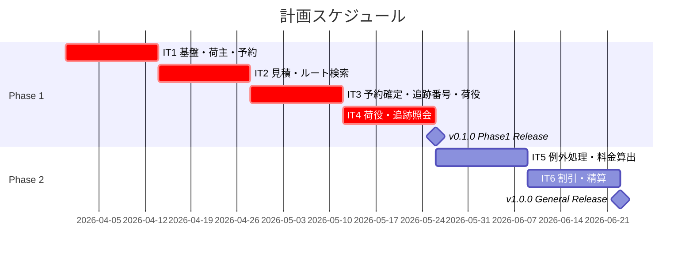
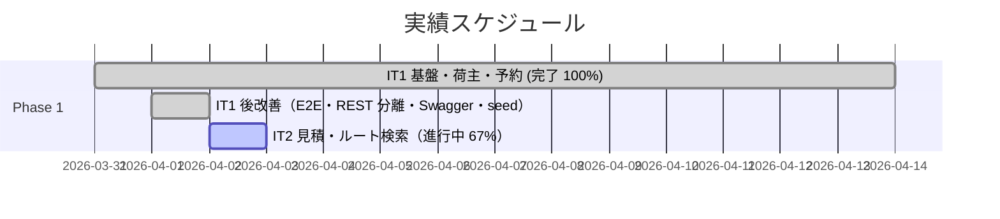
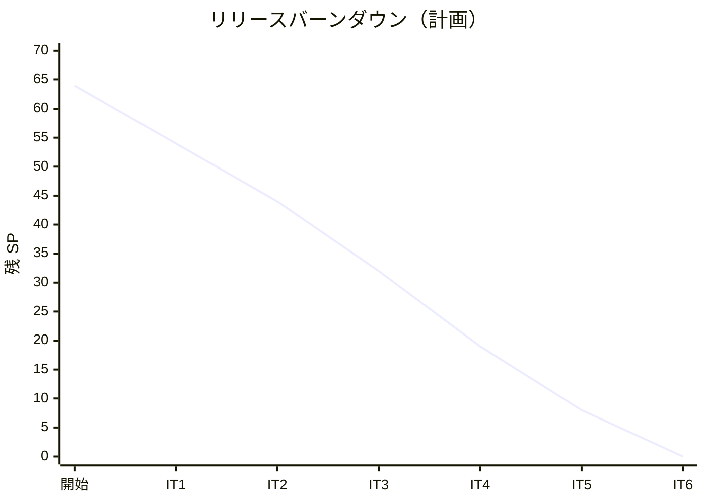

# リリース計画 - 国際貨物輸送管理システム

## 概要

### プロジェクト情報

| 項目 | 内容 |
|------|------|
| **プロジェクト名** | Case Study Cargo Tracker |
| **目的** | Jakarta EE 参考実装を Spring Boot 4 + DDD + ヘキサゴナル + CQRS に移植し、現代的な Java アーキテクチャを実践する |
| **対象ユーザー** | 国際貨物輸送に関わる営業担当者・経路設計者・荷役作業員・経理担当者・追跡管理者 |
| **開発チーム** | 1 名（AI 支援開発） |
| **技術スタック** | Java 25 / Spring Boot 4.0.5（ADR-001 参照）/ Thymeleaf / htmx / AWS ECS+RDS |

---

## 満足条件

### スコープ

| フェーズ | 内容 | ユーザーストーリー |
|---------|------|-----------------|
| Phase 1 | コア輸送管理（荷主登録・予約・ルート・追跡・荷役・例外処理） | US01〜US15（15 件） |
| Phase 2 | 請求・精算（料金算出・割引適用・精算処理） | US16〜US18（3 件） |
| **合計** | | **18 件** |

### スケジュール

- **開発開始**: 2026-03-31
- **イテレーション期間**: 2 週間 × 6 イテレーション
- **Phase 1 リリース（v0.1.0）**: 2026-05-25（IT4 完了時）
- **Phase 2 リリース（v1.0.0）**: 2026-06-22（IT6 完了時）

### リソース

- **開発者**: 1 名
- **想定稼働時間**: 40h/週（理想時間）
- **バッファ係数**: 0.75（25% バッファ）
- **実効稼働時間**: 30h/週

---

## ユーザーストーリー一覧とストーリーポイント

### 基準ストーリー

**US02（荷主登録）= 3SP** を基準ストーリーとする。

- 1 SP ≈ 4h 理想時間（ドメインモデル + テスト + UI の標準的な 1 機能）
- SP は Fibonacci 数列（1, 2, 3, 5, 8）を使用

### 優先順位マトリックス

4 軸評価で優先順位を決定（高=3点、中=2点、低=1点）:

1. **BV（金銭価値）**: ビジネス・業務価値
2. **C（コスト）**: 開発コスト（逆転、低コスト=高スコア）
3. **KA（知識習得）**: DDD・ヘキサゴナルの学習価値
4. **RR（リスク軽減）**: 技術的・業務的リスク軽減効果

### Phase 1: コア輸送管理（IT1〜IT4）

| ID | ユーザーストーリー | SP | BV | C | KA | RR | 優先度 | IT |
|----|-------------------|----|----|---|----|----|--------|---|
| US02 | 荷主を登録する | 3 | 高 | 低 | 低 | 中 | 必須 | IT1 |
| US03 | 法人荷主を登録する | 2 | 高 | 低 | 低 | 中 | 必須 | IT1 |
| US04 | 貨物予約を登録する | 5 | 高 | 中 | 高 | 高 | 必須 | IT1 |
| US01 | 輸送見積を作成する | 5 | 高 | 中 | 高 | 中 | 必須 | IT2 |
| US06 | 最適ルートを検索する | 5 | 高 | 中 | 高 | 高 | 必須 | IT2 |
| US05 | 危険物・冷凍貨物の予約を登録する | 3 | 中 | 低 | 中 | 高 | 必須 | IT3 |
| US07 | ルートを選択して予約に紐付ける | 3 | 高 | 低 | 中 | 中 | 必須 | IT3 |
| US08 | 予約を確定する | 3 | 高 | 低 | 高 | 高 | 必須 | IT3 |
| US09 | 追跡番号を発行する | 3 | 高 | 低 | 高 | 高 | 必須 | IT3 |
| US10 | 荷役作業を記録する | 3 | 高 | 低 | 高 | 中 | 必須 | IT4 |
| US11 | 引取作業を記録する | 3 | 高 | 低 | 中 | 中 | 必須 | IT4 |
| US12 | 貨物状態を手動更新する | 2 | 中 | 低 | 低 | 低 | 必須 | IT4 |
| US13 | 追跡情報を照会する | 5 | 高 | 中 | 高 | 中 | 必須 | IT4 |
| US14 | 遅延例外を処理する | 3 | 中 | 低 | 中 | 中 | 中 | IT5 |
| US15 | 破損・紛失例外を処理する | 3 | 中 | 低 | 中 | 中 | 中 | IT5 |
| **Phase 1 合計** | | **51** | | | | | | |

### Phase 2: 請求・精算（IT5〜IT6）

| ID | ユーザーストーリー | SP | BV | C | KA | RR | 優先度 | IT |
|----|-------------------|----|----|---|----|----|--------|---|
| US16 | 輸送料金を算出する | 5 | 高 | 中 | 高 | 中 | 中 | IT5 |
| US17 | 法人割引を適用する | 3 | 中 | 低 | 中 | 低 | 中 | IT6 |
| US18 | 精算を処理する | 5 | 高 | 中 | 中 | 中 | 中 | IT6 |
| **Phase 2 合計** | | **13** | | | | | | |

### 全体サマリー

| フェーズ | ストーリーポイント | イテレーション |
|---------|-----------------|--------------|
| Phase 1 | 51 SP | IT1〜IT5 |
| Phase 2 | 13 SP | IT5〜IT6 |
| **合計** | **64 SP** | **6 イテレーション** |

---

## ベロシティ見積もり

### 初期ベロシティ推定

| 項目 | 値 |
|------|-----|
| **イテレーション期間** | 2 週間 |
| **チーム規模** | 1 名 |
| **想定ベロシティ** | 10〜13 SP/イテレーション |
| **バッファ係数** | 0.75（25% バッファ） |
| **実効ベロシティ** | 10〜13 SP/イテレーション |
| **IT1 初期ベロシティ（推定）** | 10 SP（環境構築オーバーヘッドあり） |

### ベロシティ検証計画

- **IT1 終了時**: 実績 SP を記録し IT2 以降を調整
- **IT3 終了時**: 3 イテレーション実績でベロシティを再確定
- **IT5 終了時**: Phase 2 のスコープ調整（必要な場合）

### 1 SP 換算

| SP | 理想時間 | 具体例 |
|----|---------|-------|
| 1 | 4h | 単純なフィールド追加（CRUD 1 項目） |
| 2 | 8h | 単純な画面 + バリデーション |
| 3 | 12h | 標準的な CRUD + テスト（US02 基準） |
| 5 | 20h | 複雑なドメインロジック + テスト + UI |
| 8 | 32h | 複数集約にまたがる機能 |

---

## 段階的リリース戦略

### リリーススケジュール（計画）

#### 実績スケジュール

### リリース内容

#### v0.1.0（Phase 1 完了）: コア輸送管理リリース

**目標**: 荷主登録〜貨物追跡までの基幹業務フローを完成させる

**含まれる機能**:

- 荷主登録（個人・法人）
- 貨物予約登録（危険物・冷凍貨物対応）
- 輸送見積作成
- 最適ルート検索・選択
- 予約確定・追跡番号発行
- 荷役作業・引取作業の記録
- 貨物状態照会（認証あり・公開追跡ページ）
- 遅延・破損・紛失の例外処理

**リリース条件**:

- [ ] 全ユニットテストがパス（カバレッジ 80% 以上）
- [ ] 統合テストがパス
- [ ] E2E テスト（主要ハッピーパス）がパス
- [ ] US01〜US15 の受入基準をすべて満たす
- [ ] セキュリティレビュー完了（OWASP Top 10 基本対策）
- [ ] `./gradlew bootRun` でローカル起動確認

#### v1.0.0（Phase 2 完了）: 一般提供リリース

**目標**: 請求・精算機能を追加し、エンドツーエンドの業務フローを完成させる

**含まれる機能**:

- 輸送料金算出（基本料金・サーチャージ）
- 法人割引適用（CONTRACT / VOLUME 顧客区分）
- 割引ポリシー管理（管理者 UI）
- 精算処理（請求書発行・入金確認・精算完了）

**リリース条件**:

- [ ] v0.1.0 の全条件を満たすこと
- [ ] US16〜US18 の受入基準をすべて満たす
- [ ] パフォーマンステスト（p95 レイテンシ基準クリア）
- [ ] CHANGELOG.md を更新

---

## バッファ戦略

### フィーチャバッファ

| フェーズ | 計画 SP | バッファ（25%） | 実効 SP |
|---------|---------|----------------|---------|
| Phase 1 | 51 | 13 | 38（最低限） |
| Phase 2 | 13 | 3 | 10（最低限） |

バッファ消費時の対象候補（スコープから除外可能）:

- US05 危険物・冷凍貨物（Phase 1 内で後回し可）
- US12 手動更新（US10/11 で代替可）
- US14/US15 例外処理（v1.1.0 以降に延期可）

### スケジュールバッファ

- **予備期間**: なし（6 イテレーション固定）
- **予備策**: 低優先度ストーリー（US14、US15）を v1.1.0 に延期

### バッファ消費ルール

1. フィーチャバッファを先に消費（低優先度 US を後回し）
2. スケジュールバッファ（イテレーション延長）は最後の手段
3. バッファ消費 50% 到達時にリスク検討会を実施

---

## イテレーション計画概要

### IT1（Week 1-2: 2026-03-31〜2026-04-13）

**ゴール**: プロジェクト基盤（認証・DB・CI）を整え、荷主登録・貨物予約の CRUD を動作させる

**対象ストーリー**:

- US02 荷主を登録する（3SP）
- US03 法人荷主を登録する（2SP）
- US04 貨物予約を登録する（5SP）

**目標 SP**: 10

詳細は [iteration_plan-1.md](./iteration_plan-1.md) を参照。

### IT2（Week 3-4: 2026-04-14〜2026-04-27）

**ゴール**: 輸送見積と最適ルート検索機能を完成させる

**対象ストーリー**:

- US01 輸送見積を作成する（5SP）
- US06 最適ルートを検索する（5SP）

**目標 SP**: 10

詳細は [iteration_plan-2.md](./iteration_plan-2.md) を参照。

### IT3（Week 5-6: 2026-04-28〜2026-05-11）

**ゴール**: ルート確定から追跡番号発行・荷役記録までの業務フローを完成させる

**対象ストーリー**:

- US05 危険物・冷凍貨物の予約登録（3SP）
- US07 ルートを選択して予約に紐付ける（3SP）
- US08 予約を確定する（3SP）
- US09 追跡番号を発行する（3SP）

**目標 SP**: 12

詳細は [iteration_plan-3.md](./iteration_plan-3.md) を参照。

### IT4（Week 7-8: 2026-05-12〜2026-05-25）

**ゴール**: 荷役作業の記録と貨物追跡照会を完成させ Phase 1 コア機能をリリースする

**対象ストーリー**:

- US10 荷役作業を記録する（3SP）
- US11 引取作業を記録する（3SP）
- US12 貨物状態を手動更新する（2SP）
- US13 追跡情報を照会する（5SP）

**目標 SP**: 13

詳細は [iteration_plan-4.md](./iteration_plan-4.md) を参照。
→ **v0.1.0 リリース**

### IT5（Week 9-10: 2026-05-26〜2026-06-08）

**ゴール**: 例外処理と輸送料金算出を完成させる

**対象ストーリー**:

- US14 遅延例外を処理する（3SP）
- US15 破損・紛失例外を処理する（3SP）
- US16 輸送料金を算出する（5SP）

**目標 SP**: 11

詳細は [iteration_plan-5.md](./iteration_plan-5.md) を参照。

### IT6（Week 11-12: 2026-06-09〜2026-06-22）

**ゴール**: 割引適用と精算処理を完成させ v1.0.0 をリリースする

**対象ストーリー**:

- US17 法人割引を適用する（3SP）
- US18 精算を処理する（5SP）

**目標 SP**: 8

詳細は [iteration_plan-6.md](./iteration_plan-6.md) を参照。
→ **v1.0.0 リリース**

---

## リスク管理

### 技術リスク

| リスク | 影響度 | 発生確率 | 対策 |
|--------|--------|---------|------|
| Java 25 / Spring Boot 4.0 の安定性不足 | 高 | 中 | ADR-001 フォールバック（Java 21 + SB 3.4）を即時発動。ゲート条件: ライブラリ対応率 90% 未達または重大バグ発生 |
| DDD + ヘキサゴナルの学習コスト超過 | 中 | 高 | IT1 でアーキテクチャ基盤を確立し、以降は同パターンの繰り返し。ペアプログラミング（AI）で補完 |
| @TransactionalEventListener の統合テスト複雑度 | 中 | 中 | ADR-002 の `@Commit` テストパターンを IT1 で確立 |
| MyBatis + 複雑クエリのパフォーマンス劣化 | 低 | 低 | IT4 の追跡照会実装時にクエリ最適化レビューを実施 |

### スケジュールリスク

| リスク | 影響度 | 発生確率 | 対策 |
|--------|--------|---------|------|
| IT1 環境構築オーバーヘッドによる遅延 | 中 | 高 | IT1 の目標 SP を 10 に抑え、環境構築タスクを計画に明示的に含める |
| SP 見積もりの精度不足（IT1-2） | 中 | 高 | IT3 終了時にベロシティを実績値で更新し、残りの計画を調整 |
| 外部システム（ルート照会 API）の未実装 | 高 | 中 | WireMock スタブで代替。実 API との契約テストは IT3 で追加 |

---

## 進捗管理

### メトリクス目標

| メトリクス | 目標 |
|-----------|------|
| ベロシティ | 10〜13 SP/イテレーション |
| テストカバレッジ | 80% 以上（ユニット + 統合） |
| バグ密度 | 1.0 件/SP 以下 |
| 予定達成率 | 90% 以上 |

### 進捗状況

| イテレーション | 期間 | 計画 SP | 実績 SP | 達成率 | 状態 |
|--------------|------|---------|---------|--------|------|
| IT1 | 2026-03-31〜04-13 | 10 | 10 | 100% | **完了** ✅ |
| IT2 | 2026-04-14〜04-27 | 10 | 5 | 67%（進行中） | **進行中** 🚧 |
| IT3 | 2026-04-28〜05-11 | 12 | - | - | 未着手 |
| IT4 | 2026-05-12〜05-25 | 13 | - | - | 未着手 |
| IT5 | 2026-05-26〜06-08 | 11 | - | - | 未着手 |
| IT6 | 2026-06-09〜06-22 | 8 | - | - | 未着手 |
| **合計** | | **64** | **15** | **23%** | |

### バーンダウンチャート（計画）

---

## Definition of Done

イテレーション完了の判定基準:

- [ ] 対象ストーリーの全受入基準を満たす
- [ ] ユニットテストがすべてパス（カバレッジ 80% 以上）
- [ ] 統合テストがすべてパス
- [ ] コードレビュー完了（AI ペアレビュー）
- [ ] `docs/development/release_plan.md` の進捗状況を更新
- [ ] Conventional Commits 準拠のコミットメッセージ

---

## 次のステップ

1. **IT2 計画具体化**: US01 / US06 の詳細タスクと受入基準を確定する
2. **GitHub Project 同期**: IT2 対象 Issue・Milestone・Label を最新計画へ反映する
3. **実装開始準備**: route provider stub と quote モデルの TDD 着手順を確認する
4. **品質維持**: backend 113 テスト Green、E2E 9 件 Green、SonarQube Quality Gate PASS を維持したまま IT2 に着手する

---

## 更新履歴

| 日付 | 更新内容 | 更新者 |
|------|---------|--------|
| 2026-03-31 | 初版作成（Phase 1・2、6 イテレーション計画） | Copilot |
| 2026-03-31 | IT1 進捗更新（5/10 SP 完了・US02・US03 実装済み） | Copilot |
| 2026-03-31 | IT1 完了（10/10 SP・US02・US03・US04 全実装済み・72 テスト Green） | Copilot |
| 2026-04-01 | IT1 完了後の改善を反映（108 テスト Green、E2E 9 件 Green、Swagger UI、default seed data、Web・REST 分離） | Copilot |
| 2026-04-01 | IT1 完了報告書とふりかえりを追加（113 テスト Green、Quality Gate PASS） | Copilot |
| 2026-04-01 | IT2 計画を追加（US01 / US06、10 SP、見積・ルート検索） | Copilot |
| 2026-04-02 | IT2 進行中に更新（US01 完了 5SP、US06 進行中、累計 15SP・23%） | Copilot |
