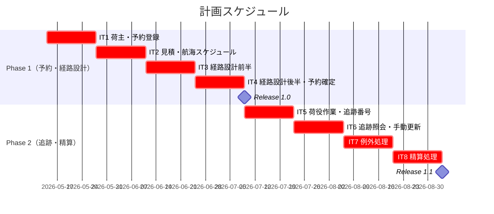
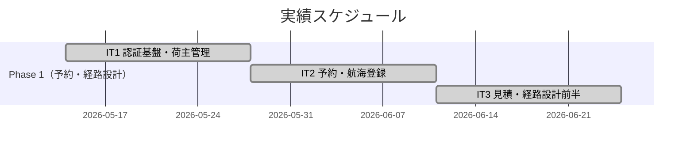
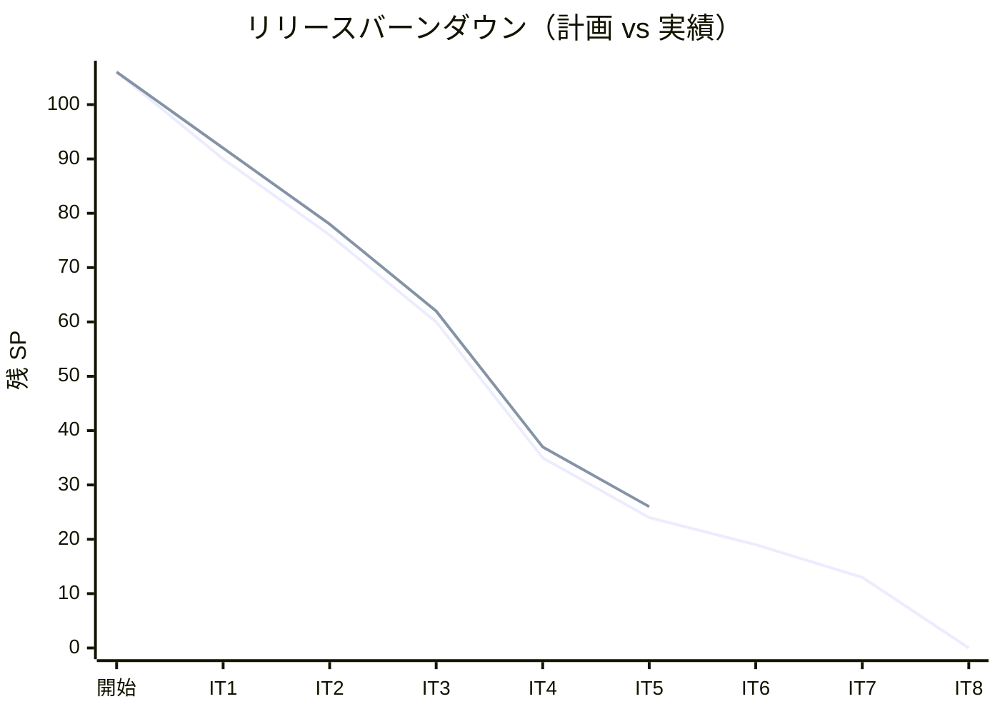

# リリース計画 - 国際貨物輸送管理システム

## 概要

本ドキュメントは、国際貨物輸送管理システム（CargoTracker take-4）のリリース計画を定義します。

### プロジェクト情報

| 項目 | 内容 |
|------|------|
| **プロジェクト名** | 国際貨物輸送管理システム（CargoTracker take-4） |
| **目的** | DDD + Hexagonal + CQRS + Event Sourcing + Saga パターンの実践学習と、国際貨物輸送業務の中核機能実装 |
| **対象ユーザー** | 営業担当者、経路設計者、荷役作業員、追跡管理者、経理担当者、荷主 |
| **開発チーム** | AI エージェント（Claude Code）+ 人間 1 名 |

---

## 満足条件

### スコープ

25 ユーザーストーリー（US01〜US25）を 2 フェーズに分けて段階的にリリースする。

| フェーズ | 内容 | ユーザーストーリー数 |
|---------|------|---------------------|
| Phase 1 | 予約・経路設計コア（荷主管理〜予約確定・追跡番号発行） | 14 US |
| Phase 2 | 追跡・例外処理・精算 | 11 US |
| **合計** | | **25 US** |

### スケジュール

- **開発期間**: 2026-05-14 〜 2026-09-02（16 週間）
- **イテレーション**: 2 週間 × 8 イテレーション
- **リリース**: Release 1.0（IT4 完了後）、Release 1.1（IT8 完了後）

### リソース

- **開発者**: 1 名（AI エージェント協働）
- **想定稼働時間**: 20 時間/週

---

## ユーザーストーリー一覧とストーリーポイント

### 優先順位マトリックス

4 軸評価で優先順位を決定:

1. **金銭価値（BV）**: ビジネス価値
2. **コスト（C）**: 開発コスト
3. **知識習得（KA）**: 技術的学習価値
4. **リスク軽減（RR）**: リスク軽減効果

### Phase 0: 認証基盤（IT1 前半）

| ID | ユーザーストーリー | SP | BV | C | KA | RR | 優先度 |
|----|-------------------|----|----|---|----|----|--------|
| US00 | システムにログインする | 5 | 高 | 中 | 高 | 高 | 必須 |
| US00a | ユーザーアカウントを管理する | 3 | 高 | 低 | 中 | 高 | 必須 |
| **合計** | | **8** | | | | | |

### Phase 1: 予約・経路設計コア（IT1〜IT4）

| ID | ユーザーストーリー | SP | BV | C | KA | RR | 優先度 |
|----|-------------------|----|----|---|----|----|--------|
| US02 | 荷主を登録する | 3 | 高 | 低 | 低 | 低 | 必須 |
| US03 | 法人荷主を登録する | 3 | 中 | 低 | 低 | 低 | 必須 |
| US04 | 貨物予約を登録する | 5 | 高 | 中 | 中 | 高 | 必須 |
| US05 | 危険物・冷凍貨物の予約を登録する | 3 | 中 | 低 | 低 | 高 | 必須 |
| US24 | 航海スケジュールを新規登録する | 3 | 高 | 低 | 中 | 高 | 必須 |
| US25 | 既存航海スケジュールを更新する | 3 | 中 | 低 | 低 | 中 | 必須 |
| US01 | 輸送見積を作成する | 5 | 高 | 中 | 高 | 中 | 必須 |
| US06 | 予約情報を経路設計者に引き渡す | 3 | 高 | 低 | 低 | 中 | 必須 |
| US07 | 航海スケジュールを検索する | 5 | 高 | 中 | 高 | 高 | 必須 |
| US08 | 経路候補を算出する | 8 | 高 | 高 | 高 | 高 | 必須 |
| US09 | 経路を選択・確定する | 3 | 高 | 低 | 低 | 中 | 必須 |
| US10 | 経路条件を調整して再算出する | 3 | 中 | 低 | 中 | 中 | 必須 |
| US11 | 経路情報を予約に紐付ける | 2 | 高 | 低 | 低 | 低 | 必須 |
| US12 | 確定経路を荷主に通知する | 3 | 高 | 低 | 低 | 低 | 必須 |
| US13 | 予約を確定する | 3 | 高 | 低 | 低 | 低 | 必須 |
| US14 | 追跡番号を発行する | 3 | 高 | 低 | 中 | 中 | 必須 |
| **合計** | | **57** | | | | | |

### Phase 2: 追跡・例外処理・精算（IT5〜IT8）

| ID | ユーザーストーリー | SP | BV | C | KA | RR | 優先度 |
|----|-------------------|----|----|---|----|----|--------|
| US15 | 荷役作業を記録する | 5 | 高 | 中 | 中 | 高 | 必須 |
| US16 | 引取作業を記録する | 3 | 高 | 低 | 低 | 中 | 必須 |
| US17 | 貨物状態を手動更新する | 3 | 高 | 低 | 低 | 低 | 必須 |
| US18 | 追跡情報を照会する | 5 | 高 | 中 | 高 | 中 | 必須 |
| US19 | 遅延例外を処理する | 3 | 高 | 低 | 中 | 高 | 必須 |
| US20 | 破損・紛失例外を処理する | 3 | 高 | 低 | 中 | 高 | 必須 |
| US21 | 輸送料金を算出する | 5 | 高 | 中 | 中 | 中 | 必須 |
| US22 | 法人割引を適用する | 3 | 中 | 低 | 低 | 低 | 中 |
| US23 | 精算を処理する | 5 | 高 | 中 | 中 | 中 | 必須 |
| **合計** | | **35** | | | | | |

### 全体サマリー

| フェーズ | ストーリーポイント | イテレーション |
|---------|-------------------|---------------|
| 認証基盤 | 8 SP | IT1（前半） |
| Phase 1 | 57 SP | IT1（後半）〜IT4 |
| Phase 2 | 35 SP | IT5〜IT8 |
| **合計** | **100 SP** | **8 イテレーション** |

---

## ベロシティ見積もり

### 初期ベロシティ推定

| 項目 | 値 |
|------|-----|
| **イテレーション期間** | 2 週間 |
| **チーム規模** | 1 名（AI 協働） |
| **想定ベロシティ** | 13〜15 SP/イテレーション |
| **バッファ係数** | 0.8（20%バッファ） |
| **実効ベロシティ** | 10〜12 SP/イテレーション |

### ベロシティ検証計画

- IT1〜IT3 の実績を集計し IT4 着手前に計画を見直す
- 3 イテレーション後にベロシティを再設定し、残余 SP からリリース日を再計算する

---

## 段階的リリース戦略

### リリーススケジュール

#### 計画スケジュール

#### 実績スケジュール

### リリース内容

#### Release 1.0（Phase 1 完了）: 予約・経路設計 MVP

**目標**: 荷主管理から予約確定・追跡番号発行までの中核ワークフローを動作させる

**含まれる機能**:

- 荷主登録（個人・法人）
- 貨物予約登録（通常・危険物・冷凍貨物）
- 航海スケジュール管理
- 輸送見積作成
- 経路候補自動算出・選択・確定
- 予約確定・追跡番号発行

**リリース条件**:

- [ ] 全ユニットテストがパス（カバレッジ 80% 以上）
- [ ] 統合テストがパス
- [ ] E2E テストがパス
- [ ] セキュリティレビュー完了

#### Release 1.1（Phase 2 完了）: 追跡・精算 完成版

**目標**: 荷役作業記録・リアルタイム追跡・例外処理・精算処理を追加し全業務フローを完成させる

**含まれる機能**:

- 荷役作業記録（受領・積込・荷降し・引取）
- 貨物追跡照会（JWT 時限トークン対応）
- 例外処理（遅延・破損・紛失）
- 輸送料金算出・法人割引・精算処理

**リリース条件**:

- [ ] 全テストがパス
- [ ] パフォーマンステスト完了
- [ ] セキュリティレビュー完了（JWT 検証含む）

---

## バッファ戦略

### フィーチャバッファ

| フェーズ | 計画 SP | バッファ（30%） | 実効 SP |
|---------|---------|-----------------|---------||
| Phase 1 | 57 | 17 | 40 |
| Phase 2 | 35 | 11 | 24 |

### スケジュールバッファ

- **予備イテレーション**: なし（バッファは低優先ストーリー後回しで吸収）
- **全体バッファ**: 20%（ベロシティ係数 0.8）

### バッファ消費ルール

1. フィーチャバッファを先に消費（低優先ストーリーを後回し）
2. 低優先度ストーリーを後回し（US22 法人割引を最初の候補）
3. スケジュールバッファは最後の手段

---

## イテレーション計画概要

### IT1（Week 1-2: 2026-05-14 〜 2026-05-27）

**ゴール**: 認証基盤を構築し、荷主管理と貨物予約登録の基盤を実装する

**主なストーリー**:

- US00: システムにログインする（5 SP）
- US00a: ユーザーアカウントを管理する（3 SP）
- US02: 荷主を登録する（3 SP）
- US03: 法人荷主を登録する（3 SP）

**目標 SP**: 14

詳細は [iteration_plan-1.md](./iteration_plan-1.md) を参照。

### IT2（Week 3-4: 2026-05-28 〜 2026-06-10）

**ゴール**: bookingms に貨物予約 Aggregate（Axon Event Sourcing）を導入し、貨物予約・航海スケジュール新規登録の基盤を実装する。あわせて IT1 持越し（アカウントロック・ログアウト・E2E）を完了させる

**主なストーリー**:

- US00-r1: アカウントロックを有効化する（1 SP、IT1 持越し）
- US00-r2: ログアウトを実装する（1 SP、IT1 持越し）
- US-UI-r: フロントエンド E2E テストを整備する（1 SP、IT1 持越し）
- US04: 貨物予約を登録する（5 SP）
- US05: 危険物・冷凍貨物の予約を登録する（3 SP）
- US24: 航海スケジュールを新規登録する（3 SP）

**目標 SP**: 14（新規 11 + 持越し 3）

> IT1 純ベロシティ 13 SP と計画外バッファ 20% を反映し、US25（既存航海スケジュール更新, 3 SP）を IT3 へ繰越し。

詳細は [iteration_plan-2.md](./iteration_plan-2.md) を参照。

### IT3（Week 5-6: 2026-06-11 〜 2026-06-24）

**ゴール**: 輸送見積と経路設計前半（スケジュール検索・経路選択・条件調整）を実装する。あわせて IT2 から繰越しの US25（既存航海スケジュール更新）を完了させる

**主なストーリー**:

- US25: 既存航海スケジュールを更新する（3 SP、IT2 繰越し）
- US01: 輸送見積を作成する（5 SP）
- US06: 予約情報を経路設計者に引き渡す（3 SP）
- US07: 航海スケジュールを検索する（5 SP）

**目標 SP**: 16（IT2 繰越し含む）

> IT3 終了時に IT1〜IT3 のベロシティ実績で再評価し、IT4 以降の配分を見直す。

詳細は [iteration_plan-3.md](./iteration_plan-3.md) を参照。

### IT4（Week 7-8: 2026-06-25 〜 2026-07-08）

**ゴール**: 経路選択・条件調整・自動算出・予約確定・追跡番号発行でフェーズ 1 を完成させる

**主なストーリー**:

- US09: 経路を選択・確定する（3 SP）
- US10: 経路条件を調整して再算出する（3 SP）
- US08: 経路候補を算出する（8 SP）
- US11: 経路情報を予約に紐付ける（2 SP）
- US12: 確定経路を荷主に通知する（3 SP）
- US13: 予約を確定する（3 SP）
- US14: 追跡番号を発行する（3 SP）

**目標 SP**: 25

詳細は [iteration_plan-4.md](./iteration_plan-4.md) を参照。（ADR-0010/0011 対応を第 0 スプリントに含む）

### IT5（Week 9-10: 2026-07-09 〜 2026-07-22）

**ゴール**: 荷役作業記録機能を実装する

**主なストーリー**:

- US15: 荷役作業を記録する（5 SP）
- US16: 引取作業を記録する（3 SP）
- US17: 貨物状態を手動更新する（3 SP）

**目標 SP**: 11

詳細は [iteration_plan-5.md](./iteration_plan-5.md) を参照。

### IT6（Week 11-12: 2026-07-23 〜 2026-08-05）

**ゴール**: trackingms を新設して貨物追跡照会（JWT 時限トークン）を実装し、IT5 暫定実装の US17 を trackingms に移管する

**主なストーリー**:

- TI05: IT6 第 0 スプリント（trackingms 骨格・ADR-0013・IT5 Try T1-T4 対応）（2 SP）
- US18: 追跡情報を照会する（5 SP）
- TI06: US17 を handlingms から trackingms へ移管 + Event 駆動 ACL 化（1 SP）

**目標 SP**: 8（IT5 暫定解消 3 SP を含む。バッファ余剰時は IT4 M1-M6 取り込み）

詳細は [iteration_plan-6.md](./iteration_plan-6.md) を参照。

### IT7（Week 13-14: 2026-08-06 〜 2026-08-19）

**ゴール**: 例外処理（遅延・破損・紛失）を実装する

**主なストーリー**:

- US19: 遅延例外を処理する（3 SP）
- US20: 破損・紛失例外を処理する（3 SP）

**目標 SP**: 6

詳細は [iteration_plan-7.md](./iteration_plan-7.md) を参照。

### IT8（Week 15-16: 2026-08-20 〜 2026-09-02）

**ゴール**: 精算処理（料金算出・法人割引・精算書発行）を実装し全業務フローを完成させる

**主なストーリー**:

- US21: 輸送料金を算出する（5 SP）
- US22: 法人割引を適用する（3 SP）
- US23: 精算を処理する（5 SP）

**目標 SP**: 13

詳細は [iteration_plan-8.md](./iteration_plan-8.md) を参照。

---

## リスク管理

### 技術リスク

| リスク | 影響度 | 発生確率 | 対策 |
|--------|--------|----------|------|
| Spring Boot 4 / Axon Framework 5 未成熟 | 高 | 中 | Spring Boot 3.3 LTS へのフォールバック計画を維持 |
| 経路候補算出アルゴリズム（US08）の複雑度 | 高 | 高 | IT3 で先行スパイク（PoC）を実施し IT4 に備える |
| JWT 時限トークン実装（US18）のセキュリティ | 中 | 中 | OWASP JWT 実装ガイドラインに準拠し ADR に記録 |
| Axon Server 2026.0.0 互換性 | 中 | 低 | IT0 チェックリスト（tech_stack.md）で事前確認済み。ADR-0009（2026-05-15）で Axon Framework 5.1-RC2 + `axon-server-connector` 明示依存 + `AXONIQ_AXONSERVER_STANDALONE_DCB` を確定 |

### スケジュールリスク

| リスク | 影響度 | 発生確率 | 対策 |
|--------|--------|----------|------|
| IT4（US08）の見積もり超過 | 高 | 中 | US08 を 2 イテレーションに分割可能な構造で設計 |
| ベロシティ未達（10 SP 以下） | 中 | 中 | US22 法人割引を低優先として後回しにし Release 1.1 に延期 |

---

## 進捗管理

### メトリクス

| メトリクス | 目標 |
|-----------|------|
| ベロシティ | 10〜12 SP/イテレーション |
| テストカバレッジ | 80% 以上 |
| バグ密度 | 0.5 件/SP 以下 |
| 予定達成率 | 90% 以上 |

### 進捗状況

| イテレーション | 計画 SP | 実績 SP | 達成率 | 状態 |
|---------------|---------|---------|--------|------|
| IT1 | 16 | 14 | 88% | 完了 |
| IT2 | 14 | 14 | 100% | 完了 |
| IT3 | 16 | 16 | 100% | 完了 |
| IT4 | 25 | 25 | 100% | 完了 |
| IT5 | 11 | 11 | 100% | 完了 |
| IT6 | 8 | - | - | 進行中 |
| IT7 | 6 | - | - | 未着手 |
| IT8 | 13 | - | - | 未着手 |
| **合計** | **109** | **80** | **73%** | |

> IT2 計画 14 SP は新規 11 SP（US04+US05+US24）+ 持越し 3 SP（US00-r1/US00-r2/US-UI-r）の構成。US25 は IT3 へ繰越し（+3 SP）したため、合計が 103 → 106 SP に増加した。
>
> **IT2 完了（2026-05-15）**: 全 6 ストーリー（US00-r1/US00-r2/US-UI-r/US04/US05/US24）が受入条件達成。フロントエンド UI / Playwright E2E / SonarQube Quality Gate PASS / Heroku デプロイ動作確認まで完了。詳細は [iteration_report-2.md](./iteration_report-2.md) 参照。IT3 持越し: PIT 75% 主指標導入、data-model.md カラム同期。
>
> **IT3 着手前完了（2026-05-15）**: ADR-0009（[`axon-server-connector` 明示依存と pooled-streaming 復帰](../adr/0009-axon-server-connector-explicit-dependency.md)）を IT3 着手前に解消。`local-docker` プロファイルで Axon Server 経由の Command Bus が正しく動作し、Axon Server 停止時に POST が 500 で失敗することを smoke 検証済み。これにより IT2 retrospective「IT3 で注意すべきリスク 1（Subscribing → Pooled 切替の確定）」を IT3 ストーリー実装前に解決。IT3 計画 16 SP は据え置き。
>
> **IT3 進捗（2026-05-16 時点）**: US25 / US01 / US06 / IT2 持越し（PIT・ドキュメント陳腐化解消）の 11 SP が完了。残タスクは US07（航海スケジュール検索、5 SP）と US04-r1 / US05-r1 / US24-r1 起票、US08 先行スパイクのみ。実装と統合テストは [iteration_plan-3.md](./iteration_plan-3.md) §タスク のとおり完了済みで、進捗率は 69%（11/16 SP）。

### バーンダウンチャート

> IT3 完了（2026-05-16）: 全 4 ストーリー（US25/US01/US06/US07）+ IT2 持越し（PIT/ドキュメント）+ US08 先行スパイクが完了。実績 SP 16/16（達成率 100%）、累計 44/106 SP 42%。詳細は [iteration_report-3.md](./iteration_report-3.md) 参照。
>
> **IT4 完了（2026-05-18）**: 全 7 ストーリー（US08〜US14）+ US10/US12 フィーチャバッファを含む全 SP が完了。バックエンド 211 テスト・フロントエンド 108 テスト全通過。SonarQube Quality Gate PASS（new_coverage 81.6%・new_violations 0・Bug 0・Vulnerability 0・Code Smell 0）。実績 SP 25/25（達成率 100%）、累計 69/106 SP 65%。
>
> **IT5 完了（2026-05-18 受入待ち）**: TI04（handlingms 骨格・ArchUnit・sendAndWait タイムアウト・統合テスト整合）+ US15（荷役作業を記録する）+ US16（引取作業を記録する）+ US17（貨物状態を手動更新する）の全 11 SP が完了。バックエンド handlingms 25 テスト + 既存全 PASS、フロントエンド 121 テスト PASS、E2E 10/10 PASS（17.0s）、SonarQube Quality Gate PASS（new_coverage 82.7%・new_violations 0）、ArchUnit PASS。詳細は [retrospective-5.md](./retrospective-5.md) 参照。

---

## 次のステップ

1. IT6 開発開始: TI05 第 0 スプリント（trackingms 骨格 + ADR-0013 + ArchUnit `@CommandHandler` 強制）
2. US18 追跡情報照会の実装（JWT 時限トークン）
3. TI06 US17 trackingms 移管 + Event 駆動 ACL 化（handlingms 暫定実装の正式化）
4. IT6 中間進捗確認: `/tracking-progress --iteration 6`

---

## 更新履歴

| 日付 | 更新内容 | 更新者 |
|------|---------|--------|
| 2026-05-13 | 初版作成 | AI Agent |
| 2026-05-15 | IT2 中間進捗反映（実装中ステータス、実績スケジュール gantt 追加） | AI Agent（XP PM） |
| 2026-05-15 | IT2 完了反映（実績 14 SP、達成率 100%、累計 28/106 SP 26%、バーンダウン実績線追加、実績 gantt を done に） | AI Agent（XP PM） |
| 2026-05-15 | IT3 計画策定済みステータス反映、ADR-0009 事前完了を進捗・リスク・次のステップに反映 | AI Agent（XP PM） |
| 2026-05-16 | IT3 進行中分 11 SP を進捗状況に反映（IT3 実績 11/16 SP 69%、累計 39/106 SP 37%）、バーンダウン実績線・実績 gantt・次のステップを US07 残のみに更新 | AI Agent（XP PM） |
| 2026-05-16 | IT3 完了反映（実績 16 SP、達成率 100%、累計 44/106 SP 42%、バーンダウン実績線・gantt 完了）、次のステップを IT4 計画に更新 | AI Agent（XP PM） |
| 2026-05-18 | IT4 完了反映（実績 25 SP、達成率 100%、累計 69/106 SP 65%、バーンダウン実績線追加、次のステップを IT5 計画に更新） | AI Agent |
| 2026-05-18 | IT5 計画策定（11 SP・handlingms 新設・US15/US16/US17）、IT5 進行中ステータスに更新、次のステップを IT5 開発開始に更新 | AI Agent |
| 2026-05-18 | IT5 完了反映（実績 11 SP、達成率 100%、累計 80/106 SP 75%、バーンダウン実績線追加、retrospective-5.md 作成、次のステップを IT6 計画に更新） | AI Agent |
| 2026-05-18 | IT6 計画策定（8 SP・trackingms 新設・US18 + TI05/TI06）、計画 SP を 5→8 SP に拡張（IT5 暫定解消 3 SP を計上）、累計計画 SP を 106→109 に補正、IT6 を進行中ステータスに更新 | AI Agent |
