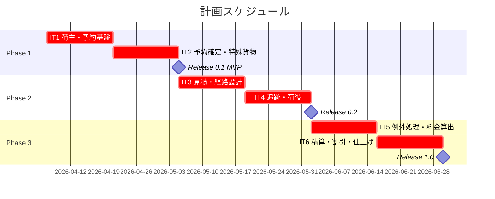
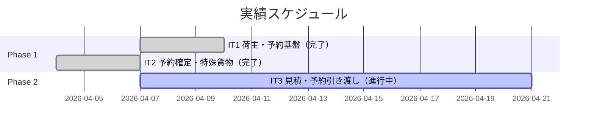
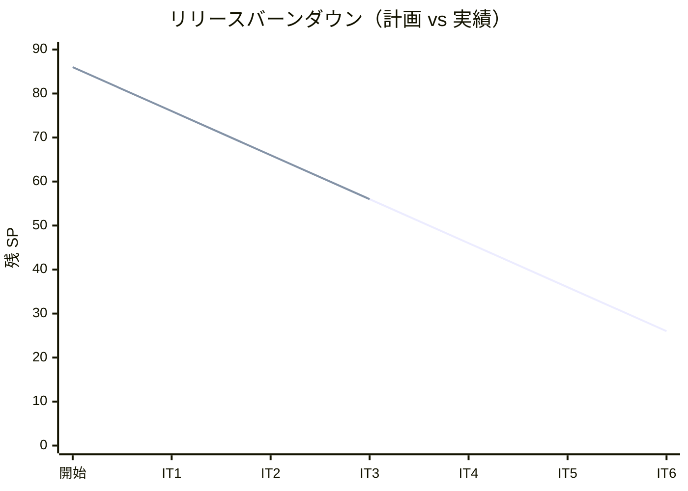

# リリース計画 - 国際貨物輸送管理システム

## 概要

本ドキュメントは、国際貨物輸送管理システム（Cargo Tracker）のリリース計画を定義します。

### プロジェクト情報

| 項目 | 内容 |
|------|------|
| **プロジェクト名** | Case Study Cargo Tracker |
| **目的** | 国際貨物の予約・経路設計・追跡・精算を一元管理するシステムの構築 |
| **対象ユーザー** | 営業担当者、経路設計者、荷役作業員、追跡管理者、経理担当者、荷主 |
| **開発チーム** | 1 名（AI ペアプログラミング） |

---

## 満足条件

### スコープ

ユーザーストーリー 23 件を 3 フェーズに分けて段階的にリリースする。

| フェーズ | 内容 | ストーリー数 |
|---------|------|-------------|
| Phase 1 | 予約・荷主管理の基盤 | 5 US |
| Phase 2 | 経路設計・追跡の中核機能 | 12 US |
| Phase 3 | 精算・例外処理 | 6 US |
| **合計** | | **23 US** |

### スケジュール

- **開発期間**: 12 週間（6 イテレーション）
- **イテレーション**: 2 週間 × 6 イテレーション
- **リリース**: Phase 1 完了後 MVP リリース、Phase 2・3 で機能拡張

### リソース

- **開発者**: 1 名 + AI ペアプログラミング
- **想定稼働時間**: 20 時間/週

---

## ユーザーストーリー一覧とストーリーポイント

### 優先順位マトリックス

4 軸評価で優先順位を決定:

1. **金銭価値（BV）**: ビジネス価値
2. **コスト（C）**: 開発コスト
3. **知識習得（KA）**: 技術的学習価値
4. **リスク軽減（RR）**: リスク軽減効果

### Phase 1: 予約・荷主管理基盤（イテレーション 1-2）

| ID | ユーザーストーリー | SP | BV | C | KA | RR | 優先度 |
|----|-------------------|----|----|---|----|----|--------|
| US02 | 荷主を登録する | 3 | 高 | 低 | 高 | 高 | 必須 |
| US03 | 法人荷主を登録する | 2 | 高 | 低 | 中 | 中 | 必須 |
| US04 | 貨物予約を登録する | 5 | 高 | 中 | 高 | 高 | 必須 |
| US05 | 危険物・冷凍貨物の予約を登録する | 3 | 高 | 中 | 中 | 中 | 必須 |
| US13 | 予約を確定する | 3 | 高 | 中 | 中 | 高 | 必須 |
| **合計** | | **16** | | | | | |

### Phase 2: 経路設計・追跡（イテレーション 3-4）

| ID | ユーザーストーリー | SP | BV | C | KA | RR | 優先度 |
|----|-------------------|----|----|---|----|----|--------|
| US01 | 輸送見積を作成する | 5 | 高 | 中 | 中 | 中 | 必須 |
| US06 | 予約情報を経路設計者に引き渡す | 2 | 高 | 低 | 低 | 中 | 必須 |
| US07 | 航海スケジュールを検索する | 5 | 高 | 高 | 高 | 高 | 必須 |
| US08 | 経路候補を算出する | 8 | 高 | 高 | 高 | 高 | 必須 |
| US09 | 経路を選択・確定する | 3 | 高 | 中 | 低 | 中 | 必須 |
| US10 | 経路条件を調整して再算出する | 3 | 中 | 中 | 中 | 中 | 中 |
| US11 | 経路情報を予約に紐付ける | 2 | 高 | 低 | 低 | 中 | 必須 |
| US12 | 確定経路を荷主に通知する | 2 | 中 | 低 | 低 | 低 | 中 |
| US14 | 追跡番号を発行する | 3 | 高 | 低 | 中 | 高 | 必須 |
| US15 | 荷役作業を記録する | 5 | 高 | 中 | 中 | 高 | 必須 |
| US16 | 引取作業を記録する | 3 | 高 | 中 | 中 | 中 | 必須 |
| US18 | 追跡情報を照会する | 3 | 高 | 中 | 中 | 高 | 必須 |
| **合計** | | **44** | | | | | |

### Phase 3: 精算・例外処理（イテレーション 5-6）

| ID | ユーザーストーリー | SP | BV | C | KA | RR | 優先度 |
|----|-------------------|----|----|---|----|----|--------|
| US17 | 貨物状態を手動更新する | 3 | 中 | 低 | 低 | 中 | 中 |
| US19 | 遅延例外を処理する | 5 | 高 | 中 | 中 | 高 | 必須 |
| US20 | 破損・紛失例外を処理する | 5 | 高 | 中 | 中 | 高 | 必須 |
| US21 | 輸送料金を算出する | 5 | 高 | 中 | 中 | 中 | 必須 |
| US22 | 法人割引を適用する | 3 | 中 | 低 | 低 | 低 | 中 |
| US23 | 精算を処理する | 5 | 高 | 中 | 中 | 中 | 必須 |
| **合計** | | **26** | | | | | |

### 全体サマリー

| フェーズ | ストーリーポイント | イテレーション |
|---------|-------------------|---------------|
| Phase 1 | 16 SP | 1-2 |
| Phase 2 | 44 SP | 3-4 |
| Phase 3 | 26 SP | 5-6 |
| **合計** | **86 SP** | 6 イテレーション |

---

## ベロシティ見積もり

### 初期ベロシティ推定

| 項目 | 値 |
|------|-----|
| **イテレーション期間** | 2 週間 |
| **チーム規模** | 1 名 + AI ペアプログラミング |
| **想定ベロシティ** | 12-16 SP/イテレーション |
| **バッファ係数** | 0.8（20% バッファ） |
| **実効ベロシティ** | 10-13 SP/イテレーション |

### ベロシティ検証計画

- イテレーション 1-2 の実績ベロシティを計測し、Phase 2 以降の計画を調整する
- 3 イテレーション完了時点でベロシティが安定するため、その時点で全体計画を再見積もりする

---

## 段階的リリース戦略

### リリーススケジュール

#### 計画スケジュール

#### 実績スケジュール

### リリース内容

#### Release 0.1（Phase 1 完了）: MVP - 予約・荷主管理

**目標**: 荷主登録から予約確定までの基本フローが動作すること

**含まれる機能**:

- 荷主登録（個人・法人）
- 貨物予約登録（一般・危険物・冷凍）
- 予約確定

**リリース条件**:

- [ ] 全ユニットテストがパス
- [ ] API E2E テストがパス
- [ ] Playwright E2E テストがパス
- [ ] SonarQube Quality Gate PASS
- [ ] セキュリティレビュー完了

#### Release 0.2（Phase 2 完了）: 経路設計・追跡

**目標**: 経路設計から追跡情報照会までのエンドツーエンドフローが動作すること

**含まれる機能**:

- 輸送見積作成
- 経路設計（航海検索・候補算出・選択・確定）
- 追跡番号発行
- 荷役作業・引取作業記録
- 追跡情報照会

**リリース条件**:

- [ ] 全テストがパス
- [ ] 外部システム連携のスタブテスト完了

#### Release 1.0（Phase 3 完了）: 完成版

**目標**: 例外処理と精算を含む全機能が動作すること

**含まれる機能**:

- 遅延・破損・紛失の例外処理
- 輸送料金算出・法人割引
- 精算処理

**リリース条件**:

- [ ] 全テストがパス
- [ ] パフォーマンステスト完了
- [ ] 運用ドキュメント完了

---

## バッファ戦略

### フィーチャバッファ

| フェーズ | 計画 SP | バッファ（30%） | 実効 SP |
|---------|---------|-----------------|---------|
| Phase 1 | 16 | 5 | 21 |
| Phase 2 | 44 | 13 | 57 |
| Phase 3 | 26 | 8 | 34 |

### スケジュールバッファ

- **予備イテレーション**: 必要に応じて Phase 2・3 間に 1 イテレーション追加可能
- **全体バッファ**: 20%（各イテレーションのベロシティ係数 0.8 に含む）

### バッファ消費ルール

1. フィーチャバッファを先に消費
2. 低優先度ストーリー（US10, US12, US17, US22）を後回し
3. スケジュールバッファは最後の手段

---

## イテレーション計画概要

### イテレーション 1（Week 1-2）

**ゴール**: 荷主登録と貨物予約登録の基本フローが動作すること

**主なタスク**:

- [x] US02: 荷主登録（個人）の実装
- [x] US03: 法人荷主登録の実装
- [x] US04: 貨物予約登録の実装

**目標 SP**: 10 / **実績 SP**: 10（Playwright E2E テスト 27 件全パス）

詳細は [iteration_plan-1.md](./iteration_plan-1.md) を参照。

### イテレーション 2（Week 3-4）

**ゴール**: 特殊貨物予約と予約確定フローが動作すること

**主なタスク**:

- [x] US05: 危険物・冷凍貨物の予約登録
- [x] US13: 予約確定
- [x] Phase 1 の統合テスト・E2E テスト

**目標 SP**: 10 / **実績 SP**: 10（Java 166 件・E2E 31 件全パス、カバレッジ 93%/81%）

詳細は [iteration_plan-2.md](./iteration_plan-2.md) を参照。

### イテレーション 3（Week 5-6）

**ゴール**: Phase 2 開始 - 輸送見積作成と経路設計者への予約引き渡しを実現し、IT2 申し送り事項を完了する

**主なタスク**:

- [ ] IT2-改善: SonarQube・ドキュメント同期・DB リセット・TestFixtures・リファクタリング
- [ ] US01: 輸送見積作成（スタブルート候補算出）
- [ ] US06: 予約情報引き渡し（状態「仮受付」→「経路設計中」）

**目標 SP**: 10（実績ベロシティ 10 SP に基づき修正）

詳細は [iteration_plan-3.md](./iteration_plan-3.md) を参照。

### イテレーション 4（Week 7-8）

**ゴール**: 経路確定から追跡情報照会までのフローが動作すること

**主なタスク**:

- [ ] US08: 経路候補算出（完了）
- [ ] US09-US12: 経路選択・確定・紐付け・通知
- [ ] US14: 追跡番号発行
- [ ] US15-US16: 荷役・引取作業記録
- [ ] US18: 追跡情報照会

**目標 SP**: 24

詳細は [iteration_plan-4.md](./iteration_plan-4.md) を参照。

### イテレーション 5（Week 9-10）

**ゴール**: 例外処理と輸送料金算出が動作すること

**主なタスク**:

- [ ] US17: 貨物状態手動更新
- [ ] US19: 遅延例外処理
- [ ] US20: 破損・紛失例外処理
- [ ] US21: 輸送料金算出

**目標 SP**: 18

詳細は [iteration_plan-5.md](./iteration_plan-5.md) を参照。

### イテレーション 6（Week 11-12）

**ゴール**: 精算機能を含む全機能が完成し、リリース準備が整うこと

**主なタスク**:

- [ ] US22: 法人割引適用
- [ ] US23: 精算処理
- [ ] 全体統合テスト・パフォーマンステスト
- [ ] リリース準備

**目標 SP**: 8 + リリース作業

詳細は [iteration_plan-6.md](./iteration_plan-6.md) を参照。

---

## リスク管理

### 技術リスク

| リスク | 影響度 | 発生確率 | 対策 |
|--------|--------|----------|------|
| 外部経路設計システムとの連携が複雑 | 高 | 中 | WireMock でスタブを用意し、ACL ポートで抽象化 |
| Java 25 のライブラリ互換性問題 | 中 | 中 | SpotBugs ignoreFailures、Byte Buddy experimental で対応済み |
| 経路算出アルゴリズムの複雑度 | 高 | 高 | イテレーション 3 で早期着手し、段階的に機能拡張 |

### スケジュールリスク

| リスク | 影響度 | 発生確率 | 対策 |
|--------|--------|----------|------|
| ベロシティが想定を下回る | 高 | 中 | 低優先度ストーリーの後回し、フィーチャバッファの消費 |
| 設計変更によるリワーク | 中 | 中 | TDD でテストカバレッジを維持し、リファクタリングコストを低減 |

---

## 進捗管理

### メトリクス

| メトリクス | 目標 |
|-----------|------|
| ベロシティ | 10 SP/イテレーション（IT1-2 実績ベースに修正） |
| テストカバレッジ | 80% 以上 |
| SonarQube Quality Gate | PASS |
| 予定達成率 | 90% 以上 |

### 進捗状況

| イテレーション | 計画 SP | 実績 SP | 達成率 | 状態 |
|---------------|---------|---------|--------|------|
| 1 | 10 | 10 | 100% | 完了（Java 60 件・E2E 27 件全パス、カバレッジ 89%、レビュー済み） |
| 2 | 10 | 10 | 100% | 完了（Java 166 件・E2E 31 件全パス、カバレッジ 93%/81%、レビュー済み） |
| 3 | 10 | 10 | 100% | 完了（約 184 件・E2E 41 件全パス、レビュー済み） |
| 4 | 10 | - | - | 未着手 |
| 5 | 10 | - | - | 未着手 |
| 6 | 10 | - | - | 未着手 |

> **注**: IT1-2 の実績ベロシティ 10 SP に基づき IT3 以降を 10 SP/イテレーションに修正。Phase 2（44 SP）は IT3-6 の 4 イテレーション（40 SP）に再割当て。

### バーンダウンチャート

---

## 次のステップ

1. IT3 完了報告書を作成する（`planning-releases --report`）
2. IT4 計画を作成する（US07: 航海スケジュール検索・US08: 経路候補算出）—— `planning-releases --iteration 4`
3. GitHub Project に同期する（`syncing-github-project --sync`）

---

## 更新履歴

| 日付 | 更新内容 | 更新者 |
|------|---------|--------|
| 2026-04-04 | 初版作成 | - |
| 2026-04-04 | IT1 完了を反映（実績 10 SP、Playwright E2E 27 件パス、バーンダウン実績更新） | - |
| 2026-04-04 | 進捗更新: IT1 メトリクス詳細（Java 60 件・カバレッジ 89%・レビュー完了）、次のステップを IT2 準備に更新 | - |
| 2026-04-04 | IT2 進捗更新: IT1 品質改善 4 SP 完了（テスト 95 件、カバレッジ 63%）、バーンダウン実績追加 | - |
| 2026-04-06 | IT2 完了を反映（実績 10 SP、Java 166 件・E2E 31 件全パス、カバレッジ 93%/81%、バーンダウン 76→70） | - |
| 2026-04-08 | IT3 完了を反映（実績 10 SP、約 184 件・E2E 41 件全パス、バーンダウン 66→56）、次のステップを IT4 準備に更新 | - |
