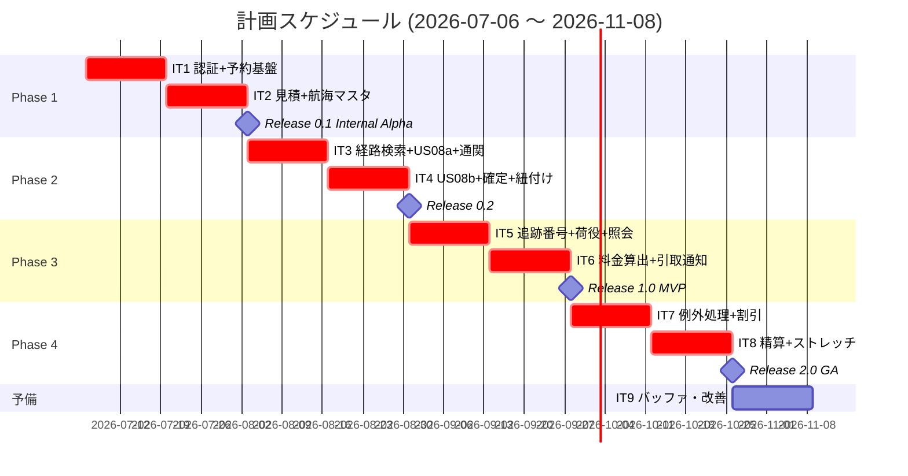
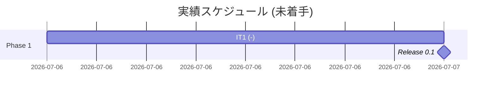
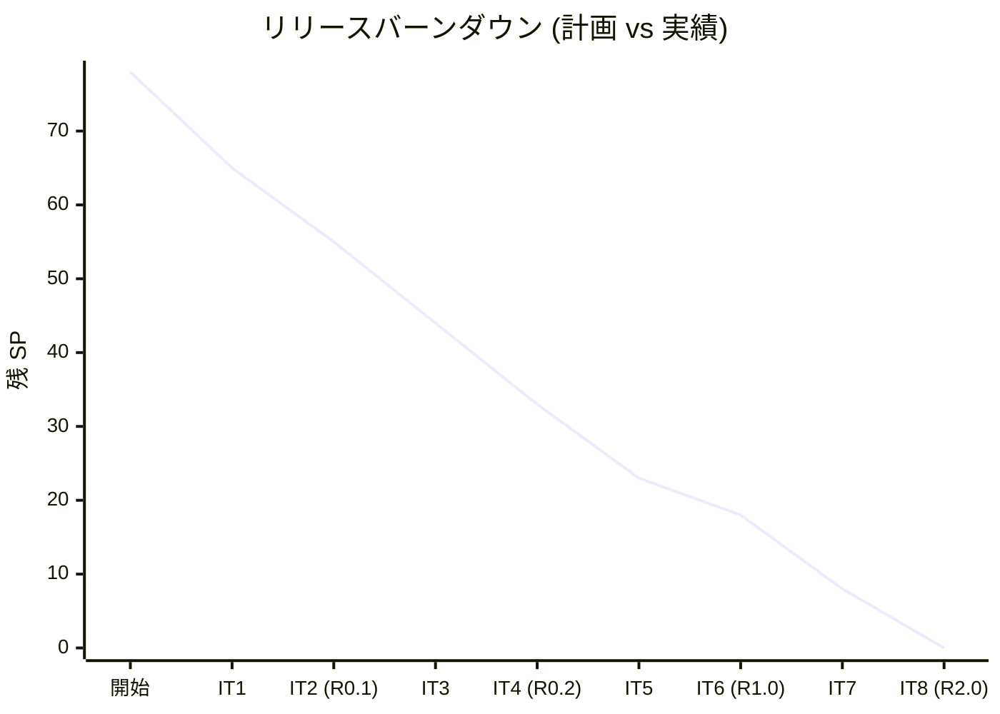

# リリース計画 - 国際貨物輸送管理システム (Haskell 版)

## 概要

本ドキュメントは、国際貨物輸送管理システム (Cargo Tracker) Haskell 版 take-1 のリリース計画を定義する。
Java 版 take-2 (98 SP 実績 / 10 イテレーション完了) および Scala 版 take-1 (8 IT 完了) の実績データをベースに、Haskell / 純粋関数型パラダイムへの再実装に伴う学習コスト (係数 1.20) を織り込み、Sprint 0 (2026-06-26 実施) の多視点レビュー 42 件反映済みの計画とする。

参照: [ADR 0001 Haskell + Servant スタック採用](../adr/0001-haskell-servant-stack.md)、[ADR 0002 arch-check](../adr/0002-arch-check-implementation.md)

### プロジェクト情報

| 項目 | 内容 |
| :--- | :--- |
| **プロジェクト名** | 国際貨物輸送管理システム (Cargo Tracker) Haskell 版 take-1 |
| **目的** | DDD + 純粋関数型 (Servant + ReaderT) による貨物予約・経路設計・追跡・精算機能の提供と、Java/Scala 版との比較学習 |
| **対象ユーザー** | 荷主・荷受人・営業担当者・経路設計者・追跡管理者・荷役作業員・経理担当者・マスタ管理者 |
| **開発チーム** | 1 名 (AI ペアプログラミング) |

---

## 満足条件

### スコープ

ユーザーストーリー 27 件 ([US01〜US27](../requirements/user_story.md)) + 横断要件 (認証) 1 件を 4 フェーズに分けて段階的にリリースする。
真の MVP は **Release 1.0 (追跡照会 + 引取通知まで)** とし、Release 0.1 は内部デモ用の予約受付基盤、Release 0.2 は経路設計フロー + 通関連携、Release 2.0 を例外処理・精算を含む GA とする。
認証 (フォームログイン + JWT/Cookie + RBAC) は全機能の前提として IT1 で実装する。

| フェーズ | 内容 | 対応 US 数 | リリース |
| :--- | :--- | :---: | :--- |
| Phase 1 | 認証 + 予約・荷主基盤 + 航海スケジュールマスタ | 8 + 横断 1 | 0.1 Internal Alpha |
| Phase 2 | 経路設計・確定 + 通関連携 | 7 (US08 分割含む) | 0.2 |
| Phase 3 | 追跡・状態更新 + 料金算出 + 引取通知 | 6 | 1.0 MVP |
| Phase 4 | 例外処理・割引・精算 (+ストレッチ) | 7 | 2.0 GA |
| **合計** | | **27 + 横断 1** | |

### スケジュール

- **開発期間**: 18 週間 (2026-07-06 〜 2026-11-08、予備 IT9 含む)
- **イテレーション**: 2 週間 × 8 イテレーション + 予備 IT9 (バッファ・ふりかえり改善・低優先度指摘吸収)
- **リリース**: Phase 1 → 0.1 Internal Alpha、Phase 2 → 0.2、Phase 3 → 1.0 MVP、Phase 4 → 2.0 GA

### リソース

- **開発者**: 1 名 (AI ペアプログラミング)
- **想定稼働時間**: 20 時間 / 週

---

## ユーザーストーリー一覧とストーリーポイント

### 学習コスト係数

Java 版 take-2 実績ベースに対し、Haskell の純粋関数型・型クラス・ReaderT パターン学習の影響を織り込み **係数 1.20** を主要ストーリーに適用する (Scala 版 1.15 より高め)。理由:

- 型クラスポート (`class Monad m => CargoRepository m`) の設計判断が初期に集中
- postgresql-simple の `FromRow` / `ToRow` 手書きマッピング (ORM なし)
- Lucid の Haskell コードベース HTML 構築の慣れ
- hedgehog プロパティテストの設計コスト

特に経路候補算出は最大リスク要素として **US08a (基本算出 5 SP) + US08b (制約評価 3 SP) = 8 SP** に分割 (Sprint 0 H-04 反映)。

### 優先順位マトリックス

4 軸評価で優先順位を決定:

1. **金銭価値 (BV)**: ビジネス価値
2. **コスト (C)**: 開発コスト
3. **知識習得 (KA)**: 技術的学習価値
4. **リスク軽減 (RR)**: リスク軽減効果

### Phase 1: 認証 + 予約・荷主基盤 + 航海スケジュール (IT1-IT2 / Release 0.1)

| ID | ユーザーストーリー | SP | BV | C | KA | RR | 優先度 |
| :--- | :--- | :---: | :---: | :---: | :---: | :---: | :---: |
| (横断) | 認証 (フォームログイン + JWT/Cookie + ロール) | 3 | 高 | 中 | 高 | 高 | 必須 |
| US01 | 輸送見積を作成する | 3 | 高 | 中 | 高 | 高 | 必須 |
| US02 | 荷主を登録する | 2 | 高 | 低 | 中 | 中 | 必須 |
| US03 | 法人荷主を登録する | 2 | 中 | 低 | 中 | 中 | 必須 |
| US04 | 貨物予約を登録する | 3 | 高 | 中 | 高 | 高 | 必須 |
| US05 | 危険物・冷凍貨物の予約を登録する (US04 拡張オプション) | 3 | 中 | 中 | 中 | 中 | 必須 |
| US06 | 予約情報を経路設計者に引き渡す | 2 | 高 | 低 | 中 | 高 | 必須 |
| US24 | 航海スケジュールを新規登録する | 3 | 高 | 中 | 中 | 高 | 必須 |
| US25 | 既存航海スケジュールを更新する | 2 | 中 | 低 | 中 | 中 | 必須 |
| **合計** | | **23** | | | | | |

### Phase 2: 経路設計・確定 + 通関連携 (IT3-IT4 / Release 0.2)

| ID | ユーザーストーリー | SP | BV | C | KA | RR | 優先度 |
| :--- | :--- | :---: | :---: | :---: | :---: | :---: | :---: |
| US07 | 航海スケジュールを検索する | 3 | 高 | 中 | 中 | 高 | 必須 |
| US08a | 経路候補を算出する (基本: 接続性 + 期限) | 5 | 高 | 高 | 高 | 高 | 必須 |
| US08b | 経路候補の制約評価 (危険物港・冷凍船・直行優先) | 3 | 高 | 中 | 中 | 高 | 必須 |
| US09 | 経路を選択・確定する | 3 | 高 | 中 | 高 | 高 | 必須 |
| US11 | 経路情報を予約に紐付ける | 2 | 高 | 低 | 中 | 高 | 必須 |
| US13 | 予約を確定する | 3 | 高 | 中 | 中 | 高 | 必須 |
| US27 | 通関情報を予約に紐付ける (HS コード・通関業者・申告ステータス) | 3 | 高 | 中 | 中 | 高 | 必須 |
| **合計** | | **22** | | | | | |

### Phase 3: 追跡・状態更新 + 料金算出 + 引取通知 (IT5-IT6 / Release 1.0 MVP)

| ID | ユーザーストーリー | SP | BV | C | KA | RR | 優先度 |
| :--- | :--- | :---: | :---: | :---: | :---: | :---: | :---: |
| US14 | 追跡番号を発行する | 2 | 高 | 低 | 中 | 高 | 必須 |
| US15 | 荷役作業を記録する | 3 | 高 | 中 | 中 | 高 | 必須 |
| US16 | 引取作業を記録する | 2 | 高 | 低 | 中 | 中 | 必須 |
| US18 | 追跡情報を照会する | 3 | 高 | 中 | 中 | 高 | 必須 |
| US21 | 輸送料金を算出する | 3 | 高 | 中 | 中 | 中 | 必須 |
| US26 | 荷受人へ引取通知 (確認コード配信) | 2 | 高 | 低 | 中 | 高 | 必須 |
| **合計** | | **15** | | | | | |

### Phase 4: 例外処理・割引・精算 (IT7-IT8 / Release 2.0 GA)

| ID | ユーザーストーリー | SP | BV | C | KA | RR | 優先度 |
| :--- | :--- | :---: | :---: | :---: | :---: | :---: | :---: |
| US17 | 貨物状態を手動更新する | 2 | 中 | 低 | 中 | 中 | 中 |
| US19 | 遅延例外を処理する | 3 | 高 | 中 | 中 | 高 | 必須 |
| US20 | 破損・紛失例外を処理する | 3 | 高 | 中 | 中 | 高 | 必須 |
| US22 | 法人割引を適用する | 2 | 中 | 低 | 中 | 中 | 中 |
| US23 | 精算を処理する | 3 | 高 | 中 | 中 | 中 | 必須 |
| US10 | 経路条件を調整して再算出する (IT8 ストレッチ) | 3 | 中 | 中 | 中 | 中 | 低 (ストレッチ) |
| US12 | 確定経路を荷主に通知する (IT8 ストレッチ) | 2 | 中 | 低 | 中 | 中 | 低 (ストレッチ) |
| **合計** (確定 13 + ストレッチ 5) | | **18** | | | | | |

### 全体サマリー

| フェーズ | ストーリーポイント | イテレーション |
| :--- | :---: | :---: |
| Phase 1 | 23 SP | IT1-IT2 |
| Phase 2 | 22 SP | IT3-IT4 |
| Phase 3 | 15 SP | IT5-IT6 |
| Phase 4 | 18 SP (確定 13 + ストレッチ 5) | IT7-IT8 |
| **合計** | **78 SP** | **8 イテレーション + 予備 IT9** |

---

## ベロシティ見積もり

### 初期ベロシティ推定

| 項目 | 値 |
| :--- | :--- |
| **イテレーション期間** | 2 週間 |
| **チーム規模** | 1 名 (AI ペアプログラミング) |
| **想定ベロシティ (初期 IT1-IT2)** | 10-13 SP / IT (技術スタック立ち上げ期) |
| **想定ベロシティ (中期 IT3-IT6)** | 10-11 SP / IT (定常運用) |
| **想定ベロシティ (後期 IT7-IT8)** | 8-10 SP / IT (例外処理の追加複雑性) |
| **バッファ係数** | 0.8 (フィーチャ 30% + IT9 予備) |
| **実効ベロシティ平均** | 約 9.75 SP / IT |

### ベロシティ検証計画

- **IT1 終了時 (2026-07-19)**: 学習コスト係数 1.20 の妥当性を実績で検証。乖離が ±20% を超える場合は係数再調整
- **IT3 終了時 (2026-08-16)**: 3 IT 分のベロシティ移動平均でリリース計画を再評価。IT4 以降のスコープ調整判断
- **IT6 終了時 (Release 1.0 直前)**: Phase 4 ストレッチ目標 (US10/US12) の保持判断

---

## 段階的リリース戦略

### リリーススケジュール

#### 計画スケジュール

#### 実績スケジュール

> 実績は IT 完了時に逐次更新する。

### リリース内容

#### Release 0.1 Internal Alpha (Phase 1 完了 / IT2 末): 内部デモ用予約受付基盤

**目標**: 認証下で荷主登録・貨物予約 (一般・危険物・冷凍)・航海スケジュール CRUD ができ、内部関係者にデモ可能な状態を作る

**含まれる機能**:

- 認証 (ログイン・ログアウト・7 ロール RBAC)
- 荷主登録 (個人・法人)
- 輸送見積作成
- 貨物予約登録 (一般・危険物・冷凍)
- 予約情報の経路設計者引き渡し
- 航海スケジュール CRUD (新規登録・更新)

**リリース条件**:

- [ ] 単体テストカバレッジ Domain ≥ 95%
- [ ] 単体テストカバレッジ Application ≥ 80% (Sprint 0 M-02 反映)
- [ ] hspec-wai 統合テスト整備
- [ ] 内部デモ実施可能 (Internal Alpha)

#### Release 0.2 (Phase 2 完了 / IT4 末): 経路設計フロー + 通関連携

**目標**: 経路設計者が航海スケジュール検索 → 経路候補算出 → 制約評価 → 経路確定 → 予約紐付け → 予約確定までを通しで実施でき、通関情報も保持できる状態にする

**含まれる機能**:

- Release 0.1 の全機能
- 航海スケジュール検索 (US07)
- 経路候補算出 (US08a 基本 + US08b 制約評価)
- 経路選択・確定 (US09)
- 経路情報の予約紐付け (US11)
- 予約確定 (US13、キャンセル料 3 段階ルール含む)
- 通関情報の予約紐付け (US27、HS コード・通関業者・申告ステータス)

**リリース条件**:

- [ ] Release 0.1 の全機能が動作
- [ ] hspec-wai による API 統合テスト整備
- [ ] WireMock 契約テスト (5 ACL ポート、Circuit Breaker シナリオ含む)
- [ ] arch-check Phase 1-2 完了 (HLint カスタムルール + 自作 import 規約検査)

#### Release 1.0 MVP (Phase 3 完了 / IT6 末): 追跡・荷役・料金算出・引取通知

**目標**: 荷主が追跡番号で貨物状態をリアルタイム確認でき、荷役作業員が現場で荷役記録でき、配送完了時に料金算出 + 荷受人通知まで自動化された MVP として外部公開可能な状態

**含まれる機能**:

- Release 0.2 の全機能
- 追跡番号発行 (US14)
- 荷役作業登録・引取作業登録 (US15・US16)
- 追跡情報照会 (US18、公開ページ + 地図 + タイムライン)
- 輸送料金算出 (US21、通貨・為替対応)
- 荷受人への引取通知 (US26、確認コード配信)

**リリース条件**:

- [ ] Release 0.2 の全機能が動作
- [ ] **MVP として外部公開可能**
- [ ] E2E (Playwright) 主要 3 シナリオ Pass (予約→経路→確定 / 荷役→追跡 / 例外通知)
- [ ] 非機能要件チェックリスト (P95 < 500ms / RTO 1h / SLA 99.5%) 達成
- [ ] CI で k6 スモーク負荷テスト実行 (Sprint 0 H-08 反映)
- [ ] 荷役登録のオフライン対応 (Service Worker + IndexedDB) 完了 (Sprint 0 H-14 反映)
- [ ] arch-check Phase 3 完了 (トランザクション境界規約 T-01〜T-03 自動検証)

#### Release 2.0 GA (Phase 4 完了 / IT8 末): 例外処理 + 精算 + ストレッチ

**目標**: 例外処理 (遅延・破損・紛失) と精算ワークフロー (法人割引含む) を完備し、本番運用可能な GA 版とする。ストレッチ目標として経路再設計・経路通知も含める

**含まれる機能**:

- Release 1.0 の全機能
- 貨物状態の手動更新 (US17)
- 遅延例外処理 (US19)
- 破損・紛失例外処理 (US20)
- 法人割引適用 (US22)
- 精算処理 (US23)
- **ストレッチ**: 経路条件調整 (US10)、確定経路通知 (US12)

**リリース条件**:

- [ ] Release 1.0 の全機能が動作
- [ ] 監査ログ 7 年保持の設定完了
- [ ] 全 27 US (US01-US27) の受け入れ基準を満たす
- [ ] 運用要件チェックリスト全項目達成
- [ ] arch-check Phase 4 完了 (CQRS 責務分離・楽観ロック検出)

---

## バッファ戦略

### フィーチャバッファ

| フェーズ | 計画 SP | バッファ (30%) | 実効 SP |
| :--- | :---: | :---: | :---: |
| Phase 1 | 23 | 6.9 | 約 30 |
| Phase 2 | 22 | 6.6 | 約 29 |
| Phase 3 | 15 | 4.5 | 約 20 |
| Phase 4 (確定) | 13 | 3.9 | 約 17 |
| Phase 4 ストレッチ | 5 | - | (バッファ消費先) |

### スケジュールバッファ

- **予備イテレーション**: IT9 (2 週間、2026-10-26 〜 11-08)
- **全体バッファ**: 開発期間 18 週間中 2 週間 (約 11%)

### バッファ消費ルール

1. **第 1 優先**: 各 Phase 内のフィーチャバッファ (30%) を先に消費
2. **第 2 優先**: Phase 4 ストレッチ目標 (US10 / US12 = 5 SP) を切り捨てて IT9 へ移送
3. **第 3 優先**: 低優先度ストーリー (US17 / US22 = 中優先度) を IT9 へ移送
4. **最終手段**: IT9 (スケジュールバッファ) を本作業に転用
5. **超過時**: スコープ削減を経営判断で決定 (Phase 4 の非必須ストーリー削除)

---

## イテレーション計画概要

### イテレーション 1 (2026-07-06 〜 07-19)

**ゴール**: 認証基盤を構築し、荷主登録 + 貨物予約 + 航海スケジュールの最小フローを動かす

**主なタスク**:

- [ ] 認証 (フォームログイン + JWT/Cookie + RBAC) を実装
- [ ] US02 (荷主登録)・US03 (法人荷主登録) を実装
- [ ] US04 (貨物予約登録) を実装
- [ ] US24 (航海スケジュール新規登録) を実装
- [ ] arch-check Phase 1 (HLint カスタムルール) を CI に組み込み
- [ ] 受入基準 23 件の Gherkin 化 (Sprint 0 H-10 反映)

**目標 SP**: 13

詳細は [iteration_plan-1.md](./iteration_plan-1.md) を参照 (未作成)。

### イテレーション 2 (2026-07-20 〜 08-02)

**ゴール**: 見積・特殊貨物予約・予約引き渡し・スケジュール更新を実装し、Release 0.1 Internal Alpha をリリース

**主なタスク**:

- [ ] US01 (輸送見積作成) を実装
- [ ] US05 (危険物・冷凍貨物の予約登録) を US04 拡張オプションとして実装
- [ ] US06 (予約情報の経路設計者引き渡し) を実装
- [ ] US25 (航海スケジュール更新) を実装
- [ ] arch-check Phase 2 (自作 AST 解析バイナリ) を実装

**目標 SP**: 10

詳細は [iteration_plan-2.md](./iteration_plan-2.md) を参照 (未作成)。

### イテレーション 3 (2026-08-03 〜 08-16)

**ゴール**: 航海スケジュール検索・経路候補算出 (基本)・通関連携を実装

**主なタスク**:

- [ ] US07 (航海スケジュール検索) を実装
- [ ] US08a (経路候補算出 基本: 接続性 + 期限) を実装
- [ ] US27 (通関情報の予約紐付け) を実装
- [ ] arch-check Phase 3 (トランザクション境界規約 T-01〜T-03) を実装

**目標 SP**: 11

### イテレーション 4 (2026-08-17 〜 08-30)

**ゴール**: 経路制約評価・経路選択・確定・予約確定を完成させ、Release 0.2 をリリース

**主なタスク**:

- [ ] US08b (経路候補の制約評価) を実装
- [ ] US09 (経路選択・確定)、US11 (経路紐付け) を実装
- [ ] US13 (予約確定、キャンセル料 3 段階ルール含む) を実装
- [ ] WireMock 契約テスト (Circuit Breaker シナリオ) を実装

**目標 SP**: 11

### イテレーション 5 (2026-08-31 〜 09-13)

**ゴール**: 追跡番号発行・荷役作業記録・追跡情報照会を実装 (US18 前倒し配置、IT5 末プレ MVP デモ可能化)

**主なタスク**:

- [ ] US14 (追跡番号発行) を実装
- [ ] US15・US16 (荷役作業・引取作業記録) を実装
- [ ] US18 (追跡情報照会、地図 + タイムライン + イベント履歴) を実装
- [ ] 荷役オフライン対応 (Service Worker + IndexedDB) を実装

**目標 SP**: 10

### イテレーション 6 (2026-09-14 〜 09-27)

**ゴール**: 輸送料金算出・荷受人引取通知を実装し、Release 1.0 MVP をリリース

**主なタスク**:

- [ ] US21 (輸送料金算出、通貨・為替対応) を実装
- [ ] US26 (荷受人引取通知) を実装
- [ ] k6 スモーク負荷テストを CI に組み込み
- [ ] E2E (Playwright) 主要 3 シナリオを整備

**目標 SP**: 5

### イテレーション 7 (2026-09-28 〜 10-11)

**ゴール**: 例外処理 (遅延・破損・紛失) と法人割引を実装

**主なタスク**:

- [ ] US17 (貨物状態手動更新) を実装
- [ ] US19 (遅延例外処理) を実装
- [ ] US20 (破損・紛失例外処理) を実装
- [ ] US22 (法人割引適用) を実装

**目標 SP**: 10

### イテレーション 8 (2026-10-12 〜 10-25)

**ゴール**: 精算処理を完成させ、Release 2.0 GA をリリース。ストレッチで経路再設計・経路通知も対応

**主なタスク**:

- [ ] US23 (精算処理) を実装
- [ ] ストレッチ: US10 (経路条件調整) を実装
- [ ] ストレッチ: US12 (確定経路通知) を実装
- [ ] arch-check Phase 4 (CQRS 責務分離・楽観ロック検出) を実装

**目標 SP**: 3 (確定) + 5 (ストレッチ) = 最大 8

### イテレーション 9 (2026-10-26 〜 11-08、予備)

**ゴール**: バッファ消費・低優先度指摘の吸収・ふりかえり改善・運用安定化

**主なタスク**:

- [ ] IT8 で消化しきれなかったストレッチ目標の完了
- [ ] 低優先度レビュー指摘 (L-01〜L-10 の保留分があれば)
- [ ] 運用要件チェックリストの最終確認
- [ ] リリース完了報告書の作成

**目標 SP**: -

---

## リスク管理

### 技術リスク

| リスク | 影響度 | 発生確率 | 対策 |
| :--- | :---: | :---: | :--- |
| Haskell 学習コスト超過 | 高 | 中 | IT1-IT2 に重点学習時間配分。型クラスポート・ReaderT パターンを最初に確立。学習コスト係数 1.20 を実績で検証 |
| US08 (経路候補算出) の複雑度 | 高 | 中 | US08a/US08b に物理分割済。IT3 末に US08a 部分価値を出荷可能 |
| postgresql-simple 手書きマッピングのコスト | 中 | 高 | 共通変換ヘルパー (`enumFromText`, `parseStatus` 等) を IT1 で整備 |
| arch-check 自作の保守コスト | 中 | 中 | HLint カスタムルール (案 E) を 1 次防衛線とし、自作 AST 解析 (案 A) は段階的導入 (ADR 0002) |
| 外部 ACL ポートのモック整備 | 中 | 中 | IT2 で WireMock スタブ + 型クラステストダブルパターンを確立。Circuit Breaker シナリオは IT4 |
| GHC / Stack の CI 環境問題 | 低 | 中 | IT1 で GitHub Actions + Stack キャッシュを動作確認 |
| servant-auth-server 廃止リスク | 低 | 低 | ADR 0001 に代替案 3 件 (servant-auth-cookie / wai-extra 自作 / jose) 記録 |
| testcontainers-hs の並列実行コスト | 中 | 中 | `aroundAll` の粒度設計を明文化、CI 5-10 分目標を維持 |

### スケジュールリスク

| リスク | 影響度 | 発生確率 | 対策 |
| :--- | :---: | :---: | :--- |
| ベロシティの過大評価 | 高 | 中 | フィーチャバッファ 30% + 予備 IT9 で吸収。Phase 4 ストレッチ目標で調整可能 |
| 通関連携 (US27) の業務複雑度 | 中 | 中 | HS コード・通関業者の最小データのみ Phase 2、将来拡張 (税関 API 連携) は GA 後 |
| 荷役オフライン対応の Service Worker 学習コスト | 中 | 高 | IT3 から設計検討を開始、IT5 で実装。失敗時は Release 1.0 を Release 1.1 に分割 |
| Phase 4 のスコープ膨張 | 中 | 高 | ストレッチ目標 (US10/US12) は IT8 で消化困難なら IT9 へ |
| 非機能要件 P95 < 500ms 未達 | 中 | 低 | IT6 で k6 CI 統合、リグレッション検知の出口を確保 |

---

## 進捗管理

### メトリクス

| メトリクス | 目標 |
| :--- | :--- |
| ベロシティ | 8-13 SP / イテレーション (時期別) |
| テストカバレッジ (Domain) | 95% 以上 |
| テストカバレッジ (全体) | 85% 以上 |
| HLint 警告 | 0 件 |
| arch-check 違反 | 0 件 |
| バグ密度 | 0.5 件 / SP 以下 |
| 予定達成率 | 90% 以上 |

### 進捗状況

| イテレーション | 計画 SP | 実績 SP | 達成率 | 状態 |
| :---: | :---: | :---: | :---: | :--- |
| IT1 | 13 | 20 | 154% | 完了 (2026-06-26) |
| IT2 | 10 | - | - | 未着手 |
| IT3 | 11 | - | - | 未着手 |
| IT4 | 11 | - | - | 未着手 |
| IT5 | 10 | - | - | 未着手 |
| IT6 | 5 | - | - | 未着手 |
| IT7 | 10 | - | - | 未着手 |
| IT8 | 3 (+ストレッチ 5) | - | - | 未着手 |
| IT9 | (予備) | - | - | 未着手 |
| **累計** | **73 + 5** | **20** | **27%** | |

### バーンダウンチャート

> 実績ラインは IT 完了時に追加する。

---

## ふりかえりサイクル

各イテレーション末に以下を実施する。

1. **完了報告書** (`creating-iteration-report`): 計画 vs 実績、ベロシティ、消化したストーリー
2. **ふりかえり** (`--retrospective`): Keep / Problem / Try
3. **次イテレーション計画見直し**: 実績ベロシティに基づくスコープ調整

3 IT 連続でベロシティが目標から ±20% 乖離した場合、リリース計画全体を再評価する (バッファ消費ルール参照)。

---

## Sprint 0 改善履歴 (2026-06-26 実施)

分析フェーズ完了後、多視点レビュー (XP 5 エージェント並列) で検出された 42 件すべてに対応:

- **高優先度 16 件**: リリース計画の数値整合、集約数表記揺れ統一、US26/US27 追加、US08 分割、ADR 0002 起票、トランザクション境界規約、CI 統合スモーク負荷、楽観ロック並行テスト、BDD 受入基準、荷役オフライン対応、エラー UI 統一、タッチターゲット規約
- **中優先度 16 件**: US05 拡張オプション化、CSRF 型安全パターン、servant-auth-server 代替、DiscountPolicy sum type、境界値一覧表、hedgehog Generator 指針、Circuit Breaker、集約境界規約、ETA 算出根拠、通貨・為替、地図メタファー、aria-live 規約
- **低優先度 10 件**: 優先度欄統一、マスタ管理者ロール、mtl 使用範囲、コンパイラフラグ強制、HPC 注記、E2E ヘルパー、Pre-commit フィルタ、ビジネスルール定数運用、キャンセル料、共通パンくず

詳細は [analysis_multi_perspective_review_20260626.md](../review/analysis_multi_perspective_review_20260626.md) を参照。

---

## 次のステップ

1. **GitHub Project 同期** (`syncing-github-project`): 本リリース計画を Issue / Milestone に反映
2. **IT1 イテレーション計画作成** (`--iteration 1`): IT1 の詳細タスク分解 + ガントチャート作成
3. **開発フェーズ開始** (`orchestrating-development`): TDD サイクルで実装着手

---

## 更新履歴

| 日付 | 更新内容 | 更新者 |
| :--- | :--- | :--- |
| 2026-06-26 | 初版作成 (25 US / 73 SP / 4 フェーズ × 8 IT) | 開発チーム |
| 2026-06-26 | Sprint 0 高優先度 16 件反映 (US26/US27 追加、US08 分割、IT 再構成) | 開発チーム |
| 2026-06-26 | Sprint 0 中優先度 16 件反映 | 開発チーム |
| 2026-06-26 | Sprint 0 低優先度 10 件反映 | 開発チーム |
| 2026-06-26 | 標準フォーマット (docs/template/リリース計画.md) を適用、ガント・バーンダウン・進捗状況・更新履歴等を追加 | 開発チーム |

---

## 参照

- [ユーザーストーリー](../requirements/user_story.md)
- [システムユースケース](../requirements/system_usecase.md)
- [ドメインモデル設計](../design/domain-model.md)
- [テスト戦略](../design/test_strategy.md)
- [非機能要件](../design/non_functional.md)
- [ADR 0001 Haskell + Servant スタック](../adr/0001-haskell-servant-stack.md)
- [ADR 0002 arch-check 実装](../adr/0002-arch-check-implementation.md)
- [分析多視点レビュー](../review/analysis_multi_perspective_review_20260626.md)
- Scala 版参考: `tmp/case-study-cargo-tracker/docs/development/release_plan.md`
