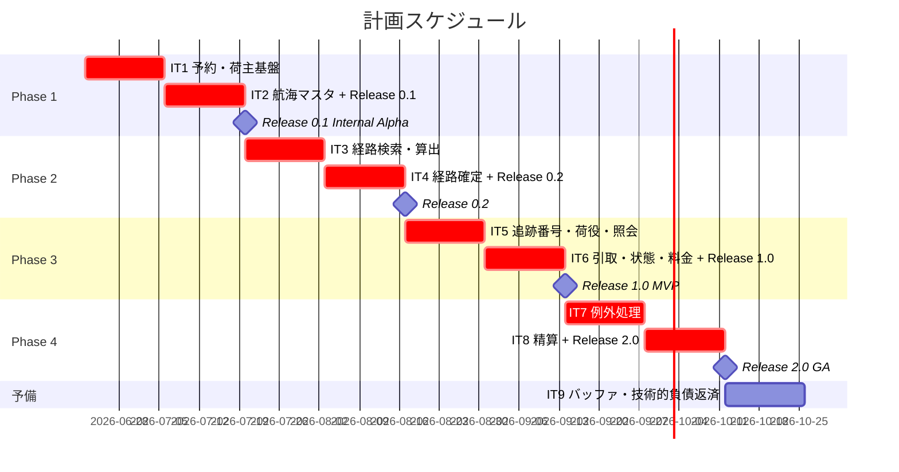
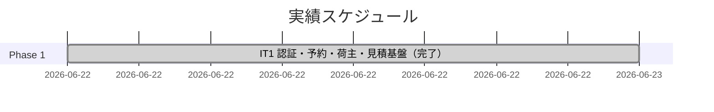
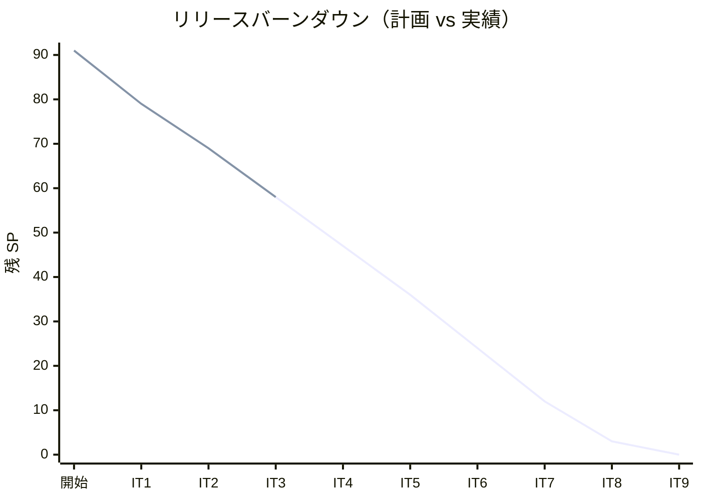

# リリース計画 - 国際貨物輸送管理システム（Scala 版）

## 概要

本ドキュメントは、国際貨物輸送管理システム（Cargo Tracker）Scala 版 take-1 のリリース計画を定義します。Java 版 take-2 の実績データ（23 ストーリー 86 SP 計画 / 98 SP 実績、10 イテレーション完了）をベースに、Scala / 関数型パラダイムへの再実装に伴う学習コスト（係数 1.15）と追加ストーリー（US24・US25：航海スケジュール管理）を織り込んで策定します。

参照: [ADR 0001 Play Framework + Scala 採用](../adr/0001-play-framework-scala-stack.md)

### プロジェクト情報

| 項目 | 内容 |
|------|------|
| **プロジェクト名** | 国際貨物輸送管理システム（Cargo Tracker）Scala 版 |
| **目的** | DDD・関数型パラダイムによる貨物予約・経路設計・追跡・精算機能の提供と、Java 版との比較学習 |
| **対象ユーザー** | 荷主・予約担当・経路設計者・追跡担当・精算担当・マスタ管理者 |
| **開発チーム** | 1 名（AI ペアプログラミング） |

---

## 満足条件

### スコープ

ユーザーストーリー 26 件を 4 フェーズに分けて段階的にリリースする。**真の MVP は Release 1.0（追跡照会まで）**とし、Release 0.1 は内部デモ用の予約受付基盤、Release 0.2 は経路設計フロー、Release 2.0 を例外処理・精算を含む GA とする。料金算出（US21）は見積（US01）との二重実装を避けるため Release 1.0 に前倒しする。認証（US26）は全機能の前提として IT1 で実装する。

| フェーズ | 内容 | 含む UC | ストーリー数 |
|---------|------|---------|--------------|
| Phase 1 | 認証 + 予約・荷主基盤 + 航海スケジュールマスタ | 5 UC | 9 US |
| Phase 2 | 経路設計・確定 | 6 UC | 6 US |
| Phase 3 | 追跡・状態更新 + 料金算出 | 4 UC | 6 US |
| Phase 4 | 例外処理・割引・精算 | 2 UC | 4 US |
| 予備 | バッファ消費・低優先度ストーリー（US10 等） | - | 1 US |
| **合計** | | **17 UC** | **26 US** |

### スケジュール

- **開発期間**: 18 週間（2026-06-22 〜 2026-10-23、予備 IT9 含む）
- **イテレーション**: 2 週間 × 8 イテレーション + 予備 IT9（バッファ専用）
- **リリース**: Phase 1 完了で Release 0.1 Internal Alpha、Phase 2 で Release 0.2、Phase 3 で Release 1.0 MVP、Phase 4 で Release 2.0 GA

### リソース

- **開発者**: 1 名（AI ペアプログラミング）
- **想定稼働時間**: 20 時間/週

---

## ユーザーストーリー一覧とストーリーポイント

### Scala 移行リスク係数の適用

Java 版 take-2 実績ベースに対し、関数型再実装の学習コストを織り込み **係数 1.15** を主要ストーリーに適用。特に経路候補算出（US08）は最大リスク要素として 5 → 8 SP に上方修正。

### 優先順位マトリックス

4 軸評価で優先順位を決定:

1. **金銭価値（BV）**: ビジネス価値
2. **コスト（C）**: 開発コスト
3. **知識習得（KA）**: 技術的学習価値
4. **リスク軽減（RR）**: リスク軽減効果

### Phase 1: 認証 + 予約・荷主基盤 + 航海スケジュール（イテレーション 1-2 / Release 0.1 Internal Alpha）

| ID | ユーザーストーリー | SP | BV | C | KA | RR | 優先度 |
|----|-------------------|----|----|---|----|----|--------|
| US26 | システムにログイン・ログアウトする | 2 | 高 | 低 | 中 | 高 | 必須 |
| US01 | 輸送見積を作成する | 3 | 高 | 中 | 高 | 高 | 必須 |
| US02 | 荷主を登録する | 2 | 高 | 低 | 中 | 中 | 必須 |
| US03 | 法人荷主を登録する | 2 | 中 | 低 | 中 | 中 | 必須 |
| US04 | 貨物予約を登録する | 3 | 高 | 中 | 高 | 高 | 必須 |
| US05 | 危険物・冷凍貨物の予約を登録する | 3 | 中 | 中 | 中 | 中 | 必須 |
| US06 | 予約情報を経路設計者に引き渡す | 2 | 高 | 低 | 中 | 高 | 必須 |
| US24 | 航海スケジュールを新規登録する | 3 | 高 | 中 | 中 | 高 | 必須 |
| US25 | 既存航海スケジュールを更新する | 2 | 中 | 低 | 中 | 中 | 必須 |
| **合計** | | **22** | | | | | |

### Phase 2: 経路設計・確定（イテレーション 3-4 / Release 0.2）

| ID | ユーザーストーリー | SP | BV | C | KA | RR | 優先度 |
|----|-------------------|----|----|---|----|----|--------|
| US07 | 航海スケジュールを検索する | 3 | 高 | 中 | 中 | 中 | 必須 |
| US08 | 経路候補を算出する | 8 | 高 | 高 | 高 | 高 | 必須 |
| US09 | 経路を選択・確定する | 3 | 高 | 中 | 中 | 中 | 必須 |
| US11 | 経路情報を予約に紐付ける | 2 | 高 | 低 | 中 | 中 | 必須 |
| US12 | 確定経路を荷主に通知する | 3 | 中 | 中 | 中 | 中 | 中 |
| US13 | 予約を確定する | 3 | 高 | 中 | 中 | 高 | 必須 |
| **合計** | | **22** | | | | | |

US10（経路条件再算出、3 SP）は低優先度のため予備 IT9 に配置。

### Phase 3: 追跡・状態更新 + 料金算出（イテレーション 5-6 / Release 1.0 MVP）

| ID | ユーザーストーリー | SP | BV | C | KA | RR | 優先度 |
|----|-------------------|----|----|---|----|----|--------|
| US14 | 追跡番号を発行する | 2 | 高 | 低 | 中 | 中 | 必須 |
| US15 | 荷役作業を記録する | 6 | 高 | 高 | 高 | 高 | 必須 |
| US18 | 追跡情報を照会する | 3 | 高 | 中 | 中 | 中 | 必須 |
| US16 | 引取作業を記録する | 3 | 高 | 中 | 中 | 中 | 必須 |
| US17 | 貨物状態を手動更新する | 3 | 中 | 中 | 中 | 中 | 中 |
| US21 | 輸送料金を算出する | 6 | 高 | 中 | 高 | 中 | 必須 |
| **合計** | | **23** | | | | | |

**US18 を IT5 に前倒し** することで、追跡番号発行（US14）と同一 IT で「予約 → 経路確定 → 追跡番号取得 → 照会」の荷主中核体験を一気通貫に提供する。US21（料金算出）を Phase 4 から前倒しし、US01 見積との料金ロジック共通化を担保する。

### Phase 4: 例外処理・割引・精算（イテレーション 7-8 / Release 2.0 GA）

| ID | ユーザーストーリー | SP | BV | C | KA | RR | 優先度 |
|----|-------------------|----|----|---|----|----|--------|
| US19 | 遅延例外を処理する | 6 | 高 | 高 | 高 | 高 | 必須 |
| US20 | 破損・紛失例外を処理する | 6 | 高 | 高 | 高 | 高 | 必須 |
| US22 | 法人割引を適用する | 3 | 中 | 低 | 中 | 中 | 中 |
| US23 | 精算を処理する | 6 | 高 | 高 | 高 | 中 | 必須 |
| **合計** | | **21** | | | | | |

### 予備イテレーション IT9

| ID | ユーザーストーリー | SP | 用途 |
|----|-------------------|----|----|
| US10 | 経路条件を調整して再算出する | 3 | 低優先度・バッファ消費 |
| - | 技術的負債返済・E2E 共通化補完 | 余裕分 | バッファ |

### 全体サマリー

| フェーズ | ストーリーポイント | イテレーション | リリース |
|---------|-------------------|---------------|----------|
| Phase 1 | 22 SP | IT1-2 | Release 0.1 Internal Alpha |
| Phase 2 | 22 SP | IT3-4 | Release 0.2 |
| Phase 3 | 23 SP | IT5-6 | **Release 1.0 MVP（真の MVP）** |
| Phase 4 | 21 SP | IT7-8 | Release 2.0 GA |
| 予備 | 3 SP | IT9 | バッファ |
| **合計** | **91 SP** | **9 イテレーション** | 4 リリース |

Java 版実績 98 SP に対し、Scala 移行係数 1.15 + US08 上方修正 + 認証 US26 追加により 91 SP（Java 版相当 76 SP + 移行コスト 13 SP + 認証 2 SP）。

---

## ベロシティ見積もり

### 初期ベロシティ推定

| 項目 | 値 |
|------|-----|
| **イテレーション期間** | 2 週間 |
| **チーム規模** | 1 名（AI ペアプログラミング） |
| **計画ベロシティ** | 10 SP/イテレーション |
| **ストレッチ目標** | 12 SP/イテレーション |
| **テストコード作成** | SP に含む（TDD 必須） |

Java 版 take-2 では平均 9.8 SP/IT を達成（10 IT で 98 SP）。Scala 版は IT1-2 で 10 SP、IT3 以降で学習効果により 11-12 SP を目指す。

### ベロシティ検証計画

- IT1-2 の実績ベロシティを計測し、Phase 2 以降の計画を調整する
- 3 イテレーション完了時点でベロシティが安定するため、その時点で全体計画を再見積もりする
- Java 版実績との比較分析を IT5 完了時に実施する

---

## 段階的リリース戦略

### リリーススケジュール

#### 計画スケジュール

#### 実績スケジュール

### リリース内容

#### 共通最低リリースゲート（全リリース共通）

すべてのリリースで以下を満たすことを必須条件とする。

- [ ] 全ユニットテスト pass
- [ ] 全統合テスト pass
- [ ] テストカバレッジ 80% 以上
- [ ] SonarQube Quality Gate PASS
- [ ] ArchUnit 4 ルール pass
- [ ] ドキュメント更新完了（CHANGELOG・index）

#### Release 0.1（Phase 1 完了）: Internal Alpha - 予約受付基盤

**目標**: 荷主登録 → 輸送見積 → 貨物予約 → 経路設計者への引き渡しの予約フローと、航海スケジュールマスタの登録・更新が動作する内部デモ版

**位置づけ**: 業務単独完結ではなく、Phase 2 以降の前提整備リリース。経路設計者は引き渡し済み予約を一覧で確認できるが、操作は Release 0.2 以降。

**含まれる機能**:

- 輸送見積作成（US01）
- 荷主・法人荷主登録（US02・US03）
- 貨物予約登録（一般・危険物・冷凍）（US04・US05）
- 予約情報の引き渡し（US06）
- 航海スケジュール登録・更新（US24・US25）

**増分検証**:

- [ ] 共通最低リリースゲート pass
- [ ] E2E シナリオ pass: 予約登録フロー（US02 → US01 → US04 → US06）

#### Release 0.2（Phase 2 完了）: 経路設計フロー

**目標**: 航海スケジュール検索 → 経路候補算出 → 経路選択・確定 → 予約への紐付け → 荷主通知 → 予約確定の経路設計フロー全体が動作する

**含まれる機能**:

- 航海スケジュール検索（US07）
- 経路候補算出（US08）
- 経路選択・確定（US09）
- 経路情報紐付け（US11）
- 確定経路通知（US12）
- 予約確定（US13）

**増分検証**:

- [ ] 共通最低リリースゲート pass
- [ ] E2E シナリオ pass: 予約確定フロー（US07 → US08 → US09 → US11 → US13）
- [ ] パフォーマンステスト pass: 経路候補算出 P95 < 3 秒

#### Release 1.0（Phase 3 完了）: **MVP - 荷主への透明性提供**

**目標**: 予約から追跡まで荷主が一気通貫で体験でき、料金が算出できる **真の最小実用製品（MVP）**。Release 0.1/0.2 までは社内デモ、本リリースで初めて荷主に価値が届く。

**含まれる機能**:

- 追跡番号発行（US14）
- 荷役・引取作業記録（US15・US16）
- 貨物状態手動更新（US17）
- 追跡情報照会（US18、公開追跡 URL 含む）
- 輸送料金算出（US21、見積 US01 とロジック共通化）

**増分検証**:

- [ ] 共通最低リリースゲート pass
- [ ] E2E シナリオ pass: 荷役記録フロー（US14 → US15 → US16）
- [ ] E2E シナリオ pass: 追跡照会フロー（US18、認証あり / 公開 URL の両方）
- [ ] パフォーマンステスト pass: 追跡照会 P95 < 1 秒
- [ ] 見積金額（US01）と料金算出（US21）の整合性確認

#### Release 2.0（Phase 4 完了）: GA - 例外処理・割引・精算

**目標**: 遅延・破損・紛失例外と法人割引・精算処理が動作し、本番投入可能な全機能完成版

**含まれる機能**:

- 遅延例外処理（US19）
- 破損・紛失例外処理（US20）
- 法人割引適用（US22）
- 精算処理（US23）

**増分検証**:

- [ ] 共通最低リリースゲート pass
- [ ] E2E シナリオ pass: 全フロー貫通（US04 → US08 → US13 → US15 → US18 → US19/US20 → US23）
- [ ] パフォーマンステスト pass: 精算処理 P95 < 2 秒、全 E2E スイート < 30 分
- [ ] セキュリティレビュー完了
- [ ] Java 版との機能等価性確認（別途 ADR で定義する共通 E2E シナリオセット pass）

---

## バッファ戦略

### フィーチャバッファ

ベロシティ係数による暗黙バッファは廃止し、フィーチャバッファ 30 % に一本化（レビュー指摘 M3）。

| フェーズ | 計画 SP | バッファ（30%） | 実効上限 SP |
|---------|---------|-----------------|------------|
| Phase 1 | 20 | 6 | 26 |
| Phase 2 | 22 | 7 | 29 |
| Phase 3 | 23 | 7 | 30 |
| Phase 4 | 21 | 6 | 27 |

### スケジュールバッファ

- **予備イテレーション IT9**: Gantt に明示。US10（低優先度）+ 技術的負債返済・E2E 共通化補完に使用

### バッファ消費ルール

1. フィーチャバッファを先に消費（各 Phase 内）
2. 低優先度ストーリー（US10・US12・US17・US22）を後回し
3. 予備 IT9 を活用（最後の手段）

**注意**: US17 後回しは状態遷移楽観ロックの代表シナリオ喪失リスクあり（test_strategy.md 5.1 参照）。後回し時は IT9 で必ず回収する。

---

## イテレーション計画概要

### イテレーション 1（Week 1-2）

**ゴール**: 認証基盤・荷主登録・輸送見積・貨物予約のドメイン基盤を構築する

**主なタスク**:

- [ ] US26: ログイン・ログアウト・セッション管理（2 SP）
- [ ] US02・US03: 荷主・法人荷主登録（2+2 SP）
- [ ] US01: 輸送見積作成（3 SP、料金ロジック共通化を意識）
- [ ] US04: 貨物予約登録（3 SP）

**目標 SP**: 12（ストレッチ）

詳細は [iteration_plan-1.md](./iteration_plan-1.md) を参照。

### イテレーション 2（Week 3-4）

**ゴール**: 特殊貨物予約・引き渡し・航海スケジュール管理を完成させ Release 0.1 Internal Alpha をリリースする

**主なタスク**:

- [ ] US05: 危険物・冷凍貨物予約（3 SP）
- [ ] US06: 予約情報引き渡し（2 SP）
- [ ] US24・US25: 航海スケジュール登録・更新（3+2 SP）
- [ ] Release 0.1 リリース準備
- [ ] **US08 経路算出スパイク**（IT2 末、別計上枠 2 SP）

**目標 SP**: 12（基本 10 + スパイク 2）

詳細は [iteration_plan-2.md](./iteration_plan-2.md) を参照。

### イテレーション 3（Week 5-6）

**ゴール**: 航海スケジュール検索と経路候補算出（最大リスク要素）を実装する。IT2 申し送り 12 件を Day 1-3 で解消し、new_coverage 80% を復元する

**主なタスク**:

- [ ] US07: 航海スケジュール検索（3 SP）
- [ ] US08: 経路候補算出（8 SP、IT2 Spike から格上げ + 料金スコアリング + 対応貨物種別フィルタ + 上位 N 件選定 + P95 < 3 秒）

**目標 SP**: 11

詳細は [iteration_plan-3.md](./iteration_plan-3.md) を参照。

### イテレーション 4（Week 7-8）

**ゴール**: 経路確定・紐付け・予約確定を完成させ Release 0.2 をリリースする

**主なタスク**:

- [ ] US09: 経路選択・確定（3 SP）
- [ ] US11: 経路情報紐付け（2 SP）
- [ ] US12: 確定経路通知（3 SP）
- [ ] US13: 予約確定（3 SP）
- [ ] Release 0.2 リリース準備

**目標 SP**: 11

### イテレーション 5（Week 9-10）

**ゴール**: 追跡番号発行・荷役作業記録・追跡照会を完成させる（**荷主中核体験の前倒し**）

**主なタスク**:

- [ ] US14: 追跡番号発行（2 SP）
- [ ] US15: 荷役作業記録（6 SP）
- [ ] US18: 追跡情報照会（3 SP、公開 URL 含む）

**目標 SP**: 11

### イテレーション 6（Week 11-12）

**ゴール**: 引取・状態更新・料金算出を完成させ **Release 1.0 MVP** をリリースする

**主なタスク**:

- [ ] US16: 引取作業記録（3 SP）
- [ ] US17: 貨物状態手動更新（3 SP、楽観ロック実装）
- [ ] US21: 輸送料金算出（6 SP、US01 とロジック共通化）
- [ ] Release 1.0 MVP リリース準備

**目標 SP**: 12

### イテレーション 7（Week 13-14）

**ゴール**: 例外処理（遅延・破損・紛失）を実装する

**主なタスク**:

- [ ] US19: 遅延例外処理（6 SP）
- [ ] US20: 破損・紛失例外処理（6 SP）

**目標 SP**: 12

### イテレーション 8（Week 15-16）

**ゴール**: 法人割引・精算を完成させ Release 2.0 GA をリリースする

**主なタスク**:

- [ ] US22: 法人割引適用（3 SP）
- [ ] US23: 精算処理（6 SP）
- [ ] Release 2.0 GA リリース準備
- [ ] Java 版等価性検証

**目標 SP**: 9

### 予備イテレーション 9（Week 17-18）

**ゴール**: バッファ消費・低優先度ストーリー消化・技術的負債返済

**主なタスク**:

- [ ] US10: 経路条件再算出（3 SP）
- [ ] 技術的負債返済・E2E 共通化補完
- [ ] パフォーマンスチューニング

**目標 SP**: 3 + バッファ

---

## リスク管理

### 技術リスク

| リスク | 影響度 | 発生確率 | 対策 |
|--------|--------|----------|------|
| Scala / 関数型パラダイムの習熟不足 | 高 | 中 | 全 SP に係数 1.15 適用済み、ADR で設計判断を記録、IT1-2 で 10 SP に抑える |
| 経路算出アルゴリズム（US08）の複雑性 | 高 | 中 | US08 を 5 → 8 SP に上方修正、IT2 末に US08-spike 2 SP 別計上 |
| Future / Either 合成パターンの確立 | 中 | 高 | Phase 1 で確立し以降反復適用（Cats Effect / ZIO は不採用、tech_stack.md 参照） |
| Java 版との機能等価性検証コスト | 中 | 中 | 共通 E2E シナリオセットを ADR で別途定義、IT2 で E2E 共通フィクスチャ整備 |

### スケジュールリスク

| リスク | 影響度 | 発生確率 | 対策 |
|--------|--------|----------|------|
| 学習コストによる初期ベロシティ低下 | 中 | 高 | 係数 1.15 + バッファ 30% + 予備 IT9 |
| 例外処理（Phase 4）の見積もり過小 | 中 | 中 | Java 版 IT9 実績（12 SP）を踏まえ Phase 4 を 21 SP / 2 IT で計画 |
| 持続可能なペース違反（連続 16 週稼働） | 中 | 中 | IT 平準化（9-12 SP）+ 予備 IT9 をペース調整に使用 |

---

## 進捗管理

### メトリクス

| メトリクス | 目標 |
|-----------|------|
| 計画ベロシティ | 10 SP/イテレーション |
| ストレッチ目標 | 12 SP/イテレーション |
| テストカバレッジ | 80% 以上 |
| バグ密度 | 0.5 件/SP 以下（リリース後検出のみ計上） |
| 予定達成率 | 90% 以上 |

### 進捗状況

| イテレーション | 計画 SP | 実績 SP | 達成率 | 状態 |
|---------------|---------|---------|--------|------|
| 1 | 12 | 12 | 100% | 完了（US26・US01-04 全完了、71 テスト全パス） |
| 2 | 12 | 12 | 100% | 完了（US05・US06・US24・US25 + US08 スパイク、Release 0.1 ゲート確認済み、[retrospective-2.md](./retrospective-2.md)） |
| 3 | 11 | 11 | 100% | 完了（US07 + US08 + IT2 申し送り 15 件、テスト 224 / coverage 88.0% / 経路探索 P95=60ms、[retrospective-3.md](./retrospective-3.md)） |
| 4 | 11 | - | - | 計画策定済（[iteration_plan-4.md](./iteration_plan-4.md)、US09 + US11 + US12 + US13 + IT3 申し送り 8 件） |
| 5 | 11 | - | - | 未着手 |
| 6 | 12 | - | - | 未着手 |
| 7 | 12 | - | - | 未着手 |
| 8 | 9 | - | - | 未着手 |
| 9 予備 | 3+ | - | - | 未着手 |

### バーンダウンチャート

---

## 次のステップ

1. `planning-releases --iteration 1` でイテレーション 1 計画を作成する
2. `syncing-github-project` で GitHub Project・Issue・Milestone に同期する
3. `validating-iteration-plan` でイテレーション 1 計画と上流設計ドキュメントの整合性を検証する
4. Java 版等価性検証 ADR を Phase 1 中に作成する

---

## 更新履歴

| 日付 | 更新内容 | 更新者 |
|------|---------|--------|
| 2026-06-20 | 初版作成（Java 版 take-2 実績を踏まえた Scala 版 8 イテレーション計画） | AI Agent |
| 2026-06-20 | レビュー優先度 1 反映：リリース呼称再定義（0.1=Internal Alpha、1.0=MVP、2.0=GA）、US21 を Release 1.0 へ前倒し、Scala 係数 1.15 + US08 5→8 SP、IT 平準化（10-12 SP）、US18 を IT5 に前倒し、リリース条件統一（共通ゲート+増分検証）、予備 IT9 追加 | AI Agent |
| 2026-06-20 | 認証ストーリー US26 を追加（2 SP、IT1 ストレッチ 12 SP）、Phase 1 を 22 SP、総計を 91 SP に更新 | AI Agent |
