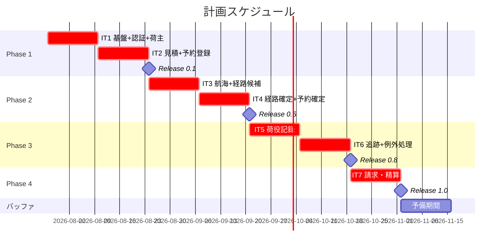
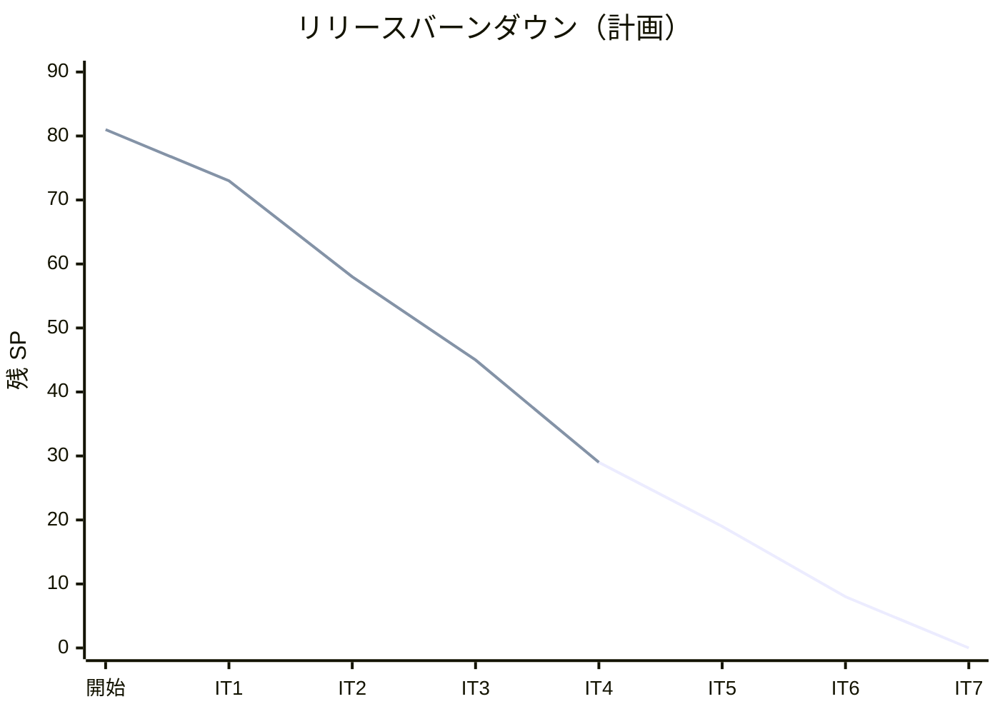

# リリース計画 - 国際貨物輸送管理システム（TypeScript 版）

## 概要

本ドキュメントは、国際貨物輸送管理システム（Cargo Tracker TypeScript 版）のリリース計画を定義します。

### プロジェクト情報

| 項目 | 内容 |
|------|------|
| **プロジェクト名** | Cargo Tracker（TypeScript 版） |
| **目的** | 国際貨物の見積・予約・経路設計・荷役・追跡・請求を一元管理する Web システムの構築 |
| **対象ユーザー** | 荷主、営業担当者、経路設計者、追跡管理者、荷役作業員、経理担当者 |
| **開発チーム** | 開発者 1 名（AI エージェント協働） |

---

## 満足条件

### スコープ

ユーザーストーリー 27 件（[user_story.md](../requirements/user_story.md)）を 4 フェーズに分けて段階的にリリースします。
基幹フロー（予約 → 経路 → 荷役 → 追跡）を優先し、請求・精算（優先度: 中）を最終フェーズに置きます。

| フェーズ | 内容 | ストーリー数 |
|---------|------|---------------|
| Phase 1 | 基盤 + 認証 + 荷主・予約登録（MVP） | 8 US |
| Phase 2 | 航海スケジュール + 経路設計 + 予約確定 | 10 US |
| Phase 3 | 荷役 + 追跡 + 例外処理 | 6 US |
| Phase 4 | 請求・精算 | 3 US |
| **合計** | | **27 US** |

### スケジュール

- **開発期間**: 2026-07-27 〜 2026-11-13（14 週 + バッファ 2 週）
- **イテレーション**: 2 週間 × 7 イテレーション
- **リリース**: フェーズ完了ごとに段階的リリース（v0.1 → v0.5 → v0.8 → v1.0）

### リソース

- **開発者**: 1 名（AI エージェント協働）
- **想定稼働時間**: 20 時間/週

---

## ユーザーストーリー一覧とストーリーポイント

### 優先順位マトリックス

4 軸評価で優先順位を決定:

1. **金銭価値（BV）**: ビジネス価値
2. **コスト（C）**: 開発コスト
3. **知識習得（KA)**: 技術的学習価値
4. **リスク軽減（RR)**: リスク軽減効果

### Phase 1: 基盤 + 認証 + 荷主・予約登録（イテレーション 1-2）

| ID | ユーザーストーリー | SP | BV | C | KA | RR | 優先度 |
|----|-------------------|----|----|---|----|----|--------|
| US26 | システムにログインする | 3 | 高 | 中 | 高 | 高 | 必須 |
| US27 | システムからログアウトする | 1 | 中 | 低 | 低 | 低 | 中 |
| US02 | 荷主を登録する | 2 | 高 | 低 | 中 | 中 | 必須 |
| US03 | 法人荷主を登録する | 2 | 高 | 低 | 低 | 低 | 必須 |
| US01 | 輸送見積を作成する | 5 | 高 | 中 | 高 | 中 | 必須 |
| US04 | 貨物予約を登録する | 5 | 高 | 高 | 高 | 高 | 必須 |
| US05 | 危険物・冷凍貨物の予約を登録する | 3 | 高 | 中 | 中 | 中 | 必須 |
| US06 | 予約情報を経路設計者に引き渡す | 2 | 高 | 低 | 中 | 中 | 必須 |
| **合計** | | **23** | | | | | |

### Phase 2: 航海スケジュール + 経路設計 + 予約確定（イテレーション 3-4）

| ID | ユーザーストーリー | SP | BV | C | KA | RR | 優先度 |
|----|-------------------|----|----|---|----|----|--------|
| US24 | 航海スケジュールを新規登録する | 3 | 高 | 中 | 中 | 高 | 必須 |
| US25 | 既存航海スケジュールを更新する | 2 | 高 | 低 | 低 | 中 | 必須 |
| US07 | 航海スケジュールを検索する | 3 | 高 | 中 | 中 | 中 | 必須 |
| US08 | 経路候補を算出する | 5 | 高 | 高 | 高 | 高 | 必須 |
| US09 | 経路を選択・確定する | 3 | 高 | 中 | 中 | 中 | 必須 |
| US10 | 経路条件を調整して再算出する | 3 | 中 | 中 | 中 | 低 | 中 |
| US11 | 経路情報を予約に紐付ける | 3 | 高 | 中 | 中 | 高 | 必須 |
| US12 | 確定経路を荷主に通知する | 2 | 中 | 低 | 中 | 低 | 中 |
| US13 | 予約を確定する | 3 | 高 | 中 | 中 | 高 | 必須 |
| US14 | 追跡番号を発行する | 2 | 高 | 低 | 中 | 高 | 必須 |
| **合計** | | **29** | | | | | |

### Phase 3: 荷役 + 追跡 + 例外処理（イテレーション 5-6）

| ID | ユーザーストーリー | SP | BV | C | KA | RR | 優先度 |
|----|-------------------|----|----|---|----|----|--------|
| US15 | 荷役作業を記録する | 5 | 高 | 高 | 高 | 高 | 必須 |
| US16 | 引取作業を記録する | 3 | 高 | 中 | 中 | 中 | 必須 |
| US17 | 貨物状態を手動更新する | 2 | 中 | 低 | 低 | 中 | 中 |
| US18 | 追跡情報を照会する | 5 | 高 | 中 | 高 | 中 | 必須 |
| US19 | 遅延例外を処理する | 3 | 高 | 中 | 中 | 高 | 必須 |
| US20 | 破損・紛失例外を処理する | 3 | 高 | 中 | 中 | 高 | 必須 |
| **合計** | | **21** | | | | | |

### Phase 4: 請求・精算（イテレーション 7）

| ID | ユーザーストーリー | SP | BV | C | KA | RR | 優先度 |
|----|-------------------|----|----|---|----|----|--------|
| US21 | 輸送料金を算出する | 3 | 高 | 中 | 中 | 中 | 中 |
| US22 | 法人割引を適用する | 2 | 中 | 低 | 低 | 中 | 中 |
| US23 | 精算を処理する | 3 | 高 | 中 | 中 | 中 | 中 |
| **合計** | | **8** | | | | | |

### 全体サマリー

| フェーズ | ストーリーポイント | イテレーション |
|---------|-------------------|---------------|
| Phase 1 | 23 SP | 1-2 |
| Phase 2 | 29 SP | 3-4 |
| Phase 3 | 21 SP | 5-6 |
| Phase 4 | 8 SP | 7 |
| **合計** | **81 SP** | 7 イテレーション |

---

## ベロシティ見積もり

### 初期ベロシティ推定

| 項目 | 値 |
|------|-----|
| **イテレーション期間** | 2 週間 |
| **チーム規模** | 1 名（AI エージェント協働） |
| **想定ベロシティ** | 12-16 SP/イテレーション |
| **バッファ係数** | 0.8（20% バッファ） |
| **実効ベロシティ** | 10-13 SP/イテレーション |

> **Note**: IT1 はウォーキングスケルトン構築（NestJS 雛形・CI・dependency-cruiser・pg-mem/Testcontainers 基盤・TSX SSR 配線）に工数を割くため、ストーリー消化は 8 SP に抑えます。

### ベロシティ検証計画

- IT1〜IT3 の実績ベロシティを記録し、IT4 開始前に Phase 2 以降の計画を再調整する
- 1 SP あたりの実績時間を計測し、見積もり精度を毎イテレーション末に確認する

---

## 段階的リリース戦略

### リリーススケジュール

#### 計画スケジュール

#### 実績スケジュール

実績は各イテレーション完了時に記録します。

### リリース内容

#### Release 0.1（Phase 1 完了）: 予約受付 MVP

**目標**: 認証済みユーザーが荷主を登録し、見積を作成し、貨物予約を登録して経路設計者へ引き渡せる。

**含まれる機能**:

- ログイン/ログアウト（6 ロール RBAC、アカウントロック）
- 荷主登録（個人/法人、割引率 0〜30%）
- 輸送見積作成（ルート候補はスタブ）
- 貨物予約登録（荷受人必須、危険物・冷凍対応）・経路設計者への引き渡し

**リリース条件**:

- [ ] 全ユニットテスト・統合テストがパス（Testcontainers）
- [ ] dependency-cruiser のアーキテクチャルールがパス
- [ ] デモ項目の E2E テスト（Playwright）がパス

#### Release 0.5（Phase 2 完了）: 経路設計・予約確定

**目標**: 経路設計者が航海スケジュールから経路を設計し、荷主への提案を経て予約を確定・追跡番号を発行できる。

**含まれる機能**:

- 航海スケジュール登録・更新・検索
- 経路候補算出（外部経路サービス ACL + フォールバック）・条件調整・確定
- 経路の予約紐付け（ROUTING_IN_PROGRESS → ROUTE_PROPOSED）・荷主通知
- 予約確定・追跡番号発行

**リリース条件**:

- [ ] 全テストがパス（nock 契約テスト含む）
- [ ] 基幹フロー（予約 → 経路 → 確定）の E2E テストがパス

#### Release 0.8（Phase 3 完了）: 荷役・追跡

**目標**: 荷役作業の記録が追跡情報に反映され、荷主・荷受人が公開ページで貨物を追跡でき、例外を管理できる。

**含まれる機能**:

- 荷役作業・引取作業の記録（妥当性検証・MISROUTED 判定）
- 追跡照会（認証済み + 公開ページ、htmx 30 秒ポーリング）
- 貨物状態の手動更新
- 遅延・破損・紛失の例外処理（エスカレーション・対応報告）

**リリース条件**:

- [ ] 全テストがパス
- [ ] 追跡ポーリング・公開ページの E2E テストがパス

#### Release 1.0（Phase 4 完了）: 完成版

**目標**: 輸送料金の算出から精算まで、業務フロー全体が一気通貫で動作する。

**含まれる機能**:

- 輸送料金算出（基本料金 + 割増）
- 法人割引適用（0〜30%）
- 精算処理（請求書発行 → 入金確認 → 精算完了）

**リリース条件**:

- [ ] 全テストがパス
- [ ] カバレッジ目標達成（ドメイン 85% / アプリケーション 80% / 全体 75%）
- [ ] セキュリティチェックリスト完了

---

## バッファ戦略

### フィーチャバッファ

| フェーズ | 計画 SP | バッファ（30%） | 実効 SP |
|---------|---------|-----------------|---------|
| Phase 1 | 23 | 7 | 16 |
| Phase 2 | 29 | 9 | 20 |
| Phase 3 | 21 | 6 | 15 |
| Phase 4 | 8 | 2 | 6 |

### スケジュールバッファ

- **予備イテレーション**: IT7 後に 2 週間（1 イテレーション分）
- **全体バッファ**: 約 14%（14 週に対して 2 週）

### バッファ消費ルール

1. フィーチャバッファを先に消費（優先度「中」のストーリー: US10・US12・US17・US27 を後回し候補とする）
2. 低優先度ストーリーを後回し
3. スケジュールバッファは最後の手段

---

## イテレーション計画概要

### イテレーション 1（Week 1-2）

> 詳細計画: [イテレーション 1 計画](iteration_plan-1.md)（状態: 完了） / [ふりかえり](retrospective-1.md) / [完了報告書](iteration_report-1.md)

**ゴール**: ウォーキングスケルトンを構築し、認証と荷主登録が動く状態にする。

**主なタスク**:

- [x] NestJS 雛形・ディレクトリ規約・dependency-cruiser・CI・pg-mem/Testcontainers 基盤・TSX SSR 配線（ウォーキングスケルトン）
- [x] US26/US27: ログイン・ログアウト（RBAC 6 ロール）
- [x] US02/US03: 荷主登録（個人/法人）

**目標 SP**: 8 / **実績 SP**: 8（達成率 100%）

### イテレーション 2（Week 3-4）

> 詳細計画: [イテレーション 2 計画](iteration_plan-2.md)（状態: 完了） / [ふりかえり](retrospective-2.md) / [完了報告書](iteration_report-2.md)

**ゴール**: 見積作成から貨物予約登録・経路設計者への引き渡しまでの MVP フローを完成させる。

**主なタスク**:

- [x] US01: 輸送見積作成（ルート候補スタブ）
- [x] US04/US05: 貨物予約登録（荷受人必須・危険物/冷凍）
- [x] US06: 経路設計者への引き渡し（ROUTING_IN_PROGRESS）

**目標 SP**: 15 / **実績 SP**: 15（達成率 100%）。Phase 1（MVP）完了。

### イテレーション 3（Week 5-6）

> 詳細計画: [イテレーション 3 計画](iteration_plan-3.md)（状態: 完了） / [ふりかえり](retrospective-3.md) / [完了報告書](iteration_report-3.md)

**ゴール**: 航海スケジュール管理と経路候補算出を実装する。

**主なタスク**:

- [x] US24/US25: 航海スケジュール登録・更新
- [x] US07: 航海スケジュール検索
- [x] US08: 経路候補算出（外部経路サービス ACL + fetch mock 契約テスト）

**目標 SP**: 13 / **実績 SP**: 13（達成率 100%）。Phase 2 は 13/29 SP 完了。

### イテレーション 4（Week 7-8）

> 詳細計画: [イテレーション 4 計画](iteration_plan-4.md)（状態: 完了） / [ふりかえり](retrospective-4.md) / [完了報告書](iteration_report-4.md)

**ゴール**: 経路確定から予約確定・追跡番号発行までを完成させる（Release 0.5）。

**主なタスク**:

- [x] US09/US10/US11: 経路選択・調整・予約紐付け
- [x] US12: 荷主通知
- [x] US13/US14: 予約確定・追跡番号発行

**目標 SP**: 16

### イテレーション 5（Week 9-10）

**ゴール**: 荷役作業の記録と貨物状態管理を実装する。

**主なタスク**:

- [ ] US15: 荷役作業記録（妥当性検証・MISROUTED 判定）
- [ ] US16: 引取作業記録（通関 CLEARED 前提条件）
- [ ] US17: 貨物状態の手動更新

**目標 SP**: 10

### イテレーション 6（Week 11-12）

**ゴール**: 追跡照会（公開ページ含む）と例外処理を完成させる（Release 0.8）。

**主なタスク**:

- [ ] US18: 追跡照会（認証済み + 公開ページ、htmx ポーリング）
- [ ] US19/US20: 遅延・破損・紛失の例外処理

**目標 SP**: 11

### イテレーション 7（Week 13-14）

**ゴール**: 請求・精算を完成させ、v1.0 をリリースする。

**主なタスク**:

- [ ] US21/US22: 輸送料金算出・法人割引
- [ ] US23: 精算処理（請求書 → 入金 → 精算完了）
- [ ] カバレッジ・セキュリティの最終確認

**目標 SP**: 8

---

## リスク管理

### 技術リスク

| リスク | 影響度 | 発生確率 | 対策 |
|--------|--------|----------|------|
| TSX SSR + htmx の非典型構成による実装の手戻り | 中 | 中 | IT1 のウォーキングスケルトンで SSR 配線・フラグメント分岐を検証してから本実装に入る |
| pg-mem と実 PostgreSQL の SQL 互換性乖離 | 中 | 中 | 合否判定は Testcontainers を正とし、乖離検出時は Docker Compose で再現確認（ADR-004） |
| EventEmitter コンテキスト間連携の結果整合の破れ | 中 | 低 | コミット後発行・冪等リスナーの規律を統合テストで検証（ADR-005） |
| 外部 5 ポートの仕様不確定 | 中 | 中 | nock 契約テストでスタブ契約を固定し、フォールバックを必ず実装 |

### スケジュールリスク

| リスク | 影響度 | 発生確率 | 対策 |
|--------|--------|----------|------|
| IT1 の基盤構築が超過しストーリーを圧迫 | 高 | 中 | IT1 の目標 SP を 8 に抑制済み。超過時は US27（1 SP）を IT2 へ繰り越す |
| Phase 2 の経路設計（29 SP）が計画超過 | 高 | 中 | US10・US12 をフィーチャバッファとして後回し可能にする |
| ベロシティが想定を下回る | 中 | 中 | IT3 終了時に実績で再計画。優先度「中」の 4 US（9 SP）を v1.1 送りにできる |

---

## 進捗管理

### メトリクス

| メトリクス | 目標 |
|-----------|------|
| ベロシティ | 10-16 SP/イテレーション |
| テストカバレッジ | ドメイン 85% / アプリケーション 80% / 全体 75% |
| バグ密度 | 0.5 件/SP 以下 |
| 予定達成率 | 90% 以上 |

### 進捗状況

| イテレーション | 計画 SP | 実績 SP | 達成率 | 状態 |
|---------------|---------|---------|--------|------|
| 1 | 8 | 8 | 100% | 完了 |
| 2 | 15 | 15 | 100% | 完了 |
| 3 | 13 | 13 | 100% | 完了 |
| 4 | 16 | 16 | 100% | 完了 |
| 5 | 10 | - | - | 未着手 |
| 6 | 11 | - | - | 未着手 |
| 7 | 8 | - | - | 未着手 |

### バーンダウンチャート

---

## 次のステップ

1. 開発戦略の策定（`creating-development-strategy`）— 局面別 TDD アプローチとウォーキングスケルトンの方針を文書化
2. イテレーション 1 計画の作成（`planning-releases --iteration 1`）と整合性検証（`validating-iteration-plan`）
3. ウォーキングスケルトンの構築（`apps/cargo-tracker` の雛形・CI・品質ゲート）

---

## 更新履歴

| 日付 | 更新内容 | 更新者 |
|------|---------|--------|
| 2026-07-27 | 初版作成 | k2works |
| 2026-07-29 | IT3 完了実績・Phase 2 進捗を反映 | Codex |
