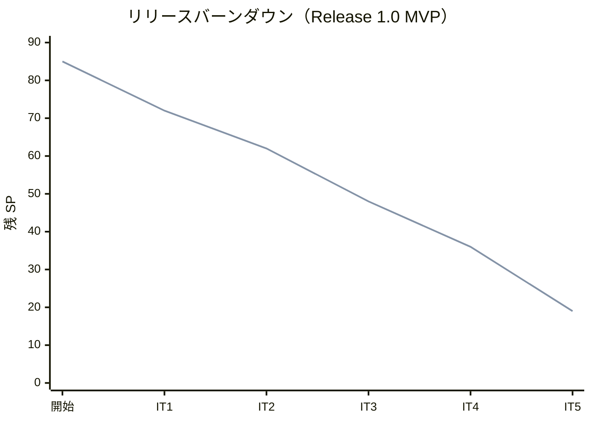

# リリース完了報告書 v1.0.0（MVP） - 国際貨物輸送管理システム（Cargo Tracker C# 版）

## 概要

本ドキュメントは、国際貨物輸送管理システム（Cargo Tracker C# 版）の **Release 1.0（MVP・Phase 1）** の完了報告書です。DDD の 8 コンテキストのうち中核（Booking・Routing・Tracking・Handling）を提供し、見積から追跡照会までの予約〜追跡の業務ライフサイクルを全層で完結させました。

- リリース: Release 1.0（MVP）
- 対象イテレーション: IT1〜IT5（Phase 1）
- 完了時点: 2026-07-13（IT5 開発完了）

## プロジェクトサマリー

| 項目 | 内容 |
|------|------|
| プロジェクト名 | 国際貨物輸送管理システム（Cargo Tracker C# 版） |
| リリース | Release 1.0（MVP・Phase 1） |
| スコープ | 認証・見積・荷主・予約・経路設計・予約確定・追跡番号発行・荷役/引取・追跡照会（21 US） |
| アーキテクチャ | ヘキサゴナル + DDD（境界づけられたコンテキスト独立）、ASP.NET Core MVC + htmx、Dapper、二方言（SQLite/PostgreSQL） |
| 開発手法 | XP（TDD・小さなリリース・継続的インテグレーション）。開発戦略：序盤アウトサイドイン（IT1-2）→ 中盤インサイドアウト（IT3-5） |

## 計画と実績の差異分析

### イテレーション別達成状況

| イテレーション | ゴール | 計画 SP | 実績 SP | 達成率 |
|---------------|--------|---------|---------|--------|
| IT1 | 認証・荷主・見積の縦切り（歩けるスケルトン） | 13 | 13 | 100% |
| IT2 | 貨物予約・危険物冷凍・経路設計引き渡し | 10 | 10 | 100% |
| IT3 | 航海スケジュール・経路候補算出（Routing BC） | 14 | 14 | 100% |
| IT4 | 経路選択・紐付け・通知・予約確定（BC 連携 ACL） | 12 | 12 | 100% |
| IT5 | 追跡番号発行・荷役/引取・追跡照会（Tracking/Handling BC） | 17 | 17 | 100% |
| **合計** | | **66** | **66** | **100%** |

### リリース別達成状況

| リリース | フェーズ | SP | 状態 |
|---------|---------|-----|------|
| Release 1.0 MVP | Phase 1（IT1-5） | 66 | **完了** |
| Release 1.1 | Phase 2（IT6-7） | 19 | 未着手 |

### リリースバーンダウン

- 5 イテレーション連続で計画=実績が一致。Phase 1（66 SP）を計画どおり消化し、残 19 SP は Release 1.1（IT6-7）。

## コミットログ分析

### コミットプリフィックス別内訳（csharp/take-1 全体）

| プリフィックス | 件数 | 用途 |
|--------------|------|------|
| docs | 64 | 設計・計画・報告・レビュー・ADR |
| feat | 46 | 新機能 |
| chore | 14 | ビルド・ツール・品質基盤 |
| refactor | 8 | リファクタリング |
| fix | 8 | バグ修正 |
| test | 6 | テスト追加 |
| **合計** | **148** | |

### 分析

- ドキュメント駆動（docs 64 件）で設計・計画・ふりかえり・ADR・レビューを厚く残し、意思決定の追跡性を確保した。
- feat 46 件は 21 US ＋ BC 連携 ACL ＋ イベントハンドラの積み上げ。1 ストーリー・1 レイヤー単位の小さなコミット規律を維持。
- fix 8 件は少なく、TDD と着手前 2 段階検証（validating-iteration-plan/validating-design）が手戻りを抑えた。

## 品質メトリクス

### テスト数のリリース別推移

| イテレーション | 累計テスト数 | 増分 |
|---------------|------------|------|
| IT1 | 74 | +74 |
| IT2 | 117 | +43 |
| IT3 | 161 | +44 |
| IT4 | 198 | +37 |
| IT5 | 235 | +37 |

- **Release 1.0 完了時点 235 テスト全パス**（Domain 108 / Application 3 / Architecture 6 / Web 58 / E2E 4 / Infrastructure 56）。ビルド警告 0。

### 静的解析

- SonarQube 初回スキャン（IT3 時点）で Quality Gate OK・Bug 0・脆弱性 0・A 評価。BLOCKER/CRITICAL は是正済み。SQ-2〜5（MAJOR/MINOR）とカバレッジ取込ゲート化は Release 1.1（IT6）へ繰り越し。
- `Architecture.Tests`（ArchUnit）で全 BC の依存方向（他 BC 内部型への非依存・ACL 経由のみ）を全期間グリーンで担保。

### ベロシティ

- IT1=13・IT2=10・IT3=14・IT4=12・IT5=17。平均 **13.2 SP/IT**。3 イテレーション以降で安定し、計画は現状維持で完走した。

## リリース履歴

| バージョン | 日付 | 内容 |
|-----------|------|------|
| v1.0.0（MVP） | 2026-07-13 | Release 1.0 MVP 開発完了（Phase 1・IT1-5・66 SP） |

## 主要な成果物

### 実装した主要機能

- **認証・ナビゲーション基盤**（US26）: Cookie 認証・ロール別ナビゲーション・ウォーキングスケルトン。
- **見積・荷主・予約**（US01-06）: 輸送見積、荷主/法人荷主登録、貨物予約（危険物・冷凍）、経路設計引き渡し。
- **航海・経路設計**（US07-13, US24-25）: 航海スケジュール登録/更新/検索、経路候補算出、経路選択・確定、予約紐付け、荷主通知、予約確定/差戻/キャンセル。
- **追跡・荷役**（US14-18）: 追跡番号発行（イベント駆動自動発行）、荷役記録（受領/積込/荷降し・妥当性検証）、引取（配送完了）、状態手動更新、追跡照会（認証・公開ページ）。

### 技術的成果

- **4 つの境界づけられたコンテキスト**（Booking・Routing・Tracking・Handling）を BC 独立で確立。BC 連携はすべて ACL（SQL 直接参照＋プリミティブ DTO）とドメインイベント（post-commit）で疎結合化。
- **イベント駆動の状態同期**: 予約確定→追跡番号発行、荷役登録→追跡イベント追記・予約状態同期を MediatR の post-commit ディスパッチで実装。
- **ヘキサゴナル基盤**: Unit of Work + AmbientTransaction（ADR-0006）、post-commit イベント（ADR-0002）、version 楽観ロック（ドメイン先行）、二方言 SQL（ADR-0003）。
- **8 件の ADR** で主要な設計判断を記録（集約永続化・UoW・二方言・認証・CQRS・AmbientTransaction・BC 独立・外部経路サービス契約）。

## 総評

Release 1.0（MVP・Phase 1）は、計画 66 SP を **5 イテレーション連続で計画どおり（達成率 100%）** 消化し、予約〜追跡の業務ライフサイクルを全層で完結させて出荷条件を充足した。序盤アウトサイドイン（歩けるスケルトン）→ 中盤インサイドアウト（ドメイン中核の作り込み）という開発戦略が機能し、4 コンテキストのドメインを堅牢に組み上げられた。着手前の 2 段階検証（validating-iteration-plan/validating-design）とマルチパースペクティブレビュー（developing-review）が設計整合と品質を支え、fix コミットは少数に留まった。

一方、品質ゲート（カバレッジ 85% ハードゲート・SonarQube SQ-2〜5・Playwright E2E）は環境操作を前提とするため 3 イテレーション跨ぎで Release 1.1（IT6）へ繰り越した。またメール通知の実送信基盤が未整備（通知は記録のみ）で、Release 1.1 での対応が必要。BookingStatus の永続化表現不一致（潜在バグ）を IT5 で是正した教訓から、列挙型↔DB 文字列の変換規約の ADR 化を次リリースの改善アクションとする。

次は終盤（IT6-7・アウトサイドイン）で、中盤までに整えたドメイン中核の上に例外対応・請求精算を業務シナリオ起点で結合し、Release 1.1（完成版）を出荷する。

## 関連ドキュメント

- [リリース計画](./release_plan.md)
- [イテレーション 1-5 完了報告書](./iteration_report-5.md)
- [イテレーション 5 ふりかえり](./retrospective-5.md)
- [開発戦略](./development_strategy.md)
- [ADR 一覧](../adr/index.md)
- [開発成果物レビュー（IT1-IT4）](../review/index.md)
