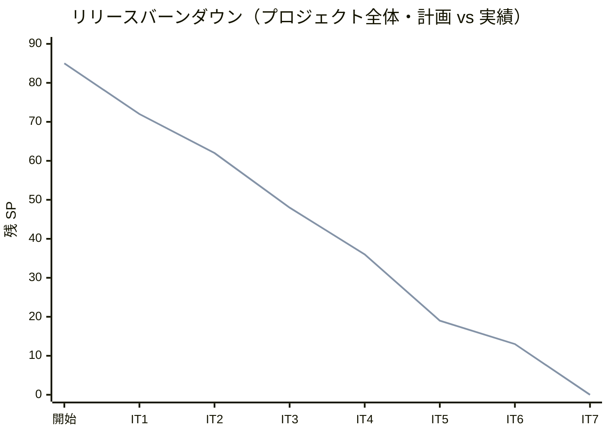

# リリース完了報告書 v1.1.0 - 国際貨物輸送管理システム（Cargo Tracker C# 版）

## 概要

本ドキュメントは、国際貨物輸送管理システム（Cargo Tracker C# 版）の **Release 1.1（Phase 2）** の完了報告書です。Release 1.0（MVP）の予約〜追跡フローに、追跡例外対応（遅延/破損/紛失）と請求・精算（料金算出・法人割引・精算処理）を追加し、Billing コンテキストを立ち上げて業務ライフサイクルを完結させました。計画の全ユーザーストーリー（US01-26）の機能実装が完了しています。

- リリース: Release 1.1（Phase 2）
- 対象イテレーション: IT6〜IT7（Phase 2）
- 完了時点: 2026-07-14（IT7 開発完了）

## プロジェクトサマリー

| 項目 | 内容 |
|------|------|
| プロジェクト名 | 国際貨物輸送管理システム（Cargo Tracker C# 版） |
| リリース | Release 1.1（Phase 2） |
| スコープ | 追跡例外対応（遅延/破損/紛失・エスカレーション・通知）、輸送料金算出、法人割引、精算処理（精算書発行・入金確認・予約 Settled 同期）（5 US・19 SP） |
| アーキテクチャ | ヘキサゴナル + DDD（境界づけられたコンテキスト独立）、ASP.NET Core MVC + htmx、Dapper、二方言（SQLite/PostgreSQL） |
| 開発手法 | XP（TDD・小さなリリース・継続的インテグレーション）。開発戦略：終盤アウトサイドイン（IT6-7・業務シナリオ起点の結合） |

## 計画と実績の差異分析

### イテレーション別達成状況

| イテレーション | ゴール | 計画 SP | 実績 SP | 達成率 |
|---------------|--------|---------|---------|--------|
| IT6 | 遅延・破損・紛失の例外登録とエスカレーション・通知（Tracking BC 拡張） | 6 | 6 | 100% |
| IT7 | 輸送料金算出・法人割引・精算処理（Billing BC 立ち上げ） | 13 | 13 | 100% |
| **合計** | | **19** | **19** | **100%** |

### リリース別達成状況

| リリース | フェーズ | SP | 状態 |
|---------|---------|-----|------|
| Release 1.0 MVP | Phase 1（IT1-5） | 66 | **完了** |
| Release 1.1 | Phase 2（IT6-7） | 19 | **完了** |
| **プロジェクト全体** | | **85** | **完了（100%）** |

### リリースバーンダウン

- 7 イテレーション連続で計画=実績が一致。全 85 SP を計画どおり消化し、残 0 SP。Phase 2（19 SP）で追跡例外・請求精算を完結。

## コミットログ分析

### コミットプリフィックス別内訳（Phase 2・IT6-7）

| プリフィックス | 件数 | 割合 |
|---------------|------|------|
| docs | 27 | 61% |
| feat | 11 | 25% |
| test | 3 | 7% |
| refactor | 2 | 5% |
| fix | 1 | 2% |
| **合計** | **44** | **100%** |

### 分析

- **feat 25%**: 例外対応（Tracking BC 拡張）・Billing BC 立ち上げ（Invoice/Money/料金算出/割引/精算）の新機能実装。
- **docs 61%**: 計画・設計ドキュメント（domain-model/data-model/ui_design）の実装整合・ADR-0009・2 件の正式レビュー文書・ふりかえり/完了報告書。設計と実装の整合を都度反映する規律を維持。
- **test/refactor/fix**: 状態同期 E2E・冪等性テスト・変換ヘルパ Shared 集約（負債返済）・延滞発火の是正（レビュー H1）。

## 品質メトリクス

### テスト数のリリース別推移

| イテレーション | 累計テスト数 | 増分 | フェーズ |
|---------------|------------|------|---------|
| IT5 | 235 | +37 | Phase 1 完了 |
| IT6 | 255 | +20 | Phase 2 |
| IT7 | 302 | +47 | Phase 2 完了 |

- Release 1.1 完了時点で **全 302 テスト緑**（Domain 140 / App 3 / Arch 9 / Web 66 / E2E 4 / Infra 80）・ビルド警告 0。

### 静的解析・カバレッジ

- ドメイン層被覆（実測）: Tracking 例外 96-98%（IT6）、Billing Invoice 95.2%・Money 86.7%・DiscountRate/FreightCalculator 100%（IT7）。
- ArchUnit 9 ルール緑（Booking/Routing/Tracking/Handling/Billing の BC 独立を継続検証）。
- SonarQube スキャン・カバレッジ CI ハードゲート・Playwright E2E は環境操作前提で繰り越し（5 IT 連続。Web.Tests で機能担保）。

### ベロシティ

- Phase 2 実績: IT6=6・IT7=13。プロジェクト全体平均 **12.1 SP/IT**（IT1-7）。7 イテレーション連続で計画=実績が一致。

## リリース履歴

| バージョン | リリース | 完了時点 | 内容 |
|-----------|---------|---------|------|
| v1.0.0 | Release 1.0 MVP（Phase 1） | 2026-07-13 | 認証・見積・荷主・予約・経路設計・確定・追跡・荷役（21 US・66 SP） |
| v1.1.0 | Release 1.1（Phase 2） | 2026-07-14 | 追跡例外対応・請求精算（5 US・19 SP）。Billing BC 立ち上げ |

## 主要な成果物

### 実装した主要機能（Phase 2）

- **追跡例外対応（US19/US20）**: 遅延・破損・紛失の例外登録、単一未解決不変条件、状態復帰、紛失時の管理職エスカレーション、荷主/管理職への append-only 通知記録。
- **輸送料金算出（US21）**: 配送完了予約に限定した料金算出（Delivered 制限）、FreightCalculator（重量×貨物種別割増）による基本料金、精算書発行。
- **法人割引（US22）**: Shipper 契約割引率の ACL 取得・自動適用（0〜30%・銀行家丸め）、割引根拠の明細記載。
- **精算処理（US23）**: 精算書発行・入金確認（決済ゲートウェイスタブ）・PaymentStatus 遷移・予約 Settled 同期・支払期限超過の延滞発火。

### 技術的成果

- **Billing コンテキストの立ち上げ**: Invoice 集約・Money 値オブジェクト（銀行家丸め・通貨不一致禁止）・DiscountRate・PaymentStatus を domain-model 準拠で実装。既存 BC の ACL・post-commit イベント・集約永続化パターンを忠実に踏襲。
- **ADR-0009（post-commit 連鎖の結果整合性方針）の確立と適用**: 冪等・失敗ログ・状態導出・Outbox 移行方針を明文化し、例外通知・精算状態同期に適用。
- **技術的負債の返済**: 3 IT 越しの変換ヘルパ重複（IT4 M1）を `DatabaseTimestamp`/`EnumDbCodec` として Shared 集約。
- **2 回の正式マルチパースペクティブレビュー（XP 5 視点）**: IT6（高 2/中 7/低 7）・IT7（高 1/中 5/低 6）を実施し、高・中優先の是正をイテレーション内で消化。

## 総評

Release 1.1（Phase 2）は計画どおり 19 SP を消化し、追跡例外対応と請求・精算を全層で完結させました。終盤（アウトサイドイン）の戦略に従い、中盤で作り込んだドメイン中核を再利用して業務シナリオ起点で結合できたことが、Billing BC の短期立ち上げと高品質（ドメイン被覆 86-100%・全 302 テスト緑）につながりました。ADR-0009 による結果整合性方針の確立、変換ヘルパの負債返済、2 回の正式レビュー是正により、「変更を楽に安全にできる」構造を維持しています。

計画の全ユーザーストーリー（US01-26・85 SP）の機能実装が完了し、見積〜追跡〜例外〜請求精算の業務ライフサイクルが一気通貫で動作します。残課題は環境操作を前提とする品質ゲート（Playwright E2E・カバレッジ CI ハードゲート・SonarQube）と、実決済機関連携時の payment 永続化・決済冪等であり、いずれもリリース前チェック・後続対応として計画に記録済みです。

## 関連ドキュメント

- [リリース計画](./release_plan.md)
- [リリース完了報告書 v1.0.0（MVP）](./release_report-1.0.md)
- [イテレーション 6 完了報告書](./iteration_report-6.md) / [ふりかえり](./retrospective-6.md)
- [イテレーション 7 完了報告書](./iteration_report-7.md) / [ふりかえり](./retrospective-7.md)
- [開発成果物レビュー（IT6）](../review/開発成果物_IT6_review_20260714.md) / [（IT7）](../review/開発成果物_IT7_review_20260714.md)
- [ADR-0009 post-commit イベント連鎖の結果整合性方針](../adr/0009-post-commitイベント連鎖の結果整合性方針.md)
